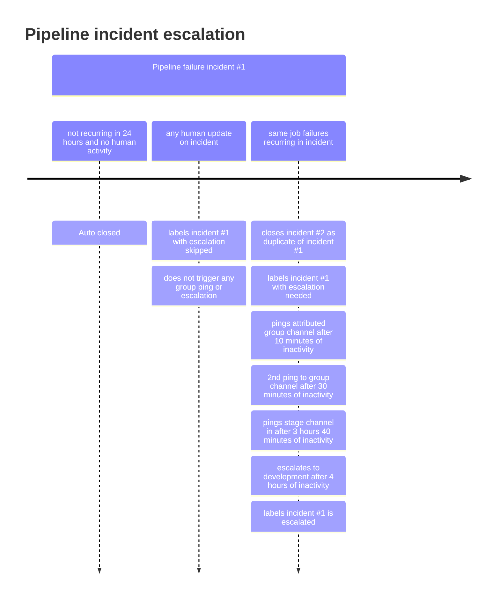

このドキュメントは GitLab Inc. において Issue を扱うすべての人のワークフローを説明します。
より広いコミュニティに適用されるワークフローについては、[contributing guide](https://docs.gitlab.com/ee/development/contributing/) を参照してください。

## GitLab Flow

GitLab のプロダクトは [GitLab Flow](https://about.gitlab.com/blog/2023/07/27/gitlab-flow-duo/) を使って構築されています。

私たちには[コードレビューに関する固有のルール](/handbook/engineering/workflow/code-review/)があります。

## マージリクエストのリバート

[short toes](/handbook/values/#short-toes)、[2 way door な意思決定を行う](/handbook/values/#make-two-way-door-decisions)、
[アクションへのバイアス](/handbook/values/#operate-with-a-bias-for-action)という私たちの価値観に沿って、誰でも
マージリクエストのリバートを提案できます。MR をリバートすべきかを判断する際には、
次のことが真である必要があります:

- 何かが壊れており、許容可能な回避策がない。例:
  - 機能が壊れて `~severity::1` または `~severity::2` に分類された。
  [重要度ラベルを参照](/handbook/product-development/how-we-work/issue-triage/#severity)
  - [Master が壊れた](#broken-master)
  - 失敗するマイグレーションがある
- 変更への依存関係がない。たとえばデータベース
マイグレーションが本番で実行されていない。

機能変更を含まず、既存の機能を削除しないマージリクエストのリバートは、
合議制での設計を防ぐために避けるべきです。

リバートの意図は、元の作成者を非難することでは決してありません。さらに、元の作成者に通知することは
必要なフォローアップアクションに DRI として参加できるようにする上でも有用です。

`master` を修正するマージリクエストには、MR パイプラインを高速化するため、いくつかの非必須ジョブをスキップする目的で `pipeline::expedited` ラベルと、`master:broken` または `master:foss-broken` ラベルを設定する必要があります。

## `master` の破損

[GitLab](https://gitlab.com/gitlab-org/gitlab) または [GitLab FOSS](https://gitlab.com/gitlab-org/gitlab-foss) の `master` ブランチのパイプラインが失敗していることに気づいた場合、ビルドを成功状態に戻すことは他のすべての開発関連作業に優先します。テストが壊れている間に行うすべての作業は、次のような可能性があるためです:

- 既存の機能を壊す
- 新しいバグやセキュリティ問題を導入する
- すべてのエンジニアリングとリリースプロセスの生産性を妨げる

### `master` が壊れているとは?

`master` の破損とは、`master` のパイプラインが失敗しているイベントです。

[マージ済み結果パイプライン](https://docs.gitlab.com/ee/ci/pipelines/merged_results_pipelines.html) を使用しているため、時間が経つにつれてテスト失敗を修正するコストは指数関数的に増加します。自動デプロイや、月次リリース、セキュリティリリースは、タグ付けと[バックポートのマージ](https://gitlab.com/gitlab-org/release/docs/-/blob/master/general/security/release-manager.md#regular-security-releases)のために `gitlab-org/gitlab` master が green であることに依存しています。

私たちの目標は、`master` を失敗から自由に保つことであり、壊れた後にだけ `master` を修正することではありません。

破損 `master` 自動化プロセスを所有する `#g_development_analytics` チャンネルでの質問や提案を歓迎します。

### 破損 `master` のサービスレベル目標

破損 `master` インシデントを修正するための 2 つのフェーズがあり、緊急性を明確にするためのターゲット SLO が設定されています。解決フェーズはトリアージフェーズの完了に依存します。

| フェーズ | サービスレベル目標 | DRI |
| --- | --- | --- |
| [Triage](#triage-broken-master) | 破損 `master` インシデントの 2 回目発生時のインシデント作成からアサインまで 4 時間 | インシデントにラベル付けされたグループ |
| [Resolution](#resolution-of-broken-master) | DRI へのアサインからインシデント解決まで 4 時間 | マージリクエストの作成者またはマージリクエスト作成者のチーム、または dev on-call エンジニア |

注: 繰り返し発生するインシデントは master パイプラインの安定性と開発速度に悪影響を与えています。トリアージされていない繰り返し発生のインシデントは、以下のタイムラインに沿って自動的に `#development` にエスカレーションされます:



インシデントが自動エスカレーション前に MR とデプロイメントのブロッカーになった場合、影響を受けているチームメンバーは、必要に応じて早期に[現在のエンジニアオンコール](/handbook/engineering/infrastructure-platforms/incident-management/#who-is-the-current-eoc)からの助けを求めるため、[破損 `master` エスカレーション](#broken-master-escalation)ステップを参照してください。

各フェーズに関する追加の詳細は以下にリストされています。

### 破損 `master` エスカレーション

繰り返し発生する破損 `master` インシデントは、4 時間以内にトリアージされない限り、自動的に `#development` にエスカレーションされます。

破損 `master` が自動エスカレーション前にチームをブロックしている場合（たとえばセキュリティリリースの作成中など）は、次のことを行うべきです:

1. DRI がアサインされた未解決の[破損 `master` インシデント](https://gitlab.com/gitlab-org/quality/engineering-productivity/master-broken-incidents/-/issues) があるかを確認し、そこでの議論を確認します。
1. 見ているインシデントを誰かが調査しているかを確認するため、トリアージ DRI のグループ Slack チャンネルの障害通知での議論を確認します。トリアージ DRI が誰かについての情報は[破損 master のトリアージ](#triage-broken-master)を参照してください。
1. 解決するための明確な DRI またはアクションがない場合は、[dev エスカレーション](/handbook/engineering/workflow/development-processes/infra-dev-escalation/process/) プロセスを使って、破損 `master` インシデントで助けを求めます。

**注:** 安定ブランチの障害もここに記載のプロセスに従いますが、インシデントは [gitlab-org/release/tasks](https://gitlab.com/gitlab-org/release/tasks) で追跡されます。詳細については[安定ブランチのドキュメント](/handbook/engineering/releases/stable_branches/#broken-stable-branches)を参照してください。

#### 週末と休日のエスカレーション

Master 破損インシデントは、必要であれば手動で `#development` にエスカレーションされる必要があります。手動のエスカレーションがない場合、サービスレベル目標は次の営業日まで延長される可能性があります。つまり、トリアージ DRI は次の営業日にインシデントをトリアージすることを期待されます。ラベルがいつ適用されたかに関わらず、インシデントが ~"escalation::escalated" ラベルを持っているうちは、インシデントが解決されるまで常に `escalated` 状態と見なします。

### 破損 master のトリアージ

#### 定義

- フレーキーテスト: 失敗した後、テストを実行する CI ジョブを再試行すると成功するテスト。
- 破損 master:
  - テストを実行する CI ジョブを再試行しても失敗するテスト。
  - `master` ブランチでローカルに再現できる失敗テスト。

#### 帰属

失敗したテストがその `feature_category` メタデータを通じてグループに帰属できる場合、そのテストに関連する破損 `master` インシデントは、[このコード行](https://gitlab.com/gitlab-org/quality/triage-ops/-/blob/5ad6a19bd1b37a304fbd02701a002f4dd83e1fcf/triage/triage/pipeline_failure/incident_creator.rb#L23)を通じて、このグループがトリアージ DRI として自動的にラベル付けされます。さらに、進行中のインシデントについて通知するため、Slack 通知がグループの Slack チャンネルに投稿されます。トリアージ DRI はインシデントの監視、特定、伝達を担当します。

通知は帰属グループの Slack チャンネルと `#master-broken` に送信されます。

#### トリアージ DRI の責任

1. 監視
   - パイプラインの障害は、特定された場合トリアージ DRI のグループチャンネルに送られ、そのグループメンバーによってレビューされます。障害は追加コミュニケーションのため [`#master-broken`](https://gitlab.slack.com/archives/CR6QH3D7C) にも送られます。インシデントが DRI グループの Slack チャンネルでアナウンスされた場合、チャンネルメンバーはそれを受け取り、トリアージ DRI の責任を引き受ける必要があります。
   - インシデントが既存のインシデントの重複である場合は、次のクイックアクションを使って重複インシデントをクローズします:

      ```shell
      /assign me
      /duplicate #<original_issue_id>
      /copy_metadata #<original_issue_id>
      ```

   - インシデントが重複でなく、何らかの調査が必要な場合:
     - インシデントを自分にアサイン: `/assign me`
     - インシデントステータスを `Acknowledged` に変更（右側メニュー内）。
     - Slack で、リンクされたインシデントステータスが `Acknowledged` に変更されアクティブにトリアージされていることを示すため、トリアージ DRI が `:ack:` 絵文字リアクションを適用するべきです。

1. 特定
   - 同じ障害について、未解決の[破損 `master` インシデント](https://gitlab.com/gitlab-org/quality/engineering-productivity/master-broken-incidents/-/issues)をレビューします。破損 `master` がテスト失敗に関連している場合、[Issue 検索で spec ファイルを検索](https://gitlab.com/gitlab-org/gitlab/-/issues?sort=created_desc&state=opened&label_name[]=failure::flaky-test)して、既知の `failure::flaky-test` Issue があるかどうかを確認します。
   - このインシデントが **フレーキーでない理由による** 場合、Slack ワークフローを使って `#development`、`#backend`、`#frontend` に伝達します。
      - `#master-broken` チャンネルのチャットバーに `/broadcast master fixed` と入力してこのワークフローを呼び出し、`Continue the broadcast` をクリックして `master` が修正されたことを発表します。
      - リバートが必要になった場合に時間を節約するため、[リバート MR を直接作成](#reverting-a-merge-request)します。
        - データベースマイグレーションを実行する MR をリバートする場合、マイグレーションがステージング・本番にデプロイ・実行されるのを防ぐため、[デプロイメントブロッカープロセス](/handbook/engineering/deployments-and-releases/deployments/#deployment-blockers)に従う必要があります。
        - マイグレーションが何らかの環境で実行されている場合、`#releases` チャンネルでリリースマネージャーに伝達し、最初のマイグレーションをロールバックするための別のマイグレーションを作成するか、[データマイグレーション無効化手順](https://docs.gitlab.com/ee/development/database/deleting_migrations.html#how-to-disable-a-data-migration)に従ってマイグレーションを no-op にするかを議論します。
   - `master` が **フレーキーな理由で** 失敗していると特定し、信頼性高く再現できない場合（失敗 spec をローカルで実行する、または失敗ジョブを再試行する）:
      - フレーキー性が継続的に master パイプラインインシデントを引き起こしている場合は、パイプラインの安定性を回復するため、失敗テストを[Fast Quarantine](https://gitlab.com/gitlab-org/quality/engineering-productivity/fast-quarantine/) します。
      - あるいは、障害が破壊的に見えず、自信のある修正がある場合は、パイプラインを早めるため、~"master:broken" ラベルを付けた修正 MR を提出します。
      - フレーキーテスト Issue が既に存在する場合は、失敗した破損 master インシデントへのリンクおよび／または失敗ジョブを含むコメントを追加します。テスト失敗 Issue を自動的に作成する自動化があります。Issue は spec パスにちなんで名付けられ、これは検索キーワードになり得ます。
      - フレーキーテスト Issue が存在しない場合は、失敗ジョブページの右上の `New issue` ボタンから Issue を作成し（これによりジョブへのリンクが自動的に Issue に追加されます）、`Broken Master - Flaky` 説明テンプレートを適用します。
      - メインインシデントに適切なラベルを追加します:

        ```shell
        # Add those labels
        /label ~"master-broken::flaky-test"
        /label ~"failure::flaky-test"

        # Pick one of those labels
        /label ~"flaky-test::dataset-specific"
        /label ~"flaky-test::datetime-sensitive"
        /label ~"flaky-test::state leak"
        /label ~"flaky-test::random input"
        /label ~"flaky-test::transient bug"
        /label ~"flaky-test::unreliable dom selector"
        /label ~"flaky-test::unstable infrastructure"
        /label ~"flaky-test::too-many-sql-queries"
        ```

      - インシデントをクローズします
   - インシデントにエラーのスタックトレースを追加します（gitlab-bot によってまだ投稿されていない場合）。また、ジョブアーティファクト内で利用可能であれば Capybara スクリーンショットも追加します。
     - スクリーンショットの見つけ方: ジョブアーティファクトをダウンロードし、利用可能であれば `artifacts/tmp/capybara` のスクリーンショットをインシデントにコピーします。
   - 障害を導入したマージリクエストを特定します。試せるアプローチがいくつかあります:
      - 失敗したジョブのコミットを確認し、関連する MR があれば探します（多くの場合それほど単純ではありませんが）。
      - [プロジェクトのアクティビティを確認](https://gitlab.com/gitlab-org/gitlab/activity)し、最近のマージイベント内でキーワードを検索します。
      - [master の最近のコミットを確認](https://gitlab.com/gitlab-org/gitlab/-/commits/master)し、失敗ジョブ／specs に見られるキーワードを検索します（たとえば `geo` spec ファイル、特に `shard` spec が失敗している場合は、コミット履歴でそれらのキーワードを検索します）。
        - [`Merge branch` テキストでフィルタ](https://gitlab.com/gitlab-org/gitlab/-/commits/master?search=Merge%20branch) して、マージコミットだけを表示できます。
      - ファイルエクスプローラーでファイルの上部にある `History` または `Blame` ボタンをそれぞれクリックして、spec ファイルの履歴または blame ビューを確認します。たとえば <https://gitlab.com/gitlab-org/gitlab/-/blob/master/lib/backup.rb>。
   - マージリクエストを特定した場合は、現在利用可能であれば作成者にインシデントをアサインします。利用できない場合は、MR を承認／マージしたメンテナにアサインします。どちらも利用できない場合は、チームのエンジニアリングマネージャーをメンションし、`#development` Slack チャンネルで支援を求めます。
      - 誰かがどのチームにいて、そのチームのマネージャーが誰かは、<https://handbook.gitlab.com/handbook/product/categories/> で検索することで見つけられます。
   - マージリクエストが特定できなかった場合は、`#development` Slack チャンネルで支援を求めてください。
   - 以下のリストから適切な `~master-broken:*` ラベルを必ず設定してください:

      ```shell
      /label ~"master-broken::caching"
      /label ~"master-broken::ci-config"
      /label ~"master-broken::dependency-upgrade"
      /label ~"master-broken::external-dependency-unavailable"
      /label ~"master-broken::flaky-test"
      /label ~"master-broken::fork-repo-test-gap"
      /label ~"master-broken::pipeline-skipped-before-merge"
      /label ~"master-broken::test-selection-gap"
      /label ~"master-broken::need-merge-train"
      /label ~"master-broken::gitaly"
      /label ~"master-broken::state leak"
      /label ~"master-broken::infrastructure"
      /label ~"master-broken::infrastructure::failed-to-pull-image"
      /label ~"master-broken::infrastructure::frunner-disk-full"
      /label ~"master-broken::infrastructure::gitlab-com-overloaded"
      /label ~"master-broken::job-timeout"
      /label ~"master-broken::multi-version-db-upgrade"
      /label ~"master-broken::missing-test-coverage"
      /label ~"master-broken::undetermined"
      ```

1. （オプション）プリ解決
   - トリアージ DRI が、次のいずれかで簡単に解決できると考える場合:
      - 特定のマージリクエストのリバート。
      - クイック修正（例: 1 行、または数行の似た単純な変更）。

     トリアージ DRI はマージリクエストを作成し、利用可能なメンテナにアサインし、`@username FYI` メッセージで解決 DRI にピングできます。
     さらに、メンテナにすぐに修正を見てもらうために `#backend_maintainers` または `#frontend_maintainers` にメッセージを投稿できます。
   - 障害が `test-on-gdk` ジョブでのみ発生する場合、原因が修正されている間、これらのジョブが新しいパイプラインに追加されるのを止めることができます。詳細は[runbook](https://gitlab.com/gitlab-org/quality/runbooks/-/tree/main/test_on_gdk#disable-the-e2etest-on-gdk-pipeline)を参照してください。

#### トリアージ DRI のためのプロチップ

1. 失敗の原因となった可能性のあるものの初期評価には、[このドキュメント](https://docs.gitlab.com/ee/user/gitlab_duo_chat/examples.html#troubleshoot-failed-cicd-jobs-with-root-cause-analysis)に従って、実験的な AI 支援[根本原因分析](https://docs.gitlab.com/ee/user/gitlab_duo/index.html#root-cause-analysis) 機能を試すことができます。
2. フレーキー性を確認するには、プロジェクトメンテナでなくても、失敗したジョブを再試行するため `@gitlab-bot retry_job <job_id>` または `@gitlab-bot retry_pipeline <pipeline_id>` コマンドを使用できます。

   - **注**、`retry_job` コマンドは次の理由で失敗することがあります:
     - 同じジョブを `retry_job` コマンドで 2 回再試行すると、各失敗ジョブは 1 回しか再試行できないため、失敗メッセージになります。
     - どちらの `retry` コマンドにも応答がない場合は、サポートされていないプロジェクトで呼び出している可能性があります。あなたのプロジェクトにコマンドの追加をリクエストしたい場合は、[Issue を作成](https://gitlab.com/gitlab-org/quality/triage-ops/-/issues/new)して `#g_development_anallytics` に伝えてください。最大限の効率のために、[この例](https://gitlab.com/gitlab-org/quality/triage-ops/-/merge_requests/2536)に従って MR をセルフサーブで提出することが推奨されます。

### 破損 master の解決

`master` を壊した変更のマージリクエスト作成者が解決 DRI です。
マージリクエストの作成者が利用できない場合、マージリクエスト作成者のチームが解決 DRI の責任を引き受けます。
DRI が修正への取り組みを認識または示していない場合、開発者は誰でも、インシデントに自分自身をアサインすることで解決 DRI の責任を引き受けられます。

#### 解決 DRI の責任

1. 新しいバグ／機能作業よりも、繰り返し発生する破損 `master` インシデントの解決を優先します。解決オプションには次のものがあります:
   - **デフォルト**: 破損 `master` を引き起こしたマージリクエストをリバートします。リバートが実行された場合、
     マージリクエストを復元するための Issue を作成し、リバートしたマージリクエストの
     作成者にアサインします。
       - リバートは直接メンテナレビューに進めることができ、1 件のメンテナ承認が必要です。
       - メンテナは、リバートが些細でない場合に追加のレビュー／承認をリクエストできます。
       - `master` を修正するマージリクエストには、MR パイプラインを高速化するため、いくつかの非必須ジョブをスキップする目的で `pipeline::expedited` ラベルと、`master:broken` または `master:foss-broken` ラベルを設定する必要があります。
   - フレーキー（例: 最近触れられておらず、失敗ジョブの再試行後に成功した）であることが確認できた場合は、失敗テストを[Quarantine](https://docs.gitlab.com/ee/development/testing_guide/flaky_tests.html#quarantined-tests) します。
     - 特定フェーズで以前に作成した `failure::flaky-test` Issue に `quarantined test` ラベルを追加します。
   - リバートが不可能か追加のリスクを導入する場合は、障害を修正するための新しいマージリクエストを作成します。これは `priority::1` `severity::1` Issue として扱うべきです。
     - 修正の効率的なレビューを確実にするため、マージリクエストには障害を修正するために必要な最小限の変更のみを含めるべきです。コードに対する追加のリファクタリングや改善はフォローアップとして行うべきです。
1. 解決 DRI はパイプライン内のすべての障害に対処する必要があります。インシデントの初期にオープンされた Issue は、これまでに失敗したジョブのみをアナウンスする点に注意してください。しかし、それらのジョブを修正した後、同じパイプラインで他の後続ジョブが失敗する可能性があります。トリアージ DRI はこのパイプライン全体に責任を持ち、初期に失敗したジョブだけではありません。
1. デプロイメントがブロック解除されるよう、`Pick into auto-deploy` ラベル（必要な `severity::1` と `priority::1` も）を適用します。
1. 破損 `master` インシデントを[メンテナンスされている安定ブランチ](https://docs.gitlab.com/policy/maintenance/#maintained-versions)にバックポートします。[安定ブランチ](#stable-branches)を参照してください。
1. 修正がマージされたら `#master-broken` で伝えます。
1. インシデントが解決されたら、`#master-broken` チャンネルで `Broadcast Master Fixed` ワークフローを選択し、`Continue the broadcast` をクリックして伝えます。
1. `master` のビルドが失敗していて、基礎となる問題が隔離／リバート／一時的回避策が作成されたが、根本原因がまだ発見されていない場合は、調査はインシデント内で直接続けるべきです。
1. [Development Analytics group](/handbook/engineering/infrastructure-platforms/developer-experience/development-analytics/) のために[Issue を作成](https://gitlab.com/gitlab-org/quality/analytics/team/-/issues/new)し、破損 `master` インシデントがマージリクエストパイプラインでどう防げたかを記述します。
1. 解決ステップが完了し、必要なすべての修正がマージされたら、インシデントをクローズします。

#### 作成者とメンテナの責任

解決 DRI が `master` が修正されたとアナウンスしたら:

- メンテナは（正規 MR について）新しいマージ済み結果パイプラインを開始し、
  "Auto-merge" を有効にすべきです。
  [マージ済み結果パイプライン](https://docs.gitlab.com/ee/ci/pipelines/merged_results_pipelines.html) を使用しているため、`master` が修正されてからリベースする必要はありません。
- (forks のみ) 作成者は自分のオープンマージリクエストをリベースすべきです（これらのケースでは
  [マージ済み結果パイプライン](https://docs.gitlab.com/ee/ci/pipelines/merged_results_pipelines.html)
  がサポートされていないため）。

### 破損 master 中のマージ

マージリクエストは、インシデントステータスが `Resolved` に変更されるまで `master` に **マージできません**。

これは、長時間赤いままだと信頼を失いやすいため、**新しい** 障害を導入することを必死で避ける必要があるからです。

マージリクエストが[緊急](#criteria-for-merging-during-broken-master)で、**即座に** マージする必要があるまれなケースでは、チームメンバーは破損 `master` 中にマージリクエストをマージするため、以下のプロセスに従えます。

#### 破損 master 中にマージするための基準

`master` が壊れている間のマージは、次のものに対してのみ実行できます:

- 進行中の本番インシデントを緩和するため、GitLab.com にデプロイする必要があるマージリクエスト。
- 破損 `master` Issue を修正するマージリクエスト（複数の破損 `master` Issue が進行中の場合があります）。

#### 破損 `master` 中のマージのリクエスト方法

最初に、最新のパイプラインが 2 時間以内に完了したことを確認します（`gitlab-org/gitlab` が
[マージ済み結果パイプライン](https://docs.gitlab.com/ee/ci/pipelines/merged_results_pipelines.html) を使用するため、失敗している可能性があります）。

次に、Slack でリクエストを行います:

1. `#frontend_maintainers` *または* `#backend_maintainers` Slack
   チャンネルのいずれか（より関連性のある方）に投稿します。
1. 投稿でマージリクエストが[緊急](#criteria-for-merging-during-broken-master)である*理由*を概説します。
1. これは破損 `master` 中のマージになることを明確にし、オプションでリクエストにこの
   ページへのリンクを追加します。

#### メンテナへの指示

破損 `master` 中にマージするリクエストを見たメンテナは、このプロセスに従う必要があります。

注: 以下のプロセスのいずれかの部分でマージリクエストが破損 `master` 中のマージに失格となる場合、メンテナはマージリクエスト（およびオプションでリクエストの Slack スレッド）で*なぜ*をリクエスト者に通知する必要があります。

最初に、リクエストを評価します:

1. 他のメンテナが評価中であることを認識できるよう、Slack 投稿に `:eyes:` 絵文字を追加します。
   複数のメンテナがリクエストを満たすために取り組むことを避けたいです。
1. マージリクエストが[緊急かどうか](#criteria-for-merging-during-broken-master) を評価します。疑問がある場合は、なぜ緊急なのかについての詳細をリクエスト者に尋ねます。

次に、以下のすべての条件が満たされていることを確認します:

1. 最新のパイプラインが 2 時間以内に完了している（`gitlab-org/gitlab` が
   [マージ済み結果パイプライン](https://docs.gitlab.com/ee/ci/pipelines/merged_results_pipelines.html) を使用するため、失敗している可能性があります）。
1. 最新のパイプラインの失敗もすべて `master` で発生している。
1. 対応する未解決の[破損 `master` インシデント](https://gitlab.com/gitlab-org/quality/engineering-productivity/master-broken-incidents/-/issues) がある。
   詳細は上の "Triage DRI Responsibilities" ステップを参照してください。

次に、マージリクエストにマージリクエストが破損 `master` 中にマージされることを言及するコメントを追加し、破損 `master` インシデントにリンクします。例:

```md
Merge request will be merged while `master` is broken.

Failure in <JOB_URL> happens in `master` and is being worked on in <INCIDENT_URL>.
```

次に、マージリクエストをマージします:

- "Merge" ボタンが有効になっている場合（可能性は低い）はクリックします。
- それ以外の場合は、次のことを行う必要があります:
  1. [`gitlab-org/gitlab` プロジェクト](https://gitlab.com/gitlab-org/gitlab/edit) の
    ["Pipelines must succeed" 設定](https://docs.gitlab.com/ee/user/project/merge_requests/auto_merge.html#require-a-successful-pipeline-for-merge)
    を解除します。
  1. "Merge" ボタンをクリックします。
  1. マージトレインが有効になっている場合、コード変更がマージトレインによって検証されないという警告が表示されます。マージリクエストの重要性を考慮し、警告を無視することは許容できます。
  1. "Pipelines must succeed" 設定を再びオンにします。

### 破損 `master` ミラー

[`#master-broken-mirrors`](https://gitlab.slack.com/archives/C01PK38VAN8) は、`#master-broken` チャンネルからの重複する通知を取り除くために作成され、[リリースマネージャー](https://about.gitlab.com/community/release-managers/) と[デベロッパーエクスペリエンスチーム](/handbook/engineering/infrastructure-platforms/developer-experience/) が以下のプロジェクトの障害を監視できるスペースを提供します:

- <https://gitlab.com/gitlab-org/security/gitlab>
- <https://dev.gitlab.org/gitlab/gitlab-ee>

`#master-broken-mirrors` チャンネルはこれらのプロジェクトの固有の障害を特定するために使用され、`#master-broken` と同じ方法で再試行／反応することは期待されていません。

### 破損した JiHu 検証パイプライン

一部のマージリクエストで JiHu 検証パイプラインを実行しており、時に壊れることがあります。これが起きたとき、詳細については [検証パイプラインが失敗したときの対応](/handbook/finance/jihu-support/jihu-validation-pipelines.html#what-to-do-when-the-validation-pipeline-failed) を確認してください。

## 安定ブランチ

任意の GitLab リリースの準備状況を保証するには、安定ブランチでの障害を master ブランチの障害と同様に優先的に対処することが基本となります。
以下を[メンテナンスされている安定ブランチ](https://docs.gitlab.com/policy/maintenance/#maintained-versions)にバックポートすることは、マージリクエスト作成者の責任です:

- [メンテナンス済みバージョン](https://docs.gitlab.com/policy/maintenance/#maintained-versions) に影響するすべての master 破損インシデントをバックポートします。
- 隔離された specs を含むフレーキー障害修正をバックポートします。
- バグでないキャッチアップ是正アクション（spec 修正、ドキュメント変更、パフォーマンス改善など）をバックポートします。

安定ブランチへの変更をバックポートするには、[エンジニアリング Runbook](https://gitlab.com/gitlab-org/release/docs/-/blob/master/general/patch/engineers.md#backporting-a-bug-fix-in-the-gitlab-project) に従ってください。

## セキュリティ Issue

セキュリティ Issue はセキュリティチームによって管理および優先順位付けされます。マイルストーン内のセキュリティ Issue に取り組むようアサインされた場合、
[Security Release process](https://gitlab.com/gitlab-org/release/docs/blob/master/general/security/process.md) に従う必要があります。

GitLab でセキュリティ Issue を見つけた場合は、関連するセキュリティおよびエンジニアリングマネージャーをメンションする **confidential issue** を作成し、`#security` で投稿します。

`gitlab-org/gitlab` に誤ってセキュリティコミットをプッシュした場合は、次のことをお勧めします:

1. 関連するブランチをできるだけ早く削除する
1. `#releases` でリリースマネージャーに通知します。リポジトリ設定の Housekeeping タスクを介してガベージコレクションを実行し、コミットを削除できる可能性があります。

セキュリティリリースのプロセス全体がどう動くかに関する詳細については、[セキュリティリリースのドキュメント](https://gitlab.com/gitlab-org/release/docs/blob/master/general/security/process.md) を参照してください。

## 回帰 (Regression)

`~regression` は、以前に **動作することが検証された機能** が動作しなくなったことを意味します。
回帰はバグのサブセットです。`~regression` ラベルは、欠陥によって機能が回帰したことを意味するために使用されます。
このラベルは、以前は動作していたものがあり、エンジニアリングおよびプロダクトマネージャーから追加の注意が必要であることを示します（スケジュール／再スケジュールのため）。

regression ラベルは、機能が **これまで動作することが検証されたことがない** 新機能のバグには適用されません。
これらは定義上、回帰ではありません。

回帰には、いつ導入されたかを指定するため、常に `~regression:xx.x` ラベルが付いているべきです。いつ導入されたかが不明な場合は、最新のリリース済みバージョンを追加するべきです。

回帰はできるだけ早く解決すべき高優先度の Issue と見なすべきで、特にユーザーに重大な影響を与える場合はそうです。SaaS デプロイメントなど、時間内に特定されれば、同じマイルストーン内で修正することで、それがそのリリースに含まれることを避けられます。

### MR での ~regression ラベルの使用

効率のために、回帰は Issue を作成せず、元の MR のリバートまたはコード変更を通じて MR で修正されることがよくあります。Issue があるかないかに関わらず、MR にも `~regression` と `~regression:xx.x` ラベルを付けるべきです。これにより傾向を正確に測定できます。

## 基本

1. アサインされている Issue から作業を始めます。アサインされている Issue がない場合は、取り組める最も高い優先度と関連ラベルを持つ Issue を見つけて、自分にアサインします。[開始されたマイルストーンの優先度でソートするこのクエリを使用できます](https://gitlab.com/groups/gitlab-org/-/issues?scope=all&utf8=%E2%9C%93&state=opened&milestone_title=Started&assignee_id=None&sort=priority)。自分のチーム用のラベルでフィルタしてください。
1. 何かをスケジュールしたい、または優先順位付けしたい場合は、適切なラベルを適用します（[Issue のスケジューリング](#scheduling-issues) を参照）。
1. 自分の専門分野外の領域に触れる Issue に取り組んでいる場合は、作業を始めてすぐに他のグループの誰かをメンションするようにしてください。これにより、他の人が早期にフィードバックを提供でき、結果として時間を節約できます。
1. 特定の機能、システム、またはグループへのアクセスを必要とする Issue に取り組んでいる場合は、変更がマージされた後にテストするため、ステージングおよび本番へのアクセスを取得する[アクセスリクエスト](https://gitlab.com/gitlab-com/team-member-epics/access-requests/-/issues/new?issuable_template=Access_Change_Request) を開きます。
1. Issue に取り組み始めるとき:

   - Issue に `workflow::in dev` ラベルを追加します。
   - Issue 内の **Create merge request** ボタンをクリックしてマージリクエスト (MR) を作成します。これにより、Issue のラベル、マイルストーン、タイトルを持つ MR が作成されます。また、作成されたばかりの MR が Issue に関連付けられます。
   - MR を自分にアサインします。
   - 準備が整い、GitLab の[完了の定義](https://docs.gitlab.com/ee/development/contributing/merge_request_workflow.html#definition-of-done)を満たし、パイプラインが成功するまで MR に取り組みます。
   - 説明を編集し、**Remove the Draft: prefix from the title** ボタンをクリックします。
   - [Reviewer Roulette](https://docs.gitlab.com/ee/development/code_review.html#reviewer-roulette) からの推奨レビュアーにアサインします。フロントエンド、バックエンド、データベースなど複数のカテゴリのレビュアーがいる場合は、すべてアサインします。あるいは、特にレビューが必要な人にアサインします。アサインするときに、コメントで @ メンションし、レビューを依頼します。
   - （オプション）自分を MR からアサイン解除します。MR を自分にアサインしたままの方が、GitLab ナビゲーションバーの組み込みの MR ボタン／通知アイコンを使って、自分が責任を持つ MR を追跡しやすい人もいます。
   - Issue のワークフローラベルを `workflow::in review` に変更します。複数の人が Issue に取り組んでいる、または複数のワークフローラベルが適用される可能性がある場合は、Issue を分割することを検討します。それ以外は、デフォルトで完了から最も遠いワークフローラベルにします。
   - レビュアーがフィードバックを提供し、作成者にアサインし戻す可能性があります。
   - 作成者はフィードバックに対応し、すべてのレビュアーが MR を承認するまで行き来します。
   - 承認後、各カテゴリのレビュアーは自分をアサイン解除し、各カテゴリの推奨メンテナにアサインします。
   - メンテナレビューが、必要に応じて行き来しながら行われ、開かれているスレッドの解決を試みます。
   - MR を承認する最後のメンテナは、[マージリクエストのマージ](https://docs.gitlab.com/ee/development/code_review.html#merging-a-merge-request) ガイドラインに従います。
   - （オプション）Issue のワークフローラベルを `workflow::verification` に変更し、Issue のすべての開発作業が完了し、デプロイと検証を待っていることを示します。このラベルは、作業がプロダクトによる検証を依頼された場合、または本番でこの検証を実行する必要があると判断した場合に使用します。
   - 変更が検証されたら、ワークフローラベルを `workflow::complete` に変更し、Issue をクローズします。

1. あなたは自分にアサインされた Issue に責任を持ちます。これは、関連付けられているマイルストーンとともに出荷する必要があることを意味します。これができない場合は、マネージャーや他のステークホルダー（プロダクトマネージャー、依存する Issue に取り組んでいる他のエンジニアなど）に早期に伝達する必要があります。チームでは、チームがこれに責任を持ちます（[チームでの作業](#working-in-teams) を参照）。不確かな場合は、過剰コミュニケーションの側に倒れます。疑念を待つよりも、いつでも伝える方が良いです。
1. あなた（およびあなたのチームが該当する場合）は、以下に責任を持ちます:

   - 変更が [GitLab Enterprise Edition にきれいに適用される](https://docs.gitlab.com/ee/development/ee_features.html) ことを確実にする。
   - 新機能や修正のテスト、特にそれがマージされ、パッケージ化された直後。
   - [関連する機能または API のドキュメント](https://docs.gitlab.com/ee/development/documentation/workflow.html#developers) の作成
   - 安全なコードの出荷（[セキュリティは全員の責任](#security-is-everyones-responsibility) を参照）。

1. リリース候補がステージング環境にデプロイされたら、変更が意図したとおりに動作することを検証してください。開発では発生しなかったが本番に現れたバグがある Issue を見てきました（例: CE-EE マージ Issue のため）。

[Issue](https://docs.gitlab.com/ee/development/contributing/issue_workflow.html) と [マージリクエスト](https://docs.gitlab.com/ee/development/contributing/merge_request_workflow.html) に関する一般的なガイドラインを必ず読んでください。

## 開発全体でのワークフローラベルの更新

チームメンバーは開発全体で Issue を追跡するためにラベルを使用します。これにより、他の開発者、プロダクトマネージャー、デザイナーが月次イテレーション中に計画を調整できる可視性が得られます。Issue は次のステージをたどるべきです:

- `workflow::in dev`: 開発者は `in dev` ラベルを適用することで、Issue を開発していることを示します。
- `workflow::in review`: 開発者は `in dev` ラベルを `in review` ラベルに置き換えることで、Issue がコードレビューと UX レビュー中であることを示します。
- `workflow::verification`: 開発者は、Issue のすべての開発作業が完了し、デプロイの後、検証されるのを待っていることを示します。
- `workflow::complete`: 開発者は `workflow::complete` ラベルを追加して Issue をクローズすることで、Issue が検証され、すべてが動作することを示します。

ワークフローラベルは私たちの[開発ドキュメント](https://gitlab.com/gitlab-org/gitlab-foss/-/blob/master/doc/development/labels/index.md#workflow-labels) と[プロダクト開発フロー](/handbook/product-development/how-we-work/product-development-flow/) で説明されています。

## チームでの作業

より大きな Issue や、多くの異なる動く部分を含む Issue では、チームで作業することが多くなります。このチームは通常、[バックエンドエンジニア](/job-description-library/engineering/backend-engineer/)、[フロントエンドエンジニア](/job-description-library/engineering/development/frontend/)、[プロダクトデザイナー](/job-description-library/product/product-designer/)、[プロダクトマネージャー](/job-description-library/product/product-manager/)で構成されます。

1. チームは計画されたリリースで Issue を出荷する共有責任を持ちます。
    1. チームが時間内に何かを出荷できないかもしれないと疑う場合、チームはできるだけ早くエスカレーション／他者への通知をするべきです。マネージャーへの通知は良いスタートです。
    1. Issue の小さなイテレーションを出荷する方が、1 つ後のリリースで何かを出荷するよりも一般的に好ましいです。
1. 新しいチーム用に Slack チャンネルを開始することを検討してください。ただし、すべての関連情報を関連 Issue に書くことを忘れないでください。1 つではなく 2 つのスレッドを読まなければならないことは望ましくなく、Slack チャンネルはより広い GitLab コミュニティに開かれていません。
1. Issue がフロントエンドとバックエンドの作業を伴う場合、フロントエンドとバックエンドのコードを別々の MR に分離し、[フィーチャーフラグ](https://docs.gitlab.com/ee/development/feature_flags/index.html) の下で独立してマージすることを検討してください。これにより、フロントエンド／バックエンドのエンジニアが独立して作業し、デリバリーできるようになります。
    1. コードがフィーチャーフラグの後ろでマージされていても、本番準備が整っており、引き続き私たちの[完了の定義](https://gitlab.com/gitlab-org/gitlab-foss/-/blob/master/doc/development/contributing/merge_request_workflow.md#definition-of-done) を保持する必要があることに注意することが重要です。
    1. 統合、ドキュメント（該当する場合）、フィーチャーフラグの削除を含む別の MR は、バックエンドとフロントエンドの MR と並行して完了させるべきですが、フロントエンドとバックエンドの MR の両方が master ブランチに入った後にのみマージするべきです。

[コラボレーション](/handbook/values/#collaboration) と[効率性](/handbook/values/#efficiency-for-the-right-group) の精神で、チームのメンバーはお互いに直接 Issue について議論するのを自由に感じるべきです。ただし、[他者の時間を尊重](/handbook/communication/#be-respectful-of-others-time) してください。

## 設定より規約 (Convention over Configuration)

アプリケーション設定や `gitlab.yml` に設定値を追加することを避けてください。絶対に必要な場合のみ設定を追加してください。特定の機能を調整するためのパラメータを追加していると気付いたら、立ち止まり、これをどう避けられるかを考えてください。値は本当に必要なのか? 全体で機能する定数は使えないか? 値は自動的に決定できないか? より多くの議論については[設定より規約](/handbook/product/product-principles/#convention-over-configuration) を参照してください。

## 取り組む対象の選択

現在のマイルストーンで最も高い優先度のものから作業を始めます。項目の優先度はリポジトリのラベルの下で定義されていますが、優先度でソートできます。

優先度でソートした後、自分が取り組めて、自分の責任範囲にあるものを選びます。つまり、フロントエンド開発者であれば、`frontend` ラベルがあるものに取り組みます。

非常に正確にフィルタするには、すべての Issue を以下でフィルタできます:

- マイルストーン: Started
- アサイン: なし（Issue がアサインされていない）
- ラベル: 選択したラベル。たとえば `CI/CD`、`Discussion`、`Quality`、`frontend`、`Platform`
- 優先度でソート

[このリンクを使用して上記のパラメータをすばやく設定できます](https://gitlab.com/groups/gitlab-org/-/issues?scope=all&utf8=%E2%9C%93&state=opened&milestone_title=%23started&assignee_id=None&sort=priority)。自分のチーム用のラベルでフィルタする必要があります。

何に取り組むか迷ったら、リードに尋ねてください。リードは答えを教えてくれます。

## コミュニティの残りからのコードのトリアージとレビュー

コミュニティの残りから貢献されたコードをトリアージしレビューし、本番準備ができるよう彼らと作業することは、すべての[開発者の責任](/job-description-library/engineering/backend-engineer/#responsibilities) です。

コミュニティの残りからのマージリクエストには `Community contribution` ラベルを付けるべきです。

コミュニティからのマージリクエストを評価するときは、関連 PM に対する保留中の MR を必ず知らせるため、メンションしてください。

これは日々のルーチンの一部であるべきです。たとえば、毎朝、まだ `Community contribution` ラベルが付いていないコミュニティからの新しいマージリクエストをトリアージし、レビューするか、関連する人にレビューを依頼できます。

私たちの[コードレビューガイドライン](https://docs.gitlab.com/ee/development/code_review.html) に従うようにしてください。

## GitLab.com との作業

GitLab.com は GitLab Enterprise Edition の非常に大きなインスタンスです。新しいリリースのリリース候補が動いており、トラフィック量のために多くの Issue を抱えています。GitLab の開発者向けに、本番システムで何が起きているかについてのデータを取得するための社内ツールがいくつかあります:

### パフォーマンスデータ

GitLab.com には、広範な[モニタリング](https://dashboards.gitlab.com/) が公開されています。これと関連ツールの詳細については、[モニタリングハンドブック](/handbook/engineering/monitoring/) を参照してください。

### エラーレポート

- [Sentry](https://sentry.gitlab.net/) は私たちのエラーレポートツールです
- [log.gprd.gitlab.net](https://log.gprd.gitlab.net/) には本番ログがあります
- [prometheus.gitlab.com](https://prometheus.gitlab.com/alerts) には[本番チーム](/handbook/engineering/infrastructure/#production-team) 向けのアラートがあります

## Issue のスケジューリング

GitLab Inc. は、取り組む特定の Issue を選別する必要があります。新しいことに取り組むキャパシティに限りがあります。したがって、Issue を慎重にスケジュールする必要があります。

プロダクトマネージャーは、それぞれの[プロダクト領域](/handbook/product/categories/#devops-stages) 内のすべての Issue（機能、バグ、技術的負債を含む）のスケジューリングに責任を持ちます。プロダクトマネージャーだけが[優先順位付け](/handbook/product/product-processes/cross-functional-prioritization/) を決定しますが、他の人も PM の決定に影響を与えるよう奨励されます。UX リード、エンジニアリングリードは、物事が時間どおりに完了するよう人々を割り当てる責任を持ちます。プロダクトマネージャーはこれらの活動には責任を*持ちません*。プロダクトマネージャーはプロジェクトマネージャーではありません。

方向性 Issue は、各リリースの大きな、優先順位付けされた新機能です。リリースあたりの数は限られており、他の重要な Issue、バグ修正などに取り組むキャパシティを十分に持てるようにしています。

`Seeking community contributions` ラベルが付いている Issue をスケジュールしたい場合は、最初にラベルを削除してください。

スケジュールされた Issue にはチームラベルがアサインされ、少なくとも 1 つの type ラベルが付いているべきです。

### 何かをスケジュールするリクエスト

Issue のスケジュールをリクエストするには、[責任あるプロダクトマネージャー](/handbook/product/categories/#devops-stages) に尋ねてください。

私たちには、取り組むキャパシティよりも多くの素晴らしい機能リクエストがあります。
何かに取り組めない可能性が十分にあります。
すべての Issue に値する優先度が与えられるよう、適切なラベル（`customer` など）が適用されていることを確認してください。

## プロダクト開発タイムライン

[](https://gitlab.com/gitlab-org/gitlab/-/snippets/3670861)

チーム（プロダクト、UX、開発、品質）は、それぞれのワークフローに従って継続的に Issue に取り組みます。
特定の人が特定の期間に Issue のセットに取り組むべきという特定のプロセスはありません。
ただし、チームのワークフローと優先順位付けに情報を提供する特定の期限があります。

毎月の[リリース日](/handbook/engineering/releases/) はリリース月の第 3 木曜日です。**コードカットオフ** はその前の金曜日です。

**次のマイルストーン** はコードカットオフの後の土曜日に始まります。

マイルストーンの他のすべての重要な日付はリリース日を基準にしています:

- **マイルストーン開始の 19 日前の月曜日**:
  - 次のリリース（来月リリース）に含まれる Issue のドラフト。
  - エンジニアリング／UX とのキャパシティおよび技術ディスカッションを開始。
  - エラー予算を評価し、機能／信頼性のバランスを決定。
  - 開発エンジニアリングマネージャーは、[クロスファンクショナル優先順位付け](/handbook/engineering/workflow/cross-functional-prioritization/) に従って、`~type::maintenance` Issue の優先順位付け入力をプロダクトマネージャーに提供します
  - [Quality](/handbook/engineering/workflow/cross-functional-prioritization/) は、[クロスファンクショナル優先順位付け](/handbook/engineering/workflow/cross-functional-prioritization/) に従って、`~type::bug` Issue の優先順位付け入力をプロダクトマネージャーに提供します
- **マイルストーン開始の 12 日前の月曜日**:
  - プロダクトマネージャーは、開発 EM、Quality、UX からの優先順位付け入力を考慮して、今後のマイルストーンの Issue のプランを作成します。
  - リリーススコープが確定。インスコープの Issue にはマイルストーン `%x.y` がマークされ、`~deliverable` ラベルが適用されます。
  - キックオフドキュメントが更新され、含まれる関連項目が追加されます。
- **マイルストーン開始の 5 日前の月曜日**:
  - リリーススコープが確定。インスコープの Issue にはマイルストーン `%x.y` がマークされ、`~deliverable` ラベルが適用されます。
  - キックオフドキュメントが更新され、含まれる関連項目が追加されます。
- **マイルストーン開始直後の月曜日**: ***キックオフ!*** 📣
  - [カンパニーキックオフ](#kickoff) コールがライブストリームされます。
  - マイルストーンでの開発が始まります。
- **マイルストーン開始から 9 日後の月曜日**:
  - 各ステージ／セクションの開発リードは、quad の[クロスファンクショナルダッシュボードレビュープロセス](/handbook/product/product-processes/cross-functional-prioritization/#cross-functional-dashboard-reviews) でステージ／セクションレベルレビューを調整します。ステージ／セクションレベルレビューが完了した後、VP of Development が CTO、VP of Product、VP of UX、VP of Quality とのサマリーレビューを調整します。
- **マイルストーン開始から 11 日後の水曜日**:
  - GitLab Bot が現在のマイルストーンの[グループレトロスペクティブ](/handbook/engineering/careers/management/group-retrospectives/) Issue をオープンします。
- **マイルストーンが終わる日の金曜日**:
  - マイルストーンの Issue が完了し、ドキュメントが整い、master にマージされています。
  - リリースに入るには、検証後にフィーチャーフラグをデフォルト OFF からデフォルト ON にフリップする必要があります。[feature flags](/handbook/product-development/how-we-work/product-development-flow/feature-flag-lifecycle/#including-a-feature-behind-feature-flag-in-the-final-release) を参照してください。
  - マイルストーンコードカットオフ（金曜日）までにマージしても、機能がリリースに含まれることを **保証しません**。[リリースタイムライン](/handbook/engineering/releases/monthly-releases#timelines) を参照してください。
  - すべての関連 Issue に対する個別の[リリースポストエントリー](/handbook/marketing/blog/release-posts/#contribution-instructions) がマージされます。
  - 日の終わりまでに、マイルストーン `%x.y` が期限切れになります。
- **リリース日の前日付近の水曜日**:
  - [グループレトロスペクティブ Issue](/handbook/engineering/careers/management/group-retrospectives/) が、出荷済みおよび逃したデリバラブルで更新され、チームメンバーが議論にタグ付けされます。
- **リリース日の前日の水曜日**:
  - [マイルストーンクリーンアップ](#milestone-cleanup) が[マイルストーンクリーンアップスケジュール](#milestone-cleanup-schedule) で実行されます。
- **リリース月の第 3 木曜日**: ***リリース日!*** 🚀
  - リリースが本番に出荷されます。
  - リリースポストが公開されます。
- **リリース日の直後の金曜日**:
  - マイルストーンのパッチリリースプロセスが始まります。これには通常のおよびセキュリティパッチリリースが含まれます。
  - マイルストーンの未完了の Issue とマージリクエストはすべて、`~security` Issue を除いて、次のマイルストーンに自動的に移動されます。
- **リリース日直後の水曜日付近**:
  - [プロダクトプラン](/handbook/product/product-processes/#managing-your-product-direction) が、カテゴリエピックや方向性ページを含む、過去および現在のリリースを反映するように更新されます。
- **リリース日後の第 2 月曜日付近**:
  - 重要でないセキュリティパッチが[リリース](https://gitlab.com/gitlab-com/gl-infra/readiness/-/tree/master/library/security-releases-development) されます。

追加の期限については[リリースポストのコンテンツレビュー](/handbook/marketing/blog/release-posts/#content-reviews) を参照してください。

GitLab.com へのデプロイは、月次のメジャー／マイナーリリースよりも頻繁である点に注意してください。
詳細は[自動デプロイ移行](https://gitlab.com/gitlab-org/release/docs/blob/21cbd409dd5f157fe252f254f3e897f01908abe2/general/deploy/auto-deploy-transition.md#transition) ガイダンスを参照してください。

## キックオフ

各リリースの初めに、キックオフミーティングを行い、YouTube に公開ライブストリームします。コールでは、プロダクト開発チーム（PM、プロダクトデザイナー、エンジニア）が、組織の残りに対して、今後のリリースのスコープに入る Issue を伝達します。コールは[プロダクト領域](/handbook/product/categories/#devops-stages) で構造化されており、各 PM がコールの自分のパートをリードします。

[Product Kickoff ページ](https://about.gitlab.com/direction/kickoff/) は毎月更新され、ライブストリームの内容に沿っています。

## マイルストーンクリーンアップ

エンジニアリングマネージャーは、対応するプロダクトマネージャーからのガイダンスをもとに、自分のチームのキャパシティ計画とスケジューリングに責任を持ちます。

エンジニアリング全体での衛生を確保するため、期限切れのマイルストーンを持つ未完了の作業（オープン Issue とマージリクエスト）を
次のマイルストーンに移動し、期限切れのマイルストーンには `~"missed:x.y"` ラベルを付けるスケジュールパイプラインを実行します。
さらに、`~"Deliverable"` が付いている場合は常に `~"missed-deliverable"` ラベルを付けます。

これは現在、[自動トリアージ操作](https://gitlab.com/gitlab-org/quality/triage-ops/blob/master/policies/move-milestone-forward.yml) の一部として実装されています。さらに、現在 +1 を超えるマイルストーンを持つ `~Deliverable` ラベル付き Issue からは、`~Deliverable` ラベルが削除されます。

私たちは[リリースとメンテナンスポリシー](https://docs.gitlab.com/ee/policy/maintenance.html) に基づいて、マイルストーン期限切れ後 3 か月間マイルストーンをオープンにしておきます。

マイルストーンクリーンアップは現在、[以下のグループとプロジェクト](https://gitlab.com/gitlab-org/quality/triage-ops/blob/master/.gitlab/ci/missed-resources.yml) に適用されています:

- [GitLab](https://gitlab.com/gitlab-org/gitlab), [schedule](https://gitlab.com/gitlab-org/quality/triage-ops/pipeline_schedules/10515/edit)
- [GitLab Runner](https://gitlab.com/gitlab-org/gitlab-runner), [schedule](https://gitlab.com/gitlab-org/quality/triage-ops/pipeline_schedules/29681/edit)
- [GitLab Gitaly](https://gitlab.com/gitlab-org/gitaly), [schedule](https://gitlab.com/gitlab-org/quality/triage-ops/pipeline_schedules/29054/edit)
- [GitLab charts](https://gitlab.com/gitlab-org/charts), [schedule](https://gitlab.com/gitlab-org/quality/triage-ops/pipeline_schedules/39481/edit)
- [GitLab QA](https://gitlab.com/gitlab-org/gitlab-qa), [schedule](https://gitlab.com/gitlab-org/quality/triage-ops/pipeline_schedules/29050/edit)
- [Omnibus GitLab](https://gitlab.com/gitlab-org/omnibus-gitlab), [schedule](https://gitlab.com/gitlab-org/quality/triage-ops/pipeline_schedules/31880/edit) (現在はマイルストーン移動のみで、ラベル付けは行いません)

マイルストーンクロージャは[Delivery team](/handbook/engineering/infrastructure-platforms/gitlab-delivery/delivery/) の責任範囲です。どの時点でも、アクティブなマイルストーン用にリリースが作成される必要があるかもしれません。それが必要でなくなったら、Delivery チームがマイルストーンをクローズします。

### マイルストーンクリーンアップスケジュール

マイルストーンクリーンアップは、マイルストーンの期限日に実行されます。

これらのアクションがオープンな Issue に適用されます:

- オープン Issue とマージリクエストは次のマイルストーンに移動され、
  `~"missed:x.y"` でラベル付けされます。
- `~"Deliverable"` が付いている場合は常に `~"missed-deliverable"` も追加されます。

マイルストーンは、Delivery チームが特定のマイルストーンに対してバックポートリリースを作成する必要がなくなったときにクローズされます。

## グループラベルとグループマイルストーンの使用

GitLab で作業するとき（特に gitlab.org グループ）、できる限りグループラベルとグループマイルストーンを使用してください。グループレベルで Issue とマージリクエストを計画する方が簡単で、プロジェクト間でアイデアを自然に公開できます。プロジェクトラベルがある場合、それをグループマイルストーンに昇格できます。これにより、同じ名前のすべてのプロジェクトラベルが 1 つのグループラベルにマージされます。グループマイルストーンの昇格にも同じことが当てはまります。

## 技術的負債

私たちは、技術的負債がコードベースよりも速く成長することを絶対に望みません。これを防ぐため、技術的負債の影響だけでなく、感染のように広がる影響も考慮する必要があります。この問題は時間が経つにつれてどれくらい大きく、どれくらい速くなるか? 悪いコードが将来の機能のためにコピーアンドペーストされる可能性が高いか? 結局のところ、利用可能なリソースは対処すべき技術的負債の量よりも常に少ないのです。

プラットフォームを革新するにつれて、市場と顧客の需要を満たすため、より高い機能速度を維持するために技術的負債を負うという戦略的決定が下される状況が出てきます。この技術的負債の蓄積は、プロダクトとプラットフォームの使いやすさ、セキュリティ、信頼性、スケーラビリティ、アクセシビリティ、および／または可用性への長期的な影響のため、リスクをもたらします。

そのため、技術的負債は蓄積される可能性がありますが、以下を行う必要があります:

1. トリアージし、
1. 優先度と重要度をアサインし、
1. すべての重要度 S1 および S2 のインスタンスについて、アサインされた SLA 内で是正する計画を持ち、
1. 次の 18 か月以内に取り組むことが期待される場合は `~"backlog::prospective"` を、それ以外は `~"backlog::no-commitment"` の[backlog ラベル](https://gitlab.com/groups/gitlab-org/-/epics/18639) を割り当てる。

6 か月を超えて延期される場合は、プロダクトおよびエンジニアリングロードマップで検討するべきです。クローズしたい技術的負債 Issue は "*abilities" に影響を与えてはならず、次の 18 か月以内に是正できない理由の正当化（つまり、エンジニアリングロードマップにアクションプランがある）を含む必要があります。

ここでの優先順位付けと意思決定プロセスを助けるため、技術的負債の利率として感染を考えることをお勧めします。これについてインターネット上の[素晴らしいコメント](https://disq.us/p/1ros2o9) があります:

> 5,000 ドルのクレジットカードを先に返さずに 50,000 ドルの学生ローンを返済しないでしょう。それは高い利率のためです。最初に返済するのに最良の借金は、最も高い返済額対繰り返し返済額削減比を持つもの、つまり、全体の返済額を最も減らすものであり、それは通常、最も高い利率のローンです。

技術的負債は、[プロダクトマネジメント](/handbook/product/product-processes/cross-functional-prioritization/) によって[プロダクトグループ](/handbook/company/structure/#product-groups) の中で[他の技術的決定](/handbook/engineering/development/principles/#prioritizing-technical-decisions) と同様に優先順位付けされます。

グループにまたがる、またはグループ間のギャップに落ちる可能性のある技術的負債については、[レトロスペクティブ](/handbook/engineering/careers/management/group-retrospectives/) または[プロダクトリーダーシップチーム](/handbook/product/product-leaders/product-leadership/) の適切なメンバーに直接、[グローバルに最適化された](/handbook/values/#efficiency-for-the-right-group) 優先順位付けのために取り上げるべきです。プロダクトグループの外で技術的負債に対処する追加の経路は、[Strategic Priority Codes](/handbook/engineering/workflow/strategic-priority-codes/) と[ワーキンググループ](/handbook/company/working-groups/) です。

## Deferred UX

時には、合意された[MVC](/handbook/product/product-principles/#the-minimal-valuable-change-mvc) から逸脱する意図的な決定が下され、ユーザーエクスペリエンスが犠牲になります。これが起こると、プロダクトデザイナーはフォローアップ Issue を作成し、`Deferred UX` でラベル付けして、後続のリリースで UX ギャップに対処します。

技術的負債と同じ理由で、私たちは Deferred UX がコードベースよりも速く成長することを望みません。

これらの Issue は、[プロダクトマネジメント](/handbook/product/product-processes/cross-functional-prioritization/) によって[プロダクトグループ](/handbook/company/structure/#product-groups) の中で[他の技術的決定](/handbook/engineering/development/principles/#prioritizing-technical-decisions) と同様に優先順位付けされます。

[技術的負債](#technical-debt) と同様に、Deferred UX は[レトロスペクティブ](/handbook/engineering/careers/management/group-retrospectives/) または[プロダクトリーダーシップチーム](/handbook/product/product-leaders/product-leadership/) の適切なメンバーに直接、[グローバルに最適化された](/handbook/values/#efficiency-for-the-right-group) 優先順位付けのために取り上げるべきです。

## UI polish

UI polish Issue は、既存のユーザーインターフェースに対する視覚的改善で、主に[Pajamas](https://design.gitlab.com/) ファウンデーションに導かれる UI の美的側面に触れます。UI polish Issue は一般的に、色、タイポグラフィ、アイコン、スペーシングに関する改善を捉えます。これらの Issue に `UI polish` ラベルを適用します。UI polish Issue は機能や動作の変更を機能に導入しません。

### UI polish の例

- **美的改善** ([example](https://gitlab.com/gitlab-org/gitlab/-/issues/290262)): UI から不要な境界線を取り除く、要素の背景色を更新する、見出し要素のフォントサイズを修正する。
- **テキスト、ボタンなどの位置ずれ** ([example](https://gitlab.com/gitlab-org/gitlab/-/issues/280538)): 何かが壊れているわけではないことが多いものの、これらの改善は UI polish と見なされます。これらはバグと見なすこともできます。
- **UI 要素間の不正確なスペーシング** ([example](https://gitlab.com/gitlab-org/gitlab/-/issues/7905)): 2 つのインターフェース要素が一貫しないスペーシング値（たとえば 8px の代わりに 10px）を使っているとき。技術的負債と見なすこともできます。2 つのインターフェース要素間にゼロのスペースがある場合、それは明らかなバグです。
- **異なるプロダクト領域間の視覚的不一致** ([example](https://gitlab.com/gitlab-org/gitlab/-/issues/296948)): 視覚的不一致は、特定のビュー上にボタンのシリーズがあるときに発生する可能性があります。たとえば、3/4 が Pajamas コンポーネントを使うように移行され、1/4 がまだ非推奨ボタンを使っており、視覚的不一致が生じている場合。これは UI polish と見なされます。

### UI polish ではないもの

- **体験に関連する機能的不一致**: たとえば、手動アクションでアサイニーを追加するとサイドバーにアサイニーが自動的に表示されるが、手動アクションで Issue にウェイトを追加してもサイドバーにウェイトが自動的に表示されない。これは現在 UI polish とは見なされません。UX Issue と見なされます。
- **システムステータスの可視性の向上**: ステータスインジケータの改善は体験の改善であり、UI polish には分類されません。
  - ステータスアイコンのような純粋に視覚的なものを更新する場合でも、ユーザーが見ているものの意味を改善するため、私たちはそのユーザーの体験を改善しようとしています。

## マージリクエストの動向の監視

オープンマージリクエストは時々アイドル状態（1 か月以上人間によって更新されない）になります。月に 1 回、エンジニアリングマネージャーは自分のグループのすべての（非 WIP/Draft の）MR を含む[`Merge requests requiring attention triage issue`](/handbook/engineering/infrastructure-platforms/developer-experience/triage-operations/#group-level-merge-requests-that-may-need-attention) を受け取り、これを使って何かアクションが必要か（たとえば作成者／レビュアー／メンテナをそっと押すなど）を判断します。これにより、マージリクエストが合理的な時間内にマージされるのを助け、これは社内 Tableau ダッシュボードの Open MR Review Time (OMRT) と Open MR Age (OMA) のパフォーマンスインジケータで追跡されます。

オープンマージリクエストには、エンジニアリングマネージャーが調査し、効率を改善するためのアクションを取る可能性があると示す他のプロパティもあります。1 つの重要なプロパティはスレッド数で、これが高い場合は、MR のプランを更新する必要があるか、同期ディスカッションを検討する必要があることを示すかもしれません。別のプロパティはパイプライン数で、これが高い場合は、MR のプランを再検討する必要があることを示すかもしれません。これらのメトリクスはまだ自動作成されたトリアージ Issue には含まれていません。

## セキュリティは全員の責任

[セキュリティ](https://about.gitlab.com/security/) は私たちの最優先事項です。私たちのセキュリティチームは、ユーザーのデータを保護し、GitLab を誰もが貢献できる安全な場所にするため、毎日セキュリティのバーを上げています。多くのコード行があり、セキュリティチームはスケールする必要があります。それは[ソフトウェア開発ライフサイクル (SDLC)](https://about.gitlab.com/stages-devops-lifecycle/) でセキュリティを左にシフトすることを意味します。`#security_help` Slack チャンネルでより多くの安全な開発の助けを得られます。

ソフトウェア開発ライフサイクルの早い段階でセキュリティレビュープロセスを始められることは、脆弱性をより早く捉え、コードがマージされる前に特定された脆弱性を緩和することを意味します。あなたは、いつ、どのようにプロアクティブに[アプリケーションセキュリティレビュー](/handbook/security/product-security/security-platforms-architecture/application-security/appsec-reviews/) を求めるべきかを知っておくべきです。私たちの[セキュアコーディングガイドライン](https://docs.gitlab.com/ee/development/secure_coding_guidelines.html) にも慣れているべきです。

私たちは各マージ前に明らかなセキュリティ Issue を修正しており、それによってセキュリティレビュープロセスをスケールしています。私たちのワークフローには、すべてのマージリクエストのレビュアーによるチェックと検証が含まれており、これにより開発者はマージ前に特定された脆弱性に対してアクションを取れます。そのプロセスの一部として、開発者は脆弱性の緩和がより高価になる後ではなく、その段階でセキュリティチームに問題を議論するため連絡することも奨励されます。結局のところ、セキュリティは全員の仕事です。私たちの[セキュリティパラダイム](https://about.gitlab.com/direction/application_security_testing/#security-paradigm) も参照してください。

## ラピッドエンジニアリングレスポンス

時には、緊急の Issue に対してエンジニアリングチームが迅速に行動しなければならない機会があります。このセクションでは、エンジニアリングチームがそのような Issue の特定の種類をどう扱うかを説明します。

### スコープ

すべてが緊急ではありません。スコープ内とスコープ外のリストは以下を参照してください（網羅的ではありません）。常に、自分の経験と判断を使い、他者とコミュニケーションしてください。

- スコープ内
  - 差し迫ったリリース前の土壇場のリリースブロッキングバグまたはセキュリティパッチ。
  - 高重要度 (severity::1/priority::1) のセキュリティ Issue。[セキュリティ重要度と優先度](/handbook/security/#severity-and-priority-labels-on-security-issues) を参照してください。
  - [優先度と重要度の定義](https://gitlab.com/gitlab-org/gitlab-foss/-/blob/master/doc/development/contributing/issue_workflow.md#priority-labels) に基づく、最高優先度・重要度の顧客 Issue。
- スコープ外
  - GitLab.com またはセルフマネージド顧客環境の運用 Issue。これは[オンコール](/handbook/engineering/on-call/) プロセスに該当します。
  - GitLab が公式にサポートするプロダクトではない、自社開発・メンテナンスのツール。
  - 特定の顧客による機能リクエスト。

### プロセス

1. ラピッドエンジニアリングレスポンスをリクエストする人は、既知のすべての情報を提供して Issue を作成し、能力の最大限で[優先度と重要度](https://gitlab.com/gitlab-org/gitlab-foss/-/blob/master/doc/development/contributing/issue_workflow.md#priority-labels) （または[セキュリティ重要度と優先度](/handbook/security/#severity-and-priority-labels-on-security-issues)）を適用します。
1. ラピッドエンジニアリングレスポンスをリクエストする人は、自分のマネージャーおよび[主題ドメイン](/handbook/product/categories/) のエンジニアリングマネージャー（または OOO の場合は委任）に Issue を提起します。
   1. 特定のグループを判断できない場合は、[セクション](/handbook/product/categories/) の Director of Engineering（または OOO の場合は委任）に Issue を提起します。
   1. 特定のセクションを判断できない場合は、Sr. Director of Development（または OOO の場合は委任）に Issue を提起します。
1. エンジニアリングスポンサー（主題のマネージャー、ディレクター、および／または Sr. Director）は、最良の解決ルートを判断するため、ラピッドレスポンスタスクフォースとして主題のすべてのステークホルダーを招集します:
   1. エンジニアリングマネージャー
   1. プロダクトマネジメント
   1. QE
   1. UX
   1. Docs
   1. セキュリティ
   1. サポート
   1. Distribution エンジニアリングマネージャー
   1. Delivery エンジニアリングマネージャー（リリースマネジメント）
1. 必要に応じて[優先度と重要度](https://gitlab.com/gitlab-org/gitlab-foss/-/blob/master/doc/development/contributing/issue_workflow.md#priority-labels) または[セキュリティ重要度と優先度](/handbook/security/#severity-and-priority-labels-on-security-issues) を調整し、決定された解決に協調的に取り組みます。

## パフォーマンスリファインメント

開発チームと QE チームによって共同で、高インパクトなパフォーマンス Issue について意識を高め、より広いコラボレーションを促進するため、隔週のパフォーマンスリファインメントセッションが開催されます。
高インパクト Issue は、GitLab.com の[サービスレベルまたはエラー予算](https://gitlab.com/gitlab-com/gl-infra/readiness/-/tree/master/library/service-levels-error-budgets) に直接測定可能な影響を持ちます。

### スコープ

[パフォーマンスリファインメント Issue ボード](https://gitlab.com/groups/gitlab-org/-/boards/1233204) がこのリファインメント演習でレビューされます。

### プロセス

1. 隔週のリファインメントに参加するには、エンジニアリングディレクターに *Performance Refinement* ミーティングの招待を転送してもらってください。これは隔週木曜日の 15:00 UTC です。[ミーティングアジェンダ](https://docs.google.com/document/d/1icG6yrW2oebXz8iXvgfM5JjtMqpsDBCn1v3_VO2ghS0/edit#) はこちらです。
1. ボードに Issue を指名するには:
   1. リファインメントセッションの優先度割り当て評価を助けるため、Issue に[パフォーマンス重要度](/handbook/product-development/how-we-work/issue-triage/#severity) を割り当てます。
   1. Issue が問題、GitLab.com の可用性への（潜在的）影響を明確に説明し、理想的には、問題に対する提案された解決策を明確に定義していることを確認します。
   1. `bug::performance` ラベルを使います。
1. **Open** 列の下にある Issue について:
   1. `Milestone` または `workflow::ready for development` ラベルのいずれかが欠けている場合、エンジニアリングマネージャーがアサインされます。
   1. エンジニアリングマネージャーは、優先順位付けと計画のため、アサインされた Issue をプロダクトマネージャーに持っていきます。
   1. Issue がイテレーションに計画される（`Milestone` と `workflow::ready for development` ラベルに関連付けられる）と、エンジニアリングマネージャーは自分自身をアサイン解除します。
1. 追加の議論が必要な高インパクト Issue を強調するには、アジェンダ項目を追加してください。
1. コラボレーションのためにゲスト参加者が有用な場合は、招待を転送してください。たとえば、CSM またはサポートエンジニアが今後のトピックに役立つ情報を持っているかもしれません。

## Infradev

infradev プロセスは、SaaS の可用性と信頼性をサポートするために優先的な注意を必要とする Issue を特定するために確立されました。これらのエスカレーションはタイムリーなトリアージと注意が必要であるため、主に非同期であることを意図しています。Issue を通じての主管理に加えて、ギャップ、懸念、重要なトリアージは、[SaaS Availability ウィークリースタンドアップ](/handbook/engineering/#saas-availability-weekly-standup) で処理されます。

### スコープ

[infradev Issue ボード](https://gitlab.com/groups/gitlab-org/-/boards/1193197?label_name[]=infradev) がこのプロセスの主な焦点です。

### 役割と責任

#### Infrastructure

1. `Infradev` ラベルを追加して Issue を指名します。
1. [Severity](/handbook/product-development/how-we-work/issue-triage/#severity-slos) と `Priority` を評価し、適切に対応するラベルを適用します。
1. 開発エンジニアリングのトラブルシューティングを助けるため、[できるだけ多くの情報](#a-guide-to-creating-effective-infradev-issues) を提供します。

#### Development

1. 開発ディレクターは、以下の[トリアージプロセス](#triage-process) に従って、定期的に[Infradev Issue をトリアージ](/handbook/engineering/development/#daily-duties-for-engineering-directors) する責任を持ちます。
1. 開発マネージャーも、定期的に[Issue をトリアージ](#triage-process) するよう奨励されます。
1. 開発マネージャーは、対応するプロダクトマネージャーと協力して、Infradev Issue をリファイン、スケジュール、解決します。
1. 通常、Issue は Infrastructure 部門の SRE またはマネージャーによって Infradev Issue として指名されます。開発エンジニア／マネージャーは Infradev Issue を指名することは期待されていません。
   1. ただし、既存の Infradev Issue から新しい Issue をスピンオフする必要がある場合、開発エンジニアとマネージャーも新しい Issue に `Infradev` ラベルを適用できます。
   1. 開発エンジニアとマネージャーが新しい Infradev Issue を分割するときは、新しい Issue に `Severity` と `Priority` ラベルが必要です。ラベルは後続作業の重要性に対応するべきです。

#### Product Management

1. プロダクトマネージャーは、プロダクトロードマップと Infradev Issue を 1 つの統一されたバックログとして、全体的な優先順位付けを行います。
1. プロダクトマネージャーは、対応する開発マネージャーと協力して、Infradev Issue をリファイン、スケジュール、解決します。

### トリアージプロセス

(主に開発エンジニアリングマネジメントが完了)

Issue は `infradev` ラベルを含めることでボードに指名され、[infradev ボード](https://gitlab.com/groups/gitlab-org/-/boards/1193197?label_name[]=infradev) に表示されます。

1. Open 列の Issue をレビューします。自分の Stage/Group/Category 内の Issue だけでなく、明確なアサインが欠けているもの、またはアサインの修正が必要なものも探します。
1. 適切な優先順位付けを検証するため、Issue の[重要度](/handbook/product-development/how-we-work/issue-triage/#severity) をレビューします。
1. Issue が問題、GitLab.com の可用性への（潜在的）影響を明確に説明し、理想的には、問題に対する提案された解決策を明確に定義していることを確認します。
1. `Milestone` または `workflow::ready for development` ラベルが欠けている Issue に開発マネージャーとプロダクトマネージャーをアサインします。
   1. 開発マネージャーとプロダクトマネージャーは、優先順位付けと計画のため、アサインされた Issue で協力します。
   1. Issue がイテレーションに計画される（`Milestone` と `workflow::ready for development` ラベルに関連付けられる）と、開発マネージャーとプロダクトマネージャーは自分自身をアサイン解除します。
1. すべての Issue は、適切なワークフローステージに優先順位付けされるべきです。Open（未トリアージ）項目を維持しないことが意図です。

`~infradev ~severity::1 ~priority::1 ~production request` ラベルが適用された Issue は即時の解決を要求します。

~"breaking change" を必要とする `~infradev` Issue は存在すべきではありません。現在の `~infradev` Issue が破壊的変更を必要とする場合、2 つの Issue に分割するべきです。最初の Issue は、現在の SLO 下で行える即時の `~infradev` 作業であるべきです。2 番目の Issue は、[非推奨ガイダンス](https://docs.gitlab.com/ee/development/deprecation_guidelines/) に従って、次のメジャーリリースで完了する必要がある ~"breaking change" 作業であるべきです。開発 DRI および Infrastructure DRI の両方からの同意が Issue に文書化されるべきです。

Infradev Issue は、月次の[エラー予算レポート](/handbook/engineering/error-budgets/#budget-reporting) にも表示されます。

### 効果的な Infradev Issue を作成するためのガイド

infradev Issue のトリアージは、非同期で行われることが望ましいです。以下の点は、Infradev Issue が最大の牽引力を得ることを確実にします。

1. **gitlab-org/gitlab Issue トラッカーで [InfraDev Issue テンプレート](https://gitlab.com/gitlab-org/gitlab/-/issues/new?issuable_template=InfraDev) を使用して Issue を作成します。**
1. **問題のスコープと、それが GitLab SaaS プラットフォームにどう影響するかを明確に述べる**。例:
   1. 信頼性 Issue: 問題が GitLab.com で広範な停止または劣化を引き起こす可能性がある。[example](https://gitlab.com/gitlab-org/gitlab/-/issues/244865)
   1. 飽和 Issue: 問題がリソースの過剰利用による飽和の増加、レイテンシ Issue を引き起こす可能性がある。[example](https://gitlab.com/gitlab-org/charts/gitlab/-/issues/2458)
   1. サービスレベル劣化: 問題がサービスレベルモニタリングを劣化させ、GitLab.com の全体的な SLA に影響を与え、SLA 違反を引き起こす可能性がある。[example](https://gitlab.com/gitlab-org/gitlab/-/issues/292732)
   1. インシデントにならないアラート: トリガーされるが、Tier 1 EOC (オンコール SRE) にとって行動可能なインシデントにならないアラートで、サービスを所有するチームのアクションを必要とするもの。例: [ノイジーアラート](https://gitlab.com/gitlab-com/gl-infra/production-engineering/-/issues/28218#note_3035628793)、チューニングが必要なアラート、まだインシデントではないが今後なる可能性のある成長中の問題を示すアラート、または[もはや存在する必要のない](https://gitlab.com/gitlab-org/gitlab/-/issues/292732) アラート。アラートをトリガーしているサービスを所有するチームは、正しい結果を決定し、アクション（プロアクティブアクション、チューニング、または削除）を取る責任を持ちます。これにより Tier 1 EOC のアラートノイズと注意散漫を減らし、本番インシデントを表すアラートのみを含めると同時に、すべてのアラートが適切に優先順位付けされ対処されることを確保します。
   1. インシデントの診断時間を延長する問題: たとえば GitLab.com の可観測性を劣化させ、ユーザーに影響するエラーやログを飲み込むなどの Issue。これらはインシデントの解消にずっと長くかかり、可用性に影響します。[example](https://gitlab.com/gitlab-com/gl-infra/infrastructure/-/issues/10933#note_464394760)
   1. 顧客が必要な結果を得るために実質的により多くのトラフィックを生成して補償する原因となる、公開 API の不備。[example](https://gitlab.com/gitlab-org/gitlab/-/issues/232887)
1. **問題の影響を定量化** し、正しい優先順位付けが起こることを助けます。
   1. 可用性へのコストを含めます。[Incident Budget Explorer](https://dashboards.gitlab.net/d/general-incident-budget-explorer/general-incident-budget-explorer?orgId=1) ダッシュボードがここで役立ちます。
   1. 問題のためにアラートが発火した回数、問題への対処に費やした時間、関与した人数を含めます。
   1. Grafana または Kibana からの可視化のスクリーンショットを含めます。
   1. **他者がさらに調査できるよう、スクリーンショットの出所への永久リンクを必ず含めます**。
1. **問題への明確で、曖昧でなく、自己完結的なソリューションを提供します**。アーキテクチャ的な問題、曖昧なソリューション、または未知の根本原因の調査リクエストに `infradev` ラベルを追加しないでください。
1. **スコープが限定されていることを確認します**。各 Issue は単一のステージグループチームによって所有でき、さらに分割される必要がないものであるべきです。シングルタスクのソリューションが最善です。
1. **現実的な重要度が適用されていることを確認します**: [可用性重要度ラベルガイドライン](/handbook/product-development/how-we-work/issue-triage/#availability) をレビューし、適用された重要度が一致することを確認します。不確かでも、すべての Issue に重要度があることを必ず確認します。
1. **可能な場合は、所有権ラベルを含めます**。より効果的なトリアージのため。[プロダクトカテゴリ](/handbook/product/categories/) が Issue をアサインする適切なステージグループの判断に役立ちます。
1. **本番インシデント、PagerDuty アラート、Slack アラート、Slack ディスカッションへのリンクをクロスリファレンスします**。トリアージを実行するチームが利用可能なすべてのデータを持つことを確実にするため。
   1. infradev Issue に "Related" リンクを追加することで、[Infradev Status Report](https://gitlab.com/gitlab-org/infradev-reports/-/issues) は各 infradev Issue に関連する本番インシデントの数のカウントを表示し、より簡単で明確な優先順位付けを可能にします。
1. **Issue タイトルが正確、簡潔、明確であることを確認します**。正確に保つために必要であれば、時間とともにタイトルを変更します。
1. **Issue に infradev ラベルを追加することで、責任を引き受け、その Issue のスポンサー／チャンピオンになります**。
1. **元の Issue がまだ存在することを検証する方法を提供します**
   1. 時々、infradev Issue はそれ自体で解決したり、関連のない変更の副作用として解決したりします。
   1. infradev Issue 説明で、問題がまだ存在するかをチェックする明確な方法を提供します。
   1. 妥当性をチェックする方法があると、エンジニアリングマネージャー、ディレクター、プロダクトマネージャーを含む Infradev トリアージ参加者間の多くの行き来する議論を節約でき、他の未解決 Issue がより早くスケジュールされる余地を作れます。
   1. 理想的には、Grafana クエリまたは ELK クエリへのリンクと、結果を解釈して問題がまだ起きているかを判断する明確な指示を提供します。[この Issue の "Verfication" セクションを例として確認](https://gitlab.com/gitlab-org/gitaly/-/issues/3670#verification) してください。
   1. あるいは、問題を再作成または検証する明確な指示を提供します。
   1. Issue が解決された場合は、以下のプロセスを使用します:
      1. Issue を作成者または適切なオーナーに再アサインし、解決を確認するよう依頼し、同意した場合は Issue をクローズします。そうでなければ、ノートと共にフォローアップし、自分をアサイン解除するべきです。
