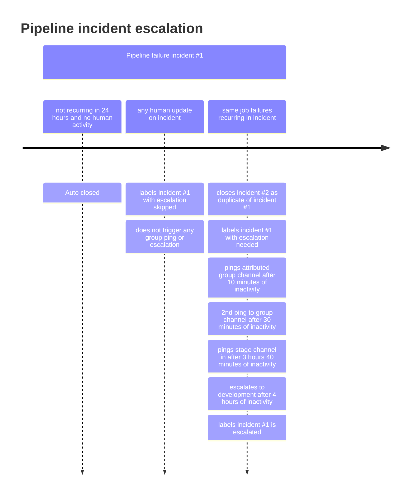

このドキュメントは GitLab Inc. において Issue を扱うすべての人のワークフローを説明します。
より広いコミュニティに適用されるワークフローについては [コントリビューションガイド](https://docs.gitlab.com/ee/development/contributing/) を参照してください。

## GitLab Flow

GitLab の製品は [GitLab Flow](https://about.gitlab.com/blog/2023/07/27/gitlab-flow-duo/) を使用して構築されています。

[コードレビューに関する特定のルール](/handbook/engineering/workflow/code-review/) があります。

## マージリクエストのリバート

[ショートトー](/handbook/values/#short-toes)、[双方向の扉の決定を行う](/handbook/values/#make-two-way-door-decisions)、[行動バイアス](/handbook/values/#operate-with-a-bias-for-action) の価値観に沿って、誰でもマージリクエストのリバートを提案できます。MR をリバートすべきか判断する際は、以下が当てはまる必要があります:

- 何かが壊れており、許容できる回避策がない場合。例えば:
  - 機能が壊れて `~severity::1` または `~severity::2` に分類されている。
  [重大度ラベルを参照](/handbook/product-development/how-we-work/issue-triage/#severity)
  - [master が壊れている](#broken-master)
  - マイグレーションが失敗している
- 変更に依存関係がない場合。例えば、データベースマイグレーションが本番で実行されていないこと。

既存の機能を削除せず、非機能的な変更のみを追加するマージリクエストのリバートは、委員会による設計を防ぐために避けるべきです。

リバートの意図は元の作者を非難することではありません。また、元の作者が必要なフォローアップ行動の DRI として参加できるよう通知することが望ましいです。

`pipeline::expedited` ラベルと `master:broken` または `master:foss-broken` ラベルは、MR パイプラインを高速化するために一部の非必須ジョブをスキップするよう `master` を修正するマージリクエストに設定する必要があります。

## Broken `master`

[GitLab](https://gitlab.com/gitlab-org/gitlab) または [GitLab FOSS](https://gitlab.com/gitlab-org/gitlab-foss) の `master` ブランチのパイプラインが失敗していることに気づいた場合、ビルドを合格状態に戻すことが他のすべての開発関連作業より優先されます。テストが壊れている間に行うことすべてが以下を引き起こす可能性があるためです:

- 既存の機能を壊す
- 新しいバグとセキュリティ問題を導入する
- エンジニアリング全体のプロダクティビティとリリースプロセスを妨げる

### Broken `master` とは？

Broken master とは `master` のパイプラインが失敗しているイベントです。

テスト失敗を修正するためのコストは、使用されている[マージ結果パイプライン](https://docs.gitlab.com/ee/ci/pipelines/merged_results_pipelines.html)により時間が経つにつれて指数関数的に増加します。自動デプロイ、月次リリース、セキュリティリリースは、タグ付けと[バックポートのマージ](https://gitlab.com/gitlab-org/release/docs/-/blob/master/general/security/release-manager.md#regular-security-releases)のために `gitlab-org/gitlab` master がグリーンであることに依存しています。

私たちの目標は、`master` が壊れた後にのみ修正するのではなく、`master` を失敗から常に守ることです。

質問や提案は、broken `master` 自動化プロセスを所有する `#g_development_analytics` チャンネルで歓迎されます。

### Broken `master` サービスレベル目標

broken `master` インシデントを修正するには2つのフェーズがあり、緊急性を明確にするためのターゲット SLO があります。解決フェーズはトリアージフェーズの完了に依存します。

| フェーズ | サービスレベル目標 | DRI |
| --- | --- | --- |
| [トリアージ](#broken-master-のトリアージ) | broken `master` インシデント作成後2回目の発生から割り当てまで4時間 | インシデントにラベル付けされたグループ |
| [解決](#broken-master-の解決) | DRI への割り当てからインシデント解決まで4時間 | マージリクエストの作者またはそのチーム、またはオンコールエンジニア |

注意: 繰り返されるインシデントは master パイプラインの安定性と開発速度に悪影響を与えています。トリアージされていない繰り返しインシデントは、以下のタイムラインに従って自動的に `#development` にエスカレーションされます:



インシデントが自動エスカレーションより前に MR やデプロイのブロッカーになった場合、影響を受けているチームメンバーは必要に応じて早期に現在の[オンコールエンジニア](/handbook/engineering/infrastructure-platforms/incident-management/#who-is-the-current-eoc)からのサポートをリクエストするために [broken `master` エスカレーション](#broken-master-エスカレーション)の手順を参照してください。

詳細は以下のフェーズの説明を参照してください。

### Broken `master` エスカレーション

繰り返し発生する broken `master` インシデントは、4時間以内にトリアージされない限り自動的に `#development` にエスカレーションされます。

自動エスカレーション前に broken `master` がチームをブロックしている場合（セキュリティリリースの作成など）:

1. DRI が割り当てられた未解決の [broken `master` インシデント](https://gitlab.com/gitlab-org/quality/engineering-productivity/master-broken-incidents/-/issues) があるか確認し、そこのディスカッションを確認します。
1. トリアージ DRI のグループ Slack チャンネルの失敗通知のディスカッションを確認し、誰かが自分が見ているインシデントを調査しているかを確認します。トリアージ DRI が誰かについての情報は [Broken master のトリアージ](#broken-master-のトリアージ)を参照してください。
1. 明確な DRI または解決策がない場合は、[開発エスカレーション](/handbook/engineering/workflow/development-processes/infra-dev-escalation/process/)プロセスを使用して broken `master` インシデントでの支援を求めます。

**注意:** 安定ブランチの失敗もここで説明するプロセスと同じですが、インシデントは [gitlab-org/release/tasks](https://gitlab.com/gitlab-org/release/tasks) で追跡されます。詳細は[安定ブランチのドキュメント](/handbook/engineering/releases/stable_branches/#broken-stable-branches)を参照してください。

#### 週末と祝日のエスカレーション

Master broken インシデントは必要に応じて手動で `#development` にエスカレーションする必要があります。手動エスカレーションがない場合、サービスレベル目標は次の営業日まで延長できます。つまり、トリアージ DRI は次の営業日にインシデントをトリアージすることが期待されます。ラベルが適用された時期に関係なく、インシデントが解決されるまで `~"escalation::escalated"` ラベルが付いている限り、インシデントは常に `escalated` 状態にあると見なします。

### Broken master のトリアージ

#### 定義

- フレーキーテスト: テストを実行している CI ジョブをリトライすると成功する失敗するテスト。
- Broken master:
  - テストを実行している CI ジョブをリトライしても失敗するテスト。
  - `master` ブランチでローカルに再現できる失敗するテスト。

#### 帰属

失敗したテストがその `feature_category` メタデータを通じてグループに追跡できる場合、そのテストに関連する broken `master` インシデントは[このコードの行](https://gitlab.com/gitlab-org/quality/triage-ops/-/blob/5ad6a19bd1b37a304fbd02701a002f4dd83e1fcf/triage/triage/pipeline_failure/incident_creator.rb#L23)を通じてこのグループがトリアージ DRI として自動的にラベル付けされます。さらに、進行中のインシデントを通知するためにグループの Slack チャンネルに Slack 通知が送信されます。トリアージ DRI はインシデントのモニタリング、特定、コミュニケーションに責任を持ちます。

帰属されたグループの Slack チャンネルと `#master-broken` に通知が送信されます。

#### トリアージ DRI の責任

1. モニタリング
   - パイプライン失敗はトリアージ DRI のグループチャンネル（識別された場合）に送信され、グループメンバーによってレビューされます。失敗は追加のコミュニケーションのために [`#master-broken`](https://gitlab.slack.com/archives/CR6QH3D7C) にも送信されます。インシデントが DRI グループの Slack チャンネルで発表された場合、チャンネルメンバーはそれを確認してトリアージ DRI の責任を引き受けるべきです。
   - インシデントが既存のインシデントの複製である場合、以下のクイックアクションを使用して複製インシデントをクローズします:

      ```shell
      /assign me
      /duplicate #<original_issue_id>
      /copy_metadata #<original_issue_id>
      ```

   - インシデントが複製でなく、調査が必要な場合:
     - インシデントを自分に割り当てます: `/assign me`
     - インシデントのステータスを `Acknowledged` に変更します（右側メニューで）。
     - Slack では、トリアージ DRI が `:ack:` 絵文字リアクションを適用して、リンクされたインシデントのステータスが `Acknowledged` に変更され、インシデントが積極的にトリアージされていることを示すべきです。

1. 特定
   - 同じ失敗がある未解決の [broken `master` インシデント](https://gitlab.com/gitlab-org/quality/engineering-productivity/master-broken-incidents/-/issues)をレビューします。broken `master` がテスト失敗に関連する場合、[Issue 検索でスペックファイルを検索](https://gitlab.com/gitlab-org/gitlab/-/issues?sort=created_desc&state=opened&label_name[]=failure::flaky-test)して既知の `failure::flaky-test` Issue があるか確認します。
   - このインシデントが**非フレーキーな理由による場合**、Slack Workflow を使用して `#development`、`#backend`、`#frontend` でコミュニケーションします。
      - `#master-broken` チャンネルのチャットバーに `/broadcast master fixed` を入力してこのワークフローを呼び出し、`Continue the broadcast` をクリックして `master` が修正されたことを発表します。
      - 後でリバートが必要な場合のために時間を節約するため、[直接リバート MR を作成します](#マージリクエストのリバート)。
        - データベースマイグレーションを実行する MR をリバートする場合は、マイグレーションが staging や本番に進んで実行されるのを防ぐため[デプロイブロッカープロセス](/handbook/engineering/deployments-and-releases/deployments/#deployment-blockers)に従う必要があります。
        - マイグレーションがいずれかの環境で実行された場合は `#releases` チャンネルのリリースマネージャーに連絡し、最初のマイグレーションをロールバックする別のマイグレーションを作成するか、[データマイグレーション無効化手順](https://docs.gitlab.com/ee/development/database/deleting_migrations.html#how-to-disable-a-data-migration)に従ってマイグレーションを no-op にすることが適切かどうかを議論します。
   - `master` が**フレーキーな理由で失敗している**と特定し、信頼性を持って再現できない場合（つまり、失敗したスペックをローカルで実行するか、失敗したジョブをリトライする）:
      - フレーキーさが継続的に master パイプラインインシデントを引き起こしている場合は、パイプラインの安定性を回復するために失敗したテストを [Fast Quarantine](https://gitlab.com/gitlab-org/quality/engineering-productivity/fast-quarantine/) します。
      - あるいは、失敗が破壊的でないと思われ、自信を持っている修正がある場合は、パイプラインを高速化するために `~"master:broken"` ラベルを付けた修正 MR を提出します。
      - フレーキーテストの Issue がすでに存在する場合は、失敗した broken master インシデントや失敗したジョブへのリンクとともにコメントを追加します。テスト失敗 Issue を自動的に作成する自動化があります。Issue はスペックパスにちなんで命名されており、検索キーワードとして使用できます。
      - フレーキーテストの Issue が存在しない場合は、失敗したジョブページの右上の `New issue` ボタンから Issue を作成し（ジョブへのリンクが Issue に自動的に追加されます）、`Broken Master - Flaky` 説明テンプレートを適用します。
      - メインインシデントに適切なラベルを追加します:

        ```shell
        # Add those labels
        /label ~"master-broken::flaky-test"
        /label ~"failure::flaky-test"

        # Pick one of those labels
        /label ~"flaky-test::dataset-specific"
        /label ~"flaky-test::datetime-sensitive"
        /label ~"flaky-test::state leak"
        /label ~"flaky-test::random input"
        /label ~"flaky-test::transient bug"
        /label ~"flaky-test::unreliable dom selector"
        /label ~"flaky-test::unstable infrastructure"
        /label ~"flaky-test::too-many-sql-queries"
        ```

      - インシデントをクローズします
   - エラーのスタックトレースをインシデントに追加します（gitlab-bot によってまだ投稿されていない場合）。ジョブアーティファクットで利用可能な場合は Capybara スクリーンショットも追加します。
     - スクリーンショットを見つけるには: ジョブアーティファクットをダウンロードし、利用可能な場合は `artifacts/tmp/capybara` のスクリーンショットをインシデントにコピーします。
   - 失敗を導入したマージリクエストを特定します。いくつかのアプローチがあります:
      - 失敗したジョブのコミットを確認し、関連する MR を見つけます（ほとんどの場合は簡単ではありません）。
      - [プロジェクトのアクティビティを見て](https://gitlab.com/gitlab-org/gitlab/activity)、最近マージされたイベントのキーワードを検索します。
      - [masterの最近のコミットを確認し](https://gitlab.com/gitlab-org/gitlab/-/commits/master)、失敗したジョブ/スペックで見られるキーワードを検索します（例えば、`geo` スペックファイルの失敗、特に `shard` スペックが見られる場合は、コミット履歴でそれらのキーワードを検索します）。
        - [テキスト `Merge branch` でフィルタリング](https://gitlab.com/gitlab-org/gitlab/-/commits/master?search=Merge%20branch)してマージコミットのみを表示することができます。
      - スペックファイルの履歴またはブレームビューを確認します。ファイルエクスプローラーでファイルの上部にある `History` または `Blame` ボタンをクリックします（例: <https://gitlab.com/gitlab-org/gitlab/-/blob/master/lib/backup.rb>）。
   - マージリクエストを特定できた場合は、その作者が現在利用可能であればインシデントを割り当てます。利用不可の場合は、MR を承認/マージしたメンテナーに割り当てます。誰も利用可能でない場合は、チームのエンジニアリングマネージャーにメンションして `#development` Slack チャンネルで支援を求めます。
      - 誰がどのチームに属しているか、そのチームのマネージャーが誰かは <https://handbook.gitlab.com/handbook/product/categories/> で検索できます。
   - マージリクエストが特定できない場合は、`#development` Slack チャンネルで支援を求めます。
   - 以下のリストから適切な `~master-broken:*` ラベルを設定してください:

      ```shell
      /label ~"master-broken::caching"
      /label ~"master-broken::ci-config"
      /label ~"master-broken::dependency-upgrade"
      /label ~"master-broken::external-dependency-unavailable"
      /label ~"master-broken::flaky-test"
      /label ~"master-broken::fork-repo-test-gap"
      /label ~"master-broken::pipeline-skipped-before-merge"
      /label ~"master-broken::test-selection-gap"
      /label ~"master-broken::need-merge-train"
      /label ~"master-broken::gitaly"
      /label ~"master-broken::state leak"
      /label ~"master-broken::infrastructure"
      /label ~"master-broken::infrastructure::failed-to-pull-image"
      /label ~"master-broken::infrastructure::frunner-disk-full"
      /label ~"master-broken::infrastructure::gitlab-com-overloaded"
      /label ~"master-broken::job-timeout"
      /label ~"master-broken::multi-version-db-upgrade"
      /label ~"master-broken::missing-test-coverage"
      /label ~"master-broken::undetermined"
      ```

1. （オプション）解決前
   - トリアージ DRI が以下のどちらかにより容易な解決策があると考える場合:
      - 特定のマージリクエストをリバートする。
      - 簡単な修正を行う（例えば、1行または数行の類似した単純な変更）。

     トリアージ DRI はマージリクエストを作成し、利用可能なメンテナーに割り当てて、解決 DRI に `@username FYI` メッセージで通知することができます。
     また、メンテナーに修正をできるだけ早く確認してもらうために `#backend_maintainers` または `#frontend_maintainers` にメッセージを投稿することができます。
   - 失敗が `test-on-gdk` ジョブでのみ発生する場合は、原因が修正される間、それらのジョブが新しいパイプラインに追加されるのを止めることが可能です。詳細は [runbook](https://gitlab.com/gitlab-org/quality/runbooks/-/tree/main/test_on_gdk#disable-the-e2etest-on-gdk-pipeline) を参照してください。

#### トリアージ DRI のためのヒント

1. 失敗の原因の初期評価として、[この документации](https://docs.gitlab.com/ee/user/gitlab_duo_chat/examples.html#troubleshoot-failed-cicd-jobs-with-root-cause-analysis)に従って実験的な AI 支援[根本原因分析](https://docs.gitlab.com/ee/user/gitlab_duo/index.html#root-cause-analysis)機能を試すことができます。
2. フレーキーさを確認するには、プロジェクトのメンテナーでなくても `@gitlab-bot retry_job <job_id>` または `@gitlab-bot retry_pipeline <pipeline_id>` コマンドを使用して失敗したジョブをリトライできます。

   - **注意:** `retry_job` コマンドは以下の理由で失敗する場合があります:
     - `retry_job` コマンドで同じジョブを2回リトライしようとすると、各失敗したジョブは1回しかリトライできないため失敗メッセージが表示されます。
     - どちらの `retry` コマンドにも応答がない場合は、サポートされていないプロジェクトで呼び出している可能性があります。プロジェクトへのコマンド追加をリクエストしたい場合は、[Issue を作成](https://gitlab.com/gitlab-org/quality/triage-ops/-/issues/new)して `#g_development_anallytics` に通知してください。効率を最大化するために[この例](https://gitlab.com/gitlab-org/quality/triage-ops/-/merge_requests/2536)に従って MR を自分で作成してレビューのために提出することをお勧めします。

### Broken master の解決

`master` を壊した変更のマージリクエスト作者が解決 DRI です。
マージリクエスト作者が利用不可の場合は、マージリクエスト作者のチームが解決 DRI の責任を引き受けます。
DRI が確認または修正に取り組んでいる旨を示していない場合は、インシデントに自分自身を割り当てることで任意の開発者が解決 DRI の責任を引き受けることができます。

#### 解決 DRI の責任

1. 新しいバグ/機能作業よりも繰り返し発生する broken `master` インシデントの解決を優先します。解決策には以下が含まれます:
   - **デフォルト**: broken `master` を引き起こしたマージリクエストをリバートします。リバートを実行した場合は、マージリクエストを復元するための Issue を作成して、リバートされたマージリクエストの作者に割り当てます。
       - リバートはメンテナーレビューに直接進むことができ、メンテナー1名の承認が必要です。
       - リバートが些細でない場合、メンテナーは追加のレビュー/承認を要求することができます。
       - `pipeline::expedited` ラベルと `master:broken` または `master:foss-broken` ラベルは、MR パイプラインを高速化するために一部の非必須ジョブをスキップするよう `master` を修正するマージリクエストに設定する必要があります。
   - テストがフレーキーであることを確認できる場合（例えば、最近は変更されておらず、失敗したジョブのリトライ後に合格した場合）は、失敗したテストを[クォランティン](https://docs.gitlab.com/ee/development/testing_guide/flaky_tests.html#quarantined-tests)します。
     - 以前に特定フェーズで作成した `failure::flaky-test` Issue に `quarantined test` ラベルを追加します。
   - リバートが不可能または追加のリスクをもたらす場合は、失敗を修正するための新しいマージリクエストを作成します。これは `priority::1` `severity::1` Issue として扱うべきです。
     - 修正の効率的なレビューを確保するため、マージリクエストには失敗を修正するために必要な最小限の変更のみを含めるべきです。コードへの追加のリファクタリングや改善はフォローアップで行うべきです。
1. 解決 DRI はパイプライン内のすべての失敗に対処する必要があります。最初に開かれたインシデントの Issue はこれまでに失敗したジョブのみを発表することに注意してください。しかし、それらのジョブを修正した後、トリアージしているパイプラインで他の後続のジョブが失敗する可能性があります。トリアージ DRI はこのパイプライン全体に責任を持ち、最初に失敗したジョブだけでなく全体に責任があります。
1. デプロイのブロックを解除するために `Pick into auto-deploy` ラベル（必要な `severity::1` と `priority::1` とともに）を適用します。
1. 壊れた `master` インシデントを[メンテナンス対象の安定ブランチ](https://docs.gitlab.com/policy/maintenance/#maintained-versions)にバックポートします。[安定ブランチ](#安定ブランチ)を参照してください。
1. 修正がマージされたら `#master-broken` でコミュニケーションします。
1. インシデントが解決したら、`#master-broken` チャンネルで `Broadcast Master Fixed` ワークフローを選択し、`Continue the broadcast` をクリックしてそれをコミュニケーションします。
1. `master` ビルドが失敗しており、根本的な問題がクォランティン/リバート/一時的な回避策が作成されたが根本原因をまだ発見する必要がある場合、調査はインシデントで直接継続するべきです。
1. broken `master` インシデントが MR パイプラインで防げた可能性について説明する [Issue](https://gitlab.com/gitlab-org/quality/analytics/team/-/issues/new) を [Development Analytics グループ](/handbook/engineering/infrastructure-platforms/developer-experience/development-analytics/)のために作成します。
1. 解決手順が完了し、必要な修正がすべてマージされたら、インシデントをクローズします。

#### 作者とメンテナーの責任

解決 DRI が `master` が修正されたことを発表したら:

- メンテナーは新しいマージ結果パイプラインを開始し（正規 MR の場合）、"Auto-merge" を有効にするべきです。
  [マージ結果パイプライン](https://docs.gitlab.com/ee/ci/pipelines/merged_results_pipelines.html)を使用しているため、`master` が修正されたらリベースは不要です。
- （フォークのみ）作者はオープンなマージリクエストをリベースするべきです（[マージ結果パイプライン](https://docs.gitlab.com/ee/ci/pipelines/merged_results_pipelines.html)はそれらのケースではサポートされていないため）。

### Broken master 中のマージ

インシデントのステータスが `Resolved` に変更されるまで、マージリクエストは `master` に**マージできません**。

長時間赤い状態が続くと信頼を失いやすいため、**新しい**失敗を導入しないよう努める必要があります。

マージリクエストが[緊急](#broken-master-中にマージするための基準)であり、**即時**にマージする必要がある稀なケースでは、チームメンバーは以下のプロセスに従って broken `master` 中にマージリクエストをマージすることができます。

#### Broken master 中にマージするための基準

`master` が壊れている間にマージできるのは以下の場合のみです:

- 進行中の本番インシデントを緩和するために GitLab.com にデプロイする必要があるマージリクエスト。
- broken `master` の問題を修正するマージリクエスト（複数の broken `master` 問題が同時進行している場合があります）。

#### Broken `master` 中にマージをリクエストする方法

まず、最新のパイプラインが2時間以内に完了したことを確認します（`gitlab-org/gitlab` が[マージ結果パイプライン](https://docs.gitlab.com/ee/ci/pipelines/merged_results_pipelines.html)を使用しているため、失敗している可能性があります）。

次に、Slack でリクエストします:

1. `#frontend_maintainers` *または* `#backend_maintainers` Slack チャンネル（より関連性の高い方）に投稿します。
1. 投稿でマージリクエストが[緊急](#broken-master-中にマージするための基準)である理由を説明します。
1. これが broken `master` 中のマージになることを明確にし、リクエストにこのページへのリンクをオプションで追加します。

#### メンテナーへの指示

Broken `master` 中にマージするリクエストを見たメンテナーはこのプロセスに従う必要があります。

注意: 以下のプロセスのいずれかの部分がマージリクエストを broken `master` 中にマージすることを不適格とする場合、メンテナーはマージリクエスト（およびオプションでリクエストの Slack スレッド）で*理由*を申請者に伝える必要があります。

まず、リクエストを評価します:

1. 他のメンテナーが評価中であることを示すために Slack 投稿に `:eyes:` 絵文字を追加します。複数のメンテナーがリクエストを処理することは避けるべきです。
1. マージリクエストが[緊急かどうか](#broken-master-中にマージするための基準)を評価します。不明な場合は、なぜ緊急なのかについてマージリクエストで申請者に詳細を求めます。

次に、以下のすべての条件が満たされていることを確認します:

1. 最新のパイプラインが2時間以内に完了したこと（`gitlab-org/gitlab` が[マージ結果パイプライン](https://docs.gitlab.com/ee/ci/pipelines/merged_results_pipelines.html)を使用しているため、失敗している可能性があります）。
1. 最新のパイプラインの失敗のすべてが `master` でも発生していること。
1. 対応する未解決の [broken `master` インシデント](https://gitlab.com/gitlab-org/quality/engineering-productivity/master-broken-incidents/-/issues)が存在すること。詳細は上記の「トリアージ DRI の責任」の手順を参照してください。

次に、マージリクエストに broken `master` 中にマージすることを述べるコメントを追加し、broken `master` インシデントへのリンクを貼ります。例えば:

```md
Merge request will be merged while `master` is broken.

Failure in <JOB_URL> happens in `master` and is being worked on in <INCIDENT_URL>.
```

次に、マージリクエストをマージします:

- "Merge" ボタンが有効（これは稀です）であれば、クリックします。
- それ以外の場合は以下を行う必要があります:
  1. [`gitlab-org/gitlab` プロジェクト](https://gitlab.com/gitlab-org/gitlab/edit)の["Pipelines must succeed" 設定](https://docs.gitlab.com/ee/user/project/merge_requests/auto_merge.html#require-a-successful-pipeline-for-merge)を解除します。
  1. "Merge" ボタンをクリックします。
  1. マージトレインが有効な場合、コード変更がマージトレインによって検証されないことを示す警告が表示されます。マージリクエストの重要性を考慮して警告を無視することは許容されます。
  1. "Pipelines must succeed" 設定を再び有効にします。

### Broken `master` ミラー

[`#master-broken-mirrors`](https://gitlab.slack.com/archives/C01PK38VAN8) は、[リリースマネージャー](https://about.gitlab.com/community/release-managers/) と [Developer Experience チーム](/handbook/engineering/infrastructure-platforms/developer-experience/) が以下のプロジェクトの失敗をモニタリングするスペースを提供するために `#master-broken` チャンネルの重複通知を削除するために作成されました:

- <https://gitlab.com/gitlab-org/security/gitlab>
- <https://dev.gitlab.org/gitlab/gitlab-ee>

`#master-broken-mirrors` チャンネルは、これらのプロジェクトの固有の失敗を特定するために使用され、フレーキーな失敗は `#master-broken` と同じようにリトライ/対応されることは期待されていません。

### Broken JiHu バリデーションパイプライン

一部のマージリクエストで JiHu バリデーションパイプラインを実行しており、時々壊れることがあります。この場合は [バリデーションパイプラインが失敗した場合の対処法](/handbook/finance/jihu-support/jihu-validation-pipelines.html#what-to-do-when-the-validation-pipeline-failed) を確認してください。

## 安定ブランチ

GitLab リリースの準備を保証するためには、安定ブランチの失敗は master ブランチの失敗と同様に優先度を持って対処することが根本的に重要です。
マージリクエスト作者は以下を[メンテナンス対象の安定ブランチ](https://docs.gitlab.com/policy/maintenance/#maintained-versions)にバックポートする責任があります:

- [メンテナンス対象バージョン](https://docs.gitlab.com/policy/maintenance/#maintained-versions)に影響する master broken インシデントのバックポート。
- クォランティンされたスペックを含むフレーキー失敗修正のバックポート。
- バグでないキャッチアップ修正アクション（スペック修正、ドキュメント変更、パフォーマンス改善など）のバックポート。

安定ブランチへの変更のバックポートには[エンジニアリング runbook](https://gitlab.com/gitlab-org/release/docs/-/blob/master/general/patch/engineers.md#backporting-a-bug-fix-in-the-gitlab-project) に従ってください。

## セキュリティ Issue

セキュリティ Issue はセキュリティチームによって管理・優先順位付けされます。マイルストーン内でセキュリティ Issue に取り組む場合は、[セキュリティリリースプロセス](https://gitlab.com/gitlab-org/release/docs/blob/master/general/security/process.md)に従う必要があります。

GitLab でセキュリティ Issue を発見した場合は、関連するセキュリティおよびエンジニアリングマネージャーにメンションした**機密 Issue** を作成し、`#security` に投稿してください。

セキュリティコミットを誤って `gitlab-org/gitlab` にプッシュした場合は以下を推奨します:

1. できるだけ早く関連ブランチを削除します
1. `#releases` のリリースマネージャーに伝えます。コミットを削除するためにガベージコレクション（リポジトリ設定のハウスキーピングタスクを通じて）を実行できる可能性があります。

セキュリティリリースのプロセス全体がどのように機能するかについての詳細は、[セキュリティリリースのドキュメント](https://gitlab.com/gitlab-org/release/docs/blob/master/general/security/process.md)を参照してください。

## リグレッション

`~regression` は以前に**動作確認されていた機能**が機能しなくなったことを示します。
リグレッションはバグのサブセットです。`~regression` ラベルは欠陥が機能を後退させたことを示すために使用されます。
このラベルは以前は機能していたものが追加の注意を要することをエンジニアリングとプロダクトマネージャーに伝えます。

リグレッションラベルは**機能が動作したことが一度も確認されていない**新機能のバグには適用されません。
これらは定義上リグレッションではありません。

リグレッションには、いつ導入されたかを指定するために常に `~regression:xx.x` ラベルが付いている必要があります。いつ導入されたかが不明な場合は、最新のリリースバージョンを追加してください。

リグレッションはユーザーに深刻な影響を与える場合は特に、できるだけ早く解決すべき高優先度の Issue として考慮されるべきです。例えば SaaS デプロイで時間内に特定された場合、同じマイルストーン内で修正することでそのリリースに含まれることを避けられます。

### MR での ~regression ラベルの使用

効率化のため、元の MR のリバートまたはコード変更を通じて Issue を作成せずにリグレッションが MR で修正されることがよくあります。Issue があるかどうかに関係なく、MR にも `~regression` と `~regression:xx.x` ラベルを付けるべきです。これにより、トレンドを正確に測定できます。

## 基本

1. 割り当てられた Issue に取り組みます。割り当てられた Issue がない場合は、取り組める最高優先度の関連ラベル付き Issue を見つけて自分に割り当てます。[開始されたマイルストーンの優先度でソートされたこのクエリを使用できます](https://gitlab.com/groups/gitlab-org/-/issues?scope=all&utf8=%E2%9C%93&state=opened&milestone_title=Started&assignee_id=None&sort=priority)。チームのラベルでフィルタリングしてください。
1. スケジュールや優先度付けが必要な場合は、適切なラベルを適用します（[Issue のスケジューリング](#issue-のスケジューリング)参照）。
1. 自分の専門外のエリアに関する Issue に取り組む場合は、取り組み始めたらすぐに他のグループの誰かにメンションしてください。これにより早期フィードバックが得られ、長期的に時間を節約できます。
1. 特定の機能、システム、グループへのアクセスが必要な Issue に取り組む場合は、[アクセスリクエスト](https://gitlab.com/gitlab-com/team-member-epics/access-requests/-/issues/new?issuable_template=Access_Change_Request)を開いて、変更がマージされた後のテスト用に staging と本番でアクセスを取得してください。
1. Issue に取り組み始めたら:

   - Issue に `workflow::in dev` ラベルを追加します。
   - Issue の **マージリクエストを作成** ボタンをクリックしてマージリクエスト（MR）を作成します。これにより Issue のラベル、マイルストーン、タイトルを持つ MR が作成されます。また、作成した MR と Issue を関連付けます。
   - MR を自分に割り当てます。
   - MR が準備できるまで作業し、GitLab の[完了の定義](https://docs.gitlab.com/ee/development/contributing/merge_request_workflow.html#definition-of-done)を満たし、パイプラインが成功するようにします。
   - 説明を編集して **タイトルから Draft: プレフィックスを削除する** ボタンをクリックします。
   - [レビュアールーレット](https://docs.gitlab.com/ee/development/code_review.html#reviewer-roulette)から提案されたレビュアーに割り当てます。frontend、backend、database など複数のカテゴリのレビュアーがいる場合は、すべてに割り当てます。あるいは、特定のレビューが必要な誰かに割り当てます。割り当てる際は、レビューをリクエストするコメントで @メンションします。
   - （オプション）MR から自分を割り当て解除します。GitLab ナビゲーションバーの MR ボタン/通知アイコンを使用して責任ある MR を追跡しやすくするために、自分に割り当てたままにすることを好む人もいます。
   - Issue のワークフローラベルを `workflow::in review` に変更します。複数の人が Issue に取り組んでいるか複数のワークフローラベルが適用される可能性がある場合は、Issue を分割することを検討してください。そうでなければ、完了から最も遠いワークフローラベルをデフォルトにします。
   - 場合によっては、レビュアーがフィードバックを提供して作者に割り当て直します。
   - 作者がフィードバックに対処し、すべてのレビュアーが MR を承認するまでこれが繰り返されます。
   - 承認後、各カテゴリのレビュアーは自分を割り当て解除し、そのカテゴリで提案されたメンテナーに割り当てます。
   - メンテナーレビューが行われ、必要に応じてやり取りが行われ、オープンなスレッドを解決しようとします。
   - 最後にMRを承認したメンテナーは[マージリクエストのマージ](https://docs.gitlab.com/ee/development/code_review.html#merging-a-merge-request)ガイドラインに従います。
   - （オプション）Issue のワークフローラベルを `workflow::verification` に変更して、Issue の開発作業がすべて完了し、デプロイと検証を待っていることを示します。製品からの検証リクエストや本番での検証が必要と判断した場合にこのラベルを使用します。
   - 変更が検証されたら、ワークフローラベルを `workflow::complete` に変更して Issue をクローズします。

1. 割り当てられた Issue に責任があります。つまり、関連するマイルストーンとともに出荷する必要があります。これができない場合は、マネージャーやその他のステークホルダー（例えばプロダクトマネージャー、依存する Issue に取り組む他のエンジニア）に早期にコミュニケーションする必要があります。チームでは、チームがこれに責任を持ちます（[チームでの作業](#チームでの作業)参照）。不確かな場合は、過剰コミュニケーションをデフォルトにしてください。疑問を伝えることは常に待つより良いです。
1. あなた（および該当するチーム）は以下に責任があります:

   - 変更が[GitLab Enterprise Edition に適切に適用されること](https://docs.gitlab.com/ee/development/ee_features.html)を確保します。
   - 新機能や修正のテスト（特にマージ・パッケージ化直後）。
   - [関連する機能または API ドキュメントの作成](https://docs.gitlab.com/ee/development/documentation/workflow.html#developers)。
   - セキュアなコードの出荷（[セキュリティはすべての人の責任](#セキュリティはすべての人の責任)参照）。

1. リリース候補が staging 環境にデプロイされたら、変更が意図通りに機能することを確認してください。開発では現れなかったバグが本番で現れる場合があります（例えば CE-EE マージの問題による）。

[Issue](https://docs.gitlab.com/ee/development/contributing/issue_workflow.html) と[マージリクエスト](https://docs.gitlab.com/ee/development/contributing/merge_request_workflow.html)に関する一般的なガイドラインを必ずお読みください。

## 開発全体を通じたワークフローラベルの更新

チームメンバーはラベルを使用して開発全体の Issue を追跡します。これにより、月次イテレーション中に計画を調整できるよう、他の開発者、プロダクトマネージャー、デザイナーに可視性を提供します。Issue は以下のステージに従う必要があります:

- `workflow::in dev`: 開発者が `in dev` ラベルを適用して Issue を開発中であることを示します。
- `workflow::in review`: 開発者が `in dev` ラベルを `in review` ラベルに置き換えてコードレビューと UX レビュー中であることを示します。
- `workflow::verification`: 開発者が Issue の開発作業がすべて完了し、デプロイ後に検証待ちであることを示します。
- `workflow::complete`: 開発者が `workflow::complete` ラベルを追加して Issue がクローズされ、すべてが機能していることを示します。

ワークフローラベルは[開発ドキュメント](https://gitlab.com/gitlab-org/gitlab-foss/-/blob/master/doc/development/labels/index.md#workflow-labels)と[プロダクト開発フロー](/handbook/product-development/how-we-work/product-development-flow/)で説明されています。

## チームでの作業

大きな Issue や多くの異なる動的な部分を含む Issue では、チームで作業することになるでしょう。このチームは通常、[バックエンドエンジニア](/job-description-library/engineering/backend-engineer/)、[フロントエンドエンジニア](/job-description-library/engineering/development/frontend/)、[プロダクトデザイナー](/job-description-library/product/product-designer/)、[プロダクトマネージャー](/job-description-library/product/product-manager/)で構成されます。

1. チームは計画されたリリースで Issue を出荷する共同責任を持ちます。
    1. チームが期限内に出荷できないかもしれないと感じたら、できるだけ早くエスカレーション/通知するべきです。マネージャーへの報告が良い出発点です。
    1. 一般的に、リリースを遅らせるよりも Issue の小さなイテレーションを出荷する方が好ましいです。
1. 新しいチームのために Slack チャンネルを開始することを検討しますが、関連するすべての情報を関連する Issue に書き込むことを忘れないでください。2つのスレッドではなく1つだけを読む必要があるようにしたいですし、Slack チャンネルは GitLab のより広いコミュニティには開かれていません。
1. Issue がフロントエンドとバックエンドの作業を伴う場合は、[フィーチャーフラグ](https://docs.gitlab.com/ee/development/feature_flags/index.html)の下でフロントエンドとバックエンドのコードを別々の MR に分割し、それぞれを独立してマージすることを検討してください。これにより、フロントエンド/バックエンドのエンジニアが独立して作業し、提供できます。
    1. コードはフィーチャーフラグの下でマージされていても、本番準備が完了していて[完了の定義](https://gitlab.com/gitlab-org/gitlab-foss/-/blob/master/doc/development/contributing/merge_request_workflow.md#definition-of-done)を引き続き満たすことが重要です。
    1. 統合、ドキュメント（該当する場合）、フィーチャーフラグの削除を含む別の MR をバックエンドとフロントエンドの MR と並行して完了するべきですが、フロントエンドとバックエンドの両 MR が master ブランチにある場合にのみマージするべきです。

[コラボレーション](/handbook/values/#collaboration)と[効率性](/handbook/values/#efficiency-for-the-right-group)の精神で、チームのメンバーは[他の人の時間を尊重しながら](/handbook/communication/#be-respectful-of-others-time)お互いと直接 Issue について議論することを自由に感じるべきです。

## 設定より規約

アプリケーション設定や `gitlab.yml` に設定値を追加することを避けてください。絶対に必要な場合のみ設定を追加してください。特定の機能を調整するパラメーターを追加しようとしている場合は、立ち止まってこれを避ける方法を考えてください。値は本当に必要ですか？広く使えるような定数が使えますか？値は自動的に決定できますか？詳細については[設定より規約](/handbook/product/product-principles/#convention-over-configuration)を参照してください。

## 取り組むものを選ぶ

現在のマイルストーンで最高優先度のものから取り組みます。アイテムの優先度はリポジトリのラベルで定義されていますが、優先度でソートすることもできます。

優先度でソートした後、取り組める責任範囲内のものを選びます。つまり、フロントエンド開発者であれば `frontend` ラベルの付いたものに取り組みます。

非常に精密にフィルタリングするには、以下のすべての Issue をフィルタリングできます:

- マイルストーン: Started
- 担当者: None（Issue が未割り当て）
- ラベル: 選択したラベル。例えば `CI/CD`、`Discussion`、`Quality`、`frontend`、または `Platform`
- 優先度でソート

[このリンクで上記のパラメーターをすばやく設定できます](https://gitlab.com/groups/gitlab-org/-/issues?scope=all&utf8=%E2%9C%93&state=opened&milestone_title=%23started&assignee_id=None&sort=priority)。自分のチームのラベルでまだフィルタリングする必要があります。

何に取り組むか迷ったら、リードに聞いてください。教えてもらえます。

## コミュニティからのコードのトリアージとレビュー

[開発者の責任](/job-description-library/engineering/backend-engineer/#responsibilities)の一つは、コミュニティの他のメンバーが提供したコードをトリアージしてレビューし、本番準備が整うよう協力することです。

コミュニティの他のメンバーからのマージリクエストには `Community contribution` ラベルを付けるべきです。

コミュニティからのマージリクエストを評価する際は、関連する PM が保留中の MR を認識するようメンションしてください。

これは毎日のルーティンの一部であるべきです。例えば、毎朝 `Community contribution` のラベルがまだ付いていないコミュニティからの新しいマージリクエストをトリアージし、自分でレビューするか関連する人にレビューを依頼することができます。

[コードレビューガイドライン](https://docs.gitlab.com/ee/development/code_review.html)に従ってください。

## GitLab.com での作業

GitLab.com は GitLab Enterprise Edition の非常に大きなインスタンスです。新しいリリースのリリース候補を実行しており、受け取るトラフィック量のため多くの Issue が発生します。GitLab の開発者がプロダクションシステムで何が起きているかデータを取得するための内部ツールがいくつかあります:

### パフォーマンスデータ

GitLab.com 向けに[監視](https://dashboards.gitlab.com/)が公開されています。これおよび関連ツールについては[監視ハンドブック](/handbook/engineering/monitoring/)を参照してください。

### エラーレポート

- [Sentry](https://sentry.gitlab.net/) はエラーレポートツールです
- [log.gprd.gitlab.net](https://log.gprd.gitlab.net/) には本番ログがあります
- [prometheus.gitlab.com](https://prometheus.gitlab.com/alerts) には[プロダクションチーム](/handbook/engineering/infrastructure/#production-team)向けのアラートがあります

## Issue のスケジューリング

GitLab Inc. は特定の Issue への取り組みにおいて選択的である必要があります。新しいことに取り組む能力には制限があります。そのため、Issue を慎重にスケジュールする必要があります。

プロダクトマネージャーは、機能、バグ、技術的負債を含む各[プロダクトエリア](/handbook/product/categories/#devops-stages)のすべての Issue のスケジューリングに責任があります。プロダクトマネージャーだけが[優先順位付け](/handbook/product/product-processes/cross-functional-prioritization/)を決定しますが、他の人が PM の決定に影響を与えることは奨励されます。UX リードとエンジニアリングリードは、物事が時間通りに完了するよう人員配置に責任があります。プロダクトマネージャーはこれらのアクティビティには*責任がなく*、プロジェクトマネージャーではありません。

Direction Issue は各リリースの大きな優先度付けされた新機能です。他の重要な Issue、バグ修正などに取り組む十分な能力を持てるよう、1リリースあたりわずかな数に制限されています。

`Seeking community contributions` ラベルの付いた Issue をスケジュールしたい場合は、まずラベルを削除してください。

スケジュールされた Issue にはチームラベルが割り当てられ、少なくとも1つのタイプラベルがある必要があります。

### スケジューリングのリクエスト

Issue のスケジューリングをリクエストするには、[担当するプロダクトマネージャー](/handbook/product/categories/#devops-stages)に依頼してください

私たちは素晴らしい機能のリクエストが取り組める能力よりもはるかに多くあります。取り組めない可能性が高いです。すべての Issue が適切な優先度を得られるよう、適切なラベル（`customer` など）が適用されていることを確認してください。

## プロダクト開発タイムライン

[](https://gitlab.com/gitlab-org/gitlab/-/snippets/3670861)

チーム（プロダクト、UX、開発、品質）は各自のワークフローに従って Issue に継続的に取り組みます。特定の人が特定の期間に特定の Issue セットに取り組むべきという特定のプロセスはありません。ただし、チームのワークフローと優先順位付けに影響する特定の締め切りがあります。

月次[リリース日](/handbook/engineering/releases/)がリリース月の第3木曜日であることから、**コードカットオフ**はその前の金曜日です。

**次のマイルストーンはコードカットオフの翌土曜日に開始します**。

マイルストーンの他の重要な日付はすべてリリース日に対して相対的です:

- **マイルストーン開始19日前の月曜日**:
  - 次のリリース（翌月リリース）に含まれる Issue のドラフト。
  - エンジニアリング/UX との能力と技術的な議論を開始。
  - エラーバジェットを評価して機能/信頼性のバランスを判断。
  - 開発エンジニアリングマネージャーが[クロスファンクショナル優先順位付け](/handbook/engineering/workflow/cross-functional-prioritization/)に従って `~type::maintenance` Issue の優先順位付けインプットをプロダクトマネージャーに提供
  - [Quality](/handbook/engineering/workflow/cross-functional-prioritization/) が[クロスファンクショナル優先順位付け](/handbook/engineering/workflow/cross-functional-prioritization/)に従って `~type::bug` Issue の優先順位付けインプットをプロダクトマネージャーに提供
- **マイルストーン開始12日前の月曜日**:
  - プロダクトマネージャーが開発 EM、Quality、UX からの優先順位付けインプットを考慮して次のマイルストーンの Issue 計画を作成。
  - リリーススコープが確定。スコープ内の Issue にはマイルストーン `%x.y` が付き、`~deliverable` ラベルが適用。
  - キックオフドキュメントが関連アイテムで更新。
- **マイルストーン開始5日前の月曜日**:
  - リリーススコープが確定。スコープ内の Issue にはマイルストーン `%x.y` が付き、`~deliverable` ラベルが適用。
  - キックオフドキュメントが関連アイテムで更新。
- **マイルストーン開始直後の月曜日**: ***キックオフ！*** 📣
  - [会社キックオフ](#キックオフ) コールをライブストリーム。
  - マイルストーンの開発開始。
- **マイルストーン開始9日後の月曜日**:
  - 各ステージ/セクションの開発リードが quad による[クロスファンクショナルダッシュボードレビュープロセス](/handbook/product/product-processes/cross-functional-prioritization/#cross-functional-dashboard-reviews)でステージ/セクションレベルのレビューを調整。ステージ/セクションレベルのレビューが完了後、開発 VP が CTO、プロダクト VP、UX VP、Quality VP とサマリーレビューを調整。
- **マイルストーン開始11日後の水曜日**:
  - GitLab Bot が現在のマイルストーンの[グループレトロスペクティブ](/handbook/engineering/careers/management/group-retrospectives/) Issue をオープン。
- **マイルストーン終了日の金曜日**:
  - マイルストーンの Issue が完了し、ドキュメントが添付され、master にマージ済み。
  - フィーチャーフラグはリリースに含まれることを確認後、デフォルト off からデフォルト on に切り替えるべきです。[フィーチャーフラグ](/handbook/product-development/how-we-work/product-development-flow/feature-flag-lifecycle/#including-a-feature-behind-feature-flag-in-the-final-release)参照。
  - マイルストーンのコードカットオフ（金曜日）までにマージすることは機能がリリースに含まれることを**保証しない**ことに注意してください。[リリースタイムライン](/handbook/engineering/releases/monthly-releases#timelines)参照。
  - 関連するすべての Issue の個別[リリースポストエントリ](/handbook/marketing/blog/release-posts/#contribution-instructions)がマージ済み。
  - 日終わりまでにマイルストーン `%x.y` が期限切れ。
- **リリース日前日の水曜日付近**:
  - [グループレトロスペクティブ Issue](/handbook/engineering/careers/management/group-retrospectives/) が出荷済みおよび未達成の成果物で更新され、チームメンバーがディスカッションにタグ付けされます。
- **リリース日前日の水曜日**:
  - [マイルストーンクリーンアップ](#マイルストーンクリーンアップ)が[マイルストーンクリーンアップスケジュール](#マイルストーンクリーンアップスケジュール)のスケジュールで実行されます。
- **リリース月の第3木曜日**: ***リリース日！*** 🚀
  - リリースを本番に出荷。
  - リリースポストを公開。
- **リリース日直後の金曜日**:
  - マイルストーンのパッチリリースプロセス開始。通常パッチリリースとセキュリティパッチリリースを含む。
  - `~security` Issue を除き、マイルストーンのすべての未完了 Issue とマージリクエストが自動的に次のマイルストーンに移動。
- **リリース日後の水曜日付近**:
  - カテゴリ epic と方向ページを含む[プロダクト計画](/handbook/product/product-processes/#managing-your-product-direction)が前のリリースと現在のリリースを反映するよう更新。
- **リリース日後の第2月曜日付近**:
  - 重要でないセキュリティパッチが[リリース](https://gitlab.com/gitlab-com/gl-infra/readiness/-/tree/master/library/security-releases-development)されます。

追加の締め切りについては[リリースポストのコンテンツレビュー](/handbook/marketing/blog/release-posts/#content-reviews)を参照してください。

GitLab.com へのデプロイは月次メジャー/マイナーリリースより頻繁に行われます。詳細は[auto deploy 移行](https://gitlab.com/gitlab-org/release/docs/blob/21cbd409dd5f157fe252f254f3e897f01908abe2/general/deploy/auto-deploy-transition.md#transition)のガイダンスを参照してください。

## キックオフ

各リリースの開始時に、YouTube に公開ライブストリームされるキックオフミーティングがあります。コールでは、プロダクト開発チーム（PM、プロダクトデザイナー、エンジニア）が次のリリースのスコープに含まれる Issue について組織の残りと共有します。コールは[プロダクトエリア](/handbook/product/categories/#devops-stages)ごとに構成され、各 PM がコールのパートをリードします。

[プロダクトキックオフページ](https://about.gitlab.com/direction/kickoff/)は毎月更新され、ライブストリームのコンテンツに従っています。

## マイルストーンクリーンアップ

エンジニアリングマネージャーは、カウンターパートのプロダクトマネージャーのガイダンスのもと、各チームの能力計画とスケジューリングに責任があります。

エンジニアリング全体の衛生を確保するために、期限切れマイルストーンの未完了作業（オープン Issue とマージリクエスト）を次のマイルストーンに移動し、期限切れマイルストーンに `~"missed:x.y"` ラベルを付けるスケジュールパイプラインを実行します。さらに、`~"Deliverable"` が存在する場合は `~"missed-deliverable"` ラベルも付けます。

これは[自動化されたトリアージ操作](https://gitlab.com/gitlab-org/quality/triage-ops/blob/master/policies/move-milestone-forward.yml)の一部として実装されています。さらに、現在の +1 を超えるマイルストーンを持つ `~Deliverable` ラベルの Issue から `~Deliverable` ラベルが削除されます。

[リリースとメンテナンスポリシー](https://docs.gitlab.com/ee/policy/maintenance.html)に基づき、期限切れから3ヶ月間マイルストーンをオープンのままにします。

マイルストーンクリーンアップは現在[以下のグループとプロジェクト](https://gitlab.com/gitlab-org/quality/triage-ops/blob/master/.gitlab/ci/missed-resources.yml)に適用されています:

- [GitLab](https://gitlab.com/gitlab-org/gitlab), [スケジュール](https://gitlab.com/gitlab-org/quality/triage-ops/pipeline_schedules/10515/edit)
- [GitLab Runner](https://gitlab.com/gitlab-org/gitlab-runner), [スケジュール](https://gitlab.com/gitlab-org/quality/triage-ops/pipeline_schedules/29681/edit)
- [GitLab Gitaly](https://gitlab.com/gitlab-org/gitaly), [スケジュール](https://gitlab.com/gitlab-org/quality/triage-ops/pipeline_schedules/29054/edit)
- [GitLab charts](https://gitlab.com/gitlab-org/charts), [スケジュール](https://gitlab.com/gitlab-org/quality/triage-ops/pipeline_schedules/39481/edit)
- [GitLab QA](https://gitlab.com/gitlab-org/gitlab-qa), [スケジュール](https://gitlab.com/gitlab-org/quality/triage-ops/pipeline_schedules/29050/edit)
- [Omnibus GitLab](https://gitlab.com/gitlab-org/omnibus-gitlab), [スケジュール](https://gitlab.com/gitlab-org/quality/triage-ops/pipeline_schedules/31880/edit)（今はマイルストーンの移動のみ、ラベル付けなし）

マイルストーンのクローズは [Delivery チーム](/handbook/engineering/infrastructure-platforms/gitlab-delivery/delivery/)の権限範囲にあります。いかなる時点でも、アクティブなマイルストーンのリリースを作成する必要があるかもしれず、それが不要になると Delivery チームがマイルストーンをクローズします。

### マイルストーンクリーンアップスケジュール

マイルストーンクリーンアップはマイルストーンの期限日に実行されます。

以下のアクションがオープン Issue に適用されます:

- オープン Issue とマージリクエストは次のマイルストーンに移動され、`~"missed:x.y"` でラベル付けされます。
- `~"Deliverable"` が存在する場合は `~"missed-deliverable"` も追加されます。

マイルストーンは Delivery チームが特定のマイルストーンのバックポートリリースを作成する必要がなくなった時点でクローズされます。

## グループラベルとグループマイルストーンの使用

GitLab（特に GitLab.org グループ）で作業する場合は、できるだけグループラベルとグループマイルストーンを使用してください。グループレベルで Issue とマージリクエストを計画しやすく、より自然にプロジェクト間でアイデアが共有されます。プロジェクトラベルがある場合は、グループマイルストーンに昇格できます。これにより、同じ名前のすべてのプロジェクトラベルが1つのグループラベルにマージされます。グループマイルストーンの昇格でも同様です。

## 技術的負債

コードベースの成長より技術的負債が速く増加することは避けたいです。これを防ぐために、技術的負債の影響だけでなく、感染症のように広がる影響も考慮すべきです。この問題はどれだけ大きく、速く時間とともに増大するでしょうか？悪いコードが将来の機能でコピーペーストされる可能性はありますか？最終的には、利用可能なリソースの量は常に対処すべき技術的負債の量より少ないです。

プラットフォームをイノベーションするにつれ、市場とお客様の需要を満たすためにより高い機能速度を維持するために技術的負債を意図的に負うという戦略的決定をする状況が生じます。この技術的負債の蓄積は、製品とプラットフォームの使いやすさ、セキュリティ、信頼性、スケーラビリティ、アクセシビリティ、可用性に対する長期的な影響によるリスクをもたらします。

したがって技術的負債は蓄積される場合がありますが、以下が必要です:

1. トリアージし、
1. 優先度と重大度を割り当て、
1. S1 と S2 のすべての重大度インスタンスに対して割り当てられた SLA 内で修復する計画を持ち、
1. 次の18ヶ月以内に取り組むことが期待される場合は `~"backlog::prospective"`、そうでなければ `~"backlog::no-commitment"` の[バックログラベル](https://gitlab.com/groups/gitlab-org/-/epics/18639)を割り当てます。

6ヶ月以上延期する場合は、プロダクトとエンジニアリングのロードマップの検討が必要です。クローズしたい技術的負債 Issue は「*abilities」（可用性など）に影響してはならず、次の18ヶ月以内に修復できない理由の正当化を含める必要があります（つまり、エンジニアリングロードマップに行動計画がある）。

優先順位付けと意思決定プロセスを支援するために、技術的負債の利率として感染を考えることをお勧めします。インターネットの[素晴らしいコメント](https://disq.us/p/1ros2o9)があります:

> You wouldn't pay off your $50k student loan before first paying off your $5k credit card and it's because of the high interest rate. The best debt to pay off first is one that has the highest loan payment to recurring payment reduction ratio, i.e. the one that reduces your overall debt payments the most, and that is usually the loan with the highest interest rate.

技術的負債は[他の技術的決定](/handbook/engineering/development/principles/#prioritizing-technical-decisions)と同様に[製品グループ](/handbook/company/structure/#product-groups)内で[プロダクト管理](/handbook/product/product-processes/cross-functional-prioritization/)によって優先順位付けされます。

グループ間にまたがるか隙間に落ちる技術的負債については、[レトロスペクティブ](/handbook/engineering/careers/management/group-retrospectives/)または[プロダクトリーダーシップチーム](/handbook/product/product-leaders/product-leadership/)の適切なメンバーと直接[グローバルに最適化された](/handbook/values/#efficiency-for-the-right-group)優先順位付けのために提起すべきです。製品グループ外で技術的負債に対処するための追加手段は[戦略的優先コード](/handbook/engineering/workflow/strategic-priority-codes/)と[ワーキンググループ](/handbook/company/working-groups/)です。

## 延期された UX

合意された [MVC](/handbook/product/product-principles/#the-minimal-valuable-change-mvc) から意図的に逸脱してユーザーエクスペリエンスを犠牲にするという決定が行われることがあります。この場合、プロダクトデザイナーはフォローアップ Issue を作成し、後続のリリースで UX ギャップに対処するために `Deferred UX` ラベルを付けます。

技術的負債と同じ理由で、延期された UX がコードベースより速く増加することは避けたいです。

これらの Issue は[製品グループ](/handbook/company/structure/#product-groups)内で[プロダクト管理](/handbook/product/product-processes/cross-functional-prioritization/)によって[他の技術的決定](/handbook/engineering/development/principles/#prioritizing-technical-decisions)と同様に優先順位付けされます。

[技術的負債](#技術的負債)と同様に、延期された UX は[レトロスペクティブ](/handbook/engineering/careers/management/group-retrospectives/)または[プロダクトリーダーシップチーム](/handbook/product/product-leaders/product-leadership/)の適切なメンバーと直接[グローバルに最適化された](/handbook/values/#efficiency-for-the-right-group)優先順位付けのために提起すべきです。

## UI ポリッシュ

UI ポリッシュ Issue は、[Pajamas](https://design.gitlab.com/) の基盤によってガイドされた既存のユーザーインターフェースの視覚的改善であり、主に UI の美的側面に触れるものです。UI ポリッシュ Issue は一般的に色、タイポグラフィ、アイコノグラフィ、スペーシングに関連する改善を捉えます。これらの Issue には `UI polish` ラベルを適用します。UI ポリッシュ Issue は機能や動作の変更を機能に導入しません。

### UI ポリッシュの例

- **美的改善**（[例](https://gitlab.com/gitlab-org/gitlab/-/issues/290262)）: UI から不要なボーダーを削除、要素の背景色を更新、見出し要素のフォントサイズを修正。
- **テキスト、ボタンなどのミスアライン**（[例](https://gitlab.com/gitlab-org/gitlab/-/issues/280538)）: 多くの場合は何も壊れていないため、これらの改善は UI ポリッシュとして見なされます。これらはバグとも見なされる場合があります。
- **UI 要素間の不正なスペーシング**（[例](https://gitlab.com/gitlab-org/gitlab/-/issues/7905)）: 2つのインターフェース要素が 8px の代わりに 10px など不一致なスペーシング値を使用している場合。技術的負債とも見なされる場合があります。2つのインターフェース要素間のスペースがゼロである場合は明らかなバグです。
- **異なるプロダクトエリア間の視覚的不一致**（[例](https://gitlab.com/gitlab-org/gitlab/-/issues/296948)）: 特定のビューに一連のボタンがある場合に視覚的不一致が発生する場合があります。例えば、それらの 3/4 が Pajamas コンポーネントを使用するように移行されており、1/4 がまだ非推奨のボタンを使用しており、視覚的な不一致が生じている場合。これは UI ポリッシュとして見なされます。

### UI ポリッシュではないもの

- **経験に関連する機能的不一致**: 例えば、担当者を追加する手動アクションは担当者をサイドバーに自動的に表示しますが、Issue にウェイトを追加する手動アクションはウェイトをサイドバーに自動的に表示しません。これは現在 UI ポリッシュとは見なされていません。UX の問題として見なされます。
- **システムステータスの可視性向上**: ステータスインジケーターの改善は経験の改善であり、UI ポリッシュには分類されません。
  - ステータスアイコンなど純粋に視覚的なものを更新して、ユーザーが見ているものの意味を改善しようとする場合でも、そのユーザーの経験を改善しようとしています。

## マージリクエストトレンドの監視

オープンなマージリクエストは時々アイドル状態（人間による更新が1ヶ月以上ない）になります。月1回、エンジニアリングマネージャーはグループのすべての（WIP/Draft でない）MR を含む [`マージリクエストトリアージ Issue`](/handbook/engineering/infrastructure-platforms/developer-experience/triage-operations/#group-level-merge-requests-that-may-need-attention) を受け取り、それを使用してアクションが必要かどうか（作者/レビュアー/メンテナーを促すなど）を判断します。これは [Open MR Review Time（OMRT）](/handbook/engineering/development/performance-indicators/#open-mr-review-time-omrt) と [Open MR Age（OMA）](/handbook/engineering/development/performance-indicators/#open-mr-age-oma) パフォーマンスインジケーターで追跡するマージリクエストが適切な時間内にマージされるのを助けます。

オープンなマージリクエストにはエンジニアリングマネージャーが調査して効率を改善するためのアクションを取る必要があることを示す他のプロパティもある場合があります。重要なプロパティの1つはスレッド数であり、高い場合は MR の計画を更新する必要があるか、同期的な議論を考慮すべきであることを示す場合があります。もう1つのプロパティはパイプラインの数であり、高い場合は MR の計画を再検討する必要があることを示す場合があります。これらのメトリクスは自動的に作成されるトリアージ Issue にはまだ含まれていません。

## セキュリティはすべての人の責任

[セキュリティ](https://about.gitlab.com/security/)は最優先事項です。セキュリティチームはユーザーデータを保護し、GitLab をすべての人が安全にコントリビュートできる場所にするため、毎日セキュリティの基準を高めています。多くのコード行があり、セキュリティチームはスケールする必要があります。つまり、[ソフトウェア開発ライフサイクル（SDLC）](https://about.gitlab.com/stages-devops-lifecycle/)でセキュリティを左にシフトすることを意味します。`#security_help` Slack チャンネルでより安全な開発のサポートを見つけることができます。

ソフトウェア開発ライフサイクルの早い段階でセキュリティレビュープロセスを開始できることは、コードがマージされる前に特定された脆弱性をより早く発見し、軽減することを意味します。[アプリケーションセキュリティレビューを積極的に求める](/handbook/security/product-security/security-platforms-architecture/application-security/appsec-reviews/)タイミングと方法を知っておくべきです。[セキュアコーディングガイドライン](https://docs.gitlab.com/ee/development/secure_coding_guidelines.html)にも精通しておくべきです。

すべてのマージ前に明らかなセキュリティ問題を修正することで、セキュリティレビュープロセスをスケールさせています。ワークフローには、マージリクエストのレビュアーによるチェックと検証が含まれており、開発者がマージ前に特定された脆弱性に対処できるようにします。そのプロセスの一部として、開発者はセキュリティチームにそのステージで Issue について連絡することも奨励されています。後で脆弱性を軽減することは、より費用がかかります。結局、セキュリティはすべての人の仕事です。[セキュリティパラダイム](https://about.gitlab.com/direction/application_security_testing/#security-paradigm)も参照してください。

## 迅速なエンジニアリング対応

時として、エンジニアリングチームが緊急の Issue に素早く対応しなければならない場合があります。このセクションでは、エンジニアリングチームがそのような Issue の特定の種類をどのように処理するかを説明します。

### スコープ

すべてが緊急ではありません。以下にスコープ内とスコープ外のものの非排他的リストを示します。常に経験と判断を使用し、他者とコミュニケーションしてください。

- スコープ内
  - 差し迫ったリリース前の最後のリリースブロッキングバグまたはセキュリティパッチ。
  - 高重大度（severity::1/priority::1）セキュリティ Issue。[セキュリティ重大度と優先度](/handbook/security/#severity-and-priority-labels-on-security-issues)参照。
  - [優先度と重大度の定義](https://gitlab.com/gitlab-org/gitlab-foss/-/blob/master/doc/development/contributing/issue_workflow.md#priority-labels)に基づく最高優先度・最高重大度のお客様 Issue。
- スコープ外
  - GitLab.com またはセルフマネージドのお客様環境の運用上の Issue。これは[オンコール](/handbook/engineering/on-call/)プロセスに該当します。
  - GitLab によって公式にサポートされていない自社開発・メンテナンスのツール。
  - 特定のお客様からの機能リクエスト。

### プロセス

1. 迅速なエンジニアリング対応をリクエストする人は、既知のすべての情報を提供する Issue を作成し、できる限り[優先度と重大度](https://gitlab.com/gitlab-org/gitlab-foss/-/blob/master/doc/development/contributing/issue_workflow.md#priority-labels)（または[セキュリティ重大度と優先度](/handbook/security/#severity-and-priority-labels-on-security-issues)）を適用します。
1. 迅速なエンジニアリング対応をリクエストする人は、自身のマネージャーと[対象分野](/handbook/product/categories/)のエンジニアリングマネージャー（または不在の場合は代理）に Issue を提起します。
   1. 特定のグループが決定できない場合は、[セクション](/handbook/product/categories/)のエンジニアリングディレクター（または不在の場合は代理）に Issue を提起します。
   1. 特定のセクションが決定できない場合は、開発の Sr. ディレクター（または不在の場合は代理）に Issue を提起します。
1. エンジニアリングスポンサー（対象分野のマネージャー、ディレクター、または Sr. ディレクター）は対象分野のすべてのステークホルダーを迅速対応タスクフォースとして招集し、最善の解決経路を決定します:
   1. エンジニアリングマネージャー
   1. プロダクト管理
   1. QE
   1. UX
   1. Docs
   1. Security
   1. Support
   1. Distribution エンジニアリングマネージャー
   1. Delivery エンジニアリングマネージャー（リリース管理）
1. 必要に応じて[優先度と重大度](https://gitlab.com/gitlab-org/gitlab-foss/-/blob/master/doc/development/contributing/issue_workflow.md#priority-labels)または[セキュリティ重大度と優先度](/handbook/security/#severity-and-priority-labels-on-security-issues)を調整し、決定した解決策に協力して取り組みます。

## パフォーマンスリファインメント

高インパクトなパフォーマンス Issue についての認識を高め、より広いコラボレーションを促進するために、開発と QE チームが共同で隔週のパフォーマンスリファインメントセッションを開催します。高インパクトな Issue は GitLab.com の[サービスレベルやエラーバジェット](https://gitlab.com/gitlab-com/gl-infra/readiness/-/tree/master/library/service-levels-error-budgets)に直接測定可能な影響を持ちます。

### スコープ

[パフォーマンスリファインメント Issue ボード](https://gitlab.com/groups/gitlab-org/-/boards/1233204)がこのリファインメント演習でレビューされます。

### プロセス

1. 隔週のリファインメントに参加するには、エンジニアリングディレクターに UTC 15:00 毎週木曜日の *Performance Refinement* ミーティングの招待を転送してもらうよう依頼してください。[ミーティングアジェンダ](https://docs.google.com/document/d/1icG6yrW2oebXz8iXvgfM5JjtMqpsDBCn1v3_VO2ghS0/edit#)はこちらです。
1. ボードに Issue をノミネートするには:
   1. Issue に[パフォーマンス重大度](/handbook/product-development/how-we-work/issue-triage/#severity)を割り当てて、リファインメントセッションの優先度割り当ての評価を助けます。
   1. Issue が問題、GitLab.com の可用性への（潜在的な）影響、理想的には問題への提案された解決策を明確に説明していることを確認します。
   1. `bug::performance` ラベルを使用します。
1. **Open** コラムの Issue については:
   1. `Milestone` またはラベル `workflow::ready for development` がない場合、エンジニアリングマネージャーが割り当てられます。
   1. エンジニアリングマネージャーは割り当てられた Issue をプロダクトマネージャーに優先順位付けと計画のために持ち込みます。
   1. Issue がイテレーションに計画されたら（つまり `Milestone` とラベル `workflow::ready for development` が関連付けられたら）、エンジニアリングマネージャーは自分を割り当て解除します。
1. 追加の議論が必要な高インパクトな Issue を強調するには、アジェンダ項目を追加してください。
1. コラボレーションに役立つゲスト参加者がいる場合は、招待を転送してください。例えば、CSM またはサポートエンジニアが今後のトピックに役立つ情報を持っている場合があります。

## Infradev

infradev プロセスは SaaS の可用性と信頼性をサポートするために優先的な注意が必要な Issue を特定するために設立されています。これらのエスカレーションはタイムリーなトリアージと注意が必要なため、主に非同期的であることが意図されています。Issue による主要な管理に加え、ギャップ、懸念、または重要なトリアージは [SaaS 可用性週次スタンドアップ](/handbook/engineering/#saas-availability-weekly-standup)で処理されます。

### スコープ

[infradev Issue ボード](https://gitlab.com/groups/gitlab-org/-/boards/1193197?label_name[]=infradev)がこのプロセスの主要な焦点です。

### 役割と責任

#### インフラストラクチャ

1. `Infradev` ラベルを追加して Issue をノミネートします。
1. [重大度](/handbook/product-development/how-we-work/issue-triage/#severity-slos)と `Priority` を評価し、適切なラベルを適用します。
1. 開発エンジニアリングのトラブルシューティングを支援するために[できるだけ多くの情報を提供します](#効果的な-infradev-issue-作成ガイド)。

#### 開発

1. 開発ディレクターは[トリアージプロセス](#トリアージプロセス)に従って定期的に [Infradev Issue のトリアージ](/handbook/engineering/development/#daily-duties-for-engineering-directors)に責任があります。
1. 開発マネージャーも定期的に [Issue のトリアージ](#トリアージプロセス)を行うことが奨励されます。
1. 開発マネージャーはカウンターパートのプロダクトマネージャーと協力して Infradev Issue を精査、スケジュール、解決します。
1. 通常、Issue はインフラストラクチャ部門の SRE またはマネージャーによって Infradev Issue としてノミネートされます。開発エンジニア/マネージャーは Infradev Issue をノミネートすることは期待されていません。
   1. ただし、既存の Infradev Issue から新しい Issue を分離する必要がある場合は、開発エンジニアとマネージャーも新しい Issue に `Infradev` ラベルを適用することができます。
   1. 開発エンジニアとマネージャーが新しい Infradev Issue を分離した場合、新しい Issue に `Severity` と `Priority` ラベルを付ける必要があります。ラベルはフォローアップ作業の重要性に対応すべきです。

#### プロダクト管理

1. プロダクトマネージャーはプロダクトロードマップと Infradev Issue の両方を1つの統合されたバックログとして全体的に優先順位付けを行います。
1. プロダクトマネージャーはカウンターパートの開発マネージャーと協力して Infradev Issue を精査、スケジュール、解決します。

### トリアージプロセス

（主に開発エンジニアリング管理が完了します）

Issue は `infradev` ラベルを含めることでボードにノミネートされ、[infradev ボード](https://gitlab.com/groups/gitlab-org/-/boards/1193197?label_name[]=infradev)に表示されます。

1. Open コラムの Issue をレビューします。ステージ/グループ/カテゴリ内の Issue を探すだけでなく、明確な割り当てがないものや割り当てを修正する必要があるものも探します。
1. Issue の[重大度](/handbook/product-development/how-we-work/issue-triage/#severity)をレビューして適切な優先順位付けを確認します。
1. Issue が問題、GitLab.com の可用性への（潜在的な）影響、理想的には問題への解決策を明確に説明していることを確認します。
1. `Milestone` またはラベル `workflow::ready for development` がない Issue に開発マネージャーとプロダクトマネージャーを割り当てます。
   1. 開発マネージャーとプロダクトマネージャーは割り当てられた Issue の優先順位付けと計画について協力します。
   1. Issue がイテレーションに計画されたら（つまり `Milestone` とラベル `workflow::ready for development` が関連付けられたら）、開発マネージャーとプロダクトマネージャーは自分を割り当て解除します。
1. すべての Issue を適切なワークフローステージに優先順位付けします。Open（未トリアージ）のアイテムがない状態を維持することが意図です。

`~infradev ~severity::1 ~priority::1 ~production request` ラベルが適用された Issue には即時解決が必要です。

`~infradev` Issue は ~"breaking change" を必要とすべきではありません。現在の `~infradev` Issue が breaking change を必要とする場合は、2つの Issue に分割する必要があります。最初の Issue は現在の SLO 下で行うことができる即時の `~infradev` 作業であるべきです。2番目の Issue は[廃止ガイダンス](https://docs.gitlab.com/ee/development/deprecation_guidelines/)に従って次のメジャーリリースで完了する必要がある ~"breaking change" 作業であるべきです。開発 DRI とインフラストラクチャ DRI からの合意を Issue に文書化すべきです。

Infradev Issue は月次[エラーバジェットレポート](/handbook/engineering/error-budgets/#budget-reporting)にも表示されます。

### 効果的な Infradev Issue 作成ガイド

Infradev Issue のトリアージは非同期で行われることが望まれます。以下の点を守ることで、infradev Issue が最大限の関心を集めることができます。

1. **[InfraDev Issue テンプレート](https://gitlab.com/gitlab-org/gitlab/-/issues/new?issuable_template=InfraDev)を使用して gitlab-org/gitlab Issue トラッカーに Issue を作成します。**
1. **問題のスコープと GitLab SaaS プラットフォームへの影響を明確に述べます**。例えば:
   1. 信頼性の問題: GitLab.com で広範な停止または劣化を引き起こす可能性のある問題。[例](https://gitlab.com/gitlab-org/gitlab/-/issues/244865)
   1. 飽和の問題: リソースの過剰利用による飽和の増加、レイテンシの問題につながる可能性のある問題。[例](https://gitlab.com/gitlab-org/charts/gitlab/-/issues/2458)
   1. サービスレベルの劣化: GitLab.com の SLA に影響を与え、SLA 違反につながる可能性のある問題。[例](https://gitlab.com/gitlab-org/gitlab/-/issues/292732)
   1. インシデントにならないアラート: トリガーされるが Tier 1 EOC（オンコール SRE）のアクション可能なインシデントにつながらないアラートで、サービスを所有するチームのアクションが必要なもの。例えば[ノイズの多いアラート](https://gitlab.com/gitlab-com/gl-infra/production-engineering/-/issues/28218#note_3035628793)、チューニングが必要なアラート、まだインシデントではないが問題が増大しているアラート、または[もはや存在する必要がないアラート](https://gitlab.com/gitlab-org/gitlab/-/issues/292732)。アラートをトリガーするサービスを所有するチームは正しい結果を決定してアクションを取る責任があります（プロアクティブなアクション、チューニング、または削除）。これにより、Tier 1 EOC のアラートノイズと気晴らしが本番インシデントを表すアラートのみに減り、すべてのアラートが適切に優先順位付けされ対処されることが確保されます。
   1. インシデントの診断時間を延長する問題: 例えば GitLab.com の観測可能性を劣化させる問題、ユーザーに影響するエラーやログを飲み込む問題など。これらはインシデントのクリアに大幅に時間がかかり、可用性に影響する可能性があります。[例](https://gitlab.com/gitlab-com/gl-infra/infrastructure/-/issues/10933#note_464394760)
   1. お客様が必要な結果を得るために大幅に多くのトラフィックを生成して補うことになる公開 API の欠陥。[例](https://gitlab.com/gitlab-org/gitlab/-/issues/232887)
1. **問題の影響を定量化します**。正確な優先順位付けを確保するためです。
   1. 可用性へのコストを含めます。[インシデントバジェットエクスプローラー](https://dashboards.gitlab.net/d/general-incident-budget-explorer/general-incident-budget-explorer?orgId=1)ダッシュボードがここで役立ちます。
   1. 問題によりアラートが発生した回数、問題の対処に費やした時間、関与した人数を含めます。
   1. Grafana または Kibana の視覚化のスクリーンショットを含めます。
   1. **他の人がさらに調査できるよう、スクリーンショットのソースへのパーマリンクを常に含めます**。
1. **問題への明確で明白な自己完結的な解決策を提供します**。アーキテクチャ上の問題、曖昧な解決策、または不明な根本原因を調査するリクエストに `infradev` ラベルを追加しないでください。
1. **スコープを限定します**。各 Issue は単一のステージグループチームによって所有できるものであり、それ以上分解する必要がないものであるべきです。単一タスクの解決策が最善です。
1. **現実的な重大度を適用します**: [可用性重大度ラベルガイドライン](/handbook/product-development/how-we-work/issue-triage/#availability)をレビューし、適用された重大度が一致することを確認します。不確かな場合でも、常にすべての Issue に重大度を付けてください。
1. **効果的なトリアージのために所有権ラベルを可能であれば含めます**。[プロダクトカテゴリ](/handbook/product/categories/)は Issue を割り当てる適切なステージグループを決定するのに役立ちます。
1. **本番インシデント、PagerDuty アラート、Slack アラート、Slack ディスカッションへのクロスリファレンスリンクを追加します**。トリアージを行うチームがすべての利用可能なデータを持てるようにするためです。
   1. infradev Issue に "Related" リンクを追加することで、[Infradev ステータスレポート](https://gitlab.com/gitlab-org/infradev-reports/-/issues)は各 infradev Issue に関連する本番インシデントの数を表示し、より簡単で明確な優先順位付けができます。
1. **Issue のタイトルが正確で、簡潔で、明確であることを確認します**。正確さを保つために必要に応じてタイトルを変更してください。
1. **Issue に infradev ラベルを追加することで、責任を引き受け、Issue のスポンサー/チャンピオンになります**。
1. **元の問題がまだ存在するかどうかを検証する方法を提供します**
   1. infradev Issue は自然に解決されるか、無関係な変更の副作用として解決される場合があります。
   1. infradev Issue の説明に、問題がまだ存在するかどうかを確認する明確な方法を提供してください。
   1. 有効性を確認する方法があると、エンジニアリングマネージャー、ディレクター、プロダクトマネージャーを含む Infradev トリアージ参加者間の多くのやり取りを節約し、他の未解決の Issue がより早くスケジュールされる余地を作ることができます。
   1. 理想的には、Grafana クエリまたは ELK クエリへのリンクと、問題がまだ発生しているかどうかを判断するために結果を解釈する方法の明確な指示を提供してください。[この Issue の "Verfication" セクションをこの例として確認してください](https://gitlab.com/gitlab-org/gitaly/-/issues/3670#verification)。
   1. あるいは、問題を再現または検証する方法の明確な指示を提供してください。
   1. Issue が解決された場合は、以下のプロセスを使用してください:
      1. Issue を作者または適切なオーナーに再割り当てし、解決を確認して同意する場合は Issue をクローズするよう依頼します。同意しない場合は、メモでフォローアップして自分を割り当て解除します。
