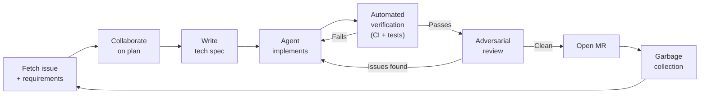
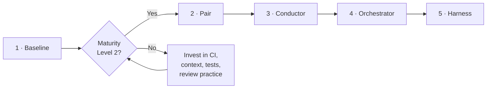
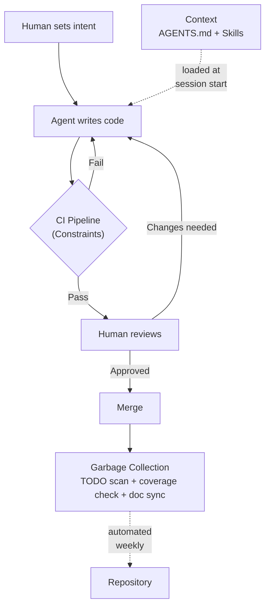

このプレイブックはすべての R&D チームに AI コーディングエージェントと作業するための共有フレームワークを提供します。準備状況の評価方法、整備すべきインフラ、エージェント支援ワークフローを最大限に活用する方法をカバーします。

## 全体像

このプレイブックのコンポーネントは再現可能なワークフローループに接続されます:



GitLab Duo 固有のプラクティスについては [Duo-First Development](/handbook/engineering/workflow/duo-first-development/) を参照してください。ツールのセットアップとヒントについては [AI in Developer Experience](/handbook/engineering/infrastructure-platforms/developer-experience/ai/) と [AI at GitLab Tips](/handbook/tools-and-tips/ai/) を参照してください。

## コア原則

GitLab でエージェントを使って本番コードを出荷したチームからの5つのルールです（[社内事例](#社内事例)参照）:

1. **すべての機能の前に失敗するテスト。** 失敗するテストなしにエージェントにタスクを与えないでください。テストはエージェントの「完了」を定義し、CI での回帰を捕捉します。
2. **プロンプトではなく環境を修正する。** エージェントが悪いコードを生成した場合、より良いプロンプトを書かないでください。リントルール、テスト、またはドキュメントを追加してください。環境の修正はセッションをまたいで持続します。プロンプトは持続しません。
3. **制約は乗数。** 1つの CI ゲートはプロンプト命令の1000行よりも多くのバグを捕捉します。ルールは自然言語ではなく CI にエンコードしてください。
4. **リポジトリが唯一の真実の源。** アーキテクチャの決定、品質基準、コーディング規約はエージェント（と人間）が読めるリポジトリに属します。Slack や Google Doc ではありません。
5. **エージェントにあなたを挑戦させてください。** エージェントはデフォルトで同意的です。計画の欠陥を見つけ、実装前に明確な質問をし、アプローチが間違っているように見える場合に示すよう明示的に指示してください。命令を実行するだけのエージェントは、反論するエージェントより価値が低いです。毎回のセッションで適用されるよう、これを Skills や AGENTS.md にエンコードしてください。

## 自律レベル

すべてのリポジトリが同じレベルの AI 関与に準備できているわけではありません。この5つのレベルは、オートコンプリートから自律エージェントへの段階的な進行を説明します。

| レベル | 名前 | 人間が行うこと | エージェントが行うこと |
|---|---|---|---|
| 1 | **ベースライン** | すべてを書く | オートコンプリートの提案 |
| 2 | **ペア** | 設計とレビュー | コードを書く |
| 3 | **コンダクター** | タイトなフィードバックループで操縦 | 単一のタスクをエンドツーエンドで実行 |
| 4 | **オーケストレーター** | 複数の非同期エージェントを管理 | 並行ワークストリームを実行 |
| 5 | **ハーネス** | アーキテクチャと品質基準を設定 | 他のすべて |

適切なインフラなしでレベル4または5にスキップすると、不信頼な出力が生成され技術的負債が増幅されます。まず[成熟度グリッド](#成熟度の自己評価)でレベル2に達してください。



## ハーネス

エージェントが信頼性の高い出力を生成するための3つのコンポーネント。これらはループを形成します: コンテキストがエージェントに供給され、制約が出力を検証し、ガベージコレクションがセッション間でリポジトリの健全性を維持します。



### 1. 制約 — プロンプトではなく CI で強制する

プロンプトは提案です。CI はゲートです。エージェントがルールを破ってもパイプラインを通過できるなら、そのルールは存在しません。

| 強制すべきもの | 例 |
|---|---|
| レイヤー境界 | `app/models/` が `app/controllers/` からインポートする場合に失敗する構造テスト |
| 禁止されたパターン | 空のボディで `rescue => e` をブロックするカスタム RuboCop cop |
| API スキーマ | OpenAPI スペックに対してリクエスト/レスポンス形状を検証するコントラクトテスト |
| テスト数 | `skip-test-count-check` ラベルなしでテスト数が減少した場合に失敗する CI ジョブ |
| シークレットと依存関係 | マージ前にシークレット検出 + 依存関係スキャンが必須 |
| ドメイン固有のレビュー | ドメインにスコープされた `fileFilters` を持つ `.gitlab/duo/mr-review-instructions.yaml`、特にセキュリティレビュー |

**MR レビュー指示**により、すべてのマージリクエストで Duo が強制するドメインルールをコード化できます。`.gitlab/duo/mr-review-instructions.yaml` にルールを定義し、`fileFilters` で特定のファイルパスにスコープを絞ると、Duo がすべての MR をそれに対してチェックします。完全なセットアップについては [MR レビュー指示での標準のコード化](/handbook/engineering/infrastructure-platforms/developer-experience/ai/#codifying-standards-with-mr-review-instructions)を参照してください。

**テスト数ガード**はエージェントがテストを削除して合格させる（既知の失敗モード）ことを防ぎます。最小限の CI ジョブ:

```yaml
test-count-guard:
  stage: verify
  script:
    - TEST_COUNT=$(grep -c "^--- PASS\|^--- FAIL" test-output.txt)
    - |
      if [ -f test-count-baseline.txt ]; then
        BASELINE=$(cat test-count-baseline.txt)
        if [ "$TEST_COUNT" -lt "$BASELINE" ]; then
          echo "Test count decreased from $BASELINE to $TEST_COUNT"
          exit 1
        fi
      fi
```

### 2. コンテキスト — 3層構造、リポジトリが真実の源

エージェントはタイピングを開始する前にプロジェクトを理解していると、よりパフォーマンスが向上します。3層のコンテキスト階層を設定してください:

| 層 | ファイル | 含めるもの |
|---|---|---|
| グローバル | `~/.claude/CLAUDE.md` | 約20行: 好みのスタイル、グローバルの「やってはいけない」ルール |
| プロジェクト | リポジトリルートの `AGENTS.md` | ビルド/テスト/リントコマンド、リポジトリ構造、規約、変更禁止ファイル |
| モジュール | サブディレクトリの `AGENTS.md` | パッケージ固有のルール（控えめに使用） |

**`AGENTS.md` の例:**

```markdown
# Commands
- Run all tests: `bundle exec rspec`
- Run single test: `bundle exec rspec spec/path/to_spec.rb`
- Lint: `bundle exec rubocop -A`

# Repo structure
- Feature code: `app/`
- Specs mirror app structure in `spec/`
- Shared test helpers: `spec/support/`
- Database migrations: `db/migrate/` — never modify without explicit ask

# Conventions
- Prefer keyword arguments for methods with 3+ parameters
- All new endpoints need request specs
- Branch naming: `<type>/<issue-id>-short-description`

# Off limits
- Do not modify `.gitlab-ci.yml` without checking with the team
- Do not change files in `db/migrate/` unless explicitly asked
- Do not commit code with `binding.pry` or `debugger` statements
```

GitLab Duo Chat とほとんどの主要な AI ツール（[Cursor、Copilot、Windsurf、Codex](https://agents.md/)）は `AGENTS.md` をネイティブに読みます。セットアップの詳細については [CLAUDE.md と AGENTS.md でリポジトリにコンテキストを焼き込む](/handbook/engineering/infrastructure-platforms/developer-experience/ai/#baking-context-into-repositories-with-claudemd-and-agentsmd)を参照してください。GitLab プロジェクトでは、`.ai/agents.md` がルートファイルとして存在します。

**Skills** はリポジトリに保存された再利用可能なエージェントタスクです — 名前、説明、手順を持つ小さな Markdown ファイルです。繰り返し可能なワークフローに使用してください:

```markdown
---
name: review-mr
description: Use this when asked to review a merge request
---
1. Read the MR diff using `glab mr diff <id>`
2. Check for: missing tests, silent error swallowing, n+1 queries
3. Write findings as MR comments using `glab mr comment <id>`
```

### 3. ガベージコレクション — メンテナンスを自動化する

AI で生成されたコードは他のコードと同様に腐敗を蓄積します。クリーンアップを自動化してください:

| 何を | どのように | 頻度 |
|---|---|---|
| 古い TODO/FIXME | 未解決の TODO をスキャンして Issue を開く CI ジョブ | 毎週 |
| テストカバレッジのドリフト | カバレッジが低下した場合の MR コメント警告 | すべての MR |
| ドキュメントの新鮮さ | ドキュメントの最終更新日と関連コードの変更を比較 | 毎週 |
| 依存関係の更新 | Renovate または Dependabot | 毎週 |
| ドキュメントの収束 | ドキュメントとコードの差分を取って修正を提出するエージェントループ（"Ralph パターン"） | 毎週 |

### AI 支援リポジトリのテストパターン

エージェントがコードを書く場合に特に重要な2つのテストパターン:

**キャラクタリゼーションテスト**はリファクタリング前に既存の動作をラップします。エージェントに今日のコードの動作をキャプチャするテストを生成するよう依頼し、それをレビューしてコミットします。これでエージェントは安全にリファクタリングできます — 動作の変更はすべて CI で失敗します。

```ruby
# Before refactoring a service, lock down its current behavior
RSpec.describe MyService do
  it "returns the expected response for a standard input" do
    result = described_class.new(user).execute
    expect(result.status).to eq(:success)
    expect(result.payload).to match(a_hash_including(id: user.id, role: "developer"))
  end

  it "returns an error for an invalid input" do
    result = described_class.new(nil).execute
    expect(result.status).to eq(:error)
    expect(result.message).to include("must be present")
  end
end
```

**ゴールデンフィクスチャテスト**は既知の良い出力をフィクスチャファイルとしてコミットし、それと比較します。API レスポンス、シリアライズされたデータ、安定したままであるべき出力に有用です:

```ruby
RSpec.describe "GET /api/v4/projects/:id" do
  it "matches the expected response shape" do
    get api("/projects/#{project.id}", user)

    expect(response).to have_gitlab_http_status(:ok)
    expect(json_response).to match_snapshot("project_response")
  end
end
```

Go サービスでは、出力が意図的に変更された場合にゴールデンファイルを再生成する `-update` フラグが一般的なパターンです。

## 成熟度の自己評価

各次元でリポジトリを評価します。ベースライン自律レベルを超えて進む前に**すべての4つで Level 2 に達してください**。

| 次元 | Level 0 — 準備未完了 | Level 1 — 基本 | Level 2 — 安定 | Level 3 — 最適化 |
|---|---|---|---|---|
| **CI と制約** | CI パイプラインなし | CI はあるがカスタムルールなし | リンター + シークレット検出 + 依存スキャンを強制 | カスタムルール、テスト数ガード、コントラクトテスト |
| **コンテキストとドキュメント** | AGENTS.md なし | AGENTS.md はあるが曖昧 | AGENTS.md + ARCHITECTURE.md | 3層階層 + DECISIONS.md + モジュールドキュメント |
| **テストの深さ** | 意味のあるカバレッジなし | ユニットテストはある | 統合 + スナップショットテスト + ゴールデンフィクスチャ | キャラクタリゼーションテスト + テスト数ガード + コントラクトテスト |
| **レビュープラクティス** | レビューの強制なし | コードレビューは必須だがアドホック | CODEOWNERS + レビュアーチェックリスト | CI での AI レビュー + 作者とレビュアーの分離 |

## 効率化テクニック

### Git worktrees — コンテキスト切り替えなしの並行ブランチ

各ブランチが独自の作業ディレクトリを持ちます。1つのブランチでエージェントを実行しながら、別のブランチをレビューします。

```shell
# Create a worktree for a feature branch
git worktree add ../my-feature feature-branch

# List all worktrees
git worktree list

# Clean up when done
git worktree remove ../my-feature
```

### すべてをスクリプト化する

個人の CLI を書くコストはほぼゼロです。自動化する価値があるものの例:

```shell
# Fetch an issue, analyse the relevant code, write findings to a file
glab issue view 12345 -R gitlab-org/gitlab -F json | \
  claude "Read this issue. Find the relevant code. Write your analysis to analysis.md"

# Set up a local MR review environment
glab mr checkout 98765 && bundle exec rspec
```

### コンテキストウィンドウを小さく保つ

エージェントはトークンを消費します。アクション可能な情報のみ送信してください。

**Skills と MCP の違い:** Skills は2行（名前 + 説明）で即座に読み込まれます。MCP ツールの定義（`glab` など）は最大30k の入力トークンを消費する可能性があります。フォーカスされた繰り返し可能なタスクには Skills を使用してください。エージェントが GitLab API などの外部システムへのライブアクセスが必要な場合は MCP を使用してください。

**フィードバックスクリプト:** エージェントをループで実行する場合、生のターミナル出力を渡さないでください。失敗したテストとリントエラーのみにフィルタリングしてください:

```shell
# Bad: agent sees 500 lines of passing tests
bundle exec rspec

# Good: agent only sees failures
bundle exec rspec --format documentation --failure-exit-code 1 2>&1 | grep -A 5 "FAILED\|Error"
```

**プランモード:** 発見と実行を分離します。ツールのネイティブプランモードを使用するか、エージェントにコーディング前に `plan.md` を書いてもらいます。これにより、実装中にエージェントが探索にコンテキストを消費するのを防ぎます。

### フェーズごとに役割ベースのペルソナを使用する

ワークフロー全体で AI を1つの汎用アシスタントとして使わないでください。各フェーズで明示的に役割を切り替えてください:

| フェーズ | ペルソナ | 指示スタイル |
|---|---|---|
| 発見/計画 | プロダクトマネージャー + アーキテクト | "私の仮定に挑戦してください。ギャップを見つけてください。解決策を提案する前に明確化の質問をしてください。" |
| 実装 | エンジニア | "スペックを実装してください。早期に失敗してください。変更のたびにテストを実行してください。" |
| 検証 | テスター | "これを壊そうとしてください。実装が処理しないエッジケースを見つけてください。" |
| マージ前レビュー | 敵対的レビュアー | "見つけられるすべての問題を見つけてください — セキュリティホール、欠落しているテスト、誤った仮定。励ましになることはしないでください。" |

各ペルソナを Skill としてエンコードして一貫して読み込まれるようにしてください。4つの役割すべてを同じセッションで行おうとすると、それぞれで凡庸な出力が生成されます。

### AI に自分の指示を改善させる

`AGENTS.md` と Skills は単なる Markdown です。エージェントがより良い方法を見つけた場合、自分の指示を更新させてください。次のセッションは改善されたコンテキストで始まります。

#### セッション学習ログ

`AGENTS.md` の隣に、git-ignore されたファイル（例: `AGENTS.local.md`）を、エージェントが遭遇した問題と解決した方法の継続ログとして維持します。エージェントが行き詰まったとき、未文書化の制約を発見したとき、またはゼロから解決策を探し出さなければならなかった修正を見つけたときに追記するよう依頼してください。

```markdown
# Session learnings

## 2024-03-15 — RSpec shared context loading order
Problem: Agent kept failing specs because it loaded shared contexts after the subject was defined.
Fix: Always require `spec/support/shared_contexts` at the top of the spec file, not inline.
Rule added to AGENTS.md: yes

## 2024-03-18 — GraphQL mutation naming convention
Problem: Agent used `UpdateFoo` mutation name; CI rejected it because the convention is `FooUpdate`.
Fix: Added naming rule to AGENTS.md under Conventions.

Over time this log becomes the institutional memory of every non-obvious thing the agent had to learn — and prevents it from making the same mistake twice.
```

### 検索せず、質問する

10秒で答えが見つからない場合は、ターミナルタブを開いてエージェントに質問してください。小さすぎる質問はありません。エージェントは「このサービスはどこでリトライを処理していますか？」や「このモジュールのテストパターンは何ですか？」のような質問では grep よりも速いです。

### ループから抜け出す

エージェントの作業サイクル中に手動テストをしないでください。あなたはループで最も遅い部分です。設計の決定とコードレビューのために時間を確保してください。エージェントはウェブページとターミナル出力を自分でチェックできます。

## 始め方

1つのリポジトリを選んでください。今週これら4つのことをしてください:

1. **成熟度評価を実行する。** [上記のグリッド](#成熟度の自己評価)でリポジトリを評価します。チームと結果を共有します。
2. **`AGENTS.md` を作成する。** ビルド/テスト/リントコマンド、リポジトリ構造、規約、変更禁止ファイルを追加します。[上記の例](#2-コンテキスト--3層構造リポジトリが真実の源)を出発点として使用するか、Claude Code で `/init` を実行してドラフトを生成します。
3. **CI 制約を1つ追加する。** 最も簡単に実施できるものを選びます: シークレット検出を有効にする、リンターを追加する、またはテスト数チェックを追加する。
4. **AI 支援テストを1つ書く。** 複雑な関数を選んでください。AI ツールにキャラクタリゼーションテストを生成するよう依頼します。レビューし、修正し、コミットします。

## 社内事例

- [Knowledge Graph Orbit](https://gitlab.com/gitlab-org/orbit/knowledge-graph/-/work_items/163) — 135K 行の Rust コードベース、95% が AI 生成、4人のエンジニア、259 MR、2週間。CI、AGENTS.md、アーキテクチャドキュメントが最初の日から整備されていたため機能しました。
- [IAM プロジェクトハーネスセットアップ](https://gitlab.com/gitlab-org/gitlab/-/work_items/594545) — Go サービス: パッケージマップを含む AGENTS.md、ゴールデンフィクスチャテスト、MR レビュー指示、テスト数ガード、CODEOWNERS。
- [モノリス認証ハーネスセットアップ](https://gitlab.com/gitlab-org/gitlab/-/work_items/594546) — Ruby モノリス: モジュールレベルの AGENTS.md、ドメインスコープの MR レビュー指示、キャラクタリゼーションテスト、成熟度ギャップ分析。
- [DevEx チーム AI ワークフロー](/handbook/engineering/infrastructure-platforms/developer-experience/ai/) — MR への AI 支援ラベル、YAML での MR レビュー指示、GitLab MCP サーバーセットアップ、AGENTS.md パターン。
- [Duo-First Development](/handbook/engineering/workflow/duo-first-development/) — Issue 作成、MR 生成、コードレビュー、テスト生成、ドキュメント全体で Duo を使用するための標準プラクティス。

## 外部参考資料

- [AI 支援開発プレイブック（スライド）](https://docs.google.com/presentation/d/111w5pTW5G-yUCrF2M_GTVa7U-NaTo1M-6NtOCVVLoHs/edit?slide=id.g3d25f169cfe_0_649#slide=id.g3d25f169cfe_0_649) — このページのベースとなったオリジナルのスライドデッキ
- [AGENTS.md オープンスタンダード](https://agents.md/) — スペックとツール互換性マトリックス
- [GitLab Duo ドキュメント](https://docs.gitlab.com/ee/user/gitlab_duo/)
- [GitLab MCP サーバーセットアップ](https://docs.gitlab.com/user/gitlab_duo/model_context_protocol/mcp_server/)
- [AI コーディングルールロールアウトプレイブック](https://aicodingrules.com/blog/ai-coding-rules-rollout-playbook) — エンジニアリングチーム向けの30日間ロールアウトカレンダー
- [エージェントの動作を変える AGENTS.md パターン](https://blakecrosley.com/blog/agents-md-patterns) — 効果があるものとないもの
