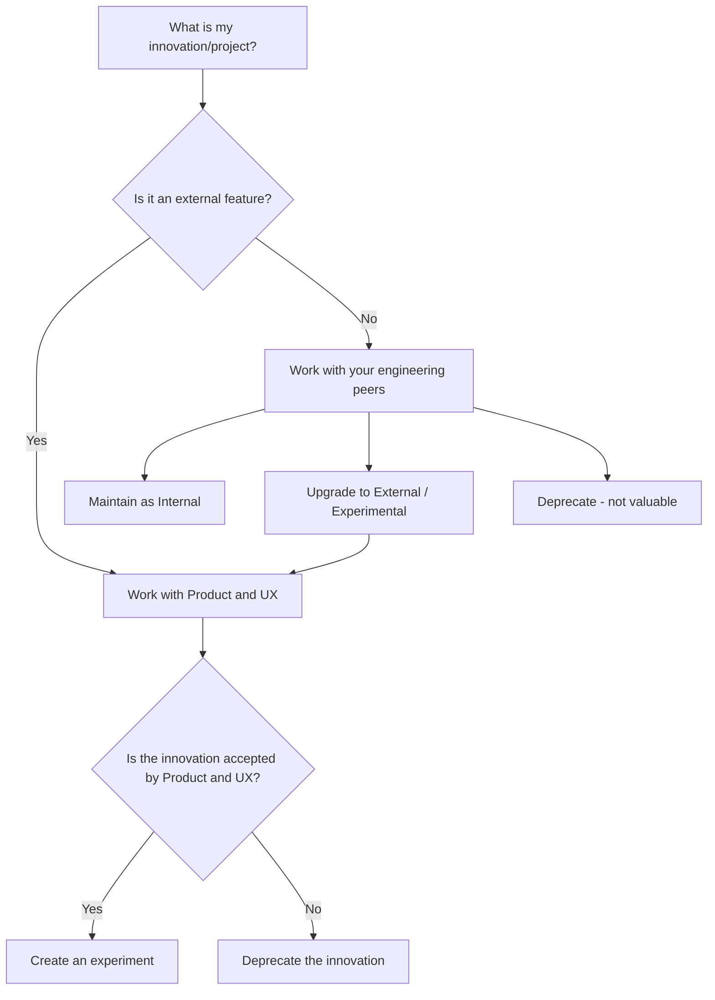

このガイドは、イノベーション（概念実証）を作成し、透明でコラボレーティブな方法で社内外に共有したいと考える GitLab チームメンバー（エンジニア、プロダクトマネージャー、デザイナー）のための総合ハンドブックです。

## GitLab 戦略との整合

GitLab におけるイノベーションは重要です: それは会社戦略に概説された長期的な戦略ビジョンの核心的な要素です。「シードしてから育てる（seed then nurture）」というアプローチにより、初期の概念実証がユーザー採用とビジネス成長の両方を促進する成熟した機能へと発展できます。

この反復的でコラボレーティブなガイドは、短期的な概念実証と長期計画を橋渡しすることで、GitLab の3ヵ年戦略を直接支援します。イノベーションが洗練・拡張されるにつれ、私たちの戦略的優先事項を強化し、変化する市場トレンドに動的に適応できるようになります。

## 目次

1. [概要](#overview)

1. [社内イノベーションと社外イノベーション](#internal-vs-external-innovations)

1. [プロセス: イノベーションの作成と管理](#process-creating-and-managing-an-innovation)

1. [イノベーションの共有](#sharing-your-innovation)

1. [追加リソース](#additional-resources)

## 概要 {#overview}

GitLab でイノベーションを生み出すとは、新しいアイデアを探求し、新製品を作成したり既存の製品やプロセスを改善するためのプロトタイプを構築することを意味します。このガイドでは、社内外の設定において、アイデア創出からフィードバックの共有まで従うべきステップを概説しています。イノベーションとは、新機能、機能の改善、未知のユースケースを示す GitLab 機能の革新的な活用、新しい組織ツール、または GitLab の成功に貢献するあらゆるものです。

- **イノベーション（概念実証、または POC）:** 新しいアイデアまたは潜在的な製品機能を検証するために作成されるプロトタイプ。

- **エピックによる追跡:** 透明性と可視性のために、GitLab エピックを使用してイノベーションに関連するすべてのタスクと Issue を単一のボード（具体的には「[Innovation at GitLab](https://gitlab.com/groups/gitlab-org/-/epic_boards/2069774?label_name[]=innovation)」ボード）に集約します。

> **注意:** イノベーションはまだ[*実験*](https://docs.gitlab.com/policy/development_stages_support/#experiment)ではありませんが、このガイドは該当する場合にイノベーションを実験段階に進める手助けをします。イノベーションがモニタリング指標とポジティブなフィードバックを通じて成功を示した場合、プロダクト組織との協力を通じて本格的な製品機能に昇格させることができます。

**知っておくと良いこと:** POC の強みは、シンプルさと価値を素早く示す能力にあります。POC は小規模でフォーカスされた状態を保ちましょう:

- コンセプトを実証するために必要な最小限の実装から始めます。
- 完全な実装の前に技術的な実現可能性と価値提案を証明することに集中します。技術的に実現可能だとわかっている特定のコンポーネントはシミュレートまたはスタブにしても構いません。
- 例としては、例示出力を含む新しいプロンプト、基本的な UI モックアップ、またはシンプルなデータセットのデモンストレーションが含まれます。

覚えておいてください: 目標は、アイデアを素早く検証して価値を示すことであり、完全な機能を構築することではありません。

## 社内イノベーションと社外イノベーション {#internal-vs-external-innovations}

イノベーションは社内または社外のいずれかです。社外イノベーションの目標は概念実証を[実験的](https://docs.gitlab.com/policy/development_stages_support/#experiment)機能に進めることであり、社内イノベーションは GitLab の内部業務とチームの効率向上に焦点を当てています。

プロセスを示すフローチャートを以下に示します:

> **注意:** イノベーションがどちらのパスをたどるべきか不明な場合は、マネージャーに相談してください。

### 社内イノベーション

社内イノベーションは、GitLab の内部業務とチームの効率を改善するツール、プロセス、システムの開発に焦点を当てています。これらのイノベーションは:

- 主に外部顧客ではなく GitLab チームメンバー向けに設計されています
- 内部ワークフロー、自動化、またはツールの改善に焦点を当てています
- 初期段階では広範なプロダクトや UX の関与を必要としない場合があります
- このガイドで概説されている社内イノベーションプロセスに従います

> **注意:** 社内イノベーション、またはその構成要素は、GitLab の顧客にとって有益な価値を示す場合、社外機能に発展することがあります。その場合、DRI はプロダクトチームおよび UX チームとのコラボレーションを開始し、このガイドで概説されている[社外イノベーション](#external-innovations)プロセスに従う必要があります。

### 社外イノベーション {#external-innovations}

社外イノベーションは、顧客に直接影響する GitLab 製品の新機能や機能強化の開発に焦点を当てています。これらのイノベーションは:

- GitLab 製品の提供の一部となることを意図しています
- 顧客体験やユーザーインターフェイスに直接影響します
- 早期からプロダクトチームおよび UX チームと協力する必要があります
- 製品ロードマップや戦略的イニシアティブと整合する必要があります

> **重要な注意:** すべての社外イノベーションには「概念実証」または類似のラベルを明確に付ける必要があります。

## プロセス: イノベーションの作成と管理 {#process-creating-and-managing-an-innovation}

## ステップ 1: 提案を作成しマネージャーの承認を得る

1. 以下を含む簡潔なアブストラクトを作成します:
    1. あなたのコアアイデアとビジョン
    1. 対処する具体的な問題
    1. 予想されるビジネス価値と影響（ユースケースの例を含む）
    1. タイムボックス内で検証する予定の主要な仮説
    1. 明確な目標を含むタイムボックスされたゴール
    1. 必要な推定時間投資
1. アイデアに時間を投資する前に必ずマネージャーに相談してください。マネージャーは、この作業が他のイニシアティブと比較して整合性が低いまたは優先度が低いことを示してくれるかもしれません。SPIKE Issue に提案を正式化し、重要な時間を投資する前にマネージャーの明示的な承認を得てから、このタイムボックスされた探索の最適なタイミングをマネージャーと協力して特定します。
1. インフラコスト、ライセンスコスト、メンテナンスコストなど、イノベーションのコスト面についても、知る限りで検討してください。
1. さらに、同じ問題を解決しようとしている他の専門家を特定するためにマネージャーと協力してください。

### ステップ 2: エピックを開始する

- **GitLab エピックを作成する:** 「[Innovation at GitLab](https://gitlab.com/groups/gitlab-org/-/epic_boards/2069774?label_name[]=innovation)」ボードにエピックを作成することから始めます。これがイノベーションのすべての側面を追跡するための中央ハブになります。

### ステップ 3: POC の作業を開始し関連 Issue を作成する {#step-3-start-work-on-the-poc-and-create-the-associated-issues}

エピックを作成した後、並行して POC の実際の作業を開始し、Issue を作成できます。POC の作業を通じて、以下のセクションの情報を埋めていきます。

エピック内に以下の Issue を作成します:

1. **概要:** イノベーションの目的、期待されるビジネス価値、詳細情報のリソースリストを詳述する高レベルのサマリーです。これはエピックの説明セクションに記載することもできます。エピックの概要セクションには以下を含めてください:
    - **基本プロパティ**: すべてのイノベーションには以下が必要です:
      - **DRI（直接責任者）:** 各イノベーションの DRI（実験段階に進む場合は実験の DRI）。この人はイノベーションが陳腐化しないようにクリーンアップの責任を負います。
      - **なぜ今なのか？** または **解決すべき問題は？** - ここにはイノベーションのビジネスケースを含めます。POC が解決しようとしている問題を誰もが理解できるようにします。
      - **依存関係または影響:** 他の製品エリアやチームへの依存関係または影響。
      - **タイムライン:** このイノベーションを「完了」とみなすものは何ですか？
      - **コスト:** この機能のコスト面はどうですか？インフラ関連のコストはありますか？予想されるメンテナンスコストは？
    - **社外イノベーション:** イノベーションが社外機能を意図している場合、以下を含めてください:
      - **ステージとグループ:** この機能が最終的に維持・所有されるステージとグループを特定し、そのグループのプロダクトマネージャーにタグ付けしてください。
      - **製品ロードマップおよび戦略的イニシアティブとの整合:** 可能であれば、この機能が製品ロードマップおよび戦略的イニシアティブとどのように整合するかについてのセクションを含めてください。
      - **セキュリティとプライバシー:** セキュリティとプライバシーの考慮事項 — セキュリティチームによるレビューは受けましたか？
      - **差別化計画:** 該当する場合、イノベーションが標準的な製品機能からどのように差別化されるか（視覚的またはその他の方法で）を説明してください。以下を含めます:
        - 使用する視覚的差別化アプローチ（UI バッジ、実験モード、フィーチャーフラグなど）。
        - ユーザーがイノベーションを見たり使用したりするためのオプトイン方法。
        - イノベーションに添付されるドキュメントや免責事項。

2. **POC（概念実証）またはデモ:** この Issue には以下を含めます:

    - アイデアの Why、ビジョンの背景にあるストーリー、潜在的なビジネス価値、POC のデモンストレーション（テキスト・動画・画像など）の簡潔な説明。

    - 関連するリポジトリとコードブランチへのリンク。

    - 該当する場合、POC 環境のセットアップ手順。

3. **フィードバック:** GitLab チームメンバーからの社内フィードバックと、該当する場合は外部ユーザーからのフィードバックを記録します。

4. **ドキュメント（任意）:** ダイアグラム、コードスニペット、技術的な説明を含むイノベーションの内部の詳細な内訳。
    - 「どのように作られたか」のガイドとして機能します。
    - POC は通常小規模でスタブ部分を含むことが多いため、実装の依存関係を概説してください。
    - 可能であれば、POC をどのように拡張できるかを説明してください。

5. **モニタリング（任意）:** この Issue はイノベーションのパフォーマンスをユーザーが理解するのに役立ちます。ダッシュボードへのリンクやパフォーマンス指標などのイノベーションの指標とモニタリング詳細を提供するためにこの Issue を使用できます。モニタリングデータが機密または機密情報の場合は、Issue が適切に処理されるようにしてください。

### ステップ 4: 機密性を検討する

- **デフォルトで公開:** GitLab の[デフォルトで公開](/handbook/values/#public-by-default)という価値観に沿って、イノベーションは可能であれば最初から公開にする必要があります。これにより以下が促進されます:
  - コミュニティとの信頼と透明性の強化
  - 潜在的なコミュニティコラボレーションの機会

- **機密性ガイドラインの確認:** イノベーションを公開する前に、[機密性レベル](/handbook/communication/confidentiality-levels/#not-public)のガイドラインを確認して、イノベーションに以下のような公開すべきでない機密情報が含まれているかどうかを判断してください:
  - 特許取得の可能性があるイノベーション（法務チームに相談）
  - 一時的な機密性を必要とする戦略的イニシアティブ

- **イノベーション免責事項:** イノベーションを公開で共有する際は、エピックの冒頭に以下の免責事項を含めてください:

  > このページには非公式な製品、機能、機能性に関する情報が含まれています。ここに提示される情報は情報提供のみを目的としていることに注意してください。購入または計画目的でこの情報に依存しないでください。製品、機能、機能性の開発、リリース、タイミングは変更または遅延される可能性があり、GitLab Inc. の単独の裁量に委ねられています。

- **不明な場合:** イノベーションの機密性要件について不明な場合は、マネージャーに相談してください。機密から始めて公開に移行する方が、意図せず機密情報を開示するよりも良いです。

> **注意:** GitLab YouTube Unfiltered チャンネルを通じた動画がイノベーションに含まれており、イノベーションが機密とされている場合は、イノベーションを公開する準備ができるまでその動画をプライベートとしてマークすることをお勧めします。

## イノベーションの共有 {#sharing-your-innovation}

限られた厳選されたユーザーグループとイノベーションを共有することから始めます（例えば、そのグループに対してフィーチャーフラグを有効にすることによって）。グループメンバーに、エピックで先ほど作成したフィードバック Issue にフィードバックを共有するよう依頼してください。

初期フィードバックを集め、イノベーションの可能性を検証したら、以下のコミュニケーションステップを通じてより大きな組織にイノベーションを共有します:

1. **社内フィードバックを得る:**

    - [ステップ 3](#step-3-start-work-on-the-poc-and-create-the-associated-issues) で作成したフィードバック Issue で、マネージャーと Director+ から POC のフィードバックを得ます:

      - イノベーションが[社外](#external-innovations)向けの場合は、プロダクトおよび UX の同僚からインプットを集めます。

      - イノベーションが他の製品エリアに関わる場合は、[ショートトー](/handbook/values/#short-toes)の価値観に沿って、適切なチームを早期に関与させます。

2. **イノベーションを共有する！**

    - \#innovation チャンネルにイノベーションのサマリーを投稿して、より大きな組織と共有し、クロスチームの会話を始めます。他の関連するチャンネルにも共有してください。

    - エピックの Issue 説明で関連する人にタグ付けしてください。

3. **クロスチームコラボレーション:**

    - イノベーションがチームのドメインを超える場合、関連するカウンターパート（エンジニアリング、UX、プロダクト）と協力して、アイデアを効果的に洗練・引き継ぎます。

4. **機密の場合、エピックを公開に移行する:**

    - GitLab の[デフォルトで公開](/handbook/values/#public-by-default)という価値観に沿って、イノベーションの可能性を検証したらできるだけ早く、対応するプロダクトおよび UX チームと協力してイノベーションを公開します。イノベーションに特許取得の可能性がある情報が含まれている場合は、マネージャーと法務チームと協力して[特許要件](/handbook/legal/patent-program/#conditions-of-participation)を満たすかどうかを確認してください。

    - 移行が GitLab の会社戦略と[価値観](/handbook/values/)と整合していることを確認し、イノベーションを公開で伝える際はプロダクトおよび UX と協力してください。

## イノベーションプロセスの完了

イノベーションの作業が完了したら、関連する Issue とエピックをクローズし、今後の方向性について決断を下すことが重要です。これにより、GitLab の Issue トラッカーがクリーンで操作しやすい状態を保てます。

イノベーションは以下のいくつかの方法でクローズできます:

- イノベーション作業が前進しないという結論に至った
- イノベーションの準備が整い、製品機能の実験に昇格するか、実装される（技術的イノベーション）か、または社内イノベーションとして長期的に維持するかという決断を下せる状態になった
  - この決断を下すには、特定エリアの PM または EM にピングして、明確な決断とその理由を求めてください
- イノベーションの前進を妨げる法的またはセキュリティ上の懸念がある。

## 追加リソース {#additional-resources}

- **GitLab エンジニアリングハンドブック:** エンジニアリングのベストプラクティスと基準に関する詳細なコンテキストについては、[GitLab エンジニアリングハンドブック](/handbook/engineering/)を参照してください。

- **GitLab の価値観:** 私たちのコア原則については、[GitLab の価値観](/handbook/values/)ページをご覧ください。

- **アーキテクチャデザインワークフロー:** アーキテクチャのイノベーションは通常、[アーキテクチャデザインワークフロー](/handbook/engineering/architecture/workflow/)に従います。

---

このガイドはリビングドキュメントとして意図されています。GitLab が進化し、イノベーションへのアプローチが成長するにつれて、新しいプロセスや推奨事項でこのガイドを更新してください。
