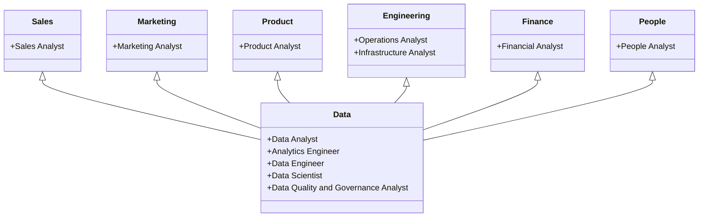

<link rel="stylesheet" type="text/css" href="/stylesheets/biztech.css" />

## エンタープライズデータチームハンドブックへようこそ

* 私たちのビジョンは、**データの力を責任を持って活用することで、GitLab がリーディングな AllOps プラットフォームになる旅に貢献する**ことです。
* ビジョンの実現に向けて、4つの成果に集中します:

1. **推進**: 必要な時と場所で、信頼性が高く革新的なデータプロダクトとインサイトを構築することで、会社の成果をドライブします。
2. **最小化**: 効率的なプロセスを実装し、セルフサービスアナリティクスを実現することで、質問からインサイト、そしてアクションまでの時間を短縮し、チームメンバーが速く動けるようにします。
3. **発展**: データ保護・プライバシー、プロセス・人・プラットフォームのイテレーションを通じて、データを統一された信頼できる資産として整備・保護します。
4. **実現**: すべてのチームメンバーが責任を持って信頼のある形で取り組みに貢献できるようにし、強力なデータドリブン文化を構築します。

* [方向性](https://internal.gitlab.com/handbook/enterprise-data/direction/)ページをお読みいただくと、データを改善するために私たちが何をしているかが分かります。
* 私たちの[原則](/handbook/enterprise-data/organization/principles/)は、ミッションの達成方法を示しています。

**貢献したいですか？[改善を提案する](https://gitlab.com/gitlab-data/analytics/-/issues)、[Slack #data を訪問する](https://gitlab.slack.com/messages/data/)、[データチームの動画を見る](https://www.youtube.com/playlist?list=PL05JrBw4t0KrRVTZY33WEHv8SjlA_-keI)。皆さんのご意見をお聞かせください！**

## GitLab でのデータの仕組み

GitLab のデータの状態を向上させることに集中する人々・プロジェクト・取り組みの総体を **GitLab データプログラム**と呼びます。GitLab には、データを活用してインサイトとビジネス判断を推進するデータプログラム内の 2 つの主要な独立したグループがあります。これらのグループは互いに補完的であり、ビジネスのトレンドへの深い理解を促進するために特定の分野に集中します。2 つのチームは、（中央の）エンタープライズデータチームと、Sales・Marketing・Product・Engineering・Finance にある別のファンクションアナリティクスチームです。[データ採用動画](https://youtu.be/4DlwsBIPxUw)を視聴して、関わるチームの一部と彼らが取り組んでいることをご覧ください。

* **データチーム**はマーケティングオフィスに報告し、エンタープライズのインサイト・アナリティクス（運用ではない）、データサイエンス、データプラットフォーム・インフラ、BI テクノロジー、マスターデータ、データガバナンス、データ品質の卓越センターです。データチームはエンタープライズデータ戦略にも責任を持ち、[エンタープライズ全体のデータモデル](/handbook/enterprise-data/platform/edw/)を構築し、セルフサービスデータ機能を提供し、[データプラットフォーム](/handbook/enterprise-data/platform/#i-classfas-fa-cubes-fa-fw--text-orangeiour-data-stack)を維持し、[データポンプ](/handbook/enterprise-data/platform/#data-pump)を開発し、[データ品質](/handbook/enterprise-data/data-governance/data-quality/)を監視・測定します。データチームは、GitLab チームメンバーが [Snowflake エンタープライズデータウェアハウス](/handbook/enterprise-data/platform/#i-classfas-fa-database-fa-fw--text-purpleidata-warehouse)から定期的にアクセスするデータで定義・アクセスされるデータを担当します。データチームは、定期的にアクセスされるデータの約80%を支えるデータインフラを構築します。データチームはまた、新しい高度なアナリティクス取り組みを立ち上げ、他の GitLab チームメンバーにガイダンスを提供するデータサイエンス卓越センターを提供します。

* **ファンクションアナリティクスチーム**はそれぞれの部門・部署に所属し報告します。これらのチームは、ファンクション内で行われるビジネス活動とワークフローのための具体的な分析を行います。これらのチームは、[データ開発](/handbook/enterprise-data/how-we-work/data-development/)アプローチに従い、必要な分析の緊急性と重要性に基づいてアドホック分析を実施し、ダッシュボードを開発します。最も重要で繰り返し行われる分析は、中央データチームが管理する集中型の[トラスティッドデータモデル](/handbook/enterprise-data/how-we-work/data-development/#trusted-data-development)によって支えられます。ファンクションアナリティクスチームはまた、トラスティッドデータの機能を必要としない、緊急かつ運用上のニーズを解決するためのファンクション固有のアドホックデータモデルとビジネスインサイトモデルを構築します。ファンクションアナリティクスチームはさまざまな方法でデータチームと密接に連携します: GitLab の全体的なアナリティクス能力の拡大、[データカタログ](/handbook/enterprise-data/data-governance/data-catalog/)の拡張、新しいトラスティッドデータモデルとダッシュボードの要件提供、メトリクスの検証、データチームへの作業優先順位付けの支援。ビジネスプロセスとソースシステムにデータのギャップが見つかった場合、チームメンバーはプロダクト管理・Sales Ops・Marketing Ops などに要件を提供し、ソースシステムが正しいデータを取得するようにします。

### データプログラムのチーム

GitLab データプログラムには以下の分野に集中したチームが含まれます:

* [カスタマーサクセス オペレーショナルデータチーム](/handbook/customer-success/product-usage-data/)
* [エンタープライズデータチーム](/handbook/enterprise-data/)
* [Finance アナリティクス & インサイト](/handbook/enterprise-data/organization/analytics/)
* [マーケティングアナリティクス](/handbook/enterprise-data/marketing-analytics/)
* [マーケティング Web アナリティクス](/handbook/enterprise-data/marketing-analytics/)
* [ピープルアナリティクスチーム](/handbook/people-group/people-ops-tech-analytics/people-analytics/)
* [プロダクトデータインサイト](/handbook/product/groups/product-analysis/)
* [アナリティクスインスツルメンテーショングループ](/handbook/engineering/data-engineering/analytics/analytics-instrumentation/)
* [Sales アナリティクス](/handbook/sales/field-operations/sales-strategy/)

### データチームの連携方法

通常の運用ベースでは、データチームとファンクションアナリストチームは「ハブ＆スポーク」モデルで機能し、データチームがアナリティクス・アナリティクステクノロジー・オペレーション・インフラの「ハブ」および卓越センターとして機能し、「スポーク」は各部門のファンクションアナリストを表します。ファンクションアナリストは自分の特定の分野で深い専門知識を発展させ、必要に応じてデータチームを活用します。時折、データチームは専任のファンクションアナリストがいない GitLab の部門、または専任のファンクションアナリストがいても追加のサポートが必要なチームに対して、限定的な開発サポートを提供します。チームは [Slack データチャンネル](/handbook/enterprise-data/#data-slack-channels)・[GitLab データプロジェクト](https://gitlab.com/gitlab-data/)・アドホックミーティングを通じてコラボレーションします。

### データプラットフォーム＆アーキテクチャチーム

**[データプラットフォーム＆アーキテクチャチーム](/handbook/enterprise-data/organization/engineering/)** はエンタープライズデータチームの一部であり、セキュアで効率的かつ信頼性の高いデータシステム[データインフラ](/handbook/enterprise-data/platform/)の構築と維持に集中します。データプラットフォーム＆アーキテクチャチームは開発チームであり、かつオペレーション/サイト信頼性チームでもあります。チームはすべてのデータポッドに**利用可能で信頼性が高くスケーラブルな**データコンピュート・処理・ストレージをサポートします。プラットフォームコンポーネントには、データウェアハウス・新しいデータソース・データポンプ・データセキュリティ・関連する新しいデータテクノロジーが含まれます。データプラットフォームチームはまた、[データ管理プロセス](/handbook/enterprise-data/data-governance/data-management/)を推進します。データプラットフォームチームは[データエンジニア](/job-description-library//marketing/enterprise-data/data-engineer/)で構成されています。

### アナリティクスエンジニアリングチーム

**[アナリティクスエンジニアリングチーム](/handbook/enterprise-data/organization/)** は生データをクリーンで構造化された、データ意思決定に使用可能なフォーマットに変換します。アナリティクスエンジニアリングチームはまた、エンタープライズデータプログラムを推進し、より広いデータコミュニティをサポートします。チームはエンタープライズレベルでのデータの目録化・統合・維持・ガバナンスに集中します。これには、ビジネスユニットとデータチームとのコラボレーション、エンタープライズデータに関する共通に受け入れられるガイドラインの確立・促進、[エンタープライズ全体のデータモデル](/handbook/enterprise-data/platform/edw/)の構築、エンタープライズデータモデルに関するデータイネーブルメントと必要なトレーニングを提供することによるセルフサービス BI およびアナリティクス機能のサポートが含まれます。

### エンタープライズインサイト＆データサイエンスチーム

**[エンタープライズインサイト＆データサイエンスチーム](/handbook/enterprise-data/organization/data-science/)** は、顧客行動と会社業績へのインサイトのためにアナリティクスと機械学習（ML）を活用します。エンタープライズインサイト＆データサイエンスチームは、顧客の完全なビュー（Customer 360）の提供・購入・拡大・または解約の可能性が高い顧客の予測・顧客の長期的価値を予測するモデルの開発・詳細な顧客プロファイルの作成・会社業績に関するインサイトの提供に集中します。チームは予測アナリティクスの卓越センターとして機能し、データサイエンスと機械学習のためのツール・プロセス・ベストプラクティスを開発することで、他のチームのデータサイエンスの取り組みをサポートします。現在のプロジェクトの一覧は[データサイエンスハンドブックページ](/handbook/enterprise-data/organization/data-science/)に記載されています。

### データガバナンス＆データ品質チーム

**[データガバナンス＆データ品質チーム](/handbook/enterprise-data/organization/)** は、堅牢なポリシー・高度なテクノロジー・コラボレーション文化によって実現される**整合性・信頼性・セキュアなアクセシビリティ**の最高基準で、私たちの組織がデータを戦略的資産として活用できるようにするデータガバナンスとデータ品質プログラムの構築に集中します。チームはエンタープライズアプリ・セキュリティ・法務を含むクロスファンクショナルなチームと連携し、データポリシー・品質コントロール・メタデータ管理・規制要件への準拠を確立します。

### エンタープライズデータチームのジョブファミリー

ジョブファミリーは、データチームに期待されるすべての日常的な活動をサポートするように設計されています。

* [データアナリスト](/job-description-library/marketing/enterprise-data/data-analyst/)
* [データサイエンティスト](/job-description-library/marketing/enterprise-data/data-science)
* [アナリティクスエンジニア](/job-description-library/marketing/enterprise-data/analytics-engineer/)
* [データエンジニア](/job-description-library/marketing/enterprise-data/data-engineer/)
* [データガバナンス＆品質アナリスト](/job-description-library/marketing/enterprise-data/data-governance-and-quality-analyst/)
* [データガバナンス＆品質プログラムマネージャー](/job-description-library/marketing/enterprise-data/data-governance-and-quality-program-manager/)
* [マネージャー、データ](/job-description-library/marketing/enterprise-data/manager-data/)
* [ディレクター、データ](/job-description-library/marketing/enterprise-data/data-and-insights-executive/)

### インパクトの測定方法

私たちのインパクトは4つの次元に対して測定されます（これらのメトリクスは、データ成熟度が高まり、集中分野が変わるにつれて調整されます）:

#### データプラットフォームの安定性

* インフラコスト対計画: このパフォーマンス指標は、データインフラ（ウェアハウス・ETL パイプラインなど）の計画コストに対する実際のコストの財務的ポジションを追跡します。
* データ稼働率: このパフォーマンス指標は、データパイプラインが報告されたインシデントなしにデータを提供していた時間の割合を測定します。この指標は現在 Monte Carlo のデータに基づいており、`raw` データレイヤーの任意のテーブルに設定された（自動）モニタに従っています。

#### データガバナンスとデータ品質

* データ品質メトリクスの改善率
* メタデータで充実したデータ資産の割合
* データ発見時間の短縮率

#### データの採用

* データ月間アクティブユーザー（DMAU）: DMAU は、私たちが提供する主要な分析ツール（Snowflake と Tableau）の使用状況に基づいて、GitLab チームメンバーによるデータプラットフォームの直接使用状況を測定します。将来的には Jupyter や Data Studio などの追加ツール、および Marketo（PQL）・Gainsight（使用データ）・Salesforce（傾向スコア）などの EApps にポンプで注入されたデータの使用状況も含める予定です。これらの数値の可視化は、[データ月間アクティブユーザー](https://10az.online.tableau.com/#/site/gitlab/workbooks/2049753/views)レポートで確認できます。

* データ月間アクティブユーザー（DMAU）= 特定の月にデータシステム（Snowflake・Tableau など）のユニークユーザー数
* データ成熟度スコア: 年次測定。8つのデータ能力に対する現在のデータ成熟度を評価します:
  1. 戦略＆アプローチ
  2. 文化＆リーダーシップ
  3. メトリクス＆KPI
  4. 組織＆スキル
  5. アーキテクチャ＆統合
  6. ガバナンス＆品質
  7. 展開＆使用
  8. テクノロジー＆オペレーション
* 認定済み Tableau ダッシュボードの数
* 認定済みダッシュボードからの総ビューの割合

#### 収益/効率のインパクト

まず、データ価値計算機によって算出される「結果のドル価値」として知られる評価基準があります。[データチーム価値計算機](/handbook/enterprise-data/how-we-work/#data-team-value-calculator)を使用して、私たちが貢献する取り組みと完了する Issue のドル価値を計算できます。
さらに、私たちはより野心的な測定へのシフトを目指しています。それはデータプロダクトごとの ARR インパクトまたは効率の向上を測定することです。データサイエンスモデルは以下の方法で測定されます:

* 拡大傾向（PtE）と購入傾向（PtP）- 2つのメトリクスを評価します: 1) 増分収益インパクト 2) 現在セールスファネルにないリードの数
* 解約傾向（PtC）- 2つのメトリクスを評価します: 1) 解約しなかった高解約傾向の顧客数 2) 増分収益インパクト

## お問い合わせ方法

  <a href="https://gitlab.slack.com/messages/data/" class="btn btn-purple" style="white-space: initial;min-width: 0;width: auto;margin:5px;display:grid;align-items:center;height:100%;">プライマリ #Data Slack チャンネル</a>

  <a href="https://gitlab.com/gitlab-data/analytics/-/issues" class="btn btn-purple" style="white-space: initial;min-width: 0;width: auto;margin:5px;display:grid;align-items:center;height:100%;">Issue トラッカー</a>
  <a href="https://www.youtube.com/playlist?list=PL05JrBw4t0KrRVTZY33WEHv8SjlA_-keI" class="btn btn-purple" style="white-space: initial;min-width: 0;width: auto;margin:5px;display:grid;align-items:center;height:100%;">GitLab Unfiltered データチームプレイリスト</a>

 

### データ Slack チャンネル

* [#data](https://gitlab.slack.com/messages/data/) は GitLab のすべてのデータおよび分析の会話のプライマリチャンネルです。他のチームのメンバーが Issue へのリンク・助けの要求・方向性・データチームメンバーからの一般的なフィードバックを求める場所です。
* [#data-team](https://gitlab.enterprise.slack.com/archives/C02UG779AQ1) はデータチームのアナウンスが行われる場所です。
* [#data-daily](https://gitlab.slack.com/messages/data-daily/) はデータエンジニアが日々の生産性・ブロッカー・楽しいことを追跡する場所です。[Geekbot](https://geekbot.com/) によって動作し、日次スタンドアップの非同期バージョンであり、データエンジニアの連携と情報共有を助けます。
* [#data-lounge](https://gitlab.slack.com/messages/data-lounge/) は興味深い記事・ポッドキャスト・ブログ投稿などへのリンクのためのチャンネルです。GitLab に必ずしも関連しないカジュアルなデータの会話に適した場所です。データチームのチーム内議論にも使用されます。
* [#data-engineering](https://gitlab.slack.com/messages/data-engineering/) は GitLab データプラットフォームチームが協力する場所です。
* [#bt-data-science](https://gitlab.slack.com/messages/bt-data-science/) は GitLab データサイエンスチームが協力する場所です。
* [#analytics-pipelines](https://gitlab.slack.com/messages/analytics-pipelines/) は dbt の実行と Monte Carlo の分析のための Slack ログが出力され、アナリティクスエンジニアが維持するチャンネルです。このチャンネルの Issue の追跡とトリアージの DRI は[こちら](/handbook/enterprise-data/how-we-work/triage/#enterprise-data-triage-groups)に示されています。
* [#data-triage](https://gitlab.slack.com/messages/data-triage/) はデータチームプロジェクトの開かれた・閉じられた Issue と MR のアクティビティフィードです。
* [#data-pipelines](https://gitlab.slack.com/archives/C0384JBNVDJ) は ELT パイプライン / FiveTran / Monte Carlo RAW レイヤーの異常からのアラートが発行され、データエンジニアが維持するチャンネルです。このチャンネルの Issue の追跡とトリアージの DRI は[こちら](/handbook/enterprise-data/how-we-work/triage/#enterprise-data-triage-groups)に示されています。

データチームのサブセットをタグ付けするには以下を使用します:

* @datateam - データチーム全体に通知します
* @data-engineers - データエンジニアのみに通知します
* @data-analysts - データアナリストのみに通知します
* @analytics-engineers - アナリティクスエンジニアのみに通知します
* @data-governance - データガバナンスと品質チームメンバーのみに通知します

まれなケースを除き、他のチームのメンバーとの会話は #data で行い、適切な場合はフュージョンチームチャンネルで行うべきです。このガイダンスに反して他のチャンネルへの投稿があった場合は、#data チャンネルへのリダイレクトとさまざまなチャンネルの用途を明確にするためのこのハンドブックセクションへのリンクで応答してください。

### GitLab グループとプロジェクト

データチームは GitLab 上で主に以下のグループとプロジェクトを使用します:

* [GitLab Data](https://gitlab.com/gitlab-data) は GitLab データチームのメイングループです。
* [GitLab Data Team](https://gitlab.com/gitlab-data/analytics) は GitLab データチームのプライマリプロジェクトです。

私たちの GitLab プロジェクトの多くは[内部のみ](/handbook/communication/confidentiality-levels/#internal)ですが、残りはデフォルトで[パブリック](/handbook/values/#public-by-default)です。

GitLab でデータチームをタグ付けするには以下を使用します:

* @gitlab-data - データチーム全体に通知します
* @gitlab-data/engineers - データエンジニアのみに通知します
* @gitlab-data/analysts - データアナリストのみに通知します
* @gitlab-data/analytics-engineers - アナリティクスエンジニアのみに通知します

### チーム・オペレーション・テクニカルガイド

|  **テクニカルガイド** | **インフラ** | **データチーム** |
| :--------------- | :----------------- | :-------------- |
| [SQL スタイルガイド](/handbook/enterprise-data/platform/sql-style-guide/) | [高レベルダイアグラム](/handbook/enterprise-data/platform/#i-classfas-fa-cubes-fa-fw--text-orangeiour-data-stack) | [作業方法](/handbook/enterprise-data/how-we-work/) |
| [dbt ガイド](/handbook/enterprise-data/platform/dbt-guide/) | [システムデータフロー](/handbook/enterprise-data/platform) | [チーム組織](/handbook/enterprise-data/organization/) |
| [Python ガイド](/handbook/enterprise-data/platform/python-guide/) | [データソース](/handbook/enterprise-data/platform/)| [カレンダー](/handbook/enterprise-data/how-we-work/calendar/) |
| [Airflow & Kubernetes](https://internal.gitlab.com/handbook/enterprise-data/platform/infrastructure/#common-airflow-and-kubernetes-tasks) | [Snowplow](/handbook/enterprise-data/platform/snowplow/)  | [トリアージ](/handbook/enterprise-data/how-we-work/triage/) |
| [Docker](https://internal.gitlab.com/handbook/enterprise-data/platform/infrastructure/#docker) | [Permifrost](/handbook/enterprise-data/platform/permifrost/) | [マージリクエスト](/handbook/enterprise-data/how-we-work/mr-review/) |
| [Data CI Jobs](/handbook/enterprise-data/platform/ci-jobs/) |  | [計画ドラムビート](/handbook/enterprise-data/how-we-work/planning/) |
| [Rstudio ガイド](/handbook/enterprise-data/platform/rstudio/) | [トラスティッドデータ](/handbook/enterprise-data/how-we-work/data-development) | [データサイエンスチーム](/handbook/enterprise-data/organization/data-science) |
| [Jupyter ガイド](/handbook/enterprise-data/platform/jupyter-guide/) | | [データ管理](/handbook/enterprise-data/data-governance/data-management/) |
| [データオンボーディング](/handbook/enterprise-data/organization/programs) | | |
| [学習ライブラリ](/handbook/enterprise-data/organization/learning-library/) | | |
| [Tableau ガイド](/handbook/enterprise-data/platform/tableau/) | | |
| [Tableau スタイルガイド](/handbook/enterprise-data/platform/tableau/tableau-developer-guide/tableau-style-guide/) | | |

## データチームハンドブック構造

* [ダッシュボード＆使用できるデータ](/handbook/enterprise-data/data-governance/data-catalog/)
* [データの学習とリソース](/handbook/enterprise-data/organization/learning-library/)
* [データプログラム](/handbook/enterprise-data/organization/programs/)
* [データチームの作業方法](/handbook/enterprise-data/how-we-work/)
  * [カレンダー](/handbook/enterprise-data/how-we-work/calendar/)
  * [データアナリティクスチーム](/handbook/enterprise-data/organization/analytics/)
  * [アナリティクスエンジニアリングチーム](/handbook/enterprise-data/organization/analytics-engineering/)
  * [データプラットフォームチーム](/handbook/enterprise-data/organization/engineering/)
  * [データサイエンスチーム](/handbook/enterprise-data/organization/data-science)
  * [データチームの原則](/handbook/enterprise-data/organization/principles/)
  * [データ管理](/handbook/enterprise-data/data-governance/data-management/)
  * [計画ドラムビート](/handbook/enterprise-data/how-we-work/planning/)
  * [トリアージ](/handbook/enterprise-data/how-we-work/triage/)
* [データプラットフォームの仕組み](/handbook/enterprise-data/platform/)
  * [Data CI Jobs](/handbook/enterprise-data/platform/ci-jobs/)
  * [データインフラ](/handbook/enterprise-data/platform/infrastructure/)
  * [データオンボーディング](/handbook/enterprise-data/organization/programs)
  * [インターンシップ体験](/handbook/enterprise-data/organization/internship-experience/)
  * [プロダクトマネージャー向けデータ](/handbook/enterprise-data/organization/programs/data-for-product-managers/)
  * [データ品質](/handbook/enterprise-data/data-governance/data-quality/)
  * [dbt ガイド](/handbook/enterprise-data/platform/dbt-guide/)
  * [エンタープライズデータウェアハウス](/handbook/enterprise-data/platform/edw/)
  * [Jupyter ガイド](/handbook/enterprise-data/platform/jupyter-guide)
  * [Permifrost](/handbook/enterprise-data/platform/permifrost/)
  * [Python ガイド](/handbook/enterprise-data/platform/python-guide/)
  * [RStudio ガイド](/handbook/enterprise-data/platform/rstudio/)
  * [SQL スタイルガイド](/handbook/enterprise-data/platform/sql-style-guide/)
  * [Snowplow](/handbook/enterprise-data/platform/snowplow/)
  * [Tableau](/handbook/enterprise-data/platform/tableau/)
  * [Tableau スタイルガイド](/handbook/enterprise-data/platform/tableau/tableau-developer-guide/tableau-style-guide/)
  * [トラスティッドデータフレームワーク](/handbook/enterprise-data/platform/dbt-guide/#trusted-data-framework)
