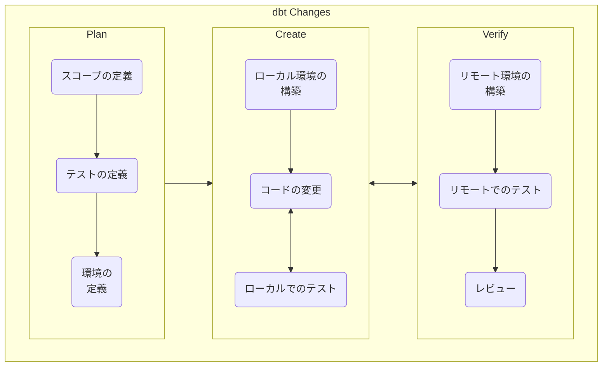
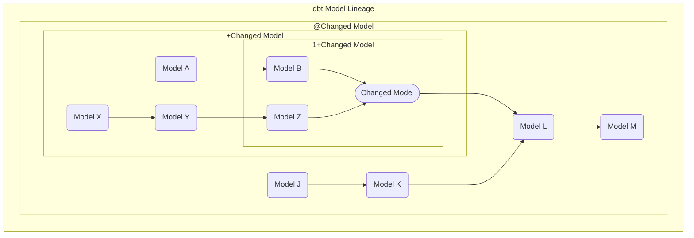

---

## dbt 変更ワークフローサマリー

dbt モデルとドキュメントへの変更の高い品質と信頼性を確保するために、以下のワークフローが確立されました。このワークフローに従うことで、開発者とレビュアーはタスクを正常に完了するために必要な情報が得られます。このワークフローは DevOps フレームワークとテスト駆動開発の原則に基づき、dbt の変更プロセスに情報と構造を提供します。



1. Plan（計画） - このステージでは、開発とレビューがどのように行われるかを定義します。このステージの成果物は、後続のステージをガイドする計画が記入されたマージリクエストです。

    1. スコープの定義 - このステップでは、行われる変更を記述します。詳細は Issue やエピックに委ねることができます。

    1. テストの定義 - このステップでは、変更がどのように確認されるかを定義します。

    1. 環境の定義 - このステップでは、変更を開発・確認するために使用されるモデルを定義します。

1. Create（作成） - このステージでは、コードの変更が行われます。コードの変更は、計画ステージで定義されたテストを使用して検証されます。このステージの成果物は、計画で定義された通りに開発者が検証したコード変更のセットです。

    1. ローカル環境の構築 - 計画で定義された環境を使用して、開発者のローカルデータベースにテーブルが読み込まれます。

    1. コードの変更 - 計画されたスコープを使用して、コードに変更が加えられます。

    1. ローカルでのテスト - 計画中に定義されたテストを使用して、変更が検証・確認されます。

1. Verify（検証） - このステージでは、完了した変更がデプロイに近い環境で検証され、他の有資格の開発者によってレビューされます。このステージの成果物は、レビューおよび承認されたコードの変更とテスト結果です。

    1. リモート環境の構築 - 計画で定義された環境を使用して、リモートデータベースにテーブルが読み込まれます。

    1. リモートでのテスト - 計画中に定義されたテストを使用して、変更が検証・確認されます。

    1. レビュー - リモートテストの結果が計画で定義されたスコープとテストに対して比較され、提案されたコード変更の品質が保証されます。

## テストとレビューの程度の決定

このワークフローは一般的なプロセスとして示されているため、行われた変更の複雑さと変更が行われた場所によって、特定のステップでのテストとレビューの程度が高くなったり低くなったりする場合があります。テストとレビューの程度は、各ステップに適切な労力が費やされるよう、開発中に開発者が計画段階で決定する必要があります。

テストとレビューの程度を決定する最初のステップは、変更の場所を特定することで、最小限のテストとレビューの程度が決まります。そこから、変更のタイプ、量、影響を考慮して最終的なテストとレビューの程度を決定する必要があります。

### 場所別テストとレビューカテゴリー

- 高
  - エンタープライズディメンショナルモデル（PROD.COMMON_*）
  - 主要パフォーマンス指標レポーティング（例: mart_arr）
- 中
  - レガシーモデル
  - ソースモデル
  - 準備モデル
- 低
  - ワークスペースモデル（例: PROD.WORKSPACE_SALES.*）

### 変更別テストとレビューカテゴリー

- 高
  - 既存モデルへの新しいソースデータの統合
  - 多くの他のモデルから参照されるモデルの変更
- 中
  - 新しいデータソースのモデルの追加
- 低
  - 列名の変更
  - ドキュメントの更新

## dbt 変更ワークフローの詳細

### スコープの定義

スコープは、行われる変更のコンテキストとして機能し、開発者とレビュアーが変更の意図を理解するのに役立ちます。テーブルおよびビューモデルとそのドキュメントへの変更は一般的です。その他の変更には特別なテストや処理が必要な場合があり、計画プロセス中に識別される必要があります。以下のリストは、既知の非典型的な変更と、それらのタイプの変更に関連する変更または例外を識別します。

- マクロへの変更
  - マクロを使用するモデルがモデル自体が直接変更されていない場合でもテストされる必要がある。
- インクリメンタルモデルへの変更
  - モデルがスキーマ変更のために設定されるか、変更がマージされた後にフルリフレッシュされる必要がある。手動でのフルリフレッシュは dbt のオーケストレーションされた実行と衝突する可能性があるため、手動リフレッシュはモデルのオーケストレーションされた実行後にのみ実行する必要がある。
- シードへの変更
  - シードファイルの読み込みがテストの一部として明示的にフルリフレッシュで実行される必要がある。
- スナップショットへの変更
  - すべてのテストがリモート環境で実行される必要がある。
- プロジェクト設定への変更
  - プロジェクトがコンパイルされることを確認するためにモデルをテストする必要がある。
- ドキュメントのみの変更
  - プロジェクトがコンパイルされることを確認するためにモデルをテストする必要がある。
- ワークスペースモデルへの変更
  - 基本的なコンポーネントテストのみが必要

### テストの定義

コードに変更を加える前に、変更が意図した影響を持つことを確認するために必要なテストを最初に開発します。これはソフトウェア開発のテスト駆動開発の原則に従い、開発者が必要な変更を概説し、それらの変更が成功したとどのように評価されるかを明確にするのに役立ちます。コミュニケーションを助けるために、テストはいくつかのタイプに分類できます。

- コンポーネントテスト
- 統合テスト
- システムテスト
- 受け入れテスト

#### コンポーネントテスト

コンポーネントテストは、変更された各モデルが他のモデルとは独立して正しくビルドされることを確認します。最低限、変更のあるモデルは変更後に実行され、コードがエラーなくコンパイルおよび実行されることを確認する必要があります。これが最も基本的なコンポーネントテストです。データベースでテーブルをビルドする場合の他の期待されるコンポーネントテストには、テーブル内の一意性のテストや指定された列の NULL のテストが含まれます。その他のコンポーネントテストには、列の追加または削除のテスト、フィルターの変更または追加のテスト、またはビジネスロジックの追加または削除のテストが含まれる場合があります。変更されたモデルに対して実行されるコンポーネントテストのタイプの説明は計画ステージの必須部分ですが、使用されるすべてのコンポーネントテストの詳細なリストは必要ありません。

#### 統合テスト

統合テストは、変更されたモデルが他のモデルの動作に悪影響を与えないことを確認します。変更されたモデルに依存するモデルはすべてビルドされ、変更されたモデルの統合テストの一部としてコンポーネントテストが実行される必要があります。ただし、すべての依存モデルの順次ビルド時間が過度に長い場合（1 時間以上の実行時間）、依存モデルのサブセットを選択することができます。モデルのサブセットを選択する場合、最長または最も重要なパスを選択しながら順次ビルド時間を最小化する必要があります。また、変更が新しい列の追加など新しい追加の場合、次の例外を除いて統合テストを省略できます。

- 下流モデルがインクリメンタルとして設定されており、スキーマ変更時に append_new_column や sync_all_columns が設定されていない場合

変更されたモデルのすべてのインクリメンタルな下流モデルで、エラーを防ぐためにリフレッシュが必要なものは、以下の dbt コマンドで見つけることができます。

```console
dbt list -s <changed model>+,config.materialized:incremental --output name --resource-type model --exclude config.on_schema_change:sync_all_columns config.on_schema_change:append_new_columns
```

変更されたモデルのすべての下流モデルは、以下の dbt コマンドで見つけることができます。

```console
dbt list -s <changed model>+ --output name --resource-type model
```

#### システムテスト

システムテストは、変更されたモデルの出力を既存モデルの出力に対して確認します。基本的なシステムテストには、変更されたバージョンと現在のバージョンのモデルの行数の比較が含まれる場合があります。

開発テーブルの出力を本番テーブルと比較する基本的なシステムテストは、次のようになります。

```sql

WITH compare AS (
  SELECT *
  FROM database.schema.table

  MINUS

  SELECT *
  FROM <branch_name>_database.schema.table
)

SELECT COUNT(*) from compare

```

#### 受け入れテスト

受け入れテストはステークホルダーやサブジェクトマターエキスパートによって定義でき、変更が結果として得られるモデルのユーザーのニーズを満たしているかどうかを検証することを目的とします。

### 環境の定義

変更されるモデル、または変更によって影響を受けるモデルを正しく構築・テストするために、多くのモデルが必要な場合があります。これらのモデルは環境モデルまたはビルドモデルとして分類でき、必要なすべてのモデルの完全なリストが計画ステージに必要です。

#### 環境モデル

環境モデルは、変更されたモデルまたは変更によって影響を受けるモデルを構築またはテストするために必要なものです。これらのモデルが適切な環境内でクローンまたは構築によって作成されると、開発プロセス中に更新する必要はありません。すべての環境モデルを含む dbt list コマンドは計画ステージの必須部分です。

コマンドの例:

- [`1+<changed model>`](https://docs.getdbt.com/reference/node-selection/graph-operators#the-n-plus-operator) 変更されたモデルと変更されたモデルの直前のモデルを含みます。
  - 統合テストが少ないシンプルまたは直接的な変更に推奨。
- [`+<change model>`](https://docs.getdbt.com/reference/node-selection/graph-operators#the-plus-operator) 変更されたモデルと変更されたモデルの前のモデルを含みます。
  - 統合テストが少ないモデルの完全なチェーンへの大幅な変更を行う場合に推奨。
- [`@<changed model>`](https://docs.getdbt.com/reference/node-selection/graph-operators#the-at-operator) 変更されたモデル、変更されたモデルの前のすべてのモデル、変更されたモデルの後のすべてのモデル、および変更されたモデルの後のモデルの前のすべてのモデルを含みます。
  - 広範な統合テストで使用することが推奨。テスト中に参照に関連するモデルが利用できるようになります。



#### ビルドモデル

変更のビルドまたはテストの一部として再構築されるモデルはビルドモデルとして分類されます。これらのモデルにはコードの変更が含まれているか、コードの変更によって影響を受けるモデルであり、開発プロセス中に複数回再作成する必要があります。

### ローカル環境の準備

計画中に定義された環境を使用して、以下の手順でローカル開発環境を構築します。

1. `<user_name>_PREP` と `<user_name>_PROD` 内にあるすべてのスキーマを削除することで、ローカルデータベースのテーブルをクリーンアップします。これにより、テストに使用されるデータが最近追加されたデータのみであることが保証されます。Snowsight UI または SQL コマンドを使用して行うことができ、クエリの詳細は [Snowflake Dev Clean Up](https://gitlab.com/gitlab-data/runbooks/-/blob/main/Snowflake/snowflake_dev_clean_up.md) Runbook に記載されています。
1. 環境モデルコマンドを使用して、開発とテストに必要なテーブルを[クローン](/handbook/enterprise-data/platform/dbt-guide/#cloning-models-locally)します。これにより、データが最新の状態であることが保証され、テーブルのクローンはソースデータからテーブルを再構築するよりも効率的です。
    - クローンジョブは以下の条件では実行しません。これらの条件を満たすモデルは、後続のビルドステップに含める必要があります。
      - テーブルが新しい
      - テーブルに新しい名前がある
      - テーブルが外部テーブル
      - テーブルが現在のパーティション以外のパーティション
1. ビルドモデルが XL ウェアハウスで構築に 10 分以上かかる場合、ビルドモデルに直接使用される環境モデルを[サンプリング](/handbook/enterprise-data/platform/dbt-guide/#sample-data-in-development)する必要があります。データをサンプリングするとビルド時間が改善し、開発中に実行できるイテレーションが増加します。

### コードの変更

コードの変更ステップは、ドラフトの変更がコードリポジトリで使用される言語とフォーマットに変換される場所です。プロセスはハンドブックファーストの精神に従ってドキュメントから始まり、ドキュメントに追加されたテストに合格し、ターゲットの変更が反映されるまで「変更をローカルでテスト」ステップを反復します。このステップの一部として、dbt コードベースで使用されるすべての SQL に一貫したフォームと感触があるよう、[SQL スタイル](/handbook/enterprise-data/platform/sql-style-guide/)ガイドと[リンター](/handbook/enterprise-data/platform/sql-style-guide/#sqlfluff)を使用する必要があります。

### 変更をローカルでテストする

すべてのコンポーネント、統合、システムテストをローカルで実行して、変更が計画通りに実装されていることを確認します。テストの失敗はすべてのテストに合格するまでコードの変更ステップとの反復サイクルを必要とします。データがサンプリングされた場合、このテストステージではサンプリングを削除する必要はなく、フルデータでのテストが必要かどうかは開発者の判断に委ねられます。開発中に別々の `run` と `test` コマンドではなく `build` コマンドを使用することで、組み込みのコンポーネントと統合テストを効率的に実行し、推奨されるベストプラクティスです。

### リモート環境の準備

孤立した環境、結果のドキュメント化、レビュー中のコラボレーションの改善を確保するために、すべてのテストはリモート環境で実行する必要があります。計画中に定義された環境を使用して、提供された CI ジョブを使用してリモート環境を構築します。

1. 環境モデルコマンドを使用して、開発とテストに必要なテーブルを[クローン](/handbook/enterprise-data/platform/ci-jobs/#%EF%B8%8Fclone_model_dbt_select)します。
    - 環境モデルコマンドが直接変更されたモデルとその先行モデルのみを含む場合、[`run_changed_models_sql`](/handbook/enterprise-data/platform/ci-jobs/#%EF%B8%8Frun_changed_%EF%B8%8Fclone_model_dbt_select) CI ジョブを使用できます。
    - クローンジョブは以下の条件では実行しません。これらの条件を満たすモデルは、後続のビルドステップに含める必要があります。
      - テーブルが新しい
      - テーブルに新しい名前がある
      - テーブルが外部テーブル
      - テーブルが現在のパーティション以外のパーティション

### 変更をリモートでテストする

すべてのコンポーネント、統合、システムテストをリモートで実行して、変更が計画通りに実装されていることを確認します。テストの失敗はすべてのテストに合格するまでコードの変更ステップとの反復サイクルを必要とします。

1. 定義された環境のビルドモデルコマンドを使用して変更されたモデルをビルドします。これにより変更されたモデルがビルドされ、変更に含まれているテストが実行されます。
   - これは [`specify_model`](/handbook/enterprise-data/platform/ci-jobs/#specify_model) CI ジョブの 1 つを使用して実行できます。ビルドコマンドに直接変更されたモデルのみが含まれている場合は、[`run_changed_models_sql`](/handbook/enterprise-data/platform/ci-jobs/#%EF%B8%8Frun_changed_models_sql) CI ジョブの 1 つを使用できます。
   - 変更されたモデルがインクリメンタルモデルで、モデルがフルリフレッシュで 1 時間以上実行される場合、フルリフレッシュを明示的にテストする必要がない場合は、`REFRESH =` [変数](/handbook/enterprise-data/platform/ci-jobs/#%EF%B8%8F-dbt-run)を追加してフルリフレッシュのオーバーライドを使用する必要があります。
1. [run_grants](/handbook/enterprise-data/platform/ci-jobs/#run_grants) CI ジョブを使用して、自分自身に権限を付与し、残りのコンポーネント、統合、システムテストをビルドモデルで実行して、結果を MR に追加します。
    - テーブルが新しい場合、grant_clones ジョブはテーブルへのアクセスを付与できません。この場合、検証と確認のためにローカルテストのドキュメントが必要です。

### レビュー

すべては、コードの変更とその効果の精度、ならびに標準と慣行への準拠についてレビューする必要があります。すべての変更にすべてのレビューが必要なわけではなく、個人は複数のレビューを同時に実行できますが、コードオーナーレビューとメンテナーレビューは常に各変更に必要です。

- 精度と効果
  - ステークホルダーレビュー
  - サブジェクトマターエキスパートレビュー
  - コードオーナーレビュー
- コンプライアンス
  - メンテナーレビュー

### 例

このワークフローの使用例は、1 つのテーブルの列名が変更された MR [8476](https://gitlab.com/gitlab-data/analytics/-/merge_requests/8476) で確認できます。

#### 計画

##### スコープ

エンドユーザーのニーズに合わせて出力列名を更新します。

##### テスト

一意性のテストに加えて、列名が要求された列名と一致することを確認するために列名がチェックされます。

##### 環境

計画された変更には、変更を適切にビルドしてテストするために以下のモデルが必要です。

- pump_disaster_relief_fund
- employee_directory

環境

```console
dbt list 1+pump_disaster_relief_fund
```

ビルド

```console
dbt list pump_disaster_relief_fund
```

#### 作成

##### ローカル環境のビルド

以下のコマンドを使用してローカル環境をビルドしました。

```console
make DBT_MODELS="1+pump_disaster_relief_fund" clone-dbt-select-local-user
```

結果として `"PEMPEY_PREP"."SENSITIVE"."EMPLOYEE_DIRECTORY"` と `"PEMPEY_PROD"."PUMPS_SENSITIVE"."PUMP_DISASTER_RELIEF_FUND"` が作成されました。

##### コードの変更

変更を行いながら、以下のコマンドを使用して変更をビルドしてテストしました。

```console
dbt build -s pump_disaster_relief_fund
```

結果として `PEMPEY_PROD.pumps_sensitive.pump_disaster_relief_fund` がビルドされ、`dbt_utils_unique_combination_of_columns_pump_disaster_relief_fund_Employeenumber__Action__True` テストが実行されました。

##### ローカルでのテスト

組み込みのテストに加えて、以下のクエリを使用して変更をテストしました。

{}
```sql
SET query_id = (
  SELECT QUERY_ID
  FROM snowflake.account_usage.query_history
  WHERE true
  and QUERY_TEXT = 'SHOW COLUMNS IN pempey_prod.pumps_sensitive.pump_disaster_relief_fund'
  AND start_time > current_date()
  ORDER BY START_TIME DESC
  LIMIT 1
);

SELECT $query_id
--

SELECT count(*) = 6
FROM TABLE (RESULT_SCAN($query_id)) --
WHERE true
AND "column_name" IN ('Fund','Firstname','Lastname','Employeenumber','Email','Action')


-- Integration Test

-- None

-- System Test

WITH compare AS (
  SELECT *
  FROM prod.pumps_sensitive.pump_disaster_relief_fund

  MINUS

  SELECT *
  FROM pempey_prod.pumps_sensitive.pump_disaster_relief_fund
)

SELECT count(*) from compare

```
{}

#### 検証

##### リモート環境のビルド

`clone_model_dbt_select` ジョブが `DBT_MODELS = 1+pump_disaster_relief_fund` 変数とともに使用されて環境がビルドされました。

##### リモートでのテスト

1. まず `specify_model` ジョブが `DBT_MODELS = pump_disaster_relief_fund` 変数とともに使用されて変更がビルドおよびテストされました。
1. 次に `grant_clones` ジョブが `GRANT_TO_ROLE = PEMPEY` 変数とともに使用されて変更へのクエリアクセスが付与されました。
1. 最後に以下のクエリが実行され、結果が MR に追加されました。

<details markdown="1">

<summary>SQL</summary>

```sql

SET query_id = (
  SELECT QUERY_ID
  FROM snowflake.account_usage.query_history
  WHERE true
  and QUERY_TEXT = 'SHOW COLUMNS IN 17086-ADJUST-COLUMN-NAMES-FOR-E4E-RELIEF-FILE_PROD.pumps_sensitive.pump_disaster_relief_fund'
  AND start_time > current_date()
  ORDER BY START_TIME DESC
  LIMIT 1
);

SELECT $query_id
--

SELECT count(*) = 6
FROM TABLE (RESULT_SCAN($query_id)) --
WHERE true
AND "column_name" IN ('Fund','Firstname','Lastname','Employeenumber','Email','Action')


-- Integration Test

-- None

-- System Test

WITH compare AS (
  SELECT *
  FROM prod.pumps_sensitive.pump_disaster_relief_fund

  MINUS

  SELECT *
  FROM 17086-ADJUST-COLUMN-NAMES-FOR-E4E-RELIEF-FILE_PROD.pumps_sensitive.pump_disaster_relief_fund
)

SELECT count(*) from compare

```

</details>

#### レビュー

コードオーナーの 1 人がレビュアーとして割り当てられました。コードオーナーはメンテナーでもあり、両方のレビューを実行して最終的に変更をマージしました。

### モデルデプロイチェックリスト

### レビュー前チェックリスト

レビューを要求する前に、アナリティクスエンジニアは以下を検討する必要があります。

- [ ] 変更のパフォーマンスへの影響が評価されているか？
- [ ] 列のマスキングポリシーとその依存関係が考慮されているか？
- [ ] 下流テーブルとレポートへの影響が考慮されているか？
- [ ] `schema.yml` ファイルの EDM モデルに [Atlan ドメインメタデータ](https://developer.atlan.com/snippets/common-examples/domain-assignment/#add-an-asset-to-a-domain)が追加されているか？（Marketing、Product、Sales、People、Finance のいずれかを使用する必要がある）

### 精度と効果のレビュー

ステークホルダー、サブジェクトマターエキスパート、コードオーナーが実行します。必要に応じてユーザー受け入れテストの項目を追加できます。

- [ ] データの精度を確認する
- [ ] ビジネスロジックの整合性を確認する
- [ ] ユーザー受け入れテストを完了する（該当する場合）

### メンテナーレビューチェックリスト

メンテナーが実行します。

- [ ] パイプラインが実行されて合格したか確認した
- [ ] 適切なドキュメントを確認した
  - [ ] EDM モデルに Atlan ドメインメタデータが追加されているか確認した
- [ ] パフォーマンスへの影響を確認した
- [ ] SQL スタイルと構造への準拠について変更を確認した
- [ ] 定められたテストが実行されたか確認した
- [ ] セキュリティとコンプライアンスの考慮事項についてレビューした
