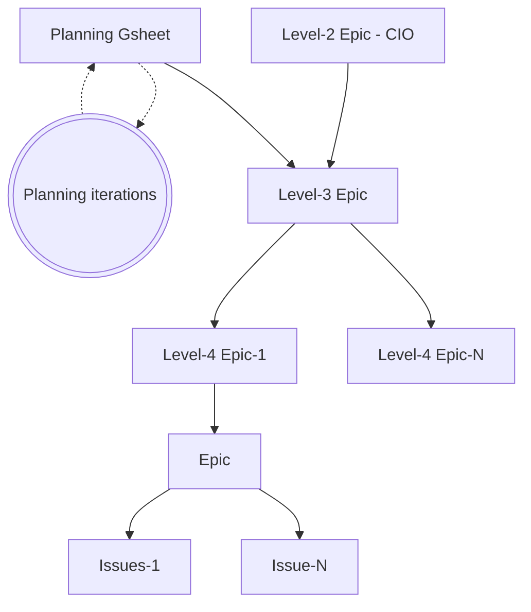

## データチームの計画プロセス

データチームの計画プロセスは、四半期ごとに発生する事前設定された活動です。計画プロセスは優先付けとアラインメントのための [GitLab の運用モデル](https://internal.gitlab.com/handbook/company/gitlab-operating-model/)に従います。このページでは、データチームの計画プロセスに適用される具体的な詳細を説明します。

## 四半期計画

データチームの[レベル 3 エピック](https://internal.gitlab.com/handbook/company/gitlab-operating-model/gitlab-operating-model-epics/)は、部門および会社のイニシアチブと整合します。基盤となる改善/インフラ開発については、これらのレベル 3 エピックが容易にマッピングできない場合でも、データチームはレベル 3 エピックを作成します。全体として、レベル 3 エピックはデータチームの四半期キャパシティの 50〜60% を占め、本番環境のメンテナンスが唯一確立された高い優先度となっています。ビジネスオペレーション作業は、利用可能なキャパシティに基づいてイテレーション計画中に計画されます。

現在、主にチームメンバーのキャパシティ計算には [gSheet](https://docs.google.com/spreadsheets/d/1GdxyiAsgRiIFGN9w6z0pndL0GCZNwSJULHxstz1k72U/edit?usp=sharing)を使用しています。データチームのレベル 3 エピックは [GitLab エピック](https://gitlab.com/groups/gitlab-operating-model/-/work_items)で**管理**されています。

### レベル 3 エピックの計画

レベル 3 エピックはビジネスパートナーとの協力のもとで草案が作成され、スケジューリングに提出されるすべてのレベル 3 エピックには Opportunity Canvas が必要です。[プロジェクトの取り込み](/handbook/enterprise-data/how-we-work/#project-intake)を参照してください。GitLab の誰もが Opportunity Canvas を[開く](https://gitlab.com/gitlab-data/analytics/-/blob/master/.gitlab/issue_templates/%5BNew%20Request%5D%20Create%20Opportunity%20Canvas.md?ref_type=heads)ことを歓迎しており、重要と思われるイニシアチブで計画プロセスに貢献するためにデータチームメンバーが gSheet を自分のイニシアチブで更新することをお願いしています。このコラボレーティブなアプローチにより、すべてのチームメンバーが計画プロセスに発言でき、インサイトと専門知識を提供できます。

### 優先付け

データチームは最も影響力のある作業に集中するために優先付けフレームワークを使用しています。優先付けプロセスはいくつかの要因を考慮しています。

1. 戦略的アラインメント: 作業は GitLab の全体的な戦略と目標にどれだけ沿っているか？
2. 時間的緊急性: 作業はどれだけ緊急か？
3. 収益または効率への影響: 作業の潜在的な財務的影響は何か？
4. 規制または法的影響: この作業を必要とするコンプライアンスや法的要件はあるか？

これらの各要因を評価するためのスコアリングシステムを使用しており、各作業の優先度スコアを計算するのに役立ちます。優先度スコアは次のように計算されます。

priority_score = `(Strategic Alignment + Time Criticality + Revenue or Efficiency Impact + Regulatory or Legal Impact) / Job Size`

注: 結果を達成するために進行中の作業を最初に完了したいため、繰り越されたレベル 3 エピックが（まだ適用可能な場合）優先されます。

#### スコアリングの内訳

価値ドライバー:

| 価値 | 重み | 1 | 2 | 3 | 4 | 5 |
| -----------------------------| ------- | ----------------- | -------------------- | ----------------------------- | ------------------------------- | ------------------------------- |
| 戦略的アラインメント | 30% | チーム | 部門 | 部署 | 複数の部署 | 企業 |
| 時間的緊急性 | 40% | あればいい | 次の 1 年以内 | 次の 6 ヶ月以内 | 次の四半期以内 | 緊急・即刻 |
| 収益または効率への影響 | 20% | < $5k | < $50k | < $500k | < $5M | > $5M |
| 規制または法的影響 | 10% | なし/あればいい | 必須 | 罰金および/またはブランドダメージ < $1M | 罰金および/またはブランドダメージ < $10M | 罰金および/またはブランドダメージ > $10M |

| 価値 | 1 | 2 | 3 | 4 | 5 | 6 |
| ------------ | -- | - | - | - | -- | --- |
| T シャツサイズ | XS | S | M | L | XL | XXL |

ジョブサイズは重要な要因であるため、そのイテレーションのスコープを定義する明確な完了の定義とともに GitLab の[イテレーション](/handbook/values/#iteration)の価値に沿ってレベル 3 エピックを分割（複数の四半期にわたる）することを奨励します。

#### T シャツサイジングアプローチ

新しい Issue、エピック、長期的なイニシアチブを提供するために必要な作業を迅速にサイジングするために T シャツサイジングアプローチを使用します。T シャツサイジングアプローチは、詳細な作業計画の作成に向けた作業分解をサポートするために設計されていますが、全体的なスコープを管理するための十分な詳細レベルを提供することも意図しています。

| サイズ | 専任者の時間 | 重み（Issue ポイント） | 例 |
| :--: | :--: | :-- | :-- |
| XS | 0.5 日 | 1 | 既存のハンドブックページの更新。#data の調査/返答。新しい信頼できるデータテスト。データソースへのアクセスを取得する AR の提出。 |
| S | 1 日 | 2-3 | 新しいハンドブックページ; 典型的なトリアージ Issue。既存モデルの上に新しいダッシュボード。新しいデータソースのデータスコープの整合。 |
| M | 1 週間 | 5-8 | 新しいモデルを必要とする新しいダッシュボード。Stitch または Fivetran を使用した新しいデータソース。 |
| L | 2〜3 週間 | 13 | 新しいファクトテーブルの実装とテスト。完全な XMAU ソリューション。 |
| XL | 1〜2 ヶ月 | 26 | 新しいシステムへの新しいデータポンプ。複雑なソース API を持つ新しいデータソース。 |
| XXL | 2〜4 ヶ月 | 52+ | 新しいデータソースを持つ新しいディメンショナルモデルの対象エリア。 |

#### レベル 3 エピックの割り当て

来四半期に特定のレベル 3 エピックを割り当ててもらいたい場合は、シートの来四半期のイニシアチブに名前を追加することを奨励します（`Column F` - `Data Team DRI`）。特定のレベル 3 エピックへの関心を示す可能な理由（限定されない）には、あなたの経験と専門知識との整合、その分野での以前の作業、またはそれについてもっと学ぶための抱負が含まれます。レベル 3 エピックにコントリビューションすることに興味がある場合は、Data Team DRI として名前を追加する際にマネージャーとも話し合うことができます。これは他の要因にも依存するため、割り当てが保証されるわけではありません。

レベル 3 エピックの割り当ては、チームメンバーとイシューポイント `Columns Q - X` をレベル 3 エピックに追加することによって四半期末に向けて行われます。

### データプラットフォームのビジョンとレベル 3 エピック

チーム全員のコントリビューションを奨励しますが、特に Staff+ [レベル](/handbook/enterprise-data/organization/#data-roles-and-career-development)のデータチームメンバーはデータプログラムの長期的なビジョンと戦略的方向性に貢献することが期待されています。これはビジネスパートナーの進化するニーズをイニシアチブや Opportunity Canvas に変換することにより、私たちがビジネスパートナーの進化するニーズを満たすことを確保します。

主要な側面には以下が含まれます。

1. 会社の目標をデータプロダクトに変換する
1. ビジネスパートナーの課題を理解する
1. データエンジニアリングにおける新興技術とトレンドを特定する
1. 現在のプラットフォームの制限と改善の余地のある領域を評価する
1. プラットフォームの開発を会社全体の戦略と整合させる
1. データ処理、ストレージ、分析機能を強化するための革新的なソリューションを提案する
1. 他のチームと協力してその進化するデータニーズを理解する

これらの議論から生じたイニシアチブは四半期計画プロセスに統合され、データプラットフォームの開発が即時のビジネスニーズと長期的な戦略目標の両方に整合することを確保します。

### レベル 3 エピックの追跡とレポーティング

四半期を通じて進捗を監視するために GitLab エピックを使用します。各レベル 3 エピックの進捗はエピック内で毎週更新されます。指定されたデータチームスポンサーは、ヘルスステータスと実際のメトリクスを含む書面による更新をエピックに提供する責任があります。

#### レベル 4 エピック

FY27Q1 の計画サイクルで、レベル 3 エピックが細かすぎるレベルで定義されていたことがわかりました。FY27Q2 ではレベル 4 エピックを導入します。以下の構造が適用されます。FY27Q1 ではレベル 4 エピックのレベルはスキップされます。

##### レベル 3 エピックの構造

## 作業分解

作業分解は常に四半期計画プロセスの結果として開発されますが、新しいイニシアチブ、インフラプロジェクト、および類似の複数人または複数週のプロジェクトのスコープと計画にも活用できます。作業分解の成果物は、実行される作業、成果物、責任、および高レベルのタイムラインの詳細な説明です。

四半期計画プロセスの一部として、作業分解はレベル 3 エピックの説明にリンクされます。

作業分解は以下のインプットを考慮します。

1. 定義された次のレベル 3 エピック
2. レベル 3 エピックのレビュー
3. 新しい / 将来を見据えたインサイト
4. チームの可用性
5. チームメンバーの抱負

**作業分解はチームの取り組みであり、全員がコントリビューションすることを奨励します。**

### 週 2 回のイテレーション計画

データチームはイテレーションと呼ばれる 2 週間の間隔で作業します。イテレーションは水曜日に始まり、火曜日に終わります。これにより金曜日の土壇場でのマージが抑制され、チームはイテレーションの冒頭にイテレーション計画ミーティングを行えます。

イテレーション計画では以下を考慮する必要があります。

- 休暇のタイムライン
- カンファレンスのスケジュール
- チームメンバーの可用性
- チームメンバーの作業の好み（専門性は好みとは異なる）

イテレーション計画のタイムラインは以下のとおりです。

- ミーティング準備 - 担当者: イテレーションプランナー
  - オープンな Issue を調査して肉付けする。
  - チームのロードマップとの整合に基づいて Issue をイテレーションに割り当てる。
  - 注: Issue は、必要な場合を除いてこの段階では個人に割り当てられません。

| 日 | 現在のイテレーション | 次のイテレーション |
| ----------------- | ------------------------------------------------------------------------------------------------------------------------------------------------------------ | ---------------------------------------------------------------------------------------------------------------------------------------------------------- |
| 0 - 第 1 水曜日 | **イテレーション開始**    | - |
| 7 - 第 1 火曜日 | **中間点**   イテレーションから外れるリスクのある Issue は担当者が提起する必要があります | - |
| 10 - 第 2 金曜日 | **MR をレビューのために提出する最終日**   MR はマージ準備ができているためにドキュメントとテストを含む必要があります   MR はチームメンバーの可用性が限られる日への影響を最小化するために金曜日にはマージしないことが望ましいです（緊急性がある場合、つまり P1-Ops 関連の MR またはタイトなタイムラインの場合を除く） | **イテレーションはおおむね確定**   イテレーションプランナーが次のイテレーションの Issue の優先度とチームキャパシティを確認します |
| 13 - 第 2 月曜日 | **イテレーションの最終日**   準備ができた MR はマージ可能です | - |
| 14 - 第 2 火曜日 | **ミーティングの日**   未完了のすべての Issue はイテレーションから削除するか次にロールオーバーする必要があります | **イテレーション計画**   現在のイテレーションのレトロスペクティブを実施して、作成されたイテレーション計画に従って次のイテレーションを整合/開始するための同期ミーティング。未完了のすべての Issue はイテレーションから削除するか自動的に次にロールオーバーされます |
