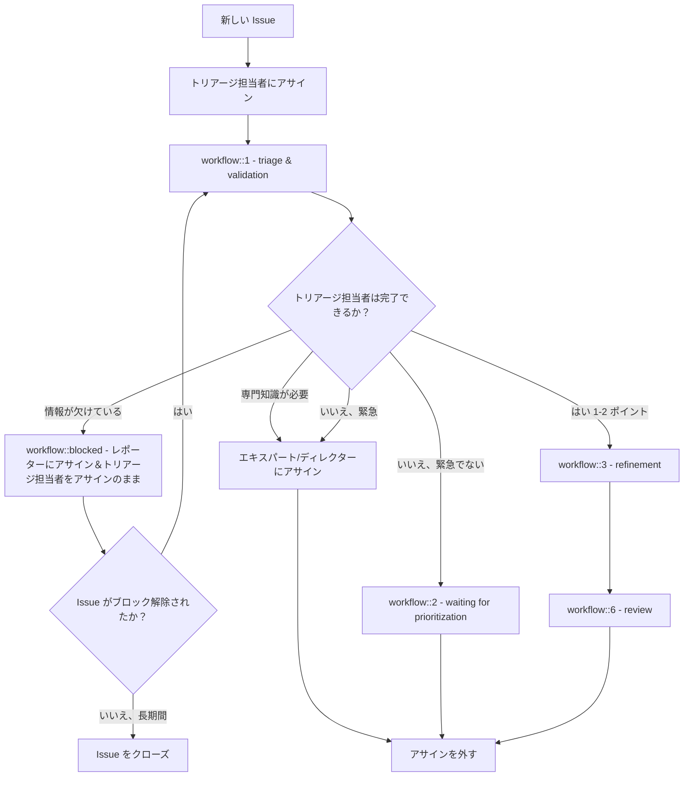
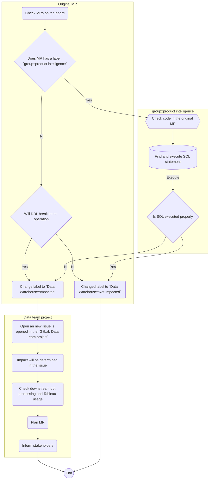

## 概要

データプラットフォームチームは週次でトリアージ業務をローテーションします。ローテーションは週単位でアサインされますが、トリアージ担当者はシフト中の**日々のモニタリング**、**Issue の処理**、**コミュニケーション**に責任があります。このガイドでは、毎日何が必要か、Issue の対処方法、ローテーション終了時に完了すべき事項を説明します。

## 責任

データプラットフォームトリアージ担当者は、**#data-pipelines** および **#data-prom-alerts** Slack チャンネル、[DE - Triage Errors ボード](https://gitlab.com/groups/gitlab-data/-/boards/1917859)、および [MonteCarlo インシデントページ](https://getmontecarlo.com/incidents?include-normalized=false&types=freshness_anomaly%2Cvolume_anomaly%2Cdimension_anomaly%2Cfield_metrics_anomaly%2CDBT_ERRORS%2Cfreshness_sli_rule_breach%2Cvolume_sli_rule_breach%2Csql_rule_breach)（MonteCarlo では `Data Platform` ドメインでフィルタリングしてください）に関するデータプラットフォームの問題解決に責任があります。これらのエラーから作成された Issue には [DE Triage Errors Issue テンプレート](https://gitlab.com/gitlab-data/analytics/issues/new?issuable_template=Triage%20Errors%20DE)を使用してください。

- アサインされたトリアージ週中、データプラットフォームチームメンバーは以下に集中します（優先順位順）：
  - 入ってくるインシデント
  - [オープンインシデント](https://gitlab.com/gitlab-data/analytics/-/incidents)
  - 新規 Issue：チームメンバーのトリアージ週中に入ったすべての Issue は[解決](/handbook/enterprise-data/how-we-work/triage/data-platform-triage/#issue-assignment-and-processing)する必要があります。
    - 新規 Issue とは、アサインなしで `triage & validation` ワークフローラベルが付いた Issue として定義されます。[この Issue リスト](https://gitlab.com/groups/gitlab-data/-/issues/?sort=updated_desc&state=opened&assignee_id=None&label_name%5B%5D=Team%3A%3AData%20Platform&label_name%5B%5D=workflow%3A%3A1%20-%20triage%20%26%20validation&not%5Blabel_name%5D%5B%5D=Triage&first_page_size=100)でこれらのアイテムを追跡しています。
  - [Data Platform - Triage Errors ボード](https://gitlab.com/groups/gitlab-data/-/boards/1917859)のオープン Issue。
    - オープンインシデントまたは Issue がすでにアサインされている場合も、トリアージ担当者がその Issue を引き取るか、進捗を確保する責任があります。
    - [ボード](https://gitlab.com/groups/gitlab-data/-/boards/1917859)でインシデントまたは Issue に取り組む作業がない場合、トリアージ担当者は通常の作業アサインに取り組みます。
- そのトリアージ責任を持たないデータプラットフォームチームメンバーの関与も、以下のような場合には依然として必要になることがあります：
  - トリアージ担当者が解決できない継続的な Issue またはインシデントで、他のデータプラットフォームチームメンバーからの助けが必要な場合。
  - #data-prom-alerts のモニタリング：
    - #data-prom-alerts Slack チャンネルは、**即座**のアクションが必要な最も緊急な障害イベントに使用されます。すべてのデータプラットフォームチームメンバーは、トリアージ担当者の勤務時間外に適切な時間内にアクションが取られることを確認する責任があります。
  - 他の GitLab チームメンバーからデータプラットフォームチームの助けが必要で、トリアージ担当者の勤務時間外の場合。
- Monte Carlo インシデントは `#data-pipelines` Slack チャンネルに投稿されます（スキーマ変更を除く）。Monte Carlo は最初にインシデントを通知するだけなので、インシデントを見逃さないよう Monte Carlo インシデントページを確認する必要があります。**スキーマ変更**は[このリンク](https://getmontecarlo.com/incidents?include-normalized=false&types=freshness_anomaly%2Cvolume_anomaly%2Cdimension_anomaly%2Cfield_metrics_anomaly%2CDBT_ERRORS%2Cfreshness_sli_rule_breach%2Cvolume_sli_rule_breach%2Csql_rule_breach)を使用してフィルタリングされます（アクションが不要で、Slack チャンネルにも報告されないため）。**すべての Monte Carlo インシデントは、業務終了時に適切な解決ステータスが付けられるか、アサインされた GitLab Issue にリンクされる必要があります。**
  - 注：現在、MonteCarlo には未分類のインシデントの大きなバックログがあります。現在は最後の 7 日間のみに集中しています。

## Issue のアサインと処理

データプラットフォームチームメンバーのトリアージ週中に入ってくるすべての Issue は次のように解決する必要があります：

1. すべての Issue は最初のポイントとしてトリアージ担当者にアサインされます。
1. すべての Issue は組み合わされた `triage & validation` ステージを通じて処理されます。トリアージ担当者は問題記述の明確さと作業が開発を正当化するかどうかの両方を判断し、その後 `waiting for prioritization` に移行します — 定義された[ワークフロー（基準）](/handbook/enterprise-data/how-we-work/#workflow-summary)に従います。トリアージ担当者が適切に準備できない場合：
   - **情報が欠けている場合**：要件を明確にし、必要な詳細を収集するためにステークホルダーとのイテレーティブなコミュニケーションに従事します。トリアージは多くの場合、双方向の議論が必要な協調的なプロセスです。情報収集の試みにもかかわらずトリアージが真に進めない場合は `workflow::blocked` とラベル付けします。ブロックされた場合は、必要な具体的な情報を含むコメントを残し、共有責任を生み出すために Issue レポーターにアサインし、トリアージ担当者もアサインのままにします。
   - **ドメインの専門知識が不足している場合**：ドメインの専門知識を持つチームメンバーにアサインします。または、適切な専門知識が不明な場合は Data Platform ディレクターにアサインします。
1. Issue が **1〜2** [Issue ポイント](/handbook/enterprise-data/how-we-work/#issue-pointing)の場合、解決策を完全に実装します。これは `workflow::6 - review` まですべてのワークフローステージを通過することを意味します。
1. Issue が **3 ポイント以上**の場合、Issue は `workflow::2 - waiting for prioritization` とラベル付けされます。
   - Issue が緊急でない場合：トリアージ担当者は自分自身のアサインを外し、Issue はバックログに置かれます。
   - Issue が緊急な場合：トリアージ担当者はチームメンバーとアサインを調整するか、Data Platform ディレクターにアサインします。

**オーナーシップの継続性**：トリアージ週中にオープンになっている `workflow::1 - triage & validation` の Issue は、**トリアージ週が終わる前に解決されない場合でも、解決されるまであなたにアサインされたまま**です。これにより、コンテキストが保持され、不必要な引き継ぎが避けられます。

- **例外**：ブロックされた Issue、キャパシティの制約、委任が必要なドメインの専門知識のギャップ、またはトリアージ担当者のトリアージ週の最終業務時間後に開かれた Issue（これらは次のトリアージ担当者に引き継がれます）。

**ブロックされた Issue についての注記**：ブロックされた Issue はオーナーシップの継続性の例外です。情報が不十分で進められない状態が**5 業務日以上**続いている場合、自分自身のアサインを外し `workflow::blocked` に再ラベル付けしてトリアージボードから外れるようにします。必要な情報を提供した際に次のトリアージ担当者が引き継げるよう、`workflow::1 - triage & validation` に再ラベル付けするよう、ステークホルダーに通知します。ステークホルダーからの活動が 2 週間以上ない場合は、Issue のクローズを検討してください。



### フォローアップ

- インシデントには常に即座の対応が行われます。
- すべてのインシデントには DRI がアサインされます。これは必ずしもトリアージ担当者/インシデントの作成者ではありません。GitLab での非同期作業の性質上、別の GitLab チームメンバーが積極的に連絡/関与されるまでは、トリアージ担当者/作成者が DRI です。
  - [codeownerfile](https://gitlab.com/gitlab-data/analytics/-/blob/master/CODEOWNERS) は、インシデントのアサインのために正しい DRI を見つける適切な将来*のソースです。*現在、コードオーナーシップは十分に定義されていません。FY23-Q1 の一環として、より厳格なオーナーシップを確立する計画があります。
- 提起されたすべてのインシデントは `#data` Slack チャンネルで伝達され、その後に短い説明、ETA、インシデントへのリンクが続きます。適切な GitLab チームメンバーにタグが付けられます。
  - 定期的な（重大度に応じた）アップデートが Slack に投稿されます。新しいステータスがない場合でも、それをコミュニケーションすることを躊躇わないでください。
  - タイムラインは、回顧録や調査に使用するために、インシデントの件名/ヘッダーの下の[タイムラインセクション](https://docs.gitlab.com/ee/operations/incident_management/incident_timeline_events.html)に記録する必要があります。
  - インシデントが解決されたら、Slack にアップデートが投稿されます。

### 週末ラップアップ

データプラットフォームチームは週次ローテーションスケジュールに従っているため、トリアージ週の終わりにはトリアージ担当者がトリアージ責任を引き継ぎます。

- 依然として[トリアージ Issue](https://gitlab.com/gitlab-data/analytics/-/blob/master/.gitlab/issue_templates/Triage%3A%20Data%20Triage.md) を毎日使用していますが、トリアージ担当者は金曜日の業務終了時に中央データチームのトリアージ Issue に週のまとめを非同期で書くだけです。
- トリアージ担当者は、翌週の火曜日の週次データプラットフォームチームミーティングで、トリアージで起きた注目すべき事項を報告/口頭で伝えます。

週次ローテーションを実施していますが、トリアージ担当者は適切な Slack チャンネルに EOD（業務終了）アナウンスを投稿することが期待されています。

## トリアージの一般的な Issue

このセクションでは、一般的な Issue と解決策を説明します。

### GitLab.com データベース構造の変更

GitLab.com データベースは定期的に変更されます。日常業務を壊さないために、データベースの変更を追跡・確認する必要があります。GitLab.com データベースと CustomerDot データベースへのあらゆる変更は Danger Bot によって追跡されます。db/structure\.sql への変更が行われると、MR にラベルを適用することでデータチームに通知されます。

`Data Warehouse::Impact Check` ラベルがデータチームへのアクションの呼びかけとして Danger Bot によって追加されます。

- トリアージ時には、トリアージ担当者が `Data Warehouse::Impact Check` ラベルが付いた [MR を確認](https://gitlab.com/groups/gitlab-org/-/merge_requests?scope=all&state=opened&label_name[]=Data%20Warehouse%3A%3AImpact%20Check&draft=no&approved_by_usernames[]=Any)します。

データチームトリアージ担当者による以下のアクションが実施されます：

- すべてのマージリクエスト（`MR`）が判断されます。
  - `MR` が `Data Warehouse::Impact Check` と共に `group::product intelligence` ラベルを含む場合、いくつかの確認が必要です：
    - 新しいメトリクスが追加されるか既存のものが変更されるため、`Data team` は変更が `Service ping` 抽出プロセスを壊さないことを確認する必要があります。
    - 元の `MR` からの新しいメトリクスの `SQL` 文を確認し *(典型的な例は [gitlab-org/gitlab/merge_requests/75504](https://gitlab.com/gitlab-org/gitlab/-/merge_requests/75504/diffs#78300240169ab9f44b4dc25f6b6dcb56b3b629c7))*、`Snowflake` で実行します — 通常、単純な `SELECT` `SQL` 文です。
  - `SQL` ファイルへの変更がオペレーションを壊さない場合、ラベルは `Data Warehouse::Not Impacted` に変更されます。
  - `SQL` ファイルへの変更がオペレーションを壊す場合：
    - ラベルは `Data Warehouse::Impacted` に変更されます。
    - `GitLab Data Team project` で新しい Issue が開かれ、正しい DRI にアサインされ、元の MR にリンクされます。
    - Issue で影響が判断されます。
    - ローディングの問題、ダウンストリームの dbt 処理、Tableau の使用を乗り越えるために、MR が作成されます。
      - データロードを超えた影響がある場合、つまりデータがダウンストリームで使用されている場合、アナリティクスエンジニアも上流の変更のビジネス影響を判断するために**含める必要があります**。
    - GitLab.com MR のマージに合わせてマージが計画されます。
  - `MR` が `group::product intelligence` ラベルを含まず、`SQL` 構造への変更に関わる場合：
    - 以下の判断マトリクスに従って、オペレーション/データパイプラインを壊すかどうかを確認します。

  - いずれかの `MR` がオペレーションを壊す場合、ラベルは `Data Warehouse::Not Impacted` に変更されます。
  - いずれかの `MR` がオペレーションを壊す場合：
    - ラベルは `Data Warehouse::Impacted` に変更されます。
    - `GitLab Data Team project` で新しい Issue が開かれ、正しい DRI にアサインされ、元の MR にリンクされます。
    - Issue で影響が判断されます。
    - ローディングの問題、ダウンストリームの dbt 処理、Tableau の使用を乗り越えるために、MR が作成されます。
      - データロードを超えた影響がある場合、つまりデータがダウンストリームで使用されている場合、アナリティクスエンジニアも上流の変更のビジネス影響を判断するために**含める必要があります**。
    - GitLab.com MR のマージに合わせてマージが計画されます。
    - すべてのステークホルダーに通知されます。

#### プロセスのグラフィカル表現

<details><summary>クリックしてプロセスのグラフィカル表現を展開</summary>



</details>

判断マトリクス：

| 変更 | アクションが必要* |
| ------ | ------ |
| 新しいテーブルが作成された | :x: |
| テーブルが削除された | :white_check_mark: |
| テーブルが名前変更された | :white_check_mark: |
| フィールドが追加された | :x: |
| フィールドが削除された | :white_check_mark: |
| フィールド名が変更された | :white_check_mark: |
| フィールドのデータ型が変更された | :question:|
| 制約が変更された | :question: |

*デフォルトではすべてのテーブルとカラムをロードするわけではありません。したがって、新しいテーブルやカラムが追加された場合、特定のビジネスリクエストがある場合にのみこれらのテーブルをロードします。オペレーションの潜在的な障害を引き起こす可能性がある現在の構造への変更は判断が必要です。

** 判断マトリクスは包括的ではありません。すべての MR は慎重に確認する必要があります。

### GitLab Postgres データベースへのアクセス不能

gitlab_dotcom postgres レプリカスナップショットが正しく構築されない場合、MAIN および/または CI DB の抽出 DAG の `check_replica_snapshot` タスクが失敗します。これは、レプリカスナップショットが再構築/アクセスできないか、`pg_last_xact_replay_timestamp` 値が存在しなかったことを示します。タスク失敗から生成されたエラーメッセージは、レプリカデータベースの接続性またはデータベースシステムの起動に関するエラーを示し、タスクのエラーはこのようなものになります：

```console
[2023-07-15 13:04:48,022] INFO - b'psycopg2.OperationalError: could not connect to server: Connection refused\n'
[2023-07-15 13:04:48,022] INFO - b'\tIs the server running on host "{db_instance_ip}" and accepting\n'
[2023-07-15 13:04:48,022] INFO - b'\tTCP/IP connections on port {port}?
```

実行する手順（コミュニケーションを含む）については、[ランブック](https://gitlab.com/gitlab-data/runbooks/-/blob/main/Gitlab_dotcom/Gitlab_DB_recreation_failure.md)を参照してください。

### 自動化されたサービス ping の Issue

[Service ping](https://internal.gitlab.com/handbook/enterprise-data/data-governance/data-catalog/saas-service-ping-automation/#service-ping-overview) がメトリクスの生成中に失敗する状況では、`Trusted data dashboard` または `Airflow` ログを通じて通知されます。一般的に、エラーログは `RAW.SAAS_USAGE_PING.INSTANCE_SQL_ERRORS` テーブルに保存されます。Issue を修正するには、[error-handling-for-sql-based-service-ping](https://internal.gitlab.com/handbook/enterprise-data/data-governance/data-catalog/saas-service-ping-automation/#error-handling-for-sql-based-service-ping) リンクの指示に従ってください。

### Zuora Stitch Integration の単一または複数テーブルレベルのリセット

Zuora データパイプラインのテーブルを Stitch で[リセット](https://www.stitchdata.com/docs/troubleshooting/destinations/destination-loading-error-reference#snowflake-error-reference)することが必要な場合があります（例：ソースに新しいカラムが追加された、技術的なエラーなど、テーブルを完全にバックフィルするため）。
現在、Zuora Stitch インテグレーションでは[テーブルレベルのリセット](https://www.stitchdata.com/docs/integrations/saas/zuora#zuora-feature-snapshot)が提供されていないため、インテグレーション内のすべてのテーブルのリセットを実行する必要があります。これには追加のコストとリスクが伴います。

以下に、テーブルレベルのリセットを成功させた手順を示します。
この例では Zuora `subscription` テーブルを使用していますが、Stitch Zuora データパイプラインの他のテーブルにも適用できます。

#### ステップ 1：バックアップを特定するために日付サフィックスで既存のテーブルを名前変更（推奨フォーマット YYYYMMDD）

```sql
    ALTER TABLE "RAW"."ZUORA_STITCH"."SUBSCRIPTION" RENAME TO "RAW"."ZUORA_STITCH"."SUBSCRIPTION_20210903";
```

#### ステップ 2：通常のインテグレーションを一時停止


#### ステップ 3：Stitch で新しい Zuora-Subscription インテグレーションを作成

設定する際、抽出頻度を 30 分に設定し、すべてのデータが取得されるよう抽出日を 2012 年 1 月 1 日に設定します。


#### ステップ 4：新しく作成したインテグレーションを実行

新しく作成したインテグレーションを手動で実行し、完了するまで待ちます。完了してホームページに正常に表示されたら、新しいインテグレーションタスクを一時停止します（次のステップ中にデータの不整合を防ぐため）。

#### ステップ 5：レコードを確認

新しく作成されたテーブル `"RAW"."ZUORASUBSCRIPTION"."SUBSCRIPTION"` で、Stitch のインテグレーション UI に表示されたロード済みの行数とテーブルにロードされた行数が同じかどうか相互確認します。

#### ステップ 6：メインスキーマにテーブルを作成

上の画像で述べたように、新しいインテグレーションは `ZUORASUBSCRIPTION` にテーブルを作成するため、新しくロードされたデータを `ZUORA_STITCH` スキーマに移動します。

```sql
    CREATE TABLE "RAW"."ZUORA_STITCH"."SUBSCRIPTION" CLONE  "RAW"."ZUORASUBSCRIPTION"."SUBSCRIPTION";
**Note:** Check for the primary key present in the table post clone or not if not check for the primary key in the [link](https://www.stitchdata.com/docs/integrations/saas/zuora#subscription) and add the constraints on those columns.
```

#### ステップ 7：新しいテーブルのレコード数が少なくないことを確認

```sql
    select count(*) from "RAW"."ZUORA_STITCH"."SUBSCRIPTION_20210903" where deleted = 'FALSE';
    select count(*) from "RAW"."ZUORA_STITCH"."SUBSCRIPTION" ;
```

#### ステップ 8：新しいスキーマを削除

```sql
    DROP SCHEMA "RAW"."ZUORASUBSCRIPTION"  CASCADE ;
```

#### ステップ 9：一時的な Zuora-Subscription インテグレーションを削除し、通常のインテグレーションを有効化

#### ステップ 10：通常のインテグレーションを実行して検証

テーブルで以前に観察されたエラーが解消され、データがテーブルに正しく格納されていることを確認します。
2 つの異なる抽出ツールによる重複 ID を確認し、データがテーブルに正しく格納されていることを確認します。

```sql
    select id, count(*) from "RAW"."ZUORA_STITCH"."SUBSCRIPTION"
    group by id
    having count(*) > 1
**Note** Refer to the [MR (internal link)](https://gitlab.com/gitlab-data/analytics/-/issues/10065#note_668365681) for more information.
```

### ソースの鮮度エラー

外部ソースに関連するエラーがある場合、連絡先については[ソース連絡先スプレッドシート](https://docs.google.com/spreadsheets/d/1VKvqyn7wy6HqpWS9T3MdPnE6qbfH2kGPQDFg2qPcp6U/edit)を参照してください。

### Airflow タスクの失敗

|   |
| ------------------------- |
| DAG `gitlab_com_db_extract` <br> タスク `gitlab-com-dbt-incremental-source-freshness`  <br> |
| 背景：この抽出は GitLab.com 環境のコピー（レプリケーション）データベースに依存しています。高い確率で、これは高いレプリケーション[ラグ](https://prometheus-db.gprd.gitlab.net/graph?g0.expr=(pg_replication_lag)%20and%20on(instance)%20(pg_replication_is_replica%7Btype%3D~%22postgres-(archive)%22%7D%20%3D%3D%201)&g0.tab=0&g0.stacked=0&g0.range_input=1w&g1.expr=pg_long_running_transactions_age_in_seconds%7Btype%3D~%22postgres-(archive)%22%7D&g1.tab=0&g1.stacked=0&g1.range_input=6h)の根本原因です。 |
| セットアップの詳細は[こちら（内部リンク）](https://gitlab.com/gitlab-data/analytics/-/issues/8283#note_537332709)をご覧ください。  |
| 可能な手順、解決策、アクション：- レプリケーションラグの確認 <br> - 必要に応じて DAG を一時停止 <br> - データギャップの確認 <br> - バックフィルの実施 <br> - DAG の再スケジュール  |
| 注：GitLab.com データソースは非常に重要なデータソースであり、一般的に使用されています。ビジネスステークホルダーへのアップデートを適切に通知してください。 |

### Sheetload - 列「#REF!」が認識されない

|   |
| ------------------------- |
| DAG `sheetload` <br> タスク `dbt-sheetload`  <br> |
| 背景：これは Google スプレッドシートの import 関数を使用して 2 枚目のシートからデータをインポートする際の問題です。シート間の接続が時々停止し、シートを更新する必要があります。 |
| セットアップの詳細は[こちら](https://internal.gitlab.com/handbook/enterprise-data/platform/pipelines/#sheetload)をご覧ください。  |
| 可能な手順、解決策、アクション：<br> - 一般的には、失敗している Google シートを開いてデータが再入力されているか確認するだけで済みます。<br> - シートへのアクセス権がない場合は @gitlab-data/engineers に連絡し、他の誰かがアクセス権を持っているか確認します。 |

### モデル version_usage_data_unpacked の陳腐化

モデル `version_usage_data_unpacked` のエラーで次のようなエラーが発生した場合：

```console
[2022-01-26 11:56:32,233] INFO - b'\x1b[33mDatabase Error in model version_usage_data_unpacked (models/legacy/version/xf/version_usage_data_unpacked.sql)\x1b[0m\n'
[2022-01-26 11:56:32,233] INFO - b' 000904 (42000): SQL compilation error: error line 241 at position 12\n'
[2022-01-26 11:56:32,233] INFO - b" invalid identifier '{metrics_name}'\n"
[2022-01-26 11:56:32,233] INFO - b' compiled SQL at target/compiled/gitlab_snowflake/models/legacy/version/xf/version_usage_data_unpacked.sql\n'
[2022-01-26 11:56:32,234] INFO - b'\n'
```

この Issue の根本原因は、上流のモデルで新しいメトリクスが導入された場合で、このモデル（モデル `version_usage_data_unpacked_intermediate` とともに）が値をカラムにピボットしようとします。完全なリフレッシュなしでは、パイプラインでは行われません。

[dbt models full refresh - internal handbook](https://internal.gitlab.com/handbook/enterprise-data/platform/infrastructure/#dbt-full-refresh) の指示に従い、フルリフレッシュが必要です。

この失敗の例は Issue：**[#11524（内部リンク）](https://gitlab.com/gitlab-data/analytics/-/issues/11524)** です。

### Zuora Revenue ソースとターゲットカラムの不一致

Zuora Revenue ソースシステムは特定のリリースの一部としてカラムを追加/削除してソーステーブルの定義を変更することがあります（年に 1〜2 回程度）。このような変更が発生すると、DAG `zuora_revenue_load_snow` のローディングタスクが失敗します。

例えば、`BI3_RC_POB` テーブルに 3 つの追加カラムが追加され、以下のようなエラーメッセージが発生しました。

```console
[2022-03-21, 13:26:48 UTC] INFO - sqlalchemy.exc.ProgrammingError: (snowflake.connector.errors.ProgrammingError) 100080 (22000): 01a31326-0403-d02c-0000-289d37f10d4e: Number of columns in file (102) does not match that of the corresponding table (99), use file format option error_on_column_count_mismatch=false to ignore this error
[2022-03-21, 13:26:48 UTC] INFO -   File 'RAW_DB/staging/BI3_RC_POB/BI3_RC_POB_12.csv', line 3, character 1
[2022-03-21, 13:26:48 UTC] INFO -   Row 1 starts at line 2, column "BI3_RC_POB"[102]
[2022-03-21, 13:26:48 UTC] INFO -   If you would like to continue loading when an error is encountered, use other values such as 'SKIP_FILE' or 'CONTINUE' for the ON_ERROR option. For more information on loading options, please run 'info loading_data' in a SQL client.
```

この種の失敗が発生した場合、`RAW.ZUORA_REVENUE` スキーマのターゲットテーブルを変更/作成または置き換え、追加カラムをテーブル定義に追加する必要があります。新しいカラムの追加のためにデータの完全なリフレッシュが必要なため、作成または置き換えを実践することをお勧めします。

以下の手順に従って解決できます。

**ステップ 1：** ストレージから最初のファイルをローカルにダウンロードして追加カラムを確認します。どのファイルでも、ファイル名とフォルダ名のみを変更してください。

```console
gsutil cp  gs://zuora_revpro_gitlab/RAW_DB/staging/BI3_RC_POB/BI3_RC_POB_1.csv .
```

他のファイルについては、ファイル名とフォルダ名のみを変更します。例えばテーブル `BI3_RC_BILL` では、上のコマンドは `gsutil cp gs://zuora_revpro_gitlab/RAW_DB/staging/BI3_RC_BILL/BI3_RC_BILL_1.csv .` となります。

**ステップ 2：** ファイルがダウンロードされたら、以下のコマンドを使用してファイルのヘッダーを確認します。

```console
head -1 BI3_RC_POB_1.csv
```

**ステップ 3：** 以下のクエリを使用して Snowflake から現在のテーブル定義を取得します。

```sql
USE ROLE LOADER;
USE DATABASE RAW;
USE SCHEMA ZUORA_REVENUE;
select get_ddl('table','BI3_RC_POB');
```

ヘッダーとテーブル定義から欠けているカラムを比較し、新しいテーブルに追加します。欠けているカラムは末尾に追加し、データ型は varchar にしてください。
変更した SQL をデプロイします。

**注記：** テーブルが存在しない場合は、ヘッダーに存在するすべてのカラム名をデータ型 varchar で持つテーブルを作成してください。

**ステップ 4：** ログファイルをプロセスフォルダからテーブルのステージングフォルダに移動します。

```console
gsutil cp gs://zuora_revpro_gitlab/RAW_DB/processed/22-03-2022/BI3_RC_POB/BI3_RC_POB_22-03-2022.log  gs://zuora_revpro_gitlab/RAW_DB/staging/BI3_RC_POB/
```

このコマンドで考慮すべき点はパス内の日付とログファイル名です。失敗が `23-03-2022` に起きた場合は `gs://zuora_revpro_gitlab/RAW_DB/processed/23-03-2022/BI3_RC_POB/BI3_RC_POB_23-03-2022.log` となります。

[GCS ストレージ](https://console.cloud.google.com/storage/browser/zuora_revpro_gitlab/RAW_DB/staging?project=gitlab-analysis&pageState=(%22StorageObjectListTable%22:(%22f%22:%22%255B%255D%22))&prefix=&forceOnObjectsSortingFiltering=false)で各テーブルのログファイルが存在することを確認してください。

**ステップ 5：** タスクをクリアして Airflow からタスクを再実行します。

## 便利な正規表現

### 特定の用語が存在しない行に一致

`^(?!.*(<First term to find>|<Second term to find>)).*$`

例：Airflow ログのクリーンアップ：

`^(?!.*(Failure in test|Database error)).*$`
