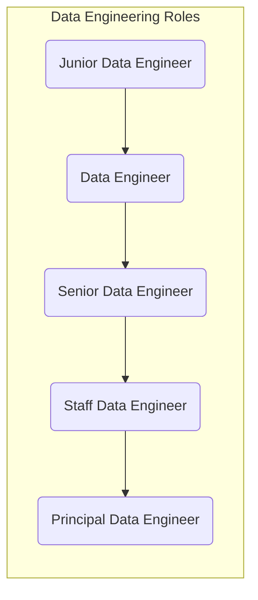
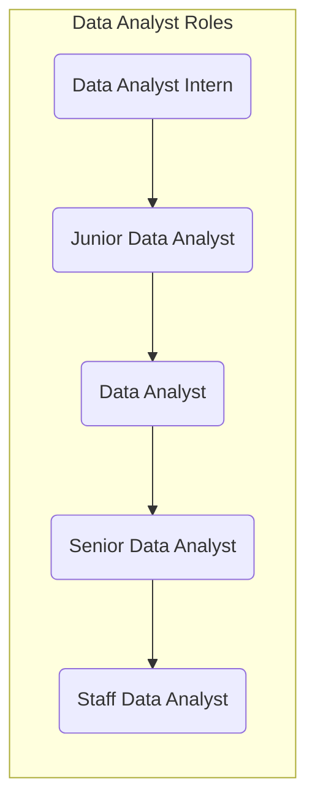
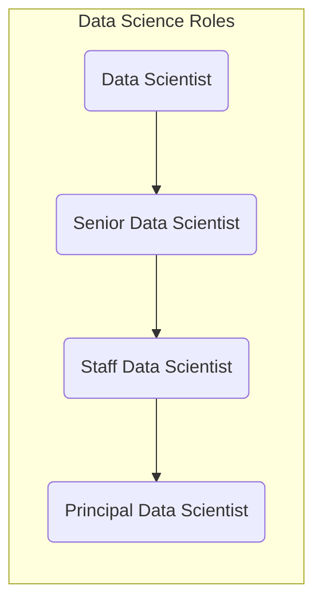
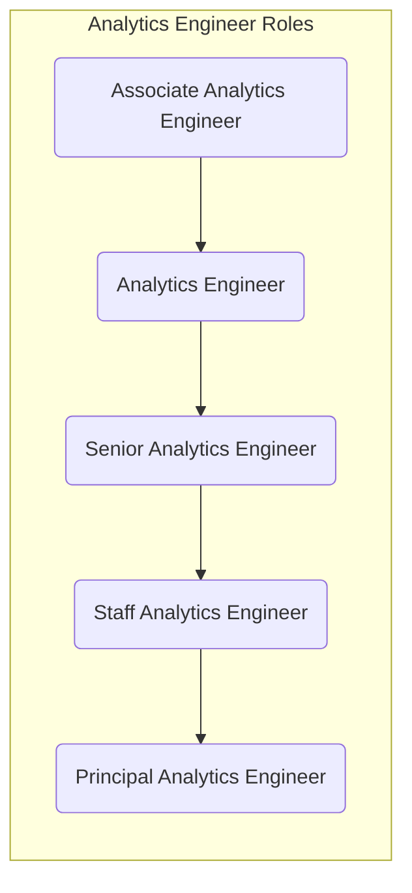
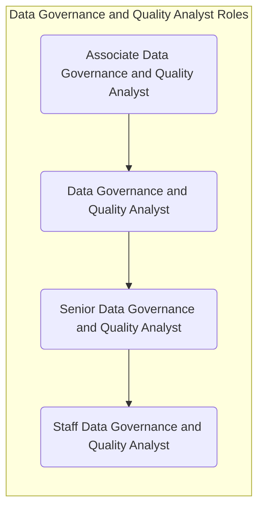
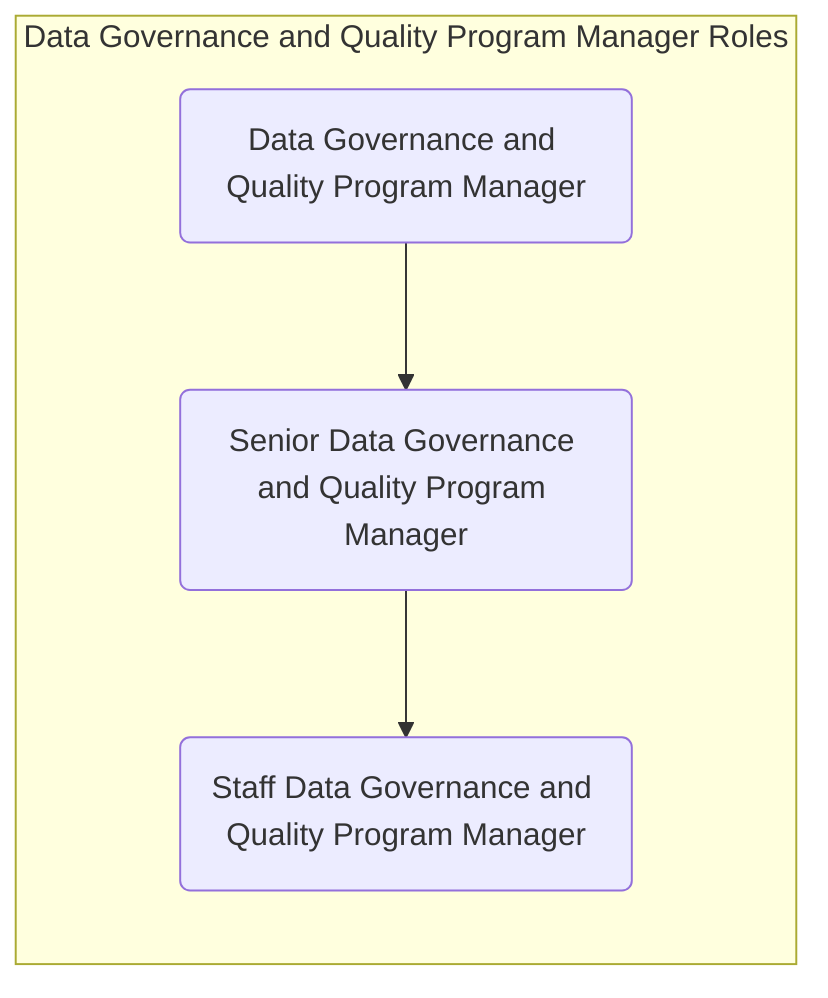
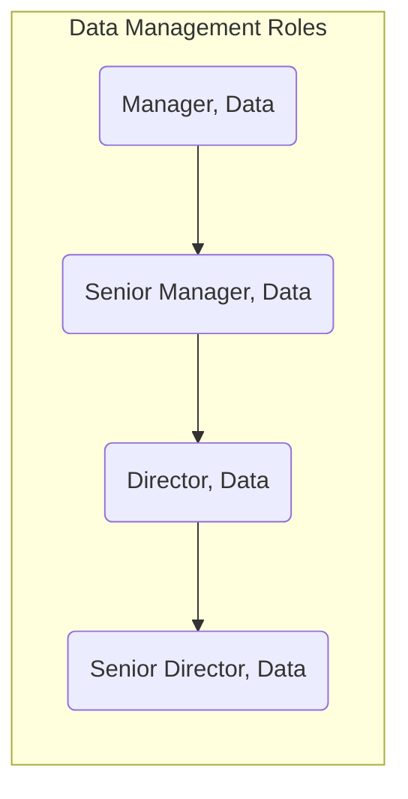

---

## データチームの組織

データチームの組織モデルは5つの主要なビジネスニーズに基づいています:

1. GitLabビジネス固有の**ビスポークデータソリューション**の必要性
1. 分散アナリストチームをサポートするための**高パフォーマンスで信頼性の高いデータストレージとコンピューティング**プラットフォームの必要性
1. **データテクノロジー**と**高度な分析**のセンターオブエクセレンスの必要性
1. さまざまな**緊急性と品質**要件に基づく柔軟なデータソリューションの必要性
1. **信頼、コンプライアンス、価値主導の**インサイトを促進する必要性

これらのニーズに基づき、データチームは以下のように組織されています:

1. **[アナリティクスエンジニアリング](/handbook/enterprise-data/#analytics-engineering-team):** 生データを、データによる意思決定に使用できるクリーンで構造化された形式に変換します。リードアナリティクスエンジニアはビジネス部門と機能分析チームの安定したカウンターパートとして機能します。
1. **[データプラットフォーム＆エンジニアリングチーム](/handbook/enterprise-data/#the-data-platform--architecture-team):** データスタックの所有と運用を含むデータテクノロジーの**センターオブエクセレンス**
1. **[データサイエンスチーム](/handbook/enterprise-data/#the-enterprise-insights--data-science-team):** ビジネスへのデータサイエンスプロジェクトのデリバリーを含む高度な分析の**センターオブエクセレンス**
1. **[データガバナンスとデータ品質チーム](/handbook/enterprise-data/):** 強固なデータガバナンスのプラクティスを構築し、データ品質のモニタリングとデータ品質の改善のためのデータ品質フレームワークを確立するのに役立てます。

## データチームのオペレーティングモデル

エンタープライズデータチームはKey Resultsを通じて内部でコラボレーションします。Key Resultsは四半期ごとに計画され、チームの4つの柱からさまざまなチームメンバーがKey Resultに割り当てられます。Key ResultにはDRI（Directly Responsible Individual）がおり、Key Resultのビジネス成果とチームを成功に導く責任を持ちます。チームの各柱は、それぞれの柱固有のセレモニーを確立し、P1-OpsおよびP3-Otherのissueのトリアージと割り当て方法に関するプロセスを確立する柔軟性を持ちます。

他の柱のセレモニーへの参加はチームメンバーにとって任意です。出席が価値を加える場合、チームメンバーは他の柱のセレモニーへの参加が奨励されます。

時には、エンタープライズデータチームの柱が、複数の四半期にわたって継続し、P1、P2、P3のissueにわたって一貫した深いサポートを必要とする拡張ベースで別の柱からのコラボレーションとサポートを必要とする場合があります。このような場合、チームメンバーはそのメンバーがP1、P2、P3のissueにわたって柱に専用サポートを提供する終了日が設定されたコミットメントで、一定期間その柱の安定したカウンターパートとして割り当てられる可能性があります。期待値とキャパシティは割り当ての開始時に合意され、コラボレーションと合意のもとに変更される可能性があります。

以下はKey Resultに割り当てられたDRIの期待値です:

1. オポチュニティキャンバスの完成を確保し、必要な場合は助けを求めます。
2. Key Resultチームとのワークブレークダウンセッションをスケジュールします。これはKey Resultに応じて非同期または同期で行うことができます。
3. Key Resultチームとの定期的なスタンドアップと作業セッションを必要に応じてスケジュールします。これはKey Resultに適した頻度で非同期または同期で行うことができます。
4. OKRプロジェクトのKey Result Issueに月次更新を提供します。完了率とKey Resultの健全状態を含めます。
5. データ管理チームとのKey Resultの正常な完了に向けたリスクと依存関係を提起します。

## アナリティクスエンジニアリング - チームと安定したカウンターパートの割り当て

| 部門 / 事業部 | 機能分析チーム | アナリティクスエンジニア      | アナリティクスエンジニアリングサブチーム |
| ---------------- | --------------------------------- | ----------------------- | ---------- |
| セールス            |  Revenue Strategy and Analytics   |  @j_kim @dantenel       | GTM |
| マーケティング        |  Marketing Strategy and Analytics |  @dantenel              | GTM |
| ファイナンス          |  FP&A Analytics                   |  @annapiaseczna         | Finance |
| Customer Success |  CS Strategy and Analytics        |  リソーシング待ち                    | R&D |
| プロダクト          |  Product Data Insights            |  (暫定) @lisvinueza  | R&D |
| エンジニアリング      |  Engineering Analytics            |  (暫定) @lisvinueza  | R&D |
| セキュリティ         |  Engineering Analytics            |  (暫定) @lisvinueza  | R&D |
| サポート          |  N/A                              |  TBD                    | TBD |
| People           |  People Analytics                 |  @rakhireddy            | People |

## データプログラムの採用

優れた人材を採用することは私たちの成功に不可欠であり、プロセスを効率化するために多大な努力を投資してきました。以下は私たちが使用する参考資料です:

- 既存のチームメンバーと候補者が成長の機会を理解するための[データロールとキャリア開発](/handbook/enterprise-data/organization/#data-roles-and-career-development)
- 各候補者に完成を求める[テイクホームテスト](/handbook/enterprise-data/organization/#data-roles-and-career-development)。このテストは候補者にとっても私たちにとっても有益です。なぜなら、私たちが定期的に行う作業の種類を代表しており、候補者がこの作業に興味がない場合は、応募についてより十分な情報に基づいた決断をするのに役立つからです

## データロールとキャリア開発

### データインターンシップ

[データチームインターンシップ](/handbook/enterprise-data/organization/internships/)をご覧ください。

### データプラットフォーム

- [データエンジニアリングジョブファミリー](/job-description-library/marketing/enterprise-data/data-engineer/)

#### 中堅・上級データエンジニアのオンボーディングタイムライン

| Day 30まで | Day 60まで |  Day 90まで | Day 120まで |
| ------ | ------ |------ |------ |
| PeopleとDataのオンボーディングを完了する | [トリアージ](/handbook/enterprise-data/how-we-work/triage/)活動を実施する | [新しいデータソース](/handbook/enterprise-data/how-we-work/new-data-source/)を抽出する | データプラットフォームの特定のエリアを所有する |
| ハンドブックまたはテンプレートに貢献するためのMRを作成する | インシデントとissueを調査する | [Level-3 Epicの割り当て](/handbook/enterprise-data/how-we-work/planning/#quarterly-planning)に取り組む | 新しいアイデアを提案し、データプラットフォームの改善イニシアチブを考える |
| データプラットフォームの現在の設定を理解する | プラットフォームインフラまたはデータパイプラインに小さな/修正的な変更を加える | ワークブレークダウンに貢献する | |

### データアナリスト

- [データアナリストジョブファミリー](/job-description-library/marketing/enterprise-data/data-analyst)

#### 中堅・上級データアナリストのオンボーディングタイムライン

| Day 30まで | Day 60まで |  Day 90まで | Day 120まで |
| ------ | ------ |------ |------ |
| PeopleとDataのオンボーディングを完了する | 既存のTableauダッシュボードを拡張するか、dbt issueのトリアージフェーズを完了する | DRIとしてプロジェクトをエンドツーエンドで実行する | ERD/データアーティファクト（例: ダッシュボード）を作成するか、製品評価を完了する|
| First Issue: S to M Tシャツサイズを完了する |  |  |  |

### データサイエンス

- [データサイエンスジョブファミリー](/job-description-library/marketing/enterprise-data/data-science)

#### 中堅・上級データサイエンティストのオンボーディングタイムライン

| Day 30まで | Day 60まで |  Day 90まで | Day 120まで |
| ------ | ------ |------ |------ |
| PeopleとDataのオンボーディングを完了する | 組織全体のステークホルダーと会う | 既存のデータサイエンスモデルを再トレーニングまたは改善する |  データサイエンスのハンドブック、パッケージ、またはプロセスを改善するための貢献をする |
| データサイエンスチームのミーティングへの参加を開始する | 1つのデータサイエンスダッシュボードを改良/改善する | [Level-3 Epicの割り当て](/handbook/enterprise-data/how-we-work/planning/#quarterly-planning)に取り組む | 少なくとも1つの四半期OKRのオーナーシップを取る |
| 現在のデータサイエンスシステムとプロセスを理解する |  | |  |

### アナリティクスエンジニアリング

- [アナリティクスエンジニアリングジョブファミリー](/job-description-library/marketing/enterprise-data/analytics-engineer)

#### 中堅・上級アナリティクスエンジニアのオンボーディングタイムライン

| Day 30まで | Day 60まで |  Day 90まで | Day 120まで |
| ------ | ------ |------ |------ |
| PeopleとDataのオンボーディングを完了する  | 既存のdbt [Trusted Data Models](/handbook/enterprise-data/how-we-work/data-development/#trusted-data-development)を拡張する | DRIとしてプロジェクトをエンドツーエンドで実行する | ERD/データアーティファクトを作成する|
| ビジネスチームの同期ミーティングへの参加を開始する | [トリアージ](/handbook/enterprise-data/how-we-work/triage/)活動を実施する | | |
| First Issue: S to M Tシャツサイズを完了する |  |  |  |

### データガバナンスとデータ品質

#### データガバナンスと品質アナリストジョブファミリー

- [データガバナンスと品質アナリストジョブファミリー](/job-description-library/marketing/enterprise-data/data-governance-and-quality-analyst)

#### 中堅・上級データガバナンスと品質アナリストのオンボーディングタイムライン

| Day 30まで | Day 60まで |  Day 90まで | Day 120まで |
| ------ | ------ |------ |------ |
| PeopleとDataのオンボーディングを完了する | 割り当てられたプログラムに関連するタスクを引き受ける | 計画から実行までエピック/KRを所有する | データガバナンスとデータ品質の改善のための特定のデータドメインを所有する |
| データガバナンスとデータ品質のプログラム、優先事項、戦略を完全に理解する | インシデントとissueを調査する | [Level-3 Epicの割り当て](/handbook/enterprise-data/how-we-work/planning/#quarterly-planning)に取り組む | クロスファンクションでコラボレーションし、改善の余地を特定する |
| ハンドブックまたはテンプレートに貢献するためのMRを作成する |  |  |  |

### データガバナンスと品質プログラムマネージャージョブファミリー

- [データガバナンスと品質アナリストジョブファミリー](/job-description-library/marketing/enterprise-data/data-governance-and-quality-program-manager)

### データマネジメント

- [データマネジメントジョブファミリー](/job-description-library/marketing/enterprise-data/manager-data/)

#### データマネージャーのオンボーディングタイムライン

| Day 30まで | Day 60まで |  Day 90まで | Day 120まで |
| ------ | ------ |------ |------ |
| People、Data、マネージャーのオンボーディングを完了する | チームの全員とビジネスデータチャンピオンに会う | チームアセスメントを完了する | 人材育成ロードマップのドラフトを作成する |
| データプラットフォームの現在の設定を理解する | [Level-3 Epicの割り当て](/handbook/enterprise-data/how-we-work/planning/#quarterly-planning)に取り組み、それらをデータプラットフォームにマッピングする | イニシアチブとOKRに関するユーザー/ステークホルダーとのディスカッションをリードする | プログラム開発ロードマップ（プロセス改善/将来像）のドラフトを作成する |
| ハンドブックに新しいページを追加する | 管理エリアをカバーするハンドブックへの定期的な貢献をする | データハンドブックの主要な部分のDRIになる | 1つ以上のモジュールのシステム/アプリケーション変更管理 |

## ツール・テクノロジータンデム

ツール・テクノロジータンデム（TTT）は、データプログラムにある私たちのビジネスチャンスから最大の価値を引き出すためのサポートです。TTTは特定の（ソフトウェア）ツールまたはテクノロジーのエキスパートであり、ツールまたはテクノロジーを最大限に活用することでビジネスチャンスや課題をサポートします。これが目標ではありませんが、私たちはテクノロジースタックから最大の価値を得たいと思っています。現時点では、テクノロジースタックを最大限に活用できておらず、ビジネスチャンスをサポートできる有用な機能や機会があると認識しています。

その理由は、テクノロジー側ではビジネスを知らず、ビジネス側ではテクノロジーを知らないからです。TTTはビジネスのニーズを理解し、これらをテクノロジー的な方法でまとめることでこのギャップを埋めます。TTTにはコンサルティング、ガイダンス、教育を提供することを期待しています。

注意: TTT は、ツールの機能を使用するビジネス機会を**探しません**。TTTはビジネスチャンスを理解し、ソフトウェアが何をもたらせるかに変換する必要があります。

1つのTTTは最低2人、最大3人の異なる役割を持つGitLabチームメンバーで構成されます。（したがって、中央データチーム以外でも構いません）TTTがチームメンバーが属するチームの要件はありません。ただし、以下に説明する期待値を満たす必要があります。

| ツール / テクノロジー | タンデム |
| ----------------- | ------ |
| Snowflake         | t.b.d. |
| Monte Carlo       | t.b.d. |
| dbt               | t.b.d. |
| Tableau           | t.b.d. |

### TTTに期待すること

- TTTがビジネスパートナーやデータプログラムに貢献するか、データプラットフォームで作業するすべての機能に連絡を取り、課題を理解することを期待しています。
- TTTが自分たちの分野の最新情報を把握することを期待しています。ツール/テクノロジーの完全な機能を理解し、各ベンダーとの定期的なタッチポイントを持ち、最新のリリース機能を十分に理解しています。
- TTTはビジネスパートナーをガイドし、教育します。
- TTTは四半期[計画](/handbook/enterprise-data/how-we-work/planning/)のために[デザインスパイク](/handbook/enterprise-data/how-we-work/#design-spike)を開始します。
