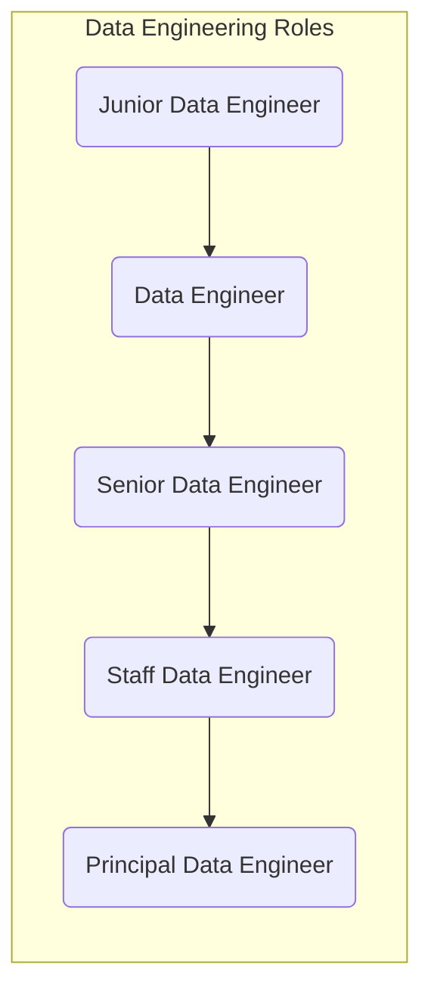
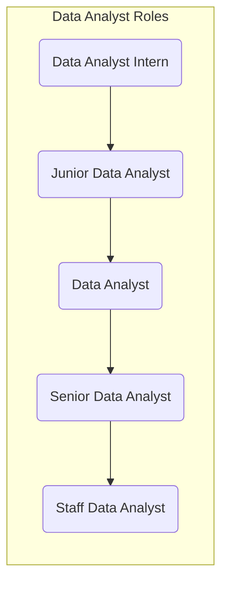
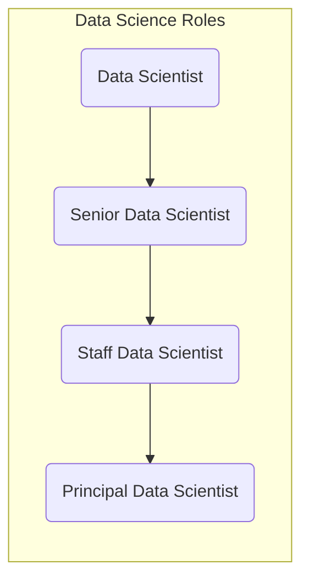
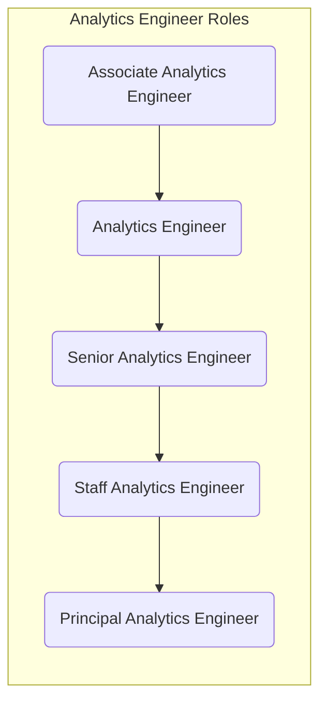
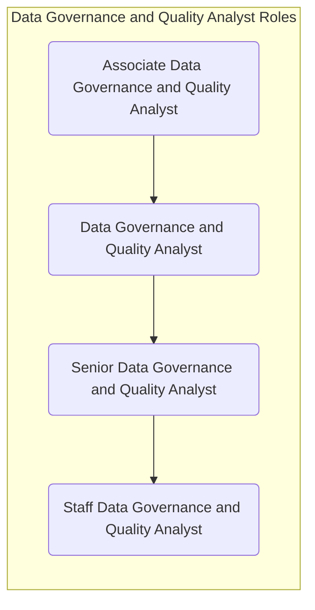
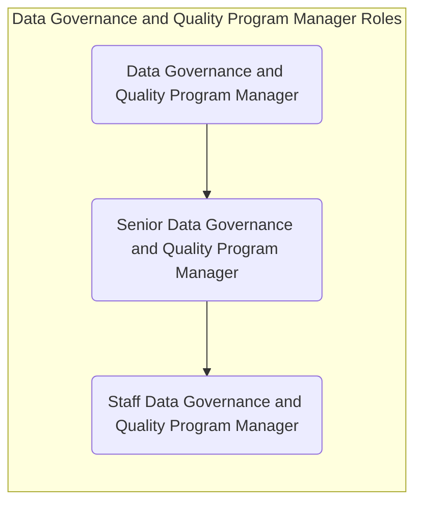
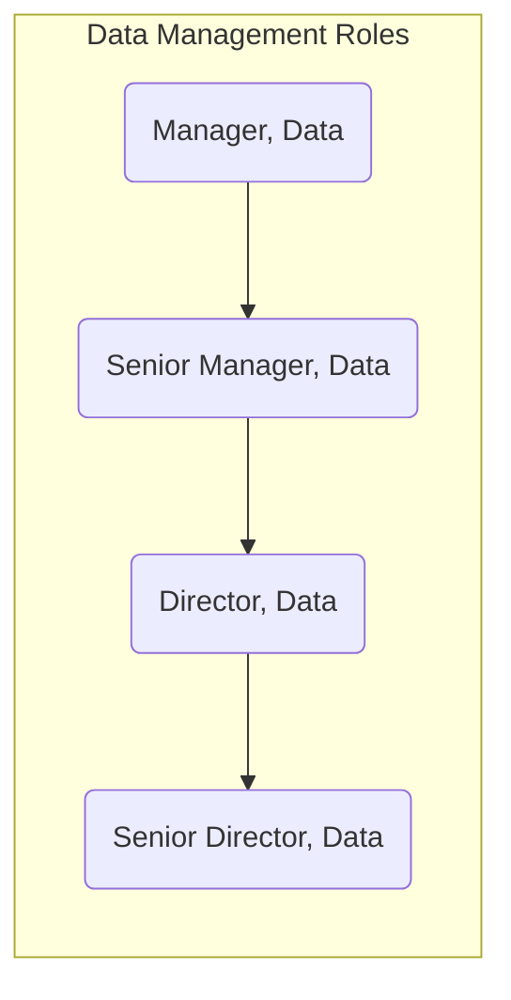

---

## データチームの組織

データチームの組織モデルは 5 つの主要なビジネスニーズに基づいています:

1. GitLab ビジネス固有の**ビスポークデータソリューション**の必要性
1. 分散アナリストチームをサポートするための**高パフォーマンスで信頼性の高いデータストレージとコンピューティング**プラットフォームの必要性
1. **データテクノロジー**と**高度な分析**のセンターオブエクセレンスの必要性
1. さまざまな**緊急性と品質**要件に基づく柔軟なデータソリューションの必要性
1. **信頼、コンプライアンス、価値主導の**インサイトを促進する必要性

これらのニーズに基づき、データチームは以下のように組織されています:

1. **[Analytics Engineering](/handbook/enterprise-data/#analytics-engineering-team):** 生データを、データによる意思決定に使用できるクリーンで構造化された形式に変換します。Lead Analytics Engineer はビジネス部門と機能分析チームの安定したカウンターパートとして機能します。
1. **[Data Platform & Engineering Team](/handbook/enterprise-data/#the-data-platform--architecture-team):** データスタックの所有と運用を含むデータテクノロジーの**センターオブエクセレンス**
1. **[Data Science Team](/handbook/enterprise-data/#the-enterprise-insights--data-science-team):** ビジネスへのデータサイエンスプロジェクトのデリバリーを含む高度な分析の**センターオブエクセレンス**
1. **[Data Governance and Data Quality Team](/handbook/enterprise-data/):** 強固なデータガバナンスのプラクティスを構築し、データ品質のモニタリングとデータ品質の改善のためのデータ品質フレームワークを確立するのに役立てます。

## データチームのオペレーティングモデル

エンタープライズデータチームは Key Results を通じて内部でコラボレーションします。Key Results は四半期ごとに計画され、チームの 4 つの柱からさまざまなチームメンバーが Key Result に割り当てられます。Key Result には DRI（Directly Responsible Individual）がおり、Key Result のビジネス成果とチームを成功に導く責任を持ちます。チームの各柱は、それぞれの柱固有のセレモニーを確立し、P1-Ops および P3-Other の Issue のトリアージと割り当て方法に関するプロセスを確立する柔軟性を持ちます。

他の柱のセレモニーへの参加はチームメンバーにとって任意です。出席が価値を加える場合、チームメンバーは他の柱のセレモニーへの参加が奨励されます。

時には、エンタープライズデータチームの柱が、複数の四半期にわたって別の柱から長期的なコラボレーションとサポートを必要とし、P1、P2、P3 の Issue 全体にわたる一貫した深いサポートを求める場合があります。このような場合、コミットメントの終了日を設定したうえで、チームメンバーを一定期間その柱の安定したカウンターパートとして割り当て、P1、P2、P3 の Issue にわたる専任サポートを提供してもらうことができます。期待値とキャパシティは割り当ての開始時に合意され、コラボレーションと合意のもとに変更される可能性があります。

以下は Key Result に割り当てられた DRI の期待値です:

1. オポチュニティキャンバスの完成を確保し、必要な場合は助けを求めます。
2. Key Result チームとのワークブレークダウンセッションをスケジュールします。これは Key Result に応じて非同期または同期で行うことができます。
3. Key Result チームとの定期的なスタンドアップと作業セッションを必要に応じてスケジュールします。これは Key Result に適した頻度で非同期または同期で行うことができます。
4. OKR プロジェクトの Key Result Issue に月次更新を提供します。完了率と Key Result の健全状態を含めます。
5. データ管理チームとの Key Result の正常な完了に向けたリスクと依存関係を提起します。

## Analytics Engineering - チームと安定したカウンターパートの割り当て

| 部門 / 事業部 | Functional Analytics Team | Analytics Engineer      | Analytics Engineering Sub-Team |
| ---------------- | --------------------------------- | ----------------------- | ---------- |
| Sales            |  Revenue Strategy and Analytics   |  @j_kim                 | GTM |
| Marketing        |  Marketing Strategy and Analytics |  @rakhireddy            | GTM |
| Data             |  Enterprise Analytics             |  @dtinge                | GTM |
| Finance          |  FP&A Analytics                   |  @annapiaseczna         | Finance |
| Product          |  Product Data Insights            |  DRI なし - 共同アプローチ  | R&D |
| Support          |  N/A                              |  TBD                    | TBD |
| People           |  People Analytics                 |  @rakhireddy            | People |

## データプログラムの採用

優れた人材を採用することは私たちの成功に不可欠であり、プロセスを効率化するために多大な努力を投資してきました。以下は私たちが使用する参考資料です:

- 既存のチームメンバーと候補者が成長の機会を理解するための[データロールとキャリア開発](/handbook/enterprise-data/organization/#data-roles-and-career-development)
- 各候補者に完成を求める[テイクホームテスト](/handbook/enterprise-data/organization/#data-roles-and-career-development)。このテストは候補者にとっても私たちにとっても有益です。なぜなら、私たちが定期的に行う作業の種類を代表しており、候補者がこの作業に興味がない場合は、応募についてより十分な情報に基づいた決断をするのに役立つからです

## データロールとキャリア開発 {#data-roles-and-career-development}

### データインターンシップ

[データチームインターンシップ](/handbook/enterprise-data/organization/internships/)をご覧ください。

### Data Platform

- [Data Engineering Job Family](/job-description-library/marketing/enterprise-data/data-engineer/)

```mermaid
  graph LR;
  subgraph Data Engineering Roles
    supe:jde(Junior Data Engineer)-->supe:de(Data Engineer);
    supe:de(Data Engineer)-->supe:sde(Senior Data Engineer);
    supe:sde(Senior Data Engineer)-->supe:fde(Staff Data Engineer);
    supe:fde(Staff Data Engineer)-->supe:pde(Principal Data Engineer);
  end

  click supe:jde "https://handbook.gitlab.com/job-description-library/marketing/enterprise-data/data-engineer/#junior-data-engineer";
  click supe:de "https://handbook.gitlab.com/job-description-library/marketing/enterprise-data/data-engineer/";
  click supe:sde "https://handbook.gitlab.com/job-description-library/marketing/enterprise-data/data-engineer/#senior-data-engineer";
  click supe:fde "https://handbook.gitlab.com/job-description-library/marketing/enterprise-data/data-engineer/#staff-data-engineer";
  click supe:pde "https://handbook.gitlab.com/job-description-library/marketing/enterprise-data/data-engineer/#prinicipal-data-engineer";
```

#### Intermediate および Senior Data Engineer のオンボーディングタイムライン

| 30 日目まで | 60 日目まで |  90 日目まで | 120 日目まで |
| ------ | ------ |------ |------ |
| People と Data のオンボーディングを完了する | [トリアージ](/handbook/enterprise-data/how-we-work/triage/)活動を実施する | [新しいデータソース](/handbook/enterprise-data/how-we-work/new-data-source/)を抽出する | データプラットフォームの特定のエリアを所有する |
| ハンドブックまたはテンプレートに貢献するための MR を作成する | インシデントと Issue を調査する | [Level-3 Epic の割り当て](/handbook/enterprise-data/how-we-work/planning/#quarterly-planning)に取り組む | 新しいアイデアを提案し、データプラットフォームの改善イニシアチブを考える |
| データプラットフォームの現在の設定を理解する | プラットフォームインフラまたはデータパイプラインに小さな/修正的な変更を加える | ワークブレークダウンに貢献する | |

### Data Analyst

- [Data Analyst Job Family](/job-description-library/marketing/enterprise-data/data-analyst)

```mermaid
  graph LR;
  subgraph Data Analyst Roles
    supe:ida(Data Analyst Intern)-->supe:jda(Junior Data Analyst);
    supe:jda(Junior Data Analyst)-->supe:da(Data Analyst);
    supe:da(Data Analyst)-->supe:sda(Senior Data Analyst);
    supe:sda(Senior Data Analyst)-->supe:fda(Staff Data Analyst);
  end

  click supe:ida "https://handbook.gitlab.com/job-description-library/marketing/enterprise-data/data-analyst#data-analyst-intern";
  click supe:jda "https://handbook.gitlab.com/job-description-library/marketing/enterprise-data/data-analyst#junior-data-analyst";
  click supe:da "https://handbook.gitlab.com/job-description-library/marketing/enterprise-data/data-analyst#data-analyst";
  click supe:sda "https://handbook.gitlab.com/job-description-library/marketing/enterprise-data/data-analyst#senior-data-analyst";
  click supe:fda "https://handbook.gitlab.com/job-description-library/marketing/enterprise-data/data-analyst#staff-data-analyst";
```

#### Intermediate および Senior Data Analyst のオンボーディングタイムライン

| 30 日目まで | 60 日目まで |  90 日目まで | 120 日目まで |
| ------ | ------ |------ |------ |
| People と Data のオンボーディングを完了する | 既存の Tableau ダッシュボードを拡張するか、dbt Issue のトリアージフェーズを完了する | DRI としてプロジェクトをエンドツーエンドで実行する | ERD／データアーティファクト（例: ダッシュボード）を作成するか、製品評価を完了する|
| 最初の Issue: S から M の T シャツサイズを完了する |  |  |  |

### Data Science

- [Data Science Job Family](/job-description-library/marketing/enterprise-data/data-science)

```mermaid
  graph LR;
  subgraph Data Science Roles
    supe:ds(Data Scientist)-->supe:sds(Senior Data Scientist)-->supe:stds(Staff Data Scientist)-->supe:pds(Principal Data Scientist);
  end

  click supe:ds "https://handbook.gitlab.com/job-description-library/marketing/enterprise-data/data-science/#data-scientist-intermediate";
  click supe:sds "https://handbook.gitlab.com/job-description-library/marketing/enterprise-data/data-science/#senior-data-scientist";
  click supe:stds "https://handbook.gitlab.com/job-description-library/marketing/enterprise-data/data-science/#staff-data-scientist";
  click supe:pds "https://handbook.gitlab.com/job-description-library/marketing/enterprise-data/data-science/#principal-data-scientist";
```

#### Intermediate および Senior Data Scientist のオンボーディングタイムライン

| 30 日目まで | 60 日目まで |  90 日目まで | 120 日目まで |
| ------ | ------ |------ |------ |
| People と Data のオンボーディングを完了する | 組織全体のステークホルダーと会う | 既存のデータサイエンスモデルを再トレーニングまたは改善する |  データサイエンスのハンドブック、パッケージ、またはプロセスを改善するための貢献をする |
| Data Science Team のミーティングへの参加を開始する | 1 つのデータサイエンスダッシュボードを改良/改善する | [Level-3 Epic の割り当て](/handbook/enterprise-data/how-we-work/planning/#quarterly-planning)に取り組む | 少なくとも 1 つの四半期 OKR のオーナーシップを取る |
| 現在のデータサイエンスシステムとプロセスを理解する |  | |  |

### Analytics Engineering

- [Analytics Engineering Job Family](/job-description-library/marketing/enterprise-data/analytics-engineer)

```mermaid
  graph LR;
  subgraph Analytics Engineer Roles
    supe:aae(Associate Analytics Engineer)-->supe:ae(Analytics Engineer);
    supe:ae(Analytics Engineer)-->supe:sae(Senior Analytics Engineer);
    supe:sae(Senior Analytics Engineer)-->supe:fae(Staff Analytics Engineer);
    supe:fae(Staff Analytics Engineer)-->supe:pae(Principal Analytics Engineer);
  end

  click supe:ae "https://handbook.gitlab.com/job-description-library/marketing/enterprise-data/analytics-engineer/#associate-analytics-engineer";
  click supe:ae "https://handbook.gitlab.com/job-description-library/marketing/enterprise-data/analytics-engineer#analytics-engineer-intermediate";
  click supe:sae "https://handbook.gitlab.com/job-description-library/marketing/enterprise-data/analytics-engineer#senior-analytics-engineer";
  click supe:fae "https://handbook.gitlab.com/job-description-library/marketing/enterprise-data/analytics-engineer#staff-analytics-engineer";
  click supe:pae "https://handbook.gitlab.com/job-description-library/marketing/enterprise-data/analytics-engineer#principal-analytics-engineer";
```

#### Intermediate および Senior Analytics Engineer のオンボーディングタイムライン

| 30 日目まで | 60 日目まで |  90 日目まで | 120 日目まで |
| ------ | ------ |------ |------ |
| People と Data のオンボーディングを完了する  | 既存の dbt [Trusted Data Models](/handbook/enterprise-data/how-we-work/data-development/#trusted-data-development)を拡張する | DRI としてプロジェクトをエンドツーエンドで実行する | ERD／データアーティファクトを作成する|
| ビジネスチームの同期ミーティングへの参加を開始する | [トリアージ](/handbook/enterprise-data/how-we-work/triage/)活動を実施する | | |
| 最初の Issue: S から M の T シャツサイズを完了する |  |  |  |

### Data Governance and Data Quality

#### Data Governance and Quality Analyst Job Family

- [Data Governance and Quality Analyst Job Family](/job-description-library/marketing/enterprise-data/data-governance-and-quality-analyst)

```mermaid
  graph LR;
  subgraph Data Governance and Quality Analyst Roles
    supe:adgq(Associate Data Governance and Quality Analyst)-->supe:dgq(Senior Data Governance and Quality Analyst);
    supe:dgq(Data Governance and Quality Analyst)-->supe:sdgq(Senior Data Governance and Quality Analyst);
    supe:sdgq(Senior Data Governance and Quality Analyst)-->supe:sfdgq(Staff Data Governance and Quality Analyst);
  end

  click supe:adgq "https://handbook.gitlab.com/job-description-library/marketing/enterprise-data/data-governance-and-quality-analyst/#data-governance-and-quality-analyst-associate";
  click supe:dgq "https://handbook.gitlab.com/job-description-library/marketing/enterprise-data/data-governance-and-quality-analyst/#data-governance-and-quality-analyst-intermediate";
  click supe:sdgq "https://handbook.gitlab.com/job-description-library/marketing/enterprise-data/data-governance-and-quality-analyst/#senior-data-governance-and-quality-analyst";
  click supe:sfdgq "https://handbook.gitlab.com/job-description-library/marketing/enterprise-data/data-governance-and-quality-analyst/#staff-data-governance-and-quality-analyst";
```

#### Intermediate および Senior Data Governance and Quality Analyst のオンボーディングタイムライン

| 30 日目まで | 60 日目まで |  90 日目まで | 120 日目まで |
| ------ | ------ |------ |------ |
| People と Data のオンボーディングを完了する | 割り当てられたプログラムに関連するタスクを引き受ける | 計画から実行までエピック／KR を所有する | データガバナンスとデータ品質の改善のための特定のデータドメインを所有する |
| データガバナンスとデータ品質のプログラム、優先事項、戦略を完全に理解する | インシデントと Issue を調査する | [Level-3 Epic の割り当て](/handbook/enterprise-data/how-we-work/planning/#quarterly-planning)に取り組む | クロスファンクションでコラボレーションし、改善の余地を特定する |
| ハンドブックまたはテンプレートに貢献するための MR を作成する |  |  |  |

### Data Governance and Quality Program Manager Job Family

- [Data Governance and Quality Analyst Job Family](/job-description-library/marketing/enterprise-data/data-governance-and-quality-program-manager)

```mermaid
  graph LR;
  subgraph Data Governance and Quality Program Manager Roles
    supe:dgqp(Data Governance and Quality Program Manager)-->supe:sdgqp(Senior Data Governance and Quality Program Manager);
    supe:sdgqp(Senior Data Governance and Quality Program Manager)-->supe:sfdgqp(Staff Data Governance and Quality Program Manager);
  end

  click supe:dgq "https://handbook.gitlab.com/job-description-library/marketing/enterprise-data/data-governance-and-quality-program-manager/#data-governance-and-quality-program-manager";
  click supe:sdgq "https://handbook.gitlab.com/job-description-library/marketing/enterprise-data/data-governance-and-quality-program-manager/#senior-data-governance-and-quality-program-manager";
  click supe:sfdgq "https://handbook.gitlab.com/job-description-library/marketing/enterprise-data/data-governance-and-quality-program-manager/#staff-data-governance-and-quality-program-manager";
```

### Data Management

- [Data Management Job Family](/job-description-library/marketing/enterprise-data/manager-data/)

```mermaid
  graph LR;
  subgraph Data Management Roles
    supe:md(Manager, Data)-->supe:smd(Senior Manager, Data);
    supe:smd(Senior Manager, Data)-->supe:dd(Director, Data);
    supe:dd(Director, Data)-->supe:sdd(Senior Director, Data);
  end

  click supe:md "https://handbook.gitlab.com/job-description-library/marketing/enterprise-data/manager-data/#manager-data-intermediate";
  click supe:smd "https://handbook.gitlab.com/job-description-library/marketing/enterprise-data/manager-data/#manager-data-intermediate";
  click supe:dd "https://handbook.gitlab.com/job-description-library/marketing/enterprise-data/data-and-insights-executive/#director-data-and-insights";
  click supe:sdd "https://handbook.gitlab.com/job-description-library/marketing/enterprise-data/data-and-insights-executive/#senior-director-data-and-insights";
```

#### Data Manager のオンボーディングタイムライン

| 30 日目まで | 60 日目まで |  90 日目まで | 120 日目まで |
| ------ | ------ |------ |------ |
| People、Data、マネージャーのオンボーディングを完了する | チームの全員とビジネスデータチャンピオンに会う | チームアセスメントを完了する | 人材育成ロードマップのドラフトを作成する |
| データプラットフォームの現在の設定を理解する | [Level-3 Epic の割り当て](/handbook/enterprise-data/how-we-work/planning/#quarterly-planning)に取り組み、それらをデータプラットフォームにマッピングする | イニシアチブと OKR に関するユーザー／ステークホルダーとのディスカッションをリードする | プログラム開発ロードマップ（プロセス改善／将来像）のドラフトを作成する |
| ハンドブックに新しいページを追加する | 管理エリアをカバーするハンドブックへの定期的な貢献をする | データハンドブックの主要な部分の DRI になる | 1 つ以上のモジュールのシステム／アプリケーション変更管理 |

## ツール・テクノロジータンデム

ツール・テクノロジータンデム（TTT）は、データプログラムにある私たちのビジネスチャンスから最大の価値を引き出すためのサポートです。TTT は特定の（ソフトウェア）ツールまたはテクノロジーのエキスパートであり、ツールまたはテクノロジーを最大限に活用することでビジネスチャンスや課題をサポートします。これが目標ではありませんが、私たちはテクノロジースタックから最大の価値を得たいと思っています。現時点では、テクノロジースタックを最大限に活用できておらず、ビジネスチャンスをサポートできる有用な機能や機会があると認識しています。

その理由は、テクノロジー側ではビジネスを知らず、ビジネス側ではテクノロジーを知らないからです。TTT はビジネスのニーズを理解し、これらをテクノロジー的な方法でまとめることでこのギャップを埋めます。TTT にはコンサルティング、ガイダンス、教育を提供することを期待しています。

注意: TTT は、ツールの機能を使用するビジネス機会を**探しません**。TTT はビジネスチャンスを理解し、ソフトウェアが何をもたらせるかに変換する必要があります。

1 つの TTT は最低 2 人、最大 3 人の異なる役割を持つ GitLab チームメンバーで構成されます。（したがって、中央データチーム以外でも構いません）TTT がチームメンバーが属するチームの要件はありません。ただし、以下に説明する期待値を満たす必要があります。

| ツール / テクノロジー | タンデム |
| ----------------- | ------ |
| Snowflake         | t.b.d. |
| Monte Carlo       | t.b.d. |
| dbt               | t.b.d. |
| Tableau           | t.b.d. |

### TTT に期待すること

- TTT がビジネスパートナーやデータプログラムに貢献するか Data Platform で作業するすべての部門に連絡を取り、課題を理解することを期待しています。
- TTT が自分たちの分野の最新情報を把握することを期待しています。ツール／テクノロジーの完全な機能を理解し、各ベンダーとの定期的なタッチポイントを持ち、最新のリリース機能を十分に理解しています。
- TTT はビジネスパートナーをガイドし、教育します。
- TTT は[デザインスパイク](/handbook/enterprise-data/how-we-work/#design-spike)を四半期[計画](/handbook/enterprise-data/how-we-work/planning/)のために開始します。
