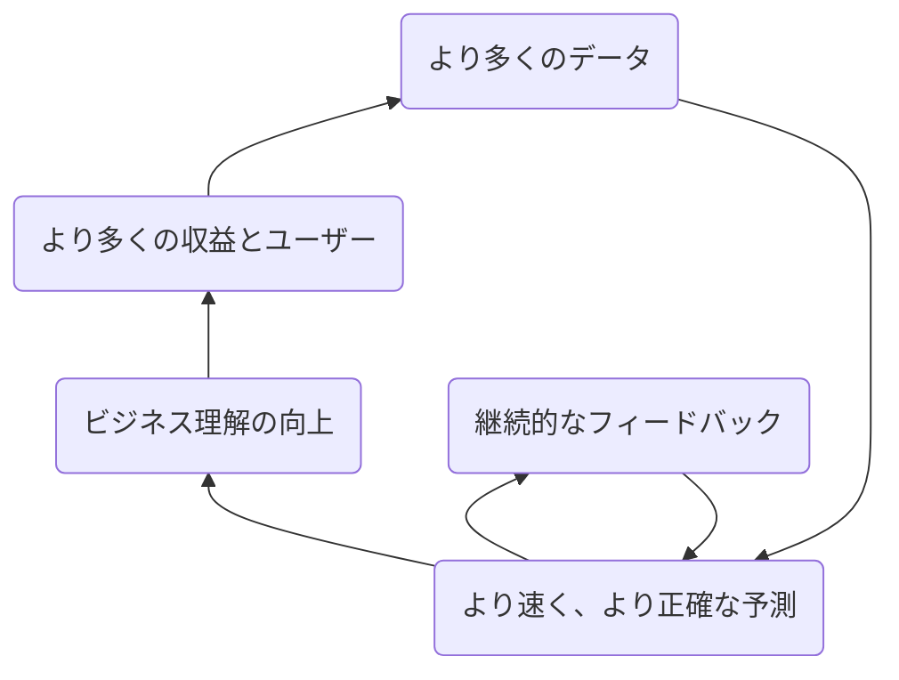
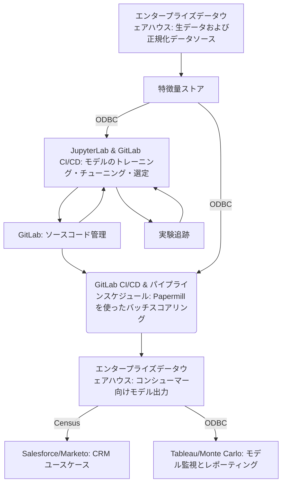

## GitLab のエンタープライズデータサイエンスチーム

データサイエンスチームのミッションは、***予測アナリティクス***を使って***より速く、より良い意思決定***を支援することです。

## ハンドブックファースト

GitLab では[ハンドブックファースト](/handbook/about/handbook-usage/#why-handbook-first)を実践しており、データサイエンスチームのページが目標・プロセス・プロジェクトに関する最新かつ正確な情報で更新された状態を維持することでこの考え方を推進しています。また、有益なリソースやデータサイエンスのツールセットもハンドブックに最新の状態で掲載するよう努めています。

{}
[Slack の #data-science にアクセスする](https://gitlab.slack.com/archives/C01AJB3KJRZ)、[Data Team の動画を視聴する](https://www.youtube.com/playlist?list=PL05JrBw4t0KrRVTZY33WEHv8SjlA_-keI)。ご意見をお聞かせください！
{}

## データサイエンスの責務

データサイエンスチームは以下の事項に**直接責任**を持ちます:

- [GitLab の KPI](/handbook/company/kpis/)を促進・改善する*説明的*・*予測的*・*規範的*なソリューションを提供する
- 予測アナリティクスの***卓越センター（Center of Excellence）***として、他チームのデータサイエンスの取り組みを支援する
- データサイエンスと機械学習のためのツール・プロセス・ベストプラクティスを開発する

さらに、データサイエンスチームは以下の責務を**支援**します:

- **データリーダーシップ**と連携して:
  - ビジネス KPI に直接インパクトを与えるデータサイエンス戦略をスコープ化・実行する
  - 成果物・進行中のイニシアティブ・ロードマップについて定期的な更新情報を発信する
- [**Data Platform チーム**](/handbook/enterprise-data/organization/engineering/)と連携して:
  - GitLab データシステムのデータ品質ベストプラクティスとプログラムを定義・推進する
  - データサイエンスモデルをデプロイし、データ品質と整合性を確保し、機械学習と互換性のあるデータセットを形成し、新しいデータセットをオンラインにする
  - GitLab プラットフォームと Data Team の技術スタックとネイティブに連携するデータサイエンスパイプラインを作成する
- [**Data Analytics チーム**](/handbook/enterprise-data/organization/analytics/)と連携して:
  - データサイエンスをアナリティクスイニシアティブに組み込む
  - データサイエンスモデルの価値とインパクトを高めるダッシュボードを設計する

## 私たちの働き方

卓越センターとして、データサイエンスチームは組織内の他チームと協力して作業することに注力しています。これは、私たちのステークホルダーや執行スポンサーが主にビジネスの他の部分（例: 営業・マーケティング）にいることを意味します。これらのチームと緊密に連携しながら、そのビジネスニーズ・目標・優先事項に合致した[プロジェクト計画](/handbook/enterprise-data/organization/data-science/project_dev_approach/#3c-modeling--implementation-plan)を策定します。これには通常、それらのチーム内の機能アナリストと密接に連携して、データ・過去の分析からのインサイト・実装上のハードルを把握することが含まれます。

データサイエンスのフライホイールは、正確で信頼性の高い予測を作成することでビジネス効率と KPI の改善に注力しています。これは[機能アナリティクス卓越センター（Functional Analytics Center of Excellence）](/handbook/enterprise-data/how-we-work/functional-analytics-center-of-excellence/)と協力して、最も関連性の高いデータソースが活用されビジネス目標が達成され、結果を定量的に測定できるようにしながら行われます。ビジネスニーズが変化し、ユーザーベースが成長するにつれ、このフライホイールアプローチによってデータサイエンスチームは機械学習モデルを素早く適応・イテレーション・改善できます。

### データサイエンスイニシアティブ

現在のデータサイエンスイニシアティブの例:

- 収益拡大
- チャーン削減
- 予測精度の改善
- 顧客ヘルス
- GitLab を使った MLOps

進行中・計画中のすべてのプロジェクトの最新情報については、[データサイエンスイニシアティブ 社内ハンドブック](https://internal.gitlab.com/handbook/enterprise-data/organization/data-science-enterprise-analytics/data-science-initiatives)を参照してください。

## プロジェクト構成

データサイエンスチームは[クロスインダストリー標準プロセス（CRISP-DM）](https://en.wikipedia.org/wiki/Cross-industry_standard_process_for_data_mining)に従っており、6つの反復フェーズで構成されています:

1. **ビジネス理解**

    - 要件収集・ステークホルダーへのインタビュー・プロジェクト定義・製品ユーザーストーリー・プロジェクトの成功基準を確立するための潜在的なユースケースが含まれます。

1. **データ理解**

    - 既存の関連データソースの範囲とスコープを決定する必要があります。データサイエンティストはデータエンジニアやデータアナリストと密接に連携して、ギャップが存在する可能性のある箇所を特定し、データの不一致やリスクを洗い出します。

1. **データ準備**

    - データ品質チェックと探索的データ分析（EDA）を実施して、データとさまざまなデータポイントがビジネスニーズの解決にどう関係するかをより深く理解する必要があります。

1. **モデリング**

    - 機械学習技術を使用してビジネスニーズに対処するソリューションを見つけます。これは多くの場合、ビジネスアウトカムの将来のインスタンスがいつ・なぜ・どのように発生するかを予測する形を取ります。

1. **評価**

    - パフォーマンスは一般的に、モデルの*正確性*・*パワー*・*説明可能性*によって測定されます。調査結果はフィードバックのためにステークホルダーに提示されます。

1. **デプロイ**

    - モデルが承認されると、データサイエンス本番パイプラインにデプロイされます。このプロセスにより、モデルが定期的なケイデンスで自動的に更新・予測生成・監視されます。

### GitLab のアプローチ

[モデル開発に対するデータサイエンスチームのアプローチ](/handbook/enterprise-data/organization/data-science/project_dev_approach/)は、GitLab のバリューである[イテレーション](/handbook/values/#iteration)と CRISP-DM 標準を中心に据えています。私たちのプロセスは、特定のビジネス目標とデータインフラのニーズに最も適切に対処するために、CRISP-DM で概説されている6つのフェーズのいくつかを拡張しています。

## データサイエンスプラットフォーム

現在のプラットフォームは以下で構成されています:

- 生データおよび正規化されたソースデータ、並びに下流のコンシューマーが利用するための最終モデル出力を保存するための[エンタープライズデータウェアハウス](/handbook/enterprise-data/platform/)
- モデルのトレーニング・チューニング・選定のための[JupyterLab](/handbook/enterprise-data/platform/jupyter-guide/)と VSCode
- コラボレーション・プロジェクトのバージョン管理・スコアコード管理・[実験追跡](https://docs.gitlab.com/user/project/ml/experiment_tracking/)・[CI/CD](https://docs.gitlab.com/ee/ci/)のための[GitLab](https://gitlab.com/)
- オートメーションとオーケストレーションのための[GitLab CI](/handbook/enterprise-data/platform/ci-for-ds-pipelines/#our-approach-to-using-cicd-for-machine-learning)
- 機械学習モデル用のオープンソース特徴量ストアとしての[Snowflake Feature Store](https://docs.snowflake.com/en/developer-guide/snowflake-ml/feature-store/overview)
- ドリフト検出のための[Monte Carlo](https://getmontecarlo.com/)
- モデル監視と継続的なパフォーマンス評価のための Tableau Server

### 現在のデータフロー

### 特徴量ストア

私たちは Snowflake Feature Store を使用して、機械学習モデルの特徴量を作成・提供しています。
設定は[特徴量ストアプロジェクトリポジトリ](https://gitlab.com/gitlab-data/data-science-projects/snowflake-feature-store/)にあります。特徴量ストアの更新は GitLab CI/CD を使って行います。

特徴量の作成と提供方法の詳細については、[特徴量ストアのハンドブックページ](/handbook/enterprise-data/platform/feature-store/)を参照してください。

### データサイエンス向け CI/CD パイプライン

私たちはすべてのモデルを GitLab のネイティブ CI/CD 機能を使ってデプロイしています。モデルを CI/CD でデプロイする方法の最新情報と手順については、[データサイエンスパイプライン向け CI/CD 入門](/handbook/enterprise-data/platform/ci-for-ds-pipelines/)を参照してください。

### GitLab のデータサイエンスツール

- **[事前設定済みデータサイエンス環境](https://gitlab.com/gitlab-data/data-science)**: データサイエンスチームは、一般的な Python モジュール（pandas、numpy 等）・ネイティブ Snowflake 接続・Git サポートが事前設定された JupyterLab を使用しています。共通のフレームワークから作業することで、より速くモデルを作成しインサイトを導出できます。このセットアップは誰でも自由に利用できます。詳細については[Jupyter ガイド](/handbook/enterprise-data/platform/jupyter-guide/)をご覧ください。
- **[Python 向け GitLab データサイエンスツール](https://gitlab.com/gitlab-data/gitlabds/)**: 一般的なデータ前処理（ダミーコーディング・外れ値検出・変数削減等）とモデリングタスク（モデルパフォーマンスの評価等）を自動化するための関数。[pypi](https://pypi.org/project/gitlabds/)（`pip install gitlabds`）から直接インストールするか、上記のデータサイエンス環境の一部として使用できます。
- **[モデリングテンプレート](https://gitlab.com/gitlab-data/data-science/-/tree/main/modeling_templates)**: データサイエンスチームは、Python コードをゼロから書くことなく予測モデルの構築を簡単に始められるモデリングテンプレートを作成しました。これらのテンプレートを有効にするには、[Jupyter ガイド](/handbook/enterprise-data/platform/jupyter-guide/#enabling-jupyter-templates)の手順に従ってください。
