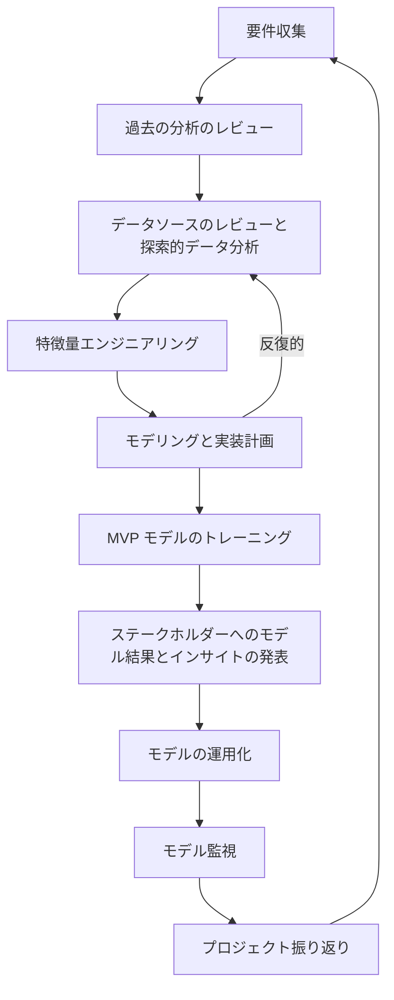

## 私たちのアプローチ

データサイエンスチームのモデル開発アプローチは、GitLab のバリューである[イテレーション](/handbook/values/#iteration)と[CRISP-DM](https://en.wikipedia.org/wiki/Cross-industry_standard_process_for_data_mining)標準を中心に据えています。私たちのプロセスは、特定のビジネス目標とデータインフラのニーズに最も適切に対処するために、CRISP-DM で概説されている6つのフェーズのいくつかを拡張しています:

- 少なくとも以下のフェーズでは、プロジェクトが目標達成に向けて順調であることを確認するために、ステークホルダー・プロジェクトオーナーとのチェックインを推奨します:

  - 要件収集
  - モデリングと実装計画
  - ステークホルダーへのモデル結果とインサイトの発表

- サイジングの定義については、[T シャツサイジングアプローチ](/handbook/enterprise-data/how-we-work/planning/#t-shirt-sizing-approach)を参照してください。

- **[データサイエンスプロセステンプレート](https://gitlab.com/gitlab-data/analytics/-/blob/master/.gitlab/issue_templates/Data%20Science%3A%20Project%20Process.md)を使用して新しい Issue を作成してください**

## 1: 要件収集

**サイジング:** Small（実装計画フェーズを通じて継続的に改善）

**目的:** これはデータサイエンスプロジェクトにおいておそらく最も重要なフェーズです。ステークホルダーは解決したい問題についての一般的なアイデアを持っていることが多く、モデリングと実装戦略の開発を始める前に、プロジェクトのスコープを定義・改善するための支援が必要です。

**タスク:**

- ステークホルダーとキックオフミーティングをスケジュールする
- キックオフミーティング中に回答すべき質問
  - 解決・回答しようとしている問題提起は何か？
    - これは多くの場合、非常に一般的な質問から始まります。例えば、*「チャーンをどうすれば減らせるか？」* のようなものです。私たちの仕事は、問題提起の対象集団・アウトカム・時間軸を明確に理解することです。例えば、すべての解約顧客に関心があるのか？チャーンはどのように定義されているか？どの期間にわたるものか？
    - ステークホルダーにできるだけ具体的な情報を提供するよう求めます。これには複数回のミーティングとある程度のデータ探索が必要かもしれません。場合によっては明確に確立された定義が存在せず、EDA フェーズ中にデータサイエンティストが定義を作成することになるかもしれません。
  - このプロジェクトの完了時点で何を達成できることを望んでいるか？
    - この質問の意図は、このプロジェクトが問題提起に対して意味のあるインパクトをどのようにもたらせるかを理解することです。**データサイエンスプロジェクトは問題提起の理解を深めることができます（例: チャーンリスクの*理解*）が、問題に対して*実行可能な*変化をもたらすための明確な戦略も必要です（例: チャーンの*削減*）。** プロジェクトが純粋に*理解*だけを目的とするなら、データサイエンスプロジェクトとしての適切なスコープではない可能性があります。
    - 良いフォローアップの質問として、*「このプロジェクトの成果をどのように活用することを想定していますか？」; 「このプロジェクトのアウトプットの意図されたコンシューマーは誰ですか？」* があります。
  - この問題・質問に対処するために、以前に何らかの分析が行われたか？
    - 過去の分析が存在する場合、質問に答えるためのデータが存在する良い指標となります。
  - 過去の分析とデータソースのレビューに協力できる最適な技術的担当者は誰か？
- ステークホルダーとの定期的なミーティングケイデンスをスケジュールする。最初はより頻繁（週次など）にし、プロジェクトが進むにつれて頻度を下げる（隔週など）ことが適切です。

**考慮事項:**

- ステークホルダーとの早い段階での会話で、プロジェクトがデータサイエンスの適切なスコープであるかどうか、また問題提起に答えるための関連データが存在しそうかどうかを理解することが重要です。

**完了基準:**

- プロジェクトがデータサイエンスプロジェクトとして適切なスコープであると判断されること
- 表面上、問題提起に答えるためのデータが存在すると思われること

## 2: 過去の分析のレビュー（オプション）

**サイジング:** Small

**目的:** 過去の分析作業を理解することは、効率的で効果的なデータサイエンスプロジェクトを開発するために不可欠です。すでに行われた作業を把握することで、有用なデータソース・アウトカム（ターゲット）の定義・潜在的な予測変数（特徴量）・データの微妙なニュアンス・重要なインサイトを特定できます。

**タスク:**

- 過去のアナリティクス作業の DRI とのミーティングをスケジュールする
- どのデータソースが使用されたか（そしてなぜか）を理解する。
- どのデータソースが検討されたが使用されなかったか（そしてなぜか）を理解する
  - 使用されなかった潜在的に有用なデータソースがあるかどうか（そしてなぜか）の理解も含む
- このプロジェクトで使用すべき技術的・構文的な定義。
  - 関連するコードへのリンク
- 分析からの主要なインサイトと学びは何か？
  - デッキや文書へのリンク
- もし今日この分析を繰り返すとしたら、DRI は何を違うやり方でするか（そしてなぜか）？

**考慮事項:**

- 過去の分析は、取り組みの重複を避けてその上に知識を積み上げるためにレビューすることが一般的に役立ちます。EDA と特徴量エンジニアリングフェーズの一部として、分析コードの一部（利用可能な場合）を活用することを検討してください。

**完了基準:**

- 上記の*タスク*に基づく分析の確かな理解

## 3a: データソースのレビューと探索的データ分析（EDA）

_**3b & 3c と反復的***

**サイジング:** Large

**目的:** 利用可能な関連データをレビューし、アウトカム・ターゲットと潜在的な予測変数（特徴量）に関する分析を実施します。これにより、*MVP モデルのトレーニング* フェーズで使用するために必要なデータソースに絞り込めるようになります。アウトカム・ターゲットが潜在的な予測変数データとどのように関連するかを理解し、予測の時間軸を適切に設定することが重要です。

**タスク:**

- プロジェクトの意図されたアウトカム・ターゲットを測定するためのデータが利用可能かどうかを理解する。
  - これは続行前に確立すべき最も重要な要素です。アウトカムを定量化・測定できない場合、その将来のインスタンスを予測することはできません。
  - 例: チャーンは、顧客が支出を削減した時期を特定するために過去の収益数値を検査することが必要です。したがって、予測を構築するためには十分な期間の ARR データの過去スナップショットが存在する必要があります。一般的なルールとして、予測の時間軸の少なくとも2倍の過去データが必要です。例えば、今後12ヶ月のチャーンを予測している場合、少なくとも24ヶ月の収益データが必要です（予測ウィンドウの12ヶ月とその前の12ヶ月の予測変数・特徴量の取得のため）。
- モデルを構築することが合理的なほど十分なアウトカム・ターゲットのインスタンスがあるかどうかを判断する。
  - *非常に大雑把な*目安: アウトカム・ターゲットのインスタンスが少なくとも1,000件
- モデリングに使用する予定のすべての関連データソースをレビューする
  - データソースは調査したい期間のデータを含んでいるか？
  - データソースに十分なカバレッジがあるか？つまり、欠損値や各行でほぼ同じ値になっている特徴量が多くないか？
  - データとアウトカム・ターゲットの関係（相関）は何か？関係が強すぎるまたは弱すぎる場合、モデリングフェーズに含めるには適さないかもしれない。
  - このデータソースを使用することで、ルックバックウィンドウから予測ウィンドウへの[データリーケージ](https://en.wikipedia.org/wiki/Leakage_(machine_learning))のリスクがあるか？

**考慮事項:**

- このフェーズでは特徴量の作成を深く掘り下げる必要はありません。重要なのは、データソースがアウトカム・ターゲットのモデリングに有用かつ適切かどうかの感覚を掴むことです。このフェーズで ETL コード（多くの場合 SQL）のフレームワークを構築し始めることも役立つかもしれません。

**完了基準:**

- アウトカム・ターゲットのための構文を生成し、モデリングのために十分な件数が存在することを確認する
- 可能なデータソースを特定し、各ソースのプロジェクトへの使用可能性を判断する
- 探索的データ分析を実施する
- ステークホルダーと結果をレビューし、以下の適切性についてフィードバックを収集する:
  - アウトカム・ターゲットの定義
  - 使用するデータソース・含める・除外する理由・追加で検討すべきソースがあるか
  - モデルの潜在的な特徴量として作成されているフィールドに関するフィードバックを求める。ステークホルダーは現在検討されていない追加のデータソース・特徴量・ロールアップを提案するかもしれない。
  - これはおそらく反復的なプロセスになります。インサイトが明らかになるにつれて、ステークホルダーから追加の質問・コメント・懸念が出てくるかもしれません。

## 3b: 特徴量エンジニアリング

***3a & 3c と反復的***

**サイジング:** Large

**目的:** EDA・過去の分析・問題提起に関する知識に基づいて、実装計画で概説されたテーブルを使って SQL でアウトカムを予測するために使用する特徴量のリストを作成します。

**タスク:**

- 構築する特徴量のリストを特定する
  - 各特徴量を構築するために使用するテーブルを特定する
- モデルのトレーニングデータセットを構築するための SQL コードを記述する
  - コードをパラメータ化して、時間軸を素早く変更し、トレーニングとスコアリングの両方に一つのクエリを使用できるようにする。
  - 予測ウィンドウからルックバック期間へのリーケージがないことを確認する。例えば、予測ウィンドウが過去90日以内のデータであれば、特徴量データは少なくとも91日前以前のデータのみから来るべきである。
  - データセットが適切なレベルに集計・ロールアップされていることを確認する。例えば、アカウントについての予測をする場合、SQL コードの出力はアカウントレベルで集計されている必要がある。

**考慮事項:**

- 行動は素晴らしい特徴量になります。将来の行動についての最良の予測変数はしばしば過去の行動です。
- 過去のデータを使うことは「変化特徴量」を作成する素晴らしい方法です。例えば、ある時点のライセンス利用率だけを見るのではなく、時間の経過とともにそれがどのように変化したかを把握する複数の特徴量を構築でき、変化の大きさ・方向・加速度を捉えることができます。
- 最終的に、GitLab データサイエンスチームはモデリングに使用する特徴量の簡単な作成と取得を可能にする特徴量ストアを実装します。
- フィールドに標準的な命名規則を使用することで、他の人がコードを簡単に理解できるようになります。カウント・パーセント・通貨金額・ブールフラグを含むフィールドには、それぞれ `_cnt、_pct、_amt、_flag` のサフィックスの使用を検討してください。

**完了基準:**

- モデリングデータセットを生成するために Snowflake で実行できる SQL コードを生成する。
- SQL コードは Jupyter/Python でも実行できる（これは本番パイプラインの要件です）。

## 3c: モデリングと実装計画

***3a & 3b と反復的***

**サイジング:** Medium

**目的:** モデリング計画をまとめることで、データサイエンスを使って問題提起にどう答えるかをステークホルダーに伝えることができます。計画には、必要な定義・データソース・方法論・アウトプットを明確に示す必要があります。また、計画を策定することで将来のイテレーションでの開発がより速く・スムーズになります。

**タスク:**
プロジェクトの Issue に以下を文書化します:

- 明確・簡潔・わかりやすいプロジェクト名。例: チャーン傾向
- 平易な言葉と構文の両方で、測定されている明確に定義された具体的なアウトカム・ターゲット。例: 「今後12ヶ月以内に ARR を少なくとも10%削減する可能性のある有料アカウント」。定義には以下の要素を含める:
  - 対象集団: 例: 有料アカウント
  - 測定可能なアウトカム: 例: ARR の10%以上の削減
  - 時間軸: 例: 今後12ヶ月
- 使用するデータソースと特定の日付ウィンドウ
- 試みるアルゴリズムアプローチを含む*簡潔な*モデリングプロセスの概要: 例: ロジスティック回帰・XGBoost・MARs
- モデルアウトプット: 例: 傾向スコア（0-100%）・各アカウントのトップ3のローカルインサイト・インスペクターと監視ダッシュボード。
- モデルアウトプットの保存場所（Snowflake・Salesforce 等）とソースの設定を確保するための DRI。
- プロジェクトのタイムライン

**考慮事項:**

- アウトカム・ターゲットの定義はプロジェクトの意図・アウトカム・アウトプットと合致しているか？
- モデリングアプローチにより、必要なモデルアウトプットを生成することができるか？
- モデルアウトプットはプロジェクトの全体的な目標に対処できるか？

**完了基準:**

- ステークホルダーと計画をレビューし、フィードバックに基づいて必要に応じて修正する。

## 4: MVP モデルのトレーニング

**サイジング:** Large

**目的:** 前のステージで作成したデータセットを使用して、問題提起に直接対処するデータを準備・モデリング・インサイト抽出します。

**タスク:**

- データが適切に見えることを確認するためのデータ整合性チェックを実施する:
  - 命名規則に一貫性があること
  - フィールドタイプが正しいこと（例: 数値フィールドは数値としてフォーマットされている）
  - 分布・最小値・最大値・平均・標準偏差が妥当に見えること
  - Null が想定されている特徴量に Null があること
    - 0 が想定されている特徴量にはゼロフィル
  - カバレッジ: 変動が少ない特徴量（例: ほぼすべてゼロ）があるか。そうであれば、それらの特徴量に対して `_flag` フィールドの作成を検討する。
    - モデリング対象集団の異なるサブセット（例: 無料 vs 有料アカウント）に明確な区別があるか。そうであれば、それらの特徴量がアウトカムの予測に高度に相関している場合、複数のモデルに分割することが意味をなすかもしれない。
  - 上記の分析に基づいて、潜在的な特徴量の異なるビュー（バンド・十分位数・四分位数等への変換）を作成することが意味をなすか？

- モデル準備: 以下のコンポーネントを含む場合がある:
  - 外れ値検出
  - 欠損値補完
  - ダミーコーディングとインジケーター作成
  - 低変動・多重共線性・アウトカムへの高相関等による特徴量の除去
  - データリーケージの可能性のあるロジックのチェック
  - データサイエンスチームは、これらのデータ前処理タスクの多くを支援するために [gitlabds](https://pypi.org/project/gitlabds/) Python パッケージを作成しています。[データサイエンス Jupyter コンテナ](https://gitlab.com/gitlab-data/data-science)を使用している場合、このパッケージはすでにインストールされています。
- モデルイテレーション
  - モデルのトレーニング実行・実験のロギング。データサイエンスチームは現在、モデルのトレーニングイテレーションを追跡するために MLFlow を実装中です。利用可能になったら詳細を共有します。
- 最終モデル候補の選定

**考慮事項:**

- データサイエンスチームのモデル本番プロセス（フェーズ6参照）を使用したい場合、コードは[データサイエンス Jupyter コンテナ](https://gitlab.com/gitlab-data/data-science)で実行できる必要があります。そのため、このコンテナを使ってモデルをトレーニングすることを推奨します。
  - data-science リポジトリにインストールされていないパッケージが必要な場合は、データサイエンスチームに Issue を提起してください。追加します。
- データサイエンスチームにはこのプロセスを支援するためのツールとリソースが多数あります。詳細については[データサイエンスハンドブックページ](/handbook/enterprise-data/organization/data-science/#data-science-tools-at-gitlab)をご覧ください。これには以下が含まれます:
  - 事前設定済み JupyterLab コンテナ
  - gitlabds Python ツールセット
  - モデリングプロセステンプレート
- 現状のステータスクオを表すベースラインモデルを構築して、モデルと比較できる具体的なソリューションを持つことも良いアイデアです。

**完了基準:**

- *テスト・検証* サンプルが *トレーニング* サンプルと比較して高い予測可能性・良好な識別力・低い変動を示していること
- モデルリフトが単調であり、十分位数がほぼ均等であること
- MVP モデルが、モデルに存在する予測変数（特徴量）に基づいて興味深いストーリーを語っていること
- 1〜2つの予測変数がモデルの予測力の大部分を占めて**いない**こと

## 5: ステークホルダーへのモデル結果とインサイトの発表

**サイジング:** Medium

**目的:** モデルからの調査結果を統合し、ステークホルダーに報告します。

**タスク:**

- プレゼンテーションには以下の要素を含める:
  - 問題提起とモデルがそれをどのように解決するか
  - タイムライン（プロジェクトのどの段階にいるか）
  - 使用・検討したデータソース
  - （オプション）非常に高レベルな方法論
  - 主要な特徴量
  - 良いモデルであることをどのように判断するか（例: パフォーマンス指標・リフト）
  - モデルの限界
  - 結論
  - 次のステップ

**考慮事項:**

- データサイエンティストはデータセットのコンパイルやモデルトレーニング実行のイテレーションに多くの時間を費やしています（そして興奮しています！）が、その情報はステークホルダーへのプレゼンテーションには含めないのがベストです。デッキはできるだけ非技術的に保つようにしてください。技術的な情報は、必要であれば付録に入れることができます。
- 方法論についても同様です。方法論は1スライドに限定することをお勧めします — 主にプロジェクトで何をしたかの記録のためであり、ほとんどのデータサイエンス以外の人が気にするわけではないので :upside_down:

**完了基準:**

- モデルが問題の許容できる解決策であることについてステークホルダーからサインオフを得ること。これには複数のイテレーションが必要かもしれません。

## 6: モデルの運用化

**サイジング:** Medium

**目的:** トレーニング実行とは独立してモデルをスコアリングするために — そしてトレーニング期間外のデータに対して — スコアリングプロセスを運用化してデータサイエンス本番パイプラインに追加する必要があります。

**タスク:**

- すべてのモデルパラメータをスコアリングパラメータ yaml ファイルに配置する。
- 新しいスコアリングノートブックを作成する。
- スコアリング Jupyter ノートブックを作成する（Python スクリプトも可）
  - 必要なハードコードを作成する。例えば、トレーニング時に外れ値処理を行った場合、スコアリングデータセットに新しい外れ値を計算するのではなく、それらの値をスコアリングコードに使用する。
  - モデルのダミーコード化された特徴量のダミーコードを作成する。
  - トレーニングコードで行ったのと同じモデル準備ステップをすべてスコアリングコードでも完了していることを確認する。
- スコアリングノートブックが準備できたら、エラーを確認する良い方法はトレーニングデータセットを通して実行することです。トレーニングコードで観察した結果と同じモデルスコアの記述統計と十分位数の内訳が得られるはずです。
  - 数値が合致しない場合、ほとんどの場合スコアリングコードに問題があります。確認する最良の方法は特徴量の記述統計を見ることです。トレーニングコードとスコアリングコードでスコアリング直前の記述統計を見てください。一つ以上の特徴量がずれている場合、問題箇所を特定した可能性が高いです。
- スコアリングデータセットでコードを実行します。最新のデータを使用するように SQL コードがパラメータ化されていることを確認してください。
- スコアリングされたレコードのモデル十分位数の分布を確認します。ほぼ均等であるべきです。大きくずれていたり、スコアリングの実行ごとに大幅に変動する場合は、モデルが過学習しており訓練データセット以外に一般化できないサインかもしれません。
- .sql ファイル・parameters.yml・モデルアーティファクト・Jupyter ノートブックをリポジトリの本番ディレクトリに追加する。
- [スケジューリングノートブックリクエスト](https://gitlab.com/gitlab-data/analytics/-/blob/master/.gitlab/issue_templates/Data%20Science%3A%20Project%20Process.md)テンプレートを使用して新しい Issue を作成し、追加の手順に従い、運用化の準備ができたら `@gitlab-data/engineers` にタグ付けする。

**考慮事項:**

- このステップは人為的なエラーが発生しやすいため、上記のタスクを完了することはモデルの正確なスコアリングを確保するのに役立ちます。
- スコアリングのケイデンスは何か（日次・週次・月次）？バッチかリアルタイムか？
  - リアルタイムスコアリングはバッチスコアリングとは異なる技術的要件を持つ可能性があります。

**完了基準:**

- スコアリングコードをトレーニングデータセットで実行したとき、スコアの記述統計がトレーニング中に観察したものと同一であること
- スコアリングデータが最新の利用可能なデータを使用するよう設定されていること
- モデルの十分位数がトレーニングで観察したものとほぼ一致していること
- モデルパイプラインの DAG が作成され、スコアが適切に設定されていること

## 7: モデル監視

**サイジング:** Medium

**目的:** モデルのダッシュボードを設定する目的は二つあります: 1) 実環境でのモデルパフォーマンスとリフトを監視すること; 2) エンドユーザーがモデルアウトプットを利用・理解するためのアクセスポイントを提供すること。新しいデータビジュアライゼーションとデータ観測可能性ツールへの移行に伴い、モデルダッシュボードの作成を合理化・自動化・簡素化できることを期待しています。

**タスク:**

- モデルアウトプットのエンドユーザー・コンシューマー向けの「インスペクター」ダッシュボードを作成する。
- 時間経過によるモデルパフォーマンスを追跡する「結果」ダッシュボードを作成する。

**考慮事項:**

- このプロセスは、新しいアナリティクスビジュアライゼーションソリューションへの移行によってより合理化されることが期待されます。

**完了基準:**

- ダッシュボードの作成とサインオフ

## 8: プロジェクト振り返り

**サイジング:** X-Small

**目的:** 振り返りの目的は、データサイエンスチームがすべてのプロジェクトから可能な限り学習・改善できるようにすることです。

**タスク:**

- 振り返りの Issue を作成する。
- プロジェクトに関わったすべての人（ステークホルダー・貢献者等）を招待してフィードバックを求める。具体的には以下を知りたいです:
   1. グループに対するどんな称賛がありますか？
   1. このプロジェクトでうまくいったことは何ですか？
   1. このプロジェクトでうまくいかなかったことは何ですか？
   1. 今後どのように改善できますか？

**考慮事項:**

- Issue はデータグループとプロジェクト中に一緒に作業した他の人々には非公開（機密）にして、全員が自由に共有できる快適な環境を確保してください。

**完了基準:**

- フィードバックを収集・学びを統合し、Issue をクローズする。
