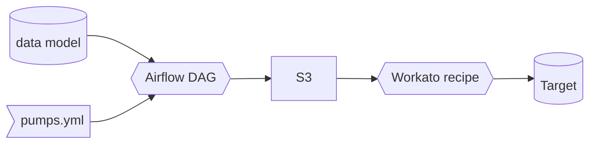

## データプラットフォームのビジョン

これらの抱負は GitLab のデータプラットフォームの指針となるビジョンとして設定されています。

### 貢献しやすくする

GitLab のデータプラットフォームへの貢献は簡単で、プラットフォームの使用は直感的です

* ドキュメントはユーザーと貢献者にとって完全かつ関連性があります
* すべてのデータ変換は dbt で実装されています
* CI/CD は貢献者とレビュアーにとってシームレスで直感的、自動化されています
* データの状態はソースと変換から派生しています
* データパイプラインはべき等性を持ちます

### 信頼性が高い

データプラットフォームとそれが提供するデータは可用性と精度において一貫しています

* すべての破壊的変更は開発環境および/またはステージング環境でテスト可能です
* データ配信プロセスのすべてのステージで自動テストが実装されています
* プラットフォームのすべてのコンポーネントはコードで定義してバージョン管理できます

### セキュアである

データプラットフォームは人々をリスクにさらしません

* データは文書化された承認によって許可された人のみがアクセスできます
* GitLab データチームは認証と認可に関して[最小特権の原則](https://internal.gitlab.com/handbook/security/access-management-standard/#principle-of-least-privilege)に従います

### 保守可能である

* データプラットフォームコンポーネントは[保守容易性](https://en.wikipedia.org/wiki/Maintainability)のための優れたエンジニアリング実践を考慮して作成されます。保守容易性の追跡は、システムの「コードエントロピー」または整合性の劣化に向かう傾向を削減または逆転させるのに役立ちます

### より大きなコミュニティに貢献する

GitLab のデータプラットフォームは GitLab を超えたコミュニティに関連しており、エンジニアのより大きなコミュニティに依存しています

* 関連するプラットフォームコードはオープンソース化されています
* プラットフォームの機能強化はコミュニティプロジェクトに貢献されています
* 私たちは独自のカスタム開発よりも汎用的な仕様と標準を優先します

## 目的

データプラットフォームはデータ分析目的に使用されます。このドキュメントは、データプラットフォームとして定義されるすべてのコンポーネントを概念的に高レベルで説明します。

## スコープ

このドキュメントはデータプラットフォームを概念的に説明することに限定されています。より詳細に説明する他のリソースがあります（例：[データパイプライン](/handbook/enterprise-data/platform/pipelines/)と[インフラ](/handbook/enterprise-data/platform/infrastructure/)）。

## 役割と責任

| 役割 | 責任 |
| ---- | -------------- |
| GitLab チームメンバー | データプラットフォームを形成する標準に注意を払う責任があります |
| データプラットフォームチームメンバー | この標準に基づいてデータユースケースを実装・実行する責任があります |
| データマネジメントチーム | この標準の重要な変更と例外を承認する責任があります |

## 標準

## <i class="fas fa-map-marked-alt fa-fw -text-purple"></i>クイックリンク

* [データイネーブルメント](/handbook/enterprise-data/platform/data-enablement/)
* [データインフラ](/handbook/enterprise-data/platform/infrastructure/)
* [データパイプライン](/handbook/enterprise-data/platform/pipelines/)
* [データ CI ジョブ](/handbook/enterprise-data/platform/ci-jobs/)
* [dbt ガイド](/handbook/enterprise-data/platform/dbt-guide/)
* [エンタープライズデータウェアハウス](/handbook/enterprise-data/platform/edw/)
* [データポンプ](/handbook/enterprise-data/platform/#data-pump)
* [インシデント管理](/handbook/enterprise-data/data-governance/incident-management/)
* [Jupyter ガイド](/handbook/enterprise-data/platform/jupyter-guide/)
* [Permifrost](/handbook/enterprise-data/platform/permifrost/)
* [Python ガイド](/handbook/enterprise-data/platform/python-guide/)
* [Python/ツール パッケージ管理と一覧](/handbook/enterprise-data/platform/python-tool-package-management/)
* [Snowflake](/handbook/enterprise-data/platform/snowflake/)
* [Snowplow](/handbook/enterprise-data/platform/snowplow/)
* [SQL スタイルガイド](/handbook/enterprise-data/platform/sql-style-guide/)
* [Meltano](https://internal.gitlab.com/handbook/enterprise-data/platform/Meltano-Gitlab/)
* [R/RStudio](/handbook/enterprise-data/platform/rstudio/)
* [Tableau](/handbook/enterprise-data/platform/tableau/)
* [エージェントツール開発](/handbook/enterprise-data/platform/agentic-tool-development/)

## <i class="fas fa-cubes fa-fw -text-orange"></i>データスタック


私たちは GitLab を使用して分析機能を運用・管理しています。
すべては Issue から始まります。
変更はマージリクエストを通じて実装されます。パイプライン、抽出、ロード、変換、分析の一部への変更も同様です。

| ステージ           |              ツール             |
| :-------------- | :---------------------------: |
| 抽出      | Stitch、Fivetran、Tableau Prep、カスタムコード |
| ロード         | Stitch、Fivetran、Tableau Prep、カスタムコード |
| オーケストレーション   | Airflow、Tableau Prep |
| データウェアハウス  | Snowflake Enterprise Edition |
| 変換 | dbt と Python スクリプト |
| データビジュアライゼーション | Tableau |
| 高度な分析 | jupyter |

## <i class="fas fa-exchange-alt fa-fw -text-purple"></i>抽出とロード

私たちは現在、いくつかのデータソースに [Stitch](https://www.stitchdata.com) と [Fivetran](https://www.fivetran.com/) を使用しています。これらはデータソースから Snowflake データウェアハウスへのデータ移動の構築、維持、オーケストレーションの責任を取り除く既製の ELT ツールです。

Stitch と Fivetran はデータパイプラインの開始を自分自身で処理します。つまり、Airflow は Stitch および Fivetran スケジュールのオーケストレーションには関与しません。

データ抽出に使用するその他のソリューション：

1. [Meltano](https://internal.gitlab.com/handbook/enterprise-data/platform/Meltano-Gitlab/)
1. [Python](/handbook/enterprise-data/platform/python-guide/) で構築され、[Airflow](/handbook/enterprise-data/platform/infrastructure/) 経由でオーケストレーションされるカスタムパイプライン
1. Tableau Prep で構築されて Tableau Cloud によってオーケストレーションされるフロー
1. Snowflake の[データシェア](https://docs.snowflake.com/en/user-guide/data-sharing-intro)

ソースの所有権については、[テックスタックアプリケーションのデータファイル](https://gitlab.com/gitlab-com/www-gitlab-com/-/blob/master/data/tech_stack.yml)を参照してください。

### データソース

以下のテーブルは、外部の場所からデータウェアハウスにロードしているすべての RAW データソースのインデックスです。開発バックログと優先順位は[新規データソース/パイプラインプロジェクト管理](https://docs.google.com/spreadsheets/d/14uqsAIqRnyyL9Ta39QYwheXnf0k86yTTIKhrkY_1el8/edit#gid=0)シートで管理しており、最新のステータスと進捗管理のために GitLab Issue へのリンクがあります。[新規データソースのハンドブック](/handbook/enterprise-data/how-we-work/new-data-source/)ページでは、データチームが新規データソースのリクエストをどのように処理するかを説明しています。

**以下のテーブルのパイプライン列のリンクは、該当する場合に特定のデータパイプラインの詳細ページに移動します。**

**キー**

* パイプライン：データを複製するために使用する技術。
* RF（レプリケーション頻度）：新しいデータと更新されたデータをどのくらいの頻度でロードするか。
* Raw スキーマ：データが保存される `RAW` データベースのスキーマ。
* Prep スキーマ：[ソースモデル](/handbook/enterprise-data/platform/dbt-guide/#source-models)がマテリアライズされる `PREP` データベースのスキーマ。
* 対象者：データの主要ユーザー。
* SLO：サービスレベル目標。SLO はリアルタイムとデータが消費可能になるまでの間の時間です。
  * 技術的には、これはアップストリームシステムにエントリが作成されてから Snowflake の `PROD` レイヤー（dbt での変換を含む）でデータが利用可能になるまでの時間を意味します。
`x` は未定義または非実行を示します

{}
<!-- Add or edit data sources in https://gitlab.com/gitlab-com/www-gitlab-com/-/blob/master/data/data_warehouse_sources.yml -->

#### ソース連絡先

外部エラーが発生した場合の連絡先については、[ソース連絡先スプレッドシート](https://docs.google.com/spreadsheets/d/1VKvqyn7wy6HqpWS9T3MdPnE6qbfH2kGPQDFg2qPcp6U/edit)を参照してください。

#### ティア定義

| 観点 | ティア 1 | ティア 2  | ティア 3 |
|:-|:-|:-|:-|
| **説明**  | - 最も重要でビジネスクリティカルな信頼できるデータソリューション。<br><br> - 日々の運用を確保するためにコンポーネントが利用可能でリフレッシュされる必要があります | - インサイト収集にとって重要で有益なデータソリューション。<br><br> - 日々の運用をサポートするためにコンポーネントが利用可能でリフレッシュされるべきです | - アドホック、定期的、または一度限りの分析にとって重要なデータソリューション。<br><br> - コンポーネントが利用不可またはデータがリフレッシュされない可能性があります。 |
|**基準**|- 24 時間利用不可の場合に $100k 以上のビジネス影響をもたらすデータ、プロセス、または関連サービス<br><br>- 15 人以上のビジネスユーザーに影響 | - 24 時間利用不可の場合に $100k 未満のビジネス影響をもたらすデータ、プロセス、または関連サービス<br><br>- 5〜15 人のビジネスユーザーに影響 | - 5 営業日以上利用不可の場合に直接的なビジネス影響をもたらさないデータ、プロセス、または関連サービス<br><br>- 5 人未満のビジネスユーザーに影響 |
|**停止による影響**|深刻|軽微|無視できる |
| **監視と観測可能性** | 鮮度とボリュームの異常について Monte Carlo で監視。すべてのアラートは調査され、必要に応じてアップストリーム（システム/データ）オーナーにエスカレーションされます。 | 技術的に Monte Carlo で鮮度について監視 - データパイプラインの継続性。アラート発生時に技術的な障害が調査されます。 | 技術的に Monte Carlo で鮮度について監視 - データパイプラインの継続性。アラート発生時に技術的な障害が調査されます。  |

**監視とroot cause調査に関する注意：** トリアージ担当者はデータコンテキスト（種類、量、履歴パターン）を評価して、アップストリーム（システム/データ）オーナーへの調査やエスカレーションが必要かどうかを判断する必要があります。チームメンバーはデータのコンテキストを考慮する必要があります。以下は規定的なものではありませんが、緩やかに従われているパラダイム（/例、他も適用）として示します：データソースが 1 日に 100 万件のレコードを受け取っていたが、パイプラインは実行中なのに突然データを受け取らなくなった場合、これはデータパイプラインに必ずしも関連しない可能性のあるアップストリームの問題を示すため、調査が必要です。ただし、データソースが 1 日に 10 件のレコードを受け取っていたが、特定の日（例：1 月 1 日）に 2 件に減った場合、これは履歴パターンに基づく予想される動作である可能性があるため、調査は不要かもしれません。

### データソースへのデータチームのアクセス

新しいデータソースをデータウェアハウスに統合するために、データチームの特定のメンバーは UI と API の両方でデータソースへの管理者レベルのアクセスが必要です。
適切な分析を構築するために必要なすべてのデータを取得するためには API 経由での管理者レベルのアクセスが必要であり、準備された分析の結果を UI と比較するためには UI 経由のアクセスが必要です。

機密性の高いデータソースは、最低限 1 人のデータエンジニアと 1 人のデータアナリストがアクセスして必要なレポーティングを構築できる範囲に制限できます。
場合によっては、2 人のデータエンジニアのみの場合もあります。
自動抽出プロセス用に追加のアカウントをリクエストする可能性が高いです。

機密データは以下のセキュリティパラダイムを通じてロックダウンされます：

### データソース概要

* [Customer Success ダッシュボード](https://drive.google.com/open?id=1FsgvELNmQ0ADEC1hFEKhWNA1OnH-INOJ)
* [Netsuite](https://www.youtube.com/watch?v=u2329sQrWDY)
  * [Netsuite とキャンペーンデータ](https://drive.google.com/open?id=1KUMa8zICI9_jQDqdyN7mGSWSLdw97h5-)
* [バージョン（Ping）](https://drive.google.com/file/d/1S8lNyMdC3oXfCdWhY69Lx-tUVdL9SPFe/view)
  * 2019 年 10 月まで、データチームは**バージョン**データソース全体を「Ping」と呼んでいました。ただし、使用 Ping はバージョンデータソースの 1 つのサブセットに過ぎないため、現在は version.gitlab.com の*データソース*を「バージョン」または「バージョンアプリ」と呼び、バージョンデータソースの[特定の使用データ機能](https://docs.gitlab.com/ee/administration/settings/usage_statistics.html)を「使用データ」または「使用 Ping」または「Ping」と呼んでいます。データ抽出のコンテキストでは、`Service ping` データ取り込みに関しては、[Service ping](https://internal.gitlab.com/handbook/enterprise-data/platform/pipelines/#service-ping) ページまたは Service ping の [Readme.md](https://gitlab.com/gitlab-data/analytics/-/blob/master/extract/saas_usage_ping/README.md) ページに具体的な詳細があります
* [Salesforce](https://youtu.be/KwG3ylzWWWo)
* [Zendesk](https://drive.google.com/open?id=1oExE1ZM5IkXcq1hJIPouxlXSiafhRRua)

### Snowplow インフラ

セットアップの詳細については [Snowplow インフラページ](/handbook/enterprise-data/platform/snowplow)を参照してください。

## <i class="fas fa-robot fa-fw -text-blue"></i>AI

私たちは AI を使用してデータプロダクトを開発し、データプロダクトに AI を使用しています。

### AI を使用したデータプロダクト開発

GitLab Duo エージェントプラットフォーム（詳細は[社内ハンドブックページ](https://internal.gitlab.com/handbook/enterprise-data/platform/ai_to_data/gitlab_duo_snowflake_mcp/)を参照）、Tableau データソース、Claude を Model Context Protocol（MCP）接続を介して Snowflake データウェアハウスに接続することで、AI を活用して開発ワークフローを加速し、データプロダクトの品質を向上させています。

### AI プロダクトの構築

AI プロダクト開発は 2 つの主要分野に分類されます：

#### 1. Snowflake Cortex AI

データプラットフォーム内でデータウェアハウス直接のネイティブ AI 機能のために [Snowflake Cortex AI](https://www.snowflake.com/en/product/features/cortex/) を活用しています。実装ガイダンスとベストプラクティスについては、[AI to Data に関する社内ハンドブックページ](https://internal.gitlab.com/handbook/enterprise-data/platform/ai_to_data/)を参照してください。

#### 2. フェデレーテッド AI ツール

以下のフェデレーテッド AI ツールを実装しています：

1. **[Weaviate](https://weaviate.io/)**：データの高次元ベクター表現を保存・クエリすることでセマンティック検索と AI によるデータ取得を可能にするベクターデータベース
2. **外部 AI 統合**：データプロダクト全体で高度な AI 機能を有効にするために、外部の大規模言語モデル（LLM）をベクターデータベースインフラに接続します

## <i class="fas fa-clock fa-fw -text-orange"></i>オーケストレーション

私たちはオーケストレーションに Kubernetes 上の Airflow を使用しています。具体的なセットアップ/実装は[こちら](https://gitlab.com/gitlab-data/data-image)で確認できます。また、[データインフラ](/handbook/enterprise-data/platform/infrastructure/)ページも参照してください。

## <i class="fas fa-database fa-fw -text-purple"></i>データウェアハウス

私たちは現在、データウェアハウスとして [Snowflake](https://docs.snowflake.net/manuals/index.html) を使用しています。エンタープライズデータウェアハウス（EDW）は GitLab の企業データ、パフォーマンス分析、KPI などの企業全体データの唯一の真実のソースです。EDW はすべてのチームにレポーティング、ダッシュボード、分析のための共通プラットフォームとフレームワークを提供することで、GitLab のデータドリブンなイニシアチブをサポートします。ポイントツーポイントのアプリケーション統合を除いて、すべての現在および将来のデータプロジェクトは EDW から推進されます。さまざまな GitLab ソースシステムからのデータの受信者として、EDW はすべての決定が可能な限り最良のデータを使用してなされることを確保するために、データ品質のベストプラクティス、測定、是正を通知・推進するのに役立ちます。

### Snowplow カラムの更新

#### Snowplow の地理カラムの null 化

**Issue**: [**Snowflake ドキュメント**](https://docs.snowflake.com/en/user-guide/data-load-snowpipe-ts#unable-to-reload-modified-data-modified-data-loaded-unintentionally)

Snowplow に地理データを抽出しないために、以下のカラムが null 化されました：

* `geo_zipcode`
* `geo_latitude`
* `geo_longitude`
* `user_ipaddress`

この null 化は `2023-02-01` から Snowplow に適用されており、ファイルは同じ構造を持ちますが、カラムの値は `NULL` に設定されています。データチームは古いファイルを更新して上記のカラムを `NULL` に設定し、Snowflake のカラムも `NULL` に設定しました。これは Snowflake の `RAW`、`PREP`、`PROD` レイヤーに適用されます。

[**Snowflake ドキュメント**](https://docs.snowflake.com/en/user-guide/data-load-snowpipe-ts#unable-to-reload-modified-data-modified-data-loaded-unintentionally)に従って `S3` バケット内の更新されたファイルの重複ロードを避けるために、フォルダー構造が次のように変更されました：

```bash
- gitlab-com-snowplow-events/
    output/ <---- すべてのファイルがここにある
        2019/01/01
        ...
        (現在)
```

から新しい構造へ：

```bash
- gitlab-com-snowplow-events/
    output_nullified_columns/ <---- すべてのファイルが null 化・更新済み
        2019/01/01
        ...
        2023/01/31
    output/ <---- 新しいファイルがここに着地し Snowpipe によってロードされる
        2023/02/01
        ...
        (現在)
```

#### Snowplow の `page_url_path` カラムの null 化

**Issue**: [s3: Snowflake と s3 バケットで page_url_path を仮名化する](https://gitlab.com/gitlab-data/analytics/-/issues/22351)

Snowplow のデータに準拠するために、以下のカラムが仮名化されました：

* `page_url_path`

この仮名化は `2022-10-26` - `2024-12-01` の期間の `Snowplow` データに適用されており、ファイルは同じ構造を持ちますが、カラムの値は仮名化されています。
データチームは古いファイルを更新して `page_url_path` カラムを仮名化し、Snowflake の `page_url_path` カラムも仮名化しました。
これは Snowflake の `RAW`、`PREP`、`PROD` レイヤーに適用されます。

[s3: Snowflake と s3 バケットで page_url_path を仮名化する](https://gitlab.com/gitlab-data/analytics/-/issues/22351)に従って `S3` バケット内の更新されたファイルの重複ロードを避けるために、フォルダー構造が次のように変更されました：

```bash
- gitlab-com-snowplow-events/
    output_nullified_columns/ <---- すべてのファイルが null 化・更新済み（前のイテレーションで）
        2022/10/26
        ...
        2023/
            02/
    output/
        2023/
            02/
            03/
```

から新しい構造へ：

```bash
- gitlab-com-snowplow-events/
    output_nullified_columns/
        2019/01/01
        ...
        2022/10/25
    output_mask_page_url_path/ <---- すべてのファイルが仮名化済み
        2022/10/26
        ...
        2023/12/01
    output/ <---- 新しいファイルがここに着地し Snowpipe によってロードされる
        2023/12/02
        ...
        (現在)
```

> **注意：** `S3` バケット内のすべての新しいロードは以前と同じフォルダー `gitlab-com-snowplow-events/output` に入ります。

### Snowflake サポートポータルへのアクセス

**前提条件：**

* チームメンバーは Snowflake で確認済みのメールアドレスを持っている必要があります
* メールの確認は Snowsight の Settings → My Profile から完了できます

**アクセスオプション：**

サポートポータルアクセスには 3 つの権限レベルがあります：

* `MANAGE ORGANIZATION SUPPORT CASES` - 組織全体のすべてのサポートケースを表示・管理する
* `MANAGE ACCOUNT SUPPORT CASES` - アカウントのすべてのサポートケースを表示・管理する
* `MANAGE USER SUPPORT CASES` - ユーザー自身が開いたケースを表示・管理する

**アクセスポリシー：**

個別のリクエストには常に MANAGE USER SUPPORT CASES から始めてください。より高いアクセスレベル（MANAGE ACCOUNT または MANAGE ORGANIZATION SUPPORT CASES）は、個別レベルのアクセスでは不十分な理由を示すビジネス上の正当化が必要です。

**アクセスの付与：**

`ACCOUNTADMIN` のみが MANAGE ACCOUNT SUPPORT CASES または MANAGE USER SUPPORT CASES 権限を付与できます。
`ORGADMIN` のみが MANAGE ORGANIZATION SUPPORT CASES 権限を付与できます。

適切な GRANT ステートメントを実行します：

-- MANAGE USER SUPPORT CASES

```SQL
USE ROLE ACCOUNTADMIN;
GRANT MANAGE USER SUPPORT CASES ON ACCOUNT TO ROLE <role_name>;
```

-- MANAGE ACCOUNT SUPPORT CASES

```SQL
USE ROLE ACCOUNTADMIN;
GRANT MANAGE ACCOUNT SUPPORT CASES ON ACCOUNT TO ROLE <role_name>;
```

-- MANAGE ORGANIZATION SUPPORT CASES

```SQL
USE ORGADMIN;
GRANT MANAGE ORGANIZATION SUPPORT CASES ON ACCOUNT TO ROLE <role_name>;
```

<role_name> :- これは個別のロールです。Okta 経由の Snowflake ユーザーにはユーザーロールがありません。

**初回アクセス：**
初めてサポートにアクセスするとき、ユーザーは Snowsight で「サポートを有効にする」を選択する必要があります。

Snowflake サポートポータルへのアクセスを取得するには、以下の手順に従ってください。

* [Snowsight](https://docs.snowflake.com/en/user-guide/ui-snowsight) インスタンスで、アカウント（左下隅）を開いて「サポート」オプションに移動します


* パネルで、すでに開いているケースを確認できます


* 右上隅で、新しいケースを開くには `+ Support Case` ボタンを押します
* 問題を説明するデータを入力すると、Snowflake チームが対応します


* ケースの更新ごとに、メールで通知されます

### ウェアハウスアクセス

Snowflake へのアクセスを取得するには：

デフォルトの `snowflake_analyst` ロールへのアクセスを付与されるために、[Lumos アクセスリクエスト](/handbook/security/corporate/systems/lumos/ar/)を利用してください。`PROD` データベースをクエリするためのアクセスを持つ新しいユーザーが作成されます。
デフォルトのデータアクセスには 2 つのレベルがあります：

* 一般データ --> Lumos がアカウントに Snowflake の `snowflake_analyst` ロールを追加します。
* SAFE データ（指定インサイダーであるか、なる予定がある場合）--> Lumos がアカウントに Snowflake の `snowflake_analyst_safe` を追加します。必要な承認については [SAFE ガイド](/handbook/enterprise-data/platform/safe-data/#snowflake)を参照してください。

すべてのユーザーは `dev_xs` ウェアハウスへの標準アクセスを持ちます。ウェアハウスはユーザーロールレベルでプロビジョニングされ、より細かいウェアハウス割り当てが可能です。このアプローチにより、GitLab チームメンバーに適切なウェアハウスサイズを割り当てることでリソース配分とコスト管理を最適化できます。より大きいサイズのウェアハウスは通常のアクセスリクエストプロセスを介してリクエストできます。

Snowflake は SQL コードを書いて利用可能なデータの分析を実行するために使用できます。作成されたものや分析の結果はすべて[アドホック分析](/handbook/enterprise-data/how-we-work/data-development/#data-development-at-gitlab)とみなされます。作成されたもの（ワークシートやダッシュボードなど）はバージョン管理されておらず、中央データチームによってサポートまたは管理されていないことを知っておくことが重要です。つまり、チームメンバーが GitLab からオフボードした場合、ワークシートとダッシュボードにはアクセスできなくなります。分析を永続させるために、チームメンバーは Tableau ワークブックを構築したり、GitLab プロジェクトにコードスニペットを保存したり、データチームの [dbt プロジェクト](https://gitlab.com/gitlab-data/analytics/-/tree/master/transform/snowflake-dbt)にコードをコミットしたりできます。

## 追加アクセス

Lumos と Okta 経由の SCIM の実装前に Snowflake でユーザーが作成された場合、または dbt プロジェクトへの貢献に必要な開発データベースの作成を含む、デフォルトの `snowflake_analyst` と `snowflake_analyst_safe` を超えるアクセスが必要な場合は、必要なアクセスレベルを文書化した[アクセスリクエスト](https://gitlab.com/gitlab-com/team-member-epics/access-requests)を使用してください。

### 追加アクセスのプロビジョニング

ユーザーが標準の `snowflake_analyst` または `snowflake_analyst_safe` ロールを超えた `analyst_core` ロールなどのロールを必要とする場合は、Permifrost を経由する必要があり、[`roles.yml`](https://gitlab.com/gitlab-data/snowflake-permissions/-/blob/main/roles.yml) を更新する必要があります。Permifrost の使用方法については、[Snowflake 権限パラダイム](/handbook/enterprise-data/platform/#snowflake-permissions-paradigm)を参照してください。

<details><summary>手順</summary>

**ステップ 1：現在のアクセス状態を確認：**

[`roles.yml`](https://gitlab.com/gitlab-data/snowflake-permissions/-/blob/main/roles.yml) でユーザー名を検索して、ユーザーがすでに Permifrost 経由でプロビジョニングされているかどうかを確認します。
ユーザー名が `roles.yml` に存在しない場合は、おそらく Snowflake でロールとユーザーを作成する必要があります。

この状態は、ユーザーと Snowflake のユーザーロールが存在する場合にその行を返す以下のクエリを使用して Snowflake で確認できます。

```sql
SET username = 'username';
SELECT
 'user' AS record,
 name, created_on,deleted_on,
 disabled, owner
FROM SNOWFLAKE.ACCOUNT_USAGE.users
 WHERE LOWER(name) IN ($username)
UNION
SELECT
  'role' AS record,
  name, created_on, deleted_on,
  null AS disabled, owner
FROM SNOWFLAKE.ACCOUNT_USAGE.ROLES
WHERE LOWER(name) IN ($username);
```

**ステップ 2：ユーザーの現在の状態に基づいて対応：**

* ***状態：* ユーザーがすでに `roles.yml` に存在する：**
  * [Snowflake 権限パラダイム](/handbook/enterprise-data/platform/#snowflake-permissions-paradigm)に従って、必要な追加ロールおよび/または権限で [`roles.yml`](https://gitlab.com/gitlab-data/snowflake-permissions/-/blob/main/roles.yml) を更新します
* ***状態：* ユーザーが Snowflake に存在するが、`roles.yml` 用の[ユーザーロール](/handbook/enterprise-data/platform/#user-roles)を作成する必要がある：**
  * [snowflake-infrastructure/infra/roles.tf](https://gitlab.com/gitlab-data/snowflake-infrastructure/-/blob/main/infra/roles.tf) にユーザーロールを追加します
  * [Snowflake 権限パラダイム](/handbook/enterprise-data/platform/#snowflake-permissions-paradigm)に従って、必要な追加ロールおよび/または権限で [`roles.yml`](https://gitlab.com/gitlab-data/snowflake-permissions/-/blob/main/roles.yml) を更新します
* ***状態：* ユーザーが Snowflake に存在しない：**
  * Snowflake にユーザーを作成します
    * CI ジョブ `👥 users_snowflake_provisioning_snowflake` 経由で
  * [Snowflake 権限パラダイム](/handbook/enterprise-data/platform/#snowflake-permissions-paradigm)に従って、必要な追加ロールおよび/または権限で [`roles.yml`](https://gitlab.com/gitlab-data/snowflake-permissions/-/blob/main/roles.yml) を更新します

</details>

### 追加アクセスのリマインダー

* [このブログ記事](https://www.getdbt.com/blog/how-we-configure-snowflake)で説明されているユーザー権限のパラダイムを大まかに踏襲しています。
* 既存のアカウントをミラーリングするよう依頼する場合、制限された SAFE データへのアクセスはプロビジョニング/ミラーリングされません（現在 `restricted_safe` ロール経由で提供されています）。
* Snowflake は[アクセスレビュー手順](/handbook/security/security-assurance/security-compliance/access-reviews/)の対象であり、マネージャーは四半期ごとにチームメンバーが Snowflake で持つアクセスのレビューを求められます。AR を承認する場合やチームメンバーのアクセスをレビューする場合、マネージャーは Snowflake の利用可能なロール（構造）を理解することが期待されます。
  * アクセスレビューでは、Snowflake ロールの第 1 レベルのみが報告されます（ユーザーに直接アタッチされているもの）。つまり、チームメンバーが `analyst_marketing` ロールを持っている場合、`analyst_marketing` のみが報告され、`analyst_marketing` に継承されたすべてのロールは報告されません。
    * ロールは機能ロールとオブジェクトロールで区別できます（以下の権限パラダイムを参照）
      * Snowflake の機能ロールとオブジェクトロールのリストを参照してください。
      * オブジェクトロールはシステムに直接関連しており、チームメンバーがそれらのアップストリームソースシステムから抽出するすべてのデータへのアクセスを付与します。
      * ロールに含まれる詳細については、[`roles.yml` ファイル](https://gitlab.com/gitlab-data/snowflake-permissions/-/blob/main/roles.yml)を確認してください。
      * 不明な場合は、AR プロセスやアクセスレビュー中に特定のロールが何を意味するかを詳しく理解するためにデータプラットフォームチームメンバーに連絡してください。

### 過去のプロビジョニング手順

何らかの理由でユーザーを Okta と Lumos の外部でプロビジョニングする必要がある場合、過去には以下のプロセスを使用していました：

{}
* GitLab データチームプロジェクトに、`Provisioning` ラベルが適用された元のアクセスリクエストにリンクする Issue があることを確認します
* Snowflake にログインして `securityadmin` ロールに切り替えます
  * すべてのロールは `securityadmin` の所有下に置かれるべきです
* [`user_provision.sql`](https://gitlab.com/gitlab-data/snowflake-permissions/-/blob/main/snowflake_provisioning_automation/provision_users/sql_templates/provision_user.sql?ref_type=heads) スクリプトをコピーして、初期ブロックのメール、名、姓の値を置き換えます
* Snowflake の [roles.yml](https://gitlab.com/gitlab-data/analytics/-/blob/master/permissions/snowflake/roles.yml) Permifrost 設定ファイルに文書化します（このファイルは毎日 UTC 午前 12:00 に自動的にロードされます）
  * 作成したユーザーとユーザーロールを追加します
  * ユーザーロールを新しいユーザーに割り当てます
  * 追加のロールをユーザーに割り当てます
* ユーザーが Okta のアプリケーションに割り当てられていることを確認します
* ユーザーが `okta-snowflake-users` [Google グループ](https://groups.google.com/my-groups)に割り当てられていることを確認します
{}

最後に、Okta で管理されていないか、デフォルト以上の権限が付与されている既存のユーザーをデプロビジョニングするための適切な手順：

* Snowflake のデプロビジョニングは、オフボーディング Issue またはアクセスリクエスト Issue を通じて行う必要があります。
* GitLab データチームプロジェクトに、`Deprovisioning` ラベルが適用された元のソースリクエストにリンクする Issue があることを確認します。
* Snowflake にログインして `securityadmin` ロールに切り替えます
  * すべてのロールは `securityadmin` の所有下に置かれるべきです。
* [`user_deprovision.sql`](https://gitlab.com/gitlab-data/snowflake-permissions/-/blob/main/snowflake_provisioning_automation/provision_users/sql_templates/deprovision_user.sql?ref_type=heads) スクリプトをコピーして USER_NAME を置き換えます。ユーザーを削除せずに Snowflake に残して disabled = TRUE を設定する理由は、ユーザーがいつアクセスを失ったかの記録を保持するためです。
* [Google グループ](https://groups.google.com/my-groups)からユーザーを `okta-snowflake-users` から削除します
* Snowflake の [roles.yml](https://gitlab.com/gitlab-data/analytics/-/blob/master/permissions/snowflake/roles.yml) Permifrost 設定ファイルからユーザーレコードを削除します（このファイルは毎日 UTC 午前 12:00 に自動的にロードされます）

詳細については、この[記録されたペアリングセッション](https://youtu.be/-vpH0aSeO9c)を視聴してください（GitLab Unfiltered として視聴する必要があります）。

### システムアカウント

システムアカウントは、個別に保存・設定されるトークンキーを除き、[Snowflake Terraform プロジェクト](https://gitlab.com/gitlab-data/snowflake-infrastructure/)のコードを通じて完全に作成・管理されます。

サービスユーザー（人間の介入なしに Snowflake と対話するサービスまたはアプリケーション）は、個別に保存・設定されるトークンキーを除き、[Snowflake Terraform プロジェクト](https://gitlab.com/gitlab-data/snowflake-infrastructure/)のコードを通じて完全に作成・管理されます。

1. サービスユーザーは Terraform コードを通じて作成されます
2. サービスユーザーロール（標準はユーザーと同じ）は Terraform コードを通じて作成されます
3. ネットワークセキュリティポリシーが作成され、対応する IP が Terraform コードで設定されます
4. トークンキーは別途作成、保存、設定されます。以下のハンドブックを参照してください：

* キーペア認証 -> *ランブックが利用可能になったらリンクが追加されます*
* 個人アクセストークン（PAT）-> *ランブックが利用可能になったらリンクが追加されます*

### Snowflake 権限パラダイム

Snowflake の権限管理を支援するために [Permifrost](https://gitlab.com/gitlab-data/permifrost/) を使用しています。
Snowflake インスタンスの設定ファイルは[この roles.yml ファイル](https://gitlab.com/gitlab-data/analytics/blob/master/permissions/snowflake/roles.yml)に保存されています。
[Permifrost のハンドブックページ](/handbook/enterprise-data/platform/permifrost/)も利用可能です。

ロール管理には以下の一般的な戦略に従っています：

* すべてのユーザーには関連するユーザーロールがあります
* 機能ロールは一般的な権限セットを表します（`analyst_finance`、`data_manager`、`product_manager`）
* データの論理グループには独自のオブジェクトロールがあります
* オブジェクトロールは主に機能ロールに割り当てられます
* より高い権限ロール（`accountadmin`、`securityadmin`、`useradmin`、`sysadmin`）はユーザーに直接割り当てられます
* サービスアカウントには同じ名前のロールがあります
* 追加のロールは使用状況とニーズに応じて、サービスアカウントロールまたはサービスアカウント自体に割り当てられます
* 個別の権限はテーブルとビューの粒度で付与できます
* ウェアハウスの使用は必要に応じてロールに付与できますが、機能ロールへの付与が推奨されます

#### ユーザーロール

すべてのユーザーはユーザー名と一致するユーザーロールを持ちます。
Snowflake のオブジェクトレベルの権限（データベース、スキーマ、テーブル）はロールにのみ付与できます。
ロールはユーザーまたは他のロールに付与できます。
ユーザーがデータベースと対話するために 1 つのロールのみを使用するように、すべての権限がユーザーロールを通じて流れるよう努めています。
例外は `accountadmin`、`securityadmin`、`useradmin`、`sysadmin` などの特権ロールです。
これらのロールはより高いアクセスを付与するため、使用時には意図的に選択する必要があります。

#### 機能ロール

機能ロールは、通常ジョブファミリーにマップする権限とロール付与のグループを表します。
主な例外はアナリストロールです。
アナリストロールには組織の異なる分野にマップする複数のバリアントがあります。
`analyst_core`、`analyst_finance`、`analyst_people` などが含まれます。
アナリストは関連するロールに割り当てられ、必要なスキーマへのアクセスが明示的に付与されます。

機能ロールはいつでも作成できます。
非常によく似たジョブファミリーと権限を持つ複数の人がいる場合に最も意味があります。

##### 機能ロールの割り当て

この機能ロールのリストは、ロールに含まれる内容の概要を示しています。不足している場合や詳細を知りたい場合は、この YAML [ファイル](https://gitlab.com/gitlab-data/snowflake-permissions/-/blob/main/roles.yml)を確認してください。

| 機能ロール | 説明 | SAFE データ Y/N |
| --- | --- | --- |
| `data_team_analyst` | すべての `PROD` データ、機密マーケティングデータ、データプラットフォームのメタデータ、および一部のソースへのアクセス。 | Yes |
| `analyst_core` | すべての `PROD` データとデータプラットフォームのメタデータへのアクセス | No |
| `analyst_engineering` | すべての `PROD` データ、データプラットフォームのメタデータ、およびエンジニアリング関連データソースへのアクセス。 | Yes |
| `analyst_growth` | すべての `PROD` データ、データプラットフォームのメタデータ、およびさまざまなデータソースへのアクセス。 | Yes |
| `analyst_finance` | すべての `PROD` データ、データプラットフォームのメタデータ、および財務関連データソースへのアクセス。 | Yes |
| `analyst_marketing` | すべての `PROD` データ、データプラットフォームのメタデータ、およびマーケティング関連データソースへのアクセス。 | Yes |
| `analyst_people` | すべての `PROD` データ、データプラットフォームのメタデータ、および機密の人事データを含むさまざまな関連データソースへのアクセス。 | Yes |
| `analyst_sales` | すべての `PROD` データ、データプラットフォームのメタデータ、およびさまざまな関連データソースへのアクセス | Yes |
| `analyst_support` | `PROD` データ、データプラットフォームのメタデータ、機密 Zendesk データを含む `raw` / `prep` Zendesk データへのアクセス | No |
| `analytics_engineer_core` | 一部の追加を持つ `analyst_core`、`data_team_analyst` ロールの組み合わせ | Yes |
| `data_manager` | Snowflake データへの拡張アクセス  | Yes |
| `engineer` | Snowflake でのデータ操作タスクを実行するための Snowflake データへの拡張アクセス | Yes |
| `snowflake_analyst` | Snowflake の `PROD` データ、EDM スキーマ、ワークスペースへのアクセス | No |
| `snowflake_analyst_safe` | SAFE データを含む Snowflake の `PROD` データ、EDM スキーマ、ワークスペースへのアクセス | Yes |
| `sensitive_pii_data_viewer` | 人物とコンタクトのデータマスタリーモデルのすべての機密フィールドへのアクセス。 | No |

#### オブジェクトロール

オブジェクトロールはデータのセットへのアクセスを管理します。
通常、これらは特定のソースのすべてのデータを表します。
`zuora` オブジェクトロールがその例です。
このロールは Stitch から来る生の Zuora データと、`prep.zuora` スキーマのソースモデルへのアクセスを付与します。
ユーザーが Zuora データへのアクセスを必要とする場合、ユーザーのユーザーロールに `zuora` ロールを付与するのが最も簡単な解決策です。
何らかの理由でオブジェクトロールへのアクセスが意味をなさない場合は、テーブルの粒度で個別の権限を付与できます。

#### マスキングロール

マスキングロールはユーザーがマスクされたデータとどのように対話するかを管理します。マスキングはカラムレベルで適用され、どのカラムがマスクされるかはソースシステムオーナーの判断です。マスキングはデータオブジェクトが dbt を通じて作成されるときに dbt コードベース内の `schema.yml` ファイルのカラムに適用されます。一部のユーザーはマスクされていないデータへのアクセスが必要なため、マスキングロールにより機能またはオブジェクトロールレベルでマスクされていないデータへの権限を付与できます。たとえば、`people_data_masking` のマスキングロールが `locality` カラムに適用される場合、`analyst_people` の機能ロールを `people_data_masking` ロールのメンバーとして設定することで、アナリストがマスクされていない人事データを確認できます。

マスキングポリシーが作成されると、マスキングロールに基づいて作成されます。1 つのカラムには 1 つのマスキングポリシーのみ適用できます。

#### 例

データアナリスト（コア）のロール階層の例：


データエンジニアとアカウント管理者のロール階層の例：


セキュリティオペレーションエンジニアのロール階層の例：


## Snowflake CI ジョブ

FY25-Q1 では、上記の `Snowflake のロール管理` プロセスの半自動化に向けて取り組んでいます。[OKR エピック](https://gitlab.com/groups/gitlab-data/-/epics/1128)。

この変更の主な動機は、エンジニアリングチームによるアクセスの増加が予想されており、複数のメンバーを一度にプロビジョニングできるプロセスが必要だったことです。さらに、これにより**すべての GitLab チームメンバー**がデータプラットフォームチームのサポートを最小限に抑えて Snowflake ユーザーを自分で作成できるようになります。これによりプロビジョニングプロセスが加速し、GitLab チームメンバーが Snowflake へのアクセスを取得できるまでの時間が短縮されます。

すべての GitLab チームメンバーは、Snowflake へのアクセスが必要な場合にこの[ランブック](https://gitlab.com/gitlab-data/runbooks/-/blob/main/snowflake_provisioning_automation/snowflake_provisioning_automation.md)に従って MR を開くことをお勧めします。

プロセスの概要：

1. アクセスリクエストを開き、承認を得ます
1. MR を開きます
1. CI パイプラインを実行します
1. データプラットフォームチームのコードオーナーによるレビュー。

残りのセクションでは自動化されたプロセスをより詳細に説明します。

自動化されたメインプロセス：

1. Snowflake プラットフォームからユーザーを作成/削除する
1. Snowflake のロール/ユーザーの権限を更新するために Permifrost が使用する `roles.yml` を更新する

これらのプロセスはどちらも CI ジョブ経由でアクセス可能になり、ユーザーが自己サービスできるようになります。データエンジニアからの MR レビュー/承認のみが必要です。

両方の CI ジョブは共通のパターンに従います。エンドユーザーは [`snowflake_usernames.yml`](https://gitlab.com/gitlab-data/analytics/-/blob/master/permissions/snowflake/snowflake_usernames.yml) ファイル内でユーザーを追加/削除するだけで、CI ジョブはファイルへの変更に基づいて実行されます。

### 1) Snowflake プラットフォームでのユーザー/ロール作成の自動化

Permifrost を実行する前に、Snowflake でユーザー/ロールを最初に作成する必要があります。

`snowflake_provisioning_snowflake_users` CI ジョブにより、ユーザーはこれらのユーザー/ロールを Snowflake で作成できます。

利用可能な引数とデフォルト値については、[CI ジョブページ](/handbook/enterprise-data/platform/ci-jobs/#snowflake_provisioning_snowflake_users)を参照してください。

### 2) roles.yml の自動化

Snowflake でユーザー/ロールが作成されたら、`roles.yml` を更新して望ましい権限を反映させる必要があります。

`snowflake_provisioning_roles_yaml` CI ジョブにより、エンドユーザーは `roles.yml` を望ましい権限で自動的に更新できます。

利用可能な引数とデフォルト値については、[CI ジョブページ](/handbook/enterprise-data/platform/ci-jobs/#snowflake_provisioning_roles_yaml)を参照してください。

さらに、次のセクションでは `snowflake_provisioning_roles_yaml` CI ジョブ内のオプションの**テンプレート化された**引数について詳細を提供します：

<details><summary>オプションのテンプレート化された引数</summary>

#### カスタムテンプレート

これは多くのユーザーがデフォルトとは異なる値を必要とする場合に便利です。1 つのオプションはデフォルト値で実行してから MR を手動で更新することですが、更新するユーザー数によっては、カスタム値テンプレートを渡す方が良い場合があります。

残りのセクションでは 2 つのことを行います：

1. テンプレートの機能を説明する
1. 便宜上、`roles.yml` で現在使用されている一般的な値を表すカスタムテンプレートを提供する

テンプレートの機能を説明するために、例から始めましょう。これはデフォルトの*ロールテンプレート*です：

```json
{
  "{{ username }}": {
    "member_of": [
      "snowflake_analyst"
    ],
    "warehouses": [
      "dev_xs"
    ]
  }
}
```

これは有効な JSON ですが、**テンプレート化**されていることに注意してください。つまり、`{{ username }}` は Jinja テンプレートであり、テンプレートはスクリプト内で後から実際の値にレンダリングされます。

次に、デフォルト値をオーバーライドしたい場合の例です。次のユーザーバッチに `dev_m` ウェアハウスも持たせたい場合はどうなるでしょうか？

CI ジョブ内で、デフォルト値をオーバーライドするためにカスタムテンプレートを渡すことができます：

```plain
ROLES_TEMPLATE: {"{{username}}": {"member_of": ["snowflake_analyst"],"warehouses": ["dev_xs", "dev_m"]}}
```

現在、レンダリングされるテンプレート可能な値は以下のとおりです：

* `{{ username }}`
* `{{ prod_db }}`
* `{{ prep_db }}`
* `{{ prod_schemas }}`
* `{{ prep_schemas }}`
* `{{ prod_tables }}`
* `{{ prep_tables }}`

#### 共通カスタムテンプレート

このセクションでは、コピー/ペーストして使用できる `roles.yml` 内の一般的に使用される値を表すカスタムテンプレート（デフォルト以外の値）を提供します。

* *デフォルト* は、明示的にオーバーライドされない場合に使用されるテンプレートを示します。
* *共通* は、テンプレートがデフォルトで使用されないが、roles.yml 内でまだ一般的に使用されていることを示します

##### データベース

* デフォルト：なし、データベースは追加されません
* 共通：各ユーザーの個人の prep/prod データベースを作成する CI ジョブ引数：

    ```sh
    DATABASES_TEMPLATE: [{"{{ prod_database }}": {"shared": false}}, {"{{ prep_database }}": {"shared": false}}]
    ```

##### ロール

* デフォルト：

    ```sh
    ROLES_TEMPLATE: {"{{ username }}": {"member_of": ["snowflake_analyst"], "warehouses": ["dev_xs"]}}
    ```

* 共通 - データエンジニアのロールを作成する CI ジョブ引数：

    ```sh
    ROLES_TEMPLATE: {"{{ username }}": {"member_of": ["engineer","restricted_safe"],"warehouses": ["dev_xs","dev_m","loading","reporting"],"owns": {"databases": ["{{ prep_database }}","{{ prod_database }}"],"schemas": ["{{ prep_schemas }}","{{ prod_schemas }}"],"tables": ["{{ prep_tables }}","{{ prod_tables }}"]},"privileges": {"databases": {"read": ["{{ prep_database }}","{{ prod_database }}"],"write": ["{{ prep_database }}","{{ prod_database }}"]},"schemas": {"read": ["{{ prep_schemas }}","{{ prod_schema }}"],"write": ["{{ prep_schemas }}","{{ prod_schema }}"]},"tables": {"read": ["{{ prep_tables }}","{{ prod_tables }}"],"write": ["{{ prep_tables }}","{{ prod_tables }}"]}}}}
    ```

##### ユーザー

* デフォルト：

    ```sh
    USERS_TEMPLATE: {"{{ username }}": {"can_login": true, "member_of": ["{{ username }}"]}}
    ```

* 共通：N/A。現在ユーザーに使用している他のテンプレートはありません

</details>

#### roles.yml の自動化：プロジェクトアクセストークン

`snowflake_provisioning_roles_yaml` CI ジョブは `update_roles_yaml.py` を実行し、`roles.yml` ファイルを更新します。

CI ジョブ内の `roles.yml` への変更は、**ブランチ/MR にプッシュバックされます**。

CI パイプライン内からリポジトリにプッシュするには、[プロジェクトアクセストークン](https://docs.gitlab.com/ee/user/project/settings/project_access_tokens.html)（PAT）が必要です。リモートリポジトリへのプッシュについては[こちらの StackOverflow の回答](https://stackoverflow.com/a/73394648)を参照してください。

PAT は `snowflake_provisioning_automation` という名前で、analyticsapi@gitlab.com アカウントを使用して ['GitLab Data Team' プロジェクト](https://gitlab.com/gitlab-data/analytics)で作成されました。

PAT の値は 1Pass に保存され、GitLab ランナーが使用できるように CI 環境変数としても保存されています。

#### snowflake_users.yml - ファイル末尾の問題

`snowflake_users.yml` ファイルにユーザーを追加する場合、特にファイルの末尾に追加する場合、GitLab シングルファイルエディターを使用すると予期しない動作が発生します。詳細は[この Issue](https://gitlab.com/gitlab-data/analytics/-/issues/20730#note_1919902289) をご覧ください。

回避策として、`snowflake_users.yml` の末尾には次のコメントがあります：

```yml
#### do not insert users below this line ####
```

### ローカルテスト

`update_roles_yaml` と `provision_users` の両方は、CI ジョブと比較して高速なテストのためにローカルで実行できます。

**`provision_users` のセットアップ：**

1. 必要な環境変数をエクスポートします：

   ```bash
   export EMAIL_DOMAIN='gitlab.com'
   export PERMISSION_BOT_USER="bot_user_123"
   export PERMISSION_BOT_PASSWORD="random_pass_456"
   export SNOWFLAKE_ACCOUNT="xy12345.us-east-1"
   export PERMISSION_BOT_WAREHOUSE="COMPUTE_WH"
   ```

2. Python テスト実行（Snowflake ユーザー作成なし）：

   ```bash
   python provision_users.py --users-to-add some-user1 user2 --test-run
   ```

### Snowflake ユーザーのデプロビジョニング

非アクティブな Snowflake ユーザーは `snowflake_cleanup` DAG 経由で[この Issue](https://gitlab.com/gitlab-data/analytics/-/issues/20347)で実装された週次でデプロビジョニングされます。

すべてのアクティブな Snowflake ユーザー/ロールは `roles.yml` 内で宣言されています。そのため、Snowflake 内の roles.yml に存在しないユーザーは非アクティブとみなされ、プロセスによってドロップされます。

これらのユーザーは以下の [deprovision_user.sql](https://gitlab.com/gitlab-data/analytics/-/blob/master/orchestration/snowflake_provisioning_automation/provision_users/sql_templates/deprovision_user.sql?ref_type=heads) スクリプトを実行することでドロップされます。

このプロセスはその機密性のため、また時間的な緊急性が低いため、CI ジョブ経由では公開されていません。そのため、代わりに Airflow 経由の週次「クリーンアップ」タスクが実行されます。

#### Snowflake ユーザー/サービスアカウント

`permifrost_bot_user` は Snowflake のプロビジョニングとデプロビジョニングの両プロセスを実行するために使用されます。これには 2 つの理由があります：

1. `permifrost_bot_user` はすでに既存の Permifrost ジョブの実行と同じ権限が必要なため、プロビジョニング/デプロビジョニングを実行するための適切な権限をすでに持っています。
1. `permifrost_bot_user` はすでに Airflow と GitLab CI の両方を使用して既存の Permifrost ジョブを実行しているため、適用された NSP IP アドレスはプロビジョニング（CI で実行）/デプロビジョニング（Airflow で実行）の両方で追加されても冗長になりません。

#### ユーザーロールへの外部テーブルの権限プロビジョニング

Snowflake の外部テーブルへの USAGE 権限のユーザーロールへのプロビジョニングは、現時点では Permifrost によって処理されません。外部テーブルへのアクセスをユーザーロールにプロビジョニングする必要がある場合は、`securityadmin` ロールを使用して Snowflake で GRANT コマンドで手動付与する必要があります ([docs](https://docs.snowflake.com/en/sql-reference/sql/grant-privilege))。これは、外部テーブルが配置されているスキーマと DB へのアクセスがユーザーロールにすでにあることを前提としています。なければ、[roles.yml](https://gitlab.com/gitlab-data/analytics/-/blob/master/permissions/snowflake/roles.yml) に追加してください。

#### ログインと正しいロールの使用

AR を通じて Snowflake への権限を申請してアクセスがプロビジョニングされた場合、変更が有効になるまで UTC 3:00AM まで待つ必要があります。これは Snowflake でアクセスをプロビジョニングするスクリプトが毎日実行されているためです。ログインできるようになったら、Okta 経由でログインできます。Okta 経由でログインした後、アカウントに関連付けられた正しいロールを選択する必要があります。これはデフォルトでアカウントと同じで、`@gitlab.com` を除いたメールアドレスの規則に従います。

Snowflake で正しいロールを選択しないと、以下の Snowflake オブジェクトのみが表示されます：


正しいロールの選択は GUI から行えます。
Snowsight のホームスクリーンで、左上隅にあります。


1. 名前の近くにある矢印をクリックします
2. ロールの切り替えを選択します
3. ロールを選択します

Snowsight のワークシートでは、右上隅にあります。


1. `public` をクリックします
2. ロールを選択します

以下を実行することでデフォルトに設定できます：

`ALTER USER <YOUR_USER_NAME> SET DEFAULT_ROLE = '<YOUR_ROLE>'`

### コンピュートリソース

Snowflake のコンピュートリソースは「ウェアハウス」と呼ばれます。
クレジット消費を効果的に抑えるために、ウェアハウスの数を最小化しようとしています。開発目的（ローカルでの dbt ジョブ実行、MR パイプラインの実行、Snowflake でのクエリ）には `dev_x` ウェアハウスを使用します。ウェアハウスの名前にはサイズが追加されます（`dev_xs` は超小型）。

| ウェアハウス            | 目的                                                                                         | 最大クエリ（分）|
| -------------------- | ----------------------------------------------------------------------------------------------- | ------------------- |
| `admin`              | 権限ボットやその他の管理タスク                                                | 10                  |
| `data_classification` | Snowflake でのデータ分類とラベリングプロセスの実行                 | 60                  |
| `dev_xs/m/l/xl`      | Snowflake UI の使用時と CI パイプラインで使用する開発目的 | 180               |
| `gainsight_xs`       | Gainsight データポンプ                                                            | 30                  |
| `gitlab_postgres`    | GitLab 内部の Postgres データベースからプルする抽出ジョブ                   | 10                  |
| `grafana`            | Grafana 専用                                                          | 60                  |
| `loading`            | 抽出およびロードジョブと新しい Meltano ローダーのテスト                           | 120                 |
| `reporting`          | BI ツールがクエリするため                                                           | 30*                 |
| `transforming_xs`    | 本番 dbt ジョブ                                                               | 180                 |
| `transforming_s`     | 本番 dbt ジョブ                                                               | 180                 |
| `transforming_l`     | 本番 dbt ジョブ                                                               | 240                 |
| `transforming_xl`    | 本番 dbt ジョブ                                                               | 180                 |
| `transforming_2xl`   | Snowplow モデルのリフレッシュ                                                  | 120                 |
| `transforming_4xl`   | Airflow DAG `dbt_full_refresh` 用                                                 | 180                 |
| `usage_ping`         | service_ping と service_ping_backfill のロード                               | 120                 |

クエリの時間制限に達している場合は、最適化のためにクエリを確認してください。開発で性能が悪いクエリは本番でも性能が悪く、毎日影響を与えます。常に適切な（サイズの）ウェアハウスを使用してください。ウェアハウスの使用/選択に関する基本ルール：

* ウェアハウスはTシャツサイズで設定されています。大きなウェアハウスは GitLab のコストが高くなります
* 実行中のウェアハウスの使用を検討してください
  * 一時停止中のウェアハウスを再開すると、初期起動コストが発生します
  * すべてのウェアハウスは設定期間後に停止しますが、アイドル状態（クエリ結果と停止時間の間）でも Snowflake クレジットを消費します
  * 一般的に、同時クエリを実行しても費用は増加しません。

* Snowflake のクエリタイムアウトは `REPORTING` ウェアハウスで 30 分に設定されています。

### データストレージ

私たちは `raw`、`prep`、`prod` の 3 つのプライマリデータベースを使用しています。
`raw` データベースはデータが最初に Snowflake にロードされる場所です。他のデータベースは分析の準備ができている（または準備が進んでいる）データ用です。


{}
`prep` と `prod` のすべてのテーブルとビューは dbt を通じて管理されます（作成、更新）。[毎四半期](/handbook/enterprise-data/data-governance/data-management/#quarterly-data-health-and-security-audit)、データプラットフォームチームは dbt モデルに関連しないテーブルとビューのチェックを実行し、削除します。
{}


以下のスキーマリストは例外として確認されません：

* `SNOWPLOW_%`
* `DOTCOM_USAGE_EVENTS_%`
* `INFORMATION_SCHEMA`
* `BONEYARD`
* `TDF`
* `CONTAINER_REGISTRY`
* `FULL_TABLE_CLONES`
* `QUALTRICS_MAILING_LIST`
* `NETSUITE2_FIVETRAN`

GitLab インスタンス全体に関する情報を含む `snowflake` データベースがあります。
これにはすべてのテーブル、ビュー、クエリ、ユーザーなどが含まれます。

Snowflake データエクスチェンジを通じて管理される共有データベースである `covid19` データベースがあります。

Permifrost をテストするために使用される `testing_db` データベースがあります。

BI ツーリングのテストに使用される `bi_tool_eval` データベースがあります。ユーザーは手動で独自のテストセットを作成できます。

[`roles.yml`](https://gitlab.com/gitlab-data/analytics/-/blob/master/permissions/snowflake/roles.yml) Permifrost ファイルで定義されていないすべてのデータベースは週次で削除されます。

| データベース | Tableau での使用に適しているか |
|:-:|:-:|
| raw | いいえ |
| prep | いいえ |
| prod | はい |

`prod` データベースのみが Tableau で使用されるべきです。このデータはビジネス用途のために変換・モデル化されています。`raw` および `prep` データベースを Tableau で使用すると、誤ったデータや壊れたクエリ/ダッシュボードが発生する可能性があります。データ変換は `prod` データベースの結果についてのみ確認・テストされていることを覚えておくことが重要です。つまり、ダッシュボードが raw または `prep` データベースに直接接続されている場合は、破損したり誤ったデータを報告したりする可能性があります。

#### Raw

このデータには dbt モデルが存在しないため、有用または正確なデータにするためにレビューや変換が必要な場合があります。このレビュー、文書化、変換はすべて `PREP` と `PROD` のために dbt でダウンストリームで行われます。このデータベースは Tableau で使用されるべきではありません。

* Raw は機密データを含む可能性があるため、権限を慎重に管理する必要があります
* RAW はビジネス用途の準備ができていないデータを含みます。
* データはソースに基づいて異なるスキーマに保存されます
* ユーザーアクセスはスキーマとテーブルで制御できます

##### Snowflake データシェア

Snowflake データシェアリングにより、1 つの Snowflake アカウントから別のアカウントにデータベース、テーブル、セキュアビューなどのさまざまな Snowflake オブジェクトを共有できます。Snowflake シェアはインバウンドとアウトバウンドの両方があります。GitLab で使用されているインバウンドシェアは、Zuora Revenue などのサードパーティデータソースにアクセスするためのもので、データプロバイダーが特定のデータベースオブジェクトを私たちの Snowflake アカウントに直接共有するメカニズムを使用しています。
アウトバウンドシェアは、私たちのデータをサードパーティと共有したい場合です。これには、そのアカウントで Snowflake オブジェクトのアウトバウンドシェアを作成し、ウェブインターフェースまたは SQL を使用して外部アカウントと共有する必要がある Snowflake オブジェクト（テーブル、ビュー、データベースなど）へのアクセスを付与することが含まれます。

Snowflake データシェアは `raw` レイヤーの拡張として見なすことができますが、異なるアカウントでシャード化されています。Snowflake データシェアはデータをコピーする必要があるソースとは見なしませんが、`raw` レイヤーと同様に（つまり dbt で）Snowflake データシェアに直接接続します。このアプローチにより、追加のプロセスの作成を避け、パイプラインをより効率的にします。

#### Prep

これはウェアハウスでの最初の検証と変換のレイヤーですが、まだ一般的なビジネス用途の準備ができていません。このデータベースは Tableau で使用されるべきではありません。

* [ソースモデル](/handbook/enterprise-data/platform/dbt-guide/#source-models)はデータソースに対応する論理スキーマで構築されます（例：`sfdc`、`zuora`）
* PREPARATION - これは dbt モデルが構築されるデフォルトのスキーマです
* SENSITIVE

#### Prod

このデータベースとその中のすべてのスキーマとテーブルは Tableau でクエリ可能です。このデータはビジネス用途のために変換・モデル化されています。

`public` と `boneyard` を除くすべてのスキーマは dbt によって管理されています。
詳細については [dbt ガイド](/handbook/enterprise-data/platform/dbt-guide)を参照してください。

#### Analytics プロジェクトのフォルダー構造

以下のテーブルは、analytics プロジェクトの [`models/`](https://gitlab.com/gitlab-data/analytics/-/tree/master/transform/snowflake-dbt/models) ディレクトリ内のフォルダーに保存されたモデルがデータウェアハウスでどのようにマテリアライズされるかのマッピングを示しています。

これの真実のソースは [`dbt_project.yml` 設定ファイル](https://gitlab.com/gitlab-data/analytics/-/blob/master/transform/snowflake-dbt/dbt_project.yml)にあります。

| snowflake-dbt/models/ のフォルダー | db.schema | 詳細 | Tableau でクエリ可能か |
|-|-|-|:-:|
| common/ | prod.common | ファクトと次元のトップレベルフォルダー。ここにモデルを置かないでください。 | はい |
| common/bridge | prod.common | 異なるソースからのデータ間の多対多マッピングを作成するサブフォルダー。 | はい |
| common/dimensions_local | prod.common | 各分析領域の次元を含むディレクトリを持つサブフォルダー。 | はい |
| common/dimensions_shared | prod.common | すべての分析領域に関連する次元を持つサブフォルダー。 | はい |
| common/facts_financial | prod.common | 財務分析領域のファクトを持つサブフォルダー。 | はい |
| common/facts_product_and_engineering | prod.common | プロダクトとエンジニアリング分析領域のファクトを持つサブフォルダー。 | はい |
| common/facts_sales_and_marketing | prod.common | セールスとマーケティング分析領域のファクトを持つサブフォルダー。 | はい |
| common/sensitive/ | prep.sensitive | 機密データを含むファクト/次元。 | いいえ |
| common_mapping/ | prod.common_mapping | 異なるソースからのデータ間の一対一マッピングを作成するために使用。 | はい |
| common_mart/ | prod.common_mart | すべての分析領域に関連する結合された次元とファクト。 | はい |
| common_mart_finance/ | prod.common_mart | 財務に関連する結合された次元とファクト。  | はい |
| common_mart_marketing/ | prod.common_mart | マーケティングに関連する結合された次元とファクト。 | はい |
| common_mart_product/ | prod.common_mart | プロダクトに関連する結合された次元とファクト。 | はい |
| common_mart_sales/ | prod.common_mart | セールスに関連する結合された次元とファクト。 | はい |
| common_prep/ | prod.common_prep | マッピング、ブリッジ、次元、ファクトの準備テーブル。 | はい |
| marts/ | 様々 | マートレベルのデータとサードパーティソースにデータを送信するデータポンプを含む。 | はい |
| legacy/ | prod.legacy | 非次元的な方法で構築されたモデルを含む | はい |
| sources/ | prep.`source` | ソースモデルを含む。スキーマはデータソースに基づく | いいえ |
| workspaces/ | prod.workspace_`workspace` | SQL または dbt 標準に従わないワークスペースモデルを含む。  | はい |
| common/restricted | prod.restricted_`domain`_common | 制限されたファクトと次元のトップレベルフォルダー。通常の common スキーマと同等ですが、制限されたデータ用。 | はい |
| common_mapping/resticted | prod.restricted_`domain`_common_mapping | 制限されたマッピング、ブリッジ、またはルックアップテーブルを含む。通常の common_mapping スキーマと同等ですが、制限されたデータ用。 | はい |
| marts/restricted | prod.restricted_`domain`*common*`marts` | はい |  |
| legacy/restricted | prod.restricted_`domain`_legacy | 非次元的な方法で構築された制限されたモデルを含む。通常の legacy スキーマと同等ですが、制限されたデータ用。 | はい |

#### Static

自動的に dbt で更新することなくユーザーのデータを保存する必要があるデータウェアハウスのユースケースに対しては、`STATIC` データベースを使用します。これにより、アナリストや他のユーザーが独自のデータリソース（テーブル、ビュー、一時テーブル）を作成できます。Static データベース内には機密データ用の機密スキーマがあります。Static のユースケースが機密データの使用または保存を必要とする場合は、データエンジニアに Issue を作成してください。

`STATIC` データベースを使用しているシナリオ：

データソースへのデータセットのアップロードリクエストが来た場合。
このデータセットは一度だけアップロードされ、二度と更新されません。

この場合、STATIC データベースに新しいテーブルを作成し、`BULK UPLOAD` / `COPY` コマンドでデータをロードしました。その後、このモデルは `PREP` レイヤーに公開されました。最終的なモデルは `UNION` ステートメントを介してこのテーブルから読み込みます。

この方法により、`STATIC` データベースにデータがあり、データソースのフルリフレッシュを実行しても、手動でアップロードされたレコードのセットを含めることができます。

この実装の例は以下で確認できます：

* Qualtrics、[MR へのリンク](https://gitlab.com/gitlab-data/analytics/-/merge_requests/7676)
* Clari、[MR へのリンク](https://gitlab.com/gitlab-data/analytics/-/merge_requests/7655)

### データマスキング

私たちはデータウェアハウス内でプライベートまたは機密情報を難読化するためにデータマスキングを使用しています。マスキングは特定のデータのニーズに応じて動的または静的な方法で適用できます。マスキングはデータソースシステムオーナーのリクエストまたはデータチームの判断で適用できます。現在のデータマスキング方法は dbt を使用して手続き的に適用されるため、`PREP` と `PROD` データベースにのみ適用できます。`RAW` データベースでマスキングが必要な場合は、代替のマスキング方法を調査する必要があります。

#### 静的マスキング

静的データマスキングはデータの変換中に適用され、マスクされた結果がテーブルまたはビューにマテリアライズされます。これにより、ロールやアクセス権限に関係なくすべてのユーザーのデータがマスクされます。これは dbt 内の `hash_sensitive_columns` [マクロ](https://gitlab.com/gitlab-data/analytics/-/blob/48e7ef194be084b13d8091d3c97ca2c4ca89cf6d/transform/snowflake-dbt/macros/sensitive/hash_sensitive_columns.sql)などのツールでコードにより実現されます。

#### 動的マスキング

動的マスキングは現在、割り当てられたポリシーとユーザーロールに基づいてクエリ実行時に Snowflake の[動的データマスキング](https://docs.snowflake.com/en/user-guide/security-column-ddm-use)機能を使用して `prep` と `prod` レイヤーのテーブルまたはビューに適用されます。動的マスキングにより、選択されたユーザーのデータをマスク解除しながら他のすべてのユーザーにはマスクされたままにすることができます。これは、テーブルまたはビューの作成時にカラムに適用されるマスキングポリシーを作成することで実現されます。マスキングポリシーはデータウェアハウスのソースコードリポジトリ内で管理されます。動的マスキングの設定については [dbt ガイド](/handbook/enterprise-data/platform/dbt-guide/#dynamic-masking)を参照してください。

注意：動的マスキングはまだ `raw` データベースには適用されていません。

### タイムゾーン

ウェアハウス内のすべてのタイムスタンプデータは UTC で保存されるべきです。Snowflake セッションの[デフォルトタイムゾーン](https://docs.snowflake.net/manuals/sql-reference/parameters.html#timezone)は PT ですが、UTC がデフォルトになるようにオーバーライドしています。つまり、`current_timestamp()` をクエリすると、結果は UTC で返されます。

[Stitch は明示的に](https://www.stitchdata.com/docs/data-structure/snowflake-data-loading-behavior#%0A%0A%09%0A%09%09%09%09%09a-column-contains-timestamp-data%0A%0A%09%09%09%09%0A%0A%0A)タイムスタンプを UTC に変換します。Fivetran も同様です（サポートチャット経由で確認）。

唯一の例外は、ファクトテーブルで date_id を作成するための太平洋時間の使用で、常に `get_date_pt_id` dbt マクロによって作成され、`_pt_id` サフィックスでラベル付けされるべきです。

### スナップショット

データチームハンドブック全体でスナップショットという用語を複数の場所で使用しており、文脈によっては混乱する可能性があります。辞書で定義されたスナップショットとは「特定の時点でのストレージの場所またはデータファイルの内容の記録」です。この単語を使用するときは常にこの定義を使用するよう努めています。

#### dbt

最も一般的な使用法は [dbt スナップショット](https://docs.getdbt.com/docs/build/snapshots)への言及です。dbt スナップショットが実行されると、*ソース*データの現在の状態を取り込み、対応する*スナップショット*テーブルを更新します。これはソーステーブルの完全な履歴を含むテーブルです。`valid_to` と `valid_from` フィールドがあり、その特定のスナップショットが有効な期間を示しています。より技術的な情報については [dbt ガイドの dbt スナップショット](/handbook/enterprise-data/platform/dbt-guide/#snapshots)セクションを参照してください。

dbt スナップショットによって生成・維持されるテーブルは生の履歴スナップショットテーブルです。これらの生の履歴スナップショットの上に、さらなるクエリのためのダウンストリームモデルを構築します。[スナップショットフォルダー](https://gitlab.com/gitlab-data/analytics/tree/master/transform/snowflake-dbt/snapshots)は dbt モデルを保存する場所です。構築する可能性のある一般的なモデルの 1 つは、特定の日に対して単一のエントリ（つまり単一のスナップショット）を生成するものです。これは 24 時間以内に複数のスナップショットが取られる場合に便利です。また、生の履歴テーブルから最新のスナップショットを返すモデルも構築します。

#### その他の使用法

Greenhouse データはスナップショットとして考えることができます。毎日 Greenhouse が提供するデータベースダンプを Snowflake にロードします。これらのテーブルの dbt スナップショットを取り始めると、Greenhouse データの履歴スナップショットを作成することになります。

一部の [yaml ファイル](https://gitlab.com/gitlab-data/analytics/tree/master/extract/gitlab_data_yaml)に対して行う抽出もスナップショットとして考えることができます。この抽出は、フルファイル/テーブルを取得してウェアハウス内の独自のタイムスタンプ付き行に保存することで機能します。つまり、これらのファイル/テーブルの履歴スナップショットがありますが、これらは dbt と同じ種類のスナップショットではありません。`valid_to` と `valid_from` の動作を得るには追加の変換が必要です。

#### 用語

* スナップショット - 特定の時点のデータの状態
* スナップショットを取る - データの現在の状態を取得して保存するジョブを実行する。dbt コンテキストで使用できる。yaml 抽出ジョブへの言及には推奨されません - これらは「抽出を実行する」になります。
* 履歴スナップショット - 複数の時点での特定のソーステーブルのデータを含むテーブル。最も一般的に dbt で生成されたスナップショットテーブルを指す。yaml 抽出テーブルを参照するためにも使用できる。
* 最新スナップショット - 保存されているデータの最新の状態。dbt スナップショットでは、`valid_to` が null のレコードです。yaml 抽出では、最後に抽出ジョブが実行された時刻に対応します。Greenhouse raw では、ウェアハウスにあるデータを表します。Greenhouse データのスナップショットを取り始める場合、話者は raw テーブルを意味するのか履歴スナップショットテーブルの最新レコードを意味するのかを明確にする必要があります。

### バックアップ

データプラットフォームレベルでのデータバックアップの範囲は、レポーティングと分析のためのデータの継続性と可用性を確保することです。Snowflake のデータまたは Snowflake プラットフォームで予期しない状況が発生した場合に、GitLab データチームはデータを望ましい状態に回復・復元できます。バックアップポリシーでは、予期しないイベントのリスクと軽減ソリューションの影響のバランスを取ろうとしました。

注意：（Snowflake）データプラットフォームは、例えばコンプライアンス上の理由でアップストリームソースシステムのデータアーカイブソリューションとして機能しません。データプラットフォームは、アップストリームソースシステムで利用可能だった、または現在利用可能なデータに依存しています。

#### 予期しない状況

現在、2 種類の予期しない状況を特定しています：

* データプラットフォーム内で発生する誤ったイベント。
* Snowflake 環境の利用不可。

##### データプラットフォーム内で発生する誤ったイベント

これは GitLab チームメンバーまたは Snowflake のデータへのアクセスを持つサービスによって行われるデータ操作アクションです。例としては、テーブルを誤ってドロップ/トランケートしたり、変換で誤ったロジックを実行したりすることです。

Snowflake のデータの大部分は[データソース](/handbook/enterprise-data/platform/#data-sources)のコピーまたはそこから派生したもので、すべて **dbt** で[べき等的に](https://next.docs.getdbt.com/terms/idempotent)管理されているため、データの復元または回復のための最も一般的な手順は [dbt フルリフレッシュ](https://internal.gitlab.com/handbook/enterprise-data/platform/infrastructure/#dbt-full-refresh)を使用してオブジェクトを再作成またはリフレッシュすることです。抽出[パイプライン](/handbook/enterprise-data/platform/pipelines/)から来る `RAW` データベースのデータについては、適切なデータリフレッシュ手順に従います。

ただし、いくつかの例外があります。べき等プロセスの結果でないか、実際的な時間内にリフレッシュできない Snowflake のデータはバックアップされるべきです。このために Snowflake のタイムトラベルを使用します。これには以下が含まれます：

1. 永続（トランジェントではない）テーブルへの保存。
1. 30 日間の[データ保持期間](https://docs.snowflake.com/en/user-guide/data-time-travel#specifying-the-data-retention-period-for-an-object)。

データ保持期間は dbt を通じて設定されます。これは dbt post-hook の[例](https://gitlab.com/gitlab-data/analytics/-/blob/b898087672bfeb3e6329d76696de220fc4b9b2a9/transform/snowflake-dbt/dbt_project.yml#L658)を通じてコードで実装されるべきです。

データのバックアップ/タイムトラベルの使用には以下のルールとガイドラインが適用されます：

* **コードが構築または維持するデータに対してバックアッププロセスが正しく実装されていることを確認するのは [CODEOWNER](https://gitlab.com/gitlab-data/analytics/-/blob/master/CODEOWNERS) の責任です。**
* バックアップ（タイムトラベル経由）は、これらがべき等であり、Snowflake のストレージコストが大幅に増加するため、[デフォルト](https://docs.getdbt.com/reference/resource-configs/snowflake-configs#transient-tables)で dbt モデルに適用する必要はありません。
* 保持期間は 30 日に設定されています。

現時点で、タイムトラベル回復のスコープに含まれる Snowflake オブジェクトは以下のとおりです：

* `RAW.SNAPSHOTS.*`

テーブルが保持期間付きの永続テーブルになったら、これらのテーブルのいずれかを回復する必要がある場合に[タイムトラベル（社内ランブック）](https://gitlab.com/gitlab-data/runbooks/-/blob/main/data_restoration/time_travel.md)を使用できます。

##### Snowflake 環境の利用不可

Snowflake が不確定な時間利用不可になるという可能性は低いイベントのために、Snowflake がプライマリソースであるビジネスクリティカルなデータを Google Cloud Storage（GCS）に追加バックアップします。これらのバックアップジョブは dbt の [`run-operation`](https://docs.getdbt.com/docs/build/hooks-operations) 機能を使用して実行します。現在、すべての**スナップショット**を毎日バックアップし、60 日間保持します（GCS 保持ポリシーに従って）。テーブルをこの GCS バックアップ手順に追加する必要がある場合は、[バックアップマニフェスト](https://gitlab.com/gitlab-data/analytics/-/blob/master/dags/general/backup_manifest.yaml)を通じて追加する必要があります。

## Snowflake 管理タスク

Snowflake を稼働し続けるために、管理作業を行います。

## GCS ストレージバケット用の新しい Snowflake 外部ステージの作成

Snowflake が GCS バケット内のファイルにアクセスするためには、ファイルを Snowflake `外部ステージ`にコピーする必要があります。

外部ステージを作成するには、新しいパスをバケットに `STORAGE_ALLOWED_LOCATIONS` 属性に含める（含めるとは、既存のストレージロケーションのリストに**追加する**ことを意味する）必要があります。**上書き**すると既存のすべてのストレージロケーションが**削除**され、多くのパイプラインが実行できなくなります。

新しい外部ステージを追加するには以下の手順に従ってください：
*（注意：`GCS_INTEGRATION` は GCP の `gitlab-analysis` プロジェクトの Snowflake ストレージ統合です。バケットが別のプロジェクトにある場合は、その AWS プロジェクト用に新しい統合を作成する必要があります。）*

1. 以下を実行して*現在の*すべてのストレージロケーションを取得します：

    ```sql
    DESC INTEGRATION GCS_INTEGRATION;
    ```

2. 出力から `property=STORAGE_ALLOWED_LOCATIONS` の `property_value` の値をコピーします。`gcs://postgres_pipeline/,gcs://snowflake_backups/,..` のようになります。

3. 以下の Claude プロンプトを特定の値で更新して Claude に貼り付けます：
   * `<paste full output here>` をステップ 1 の DESC INTEGRATION 出力に置き換えます
   * `<your new gcs://bucket-path/>` を新しいバケットパスに置き換えます
   * `<database.schema.stage_name>` を希望のステージ名に置き換えます

   **Claude に貼り付けるプロンプト：**

    ```shell
    Paste output of DESC INTEGRATION GCS_INTEGRATION: <paste full output here>

    New bucket path to add: <your new gcs://bucket-path/>
    Stage name: <database.schema.stage_name>

    Above are existing storage locations, can you please output the correct ALTER STORAGE INTEGRATION and CREATE STAGE commands?

    It should be done like:
    1. Update the Storage Integration instructions:
        * Take the 'current_paths' that you just copied and combine it with the 'new_path' that you want to add.
            * Each path needs to be separated by a `,`
            * Each path needs to have its own pair of `''`, these need to be added manually
        * ALTER statement template:

            ```sql
            ALTER STORAGE INTEGRATION GCS_INTEGRATION
            SET STORAGE_ALLOWED_LOCATIONS = ('current_path1','current_path2','new_path');
            ```

        * ALTER statement example:

            ```sql
            ALTER STORAGE INTEGRATION GCS_INTEGRATION
            SET STORAGE_ALLOWED_LOCATIONS = ('gcs://postgres_pipeline/','gcs://snowflake_backups/','gcs://snowflake_exports/');
            ```

    2. After you run the ALTER statement, the new stage can now be created, like so:

        ```sql
        CREATE STAGE "RAW"."PTO".pto_load
        STORAGE_INTEGRATION = GCS_INTEGRATION URL = 'bucket location';
        ```

    ```

4. Claude からの出力を取得して `ACCOUNTADMIN` ロールを使用して `ALTER STORAGE INTEGRATION` を実行します

5. Claude からの出力を取得して `LOADER` ロールを使用して `CREATE STAGE` コマンドを実行します

6. 後で `COPY INTO` が失敗する場合は、GCP コンソールで GCS バケットに移動し、「Permissions」タブでサービスアカウント `dxglbtbppc@sfc-prod1-1-lu5.iam.gserviceaccount.com` に `Storage Object Viewer` ロールを付与します

## AWS S3 ストレージバケット用の新しい Snowflake 外部ステージの作成

このガイドでは、既存の Snowflake ストレージ統合を使用して Snowflake に新しい S3 バケットへのアクセスを付与する方法を説明します。

### 概要

このプロセスには以下が含まれます：

1. Terraform を使用して新しい S3 バケットを作成する
1. Snowflake がこのバケットにアクセスできるように IAM ポリシーを更新する
1. Snowflake ストレージ統合の設定を更新する

### 前提条件

* `config-mgmt` リポジトリ、特に `aws-gitlab-analysis` 環境へのアクセス。
* `ACCOUNTADMIN` ロールを持つ Snowflake アカウントアクセス

### 詳細な手順

<details><summary>クリックして展開</summary>

#### 1. S3 バケットの作成

1. リポジトリ：[gitlab-com/gl-infra/config-mgmt](https://ops.gitlab.net/gitlab-com/gl-infra/config-mgmt)
1. `aws-gitlab-analysis` 環境で Terraform を使用して新しい S3 バケットを作成します：

    ```terraform
    resource "aws_s3_bucket" "some_new_bucket" {
      bucket = "your-new-bucket-name"
      # Add other configuration as needed
    }
    ```

#### 2. IAM ポリシーの更新

1. 前のステップと同じリポジトリで、GitLab のポリシーファイルに移動します：
   * ファイルパス：`environments/aws-gitlab-analysis/templates/iam_policy_snowflake_s3_integration.json`

1. 既存のバケットと同じパターンで `Resource` 配列に新しいバケットパスを追加します。

    ```json
    {
      "Effect": "Allow",
      "Action": [
        "s3:GetObject",
        "s3:GetObjectVersion",
        "s3:PutObject",
        "s3:ListBucket"
      ],
      "Resource": [
        "arn:aws:s3:::your-new-bucket-name/*",
        "arn:aws:s3:::your-new-bucket-name"
      ]
    }
    ```

1. config-mgmt リポジトリの他の変更と同様に、承認を得てから `atlantis apply` を実行して変更をデプロイします

#### 3. Snowflake ストレージ統合の更新

Snowflake で許可されたストレージロケーションに新しいバケットを追加します：

1. `ACCOUNTADMIN` ロールを使用します
1. Snowflake ストレージ統合を更新します。必ず既存のバケットリストに新しいバケットを **追加** してください：

    ```sql
    ALTER STORAGE INTEGRATION S3_DATA_PUMP
    SET STORAGE_ALLOWED_LOCATIONS = ('s3://existing-bucket-1/', 's3://existing-bucket-2/', 's3://your-new-bucket-name/');
    ```

1. 統合設定を確認します：

    ```sql
    DESC INTEGRATION S3_DATA_PUMP;
    ```

注意：`S3_DATA_PUMP` Snowflake ストレージ統合は、Snowplow インスタンスが稼働しているメイン AWS プロジェクトの S3 への接続を担うジェネリックなものとして扱っています。異なるプロジェクト（例えばお客様提供のプロジェクト）に新しいバケットがある場合は、その AWS プロジェクト用に新しい Snowflake 統合を作成する必要があります（[Snowflake docs](https://docs.snowflake.com/en/user-guide/data-load-s3-config-storage-integration)）。

#### 4. 確認

すべてが正常に動作していることを確認するには：

1. Snowflake で新しいバケットを使用した外部ステージを作成してみます
1. Snowflake クエリを使用してバケットへの読み書きをテストします

</details>

## <i class="fas fa-cogs fa-fw -text-orange"></i>Transformation

すべての変換に [dbt](https://www.getdbt.com/) を使用しています。
このツールを使用する理由と方法の詳細については、[dbt ガイド](/handbook/enterprise-data/platform/dbt-guide) を参照してください。

## <i class="fas fa-check-double fa-fw -text-purple"></i>Trusted Data Framework

データカスタマーはデータチームが重要な意思決定に利用できる信頼できるデータを提供することを期待しています。そしてデータチームは提供するデータの品質に自信を持つ必要があります。しかしこれは解決が難しい問題です：エンタープライズデータプラットフォームは複雑で、24 時間 365 日データを変更・クエリしている数十から数百人の開発者とエンドユーザーによるデータ処理と変換の複数ステージを含みます。Trusted Data Framework（TDF）は、技術チーム *とビジネスチーム* がアクセスできる、データ処理ステージ全体にわたるデータテストとモニタリングの標準フレームワークを定義することで、これらの品質と信頼のニーズをサポートします。既存のデータ処理技術から独立したスタンドアロンモジュールとして実装された TDF は、独立したデータモニタリングソリューションへのニーズを満たします。

* アナリストやエンジニアだけでなく、誰もが信頼できるデータへの貢献を可能にする
* データ処理の全ステージを上から下まで横断的にデータ検証を可能にする
* ソースシステムのデータパイプラインからデータを検証する
* ディメンショナルモデルへのデータ変換を検証する
* 重要な会社データを検証する
* 中央データ処理技術から独立してデプロイ可能

### 主要用語

* アサーションまたはテストケース - [個別のテスト](https://en.wikipedia.org/wiki/Test_case#:~:text=In%20software%20engineering%2C%20a%20test,verify%20compliance%20with%20a%20specific) で、実行できるテストの最小単位。TDF ではテストケースは SQL 文として、または SQL コンパイルツール dbt 内の YAML 設定として表現されます。
* データスキーマ - [SQL データ定義言語](https://en.wikipedia.org/wiki/Data_definition_language#:~:text=In%20the%20context%20of%20SQL,tables%2C%20indexes%2C%20and%20users.)（DDL）を使用して作成された、データ対象エリアを構成するテーブル、カラム、ビュー、その他の構造的要素。
* モニタリング - データが使用可能な状態であることを確認するためのテストケース結果の[追跡](https://www.edq.com/glossary/data-monitoring/#:~:text=Data%20monitoring%20is%20the%20process,using%20dashboards%2C%20alerts%20and%20reports.)。

### Trusted Data のコンポーネント

TDF の主要要素は以下のとおりです：

1. [Virtuous Test Cycle](/handbook/enterprise-data/platform/#virtuous-test-cycle)：新しいデータソリューションからブレイクフィックスの Issue 解決まで、日常的なデータ開発の通常の一部として品質を組み込む。
1. [SQL と YAML で表現されたテストケース](/handbook/enterprise-data/platform/#test-cases-expressed-as-sql-and-yaml)：誰でも開発可能。
1. [Trusted Data Schema](/handbook/enterprise-data/platform/#trusted-data-schema)：モニタリングとアラート用のテスト結果を保存し、ビジネスプロセスとデータプラットフォームのパフォーマンスに関する知識を深める長期的な分析に活用。
1. [スキーマからゴールデンレコードへのカバレッジ](/handbook/enterprise-data/platform/dbt-guide/#schema-to-golden-data-coverage)：スキーマから重要な「ゴールデン」データまで、データウェアハウスドメインの広範なカバレッジを提供。
1. [Trusted Data Dashboard](/handbook/enterprise-data/platform/#trusted-data-dashboard)：テストカバレッジ、成功、失敗を可視化する *ビジネスフレンドリー* なダッシュボード。
1. [テスト実行](/handbook/enterprise-data/platform/#test-run)：テストケースが実行されるとき。
1. [行数テスト](/handbook/enterprise-data/platform/#row-count-test)：ソースシステムと Snowflake の行数を照合する。

#### Virtuous Test Cycle

TDF はビジネスユーザーを信頼できるデータの確立における *最も重要な参加者* として位置づけ、シンプルでアクセスしやすいテストモデルを使用します。SQL と YAML をテストエージェントとして、幅広い人々がテストケースに貢献できます。テストフォーマットは単純な PASS/FAIL 結果と 4 つのテストケースタイプだけの分かりやすいものです。TDF が価値を実証するにつれて採用は急速に広まります：

* データカスタマーとビジネスユーザーがテストフレームワークを学び、自分でテストを作成する
* チームはテストを *常に* 含めるべき価値ある活動として受け入れ、土壇場の活動ではなくなる
* データチームは、大きな問題になる前により迅速に Issue を特定するための本番停止後の振り返りの一環として新しいテストを追加することを学ぶ
* チームは継続的に新しいテストを開発し、テストカバレッジを拡大する運用リズムを構築する

時間の経過とともに、毎日実行される何百ものテストケースを開発し、データ品質を継続的に検証することは珍しくありません。

#### SQL と YAML で表現されたテストケース

SQL はデータベースの共通言語であり、データを扱うほぼすべての人がある程度の SQL 能力を持っています。しかし、すべての人が SQL に精通しているわけではなく、それが貢献できる人を制限しないようにしたいと考えています。TDF をサポートするために [dbt](/handbook/enterprise-data/platform/dbt-guide/) を使用し、SQL *と* YAML によるテストの定義を可能にしています。

#### Trusted Data Schema

すべてのテストが dbt で実行されるため、テスト結果の保存はシンプルです。私たちはすべてのテスト実行の結果をデータウェアハウスに保存します。テスト結果の保存により、以下を含むさまざまな価値ある機能が実現します：

* データ可視化とパターン分析テスト結果（日別の総テスト実行数、対象エリア別の PASS/FAIL 率など）
* データ対象またはスキーマのテストカバレッジの測定（エリア別のテスト数）
* 時間の経過とともにシステム品質向上の測定（PASS 率の増加）
* テスト結果に基づくアラートシステムの開発

これらのテスト結果は解析され、Tableau でのクエリに利用できます。

すべてのテスト結果を保存するスキーマは：`WORKSPACE_DATA` です。<br>
注意：このスキーマにはビューのみが含まれます。

#### スキーマからゴールデンレコードへのカバレッジ

データウェアハウス環境は急速に変化する可能性があり、TDF は変更の可能性が最も高いデータウェアハウスの領域のテストカバレッジによって予測可能性、安定性、品質をサポートします：

1. [スキーマテスト](/handbook/enterprise-data/platform/dbt-guide/#schema-tests)：スキーマの整合性を検証する
1. [カラム値テスト](/handbook/enterprise-data/platform/dbt-guide/#column-value-tests)：カラムのデータ値が事前定義された閾値またはリテラルと一致するかどうかを判断する
1. [行数テスト](/handbook/enterprise-data/platform/dbt-guide/#rowcount-tests)：事前定義された期間のテーブルの行数が事前定義された閾値またはリテラルと一致するかどうかを判断する

これらのテストの実装の詳細は、[dbt ガイド](/handbook/enterprise-data/platform/dbt-guide/#schema-to-golden-data-coverage) に記載されています。

#### Trusted Data Dashboard

データチームは信頼できるデータダッシュボードを整理するためのダッシュボードまたはコレクションの使用と、信頼できるデータとして認定された公開 Tableau データソースに取り組んでいます。

#### テスト実行

詳細は準備中です。

#### 行数テスト

行数テストはソースデータベースのテーブルからデータを抽出して Snowflake テーブルに読み込み、Snowflake から同様の統計を抽出することでソースデータベースとターゲットデータベースの行数を照合し、ソースとターゲットを比較します。ソースとターゲット間で正確な一致を得ることには課題があります：

* タイミングの差異がある。
* データウェアハウスは履歴を保持する場合がある。
* ソースデータベースで削除が行われる。

シナリオに応じて、最上位（テーブル）レベルではなく、より細かい粒度レベルで行数をチェックすることが推奨されます。これは、論理的な分布を持つ 1 つ以上のフィールドであっても集計レベルであることが推奨されます。例として、テーブル内の挿入日や更新日が考えられます。

ソースからの行数とターゲット（Snowflake データウェアハウス）からの行数に基づいて、すべての行がデータウェアハウスに読み込まれているかどうかを判断するための照合が行われます。

##### 行数テスト PGP

このフレームワークはテストを実行するためのあらゆる種類のクエリの実行を処理するように設計されています。現在のアーキテクチャでは、各クエリが 1 つの Kubernetes ポッドを作成するため、1 つのクエリにグループ化することで Kubernetes ポッドの作成数を減らします。Postgres DB と Snowflake 間のレコード数とデータ実績テストのために採用しているアプローチは、低ボリュームのソーステーブルをグループ化し、大ボリュームのソーステーブルを個別タスクとして実行することです。

新しい yaml ファイルが作成され、あらゆる種類の照合を行うことを想定しています（既存の yaml 抽出マニフェストには組み込まれていません）。マニフェストファイルは低ボリュームテーブルのグループと大ボリュームテーブルの個別タスクを組み合わせます。Postgres と Snowflake の行数テスト比較は `"PROD"."WORKSPACE_DATA"."PGP_SNOWFLAKE_COUNTS"` という Snowflake テーブルに保存されます。

## Data Pump

Snowflake から GitLab のテックスタックの他のアプリケーションにデータを送信するために、エンタープライズアプリケーション統合エンジニアリングチームと協力して **Data Pump** というデータ統合フレームワークを構築しました。これは Workato のダウンストリーム処理のために S3 にデータを抽出します。現在、Fivetran（統合）を介して Snowflake からダウンストリームシステムに直接データをプッシュする[ルート](https://internal.gitlab.com/handbook/enterprise-data/platform/census/index)も設定されています。

### パイプライン



dbt モデル（例：[`pump_smb_daily_case_automation`](https://dbt.gitlabdata.com/#!/model/model.gitlab_snowflake.pump_smb_daily_case_automation)）が Snowflake でマテリアライズされます。[Data Pump Airflow DAG](https://airflow.gaprd.gke.gitlab.net/dags/data_pumps/grid) は結果をデータチームの [gitlab-com-snowflake-data-pump](https://us-east-1.console.aws.amazon.com/s3/buckets/gitlab-com-snowflake-data-pump?region=us-east-1&tab=objects) S3 バケットに直接エクスポートし、そこで Workato レシピが取り上げてターゲットアプリケーションに配信します。

**現在のスケジュール**：

> ⚠️ このプロセス全体は固定時間スケジュールでトリガーされており、データレイテンシが高くなる可能性があります。dbt DAG の完了に近いタイミングで Airflow エクスポートをスケジュールし、レイテンシを削減するための[フォローアップ Issue](https://gitlab.com/gitlab-data/analytics/-/issues/26579) があります。

| 時刻（UTC） | ステップ |
|---|---|
| 05:00 | Airflow が `PROD.pumps_sensitive.pump_smb_daily_case_automation` を S3 にエクスポート |
| ~11:00 | `dbt-combined-product-models-run` が `PROD.pumps_sensitive.pump_smb_daily_case_automation` を更新 |

### Data Pump の追加

**ステップ 1：** `/marts/pumps`（モデルに [RED または ORANGE データ](/handbook/security/policies_and_standards/data-classification-standard/#data-classification-levels)が含まれる場合は `/marts/pumps_sensitive`）に [dbt を使用して](/handbook/enterprise-data/platform/dbt-guide/#using-dbt) データモデルを作成し、[SQL](/handbook/enterprise-data/platform/sql-style-guide/) と [dbt](/handbook/enterprise-data/platform/dbt-guide/#style-and-usage-guide) のスタイルおよびドキュメント標準に従います。dbt モデル変更テンプレートを使用して MR を作成します。これがマージされ Snowflake の `PROD.PUMPS` または `PROD.PUMPS_SENSITIVE` に表示されたら、ステップ 2 と 3 の準備ができています。

**ステップ 2：** 以下の属性を持つ「Pump Changes」MR テンプレートを使用して [`pumps.yml`](https://gitlab.com/gitlab-data/analytics/-/blob/master/pump/pumps.yml) にモデルを追加します：

* model - dbt と Snowflake でのモデル名
* timestamp_column - データをバッチ処理するために使用するカラム名（ない場合でテーブルが小さい場合は `null`）
* sensitive - このモデルに機密データが含まれ pumps_sensitive ディレクトリとスキーマにある場合は `True`
* single - ターゲットロケーションに単一ファイルを作成したい場合は `True`。複数のファイルを書き込める場合は `False`
* stage - ターゲットロケーションに使用したい Snowflake ステージの名前
* owner - あなた（またはビジネス DRI）の GitLab ハンドル

**ステップ 3：** 「change」Issue テンプレートを使用して [platypus プロジェクトに Issue を作成](https://gitlab.com/gitlab-com/business-technology/enterprise-apps/integrations/platypus/-/issues/new)し、統合チームがデータをターゲットアプリケーションにマッピングして統合できるようにします。

### 稼働中の Data Pump

| モデル | ターゲットシステム | RF | MNPI |
| ----- | ------------- | -- | ---- |
| pump_hash_marketing_contact | Marketo | 24h | No |
| pump_marketing_contact | Marketo | 24h | No |
| pump_marketing_premium_to_ultimate | Marketo | 24h | No |
| pump_subscription_product_usage | Salesforce | 24h | No |
| pump_product_usage_free_user_metrics_monthly | Salesforce | 24h | No |
| pump_daily_data_science_scores | Salesforce | 24h | Yes |
| pump_churn_forecasting_scores | Salesforce | 24h | Yes |

#### データサイエンス Data Pump

[Daily Data Science Scores Pump](https://gitlab.com/gitlab-data/analytics/-/blob/master/pump/pumps.yml?ref_type=heads#L20) と [Pump Churn Forecasting Scores Pump](https://gitlab.com/gitlab-data/analytics/-/blob/master/pump/pumps.yml?ref_type=heads#L26) は Data Pump の 2 つの特定のユースケースであり、データサイエンス関連のデータを Snowflake から S3 に送信し、Openprise が取り上げて Salesforce に読み込みます。

Daily Data Science Scores pump のソースモデル [mart_crm_account_id](https://gitlab.com/gitlab-data/analytics/-/blob/master/transform/snowflake-dbt/models/marts/pumps/mart_crm_account_id.sql?ref_type=heads) には [PtE](https://gitlab.com/gitlab-data/data-science-projects/propensity-to-expand) と [PtC](https://gitlab.com/gitlab-data/data-science-projects/propensity-to-contract-and-churn) スコアの組み合わせが含まれており、Churn Forecasting Scores pump のソースモデル [mart_crm_subscription_id](https://gitlab.com/gitlab-data/analytics/-/blob/master/transform/snowflake-dbt/models/marts/pumps/mart_crm_subscription_id.sql?ref_type=heads) には [Churn Forecasting](https://gitlab.com/gitlab-data/data-science-projects/churn-forecasting) モデルに関連するスコアのみが含まれています。

#### Marketing Data Mart から Marketo へ

[Email Data Mart](https://internal.gitlab.com/handbook/enterprise-data/data-governance/data-catalog/email-data-mart/) は、構造化されたターゲットコミュニケーションの作成を可能にするために Marketo の更新を自動的に推進するように設計されています。

#### Trusted Data Model から Gainsight へ

[Data Model to Gainsight Pump](/handbook/customer-success/product-usage-data/using-product-usage-data-in-gainsight/) は、カスタマーサクセスが GitLab の使用においてお客様の成功を支援するための可視化、アクションプラン、戦略の作成を可能にするために Gainsight の更新を自動的に推進するように設計されています。

#### Qualtrics メーリングリスト Data Pump / Qualtrics SheetLoad

Qualtrics メーリングリスト Data Pump プロセス（コード内では `Qualtrics SheetLoad` とも呼ばれます）は、チームメンバーのマシンにダウンロードすることなくデータウェアハウスから Qualtrics にメールをアップロードすることを可能にします。このプロセスは SheetLoad と名前を共有しており、`qualtrics_mailing_list` で始まる名前のファイルを Google Sheets で探します。最初のカラムとして `id` カラムを持つ各ファイルに対して、そのファイルを Snowflake にアップロードします。結果のテーブルは GitLab ユーザーテーブルと結合してメールアドレスを取得します。その結果は新しいメーリングリストとして Qualtrics にアップロードされます。

プロセス中、Google Sheet はプロセスのステータスを反映するように更新されます。プロセスが開始されると最初のカラム名が `processing` に設定され、メーリングリストと連絡先が Qualtrics にアップロードされると `processed` に設定されます。カラム名の変更はリクエスターにプロセスのステータスを通知し、デバッグを支援し、各スプレッドシートに対してメーリングリストが 1 回だけ作成されることを保証します。

エンドユーザーの体験は [UX Qualtrics ページ](/handbook/product/ux/experience-research/surveys/qualtrics/#distributing-your-survey-to-gitlabcom-users) に記載されています。

##### Qualtrics プロセスのデバッグ

スプレッドシートにエラーがあり、リクエストファイル自体に明らかな問題がない場合、通常は最初の対応としてスプレッドシートの再処理を試みるべきです。再処理は過去に、新しい GitLab プラン名が `gitlab_api_formatted_contacts` dbt モデルに追加された場合や、Airflow タスクがファイル処理中にハングした場合に必要でした。このプロセスは、スプレッドシートのオーナーとの調整のもと、またはオーナーのリクエストによってのみ実行すべきです。これはオーナーがプロセスによって作成された部分的なメーリングリストを使用していないこと、およびスプレッドシートへの追加変更を行っていないことを確認するためです。

Qualtrics メーリングリストリクエストファイルを再処理するには：
    1. Airflow で Qualtrics Sheetload DAG を無効にします。
    2. エラーが発生しているスプレッドシートから作成された Qualtrics のメーリングリストを削除します。`Qualtrics - API user` の認証情報を使用して Qualtrics にログインし、メーリングリストを削除できます。メーリングリストの名前は `qualtrics_mailing_list.` 以降のスプレッドシートファイル名に対応しており、スプレッドシートファイルのタブ名と同じです。
    3. エラーが発生しているファイルのセル A1 を `id` に編集します。
    4. Airflow で Qualtrics Sheetload DAG を再び有効にして実行し、Airflow タスクログを注意深く監視します。

## <i class="fas fa-toggle-on -text-purple"></i>Data Spigot {#data-spigot}

Data Spigot は、外部システムに Snowflake データへの制御されたアクセスを提供するコンセプト/方法論です。外部システムに Snowflake へのアクセスを与えるために、以下のコントロールが設けられています：

* キーペア/OAuth 認証を持つ専用サービスアカウント。
* 最低限必要なデータのみを公開する専用ビュー（または複数のビュー）。個人識別情報（PII）を開示してはなりません。
* 指定されたテーブル/ビューのみにアクセスできる専用ロール（または同等のもの）。
* コストを制限・監視するための専用 XS ウェアハウス。
* 特定の IP（範囲）にネットワークトラフィックを制限するネットワークセキュリティポリシー

新しい Data Spigot を設定するプロセスは以下のとおりです：

1. 上記のコントロールに準拠します。
2. 以下のテーブルに新しい Data Spigot を追加します：

### 現在の Data Spigot

| 接続システム | データスコープ | データベーステーブル/ビュー | MNPI |
| ---------------- | ---------- | ------------------- | ---- |
| Grafana          | Snowplow 読み込み時間 | `prod.legacy.snowplow_page_views_all_grafana_spigot` | No |
| Gainsight        |  | `prod.common_prep.prep_usage_ping_no_license_key` | No |
| Gainsight        |  | `prod.common_mart_product.mart_product_usage_wave_1_3_metrics_latest` | No |
| Gainsight        |  | `prod.common_mart_product.mart_product_usage_wave_1_3_metrics_monthly` | No |
| Gainsight        |  | `prod.common_mart_product.mart_product_usage_wave_1_3_metrics_monthly_diff` | No |
| Gainsight        |  | `prod.common_mart_product.mart_saas_product_usage_metrics_monthly` | No |
| Gainsight        |  | `prod.common_mart_product.mart_product_usage_paid_user_metrics_monthly` | No |
| Gainsight        |  | `prod.common_mart_product.mart_product_usage_free_user_metrics_monthly` | No |
| Gainsight        |  | `prod.restricted_safe_common_mart_sales.mart_arr` | Yes |
| Salesforce       |  | `mart_product_usage_paid_user_metrics_monthly`, `mart_product_usage_paid_user_metrics_monthly_report_view` | No |
| Zapier           | t.b.d. | `prod.workspace_customer_success.mart_product_usage_health_score` | No |

Sales Systems Use-Case: Using the Snowflake API

## <i class="fas fa-clone fa-fw -text-blue"></i> データ重複排除

データ重複排除は、Snowflake でのデータ品質の確保とストレージおよびコンピューティングコストの削減に不可欠です。現在の GitLab.com パイプラインは、増分抽出が実行できない特定のテーブルと、Slowly Changing Dimensions（SCD）モデリングを目的としたテーブルに対してフルデータ抽出を実行するように設計されています。ソースシステムでの欠落トランザクションを確認するために、増分抽出テーブルは常に 30 分のオーバーラップを持ちます。

さらに、別のアプリケーション CustomersDot から取得したすべてのデータは 1 日 2 回フルで抽出されます。各抽出がダウンストリームの SCD 構築において役割を果たすためです。

サービスレベル目標（SLO）とサービスレベルアグリーメント（SLA）の短縮の必要性に対応するために、CustomersDot と GitLab.com の両方でより頻繁な抽出に移行しました。この調整により、フルおよび増分抽出の両方に関連するテーブルで重複レコードが増加し、Snowflake のストレージ要件が高まりました。重複の増加は、これらのデータソースの dbt モデルと dbt テストの結果に時間の経過とともに悪影響を与えています。

dbt の実行時間を短縮し Snowflake のコンピューティングとストレージの効率を高めるために、これらのデータソースを対象とした重複排除フレームワークを開発しました。このフレームワークは、重複レコードが蓄積する可能性のある Snowflake の他のデータソースにも簡単に拡張できます。

### 重複排除フレームワーク

重複排除フレームワークは 2 つの主要コンポーネントで構成されています：

1. **Airflow**：Airflow は 3 つの重複排除 DAG で構成されています：

   * gitlab.com 増分抽出の重複排除 DAG `t_deduplication_gitlab_com_incremental`
   * gitlab.com scd（フル）抽出の重複排除ステージング DAG `t_deduplication_gitlab_db_scd`
   * CustomerDot SCD 抽出の重複排除 SCD DAG `t_gitlab_customers_db_dbt`

   gitlab_data_extract パイプラインの一部としてマニフェストファイルに抽出するテーブルのリストを管理しているため、Airflow は重複排除ロジックを実行するテーブルのリストを取得するための唯一の真実の情報源に依存しています。DAG は毎週実行されるようにスケジュールされています。

1. **Snowflake**：Snowflake では以下の活動が実行されます：

   * RAW データベース内の `TAP_POSTGRES_BKP` スキーマにタイムスタンプサフィックスを付けた Snowflake `clone` コマンドを使用してバックアップテーブルが作成されます。
   * `_uploaded_at` や `_task_instance` などの特殊カラムを管理しながら重複を排除し最新のレコードを保持するための `GROUP BY` 句を使用した重複排除データセットの `temporary` テーブルが作成されます。重複排除ロジックはテーブルからすべてのユニークな行を選択します。
   * 現在の権限と許可を維持しながら、一時テーブルが元のテーブルと入れ替えられます。
   * 成功した入れ替え後、一時テーブルは削除されます。
   * 7 日以上前のバックアップテーブルを削除します。

## <i class="fas fa-chart-bar fa-fw -text-orange"></i>Visualization（可視化）

データ可視化とビジネスインテリジェンスツールとして [Tableau](https://www.tableau.com/) を使用しています。アクセスをリクエストするには、[アクセスリクエスト](https://gitlab.com/gitlab-com/team-member-epics/access-requests/-/issues/new?issuable_template=New_Access_Request)を送信してください。Tableau アクセスリクエストには [Tableau_Request](https://gitlab.com/gitlab-com/team-member-epics/access-requests/-/blob/master/.gitlab/issue_templates/Tableau_Request.md) テンプレートを使用してください。

### データチームのメタ分析

* Tableau Usage! 📈 - 準備中
* Tableau Account Optimization 💪 - 準備中
* Tableau Account Maintenance 🗑️ - 準備中
* dbt Event Logging - 準備中
* [Snowflake Spend ️❄](https://10az.online.tableau.com/t/gitlab/views/SnowflakeSpend/SnowflakeSpend)

## <i class="fas fa-user-lock fa-fw -text-purple"></i>Security（セキュリティ）

### パスワード

GitLab のパスワードポリシーに従い、パスワードのみで認証するサービスアカウントを 90 日ごとにローテーションします。変更されたシステムとパスワードの更新場所の記録は[この Google Sheet](https://docs.google.com/spreadsheets/d/17T89cBIDLkMUa3rIw1GxS-QWFL7kjeLj2rCQGZLEpyA/edit?usp=sharing) に保管されています。

また、[Snowflake Password Reset DAG](https://gitlab.com/gitlab-data/analytics/blob/master/dags/general/snowflake_password_reset.py) を通じて毎年の 3 ヶ月ごとの最初の日曜日（1月、4月、7月、10月）に Snowflake ユーザーパスワードをローテーションします。

### ソフトウェアユーザープロビジョニング

データチームは、データチームが管理するツール内のユーザープロビジョニングを担当しています。これには Tableau、MonteCarlo、Fivetran、Stitch、Snowflake などのツールが含まれます。

Snowflake については、このページの [Snowflake 権限パラダイム](/handbook/enterprise-data/platform/#snowflake-permissions-paradigm)セクションに記載された堅牢なプロセスがあります。

その他のツールについては、UI でユーザーを追加し、存在する場合は適切な [Google Group](https://groups.google.com/my-groups) に追加します。

#### Stitch プロビジョニング

Stitch の新しいユーザーはデフォルトで `General` ロールに追加される必要があります。このロールは新しい抽出の作成、既存の抽出の変更、実行中の抽出のトラブルシューティングのための十分な Stitch アクセスを提供します。Stitch プロビジョニングは 2 ステップのプロセスです。まず、IT オペレーションチームがアクセスリクエストを処理することで、チームメンバーを app.stitch Okta グループに追加します。2 番目のステップは、ユーザーのメールを Stitch アプリケーションに追加することです。

## Google Data Studio

Google Drive と同様に、すべての GitLab チームメンバーは Google の [Data Studio](https://datastudio.google.com/) にアクセスでき、Google Sheets やその他の Google データソースからデータを使ったダッシュボードの構築に利用できます。そのため、Google Data Studio へのアクセスプロビジョニングにはアクセスリクエストが不要です。
Google Data Studio は Google Analytics を使用するマーケティングで特に人気があります。これは上記のプラットフォームの外にありますが、Google Data Studio 内で管理されるすべてのデータは、プラットフォームの他の部分と同じ[データ分類および管理ポリシー](/handbook/security/policies_and_standards/data-classification-standard/)に従わなければなりません。

Google Data Studio には 3 種類のオブジェクトがあります：

* データソース
  -* これはデータソースへの接続です。**現在、Snowflake データウェアハウスへの接続は利用可能/サポートされていません。**
* レポート
  * これは接続されたデータセットに基づいてレポートを作成するためのものです。
* エクスプローラー
  * これはデータセットを素早く探索し、詳細なインサイトを見つけるためのツールです。

Data Studio での共有とアクセスのプロセスは、Google Drive / Google Docs での共有に相当します。Google Studio オブジェクトは GitLab 組織アカウントの個人または組織全体と共有できます。グループまたはロールレベルの権限は利用できません。Data Studio でのダッシュボードとデータソースの管理の分散的な性質を考慮して、ビジネスクリティカルなデータとレポートは最終的に Snowflake と Tableau に移行することが推奨されます。これは [sheetload](https://internal.gitlab.com/handbook/enterprise-data/platform/pipelines/#sheetload) または FiveTran（BigQuery コネクターを持つ）を使用することで簡単に実現できます。

Google Studio でアーティファクトを作成した GitLab チームメンバーは、その特定のオブジェクトのオーナー権限を所有します。オーナーシップにより、GitLab チームメンバーは GitLab 内および組織外でデータを [SAFE](/handbook/legal/safe-framework/) に保つ責任を持ちます。Google Data Studio は現在、オーナーシップを引き継ぐことができる管理者インターフェースを提供していません。オフボーディング時には、ビジネスの継続性を確保するために、既存のオブジェクトのオーナーシップをそれぞれのオブジェクトオーナーが引き継ぐ必要があります。[Red データ](/handbook/security/policies_and_standards/data-classification-standard/#red)は Google Data Studio に保存または送信してはならないことに注意してください。

## Sales Analytics ノートブック

[Sales Analytics](/handbook/sales/field-operations/sales-strategy/) チームは、人間の介入なしに自動的に実行できることで恩恵を受ける定期的な更新プロセスのリスト（拡大中）があります。

それらのいくつかは：

1. **X-Ray フィッテッドカーブ計算：** 過去のカバレッジ比率にフィッテッドカーブを含むテーブルを作成する四半期プロセス。このデータは X-Ray ダッシュボード内で使用されます。
2. **X-Ray と SAE ヒートマップの QTD 事前集計データ：** 異なるレベルでのデータ集計を事前計算する日次プロセス。このプロセスは SQL よりも Python で実行する方がはるかに簡単で、データを `Snowflake` に直接アップロードできます。

これのために、スケジュールごとに複数の Airflow DAG からなるソリューションを実装しました。

### プロセスの説明

現時点では（さらなるイテレーションと変更の対象）、手順は次のとおりです：

1. セールスアナリストが Python ノートブック（サンプルノートブック）に取り組み、本番対応にします（セルの実行結果がクリアされていること、ローカル変数/シークレットが残っていないことなどを確認します）。
2. セールスアナリストはノートブックをスケジュールに応じた対応フォルダにアップロードします。利用可能なスケジュール（したがってフォルダ）は https://gitlab.com/gitlab-data/analytics/-/tree/master/sales_analytics_notebooks 以下にあります：

    * daily - 毎日午前 6 時
    * weekly - 毎週月曜日午前 6 時
    * monthly - 毎月 7 日午前 6 時
    * quarterly - 四半期の最初から 7 日目の午前 6 時

これは、スケジュールごとに 1 つのメイン DAG（合計 4 つ）を作成し、そのスケジュールのノートブック数と同数のタスクで構成することで実装されています。リポジトリにノートブックがコミットされると、新しいタスクが DAG に動的に追加されます。

DAG のコードは [gitlab-data/analytics プロジェクトの Sales Analytics DAGs](https://gitlab.com/gitlab-data/analytics/-/tree/master/dags/sales_analytics) にあります。

#### 例

現在、`/daily/` ノートブックの下には[サンプルノートブックとその対応するクエリ](https://gitlab.com/gitlab-data/analytics/-/tree/master/sales_analytics_notebooks/daily)があります。

このノートブックは毎日実行され、実行中に生成されたスコアは `RAW.SALES_ANALYTICS` スキーマの `Snowflake` に読み込まれます。

このデータを Tableau で利用できるようにするには、`dbt` モデルを作成して `PROD.WORKSPACE_SALES` スキーマ以下の本番データベースのビューとして公開する必要があります。

そのためにセールスアナリストは [gitlab-data/analytics](https://gitlab.com/gitlab-data/analytics) プロジェクトに直接 MR を開くか、このプロジェクトに Issue を作成すればデータプラットフォームエンジニアが必要な dbt モデルを実装します。

これらのスケジュールの曜日/時刻を変更するには、セールスアナリストが [gitlab-data/analytics](https://gitlab.com/gitlab-data/analytics) プロジェクトに Issue を開くことができます。

#### 障害通知

* DAG 障害アラートは Airflow から `#sales-analytics-pipelines` に送信されるため、セールスアナリストはノートブックのエラーを監視できます

* エラーがプラットフォーム関連と思われる場合、セールスアナリストは Slack（`#data-engineering` チャンネル経由）または [gitlab-data/analytics](https://gitlab.com/gitlab-data/analytics) プロジェクトへの Issue 開設によってデータプラットフォームエンジニアに連絡できます

### GSheets と Jupyter ノートブック

GitLabdata ライブラリ（[PyPi リンク](https://pypi.org/project/gitlabdata/)、[ソースコードリンク](https://gitlab.com/gitlab-data/gitlab-data-utils/-/tree/master)）に GSheets ファイルへの読み書きを可能にするいくつかの新しい関数が追加されました。

#### Jupyter ノートブックからの GSheets の読み取り

関数は `read_from_gsheets`（[関数ソースコードリンク](https://gitlab.com/gitlab-data/gitlab-data-utils/-/blob/master/gitlabdata/orchestration_utils.py#L418)）と呼ばれ、`spreadsheet_id` と `sheet_name` をパラメーターとして受け付け、`dataframe` を返します。

> :warning: 特定のシートは関連する `gCloud SERVICE ACCOUNT` ユーザーのメールアカウントと共有されている必要があります（システムセットアップを参照）。

#### Jupyter ノートブックから GSheets への書き込み

関数は `write_to_gsheets`（[関数ソースコードリンク](https://gitlab.com/gitlab-data/gitlab-data-utils/-/blob/master/gitlabdata/orchestration_utils.py#L378)）と呼ばれ、`spreadsheet_id`、`sheet_name`、`dataframe` をパラメーターとして受け付けます。

> :warning: 特定のシートは関連する `gCloud SERVICE ACCOUNT` ユーザーのメールアカウントと共有されている必要があります（システムセットアップを参照）。

#### システムセットアップ - リモート実行

本番ユースケースには、サービスユーザーが提供されており、認証情報は `Data Team Secure Vault` の `GCP Service Account for Exporting to GSheets` に保管されています。

> :warning: この関数を呼び出す前に、特定のシートがサービスアカウントユーザーのメール（`data-team-sheets-sa@gitlab-analysis.iam.gserviceaccount.com`）と共有されている必要があります。そうでないと、アカウントはシートへの書き込みまたは読み取りができません。

#### システムセットアップ - ローカル/チーム開発

ローカル開発の場合、チームの `gCloud SERVICE ACCOUNT` 認証情報の値を `GSHEETS_SERVICE_ACCOUNT_CREDENTIALS` 環境変数に設定する必要があります（**実際の JSON コンテンツがこの環境変数の値である必要があり、パスではありません。**）

これは、選択したターミナルで次のコマンドを実行することで実現できます：`export GSHEETS_SERVICE_ACCOUNT_CREDENTIALS = 'JSON_CREDENTIAL_CONTENTS'`

セキュリティの高い基準を維持し、潜在的な侵害を回避するために、各チームが独自の `gCloud SERVICE ACCOUNT` をリクエストして管理することが要求されます。

GCP チームがユーザー/GCP プロジェクトの作成をサポートできます。[Revenue Strategy and Analytics チームのサービスアカウント作成 Issue の例はこちら](https://gitlab.com/gitlab-com/team-member-epics/access-requests/-/issues/20769)。

`gCloud SERVICE ACCOUNT` には `Google Workspace Delegated Admin` 権限が必要です。

> :warning: この関数を呼び出す前に、特定のシートが `gCloud SERVICE ACCOUNT` ユーザーのメールと共有されている必要があります。そうでないと、アカウントはシートへの書き込みまたは読み取りができません。

#### 残作業

* Sales Analytics ノートブックのリポジトリ URL を更新する（[Issue リンク](https://gitlab.com/gitlab-data/analytics/-/issues/14945)）

## Sales Systems ユースケース：Snowflake API の使用

[Sales Systems](/handbook/sales/field-operations/sales-systems/) チームは、毎日 Snowflake に対して同じクエリを数回実行し、そのデータを Salesforce に読み込む必要があります。

データチームは API ユーザーを提供し、Sales Analytics チームがデータを手動でダウンロードして Salesforce にアップロードする代わりにこのプロセスを自動化できるようにしました。
このユースケースの詳細は元の Issue [#15456](https://gitlab.com/gitlab-data/analytics/-/issues/15456) にあります。

データベースから取得したデータは、リクエストされたデータのみを厳密に公開するビューにカプセル化されており、Sales Systems チームは Snowflake API を通じてこのビューを直接クエリします。
このユースケース専用に Snowflake で `SALES_SYSTEMS_SNOWFLAKE_API_ROLE` と呼ばれる新しいロールが作成され、基盤となるビューへの読み取りアクセスのみを持つように設定されています。

Snowflake API ユーザーは、[キーペア認証の使用](https://docs.snowflake.com/en/developer-guide/sql-api/authenticating#using-key-pair-authentication)に関する Snowflake 公式ドキュメントの手順に従って作成され、認証情報はデータチームのセキュアボールトに保管されており、Sales Systems チームと共有されます。

この目的のためにユーザーとロールを作成する方法のステップバイステップガイドを含むランブック - [Snowflake API User ランブックリンク](https://gitlab.com/gitlab-data/runbooks/-/tree/main/snowflake_api_user) を作成しました。

## 例外

この標準の例外は、情報セキュリティポリシー例外管理プロセスに従って追跡されます。

## 参考資料

プラットフォーム [インフラストラクチャ](/handbook/enterprise-data/platform/infrastructure/)