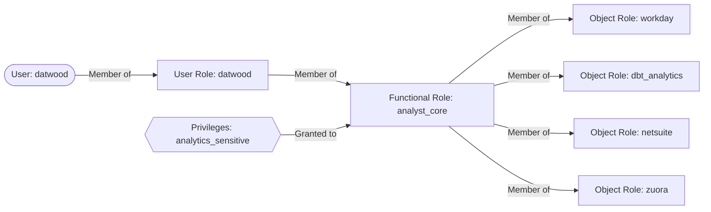
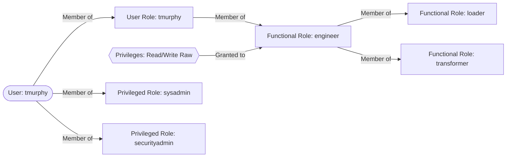
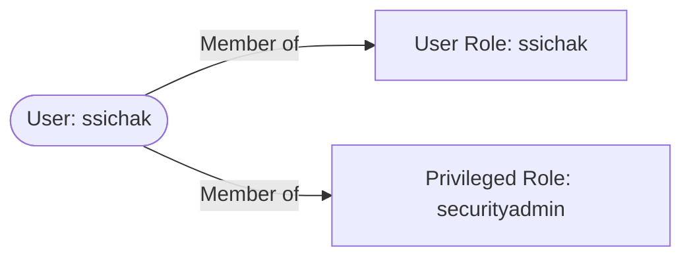

## データプラットフォームのビジョン

これらの野心は、GitLabのデータプラットフォームのためのガイドビジョンとなるよう設定されています。

### 貢献しやすくする

GitLabのデータプラットフォームへの貢献は簡単であり、プラットフォームの使用は直感的です

* ドキュメンテーションは完全で、ユーザーと貢献者にとって関連性があります
* すべてのデータ変換はdbtで実装されます
* CI/CDは、貢献者とレビュアーにとってシームレスで、直感的で、自動化されています
* データの状態は、ソースと変換から派生します
* データパイプラインはべき等です

### 信頼性が高い

データプラットフォームとそれが提供するデータは、可用性と精度の点で一貫しています

* すべての破壊的変更は、Devおよび／またはStaging環境でテスト可能です
* 自動化されたテストはデータデリバリープロセスのすべての段階で実装されます
* プラットフォームのすべてのコンポーネントは、コードで定義され、バージョン管理できます

### セキュアである

データプラットフォームは人々を危険にさらしません

* データは、文書化された承認により認可された人のみがアクセスできます
* GitLabデータチームは、認可と認証に関して [Principle of Least Privilege](https://internal.gitlab.com/handbook/security/access-management-standard/#principle-of-least-privilege) に固執します

### メンテナンスしやすい

* データプラットフォームコンポーネントは、[メンテナビリティの容易さ](https://en.wikipedia.org/wiki/Maintainability) のための良いエンジニアリングプラクティスを考慮して作成されます。これは、メンテナビリティの追跡が、システムが「コードのエントロピー」または整合性の低下に向かう傾向を減らすか逆転させるのに役立つことを意味します

### より大きなコミュニティに利益をもたらす

GitLabのデータプラットフォームは、GitLab以上のコミュニティに関連性があり、より大きなエンジニアコミュニティに依存しています。

* 関連するプラットフォームコードはオープンソースです
* プラットフォームの強化は、コミュニティプロジェクトに還元されます
* 私たちは特異な独自開発よりも、一般化可能な仕様と標準を好みます

## 目的

データプラットフォームはデータ分析の目的に使用されます。このドキュメントは、データプラットフォームとして総称的に定義されるコンポーネントを概念的に高レベルで説明します。

## スコープ

このドキュメントは、データプラットフォームを概念的に説明することに限定されます。それをより詳細に説明する他のリソースがあります（例: [データパイプライン](/handbook/enterprise-data/platform/pipelines/) と [インフラストラクチャ](/handbook/enterprise-data/platform/infrastructure/)）。

## 役割と責任

| 役割 | 責任 |
| ---- | -------------- |
| GitLab Team Members | データプラットフォームを形成する標準にどう注意を払うかについての責任 |
| Data Platform Team Members | この標準に基づいてデータユースケースを実装および実行する責任 |
| Data Management Team | この標準に対する重要な変更と例外を承認する責任 |

## 標準

## <i class="fas fa-map-marked-alt fa-fw -text-purple"></i>クイックリンク

* [Data Enablement](/handbook/enterprise-data/platform/data-enablement/)
* [Data Infrastructure](/handbook/enterprise-data/platform/infrastructure/)
* [Data Pipelines](/handbook/enterprise-data/platform/pipelines/)
* [Data CI Jobs](/handbook/enterprise-data/platform/ci-jobs/)
* [dbt Guide](/handbook/enterprise-data/platform/dbt-guide/)
* [Enterprise Data Warehouse](/handbook/enterprise-data/platform/edw/)
* [Data Pump](/handbook/enterprise-data/platform/#data-pump)
* [Incident Management](/handbook/enterprise-data/data-governance/incident-management/)
* [Jupyter Guide](/handbook/enterprise-data/platform/jupyter-guide/)
* [Permifrost](/handbook/enterprise-data/platform/permifrost/)
* [Python Guide](/handbook/enterprise-data/platform/python-guide/)
* [Python/Tools package management and inventory](/handbook/enterprise-data/platform/python-tool-package-management/)
* [Snowflake](/handbook/enterprise-data/platform/snowflake/)
* [Snowplow](/handbook/enterprise-data/platform/snowplow/)
* [SQL Style Guide](/handbook/enterprise-data/platform/sql-style-guide/)
* [R/RStudio](/handbook/enterprise-data/platform/rstudio/)
* [Tableau](/handbook/enterprise-data/platform/tableau/)

## <i class="fas fa-cubes fa-fw -text-orange"></i>データスタック


私たちは、分析機能を運用および管理するためにGitLabを使用しています。
すべてはIssueから始まります。
変更は、パイプライン、抽出、ロード、変換、および分析の一部への変更を含めて、マージリクエストを通じて実装されます。

| ステージ           |              ツール             |
| :-------------- | :---------------------------: |
| Extraction      | Stitch, Fivetran, Tableau Prep, Custom Code |
| Loading         | Stitch, Fivetran, Tableau Prep, Custom Code |
| Orchestration   | Airflow, Tableau Prep |
| Data Warehouse  | Snowflake Enterprise Edition |
| Transformations | dbtとPythonスクリプト |
| Data Visualization | Tableau |
| Advanced Analytics | jupyter |

## <i class="fas fa-exchange-alt fa-fw -text-purple"></i>抽出とロード

私たちは現在、一部のデータソースで [Stitch](https://www.stitchdata.com) と [Fivetran](https://www.fivetran.com/) を使用しています。これらは、一部のデータソースから当社のSnowflakeデータウェアハウスへのデータの移動の構築、メンテナンス、オーケストレーションの責任を取り除く、オフザシェルフのELTツールです。

StitchとFivetranは、データパイプラインの開始を自分自身で処理します。これは、AirflowがStitchおよびFivetranスケジュールのオーケストレーションで役割を果たさないことを意味します。

データを抽出するために使用する他のソリューションは以下です:

1. [Python](/handbook/enterprise-data/platform/python-guide/) で構築され、[Airflow](/handbook/enterprise-data/platform/infrastructure/) を介してオーケストレーションされるカスタムパイプライン
1. Tableau Prepで構築され、Tableau Cloudによってオーケストレーションされるフロー
1. Snowflake [data share](https://docs.snowflake.com/en/user-guide/data-sharing-intro)

ソースの所有権については、[Tech Stack Applicationsデータファイル](https://gitlab.com/gitlab-com/www-gitlab-com/-/blob/master/data/tech_stack.yml) を参照してください。

### データソース

以下の表は、外部の場所からデータウェアハウスにロードしているすべてのRAWデータソースをインデックス化しています。私たちは [New Data Source/Pipeline Project Management](https://docs.google.com/spreadsheets/d/14uqsAIqRnyyL9Ta39QYwheXnf0k86yTTIKhrkY_1el8/edit#gid=0) シートで開発バックログと優先順位を管理し、最新のステータスと進捗管理のためのGitLab Issueへのリンクがあります。[new data sourceハンドブック](/handbook/enterprise-data/how-we-work/new-data-source/) ページでは、データチームが新しいデータソースのリクエストを処理する方法を説明しています。

**以下の表のパイプラインの列のリンクは、該当する場合、特定のデータパイプラインの詳細ページに移動します。**

**キー**

* Pipeline: データを複製するために使用する技術。
* RF (Replication Frequency): 新規および更新されたデータをロードする頻度。
* Raw Schema: データが保存されている `RAW` データベースのスキーマ。
* Prep Schema: [source models](/handbook/enterprise-data/platform/dbt-guide/#source-models) がマテリアライズされる `PREP` データベースのスキーマ。
* Audience: データの主要なユーザー。
* SLO: Service Level Objective。私たちのSLOは、リアルタイムと消費のために利用可能になったデータの間の時間です。
  * 技術的には、これは上流システムにエントリが作成されたときから、データがSnowflakeの `PROD` レイヤーで利用可能になるまでの時間を意味します（これには、dbt内の変換が含まれます）。
`x` は未定義または実行されないことを示します

{}
<!-- Add or edit data sources in https://gitlab.com/gitlab-com/www-gitlab-com/-/blob/master/data/data_warehouse_sources.yml -->

#### Source contacts

外部エラーがある場合に誰に連絡するかについては、[source contact spreadsheet](https://docs.google.com/spreadsheets/d/1VKvqyn7wy6HqpWS9T3MdPnE6qbfH2kGPQDFg2qPcp6U/edit) を参照してください。

#### Tier definition

| アスペクト | Tier 1 | Tier 2  | Tier 3 |
|:-|:-|:-|:-|
| **説明**  | - 最も重要でビジネスクリティカルな信頼されたデータソリューション。<br><br> - 日々の運用を確保するために、コンポーネントが利用可能でリフレッシュされる必要があります | - 洞察を集めるために重要で有益なデータソリューション。<br><br> - コンポーネントは、日々の運用をサポートするために利用可能でリフレッシュされている必要があります | - Ad-Hoc、定期的、または一度きりの分析に重要なデータソリューション。<br><br> - コンポーネントは利用できない、またはデータがリフレッシュされない可能性があります。 |
|**基準**|- 24時間利用できない場合に$100k以上のビジネスインパクトをもたらす任意のデータ、プロセス、または関連サービス <br><br>-  15人以上のビジネスユーザーに影響を与える | - 24時間利用できない場合に$100k未満のビジネスインパクトをもたらす任意のデータ、プロセス、または関連サービス <br><br> - 5〜15人のビジネスユーザーに影響を与える | - 5営業日以上利用できない場合に即時のビジネスインパクトをもたらさない任意のデータ、プロセス、または関連サービス <br><br> - 5人未満のビジネスユーザーに影響を与える |
|**停止による影響**|重大|寛容|無視できる |
| **モニタリングとオブザーバビリティ** | 鮮度と量の異常についてMonte Carloを通じて監視。すべてのアラートが調査され、必要に応じて、上流（システム／データ）所有者にエスカレートされます。 | データパイプラインの継続性のために、Monte Carloを通じて技術的に鮮度が監視されます。アラート時に、技術的な失敗が調査されます。 | データパイプラインの継続性のために、Monte Carloを通じて技術的に鮮度が監視されます。アラート時に、技術的な失敗が調査されます。  |

**モニタリングと根本原因調査に関するメモ:** トリアージャーは、データコンテキスト（タイプ、ボリューム、履歴パターン）を評価して、上流（システム／データ）所有者との調査および／またはエスカレーションが必要かどうかを判断するべきです。チームメンバーは、データのコンテキストを考慮するべきです。以下は規範的ではありませんが、緩やかに従われるパラダイム（例、他も適用されます）として機能します: データソースが1日あたり1Mレコードを受信していたのに、パイプラインが実行されているのに突然データを受信しなくなった場合、これは必ずしもデータパイプラインに関連していない上流の問題を示しているため、調査が必要です。ただし、データソースが1日あたり10レコードを受信していたのに、特定の日付（例: 1月1日）で2レコードに低下した場合、これは履歴パターンに基づく期待される行動である可能性があるため、調査は必要ない可能性があります。

### データソースへのデータチームのアクセス

新しいデータソースをデータウェアハウスに統合するため、データチームの特定メンバーは、UIとAPIの両方でデータソースへの管理者レベルのアクセスが必要です。
適切な分析を構築するために必要なすべてのデータを取得するためにAPIを通じて、また準備された分析の結果をUIと比較するためにUIを通じて、この管理者レベルのアクセスが必要です。

機密データソースは、必要なレポートを構築するために、少なくとも1人のデータエンジニアと1人のデータアナリストがアクセスを持つように制限できます。
場合によっては、2人のデータエンジニアのみになる可能性があります。
自動化された抽出プロセスのために追加のアカウントをリクエストする可能性があります。

機密データは、以下にリストされたセキュリティパラダイムを通じてロックダウンされます。

### データソース概要

* [Customer Success Dashboards](https://drive.google.com/open?id=1FsgvELNmQ0ADEC1hFEKhWNA1OnH-INOJ)
* [Netsuite](https://www.youtube.com/watch?v=u2329sQrWDY)
  * [Netsuite and Campaign Data](https://drive.google.com/open?id=1KUMa8zICI9_jQDqdyN7mGSWSLdw97h5-)
* [Version (pings)](https://drive.google.com/file/d/1S8lNyMdC3oXfCdWhY69Lx-tUVdL9SPFe/view)
  * 2019年10月まで、データチームは **version** データソース全体を "pings" と呼んでいたことに注意してください。ただし、usage pingはversionデータソースの1つのサブセットに過ぎないため、versionまたはversion appを使用してversion.gitlab.com の *データソース* を参照し、"usage data"、"usage pings"、または "pings" を使用してversionデータソースの [特定の使用データ機能](https://docs.gitlab.com/ee/administration/settings/usage_statistics.html) を参照しています。データ抽出のコンテキストで、`Service ping` データインジェスチョンに関する場合、特定の詳細は [Service ping](https://internal.gitlab.com/handbook/enterprise-data/platform/pipelines/#service-ping) ページまたはService pingの [Readme.md](https://gitlab.com/gitlab-data/analytics/-/blob/master/extract/saas_usage_ping/README.md) ページで見つけることができます
* [Salesforce](https://youtu.be/KwG3ylzWWWo)
* [Zendesk](https://drive.google.com/open?id=1oExE1ZM5IkXcq1hJIPouxlXSiafhRRua)

### Snowplowインフラストラクチャ

セットアップに関する詳細については、[Snowplow Infrastructureページ](/handbook/enterprise-data/platform/snowplow) を参照してください。

## <i class="fas fa-robot fa-fw -text-blue"></i>AI

私たちはデータプロダクトの開発にAIを使用し、データプロダクトでAIを使用します。

### データプロダクトを開発するためのAIの使用

私たちは、GitLab Duo Agentic Platform（詳細は [internal handbookページ](https://internal.gitlab.com/handbook/enterprise-data/platform/ai_to_data/gitlab_duo_snowflake_mcp/) で）、Tableauデータソース、ClaudeをModel Context Protocol（MCP）接続経由でSnowflakeデータウェアハウスに接続することで、データ開発プロセスを強化するためにAIを活用しています。この統合により、開発ワークフローを加速し、データプロダクトの品質を向上させることができます。

### AIプロダクトの構築

私たちのAIプロダクト開発は、2つの主要な領域に分類されます:

#### 1. Snowflake Cortex AI

私たちは、データプラットフォーム内で [Snowflake Cortex AI](https://www.snowflake.com/en/product/features/cortex/) を活用して、データウェアハウス内で直接ネイティブAI機能を提供しています。詳細な実装ガイダンスとベストプラクティスについては、[AI to Dataに関する内部ハンドブックページ](https://internal.gitlab.com/handbook/enterprise-data/platform/ai_to_data/) を参照してください。

#### 2. フェデレーションAIツール

以下を含むフェデレーションAIツールを実装しています:

1. **[Weaviate](https://weaviate.io/)**: データの高次元ベクトル表現を保存および照会することで、セマンティック検索とAI駆動データ取得を可能にするベクトルデータベース
2. **External AI Integration**: 外部の大規模言語モデル（LLM）をベクトルデータベースインフラストラクチャに接続して、データプロダクト全体で高度なAI機能を可能にします

## <i class="fas fa-clock fa-fw -text-orange"></i>オーケストレーション

私たちは、オーケストレーションのためにKubernetes上のAirflowを使用しています。具体的なセットアップ／実装は [こちら](https://gitlab.com/gitlab-data/data-image) で見つけることができます。詳細については、[Data Infrastructure](/handbook/enterprise-data/platform/infrastructure/) ページも参照してください。

## <i class="fas fa-database fa-fw -text-purple"></i>データウェアハウス

私たちは現在、データウェアハウスとして [Snowflake](https://docs.snowflake.net/manuals/index.html) を使用しています。Enterprise Data Warehouse（EDW）は、GitLabの企業データ、パフォーマンス分析、Key Performance Indicatorsなどのエンタープライズ全体のデータに関する信頼できる唯一の情報源です。EDWは、レポート作成、ダッシュボード作成、分析のための共通のプラットフォームとフレームワークをすべてのチームに提供することで、GitLabのデータ駆動のイニシアチブをサポートします。ポイントツーポイントのアプリケーション統合を除き、現在および将来のすべてのデータプロジェクトはEDWから推進されます。さまざまなGitLabソースシステムからのデータの受信者として、EDWはまた、すべての決定が可能な限り最高のデータを使用して行われることを確実にするために、データ品質のベストプラクティス、メジャー、修正を情報提供および推進するのに役立ちます。

### Snowplowの列の更新

#### Snowplowのジオ列のnullify

**Issue**: [**Snowflake documentation**](https://docs.snowflake.com/en/user-guide/data-load-snowpipe-ts#unable-to-reload-modified-data-modified-data-loaded-unintentionally)

Snowplowにジオデータを抽出しないために、以下の列がnullifyされました:

* `geo_zipcode`
* `geo_latitude`
* `geo_longitude`
* `user_ipaddress`

このnullifyは、`2023-02-01` からSnowplowに適用され、ファイルは同じ構造を持ち、列値だけが `NULL` に設定されています。データチームは古いファイルを更新して、言及された列を `NULL` に設定し、Snowflakeでも列を `NULL` に設定しました。これはSnowflakeの `RAW`、`PREP`、`PROD` レイヤーに適用されます。

[**Snowflake documentation**](https://docs.snowflake.com/en/user-guide/data-load-snowpipe-ts#unable-to-reload-modified-data-modified-data-loaded-unintentionally) のとおりに `S3` バケットで更新されたファイルの重複ロードを避けるため、フォルダ構造は以下から変更されました:

```bash
- gitlab-com-snowplow-events/
    output/ <---- all files are located here
        2019/01/01
        ...
        (present day)
```

新しい構造に:

```bash
- gitlab-com-snowplow-events/
    output_nullified_columns/ <---- all files are nullified and updated
        2019/01/01
        ...
        2023/01/31
    output/ <---- new files will land here and will be loaded by Snowpipe
        2023/02/01
        ...
        (present day)
```

#### Snowplowの `page_url_path` 列のnullify

**Issue**: [s3: Pseudonymize page_url_path in Snowflake and s3 bucket](https://gitlab.com/gitlab-data/analytics/-/issues/22351)

Snowplowに対するデータコンプライアンスのために、以下の列が仮名化されました:

* `page_url_path`

この仮名化は、`Snowplow` データに対して、期間 `2022-10-26` - `2024-12-01` で適用され、ファイルは同じ構造を持ち、列値だけが仮名化されています。
データチームは古いファイルを更新し、`page_url_path` 列を仮名化し、Snowflakeでも `page_url_path` 列を仮名化しました。
これはSnowflakeの `RAW`、`PREP`、`PROD` レイヤーに適用されます。

[s3: Pseudonymize page_url_path in Snowflake and s3 bucket](https://gitlab.com/gitlab-data/analytics/-/issues/22351) のとおりに `S3` バケットで更新されたファイルの重複ロードを避けるため、フォルダ構造は以下から変更されました:

```bash
- gitlab-com-snowplow-events/
    output_nullified_columns/ <---- all files are nullified and updated (in the previous iteration)
        2022/10/26
        ...
        2023/
            02/
    output/
        2023/
            02/
            03/
```

新しい構造に:

```bash
- gitlab-com-snowplow-events/
    output_nullified_columns/
        2019/01/01
        ...
        2022/10/25
    output_mask_page_url_path/ <---- all files are pseudonimized
        2022/10/26
        ...
        2023/12/01
    output/ <---- new files will land here and will be loaded by Snowpipe
        2023/12/02
        ...
        (present day)
```

> **注:** `S3` バケットへのすべての新しいロードは、以前と同じフォルダ `gitlab-com-snowplow-events/output` に入ります。

### Snowflakeサポートポータルアクセス

**前提条件:**

* チームメンバーがSnowflakeで検証済みのメールアドレスを持っている必要があります
* メール検証はSnowsightのSettings → My Profileで完了できます

**アクセスオプション:**

サポートポータルアクセスには3つの権限レベルがあります:

* `MANAGE ORGANIZATION SUPPORT CASES` - 組織全体のすべてのサポートケースを表示および管理
* `MANAGE ACCOUNT SUPPORT CASES` - アカウントのすべてのサポートケースを表示および管理
* `MANAGE USER SUPPORT CASES` - ユーザー自身がオープンしたケースを表示および管理

**アクセスポリシー:**

個別リクエストには常にMANAGE USER SUPPORT CASESから始めてください。より高いアクセスレベル（MANAGE ACCOUNTまたはMANAGE ORGANIZATION SUPPORT CASES）は、個別レベルのアクセスが不十分である理由を示すビジネス上の正当化が必要です。

**アクセスの付与:**

`ACCOUNTADMIN` のみが、MANAGE ACCOUNT SUPPORT CASESまたはMANAGE USER SUPPORT CASES権限を付与できます。
`ORGADMIN` のみが、MANAGE ORGANIZATION SUPPORT CASES権限を付与できます。

適切な付与ステートメントを実行します:

-- MANAGE USER SUPPORT CASES

```SQL
USE ROLE ACCOUNTADMIN;
GRANT MANAGE USER SUPPORT CASES ON ACCOUNT TO ROLE <role_name>;
```

-- MANAGE ACCOUNT SUPPORT CASES

```SQL
USE ROLE ACCOUNTADMIN;
GRANT MANAGE ACCOUNT SUPPORT CASES ON ACCOUNT TO ROLE <role_name>;
```

-- MANAGE ORGANIZATION SUPPORT CASES

```SQL
USE ORGADMIN;
GRANT MANAGE ORGANIZATION SUPPORT CASES ON ACCOUNT TO ROLE <role_name>;
```

<role_name> :- これは個別のロールです。Oktaを介してSnowflakeにいるユーザーはユーザーロールを持っていないことに注意してください。

**初回アクセス:**
初回サポートにアクセスする場合、ユーザーはSnowsightで「Enable Support」を選択する必要があります。

snowflakeサポートポータルへのアクセスを取得するには、以下の手順に従ってください。

* [Snowsight](https://docs.snowflake.com/en/user-guide/ui-snowsight) インスタンスにいるとき、アカウント（左下隅）を開き、Supportオプションに移動します


* パネルで、すでにオープンしているケースを見ることができます


* 右上隅で、新しいケースをオープンするには `+ Support Case` ボタンを押します
* 問題を説明するデータを入力し、Snowflakeチームがそれを処理します


* ケースの各更新時に、メールで通知されます

### ウェアハウスアクセス

Snowflake へのアクセスを取得するには、[Lumos Access Request](/handbook/security/corporate/systems/lumos/ar/) を使用してください。3 つのオプションがあります:

1. Analyst
1. Analyst SAFE
1. Customer User（リクエストに要件を含めてください）

マネージャーが承認すると、リクエストは Data Team にルーティングされます。Analyst と Analyst SAFE については、Okta SCIM が Snowflake アカウントをプロビジョニングし、適切なラッパーロールを割り当てます。Customer User については、Data Team が Snowflake-permissions [リポジトリ](https://gitlab.com/gitlab-data/snowflake-permissions) を通じて手動でアクセスをプロビジョニングします。

SAFE アクセスについては、必要な承認について [SAFE Guide](/handbook/enterprise-data/platform/safe-data/#snowflake) を参照してください。

> **注:** Snowflake アカウントが Lumos/Okta SCIM 統合の前に作成された場合、または Analyst と Analyst SAFE を超えるアクセスが必要な場合は、以下の [追加のアクセス](#additional-access) パスを使用してください。アクセスアーキテクチャの完全な説明については、[Snowflake Guide](/handbook/enterprise-data/platform/snowflake/#current-access-model) を参照してください。

すべてのユーザーは `dev_xs` ウェアハウスへの標準アクセスを持ちます。ウェアハウスはユーザーロールレベルでプロビジョニングされており、よりきめ細かいウェアハウス割り当てを可能にします。このアプローチでは、GitLab Team Membersに適切なウェアハウスサイズを割り当てることで、リソース割り当てとコスト管理を最適化できます。より大きなサイズのウェアハウスは、通常のアクセスリクエストプロセスを介してリクエストできます。

Snowflakeは、SQLコードを書くことで利用可能なデータの分析を実行するために使用できます。作成されたもの、分析の結果は、[ad-hoc analyses](/handbook/enterprise-data/how-we-work/data-development/#data-development-at-gitlab) と見なされます。作成されたもの（ワークシートとダッシュボード）はバージョン管理されておらず、中央データチームによってサポートまたは管理されていないことを知ることが重要です。つまり、チームメンバーがGitLabから離れたとき、ワークシートとダッシュボードはアクセスできなくなります。分析を永続化するために、チームメンバーはTableauワークブックを構築する、GitLabプロジェクトにコードスニペットを保存する、またはデータチームの [dbt project](https://gitlab.com/gitlab-data/analytics/-/tree/master/transform/snowflake-dbt) にコードをコミットできます。

## 追加のアクセス {#additional-access}

ユーザーがSCIMのLumos & oktaを介して実装される前にSnowflakeで作成された場合、またはdbtプロジェクトに貢献するために必要なdevデータベースの作成を含む、デフォルトの `snowflake_analyst` および `snowflake_analyst_safe` を超えるアクセスが必要な場合、必要なアクセスレベルを文書化した [Access Request](https://gitlab.com/gitlab-com/team-member-epics/access-requests) を使用してください。

### 追加アクセスのプロビジョニング

ユーザーが標準の `snowflake_analyst` または `snowflake_analyst_safe` ロールを超えるロール（例: `analyst_core` ロール）を必要とする場合、これはpermifrostを通過する必要があり、[`roles.yml`](https://gitlab.com/gitlab-data/snowflake-permissions/-/blob/main/roles.yml) を更新する必要があります。permifrostの使用方法の詳細については、[Snowflake Permissions Paradigm](/handbook/enterprise-data/platform/#snowflake-permissions-paradigm) を参照してください。

<details><summary>手順</summary>

**ステップ1: 現在のアクセス状態の確認:**

[`roles.yml`](https://gitlab.com/gitlab-data/snowflake-permissions/-/blob/main/roles.yml) でユーザー名を検索することで、ユーザーがpermifrostを介してすでにプロビジョニングされているかどうかを確認します。
ユーザー名が `roles.yml` にない場合、Snowflakeでロールおよびおそらくユーザーを作成する必要がある可能性があります。

この状態は、以下のクエリを使用してSnowflakeで検証できます。これは、Snowflakeにユーザーとユーザーロールが存在する場合、それらの行を返します。

```sql
SET username = 'username';
SELECT
 'user' AS record,
 name, created_on,deleted_on,
 disabled, owner
FROM SNOWFLAKE.ACCOUNT_USAGE.users
 WHERE LOWER(name) IN ($username)
UNION
SELECT
  'role' AS record,
  name, created_on, deleted_on,
  null AS disabled, owner
FROM SNOWFLAKE.ACCOUNT_USAGE.ROLES
WHERE LOWER(name) IN ($username);
```

**ステップ2: ユーザーの現在の状態に基づいて適切に処理:**

* ***状態:* ユーザーが `roles.yml` にすでに存在する:**
  * [`roles.yml`](https://gitlab.com/gitlab-data/snowflake-permissions/-/blob/main/roles.yml) を、[Snowflake Permissions Paradigm](/handbook/enterprise-data/platform/#snowflake-permissions-paradigm) に従って、必要な追加のロールおよび／または権限で更新する
* ***状態:* ユーザーがSnowflakeに存在するが、`roles.yml` のために [user role](/handbook/enterprise-data/platform/#user-roles) を作成する必要がある:**
  * [snowflake-infrastructure/infra/roles.tf](https://gitlab.com/gitlab-data/snowflake-infrastructure/-/blob/main/infra/roles.tf) にユーザーロールを追加する
  * [`roles.yml`](https://gitlab.com/gitlab-data/snowflake-permissions/-/blob/main/roles.yml) を、[Snowflake Permissions Paradigm](/handbook/enterprise-data/platform/#snowflake-permissions-paradigm) に従って、必要な追加のロールおよび／または権限で更新する
* ***状態:* ユーザーがSnowflakeに存在しない:**
  * Snowflakeにユーザーを作成する
    * CIジョブ `👥 users_snowflake_provisioning_snowflake` を介して
  * [`roles.yml`](https://gitlab.com/gitlab-data/snowflake-permissions/-/blob/main/roles.yml) を、[Snowflake Permissions Paradigm](/handbook/enterprise-data/platform/#snowflake-permissions-paradigm) に従って、必要な追加のロールおよび／または権限で更新する

</details>

### 追加アクセスのリマインダー

* 私たちは、ユーザーの権限付与に関して、[このブログ記事](https://www.getdbt.com/blog/how-we-configure-snowflake) で説明されているパラダイムを緩やかに従います。
* 既存のアカウントをミラーするよう依頼するとき、制限付きSAFEデータへのアクセスはプロビジョニング／ミラーされない（現在 `restricted_safe` ロールを通じて提供されている）ことに注意してください。
* Snowflakeは [Access Review Procedure](/handbook/security/security-assurance/security-compliance/access-reviews/) の一部であり、マネージャーはチームメンバーのSnowflakeでのアクセスを四半期ごとにレビューするよう依頼されます。ARを承認する、またはチームメンバーのアクセスをレビューする場合、マネージャーはSnowflakeで利用可能なロール（構造）を理解することが期待されます。
  * アクセスレビューでは、Snowflakeロールの最初のレベル（ユーザーに直接アタッチされているもの）のみが報告されます。つまり、チームメンバーが `analyst_marketing` ロールを持っている場合、`analyst_marketing` のみが報告され、`analyst_marketing` 内のすべての継承されたロールは報告されません。
    * ロールは、機能的ロールとオブジェクトロールに区別される場合があります（以下の権限パラダイムを参照）
      * Snowflakeの機能的ロールとオブジェクトロールのこのリストを参照してください。
      * オブジェクトロールはシステムに直接関連しており、私たちがそれらの上流のソースシステムから抽出する **すべての** データへのアクセスをチームメンバーに付与します。
      * ロールが何を伴うかを完全に詳細に知るには、[`roles.yml` file](https://gitlab.com/gitlab-data/snowflake-permissions/-/blob/main/roles.yml) を確認してください。
      * 不確実な場合、ARプロセスまたはアクセスレビュー中に、特定のロールが何を伴うかを詳細に理解するために、Data Platformチームメンバーに連絡してください。

### 履歴のプロビジョニング手順

何らかの理由で、ユーザーをOktaとLumosの外でプロビジョニングする必要がある場合、私たちは歴史的に以下のプロセスを使用してきました:

<details>
<summary>SnowflakeのためのユーザーとロールのMan手動管理</summary>

* `Provisioning` ラベルが適用された元のアクセスリクエストにリンクするIssueがGitLab Data Teamプロジェクトにあることを確認します
* Snowflakeにログインし、`securityadmin` ロールに切り替えます
  * すべてのロールは `securityadmin` の所有権の下にあるべきです
* [`user_provision.sql`](https://gitlab.com/gitlab-data/snowflake-permissions/-/blob/main/snowflake_provisioning_automation/provision_users/sql_templates/provision_user.sql?ref_type=heads) スクリプトをコピーし、初期ブロックでemail、firstname、lastname値を置き換えます
* Snowflake [roles.yml](https://gitlab.com/gitlab-data/analytics/-/blob/master/permissions/snowflake/roles.yml) permifrost設定ファイルに文書化する（このファイルは毎日12:00am UTCに自動的にロードされます）
  * 作成したユーザーとユーザーロールを追加する
  * ユーザーロールを新しいユーザーに割り当てる
  * 必要に応じて追加のロールをユーザーに割り当てる
* ユーザーがOktaでアプリケーションに割り当てられていることを確認します
* ユーザーが `okta-snowflake-users` [Googleグループ](https://groups.google.com/my-groups) に割り当てられていることを確認します

</details>

最後に、Oktaによって管理されていない、またはデフォルトを超える権限が付与されている既存のユーザーをデプロビジョニングするための適切なステップは以下です:

* Snowflakeデプロビジョニングは、オフボーディングIssueまたはアクセスリクエストIssueを介して行われるべきです。
* `Deprovisioning` ラベルが適用された元のソースリクエストにリンクするIssueがGitLab Data Teamプロジェクトにあることを確認します。
* Snowflakeにログインし、`securityadmin` ロールに切り替えます
  * すべてのロールは `securityadmin` の所有権の下にあるべきです。
* [`user_deprovision.sql`](https://gitlab.com/gitlab-data/snowflake-permissions/-/blob/main/snowflake_provisioning_automation/provision_users/sql_templates/deprovision_user.sql?ref_type=heads) スクリプトをコピーし、USER_NAMEを置き換えます。snowflakeでユーザーを削除して残さず、disabled = TRUEに設定する理由は、ユーザーがアクセスを失った時の記録を持つためです。
* ユーザーを `okta-snowflake-users` [Googleグループ](https://groups.google.com/my-groups) から削除します
* Snowflake [roles.yml](https://gitlab.com/gitlab-data/analytics/-/blob/master/permissions/snowflake/roles.yml) permifrost設定ファイルからユーザーレコードを削除します（このファイルは毎日12:00am UTCに自動的にロードされます）

詳細については、この [録画されたペアリングセッション](https://youtu.be/-vpH0aSeO9c) を見てください（GitLab Unfilteredとして表示する必要があります）。

### システムアカウント

システムアカウントは、トークンキーを除き、私たちの [Snowflake Terraformプロジェクト](https://gitlab.com/gitlab-data/snowflake-infrastructure/) のコードを通じて完全に作成および管理されており、トークンキーは別途保存および設定されます。

サービスユーザー（人間の対話なしでSnowflakeとやり取りするサービスまたはアプリケーション）は、トークンキーを除き、私たちの [Snowflake Terraformプロジェクト](https://gitlab.com/gitlab-data/snowflake-infrastructure/) のコードを通じて完全に作成および管理されており、トークンキーは別途保存および設定されます。

1. サービスユーザーはTerraformコードを通じて作成されます
2. サービスユーザーロール（標準はユーザーと等しい）はTerraformコードを通じて作成されます
3. ネットワークセキュリティポリシーが作成され、対応するIPがTerraformコードを介して設定されます
4. トークンキーは別途作成、保存、設定されます。以下のハンドブックを参照してください:

* キーペア認証 -> *runbookが利用可能になったらリンクが追加されます*
* Personal Access Tokens（PAT）-> *runbookが利用可能になったらリンクが追加されます*

### Snowflakeの権限パラダイム

私たちは、Snowflakeの権限を管理するのを助けるために [Permifrost](https://gitlab.com/gitlab-data/permifrost/) を使用しています。
私たちのSnowflakeインスタンスの設定ファイルは [このroles.ymlファイル](https://gitlab.com/gitlab-data/analytics/blob/master/permissions/snowflake/roles.yml) に保存されています。
[Permifrostに関するハンドブックページ](/handbook/enterprise-data/platform/permifrost/) も利用可能です。

私たちはロール管理に関して以下の一般戦略に従います:

* 各ユーザーには関連付けられたユーザーロールがあります
* 機能的ロールは、共通の権限セット（`analyst_finance`、`data_manager`、`product_manager`）を表すために存在します
* データの論理グループには独自のオブジェクトロールがあります
* オブジェクトロールは、主に機能的ロールに割り当てられます
* より高い権限のロール（`accountadmin`、`securityadmin`、`useradmin`、`sysadmin`）はユーザーに直接割り当てられます
* サービスアカウントには同名のロールがあります
* 使用法とニーズに応じて、追加のロールをサービスアカウントロールまたはサービスアカウント自体に割り当てることができます
* 個別の権限は、テーブルとビューの粒度で付与できます
* ウェアハウスの使用は必要に応じて任意のロールに付与できますが、機能的ロールに付与することが推奨されます

#### ユーザーロール

各ユーザーは、ユーザー名と一致する独自のユーザーロールを持ちます。
Snowflakeでのオブジェクトレベルの権限（データベース、スキーマ、テーブル）は、ロールにのみ付与できます。
ロールはユーザーまたは他のロールに付与できます。
私たちは、ユーザーがデータベースとやり取りするのに1つのロールだけを使う必要があるように、すべての権限がユーザーロールを流れるよう努めています。
例外は `accountadmin`、`securityadmin`、`useradmin`、`sysadmin` などの特権ロールです。
これらのロールはより高いアクセスを付与し、使用時に意図的に選択されるべきです。

#### 機能的ロール

機能的ロールは、通常職務ファミリーにマップする権限セットとロール付与のグループを表します。
主な例外はanalystロールです。
組織のさまざまな領域にマップするanalystロールのいくつかのバリアントがあります。
これらには、`analyst_core`、`analyst_finance`、`analyst_people` などが含まれます。
analystは関連するロールに割り当てられ、必要なスキーマへのアクセスが明示的に付与されます。

機能的ロールはいつでも作成できます。
非常に類似した職務ファミリーと権限を持つ複数の人がいる場合、最も理にかなっています。

##### 機能的ロールの割り当て

この機能的ロールのリストは、ロールが何を伴うかについての高レベルの理解を提供します。欠落している、またはロールが何を伴うかを完全に詳細に知るには、このYAML [ファイル](https://gitlab.com/gitlab-data/snowflake-permissions/-/blob/main/roles.yml) を確認してください。

| 機能的ロール | 説明 | SAFEデータ Y/N |
| --- | --- | --- |
| `data_team_analyst` | すべての `PROD` データ、機密マーケティングデータ、Data Platformメタデータ、一部のソースへのアクセス。 | Yes |
| `analyst_core` | データプラットフォームのすべての `PROD` データとメタデータへのアクセス | No |
| `analyst_engineering` | すべての `PROD` データ、データプラットフォームのメタデータ、エンジニアリング関連のデータソースへのアクセス。 | Yes |
| `analyst_growth` | すべての `PROD` データ、データプラットフォームのメタデータ、さまざまなデータソースへのアクセス。 | Yes |
| `analyst_finance` |  すべての `PROD` データ、データプラットフォームのメタデータ、財務関連のデータソースへのアクセス。 | Yes |
| `analyst_marketing` |  すべての `PROD` データ、データプラットフォームのメタデータ、マーケティング関連のデータソースへのアクセス。 | Yes |
| `analyst_people` |  すべての `PROD` データ、データプラットフォームのメタデータ、機密人員データを含むさまざまな関連データソースへのアクセス。 | Yes |
| `analyst_sales` |  すべての `PROD` データ、データプラットフォームのメタデータ、さまざまな関連データソースへのアクセス | Yes |
| `analyst_support` |  `PROD` データ、データプラットフォームのメタデータ、機密Zendeskデータを含む `raw` / `prep` Zendeskデータへのアクセス | No |
| `analytics_engineer_core` |  `analyst_core`、`data_team_analyst` ロールといくつかの追加の組み合わせ | Yes |
| `data_manager` | Snowflakeデータへの拡張アクセス  | Yes |
| `engineer` | Snowflakeでデータ操作タスクを実行するためのSnowflakeデータへの拡張アクセス | Yes |
| `snowflake_analyst` | Snowflake、EDMスキーマ、ワークスペースの `PROD` データへのアクセス | No |
| `snowflake_analyst_safe` | SAFEデータを含むSnowflake、EDMスキーマ、ワークスペースの `PROD` データへのアクセス | Yes |
| `sensitive_pii_data_viewer` |  人物および連絡先データマスタリーモデル内のすべての機密フィールドへのアクセス。 | No |

#### オブジェクトロール

オブジェクトロールは、データセットへのアクセスを管理するためのものです。
通常、これらは特定のソースに対するすべてのデータを表します。
`zuora` オブジェクトロールは例です。
このロールは、Stitchから来るraw Zuoraデータと、`prep.zuora` スキーマのソースモデルへのアクセスを付与します。
ユーザーがZuoraデータへのアクセスを必要とするとき、そのユーザーのユーザーロールに `zuora` ロールを付与することが最も簡単な解決策です。
何らかの理由でオブジェクトロールへのアクセスが理にかなわない場合、個別の権限をテーブルの粒度で付与できます。

#### マスキングロール

マスキングロールは、ユーザーがマスクされたデータとどのようにやり取りするかを管理します。マスキングは列レベルで適用され、どの列がマスクされるかはソースシステムオーナーの決定です。マスキングは、dbtを介してデータオブジェクトが作成されたときに、dbtコードベース内の `schema.yml` ファイルで列に適用されます。一部のユーザーがマスクされていないデータへのアクセスを必要とするため、マスキングロールにより、機能的またはオブジェクトロールレベルで、マスクされていないデータへの権限を付与できます。たとえば、`people_data_masking` のマスキングロールが `locality` 列に適用されている場合、機能的ロール `analyst_people` を `people_data_masking` ロールのメンバーとして設定して、analystがマスクされていない人員データを見ることができるようにできます。

マスキングポリシーが作成されると、マスキングロールに基づいて作成され、列に1つのマスキングポリシーだけが適用できます。

#### 例

これは、Data Analyst, Coreのロール階層の例です:



これは、Data EngineerとAccount Administratorのロール階層の例です:



これは、Security Operations Engineerのロール階層の例です:



## Snowflake CIジョブ

FY25-Q1で、上記の `Snowflakeのロール管理` プロセスを半自動化することに向かって移動しています、[OKR epic](https://gitlab.com/groups/gitlab-data/-/epics/1128)。

この変更の主な推進力は、エンジニアリングチームによるアクセスの増加が予想されており、複数のメンバーを同時にプロビジョニングできるプロセスが必要であったことです。さらに、これにより **すべてのGitLab Team Members** が、Data Platformチームからの最小限のサポートで、Snowflakeユーザーを自分で作成できるようになります。これにより、プロビジョニングプロセスが加速され、GitLab Team MemberがSnowflakeへのアクセスを得るまでの時間が短縮されます。

Snowflakeへのアクセスが必要な場合、すべてのGitLab Team Membersは、この [runbook](https://gitlab.com/gitlab-data/runbooks/-/blob/main/snowflake_provisioning_automation/snowflake_provisioning_automation.md) に従ってMRをオープンすることをお勧めします。

プロセスの高レベルの説明:

1. Access Requestをオープンし、承認を得る
1. MRをオープンする
1. CIパイプラインを実行する
1. Data PlatformチームのcodeownerからのReview。

セクションの残りの部分は、自動化されたプロセスをより詳細に説明することを意図しています。

自動化された主なプロセスは以下です:

1. Snowflakeプラットフォームでのユーザーの作成／削除
1. Permifrostによって使用される `roles.yml` を更新して、Snowflakeロール／ユーザー権限を更新する

これらの両方のプロセスは、ユーザーがセルフサーブできるようにCIジョブを介してアクセス可能になり、データエンジニアからのMRレビュー／承認のみが必要になります。

両方のCIジョブは共通のパターンに従い、エンドユーザーは [`snowflake_usernames.yml`](https://gitlab.com/gitlab-data/analytics/-/blob/master/permissions/snowflake/snowflake_usernames.yml) ファイル内からユーザーを追加／削除するだけでよく、CIジョブはファイルへの変更に基づいて実行されます。

### 1) Snowflakeプラットフォームでユーザー／ロールを自動作成

Permifrostを実行する前に、ユーザー／ロールをまずSnowflakeで作成する必要があります。

`snowflake_provisioning_snowflake_users` CIジョブにより、ユーザーはこれらのユーザー／ロールをSnowflakeで作成できます。

利用可能な引数とデフォルト値の詳細については、[CI jobsページ](/handbook/enterprise-data/platform/ci-jobs/#snowflake_provisioning_snowflake_users) を参照してください。

### 2) roles.ymlの自動化

ユーザー／ロールがSnowflakeで作成されたら、希望する権限を反映するように `roles.yml` を更新する必要があります。

`snowflake_provisioning_roles_yaml` CIジョブにより、エンドユーザーは `roles.yml` を希望する権限で自動的に更新できます。

利用可能な引数とデフォルト値の詳細については、[CI jobsページ](/handbook/enterprise-data/platform/ci-jobs/#snowflake_provisioning_roles_yaml) を参照してください。

さらに、次のセクションでは、`snowflake_provisioning_roles_yaml` CIジョブ内のオプションの **templated** 引数に関する追加の詳細を提供します:

<details><summary>オプションのテンプレート引数</summary>

#### カスタムテンプレート

デフォルトとは異なる値が必要な多くのユーザーがいる場合、これは便利です。1つのオプションはデフォルト値で実行してから、MRを手動で更新することです。ただし、更新するユーザーの数によっては、潜在的により良いオプションはカスタム値テンプレートを渡すことです。

セクションの残りでは2つのことを行います:

1. テンプレートがどのように動作するかを説明する
1. 便利さのため、`roles.yml` で現在使用されている共通値を表すカスタムテンプレートを提供する

テンプレートがどのように動作するかを説明するため、例から始めましょう。これがデフォルトの *rolesテンプレート* です:

```json
{
  "{{ username }}": {
    "member_of": [
      "snowflake_analyst"
    ],
    "warehouses": [
      "dev_xs"
    ]
  }
}
```

これは有効なJSONですが、**テンプレート化** されていることに注意してください。つまり、`{{ username }}` はJinjaテンプレートであり、テンプレートは後でスクリプト内で実際の値にレンダリングされます。

次に、上記のデフォルト値をオーバーライドしたい場合の例です。次のユーザーバッチで、`dev_m` ウェアハウスも持たせたい場合はどうなりますか？

CIジョブ内で、デフォルト値をオーバーライドするためのカスタムテンプレートを次のように渡すことができます:

```plain
ROLES_TEMPLATE: {"{{username}}": {"member_of": ["snowflake_analyst"],"warehouses": ["dev_xs", "dev_m"]}}
```

現在、これらはレンダリングされる利用可能なテンプレート可能な値です:

* `{{ username }}`
* `{{ prod_db }}`
* `{{ prep_db }}`
* `{{ prod_schemas }}`
* `{{ prep_schemas }}`
* `{{ prod_tables }}`
* `{{ prep_tables }}`

#### 共通カスタムテンプレート

このセクションは、コピー／ペーストで使用できる、`roles.yml` で共通する値（非デフォルト値）を表すカスタムテンプレートを提供することを目的としています。

* *Default* は、明示的にオーバーライドされない場合に使用されるテンプレートを示します。
* *Common* は、テンプレートがデフォルトで使用されない一方で、これらの値がroles.yml内で共通して使用されることを示します

##### Databases

* Default: なし、データベースは追加されません
* Common: 各ユーザーに対する個人のprep/prodデータベースを作成するためのCIジョブ引数:

    ```sh
    DATABASES_TEMPLATE: [{"{{ prod_database }}": {"shared": false}}, {"{{ prep_database }}": {"shared": false}}]
    ```

##### Roles

* Default:

    ```sh
    ROLES_TEMPLATE: {"{{ username }}": {"member_of": ["snowflake_analyst"], "warehouses": ["dev_xs"]}}
    ```

* Common- データエンジニアのロールを作成するためのCIジョブ引数:

    ```sh
    ROLES_TEMPLATE: {"{{ username }}": {"member_of": ["engineer","restricted_safe"],"warehouses": ["dev_xs","dev_m","loading","reporting"],"owns": {"databases": ["{{ prep_database }}","{{ prod_database }}"],"schemas": ["{{ prep_schemas }}","{{ prod_schemas }}"],"tables": ["{{ prep_tables }}","{{ prod_tables }}"]},"privileges": {"databases": {"read": ["{{ prep_database }}","{{ prod_database }}"],"write": ["{{ prep_database }}","{{ prod_database }}"]},"schemas": {"read": ["{{ prep_schemas }}","{{ prod_schema }}"],"write": ["{{ prep_schemas }}","{{ prod_schema }}"]},"tables": {"read": ["{{ prep_tables }}","{{ prod_tables }}"],"write": ["{{ prep_tables }}","{{ prod_tables }}"]}}}}
    ```

##### Users

* Default:

    ```sh
    USERS_TEMPLATE: {"{{ username }}": {"can_login": true, "member_of": ["{{ username }}"]}}
    ```

* Common: N/A。現在、ユーザーに使用する他のテンプレートはありません

</details>

#### roles.ymlの自動化: Project Access Token

`snowflake_provisioning_roles_yaml` CIジョブは、`roles.yml` ファイルを更新する `update_roles_yaml.py` を実行します。

CIジョブ内の `roles.yml` への変更は、**ブランチ／MRにプッシュバック** されます。

CIパイプライン内からレポにプッシュするため、[Project Access Token](https://docs.gitlab.com/ee/user/project/settings/project_access_tokens.html)（PAT）が必要です。リモートレポへのプッシュに関する詳細は、この [StackOverflowの回答](https://stackoverflow.com/a/73394648) にあります。

PATは `snowflake_provisioning_automation` という名前で、analyticsapi@gitlab.comアカウントを使用して、['GitLab Data Team' project](https://gitlab.com/gitlab-data/analytics) で作成されました。

PAT値は1Pass内に保存されており、GitLabランナーで使用できるようにCI環境変数としても保存されています。

#### snowflake_users.yml - end of file issue

`snowflake_users.yml` ファイルにユーザーを追加する場合、特にファイルの下部に追加するとき、GitLab Single File Editorを使用して行った場合に予期せぬ動作を引き起こします。詳細は [この issue](https://gitlab.com/gitlab-data/analytics/-/issues/20730#note_1919902289) にあります。

回避策は、`snowflake_users.yml` の下部にこのコメントがあることです:

```yml
#### do not insert users below this line ####
```

### ローカルテスト

`update_roles_yaml` と `provision_users` は、CIジョブと比較してより速いテストのためにローカルで実行できます。

**`provision_users` のセットアップ:**

1. 必要な環境変数をエクスポート:

   ```bash
   export EMAIL_DOMAIN='gitlab.com'
   export PERMISSION_BOT_USER="bot_user_123"
   export PERMISSION_BOT_PASSWORD="random_pass_456"
   export SNOWFLAKE_ACCOUNT="xy12345.us-east-1"
   export PERMISSION_BOT_WAREHOUSE="COMPUTE_WH"
   ```

2. Pythonテストラン（Snowflakeユーザー作成なし）:

   ```bash
   python provision_users.py --users-to-add some-user1 user2 --test-run
   ```

### Snowflakeユーザーのデプロビジョニング

非アクティブなSnowflakeユーザーは、`snowflake_cleanup` DAGを介して週次でデプロビジョニングされます。これは [このissue](https://gitlab.com/gitlab-data/analytics/-/issues/20347) で実装されました。

すべてのアクティブなSnowflakeユーザー／ロールは `roles.yml` 内で宣言されます。したがって、`roles.yml` にないSnowflakeユーザーは非アクティブと見なされ、プロセスがそれらをドロップします。

これらのユーザーは、以下の [deprovision_user.sql](https://gitlab.com/gitlab-data/analytics/-/blob/master/orchestration/snowflake_provisioning_automation/provision_users/sql_templates/deprovision_user.sql?ref_type=heads) スクリプトを実行することでドロップされます。

このプロセスは、その機密性のためにCIジョブを介して公開されておらず、時間的にもそれほど敏感ではありません。したがって、代わりにAirflowを介した週次の'cleanup'タスクが実行されます。

#### Snowflakeユーザー／サービスアカウント

`permifrost_bot_user` は、Snowflakeのプロビジョニングおよびデプロビジョニングプロセスの両方を実行するために使用されます。これは2つの理由のためです:

1. `permifrost_bot_user` は、既存のPermifrostジョブを実行するのに必要な権限と同じであるため、プロビジョニング／デプロビジョニングを実行するための適切な権限をすでに持っています。
1. `permifrost_bot_user` は、AirflowとGitLab CIの両方を使用して既存のPermifrostジョブを実行しているため、プロビジョニング（CIで実行）／デプロビジョニング（Airflowで実行）の両方に追加された場合、適用されるNSP IPアドレスが冗長になりません。

#### ユーザーロールへの外部テーブルへの権限のプロビジョニング

snowflake内のユーザーロールへの外部テーブルへのUSAGE権限のプロビジョニングは、現時点ではpermifrostによって処理されません。ユーザーロールに対する外部テーブルへのアクセスをプロビジョニングする必要がある場合、`securityadmin` ロールを使用して、snowflake [docs](https://docs.snowflake.com/en/sql-reference/sql/grant-privilege) のGRANTコマンドを介して手動で付与する必要があります。これは、ユーザーロールが外部テーブルが配置されているスキーマとdbへのアクセスをすでに持っていることを意味しており、そうでない場合は [roles.yml](https://gitlab.com/gitlab-data/analytics/-/blob/master/permissions/snowflake/roles.yml) に追加してください。

#### ログインと正しいロールの使用

AR経由でSnowflakeへの権限を申請し、アクセスがプロビジョニングされる場合、変更が有効になるまで3:00AM UTCまでかかります。これは、毎日Snowflakeでアクセスをプロビジョニングするスクリプトが実行されているからです。ログインできるとき、これをOkta経由で行うことができます。Okta経由でログインした後、アカウントに添付された正しいロールを選択する必要があります。これは、デフォルトでアカウントと同じで、`@gitlab.com` を除くメールアドレスの慣例に従います。

Snowflakeで正しいロールを選択しない場合、以下のSnowflakeオブジェクトしか見ることができません:


正しいロールの選択はGUI経由で実行できます。
Snowsightのホーム画面にいる場合、左上隅で。


1. 名前の近くの矢印をクリック
2. Switch Roleを選択
3. ロールを選択

Snowsightのワークシートにいる場合、右上隅で。


1. `public` をクリック
2. ロールを選択

以下を実行することで、これをデフォルトに設定できます:

`ALTER USER <YOUR_USER_NAME> SET DEFAULT_ROLE = '<YOUR_ROLE>'`

### コンピュートリソース

Snowflakeのコンピュートリソースは「ウェアハウス」として知られています。
クレジットの消費を効果的に使用するため、私たちはウェアハウスの量を最小化しようとしています。開発目的（dbtジョブをローカルで実行する、MRパイプラインを実行する、Snowflakeでクエリする）には、`dev_x` ウェアハウスを使用します。ウェアハウスの名前にはそのサイズが追加されます（`dev_xs` はextra small）。

| ウェアハウス            | 目的                                                                                         | 最大クエリ（分） |
| -------------------- | ----------------------------------------------------------------------------------------------- | ------------------- |
| `admin`              | これはpermission botとその他の管理タスク用です                                                | 10                  |
| `data_classification` | これはSnowflakeでデータ分類とラベリングプロセスを実行するためのものです                 | 60                  |
| `dev_xs/m/l/xl`      | これは開発目的に使用されます。Snowflake UIとCIパイプラインで使用されるべきです | 180               |
| `gainsight_xs`       | これはgainsight data pump用です                                                            | 30                  |
| `gitlab_postgres`    | これは内部のGitLab Postgresデータベースから引き出すための抽出ジョブ用です                   | 10                  |
| `grafana`            | これは排他的にGrafanaが使用するためのものです                                                          | 60                  |
| `loading`            | これはExtract and Loadジョブ用です                                                            | 120                 |
| `reporting`          | これはBIツールでのクエリ用です                                                          | 30*                 |
| `transforming_xs`    | これらはプロダクションのdbtジョブ用です                                                               | 180                 |
| `transforming_s`     | これらはプロダクションのdbtジョブ用です                                                               | 180                 |
| `transforming_l`     | これらはプロダクションのdbtジョブ用です                                                               | 240                 |
| `transforming_xl`    | これらはプロダクションのdbtジョブ用です                                                               | 180                 |
| `transforming_2xl`   | Snowplowモデルのリフレッシュ用                                                                  | 120                 |
| `transforming_4xl`   | これはAirflow dag: `dbt_full_refresh` 用です                                                | 180                 |
| `usage_ping`         | これはservice_pingとservice_ping_backfill loadに使用されます。                               | 120                 |

クエリの時間制限に達している場合は、最適化のためにクエリを確認してください。開発でのパフォーマンスの悪いクエリは、プロダクションでもパフォーマンスの悪いクエリになり、毎日影響を与えます。**常に** 正しい（サイズの）ウェアハウスを使用してください。ウェアハウスの使用／選択の基本ルール:

* ウェアハウスはTシャツのサイズとして設定されます。より大きなウェアハウスはGitLabにとってより高コストです
* 動いているウェアハウスの使用を検討してください
  * 一時停止されたウェアハウスを再開する場合、初期スタートコストがあります
  * すべてのウェアハウスは一定期間後に一時停止しますが、アイドルの場合（クエリ結果と一時停止時間の間）でも、snowflakeクレジットを消費します
  * 一般的に、並行クエリを実行してもより多くのお金を費やすことはありません。

* Snowflakeのクエリタイムアウトは、`REPORTING` ウェアハウスに対して30分に設定されています。

### データストレージ

私たちは、`raw`、`prep`、`prod` の3つの主要なデータベースを使用しています。
`raw` データベースは、データが最初にSnowflakeにロードされる場所です。他のデータベースは、分析の準備ができている（またはそこに到達している）データ用です。

{}
`prep` と `prod` のすべてのテーブルとビューは、dbtを介して制御（作成、更新）されます。[毎四半期](/handbook/enterprise-data/data-governance/data-management/#quarterly-data-health-and-security-audit) データプラットフォームチームは、dbtモデルに関連しないテーブルとビューのチェックを実行し、それらは削除されます。
{}

以下のスキーマのリストは例外であり、チェックされません:

* `SNOWPLOW_%`
* `DOTCOM_USAGE_EVENTS_%`
* `INFORMATION_SCHEMA`
* `BONEYARD`
* `TDF`
* `CONTAINER_REGISTRY`
* `FULL_TABLE_CLONES`
* `QUALTRICS_MAILING_LIST`
* `NETSUITE2_FIVETRAN`

GitLabインスタンス全体に関する情報を含む `snowflake` データベースがあります。
これにはすべてのテーブル、ビュー、クエリ、ユーザーなどが含まれます。

Snowflake Data Exchangeを通じて管理される共有データベースである `covid19` データベースがあります。

Permifrostのテストに使用される `testing_db` データベースがあります。

biツーリングのテストに使用される `bi_tool_eval` データベースがあります。ユーザーは独自のテストセットを手動で作成できます。

私たちの [`roles.yml`](https://gitlab.com/gitlab-data/analytics/-/blob/master/permissions/snowflake/roles.yml) Permifrostファイルで定義されていないすべてのデータベースは、週次で削除されます。

| データベース | Tableauで使用するのに適しているか |
|:-:|:-:|
| raw | いいえ |
| prep | いいえ |
| prod | はい |

データが変換され、ビジネス使用のためにモデル化されているため、`prod` データベースだけがTableauで使用されるべきです。Tableauで `raw` と `prep` データベースを使用すると、不正確なデータおよび／または現在または将来の壊れたクエリ／ダッシュボードが発生する可能性があります。データ変換は `prod` データベースの結果に対してのみチェックおよびテストされることを覚えておくことが重要です。これは、ダッシュボードがrawまたは `prep` データベースに直接接続されている場合、現在または将来において壊れたり、間違ったデータを報告したりする可能性があることを意味します。

#### Raw

このデータのdbtモデルは存在しないため、データが役立つまたは正確になるためにはレビューまたは変換が必要な場合があります。このレビュー、ドキュメンテーション、変換はすべて、dbtの下流で `PREP` と `PROD` のために発生します。このデータベースはTableauで使用すべきではありません。

* Rawには機密データが含まれている可能性があるため、権限を慎重に管理する必要があります
* RAWにはビジネス使用の準備ができていないデータが含まれます。
* データはソースに基づいて異なるスキーマに保存されます
* ユーザーアクセスはスキーマとテーブルによって制御できます

##### Snowflake Data Share

Snowflakeデータ共有により、データベース、テーブル、セキュアビューなどのさまざまなSnowflakeオブジェクトを1つのSnowflakeアカウントから別のアカウントに共有することができます。Snowflake共有は、InboundとOutboundの両方になり得ます。GitLabで使用されているInbound共有は、Zuora Revenueなどのサードパーティデータソースにアクセスするためのものです。ここで従われているメカニズムは直接共有で、データプロバイダーが特定のデータベースオブジェクトを当社のSnowflakeアカウントに共有します。
Outbound共有は、私たちのデータをサードパーティと共有したい場合です。これには、サードパーティアカウント内にsnowflakeオブジェクトのoutbound共有を作成し、共有する必要があるsnowflakeオブジェクト（テーブル、ビュー、データベースなど）へのアクセスを外部アカウントに、Webインターフェイスまたは SQLを使用して付与することが含まれます。

Snowflakeデータ共有は、`raw` レイヤーの拡張として見なすことができますが、シャードされ（さらに）、異なるアカウントにあります。私たちはSnowflakeデータ共有をデータをコピーする必要があるソースとは見ません。むしろ、`raw` レイヤーと同じようにSnowflakeデータ共有に直接接続します（つまり、dbtで）。このアプローチにより、余分なプロセスの作成を回避でき、パイプラインがより効率的になります。

#### Prep

これはウェアハウスでの検証と変換の最初のレイヤーですが、まだ一般のビジネス使用の準備ができていません。このデータベースはTableauで使用すべきではありません。

* [Source models](/handbook/enterprise-data/platform/dbt-guide/#source-models) は、データソースに対応する論理スキーマで構築されます（つまり、`sfdc`、`zuora`）
* PREPARATION - これはdbtモデルが構築されるデフォルトのスキーマです
* SENSITIVE

#### Prod

このデータベースとその中のすべてのスキーマとテーブルは、Tableauによってクエリ可能です。このデータは変換され、ビジネス使用のためにモデル化されています。

`public` と `boneyard` を除き、すべてのスキーマはdbtによって制御されます。
詳細については、[dbt guide](/handbook/enterprise-data/platform/dbt-guide) を参照してください。

#### Analyticsプロジェクトのフォルダ構造

以下の表は、analyticsプロジェクトの [`models/`](https://gitlab.com/gitlab-data/analytics/-/tree/master/transform/snowflake-dbt/models) ディレクトリ内のフォルダに保存されたモデルが、データウェアハウスでどのようにマテリアライズされるかのマッピングを示しています。

これに関する真実のソースは、[`dbt_project.yml` 設定ファイル](https://gitlab.com/gitlab-data/analytics/-/blob/master/transform/snowflake-dbt/dbt_project.yml) にあります。

| snowflake-dbt/models/内のフォルダ | db.schema | 詳細 | Tableauでクエリ可能 |
|-|-|-|:-:|
| common/ | prod.common | factsとdimensionsのトップレベルフォルダ。ここにはモデルを置かないでください。 | はい |
| common/bridge | prod.common | 異なるソースから来るデータ間のmany-to-manyマッピングを作成するためのサブフォルダ。 | はい |
| common/dimensions_local | prod.common | 各分析エリアのディメンションを含むディレクトリを持つサブフォルダ。 | はい |
| common/dimensions_shared | prod.common | すべての分析エリアに関連するディメンションを持つサブフォルダ。 | はい |
| common/facts_financial | prod.common | 財務分析エリアのfactsを持つサブフォルダ。 | はい |
| common/facts_product_and_engineering | prod.common | productとengineering分析エリアのfactsを持つサブフォルダ。 | はい |
| common/facts_sales_and_marketing | prod.common | salesとmarketing分析エリアのfactsを持つサブフォルダ。 | はい |
| common/sensitive/ | prep.sensitive | 機密データを含むfacts/dims。 | いいえ |
| common_mapping/ | prod.common_mapping | 異なるソースから来るデータ間のone-to-oneマッピングを作成するために使用されます。 | はい |
| common_mart/ | prod.common_mart | すべての分析エリアに関連するjoined dimsとfacts。 | はい |
| common_mart_finance/ | prod.common_mart | financeに関連するjoined dimsとfacts。  | はい |
| common_mart_marketing/ | prod.common_mart | marketingに関連するjoined dimsとfacts。 | はい |
| common_mart_product/ | prod.common_mart | productに関連するjoined dimsとfacts。 | はい |
| common_mart_sales/ | prod.common_mart | salesに関連するjoined dimsとfacts。 | はい |
| common_prep/ | prod.common_prep | mapping、bridge、dims、factsの準備テーブル。 | はい |
| marts/ | varies | mart-levelデータとサードパーティソースにデータを送信するdata pumpsを含みます。 | はい |
| legacy/ | prod.legacy | 非次元の方法で構築されたモデルを含みます | はい |
| sources/ | prep.`source` | source modelsを含みます。スキーマはデータソースに基づきます | いいえ |
| workspaces/ | prod.workspace_`workspace` | SQLまたはdbt標準の対象とならないworkspaceモデルを含みます。  | はい |
| common/restricted | prod.restricted_`domain`_common | 制限付きfactsとdimensionsのトップレベルフォルダ。通常のcommonスキーマと同等ですが、制限付きデータ用。 | はい |
| common_mapping/resticted | prod.restricted_`domain`_common_mapping | 制限付きmapping、bridge、look-upテーブルを含みます。通常のcommon mappingスキーマと同等ですが、制限付きデータ用。 | はい |
| marts/restricted | prod.restricted_`domain`*common*`marts` | はい |  |
| legacy/restricted | prod.restricted_`domain`_legacy | 非次元の方法で構築された制限付きモデルを含みます。通常のlegacyスキーマと同等ですが、制限付きデータ用。 | はい |

#### Static

ユーザーのためにデータを保存する必要があり、dbtで自動的に更新しないデータウェアハウスのユースケースには、`STATIC` データベースを使用します。これにより、アナリストや他のユーザーが自分のデータリソース（テーブル、ビュー、一時テーブル）を作成することもできます。staticデータベース内に機密データ用のsensitiveスキーマがあります。staticのユースケースに機密データの使用または保存が必要な場合は、データエンジニアにissueを作成してください。

`STATIC` データベースを使用してきたシナリオ:

データソースの1つにデータセットをアップロードするリクエストが来ます。
このデータセットは一度アップロードされ、二度と更新されません。

この場合、STATICデータベースに新しいテーブルを作成し、`BULK UPLOAD` / `COPY` コマンドを介してそこにデータをロードしました。次に、このモデルは `PREP` レイヤーに公開されました。最終モデルは、`UNION` ステートメントを介してこのテーブルから読み取ります。

この方法では、`STATIC` データベースにデータを持ち、データソースの完全リフレッシュを実行しても、この手動でアップロードされたレコードセットを含めることができます。

この実装の例は以下にあります:

* Qualtrics、[Link to the MR](https://gitlab.com/gitlab-data/analytics/-/merge_requests/7676)
* Clari、[Link to the MR](https://gitlab.com/gitlab-data/analytics/-/merge_requests/7655)

### データマスキング

データマスキングを使用して、データウェアハウス内のプライベートまたは機密情報を不明瞭にします。マスキングは、特定のデータニーズに応じて動的または静的な方法で適用できます。マスキングは、データソースシステムオーナーのリクエストまたはデータチームの裁量で適用できます。現在のデータマスキング方法は、dbtを使用して手続き的に適用されるため、`PREP` と `PROD` データベースにのみ適用できます。`RAW` データベースでマスキングが必要な場合は、代替のマスキング方法を調査する必要があります。

#### Static Masking

静的データマスキングは、データの変換中に適用され、マスクされた結果がテーブルまたはビューにマテリアライズされます。これは、ロールまたはアクセス権限に関係なく、すべてのユーザーに対してデータをマスクします。これは、dbt内の `hash_sensitive_columns` [macro](https://gitlab.com/gitlab-data/analytics/-/blob/48e7ef194be084b13d8091d3c97ca2c4ca89cf6d/transform/snowflake-dbt/macros/sensitive/hash_sensitive_columns.sql) などのツールを使ってコードで実現されます。

#### Dynamic Masking

動的マスキングは、Snowflakeの [Dynamic Data Masking](https://docs.snowflake.com/en/user-guide/security-column-ddm-use) 機能を使用して、割り当てられたポリシーとユーザーロールに基づき、クエリ実行時に `prep` と `prod` レイヤーのテーブルまたはビューに現在適用されます。動的マスキングは、選択されたユーザーに対してはマスクされていない一方、他のすべてのユーザーに対してはマスクされたデータを許可します。これは、テーブルまたはビューの作成時に列に適用されるマスキングポリシーを作成することで実現されます。マスキングポリシーは、データウェアハウスのソースコードリポジトリ内に保持されます。動的マスキングを設定するには、[dbt guide](/handbook/enterprise-data/platform/dbt-guide/#dynamic-masking) を参照してください。

注: 動的マスキングは `raw` データベースにはまだ適用されていません。

### タイムゾーン

ウェアハウス内のすべてのタイムスタンプデータはUTCで保存される必要があります。Snowflakeセッションの [デフォルトタイムゾーン](https://docs.snowflake.net/manuals/sql-reference/parameters.html#timezone) はPTですが、UTCがデフォルトになるようにオーバーライドしています。これは、`current_timestamp()` がクエリされたとき、結果がUTCで返されることを意味します。

[Stitchは明示的に](https://www.stitchdata.com/docs/data-structure/snowflake-data-loading-behavior#%0A%0A%09%0A%09%09%09%09%09a-column-contains-timestamp-data%0A%0A%09%09%09%09%0A%0A%0A) タイムスタンプをUTCに変換します。Fivetranも同様に行います（サポートチャットで確認済み）。

このルールの唯一の例外は、fact tablesでdate_idを作成するためのpacific timeの使用です。これは常に `get_date_pt_id` dbtマクロによって作成され、`_pt_id` サフィックスでラベル付けされるべきです。

### スナップショット

私たちはデータチームハンドブック全体で複数の場所でスナップショットという用語を使用しますが、コンテキストによってはこの用語は混乱を招く可能性があります。辞書で定義されるスナップショットは「特定の時間におけるストレージ場所またはデータファイルの内容の記録」です。私たちは、この単語を使用するときは常にこの定義を使用するよう努めています。

#### dbt

最も一般的な使用法は、[dbt snapshots](https://docs.getdbt.com/docs/build/snapshots) への言及です。dbt snapshotsが実行されると、*source* データの現在の状態を取り、対応する *snapshot* テーブルを更新します。これはソーステーブルの完全な履歴を含むテーブルです。特定のスナップショットが有効である期間を示す `valid_to` と `valid_from` フィールドがあります。技術的な詳細については、dbt guideの [dbt snapshots](/handbook/enterprise-data/platform/dbt-guide/#snapshots) セクションを参照してください。

dbt snapshotsによって生成および維持されるテーブルは、raw historical snapshotテーブルです。私たちは、さらなるクエリのためにこれらのraw historical snapshotsの上に下流モデルを構築します。[snapshots folder](https://gitlab.com/gitlab-data/analytics/tree/master/transform/snowflake-dbt/snapshots) は、dbtモデルを保存する場所です。私たちが構築する可能性のある一般的なモデルの1つは、特定の日（つまり、単一のスナップショット）のための単一のエントリを生成するものです。24時間以内に複数のスナップショットが撮影される場合に便利です。raw historical tableから最も現在のスナップショットを返すモデルも構築します。

#### その他の用途

私たちのGreenhouseデータはスナップショットとして考えることができます。GreenhouseがSnowflakeにロードする日々のデータベースダンプを提供されています。これらのテーブルのdbt snapshotsを撮影し始めたら、Greenhouseデータの履歴スナップショットを作成することになります。

一部の [yaml files](https://gitlab.com/gitlab-data/analytics/tree/master/extract/gitlab_data_yaml) の抽出もスナップショットとして考えることができます。この抽出は、ファイル／テーブル全体を取得し、ウェアハウス内の独自のタイムスタンプ付きの行に保存することで動作します。これは、これらのファイル／テーブルの履歴スナップショットを持っていることを意味しますが、これらはdbtと同じ種類のスナップショットではありません。同じ `valid_to` と `valid_from` の動作を得るには、追加の変換を行う必要があります。

#### 言語

* Snapshot - 特定の時間点でのデータの状態
* Take a snapshot - データの状態を現在取得して保存するジョブを実行します。dbtコンテキストで使用できます。yaml extract jobsを参照することは推奨されません - これらは「抽出を実行する」ことになります。
* Historical snapshots - 複数の時間点での特定のソーステーブルのデータを含むテーブル。最も一般的に、dbtが生成したスナップショットテーブルを参照するために使用されます。yaml extract tablesを参照するためにも使用できます。
* Latest snapshot - 私たちが保存している最も現在のデータの状態。dbt snapshotsでは、これらは `valid_to` がnullのレコードです。yaml extractsでは、これは抽出ジョブが最後に実行された時間に対応します。Greenhouse rawでは、これはウェアハウス内のデータの状態を表します。Greenhouseデータのスナップショットを撮影し始めたら、スピーカーはraw tableまたはhistorical snapshots tableの最新レコードを意味するかどうかを明確にする必要があります。

### バックアップ

データプラットフォームレベルでのデータバックアップのスコープは、レポート作成と分析の目的でデータの継続性と可用性を確保することです。Snowflakeまたは私たちのSnowflakeプラットフォームでデータに予期せぬ状況が発生した場合、GitLabデータチームはデータを希望する状態に回復および復元することができます。私たちのバックアップポリシーでは、予期せぬイベントのリスクと緩和されたソリューションの影響のバランスを見つけようとしました。

注: （Snowflake）データプラットフォームは、コンプライアンス理由などのため、上流のソースシステムに対するデータアーカイブソリューションとして機能しません。データプラットフォームは、上流のソースシステムで利用可能だったまたは利用可能になっているデータに依存しています。

#### 予期せぬ状況

現在、2種類の予期せぬ状況を特定しています:

* データプラットフォーム内で発生する不正確なイベント。
* Snowflake環境の不可用性。

##### データプラットフォーム内で発生する不正確なイベント

これは、GitLab Team MemberまたはSnowflakeのデータにアクセスできるサービスによって行われるデータ操作アクションです。いくつかの例には、誤ってテーブルをドロップ／切り捨てる、または変換で不正確なロジックを実行することが含まれます。

snowflake内のデータの大部分は、私たちの [data sources](/handbook/enterprise-data/platform/#data-sources) からのコピーまたは派生であり、すべて **dbt** で [冪等的に](https://next.docs.getdbt.com/terms/idempotent) 管理されているため、データ復元または回復の最も一般的な手順は、[dbt Full Refresh](https://internal.gitlab.com/handbook/enterprise-data/platform/infrastructure/#dbt-full-refresh) を使用してオブジェクトを再作成またはリフレッシュすることです。私たちの抽出 [pipelines](/handbook/enterprise-data/platform/pipelines/) から来る `RAW` データベース内のデータについては、適切なデータリフレッシュ手順に従います。

ただし、これにはいくつかの例外があります。冪等プロセスの結果ではないsnowflake内のデータ、または実用的な時間内にリフレッシュできないものは、バックアップする必要があります。このために、Snowflake Time Travelを使用します。これには以下が含まれます:

1. 永続的（一時的ではない）テーブルでのストレージ。
1. 30日の [data retention period](https://docs.snowflake.com/en/user-guide/data-time-travel#specifying-the-data-retention-period-for-an-object)。

データ保持期間はdbt経由で設定されます。これは、dbt post-hook [example](https://gitlab.com/gitlab-data/analytics/-/blob/b898087672bfeb3e6329d76696de220fc4b9b2a9/transform/snowflake-dbt/dbt_project.yml#L658) を介してコードで実装する必要があります。

以下のルールとガイドラインのセットは、データのバックアップ／time travelの使用に適用されます:

* **コードがビルドまたは維持するデータに対してバックアッププロセスが正しく実装されていることを確認するのは、[CODEOWNER](https://gitlab.com/gitlab-data/analytics/-/blob/master/CODEOWNERS) の責任です。**
* バックアップ（Time Travel経由）は、dbtモデルにデフォルトで [default](https://docs.getdbt.com/reference/resource-configs/snowflake-configs#transient-tables) で適用される必要はありません。これらは冪等であり、**そして** これはSnowflakeのストレージコストの大幅な増加をもたらします。
* 保持期間は30日に設定されています。

現在、Time Travel回復のスコープには以下のsnowflakeオブジェクトが含まれています:

* `RAW.SNAPSHOTS.*`

テーブルが保持期間で永続化されたら、これらのテーブルの1つを回復する必要がある場合に [Time Travel (internal runbook)](https://gitlab.com/gitlab-data/runbooks/-/blob/main/data_restoration/time_travel.md) を使用できます。

##### Snowflake環境の不可用性

Snowflakeが不確実な期間使用できなくなるという稀なイベントの場合、私たちはさらに、Snowflakeが主要なソースである、ビジネスクリティカルなデータをGoogle Cloud Storage（GCS）にバックアップします。これらのバックアップジョブはdbtの [`run-operation`](https://docs.getdbt.com/docs/build/hooks-operations) 機能を使用して実行します。現在、すべての **snapshots** を日次でバックアップし、60日間（GCS保持ポリシーごと）保持しています。GCS バックアップ手順にテーブルを追加する必要がある場合は、[backup manifest](https://gitlab.com/gitlab-data/analytics/-/blob/master/dags/general/backup_manifest.yaml) 経由で追加する必要があります。

## Snowflake Admin tasks

Snowflakeを稼働させ続けるため、私たちは管理作業を実行します。

## **GCS** ストレージバケット用の新しいSnowflake external stageの作成

SnowflakeがGCSバケット内のファイルにアクセスするために、ファイルをSnowflake `external stage` にコピーする必要があります。

external stageを作成するため、バケットへの新しいパスを `STORAGE_ALLOWED_LOCATIONS` 属性に含める必要があります（含めるは、既存のストレージ場所のリストに **追加** することを意味します）。追加するのではなく、既存の属性を **上書き** すると、既存のすべてのストレージ場所が **消去** され、多くのパイプラインの実行が停止します。

新しいexternal stageを追加するための以下の手順に従ってください:
*（注: `GCS_INTEGRATION` はGCPで `gitlab-analysis` プロジェクト用のSnowflakeストレージ統合です。バケットが別のプロジェクトにある場合、新しい統合を作成する必要があります。）*

1. これを実行してすべての *現在の* ストレージ場所を取得:

    ```sql
    DESC INTEGRATION GCS_INTEGRATION;
    ```

2. 出力から、`property=STORAGE_ALLOWED_LOCATIONS` の `property_value` の値をコピーします。次のように見えます: `gcs://postgres_pipeline/,gcs://snowflake_backups/,..`。

3. 以下のClaudeプロンプトを特定の値で更新し、Claudeに貼り付けます:
   * `<paste full output here>` をステップ1のDESC INTEGRATION出力で置き換える
   * `<your new gcs://bucket-path/>` を新しいバケットパスで置き換える
   * `<database.schema.stage_name>` を希望のステージ名で置き換える

   **Claudeに貼り付けるプロンプト:**

    ```shell
    Paste output of DESC INTEGRATION GCS_INTEGRATION: <paste full output here>

    New bucket path to add: <your new gcs://bucket-path/>
    Stage name: <database.schema.stage_name>

    Above are existing storage locations, can you please output the correct ALTER STORAGE INTEGRATION and CREATE STAGE commands?

    It should be done like:
    1. Update the Storage Integration instructions:
        * Take the 'current_paths' that you just copied and combine it with the 'new_path' that you want to add.
            * Each path needs to be separated by a `,`
            * Each path needs to have its own pair of `''`, these need to be added manually
        * ALTER statement template:

            ```sql
            ALTER STORAGE INTEGRATION GCS_INTEGRATION
            SET STORAGE_ALLOWED_LOCATIONS = ('current_path1','current_path2','new_path');
            ```

        * ALTER statement example:

            ```sql
            ALTER STORAGE INTEGRATION GCS_INTEGRATION
            SET STORAGE_ALLOWED_LOCATIONS = ('gcs://postgres_pipeline/','gcs://snowflake_backups/','gcs://snowflake_exports/');
            ```

    2. After you run the ALTER statement, the new stage can now be created, like so:

        ```sql
        CREATE STAGE "RAW"."PTO".pto_load
        STORAGE_INTEGRATION = GCS_INTEGRATION URL = 'bucket location';
        ```

    ```

4. Claudeからの出力を取り、`ACCOUNTADMIN` ロールを使用して `ALTER STORAGE INTEGRATION` を実行

5. Claudeからの出力を取り、`LOADER` ロールを使用して `CREATE STAGE` コマンドを実行

6. `COPY INTO` が後で失敗した場合、GCP Consoleのバケットに移動し、Permissionsタブに移動し、サービスアカウント `dxglbtbppc@sfc-prod1-1-lu5.iam.gserviceaccount.com` に `Storage Object Viewer` ロールを付与します

## **AWS S3** ストレージバケット用の新しいSnowflake external stageの作成

このガイドでは、既存のSnowflakeストレージ統合を使用してSnowflakeに新しいS3バケットへのアクセスを許可する方法について説明します。

### 概要

プロセスには以下が含まれます:

1. terraformを使用して新しいS3バケットを作成する
1. SnowflakeがこのバケットにアクセスできるようにIAMポリシーを更新する
1. Snowflakeストレージ統合の設定を更新する

### 前提条件

* `config-mgmt` レポへのアクセス、特に `aws-gitlab-analysis` 環境への。
* `ACCOUNTADMIN` ロールでのSnowflakeアカウントアクセス

### 詳細手順

<details><summary>クリックして展開</summary>

#### 1. S3バケットの作成

1. レポ: [gitlab-com/gl-infra/config-mgmt](https://ops.gitlab.net/gitlab-com/gl-infra/config-mgmt) で
1. `aws-gitlab-analysis` 環境でTerraformを介して新しいS3バケットを作成:

    ```terraform
    resource "aws_s3_bucket" "some_new_bucket" {
      bucket = "your-new-bucket-name"
      # Add other configuration as needed
    }
    ```

#### 2. IAMポリシーの更新

1. 前のステップと同じレポで、GitLabのポリシーファイルに移動:
   * ファイルパス: `environments/aws-gitlab-analysis/templates/iam_policy_snowflake_s3_integration.json`

1. 既存のバケットと同じパターンで、`Resource` 配列の下に新しいバケットパスを追加します。

    ```json
    {
      "Effect": "Allow",
      "Action": [
        "s3:GetObject",
        "s3:GetObjectVersion",
        "s3:PutObject",
        "s3:ListBucket"
      ],
      "Resource": [
        "arn:aws:s3:::your-new-bucket-name/*",
        "arn:aws:s3:::your-new-bucket-name"
      ]
    }
    ```

1. config-mgmtレポの任意の変更と同様に、承認を取得し、その後 `atlantis apply` を実行して変更をデプロイします

#### 3. Snowflakeストレージ統合の更新

新しいバケットをSnowflakeの許可されたストレージ場所に追加します:

1. `ACCOUNTADMIN` ロールを使用
1. Snowflakeストレージ統合を更新します。既存のバケットのリストに新しいバケットを **必ず追加** してください:

    ```sql
    ALTER STORAGE INTEGRATION S3_DATA_PUMP
    SET STORAGE_ALLOWED_LOCATIONS = ('s3://existing-bucket-1/', 's3://existing-bucket-2/', 's3://your-new-bucket-name/');
    ```

1. 統合設定を検証します:

    ```sql
    DESC INTEGRATION S3_DATA_PUMP;
    ```

注: 私たちは `S3_DATA_PUMP` Snowflakeストレージ統合をSnowplowインスタンスが実行されているメインAWSプロジェクトでS3への接続を確立する責任のあるジェネリックなものとして扱っています。顧客が提供したものなど、異なるプロジェクトに新しいバケットがある場合は、そのAWSプロジェクト用に新しいSnowflake統合を作成する必要があります、[Snowflake docs](https://docs.snowflake.com/en/user-guide/data-load-s3-config-storage-integration)。

#### 4. 検証

すべてが正しく動作していることを確認するには:

1. Snowflakeで、新しいバケットを使用してexternal stageを作成しようとします
1. Snowflakeクエリを使用してバケットからの読み取りとバケットへの書き込みをテストします

</details>

## <i class="fas fa-cogs fa-fw -text-orange"></i>変換

すべての変換に [dbt](https://www.getdbt.com/) を使用します。
このツールを使用する理由と方法の詳細については、[dbt guide](/handbook/enterprise-data/platform/dbt-guide) を参照してください。

## <i class="fas fa-check-double fa-fw -text-purple"></i>Trusted Data Framework

データ顧客は、重要な決定を行うために信頼できるデータをデータチームが提供することを期待しています。そして、データチームは提供するデータの品質に自信を持つ必要があります。しかし、これは解決が難しい問題です: Enterprise Data Platformは複雑であり、データ処理と変換の複数の段階が含まれており、数十から数百の開発者とエンドユーザーが24時間ずっと積極的にデータを変更およびクエリしています。Trusted Data Framework（TDF）は、技術チーム *とビジネスチーム* がアクセスできる、データ処理段階全体でのデータテストと監視の標準フレームワークを定義することで、これらの品質と信頼のニーズをサポートします。既存のデータ処理技術とは別個のスタンドアロンモジュールとして実装されたTDFは、独立したデータ監視ソリューションの必要性を満たします。

* 信頼できるデータに貢献できるのは誰でもにする、アナリストとエンジニアだけではなく
* データ処理のすべての段階全体で、上から下までデータ検証を有効にする
* ソースシステムデータパイプラインからデータを検証する
* 次元モデルへのデータ変換を検証する
* 重要な企業データを検証する
* 中央データ処理技術から独立してデプロイ可能

### 主要用語

* Assertion or Test Case - 実行できるテストの最小単位である [個別テスト](https://en.wikipedia.org/wiki/Test_case#:~:text=In%20software%20engineering%2C%20a%20test,verify%20compliance%20with%20a%20specific)。TDFでは、テストケースはSQLコンパイルツールであるdbt内のSQLステートメントまたはYAML設定として表現されます。
* Data Schema - データサブジェクトエリアを構成するテーブル、列、ビュー、その他の構造的要素。[SQL Data Definition Language](https://en.wikipedia.org/wiki/Data_definition_language#:~:text=In%20the%20context%20of%20SQL,tables%2C%20indexes%2C%20and%20users.)（DDL）を使用して作成されます。
* Monitoring - データが使用準備ができていることを確認するためにテストケースの [結果を追跡する](https://www.edq.com/glossary/data-monitoring/#:~:text=Data%20monitoring%20is%20the%20process,using%20dashboards%2C%20alerts%20and%20reports.)。

### Trusted Dataコンポーネント

TDFの主要要素には以下が含まれます:

1. 新しいデータソリューションから問題解決まで、品質を日常的なデータ開発の通常の部分として組み込む [A Virtuous Test Cycle](/handbook/enterprise-data/platform/#virtuous-test-cycle)。
1. 誰でも開発できる [Test Cases Expressed As SQL and YAML](/handbook/enterprise-data/platform/#test-cases-expressed-as-sql-and-yaml)。
1. [Trusted Data Schema](/handbook/enterprise-data/platform/#trusted-data-schema) は、監視とアラート、およびビジネスプロセスとデータプラットフォームパフォーマンスに関する知恵を発展させるパスへの長期的な分析のためにテスト結果を保存します。
1. スキーマから重要な「Golden」データまで、データウェアハウスドメインの広範なカバレッジを提供する [Schema-to-Golden Record Coverage](/handbook/enterprise-data/platform/dbt-guide/#schema-to-golden-data-coverage)。
1. 全体的なテストカバレッジ、成功、失敗を視覚化する *ビジネスフレンドリーな* ダッシュボード [Trusted Data Dashboard](/handbook/enterprise-data/platform/#trusted-data-dashboard)。
1. [Test Run](/handbook/enterprise-data/platform/#test-run) は、テストケースが実行されるときです。
1. ソースシステムとSnowflake間の行数を調整するための [Row Count test](/handbook/enterprise-data/platform/#row-count-test)

#### Virtuous Test Cycle

TDFは、ビジネスユーザーを *信頼されたデータを確立する最も重要な参加者* として受け入れ、シンプルでアクセス可能なテストモデルを使用します。テストエージェントとしてSQLとYAMLを使用すると、幅広い人々がテストケースに貢献できます。テスト形式はシンプルなPASS/FAIL結果と4つのテストケースタイプだけで、わかりやすいです。TDFが価値を示すにつれて、採用は急速に成長します:

* データ顧客とビジネスユーザーはテストフレームワークを学び、自分でテストを作成する
* チームはテストを *常に* 含める価値あるアクティビティとして受け入れ、最後の瞬間のアクティビティとしてではない
* データチームは、問題が大きな問題になる前により迅速に特定するため、プロダクションダウンの振り返りの一部として新しいテストを追加することを学ぶ
* チームは、新しいテストを継続的に開発し、テストカバレッジを拡大するための運用リズムを発展させる

時間が経つにつれ、日次で実行され、データ品質を継続的に検証する数百のテストケースを開発することは珍しくありません。

#### Test Cases Expressed As SQL and YAML

SQLはデータベースの普遍的な言語であり、データを扱うほぼ全員がある程度のSQL能力を持っています。ただし、SQLに慣れていない可能性のある全員、貢献できる人を制限したくありません。私たちは、TDFをサポートするために [dbt](/handbook/enterprise-data/platform/dbt-guide/) を使用し、SQL *と* YAMLを介してテストを定義できるようにします。

#### Trusted Data Schema

すべてのテストがdbtを介して実行されると、テスト結果の保存はシンプルです。すべてのテスト実行の結果をデータウェアハウスに保存します。テスト結果を保存することで、以下を含むさまざまな貴重な機能が可能になります:

* テスト結果のデータ視覚化とパターン分析（日付別の実行された総テスト、サブジェクトエリア別のPASS/FAIL率など）
* データサブジェクトまたはスキーマ全体のテストカバレッジの測定（エリア別のテスト数）
* 時間経過によるシステム品質改善の測定（PASS率の増加）
* テスト結果に基づくアラートシステムの開発

これらのテスト結果はパースされ、Tableauでクエリ可能です。

すべてのテスト結果を保存するスキーマは `WORKSPACE_DATA` です。<br>
注: このスキーマにはビューのみが含まれます。

#### Schema To Golden Record Coverage

データウェアハウス環境は急速に変化する可能性があり、TDFは変化する可能性の高いデータウェアハウスの領域のテストカバレッジで、予測可能性、安定性、品質をサポートします:

1. スキーマの完全性を検証する [Schema tests](/handbook/enterprise-data/platform/dbt-guide/#schema-tests)
1. 列内のデータ値が事前定義された閾値またはリテラルに一致するかどうかを判断する [Column Value tests](/handbook/enterprise-data/platform/dbt-guide/#column-value-tests)
1. 事前定義された期間にわたるテーブル内の行数が事前定義された閾値またはリテラルに一致するかどうかを判断する [Rowcount tests](/handbook/enterprise-data/platform/dbt-guide/#rowcount-tests)

これらのテストの実装の詳細は、[dbt guide](/handbook/enterprise-data/platform/dbt-guide/#schema-to-golden-data-coverage) で文書化されています。

#### Trusted Data Dashboard

データチームは、信頼されたデータダッシュボードと、信頼されたデータとして認定された公開Tableauデータソースを整理するためのダッシュボードまたはコレクションの使用に取り組んでいます。

#### Test Run

詳細は今後追加されます。

#### Row Count Test

行数テストは、ソースDBテーブルからデータを抽出してSnowflakeテーブルにロードし、Snowflakeから同様の統計を抽出してソースとターゲット間の比較を実行することで、ソースデータベースとターゲットデータベース間の行数を調整します。ソースとターゲット間で正確な一致を取得することには課題があります、なぜなら:

* タイミングの違いがある。
* データウェアハウスが履歴を保持している可能性がある。
* 削除がソースデータベースで行われる。

シナリオに応じて、最高（テーブル）レベルではなく、より低い粒度レベルで行数を確認することが推奨されます。これは、論理的な分布を持つ1つ以上のフィールドであり得ますが、集約レベルにとどまります。例として、テーブル内の挿入または更新日があり得ます。

ソースからの行数とターゲット（Snowflakeデータウェアハウス）の行数に基づいて、すべての行がデータウェアハウスにロードされたかどうかを判断するための調整を実行できます。

##### Row Count Tests PGP

フレームワークは、テストを実行するための任意の種類のクエリの実行を処理するように設計されています。現在のアーキテクチャでは、すべてのクエリは1つのKubernetesポッドを作成するため、1つのクエリにグループ化することで、Kubernetesポッドの作成数が減ります。postgres DBとsnowflake間のレコード数とデータの実際のテストでは、低ボリュームのソーステーブルを一緒にグループ化し、大ボリュームのソーステーブルを個別タスクとして実行するアプローチが従われています。

新しいyamlファイルが作成され、すべての種類の調整を実行することになっています（したがって、既存のyaml抽出マニフェストには組み込まれていません）。マニフェストファイルは、低ボリュームテーブルのグループを一緒に、大ボリュームテーブルを個別タスクとして組み合わせます。Postgresとsnowflakeからの行数比較は、"PROD"."WORKSPACE_DATA"."PGP_SNOWFLAKE_COUNTS"という名前のsnowflakeテーブルに保存されます。

## Data Pump

Snowflake から GitLab の Tech Stack 内の他のアプリケーションにデータを送信するため、Enterprise Applications Integration Engineeringチームと提携して、**Data Pump** と呼ばれるデータ統合フレームワークを構築しました。これは、データをS3に抽出し、Workato処理が下流でさらに行われます。もう1つのルートは現在 [セットアップ](https://internal.gitlab.com/handbook/enterprise-data/platform/census/index) されており、Fivetran（統合）を介してSnowflakeから下流のシステムにデータを直接プッシュできます。

### パイプライン


dbtモデル（例: [`pump_smb_daily_case_automation`](https://dbt.gitlabdata.com/#!/model/model.gitlab_snowflake.pump_smb_daily_case_automation)）はSnowflakeでマテリアライズされます。[Data Pump Airflow DAG](https://airflow.gaprd.gke.gitlab.net/dags/data_pumps/grid) は、その後、結果をデータチームの [gitlab-com-snowflake-data-pump](https://us-east-1.console.aws.amazon.com/s3/buckets/gitlab-com-snowflake-data-pump?region=us-east-1&tab=objects) S3バケットに直接エクスポートします。そこで、Workato recipeがそれを取り上げ、ターゲットアプリケーションに配信します。

**現在のスケジュール**:

> ⚠️ このプロセス全体は固定時間スケジュールで時間トリガーされており、データレイテンシが（より）高くなる可能性があることに注意してください。dbt DAGの完了に近いAirflow Exportsをスケジュールしてレイテンシを減らす [follow-up issue](https://gitlab.com/gitlab-data/analytics/-/issues/26579) があります。

| 時間 (UTC) | ステップ |
|---|---|
| 05:00 | Airflow が `PROD.pumps_sensitive.pump_smb_daily_case_automation` を S3 にエクスポート |
| ~11:00 | `dbt-combined-product-models-run` が `PROD.pumps_sensitive.pump_smb_daily_case_automation` をリフレッシュ |

### Data Pumpの追加

**ステップ1:** [dbtを使用](/handbook/enterprise-data/platform/dbt-guide/#using-dbt) して、`/marts/pumps`（モデルが [RED or ORANGE Data](/handbook/security/policies_and_standards/data-classification-standard/#data-classification-levels) を含む場合は `/marts/pumps_sensitive`）にデータモデルを作成し、私たちの [SQL](/handbook/enterprise-data/platform/sql-style-guide/) と [dbt](/handbook/enterprise-data/platform/dbt-guide/#style-and-usage-guide) スタイルとドキュメンテーション標準に従います。dbtモデルチェンジテンプレートを使用してMRを作成します。これがマージされて `PROD.PUMPS` または `PROD.PUMPS_SENSITIVE` のSnowflakeに表示されると、ステップ2と3の準備ができます。

**ステップ2:** 'Pump Changes' MRテンプレートを使用して、以下の属性で [`pumps.yml`](https://gitlab.com/gitlab-data/analytics/-/blob/master/pump/pumps.yml) にModelを追加します:

* model - dbtとsnowflakeでのモデルの名前
* timestamp_column - データをバッチするために使用される列の名前（または、ない場合は `null`、テーブルが小さい場合）
* sensitive - このモデルに機密データが含まれ、pumps_sensitiveディレクトリとスキーマにある場合は `True`
* single - ターゲット場所に単一のファイルを作成したい場合は `True`。複数のファイルを書き込める場合は `False`
* stage - ターゲット場所に使用したいsnowflakeステージの名前
* owner - あなた（またはビジネスDRIの）GitLabハンドル

**ステップ3:** 'change' issueテンプレートを使用して、Integrationチームがデータをターゲットアプリケーションにマップして統合できるように、[platypusプロジェクトのissue](https://gitlab.com/gitlab-com/business-technology/enterprise-apps/integrations/platypus/-/issues/new) を作成します。

### Operational Data Pumps

| モデル | ターゲットシステム | RF | MNPI |
| ----- | ------------- | -- | ---- |
| pump_hash_marketing_contact | Marketo | 24h | No |
| pump_marketing_contact | Marketo | 24h | No |
| pump_marketing_premium_to_ultimate | Marketo | 24h | No |
| pump_subscription_product_usage | Salesforce | 24h | No |
| pump_product_usage_free_user_metrics_monthly | Salesforce | 24h | No |
| pump_daily_data_science_scores | Salesforce | 24h | Yes |
| pump_churn_forecasting_scores | Salesforce | 24h | Yes |

#### Data Science Data Pumps

[Daily Data Science Scores Pump](https://gitlab.com/gitlab-data/analytics/-/blob/master/pump/pumps.yml?ref_type=heads#L20) と [Pump Churn Forecasting Scores Pump](https://gitlab.com/gitlab-data/analytics/-/blob/master/pump/pumps.yml?ref_type=heads#L26) は、data scienceに関連するデータをSnowflakeからS3に持ち込むためのdata pumpの2つの特定のユースケースで、Openpriseによってピックアップされ、Salesforceにロードできます。

Daily Data Science Scores pumpのソースモデルである [mart_crm_account_id](https://gitlab.com/gitlab-data/analytics/-/blob/master/transform/snowflake-dbt/models/marts/pumps/mart_crm_account_id.sql?ref_type=heads) には、[PtE](https://gitlab.com/gitlab-data/data-science-projects/propensity-to-expand) と [PtC](https://gitlab.com/gitlab-data/data-science-projects/propensity-to-contract-and-churn) スコアの組み合わせが含まれていますが、Churn Forecasting Scores pumpのソースモデルである [mart_crm_subscription_id](https://gitlab.com/gitlab-data/analytics/-/blob/master/transform/snowflake-dbt/models/marts/pumps/mart_crm_subscription_id.sql?ref_type=heads) には、[Churn Forecasting](https://gitlab.com/gitlab-data/data-science-projects/churn-forecasting) モデルに厳密に関連するスコアが含まれています。

#### Marketing Data MartからMarketoへ

[Email Data Mart](https://internal.gitlab.com/handbook/enterprise-data/data-governance/data-catalog/email-data-mart/) は、構造化された対象を絞ったコミュニケーションの作成を可能にするため、Marketoへの更新を自動的に駆動するように設計されています。

#### Trusted Data ModelからGainsightへ

[Data Model to Gainsight Pump](/handbook/customer-success/product-usage-data/using-product-usage-data-in-gainsight/) は、Customer Successが顧客のGitLab使用を成功させるための視覚化、アクションプラン、戦略の作成を可能にするため、Gainsightへの更新を自動的に駆動するように設計されています。

#### Qualtrics Mailing List Data Pump / Qualtrics SheetLoad

Qualtricsメーリングリストデータポンププロセス（コード内ではQualtrics SheetLoadとも呼ばれる）は、データウェアハウスからQualtricsへ、最初にチームメンバーのマシンにダウンロードされる必要なく、メールをアップロードできるようにします。このプロセスは、`qualtrics_mailing_list` で始まる名前のファイルを探すため、SheetLoadと同じ名前を共有します。最初の列として `id` 列を持つ見つかった各ファイルについて、そのファイルをSnowflakeにアップロードします。結果のテーブルは、メールアドレスを取得するためにGitLabユーザーテーブルと結合されます。結果はQualtricsに新しいメーリングリストとしてアップロードされます。

プロセス中、Google Sheetが更新され、プロセスのステータスが反映されます。最初の列の名前は、プロセスが開始されたときに `processing` に設定され、その後メーリングリストと連絡先がQualtricsにアップロードされたときに `processed` に設定されます。列の名前を変更することで、リクエスト者にプロセスのステータスが通知され、デバッグの支援、そして各スプレッドシートに対してメーリングリストが一度だけ作成されることが確実になります。

エンドユーザー体験は [UX Qualtrics page](/handbook/product/ux/experience-research/surveys/qualtrics/#distributing-your-survey-to-gitlabcom-users) で説明されています。

##### Qualtricsプロセスのデバッグ

スプレッドシートにエラーがあり、リクエストファイル自体に明らかな問題がない場合、スプレッドシートを再処理することが通常最初の行動です。再処理は、新しいGitLabプランの名前が `gitlab_api_formatted_contacts` dbtモデルに追加されたとき、およびファイルの処理中にAirflowタスクがハングしたときに、過去に必要でした。このプロセスは、スプレッドシートの所有者との調整、またはリクエスト時にのみ実行されるべきで、彼らがプロセスによって作成された部分的なメーリングリストを使用していないこと、およびスプレッドシートに追加の変更を行っていないことを確認できるようにします。

Qualtricsメーリングリストリクエストファイルを再処理するには:
    1. AirflowでQualtrics Sheetload DAGを無効にします。
    2. エラーが発生しているスプレッドシートから作成されたQualtricsの任意のメーリングリストを削除します。`Qualtrics - API user` 認証情報を使用してQualtricsにログインし、メーリングリストを削除できるはずです。メーリングリストの名前は、`qualtrics_mailing_list.` の後のスプレッドシートファイルの名前に対応します。これはスプレッドシートファイルのタブの名前と同じである必要もあります。
    3. エラーが発生しているファイルのセルA1を `id` に編集します。
    4. AirflowでQualtrics Sheetload DAGを再度有効にし、Airflowタスクログを密接に監視しながら実行させます。

## <i class="fas fa-toggle-on -text-purple"></i>Data Spigot {#data-spigot}

Data Spigotは、外部システムがSnowflakeデータに制御された方法でアクセスする概念／方法論です。Snowflakeへの外部システムのアクセスを提供するため、以下の制御が設定されています:

* キーペア／OAuth認証を持つ専用のサービスアカウント。
* 最小限の必要なデータのみを公開する専用のビュー（またはビュー）。個人を特定できる情報（PII）は開示できません。
* 指定されたテーブル／ビューにのみアクセスできる専用のロール（または同等のもの）。
* コストを制限および監視するための専用のXSウェアハウス。
* 特定のIP（範囲）にネットワークトラフィックを制限するためのネットワークセキュリティポリシー。

新しいData Spigotを設定するプロセスは以下です:

1. 上記のように、設定された制御に準拠する。
2. 以下の表に新しいData Spigotを追加する:

### 現在のData Spigot

| 接続システム | データスコープ | データベーステーブル／ビュー | MNPI |
| ---------------- | ---------- | ------------------- | ---- |
| Grafana          | Snowplowロード時間 | `prod.legacy.snowplow_page_views_all_grafana_spigot` | No |
| Gainsight        |  | `prod.common_prep.prep_usage_ping_no_license_key` | No |
| Gainsight        |  | `prod.common_mart_product.mart_product_usage_wave_1_3_metrics_latest` | No |
| Gainsight        |  | `prod.common_mart_product.mart_product_usage_wave_1_3_metrics_monthly` | No |
| Gainsight        |  | `prod.common_mart_product.mart_product_usage_wave_1_3_metrics_monthly_diff` | No |
| Gainsight        |  | `prod.common_mart_product.mart_saas_product_usage_metrics_monthly` | No |
| Gainsight        |  | `prod.common_mart_product.mart_product_usage_paid_user_metrics_monthly` | No |
| Gainsight        |  | `prod.common_mart_product.mart_product_usage_free_user_metrics_monthly` | No |
| Gainsight        |  | `prod.restricted_safe_common_mart_sales.mart_arr` | Yes |
| Salesforce       |  | `mart_product_usage_paid_user_metrics_monthly`, `mart_product_usage_paid_user_metrics_monthly_report_view` | No |
| Zapier           | t.b.d. | `prod.workspace_customer_success.mart_product_usage_health_score` | No |

Sales Systems Use-Case: Snowflake APIの使用

## <i class="fas fa-clone fa-fw -text-blue"></i> Data Deduplication

データの重複排除は、Snowflakeでのデータ品質の確保とストレージおよびコンピュートコストの削減に不可欠です。現在のGitLab.comパイプラインは、インクリメンタル抽出が実現可能でない特定のテーブル、およびSlowly Changing Dimensions（SCD）モデリングを目的としたテーブルに対して、完全なデータ抽出を実行するように設計されています。ソースシステムでの欠落したトランザクションを確認するため、インクリメンタル抽出テーブルは一貫して30分間オーバーラップします。

さらに、別のアプリケーションCustomersDotから取得されたすべてのデータは、各抽出が下流のSCDの構築に役割を果たすため、1日に2回完全に抽出されます。

サービスレベル目標（SLO）とサービスレベル契約（SLA）の削減のニーズに対応するため、私たちはCustomersDotとGitLab.comの両方でより頻繁な抽出に移行しました。この調整により、Snowflakeで重複レコードが増加し、完全およびインクリメンタル抽出に関連するテーブルのストレージ要件が高くなりました。重複の増加は、これらのデータソースのdbtモデルおよびdbtテストの結果に時間とともに悪影響を与えました。

dbtの実行時間を短縮し、Snowflakeのコンピューティングとストレージの効率を強化するため、これらのデータソースを特定的に対象とする重複排除フレームワークを開発しました。このフレームワークは、重複レコードが蓄積する可能性のあるSnowflake内の他のデータソースに簡単に拡張できます。

### Deduplication Framework

重複排除フレームワークは、2つの主要コンポーネントで構成されています:

1. **Airflow**: Airflowは3つの重複排除DAGで構成されています:

   * gitlab.comインクリメンタル抽出のDeduplication DAG `t_deduplication_gitlab_com_incremental`
   * gitlab.com scd（完全）抽出のDeduplication Staging DAG `t_deduplication_gitlab_db_scd`
   * CustomerDot SCD抽出のDeduplication SCD DAG。`t_gitlab_customers_db_dbt`

   gitlab_data_extractパイプラインの一部としてマニフェストファイルでデータを抽出するテーブルのリストを維持しているため、Airflowは、重複排除ロジックを実行する必要のあるテーブルのリストを取得するために、正確な真実のソースに依存します。DAGは週次で実行するようにスケジュールされています。

1. **Snowflake**: Snowflakeでは、以下のアクティビティが実行されます:

   * バックアップテーブルは、RAWデータベース内の `TAP_POSTGRES_BKP` スキーマで、タイムスタンプサフィックス付きのSnowflake `clone` コマンドを使用して作成されます。
   * `temporary` テーブルが作成され、`GROUP BY` 句を使用して重複を排除しながら最も最近のレコードを保持し、`_uploaded_at` や `_task_instance` などの特別な列を管理する重複排除データセットを作成します。重複排除ロジックは、テーブルからすべてのユニークな行を選択します。
   * 現在の権限とパーミッションを維持しながら、temporary tableは元のテーブルと交換されます。
   * 成功した交換後、temporary tableはドロップされます。
   * 7日より古いバックアップテーブルを削除します。

## <i class="fas fa-chart-bar fa-fw -text-orange"></i>視覚化

私たちは、Data VisualizationおよびBusiness Intelligenceツールとして [Tableau](https://www.tableau.com/) を使用しています。アクセスをリクエストするには、[access request](https://gitlab.com/gitlab-com/team-member-epics/access-requests/-/issues/new?issuable_template=New_Access_Request) を提出してください。Tableauアクセスリクエストには、[Tableau_Rquest](https://gitlab.com/gitlab-com/team-member-epics/access-requests/-/blob/master/.gitlab/issue_templates/Tableau_Request.md) テンプレートを使用してください。

### データチームのMeta Analyses

* Tableau Usage! 📈 - 近日公開
* Tableau Account Optimization 💪 - 近日公開
* Tableau Account Maintenance 🗑️ - 近日公開
* dbt Event Logging - 近日公開
* [Snowflake Spend ️❄](https://10az.online.tableau.com/t/gitlab/views/SnowflakeSpend/SnowflakeSpend)

## <i class="fas fa-user-lock fa-fw -text-purple"></i>セキュリティ

### パスワード

GitLabのパスワードポリシーごとに、パスワードのみで認証されるサービスアカウントを90日ごとにローテーションします。変更されたシステムと、それらのパスワードが更新された場所の記録は [このGoogle Sheet](https://docs.google.com/spreadsheets/d/17T89cBIDLkMUa3rIw1GxS-QWFL7kjeLj2rCQGZLEpyA/edit?usp=sharing) で保持されています。

私たちはまた、3か月ごとの月の最初の日曜日（1月、4月、7月、10月）に、[Snowflake Password Reset DAG](https://gitlab.com/gitlab-data/analytics/blob/master/dags/general/snowflake_password_reset.py) を介してSnowflakeユーザーパスワードをローテーションします。

### ソフトウェアユーザーのプロビジョニング

データチームは、データチームが管理するツール内のユーザーをプロビジョニングする責任があります。これには、Tableau、MonteCarlo、Fivetran、Stitch、Snowflakeなどのツールが含まれます。

Snowflakeについては、このページの [Snowflake Permissions Paradigm](/handbook/enterprise-data/platform/#snowflake-permissions-paradigm) セクションで文書化された強固なプロセスがあります。

その他のツールについては、UIおよび存在する場合は適切な [Googleグループ](https://groups.google.com/my-groups) でユーザーを追加します。

#### Stitchプロビジョニング

Stitchの新しいユーザーは、デフォルトで `General` ロールに追加されるべきです。このロールは、新しい抽出の作成、既存の抽出の変更、実行中の抽出のトラブルシューティングを行うのに十分なStitchへのアクセスを与えます。Stitchプロビジョニングは2段階のプロセスです。最初に、IT operationsチームがAccess Requestを完了することで、チームメンバーをapp.stitch Oktaグループに追加します。2番目のステップは、Stitchアプリケーションにユーザーのメールを追加することを含みます。

## Google Data Studio

Google Driveのように、すべてのGitLabチームメンバーはGoogleの [Data Studio](https://datastudio.google.com/) へのアクセスを持ち、これはGoogle Sheetsまたは他のGoogleデータソースからのデータでダッシュボードを構築するために使用できます。したがって、Google Data Studioへのアクセスをプロビジョニングするためのアクセスリクエストは必要ありません。
Google Data Studioは、Google Analyticsの使用でマーケティングに特に人気があります。これは上記で説明したプラットフォームの外部にありますが、Google's Data Studio内で管理されているデータは、プラットフォームの残りの部分と同じ [Data Categorization and Management Policies](/handbook/security/policies_and_standards/data-classification-standard/) に従う必要があります。

Google Data Studioで利用可能な3つのタイプのオブジェクトがあります:

* Data Sources
  -* これはデータソースへの接続です。**現在、当社のSnowflakeデータウェアハウスへの利用可能／サポートされている接続はありません。**
* Reports
  * これは接続されたデータセットに基づいてレポートを作成するためのものです。
* Explorer
  * これはデータセットを迅速に探索し、詳細な洞察を見つけるためのツールです。

Data Studioでの共有とアクセスプロセスは、Google Drive / Google Docsでの共有と同等です。Google Studioオブジェクトは、GitLab組織アカウントの個人または組織全体と共有できます。グループまたはロールレベルの権限は利用できません。Data studioでダッシュボードとデータソースを管理する分散型の品質を考えると、ビジネスクリティカルなデータとレポートは最終的にSnowflakeとTableauに移行することをお勧めします。これは、[sheetload](https://internal.gitlab.com/handbook/enterprise-data/platform/pipelines/#sheetload) またはBigQueryコネクタを持つFiveTranの使用により、簡単になります。

Google Studioでアーティファクトを作成するGitLabチームメンバーは、その特定のオブジェクトのオーナー権限を所有します。所有権により、GitLabチームメンバーはGitLab内外でデータを [SAFE](/handbook/legal/safe-framework/) に保つ責任を持ちます。Google Data Studioは現在、所有権を引き継ぐことができる管理インターフェイスを提供していません。オフボーディング時、業務継続性を確保するため、既存オブジェクトの所有権はそれぞれのオブジェクトのオーナーによって引き継がれるべきです。[Red Data](/handbook/security/policies_and_standards/data-classification-standard/#red) はGoogle Data Studio内で保存または転送されるべきではないことに注意してください。

## Sales Analytics Notebooks

[Sales Analytics](/handbook/sales/field-operations/sales-strategy/) には、人間の介入なしに自動的に実行できることから利益を得るいくつかの（拡大している）定期的な更新プロセスがあります。

そのいくつかは以下です:

1. **X-Ray fitted curves calculation:** 履歴のカバレッジ比率に対する適合曲線を持つテーブルを作成する四半期プロセス。このデータはX-Rayダッシュボード内で使用されます。
2. **QTD Pre-Aggregated data for X-Ray and SAE Heatmap:** 異なるレベルでデータの集約を事前計算する日次プロセス。このプロセスは、SQLよりもPythonで実行する方がはるかに簡単で、データを `Snowflake` に直接アップロードできます。

このため、スケジュールごとに、複数のAirflowのdagsで構成されるソリューションを実装しました。

### プロセスの説明

現時点では（さらなるイテレーションと変更の対象）、ステップは以下です:

1. Sales AnalystがPythonノートブック（サンプルノートブック）で作業し、プロダクション用に準備します（セル実行結果がクリアされ、ローカル変数／シークレットが残っていないことなどを確認します）
2. Sales Analystは、ノートブックを実行すべきスケジュールに応じて、対応するフォルダにノートブックとそのそれぞれのクエリをアップロードします。https://gitlab.com/gitlab-data/analytics/-/tree/master/sales_analytics_notebooks の下にある利用可能なスケジュール（およびしたがってフォルダ）は:

    * daily - 日次6AM
    * weekly - 毎週月曜日6AM
    * monthly - 月の7日目、6AM
    * quarterly - 四半期の7日目、6AM

これは、各スケジュールに対する1つの主要DAG（合計4つ）を作成することで実装されており、そのスケジュールに対するノートブック数と同じだけのタスクで構成されます。新しいタスクは、ノートブックがリポジトリにコミットされるときに、DAGに動的に追加されます。

dagsのコードは [gitlab-data/analyticsプロジェクトのSales Analytics Dags](https://gitlab.com/gitlab-data/analytics/-/tree/master/dags/sales_analytics) で見つけることができます。

#### 例

現在、`/daily/` ノートブックの下に、[1つのサンプルノートブックとそれに対応するクエリ](https://gitlab.com/gitlab-data/analytics/-/tree/master/sales_analytics_notebooks/daily) があります。

このノートブックは日次で実行され、実行中に生成されたスコアは、`Snowflake` の `RAW.SALES_ANALYTICS` スキーマにロードされます。

このデータをTableauで利用可能にするには、プロダクションデータベースのビューとして公開するため、`PROD.WORKSPACE_SALES` スキーマの下に `dbt` モデルを書く必要があります。

そのため、Sales Analystは、[gitlab-data/analytics](https://gitlab.com/gitlab-data/analytics) プロジェクトに直接MRをオープンするか、このプロジェクトでissueを作成して、データプラットフォームエンジニアが必要なdbtモデルを実装することができます。

これらのスケジュールの希望する曜日／時間を変更するには、Sales Analystは [gitlab-data/analytics](https://gitlab.com/gitlab-data/analytics) プロジェクトでissueをオープンできます。

#### 失敗の通知

* Dagの失敗アラートは、Airflowから `#sales-analytics-pipelines` に送信されるため、Sales Analystsはノートブックでのエラーを監視できます

* エラーがプラットフォーム関連のように見える場合、Sales AnalystはSlack（`#data-engineering` チャンネル経由）またはissueを [gitlab-data/analytics](https://gitlab.com/gitlab-data/analytics) プロジェクトでオープンすることで、データプラットフォームエンジニアに連絡できます

### GSheets & Jupyter Notebooks

GitLabdataライブラリ（[Link to PyPi](https://pypi.org/project/gitlabdata/)、[Link to the source code](https://gitlab.com/gitlab-data/gitlab-data-utils/-/tree/master)）に、GSheetsファイルからの読み取りとへの書き込みを可能にするいくつかの新しい関数が追加されました。

#### Jupyter Notebooks内からのGSheetsの読み取り

関数は `read_from_gsheets` ([link to function source code](https://gitlab.com/gitlab-data/gitlab-data-utils/-/blob/master/gitlabdata/orchestration_utils.py#L418)) と呼ばれ、`spreadsheet_id` と `sheet_name` をパラメータとして受け入れ、`dataframe` を返します。

> :warning: 特定のシートは、関連する `gCloud SERVICE ACCOUNT` ユーザーのメールアカウントと共有される必要があります（System Set Upを参照）。

#### Jupyter NotebooksからGSheetsへの書き込み

関数は `write_to_gsheets` ([link to function source code](https://gitlab.com/gitlab-data/gitlab-data-utils/-/blob/master/gitlabdata/orchestration_utils.py#L378)) と呼ばれ、`spreadsheet_id`、`sheet_name`、`dataframe` をパラメータとして受け入れます。

> :warning: 特定のシートは、関連する `gCloud SERVICE ACCOUNT` ユーザーのメールアカウントと共有される必要があります（System Set Upを参照）。

#### システムセットアップ - リモート実行

プロダクションのユースケースのため、サービスユーザーが提供されており、認証情報は `Data Team Secure Vault` の `GCP Service Account for Exporting to GSheets` の下に保存されています。

> :warning: 特定のシートは、この関数を呼び出す前にサービスアカウントユーザーのメール（`data-team-sheets-sa@gitlab-analysis.iam.gserviceaccount.com`）と共有される必要があります。そうでないと、アカウントはシートに書き込んだり、読み取ったりできません。

#### システムセットアップ - ローカル／チーム開発

ローカル開発のため、`GSHEETS_SERVICE_ACCOUNT_CREDENTIALS` 環境変数をチームの `gCloud SERVICE ACCOUNT` Credentialの値で設定する必要があります（**実際のJSON内容がこの環境変数の値である必要があり、パスではありません。**）

これは、選択したターミナルで以下のコマンドを実行することで行えます: `export GSHEETS_SERVICE_ACCOUNT_CREDENTIALS = 'JSON_CREDENTIAL_CONTENTS'`

セキュリティの高い基準を維持し、潜在的な侵害を回避するため、各チームが独自の `gCloud SERVICE ACCOUNT` をリクエストして管理することが要求されます。

GCPチームは、ユーザー／GCPプロジェクトの作成をサポートできます。[Revenue Strategy and AnalyticsチームのService Accountを作成するためのissueの例はこちらです](https://gitlab.com/gitlab-com/team-member-epics/access-requests/-/issues/20769)。

`gCloud SERVICE ACCOUNT` には `Google Workspace Delegated Admin` 権限が必要です。

> :warning: 特定のシートは、この関数を呼び出す前に `gCloud SERVICE ACCOUNT` ユーザーのメールと共有される必要があります。そうでないと、アカウントはシートに書き込んだり、読み取ったりできません。

#### 残りの作業

* sales analyticsノートブックのリポジトリURLを更新する（[link to issue](https://gitlab.com/gitlab-data/analytics/-/issues/14945)）

## Sales Systems Use-Case: Snowflake APIの使用

[Sales Systems](/handbook/sales/field-operations/sales-systems/) チームは、Snowflakeに対して1日に複数回同じクエリを実行し、そのデータをSalesforceにロードする必要があります。

データチームは、Sales AnalyticsチームがデータをマニュアルでダウンロードしてSalesforceにアップロードする代わりにこのプロセスを自動化できるように、APIユーザーを提供しました。
このユースケースの詳細は、元のissue [#15456](https://gitlab.com/gitlab-data/analytics/-/issues/15456) で見つけることができます。

データベースから引き出されたデータは、リクエストされたデータのみを厳密に公開するビューにカプセル化されており、sales systemsチームはSnowflake API経由でこのビューを直接クエリします。
このユースケースのためにSnowflakeで `SALES_SYSTEMS_SNOWFLAKE_API_ROLE` という新しいロールが特定的に作成され、基礎となるビューに対する読み取りアクセスのみを持つように設定されています。

Snowflake APIユーザーは、[Using Key Pair Authentication](https://docs.snowflake.com/en/developer-guide/sql-api/authenticating#using-key-pair-authentication) のSnowflake公式ドキュメンテーションのステップに従って作成されました。認証情報はData Team Secure Vaultに保存されており、Sales Systemsチームと共有されることになっています。

この目的のためのユーザーとロールの作成方法のステップバイステップガイドのrunbookを作成しました - [Snowflake API Userへのリンク](https://gitlab.com/gitlab-data/runbooks/-/tree/main/snowflake_api_user) runbook。

## 例外

この標準への例外は、情報セキュリティポリシー例外管理プロセスに従って追跡されます。

## 参考文献

プラットフォーム [インフラストラクチャ](/handbook/enterprise-data/platform/infrastructure/)
