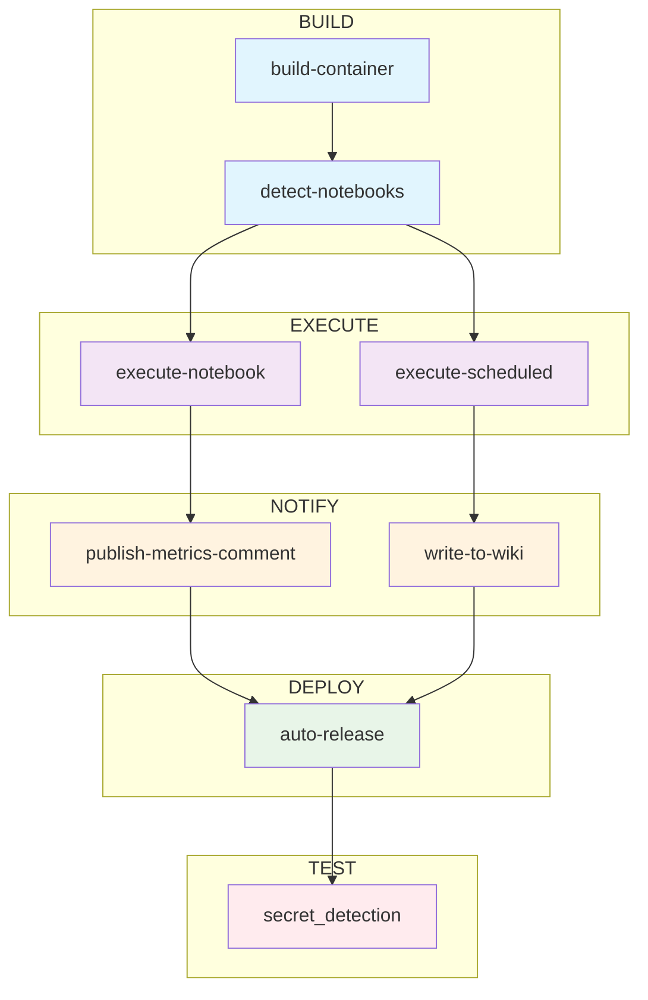

---

## 機械学習への CI/CD 活用アプローチ

モデルのトレーニング、推論、デプロイに関しては、ローカルマシンと CI を使用することにはトレードオフがあります。私たちのアプローチはどちらも実行できるよう柔軟性を持っています。

- ローカルマシンでモデルトレーニングや推論を実行する場合：
  - マシン固有のローカルリソースと Python ビルドを使用してトレーニングまたは推論コードを実行できます
  - 好みの実験トラッカーで実験を記録、表示、取得できます
  - 好みのモデル/パッケージレジストリからモデルアーティファクトをアップロード・ダウンロードできます

- GitLab CI/CD を使用してリモートでモデルトレーニングや推論を実行する場合：
  - モデルのサイズとニーズに応じて CPU または GPU ランナーを選択できます
  - **Dockerfile** または **requirements.txt** への変更に基づいてモデルコンテナを自動的に検出・再構築します
  - 開発、ステージング、本番環境で異なるコンテナを使用できます
  - 好みの実験トラッカーで実験を記録、表示、取得できます
  - モデルレジストリからモデルアーティファクトをアップロード・ダウンロードできます
  - MR のコメントとしてモデルメトリクスとパフォーマンスを自動的に報告し、他の人がレビューできます
  - 変更時にノートブックが自動的に実行されます
    - 手動オーバーライド：コミットメッセージで `[run path/to/notebook.ipynb]` を使用して特定のノートブックを強制実行するか、`[skip run]` で実行を防止します
    - 順次実行：1 つのコミットで複数のノートブックが変更された場合、自動的に順次実行されます
  - [スケジュールパイプライン](https://docs.gitlab.com/ee/ci/pipelines/schedules.html)を使用して設定した日時にトレーニングおよび推論 CI パイプラインを実行できます
  - [プロジェクト Wiki](https://docs.gitlab.com/ee/user/project/wiki/) に結果を記録できます
  - [GitLab for Slack](https://docs.gitlab.com/ee/user/project/integrations/gitlab_slack_application.html) 連携を使用してパイプラインステータスを監視できます

### データサイエンスモデルのトレーニングに CI を使用するメリット

- 再現性
- 自動化
- 速度
- 開発、ステージング、本番環境の分離
- マージリクエストとプロジェクト Wiki への結果の直接記録
- スケーラブルな GPU および CPU リソース
- スケジューリング
- CI パイプライン監視のための Slack 通知

## はじめに

このセクションでは、これらのパイプラインがどのように作成・設定されるかのメカニズムを詳細に説明します。**機械学習 CI トレーニングパイプラインを立ち上げることだけに興味がある場合は、直接[モデルトレーニングのステップバイステップ手順](/handbook/enterprise-data/platform/ci-for-ds-pipelines#model-training-step-by-step-instructions)にスキップしてください。**

**機械学習推論パイプラインを立ち上げることだけに興味がある場合は、直接[推論とデプロイのステップバイステップ手順](/handbook/enterprise-data/platform/ci-for-ds-pipelines#inference-and-deployment-step-by-step-instructions)にスキップしてください。**

### 主要リポジトリファイル

公開 **[GitLab Data Science CI Example](https://gitlab.com/gitlab-data/data-science-ci-example)** リポジトリには以下の主要ファイルがあります：

- **.gitlab-ci.yml**：各パイプラインで実行されるジョブを定義する CI/CD 設定ファイル。実際のパイプラインは [CI/CD コンポーネントカタログ](https://gitlab.com/explore/catalog/gitlab-data/ds-component-pipeline)から引き込まれており、指定が必要な変数のみがこの .yml に設定されています。
- **Dockerfile**：コンテナレジストリで使用する Docker イメージを作成する手順。ここでは CUDA ドライバーを持つ Ubuntu 22.04 上で Python 3.9 を使用しています。
- **requirements.txt**：コンテナにインストールする Python パッケージ
- **training_config.yaml**：トレーニングノートブックの設定
- **inference_config.yaml**：推論ノートブックの設定
- **notebooks/training_example.ipynb**：この例で使用するトレーニングノートブック
- **notebooks/inference_example.ipynb**：この例で使用する推論コードノートブック
- **xgb_model.json**：推論に使用されるトレーニング済みモデル

### CI/CD パイプラインステージ

## CI/CD を使用したモデルトレーニング

### トレーニングパイプライン

1. **ビルド**
   - **build-container**：**Dockerfile** または **requirements.txt** ファイルが変更されたとき、またはノートブックが実行されたときにコンテナを自動的に再構築します。スマートなコンテンツベースのキャッシングを使用して不必要な再構築を避けます。
   - **detect-notebooks**：ファイルの変更または手動オーバーライドに基づいて実行するノートブックを特定します
2. **実行**
   - **execute-notebook**：変更されたノートブック、または手動でトリガーされた特定のノートブックを自動的に実行します
3. **通知**（オプション）
   - **publish-metrics-comment**：モデルメトリクスをマージリクエストへのコメントとして書き込みます。ノートブックが正常に実行された後に実行されます。
4. **テスト**（オプション）
   - **secret_detection**：パイプラインでの潜在的な機密情報の露出をスキャンする[パイプラインシークレット検出](https://docs.gitlab.com/ee/user/application_security/secret_detection/)

### トレーニングのセットアップ

リポジトリ（**Code -> Repository**）を詳しく見てみましょう：

- **notebooks** ディレクトリで [training_example.ipynb](https://gitlab.com/gitlab-data/data-science-ci-example/-/blob/main/notebooks/training_example.ipynb) を開きます。
- CI パイプラインの仕組みを確認するには、[.gitlab-ci.yml](https://gitlab.com/gitlab-data/data-science-ci-example/-/blob/main/.gitlab-ci.yml) を表示します。パイプラインはシンプルな設定で [CI/CD カタログ](https://gitlab.com/explore/catalog)のコンポーネントを使用しています：
  - `COMMIT_RUNNER`：コミットでトリガーされるノートブック実行に使用するランナーを決定します
  - `SCHEDULED_RUNNER`：スケジュールされたパイプライン実行に使用するランナーを決定します
- 最後に、[training_config.yaml](https://gitlab.com/gitlab-data/data-science-ci-example/-/blob/main/training_config.yaml) を確認します。モデルのトレーニングのための変数を設定できます：
  - `outcome`：結果/ターゲット/従属変数。サンプルノートブックは scikit-learn の乳がんデータセットを使用しており、そのデータセットの結果フィールドは `target` という名前です
  - `optuna` 設定：サンプルノートブックは [Optuna](https://optuna.org/) を使用して xgboost モデルを実行します
  - `mlflow`：MLflow 実験トラッキングの設定

### モデルトレーニングのステップバイステップ手順

1. 公開 [GitLab Data Science CI Example](https://gitlab.com/gitlab-data/data-science-ci-example) リポジトリを[フォーク](https://docs.gitlab.com/ee/user/project/repository/forking_workflow.html)します。

2. **1 回限りのセットアップ**：

   - **ランナーの設定**：`.gitlab-ci.yml` を編集して `COMMIT_RUNNER` を希望のランナーに設定します（例：GPU 用の `saas-linux-medium-amd64-gpu-standard`）。変数を完全に削除してデフォルトランナーを使用することもできます。
   - **プロジェクトアクセストークン**：`Developer` ロールとスコープ `api, read_api, read_repository, write_repository` を持つ `REPO_TOKEN` という名前のプロジェクトアクセストークンを作成します（**Settings -> Access Tokens**）。
   - **実験トラッカー**（オプションですが推奨）：[MLflow クライアント互換手順](https://docs.gitlab.com/ee/user/project/ml/experiment_tracking/mlflow_client.html)に従って `MLFLOW_TRACKING_URI` と `MLFLOW_TRACKING_TOKEN` CI/CD 変数を設定します。
   - ***注意：*** 保護されていないブランチでの実験トラッキングを有効にするには「変数を保護する」フラグを解除します。ログに値が表示されないようにするには「変数をマスクする」にチェックを入れます。 

3. **モデルのトレーニング**：
   - 新しいブランチを作成します
   - トレーニングノートブックを変更します（例：`notebooks/training_example.ipynb`）
   - 変更をコミットします — **パイプラインが自動的に実行されます！**
   - トレーニングパイプラインの実行を確認するためにマージリクエストを作成します
     - 「Pipelines」をクリックするとトレーニングパイプラインが実行されているのが表示されます。ジョブをクリックして詳細情報を確認してください。
     - ***注意***：上記の「モデルメトリクスをマージリクエストに書き込む」のステップを設定していない場合、publish-metrics-comment ジョブは失敗します。パイプラインは警告付きで合格します

4. **手動実行**（必要な場合）：
   - ノートブックを変更せずに特定のノートブックを実行するには：任意のコミットメッセージに `[run notebooks/training_example.ipynb]` を追加します
   - ノートブックを変更しても実行を防ぐには：コミットメッセージに `[skip run]` を追加します

5. **結果の表示**：
   - パイプラインが正常に実行された後、モデルメトリクスを含む新しいコメントがマージリクエストに追加されます
   - CI ジョブを実験トラッカーに接続している場合は、出力とモデルアーティファクトも表示できます

## CI/CD を使用したモデル推論

### 推論パイプライン

1. **ビルド**
   - **build-container**：トレーニングパイプラインと同じスマートなコンテナ構築
   - **detect-notebooks**：実行する推論ノートブックを特定
2. **実行**
   - **execute-notebook**：***(マージリクエストのみ)*** 推論ノートブックを実行
   - **execute-scheduled**：***(スケジュールパイプラインのみ)*** 推論ノートブックを実行
3. **通知**（オプション）
   - **publish-metrics-comment**：***(マージリクエストのみ)*** モデルパフォーマンスメトリクスをマージリクエストのコメントとして書き込みます
   - **write-to-wiki**：***(マージリクエストのみ)*** モデルパフォーマンスメトリクスとジョブの詳細をプロジェクト Wiki に書き込みます
4. **デプロイ**（オプション）
   - **auto-release**：本番タグが作成されたときに自動的にデプロイをトリガー
5. **テスト**（オプション）
   - **secret_detection**：パイプラインでの潜在的な機密情報の露出をスキャンする[パイプラインシークレット検出](https://docs.gitlab.com/ee/user/application_security/secret_detection/)

### 推論のセットアップ

推論のセットアップはトレーニングとほぼ同じですが、いくつかの重要な違いがあります：

- **notebooks/inference_example.ipynb**：推論ロジックを含む
- **inference_config.yaml**：モデルファイルパスとフィールドマッピングを含む推論に特有の設定
- **xgb_model.json**：推論に使用されるトレーニング済みモデル
- **スケジュール実行**：本番推論ノートブックは自動的に実行されるようにスケジュールできます

### 推論とデプロイのステップバイステップ手順

1. **セットアップ**（トレーニング用にまだ行っていない場合）：
   - トレーニングセクションの同じ 1 回限りのセットアップステップに従います
   - **Wiki 設定**：`API_ENDPOINT` CI/CD 変数を作成します：`https://gitlab.com/api/v4/projects/<your_project_id>`

2. **MR コミット経由の推論**：
   - 推論ノートブックを作成または変更します（例：`notebooks/inference_example.ipynb`）
   - 変更をコミットします — **パイプラインが自動的に実行されます！**
   - 必要に応じて手動オーバーライドを使用します：コミットメッセージに `[run notebooks/inference_example.ipynb]` または `[skip run]` を追加します

3. **本番デプロイとスケジューリング**：
   - **本番リリースの作成**：**Code -> Tags -> New Tag** に移動し、`v1.0.0` のようなタグを作成します
   - **パイプラインのスケジュール**：**Build -> Pipeline schedules -> New schedule** に移動します
     - 希望のスケジュールを設定します（例：毎日正午）
     - ターゲットタグを本番タグに設定します（例：`v1.0.0`）
     - 変数を追加します：`SCORING_NOTEBOOK` = `notebooks/inference_example.ipynb`。これがスケジュールに従って実行されるノートブックです。
   - **テスト**：スケジュールを手動でトリガーして動作確認します
   - 

4. **本番環境の監視**：
   - **Plan -> Wiki** でスケジュール実行ログとメトリクスを確認します
   - **Settings -> Integrations -> GitLab for Slack** で Slack 通知を設定します
   - [GitLab For Slack アプリのドキュメント](https://docs.gitlab.com/ee/user/project/integrations/gitlab_slack_application.html)の手順に従います

## CI/CD を使用したモデルデプロイと本番化

### GitLab でのモデルデプロイのメリット

- **一元化されたモデル管理**：GitLab の実験トラッカーとモデルレジストリは、機械学習モデルの保存、バージョン管理、管理のための一元化された場所を提供します。
- **自動デプロイ**：GitLab CI/CD を使用して、本番タグの自動リリース機能でデプロイプロセスを自動化します。
- **スケーラビリティ**：GitLab のインフラは、需要の増加に応じてモデルサービング機能を簡単にスケーリングできます。
- **再現性**：GitLab のバージョン管理と CI/CD パイプラインを使用することで、モデルトレーニング、推論、デプロイプロセスが再現可能であることを確保できます。
- **ドキュメントとログ**：モデルパイプラインを監視し、失敗時に Slack 通知を受け取り、主要メトリクスをプロジェクト Wiki に直接記録します。
- **セキュリティ**：GitLab のセキュリティ機能を活用して、デプロイプロセス全体でモデルとデータが保護されていることを確保します。
- **継続的な改善**：本番環境のモデルを中断することなく、モデルのファインチューニング、再トレーニング、テストができます。
- **コスト効率**：モデルが実行されるときにのみリソースが消費されるため、モデル実行コストを削減できます。

### 本番デプロイプロセス

1. **本番タグの作成**：本番タグ（例：`v1.2.3`）を作成するとデプロイパイプラインが自動的にトリガーされ、本番コンテナが構築されます
2. **推論のスケジュール**：本番コンテナを使用して定期的に推論を実行するスケジュールパイプラインをセットアップします
3. **監視とログ**：すべての本番実行はメトリクスとジョブの詳細とともにプロジェクト Wiki に自動的に記録されます
4. **開発環境と本番環境の分離**：開発タグ（例：`dev-1.2.3`）は自動デプロイをトリガーしないため、安全なテストが可能です

## Slack 通知（オプション）

- Slack に GitLab for Slack アプリを追加します
- [GitLab For Slack アプリのドキュメント](https://docs.gitlab.com/ee/user/project/integrations/gitlab_slack_application.html)の手順に従います
- プロアクティブな監視のためにパイプラインが失敗したときのみ、データサイエンスチャンネルに通知が送信されるよう設定します
- 成功したパイプライン実行はノイズを減らすためにオプションで通知をスキップできます

**以上です！新しい自動検出システムにより、機械学習パイプラインがより簡単に使用できるようになりました。データサイエンスのモデリングニーズに合わせてこれらのパイプラインとノートブックを自由に変更してください。[データサイエンス ハンドブックページ](/handbook/enterprise-data/organization/data-science/)の他の優れたデータサイエンスリソースもぜひご確認ください。困難が生じた場合や、これらのパイプラインを改善する提案がある場合は、[Issue を開いてください](https://gitlab.com/gitlab-data/data-science-ci-example/-/issues/new)。ハッピーパイプライニング！**
