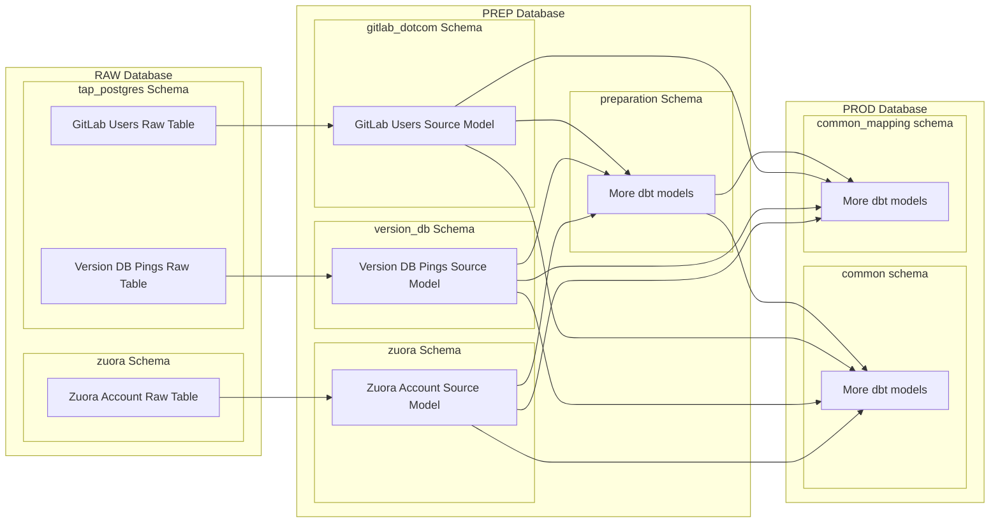
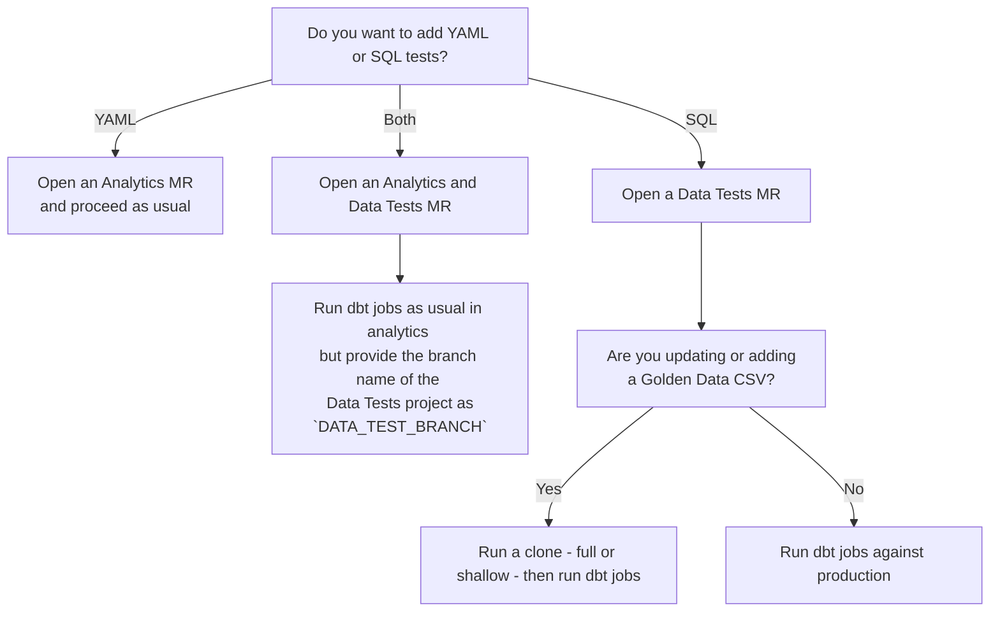

## クイックリンク {#quick-links}

- [プライマリプロジェクト](https://gitlab.com/gitlab-data/analytics/)
- [dbt docs](https://dbt.gitlabdata.com/)

## 概要と目的 {#what-and-why}

dbt は [data build tool](https://www.getdbt.com/) の略で、データウェアハウスにおけるデータ変換を管理するための[オープンソースプロジェクト](https://github.com/dbt-labs/dbt-core)です。データがウェアハウスに読み込まれると、dbt はアナリティクスを推進するために必要なすべてのデータ変換をチームが管理できるようにします。また、テストとドキュメントが組み込まれているため、生成・分析するテーブルに高い信頼を持つことができます。

次のリンクは、dbt とは何かを理解するための優れた概要を提供します。

- [What, exactly, is dbt?](https://www.getdbt.com/blog/what-exactly-is-dbt) - ツールを理解するための、より技術的でない概要です
- [What is dbt?](https://docs.getdbt.com/docs/introduction) - もう少し技術的で、ドキュメントから直接引用したものです

ではなぜ私たちは dbt を使うのでしょうか。いくつかの理由があります。

まず、活発なコミュニティを持つオープンソースのツールであることです。
オープンソースのツールを選択することで、私たちはより大きなデータコミュニティと協力でき、独自仕様のソリューションを選んだ場合よりも速く問題を解決できます。

次に、バージョン管理を念頭に置いて作られていることです。
私たち GitLab にとって、これは不可欠です。会社の構築と運営にこの製品を使っているからです。

3 つ目は、アナリストの言語である SQL を話すことです。
SQL は多くの人々の仕事において非常に重要な部分になりつつあるため、これにより貢献できる人の数が増えます。

最後に、[テストとドキュメント](https://docs.getdbt.com/docs/build/sql-models#testing-and-documenting-models)を最初から組み込むことで、チームがより速く動けるようにします。

dbt の基礎についてのさらに詳しい情報は、[data analyst onboarding issue template](https://gitlab.com/gitlab-data/analytics/blob/master/.gitlab/issue_templates/Team%3A%20Data%20Onboarding.md) を参照してください。

私たちは、一部のデータ変換のために dbt パッケージに依存することがあります。
[パッケージ管理](https://docs.getdbt.com/docs/build/packages)は dbt に組み込まれています。
利用可能なパッケージの完全なリストは [dbt Hub サイト](https://hub.getdbt.com)にあります。

## dbt の実行 {#running-dbt}

dbt の使用に興味がある場合、[dbt のドキュメントには優れたチュートリアル](https://docs.getdbt.com/docs/get-started-dbt)があり、Jaffle Shop という架空のビジネスのデータを扱えるようにセットアップする方法を学べます。

dbt を使ってデータチームのプロジェクトに貢献したい場合は、私たちの Snowflake インスタンスへのアクセス権を取得する必要があります。これは[アクセスリクエスト](/handbook/security/corporate/end-user-services/access-requests/access-requests/)を通じて行えます。

### ローカル環境 {#local-environment}

私たちは、私たちの dbt プロジェクトに貢献する GitLab チームメンバーの「ローカル」開発環境を実現するために、[make](https://www.gnu.org/software/make/manual/make.html) レシピを介してユーザー専用の開発データベースと[仮想環境](/handbook/enterprise-data/platform/dbt-guide/#venv-workflow)を使用しています。

#### 「ローカル」ユーザー専用開発データベース {#local-user-dedicated-development-databases}

チームメンバーに必要な場合、私たちは Snowflake ユーザーに対応する `_PREP` および `_PROD` のサフィックスを持つローカル開発データベースを作成します。これらは Snowflake の `PREP` および `PROD` データベースに対応します。これらは、ローカル環境内で実行されたときに私たちのメイン dbt プロジェクトのターゲットとなり、貢献者が私たちの dbt プロジェクトへの変更を開発・テストできるようにします。私たちの dbt プロジェクト内の開発プロセスの詳細は、[dbt 変更ワークフローのページ](/handbook/enterprise-data/how-we-work/dbt-change-workflow/)にあります。

これらの開発データベース内に構築されたデータは、ローカル開発でのみ使用されるものであるため、一時的なものと見なすべきです。dbt を最適に使用し、適切なセキュリティとコンプライアンスを確保するために、これらのデータベースは所有ユーザーによって定期的にクリーンアップされるべきです。[この Runbook](https://gitlab.com/gitlab-data/runbooks/-/blob/main/Snowflake/snowflake_dev_clean_up.md) を使うとそのプロセスを素早く簡単に行うことができ、各開発サイクルの終わりまたは始まりに実行することが推奨されます。さらに、私たちのデータ保持ポリシーおよび手順へのコンプライアンスを確保するため、変更されないまま **80 日** が経過した開発環境のすべてのテーブルを自動的に削除します。この保持期間は dbt プロジェクト内で `dev_db_object_expiration` 変数によって設定されており、テーブルは毎週末に削除されます。

注: 開発データベースは、対応するチームメンバーが Snowflake へのアクセスをデプロビジョニングされ次第（つまりオフボーディングや[非アクティブな利用](/handbook/enterprise-data/data-governance/data-management/#snowflake-1)の場合）削除されます。開発データベースには[バックアップ](/handbook/enterprise-data/platform/#backups)プロセスはありません。

#### 設定 {#configuration}

- 私たちの Snowflake インスタンスと、自分の Snowflake ユーザー専用の開発データベースへのアクセス権があることを確認します
- [Make](https://en.wikipedia.org/wiki/Make_(software)) がインストールされていることを確認します（新しい Mac には XCode とともにインストールされているはずです）
- ホームディレクトリに `.dbt` というフォルダを作成します
- `~/.dbt/` フォルダ内には、この[サンプルプロファイル](https://gitlab.com/gitlab-data/analytics/blob/master/admin/sample_profiles.yml)のような `profiles.yml` ファイルがあるはずです
- 可能な限り最小のウェアハウスを環境変数として保存すべきです。私たちの dbt ジョブは、ウェアハウスを識別するための変数名として `SNOWFLAKE_TRANSFORM_WAREHOUSE` を使用します。環境変数は次のように `.bashrc` または `.zshrc` ファイルに設定できます。
  - `export SNOWFLAKE_TRANSFORM_WAREHOUSE="DEV_XS"`
  - より多くのコンピューティングが必要な場合、この変数は実行時に上書きできます。その方法は[次のセクション](/handbook/enterprise-data/platform/dbt-guide/#choosing-the-right-snowflake-warehouse-when-running-dbt)で説明します。
- [analytics プロジェクト](https://gitlab.com/gitlab-data/analytics/)をクローンします
- Linux で実行する場合:
  - [Rancher Desktop がインストールされている](https://rancherdesktop.io/)ことを確認します

これらの手順の多くは、私たちが新しいアナリストに実行することを推奨する[オンボーディングスクリプト](https://gitlab.com/gitlab-data/analytics/-/blob/master/admin/onboarding_script.zsh)で行われることに注意してください。

#### dbt の実行時に適切な Snowflake ウェアハウスを選択する {#choosing-the-right-snowflake-warehouse-when-running-dbt}

私たちの Snowflake インスタンスには[複数のサイズのウェアハウス](https://docs.snowflake.com/en/user-guide/warehouses-overview)があり、dbt 開発者は実行するクエリに対して異なるレベルのコンピューティングリソースを割り当てられます。ウェアハウスが大きいほど、また実行時間が長いほど、クエリのコストは高くなります。例えば、Large ウェアハウスを 1 時間実行するコストは、X-Small ウェアハウスを 1 時間実行するコストの [8 倍](https://docs.snowflake.com/en/user-guide/warehouses-overview#warehouse-size)です。

複数のウェアハウスにアクセスできる場合は、`profiles.yml` ファイルにウェアハウスごとのエントリを作成できます。こうすることで、`dbt run` を呼び出すときにどのウェアハウスを実行すべきかを指定できるようになります。これは慎重に行うべきです。大きなウェアハウスを使うとパフォーマンスは向上しますが、コストが大幅に増加します。小さなウェアハウスを使う方向に倒してください。小さなウェアハウスのパフォーマンスが不十分だと分かった場合は、より大きなウェアハウスで再試行する前に原因を調査してください。非効率なモデルをより大きなウェアハウスに対して実行すると、開発中のコストが増加するだけでなく、本番でそのモデルが実行されるたびにコストが増加し、意図しない Snowflake コストの継続的な増加につながります。

#### 例 {#example}

あなたが dbt モデルに変更を加える必要があるデータチームのメンバーだと想像してください。あなたは X-Small ウェアハウスと Large ウェアハウスの両方にアクセスでき、`profiles.yml` ファイルは次のように設定されています。

```yaml
gitlab-snowflake:
  target: dev
  outputs:
    dev:
      type: snowflake
      threads: 8
      account: gitlab
      user: {username}
      role: {rolename}
      database: {databasename}
      warehouse: DEV_XS
      schema: preparation
      authenticator: externalbrowser
    dev_l:
      type: snowflake
      threads: 16
      account: gitlab
      user: {username}
      role: {rolename}
      database: {databasename}
      warehouse: DEV_L
      schema: preparation
      authenticator: externalbrowser
```

ターミナルとコードエディタを開いて新しいブランチを作成し、dbt モデルに調整を加えて変更を保存します。変更をテストするためにローカルで dbt を実行する準備ができたので、次のコマンドを入力します。`dbt run --models @{model_name}`。dbt はモデルの構築を開始し、デフォルトでは `ANALYST_XS` ウェアハウスを使用して構築します。しばらくすると、タイムアウトエラーによりビルドが失敗します。どうやら、あなたが構築しているモデルツリーには大きなモデルや複雑なモデルがいくつか含まれているようです。クエリを完了させるには、より大きなウェアハウスを使用する必要があります。ビルドを再試行したいのですが、今回は dbt に `ANALYST_XS` ではなく `ANALYST_L` ウェアハウスを使わせたいとします。そこで `dbt run --models @{model_name} --target dev_l` と入力します。これは `profiles.yml` ファイルの `dev_l` ターゲットで指定したウェアハウスを使うよう dbt に伝えるものです。数分後、ビルドが完了し、あなたは作業内容の確認を始めます。

#### Venv ワークフロー {#Venv-workflow}

Mac システムを使っているすべての人に推奨されるワークフローです。

#### dbt の使用 {#using-dbt}

- `DBT_PROFILE_PATH` 環境変数が設定されていることを確認します。[onboarding_script.zsh](https://gitlab.com/gitlab-data/analytics/-/blob/master/admin/onboarding_script.zsh)（最新で定期的に更新されるため、これを使うことを推奨します）を使っていれば設定されているはずですが、もし設定されていなければ、`.bashrc` または `.zshrc` に `export DBT_PROFILE_PATH="/<your_root_dir/.dbt/"` を追加するか、単にローカルのターミナルセッションで同じコマンドを実行することで設定できます
- pyenv をセットアップするために、次のスニペットを `.bashrc` または `.zshrc` に追加します。これは pyenv のインストール場所（オンボーディングスクリプト経由）を定義し、それをパスに追加し、pyenv の初期化スクリプトを実行して python の呼び出しを正しい pyenv 管理バージョンにルーティングするためのシェル統合をセットアップします。

 ```bash
export PYENV_ROOT="$HOME/.pyenv"
[[ -d $PYENV_ROOT/bin ]] && export PATH="$PYENV_ROOT/bin:$PATH"
eval "$(pyenv init -)"
 ```

- `.dbt/profiles.yml` を自分固有のユーザー設定で更新したことを確認します
- SSH 設定が [GitLab の手順](https://docs.gitlab.com/user/ssh/)に従ってセットアップされていることを確認します。鍵は `~/.ssh/` にあるはずで、パスワードなしで生成されているはずです。
  - メインプロジェクトで `dbt deps` を実行するために、[このプロジェクト](https://gitlab.com/gitlab-data/data-tests)へのアクセス権も必要になります。
- **注**: デフォルトのブラウザが chrome に設定されていることを確認します。組み込みの SSO ログインは chrome でのみ動作します
- **注**: `/analytics` リポジトリがある場所のフォルダにいることを確認します。すべてを適切にインストールしていれば、`jump analytics` で `dbt` コマンドを正常に実行するために必要な場所に移動できます。
- **注**: dbt を初めて実行する前に `make prepare-dbt` を実行します。これにより venv がインストールされていることが保証されます。
  - これは `poetry` インストールスクリプトのダウンロードと実行を含む[一連のコマンド](https://gitlab.com/gitlab-data/analytics/-/blob/master/Makefile#L111-114)を実行します。
  - `urllib.error.URLError: <urlopen error [SSL: CERTIFICATE_VERIFY_FAILED] certificate verify failed: unable to get local issuer certificate (_ssl.c:1124)>` のような証明書エラーが出た場合は、これらの [StackOverflow の手順](https://stackoverflow.com/questions/50236117/scraping-ssl-certificate-verify-failed-error-for-http-en-wikipedia-org/53310545#53310545)に従ってください。
  - `ssh: connect to host gitlab.com port 22: Operation timed out fatal: Could not read from remote repository.` のようなエラーが出て、正しいアクセス権があることとリポジトリが存在することを確認済みの場合、ポート 22 での GitLab への SSH 接続がネットワーク/ファイアウォールによってブロックされている SSH の問題である可能性があります。これを解決するには、SSH がポート 443 で GitLab の代替 SSH サービスを使うように設定します。

    手順:

    GitLab 用の SSH 設定を更新します。`~/.ssh/config` ファイルのポートを変更します。

    ```bash
    nano ~/.ssh/config
    ```

    次の設定を追加します。

    ```text
    Host gitlab.com
    Hostname altssh.gitlab.com
    User git
    Port 443
    PreferredAuthentications publickey
    IdentityFile ~/.ssh/id_rsa
    ```

    接続をテストします

    ```bash
    ssh -T git@gitlab.com
    ```

    プロンプトが表示されたらホスト鍵を受け入れます

    ```text
    The authenticity of host '[altssh.gitlab.com]:443 ([IP]:443)' can't be established.
    Are you sure you want to continue connecting (yes/no/[fingerprint])?
    ```

- `dbt` コンテナを起動してその中のシェルからコマンドを実行するには、`make run-dbt` を使います。このコマンドは dbt の実行に必要な依存関係をインストールまたは更新します。
- 依存関係の更新なしで `dbt` コンテナを起動するには、`make run-dbt-no-deps` を使います。このコマンドは、すでに dbt の依存関係がインストールされていることを前提とします。このコマンドを使う場合、いずれかの依存パッケージ（例: data-tests）に変更を加えると、それらの変更をリポジトリに反映させるために（シェル内から）`dbt deps` を実行するか、再度 `make run-dbt` を実行する必要があります。
- これにより、ローカルの `profiles.yml` やリポジトリのファイルを含め、`dbt` の実行に必要なすべてが自動的にインポートされます
- 現在のブランチのドキュメントを見るには、`make run-dbt-docs` を実行してから web ブラウザで `localhost:8081` にアクセスします。これには `profiles.yml` で `docs` プロファイルが設定されている必要があることに注意してください

#### なぜローカルの dbt 開発に仮想環境を使うのか {#why-do-we-use-a-virtual-environment-for-local-dbt-development}

私たちがローカルの dbt 開発に仮想環境を使うのは、各開発者がまったく同じ依存関係を持つまったく同じ dbt バージョンを実行することを保証するためです。これにより、ソフトウェアバージョンの違いによって開発者ごとに開発体験が異なるリスクを最小化し、全員のソフトウェアを同時にアップグレードしやすくします。さらに、私たちのステージング環境と本番環境はコンテナ化されているため、このアプローチにより、同じコードがすべての環境でできる限り予測可能に実行されることが保証されます。

#### ローカルでの変更ビルド {#build-changes-locally}

ローカル開発スペースで変更されたすべてのモデルをクローンしてビルドするには、[CI ジョブ](/handbook/enterprise-data/platform/ci-jobs/#build_changes)で使われているのと同じ `build_changes` プロセスを使えます。主な違いは、`WAREHOUSE` 変数の代わりに、開発者が異なるウェアハウスサイズで設定されたターゲットを使うために `TARGET` 変数を渡せることです。このプロセスを実行するには、仮想環境内から `make build-changes` コマンドを実行します。

```console
 ~/repos/analytics/transform/snowflake-dbt
╰─$ make build-changes DOWNSTREAM="+1" FULL_REFRESH="True" TARGET="dev_xl" VARS="key":"value" EXCLUDE="test_model"
```

[ビデオ紹介](https://youtu.be/0WiljW6Bihw)

#### SQLFluff リンター {#sqlfluff-linter}

私たちは、コードに [SQL スタイルガイド](/handbook/enterprise-data/platform/sql-style-guide/)を強制するために SQLFluff を使用しています。ドキュメントにあるリンターの実行方法に加えて、dbt 仮想環境内では `make lint-models` を使えます。デフォルトでは `lint-models` プロセスはすべての変更された sql ファイルをリントしますが、`MODEL` 変数を使って特定の sql ファイルをリントでき、`FIX` 変数を使ってリンターの fix コマンドを実行して sql ファイルに変更を加えることができます。

```console
~/repos/analytics/transform/snowflake-dbt
╰─$ make lint-models
sqlfluff lint models/workspaces/workspace_data/mock/data_type_mock_table.sql

~/repos/analytics/transform/snowflake-dbt
╰─$ make lint-models FIX="True" MODEL="dim_date"
sqlfluff fix ./models/common/dimensions_shared/dim_date.sql
```

[ビデオ紹介](https://youtu.be/MwVJHf7XvrI)

#### ローカルでの SAFE チェック {#safe-check-locally}

モデルの SAFE カバレッジをテストするには、[CI ジョブ](/handbook/enterprise-data/platform/ci-jobs/#safe_model_script)で使われているのと同じ `safe_model_script` プロセスを使えます。このプロセスを実行するには、仮想環境内から `make safe-check` コマンドを実行します。

```console
 ~/repos/analytics/transform/snowflake-dbt
╰─$ make safe-check
```

#### ローカルでのモデルのクローン {#cloning-models-locally}

このコマンドは、dbt のセレクション構文を使ったゼロコピークローニングを可能にし、リネージ全体をクローンできます。これは dbt を使ってモデルを実行するよりもはるかに高速かつ低コストですが、dbt の検証は一切実行しません。そのため、すべての dbt ユーザーには環境のセットアップにこのコマンドを使うことが推奨されます。

**前提条件:**

- dbt がセットアップされていて、モデルを実行できることを確認します
- これらのローカルコマンドは `/.dbt/profiles.yml` で設定された Snowflake ユーザーを使って実行され、あなたのユーザーが権限を持たないテーブルはスキップされます。
- これらのコマンドは、特定のリネージを選択するための変数として `DBT_MODELS` を使い、dbt CI パイプラインと同じロジックで実行されます。
- これらのコマンドを実行するには `/analytics` ディレクトリにいる必要があります。

**使い方:**

新しい `clone-dbt-select-local-user-noscript` コマンドを使うには、`DBT_MODELS` 変数を指定する必要があります。例えば、`dim_subscription` モデルのみをクローンするには、次のコマンドを実行します。

```console
make DBT_MODELS="dim_subscription" clone-dbt-select-local-user-noscript
```

これにより、`prod` ブランチから dbt モデルがローカルのユーザーデータベース（例: `{user_name}_PROD`）にクローンされます。dbt セレクタ（@、+ など）を使って、ローカルデータベースにコピーしたいリネージ全体を選択できます。

**ヒント:**

- 以下のようなエラーに遭遇した場合:

  ```console
  Compilation Error
    dbt found 7 package(s) specified in packages.yml, but only 0 package(s)
    installed in dbt_packages. Run "dbt deps" to install package dependencies.
  ```

- analytics フォルダのルートから `make dbt-deps` を実行して、コマンドを再試行します。

**移行に関する注記:**

私たちは新しい `clone-dbt-select-local-user-noscript` コマンドへの移行を積極的に進めています。古い `clone-dbt-select-local-user` コマンドは限られた期間まだ利用できますが、できるだけ早く新しいコマンドの使用を開始することを推奨します。

##### ローカルユーザー DB へのクローン（python スクリプト - `dbt clone` 以前） {#cloning-into-local-user-db-python-scripts---pre-dbt-clone}

- これは指定された dbt モデルのリネージをアクティブなブランチ DB（例: `{user_name}_PROD`）にクローンします
  - `make DBT_MODELS="<dbt_selector>" clone-dbt-select-local-user`
  - 例: `make DBT_MODELS="+dim_subscription" clone-dbt-select-local-user`

##### ブランチ DB へのクローン {#cloning-into-branch-db}

- これは指定された dbt モデルのリネージをアクティブなブランチ DB（例: `{branch_name}_PROD`）にクローンします。これは CI パイプラインのクローンステップを実行するのと同等です。
- Master では動作しません。
  - `make DBT_MODELS="<dbt_selector>" clone-dbt-select-local-branch`
  - 例: `make DBT_MODELS="+dim_subscription" clone-dbt-select-local-branch`

### 本番オーケストレーション {#production-orchestration}

本番の dbt モデルは [Apache Airflow](https://airflow.apache.org/) を使ってオーケストレーションされます。各スケジュールされたパイプラインは Kubernetes ポッド内で Airflow DAG として実行され、Snowflake に対して dbt コマンドを実行します。

#### 現状 {#current-state}

各本番パイプラインは、`extract` リポジトリの [`dags/transformation`](https://gitlab.com/gitlab-data/extract/-/tree/main/dags/transformation) ディレクトリに個別の Python ファイルとして定義されています。スケジュール、dbt セレクタ、Snowflake ウェアハウスサイズは各ファイル内にハードコードされています。

| DAG ID | スケジュール | 説明 | ソース |
|---|---|---|---|
| [`dbt_snapshots`](https://gitlab.com/gitlab-data/extract/-/blob/main/dags/transformation/dbt_snapshot.py) | 毎日 07:00 UTC | すべての dbt スナップショットを実行し、レガシースナップショットモデルをビルド・テストします | `dbt_snapshot.py` |
| [`dbt_edm_snapshots`](https://gitlab.com/gitlab-data/extract/-/blob/main/dags/transformation/dbt_edm_snapshot.py) | 毎日 17:00 UTC | EDM タグ付きスナップショットを実行し、EDM スナップショットモデルをビルド・テストします | `dbt_edm_snapshot.py` |
| [`t_gitlab_customers_db_dbt`](https://gitlab.com/gitlab-data/extract/-/blob/main/dags/transformation/gitlab_dot_com_dbt.py) | 毎日 06:30 UTC | GitLab customers データベースのスナップショット、インクリメンタルモデルのリフレッシュ、テストを実行します | `gitlab_dot_com_dbt.py` |
| [`t_gitlab_com_db_dbt`](https://gitlab.com/gitlab-data/extract/-/blob/main/dags/transformation/gitlab_dot_com_dbt.py) | 1 日 2 回、07:00 と 19:00 UTC | GitLab.com データベースのスナップショット、インクリメンタルモデルのリフレッシュ、テストを実行します | `gitlab_dot_com_dbt.py` |
| [`dbt`](https://gitlab.com/gitlab-data/extract/-/blob/main/dags/transformation/dbt.py) | 毎日 08:45 UTC | すべての product および non-product モデル、workspace モデルのインクリメンタルリフレッシュとテスト | `dbt.py` |
| [`dbt_full_refresh_monthly`](https://gitlab.com/gitlab-data/extract/-/blob/main/dags/transformation/dbt_full_refresh_monthly.py) | 毎月第 1 日曜日の 08:45 UTC | すべての dbt モデルのフルリフレッシュ | `dbt_full_refresh_monthly.py` |
| [`dbt_sfdc_validation_and_run`](https://gitlab.com/gitlab-data/extract/-/blob/main/dags/transformation/dbt_sfdc_validation_and_run.py) | 6 時間ごと | SFDC ソースモデルと Salesforce オポチュニティモデルをビルド・テストします | `dbt_sfdc_validation_and_run.py` |
| [`dbt_netsuite_actuals_income_cogs_opex`](https://gitlab.com/gitlab-data/extract/-/blob/main/dags/transformation/dbt_netsuite_actuals_income_cogs_opex.py) | 月〜金、1 日 4 回 | 営業日のみ NetSuite actuals モデルを実行します | `dbt_netsuite_actuals_income_cogs_opex.py` |
| [`t_omamori_external`](https://gitlab.com/gitlab-data/extract/-/blob/main/dags/transformation/dbt_omamori_external_table_transform.py) | 1 時間ごと | Omamori 外部テーブルをリフレッシュし、ソースモデルを実行します | `dbt_omamori_external_table_transform.py` |
| [`dbt_gdpr_delete_requests`](https://gitlab.com/gitlab-data/extract/-/blob/main/dags/transformation/dbt_gdpr_delete.py) | 毎日 03:00 UTC | インクリメンタルな GDPR 削除リクエストを処理します | `dbt_gdpr_delete.py` |
| [`dbt_company_scorecard`](https://gitlab.com/gitlab-data/extract/-/blob/main/dags/transformation/dbt_company_scorecard.py) | 1 日 2 回、08:00 と 20:00 UTC | GitLab.com データが利用可能になった後、Company Scorecard の dbt モデルをリフレッシュします | `dbt_company_scorecard.py` |

#### 将来の状態（進行中） {#future-state-in-progress}

オーケストレーションは、[Standardize dbt Model Orchestration with Frequency-Based DAGs](https://gitlab.com/groups/gitlab-data/-/epics/1555) イニシアチブの一環として、設定駆動型システムへ移行されています。目標は、パイプラインの追加と保守を容易にし、個々の dbt モデルに自身のリフレッシュ頻度の所有権を持たせることです。

すべての dbt モデルのデフォルトの前提は、新しいデータが毎日到着するというものであり、したがってモデルは毎日のペースで実行されます。標準的な処理頻度に加えて、毎月の保守ウィンドウが毎月第 1 日曜日に実行されます。この保守実行は、すべてのインクリメンタルにビルドされたモデルのフルリフレッシュを実行し、時間の経過とともに蓄積された可能性のあるデータドリフトから回復します。毎月の保守ウィンドウは、他のすべての処理頻度に優先します。スケジュールが保守ウィンドウと重なる DAG は、その実行については抑制されます。この優先順位は意図的なものです。重複処理を避け、通常のペースが再開する前にデータ品質が回復されることを保証します。

**設定駆動型 DAG 生成**

各パイプラインに新しい Python DAG ファイルを書く代わりに、ジョブ定義は単一の YAML マニフェスト — [`dbt_jobs_manifest.yml`](https://gitlab.com/gitlab-data/extract/-/blob/main/dags/transformation/dbt_jobs_manifest.yml) — に集約され、単一の Python プロセッサ — [`dbt_jobs_manifest_processor.py`](https://gitlab.com/gitlab-data/extract/-/blob/main/dags/transformation/dbt_jobs_manifest_processor.py) — がマニフェストを読み取り、パース時にジョブエントリごとに 1 つずつ Airflow DAG を動的に生成します。

マニフェスト内の各ジョブエントリは次をサポートします。

- **`schedule`** – DAG が実行されるタイミングを定義する cron 式
- **`exclusion_schedule`** – スキップする日付や曜日を指定する任意の cron 式（例: 毎月の保守のために毎月第 1 日曜日をスキップ）
- **`warehouse`** – ジョブに使用するデフォルトの Snowflake ウェアハウス
- **`tasks`** – dbt ステップの順序付きリスト。各ステップは `selector`、任意の `warehouse` 上書き、`resource_types` フィルタ（例: `model`、`snapshot`、`seed`、`test`）を持ちます

`company_scorecard` パイプラインは、既存のスケジュールと動作を維持しつつ、マニフェストで定義される最初のものです。上記の残りのパイプラインは、時間をかけてマニフェストへ移行し、最終的に個別の DAG ファイルを置き換える予定です。

`dbt_jobs_manifest.yml` のジョブエントリの例:

```yaml
jobs:
  company_scorecard:
    description: Runs twice daily at 08:00 and 20:00 UTC. Refreshes Company Scorecard dbt models after gitlab_dotcom data is available.
    schedule: "0 8,20 * * *"
    exclusion_schedule: "* * * * SUN#1"
    warehouse: TRANSFORMING_S
    tasks:
      - name: build_nodes
        selector: company_scorecard_report
        warehouse: TRANSFORMING_L
        resource_types:
          - model
          - snapshot
          - seed
      - name: test_nodes
        selector: company_scorecard_report
        resource_types:
          - test
```

**モデルレベルの頻度設定**

より長期的なビジョンは、各 dbt モデルが `config.meta.frequency` の値を使って自身のリフレッシュ頻度を宣言することです。これにより `selectors.yml` 内に頻度ベースの dbt セレクタが構築され、それがマニフェスト内のジョブエントリ — サポートされる頻度ごとに 1 ジョブ — に直接マッピングされます。

サポートされる頻度の値は次のとおりです。

| 頻度 | 説明 |
|---|---|
| `one_hour` | 1 時間ごとにリフレッシュ |
| `four_hour` | 4 時間ごとにリフレッシュ |
| `six_hour` | 6 時間ごとにリフレッシュ |
| `eight_hour` | 8 時間ごとにリフレッシュ |
| `twelve_hour` | 12 時間ごとにリフレッシュ |
| `twenty_four_hour` | 毎日リフレッシュ（すべてのモデルのデフォルト） |
| `weekly` | 毎週リフレッシュ |
| `first_week_of_month` | 毎月第 1 週にリフレッシュ |
| `monthly` | 毎月リフレッシュ |

デフォルトの頻度は `twenty_four_hour` であり、新しいモデルには明示的な設定が不要であることを意味します。頻度は `dbt_project.yml` のディレクトリレベルで設定するか、モデルレベルで上書きできます。

```jinja
{{ config(meta={"frequency": "twelve_hour"}) }}
```

特定の頻度に対するモデルの適格性は、モデル自身のランタイムだけでなく、その **フルリネージのビルド時間** によって決定されます。これは、頻度ウィンドウ内で完全な上流グラフをビルドできることを保証するためです。重複ビルドを避けるため、各モデルはちょうど 1 つの処理頻度に現れるべきです。

### Docker ワークフロー {#docker-workflow}

以下は主に Linux を使うユーザーに推奨されるワークフローです。venv ワークフローは前提条件が少なく、かなり高速だからです。

ローカルで `dbt` とその依存関係を扱う複雑さの一部を抽象化するため、メインの [analytics プロジェクト](https://gitlab.com/gitlab-data/analytics/)は `Docker` コンテナ内から `dbt` を使うことをサポートしています。
私たちは [`data-image`](https://gitlab.com/gitlab-data/data-image) プロジェクトからコンテナをビルドします。
これを実現するためのコマンドが `Makefile` 内にあり、さまざまな `make` コマンドとその動作について疑問があるときはいつでも、`make help` を使ってコマンドのリストとそれぞれの動作を取得できます。

初回実行の前（およびコンテナが更新されるたび）に、必ず次のコマンドを実行してください。

1. `make update-containers`
1. `make cleanup`

これらのコマンドにより、最新バージョンのコンテナを取得し、ローカルの `Docker` 環境を全般的にクリーンアップできます。

#### dbt の使用 {#using-dbt-1}

- `DBT_PROFILE_PATH` 環境変数が設定されていることを確認します。[onboarding_script.zsh](https://gitlab.com/gitlab-data/analytics/-/blob/master/admin/onboarding_script.zsh)（最新で定期的に更新されるため、これを使うことを推奨します）または [onboarding_script.sh](https://gitlab.com/gitlab-data/analytics/blob/master/admin/onboarding_script.sh) を使っていれば設定されているはずですが、もし設定されていなければ、`.bashrc` または `.zshrc` に `export DBT_PROFILE_PATH="/<your_root_dir/.dbt/"` を追加するか、単にローカルのターミナルセッションで同じコマンドを実行することで設定できます
- `.dbt/profiles.yml` を自分固有のユーザー設定で更新したことを確認します
- SSH 設定が [GitLab の手順](https://gitlab.com/help/ssh/README)に従ってセットアップされていることを確認します。鍵は `~/.ssh/` にあるはずで、パスワードなしで生成されているはずです。
  - メインプロジェクトで `dbt deps` を実行するために、[このプロジェクト](https://gitlab.com/gitlab-data/data-tests)へのアクセス権も必要になります。
- `dbt` コンテナを起動してその中のシェルからコマンドを実行するには、`make dbt-image` を使います
- これにより、ローカルの `profiles.yml` やリポジトリのファイルを含め、`dbt` の実行に必要なすべてが自動的にインポートされます
  - 不足している変数（`GIT_BRANCH`、`KUBECONFIG`、`GOOGLE_APPLICATION_CREDENTIALS` など）に関する WARNING が表示される場合があります。Airflow 上で開発しているのでなければ、これは問題なく、想定どおりです。
- 現在のブランチのドキュメントを見るには、`make dbt-docs` を実行してから web ブラウザで `localhost:8081` にアクセスします。これには `profiles.yml` で `docs` プロファイルが設定されている必要があることに注意してください
- `dbt` コンテナ内に入ったら、通常どおり任意の `dbt` コマンドを実行します
- リポジトリ内のいずれかのファイルに加えた変更は、コンテナ内で自動的に更新されます。エディタでファイルを変更したときにコンテナを再起動する必要はありません!

#### コマンドラインチートシート {#command-line-cheat-sheet}

これは[プライマリコマンドリファレンス](https://docs.getdbt.com/reference/dbt-commands)の簡略版です。

dbt 固有:

- [`dbt clean`](https://docs.getdbt.com/reference/commands/clean) - `/dbt_modules`（deps の実行時に作成される）と `/target` フォルダ（モデルの実行時に作成される）を削除します
- [`dbt run`](https://docs.getdbt.com/reference/commands/run) - 通常の実行
- モデル選択構文（[ソース](https://docs.getdbt.com/reference/node-selection/syntax)）。モデルを指定することで、関連すると思われるモデルだけを実行/テストでき、多くの時間を節約できます。ただし、重要な上流の依存関係を指定し忘れるリスクがあるので、構文を十分に理解しておくとよいでしょう。
  - `dbt run --models modelname` - `modelname` のみを実行します
  - `dbt run --models +modelname` - `modelname` とすべての親を実行します
  - `dbt run --models modelname+` - `modelname` とすべての子を実行します
  - `dbt run --models +modelname+` - `modelname` と、すべての親および子を実行します
  - `dbt run --models @modelname` - `modelname`、すべての親、すべての子、さらにすべての子のすべての親を実行します
  - `dbt run --exclude modelname` - `modelname` を除くすべてのモデルを実行します
  - これらはすべてフォルダ選択構文でも動作することに注意してください。
    - `dbt run --models folder` - フォルダ内のすべてのモデルを実行します
    - `dbt run --models folder.subfolder` - サブフォルダ内のすべてのモデルを実行します
    - `dbt run --models +folder.subfolder` - サブフォルダ内のすべてのモデルとすべての親を実行します
- `dbt run --full-refresh` - インクリメンタルモデルをリフレッシュします
- [`dbt test`](https://docs.getdbt.com/reference/commands/test) - カスタムデータテストとスキーマテストを実行します。ヒント: `dbt test` は `dbt run` で参照されたのと同じ `--model` および `--exclude` 構文を取ります
- [`dbt seed`](https://docs.getdbt.com/reference/commands/seed) - `data-paths` [ディレクトリ](https://gitlab.com/gitlab-data/analytics/-/tree/master/transform/snowflake-dbt/data)で指定された csv ファイルをデータウェアハウスに読み込みます。本ガイドの [seeds セクション](/handbook/enterprise-data/platform/dbt-guide/#seeds)も参照してください
- [`dbt compile`](https://docs.getdbt.com/reference/commands/compile) - モデル内のテンプレート化されたコードをコンパイルし、結果を `target/` フォルダに出力します。
    dbt は 'dbt run' 時にモデルを自動的にコンパイルするため、これは定期的に実行する必要のあるコマンドではありません。
    一般的な使用例の 1 つは、コンパイルされたコードをモデルのデバッグのために Snowflake で直接実行できることです。

    [オンボーディングスクリプト](https://gitlab.com/gitlab-data/analytics/-/blob/master/admin/onboarding_script.sh)を実行した場合のみ動作します:
- `dbt_run_changed` - 変更されたモデルのみを実行するために私たちがあなたのコンピューターに追加した関数です（docker コンテナ内からアクセスできます）
- `cycle_logs` - dbt ログをクリアするために私たちがあなたのコンピューターに追加した関数です（docker コンテナ内からはアクセスできません）
- `make dbt-docs` - ローカルコンテナを起動して web ブラウザで `dbt` ドキュメントを提供するコマンドで、`localhost:8081` で見られます

### VSCode 拡張機能: dbt Power User {#vscode-extension-dbt-power-user}

[dbt Power User](https://marketplace.visualstudio.com/items?itemName=innoverio.vscode-dbt-power-user) は、VScode を dbt とシームレスに連携させます。以下のガイドでは、[Venv ワークフロー](/handbook/enterprise-data/platform/dbt-guide/#Venv-workflow)に従った場合に dbt Power User をインストールできます。

始める前に、VScode で調整すべき設定がいくつかあります。

- Code > Settings > Settings… に移動します
  - 'Python info visibility' を検索 > この設定を 'Always' に設定します
  - ターミナルで、[dbt の使用](/handbook/enterprise-data/platform/dbt-guide/#using-dbt)セクションで説明されているとおり `make run-dbt` を実行します。実行されて新しいシェルが生成されたら、`echo $VIRTUAL_ENV` を実行します。その値をコピーします。
    - VScode の設定で 'venv path' を検索します。
    - この設定を、前のステップでコピーしたパスに設定します。標準的なインストールに従っていれば、`/Users/<username>/Library/Caches/pypoetry/virtualenvs/` のようになるはずです。執筆時点ではパスの最後の部分 `analytics-*******-py3.10` は削除してください。
- VScode を /analytics で開きます（File > Open Folder... または Workspace...）
- VScode の右下に python インタープリタセレクタが表示されるので、それをクリックします
  - ポップアップフィールドに、`poetry` タイプとして表示される analytics の venv と、dbt に使われるものが表示されるはずです。それを選択します。
- 拡張機能 `dbt-power-user` をインストールします
- [こちら](https://marketplace.visualstudio.com/items?itemName=innoverio.vscode-dbt-power-user)の `How to setup the extension > Associate your .sql files the jinja-sql language` ステップのみに従います

- VScode で File ビューに戻り、`/analytics` を vscode で開いたときに作成された `analytics/.vscode/settings.json` ファイルを見つけます（見つからない場合は `.vscode/settings.json` を作成します）。このファイルは、`/analytics` で開かれたときの VScode の設定を定義します

  `settings.json` ファイルに次を追加します。

  ```console
  {
  "terminal.integrated.env.osx": {
  "SHELL":"/bin/zsh",
  "DBT_PROFILES_DIR": "../../../.dbt/",
  "DATA_TEST_BRANCH":"main",
  "SNOWFLAKE_PROD_DATABASE":"PROD",
  "SNOWFLAKE_PREP_DATABASE":"PREP",
  "SNOWFLAKE_SNAPSHOT_DATABASE":"SNOWFLAKE",
  "SNOWFLAKE_LOAD_DATABASE":"RAW",
  "SNOWFLAKE_STATIC_DATABASE":"STATIC",
  "SNOWFLAKE_PREP_SCHEMA":"preparation",
  "SNOWFLAKE_TRANSFORM_WAREHOUSE":"ANALYST_XS",
  "SALT":"pizza",
  "SALT_IP":"pie",
  "SALT_NAME":"pepperoni",
  "SALT_EMAIL":"cheese",
  "SALT_PASSWORD":"416C736F4E6F745365637265FFFFFFAB"
  },
  "dbt.queryLimit": 500
  }
  ```

  注: コードベースがこれらの環境変数の新しい値で更新された場合、analytics リポジトリのルートにある `Makefile` の変数の値に従って `settings.json` を更新する必要があります。

- `DBT_PROFILES_DIR` を編集して、`~/.dbt/` フォルダを指すようにします（パスは相対パスでなければならず、`/analytics` フォルダから `~/.dbt` フォルダを指す必要があるようです）
- VScode を再起動し、analytics ワークスペースを再度開きます
- Command+クリックでモデル間を移動して、dbt-power-user が動作していることを確認します（dbt は初期化に少し時間が必要です）。
dbt が最新でないという警告は無視してください。
- 適当なモデルを開き、sql コードを右クリックして `run dbt model` をクリックし、出力を確認します。

  次のようなタイプのエラーが出る場合:

  ```console
  dbt.exceptions.RuntimeException: Runtime Error
    Database error while listing schemas in database ""PROD_PROD""
    Database Error
      002043 (02000): SQL compilation error:
      Object does not exist, or operation cannot be performed.
  ```

- その場合は dbt が使用するターゲットプロファイルを変更します。dbt-power-user 拡張機能の設定（Extensions > dbt-power-user > 歯車 > Extension settings）に移動し、`Dbt: Run Model Command Additional Params` という設定を編集します（build も同様）

  {}
  VS code の UI からモデルを実行/ビルド/テストする際、ポップアップするターミナルウィンドウはログ出力にすぎません。Cmd+C はジョブを停止せず、VS code のゴミ箱アイコンをクリックしても停止しません。VScode から開始したジョブを停止したい場合は、Snowflake UI とジョブリストを通じて、そこからジョブを kill してください。
  {}

### dbt プロジェクトへの貢献のための設定 {#configuration-for-contributing-to-dbt-project}

dbt への貢献に興味がある場合、ローカル環境を簡単にセットアップするための推奨方法を以下に示します。

- [dbt プロジェクト](https://github.com/dbt-labs/dbt-core)を GitHub UI 経由で自分のパーソナル名前空間にフォークします
- プロジェクトをローカルにクローンします
- 次のコマンドに従って dbt 用の仮想環境（venv）を作成します

  ```bash
  cd ~
  mkdir .venv # This should be in your root "~" directory
  python -m venv .venv/dbt
  source ~/.venv/dbt/bin/activate
  pip install dbt
  ```

- 仮想環境を起動しやすくするために、`alias dbt!="source ~/.venv/dbt/bin/activate"` を `.bashrc` または `.zshrc` に追加することを検討します
- 同じターミナルウィンドウで dbt プロジェクトに移動します。コマンドプロンプトの先頭に `(dbt)` が表示されるはずです
- `pip install -r editable_requirements.txt` を実行します。これにより、venv 内でローカルに dbt を実行したときに、自分のマシン上のコードを使うことが保証されます。
- `which dbt` を実行して、venv を指していることを確認します
- ローカルでコードを開発し、通常どおり変更をコミットして、GitHub の自分の名前空間にプッシュします

MR のためにコードを提出する準備ができたら、[CLA に署名](https://github.com/dbt-labs/dbt-core/blob/dev/0.15.1/CONTRIBUTING.md#signing-the-cla)していることを確認してください。

## スタイルおよび使用法ガイド {#style-and-usage-guide}

### モデル構造 {#model-structure}

私たちがより Kimball スタイルのウェアハウスへ移行するにつれて、ウェアハウス内およびプロジェクト構造内でのモデルの整理方法を改善しています。
以下のセクションはすべて、dbt のデフォルトである `models` ディレクトリ配下のトップレベルディレクトリになります。
この構造は、dbt Labs の[プロジェクト構造化方法](https://docs.getdbt.com/best-practices/how-we-structure/1-guide-overview)に着想を得ています。

{}
Kimball ディメンショナルモデリングに注力する前は、私たちは ["Agile Data Warehouse Design" by Corr and Stagnitto](https://books.google.com/books/about/Agile_Data_Warehouse_Design.html?id=TRWFmnv8jP0C&source=kp_book_description) で紹介された BEAM\* アプローチに着想を得たモデリングを採用していました。
既存のモデルの多くは、依然としてそのパターンに従っています。
このセクションの情報は、ハンドブックの以前のイテレーションからのものです。

- （最終的な）`_xf` dbt モデルの目標は `BEAM*` テーブルであるべきです。これは、ビジネスイベント分析＆モデル構造に従い、ビジネスを測定する who、what、where、when、how many、why、how の質問の組み合わせに答えることを意味します。
- `base models` - ソーステーブルを参照する唯一の dbt モデルです。ベースモデルは最小限の変換ロジックを持ちます（通常、データ整合性の問題がある行や分析対象外として明示的にフラグが立てられた行のフィルタリング、および分析を容易にするための列のリネームに限定されます）。`legacy` スキーマにあり、`end-user models` の `ref` 文で使われます
- `end-user models` - 分析に使われる dbt モデルです。モデルの最終版は、`BEAM*` テーブルを目標とする場合、おそらく `_xf` サフィックスで示されます。ビジネスイベント分析＆モデル構造に従い、ビジネスを測定する who、what、where、when、how many、why、how の質問の組み合わせに答えるべきです。エンドユーザーモデルは `legacy` スキーマにあります。

どの新しい Kimball モデルがレガシーモデルを置き換えるかを判断するには、[Use This Not That](https://docs.google.com/spreadsheets/d/1yr-J4ztkyl9vmJ6Euj58gczDLTIss7xIher5SV-1VDY/edit?usp=sharing) のマッピングを参照してください。
{}

{}
FY21-Q4 に、`analytics` データベースを置き換えるために `prod` および `prep` データベースが導入されました。これら 2 つの新しいデータベースが `analytics` データベースを完全に置き換えます。

ローカル開発も、カスタムスキーマからカスタムデータベースへ切り替えられました。
{}

#### Sources

すべての生データは、依然として Snowflake の `RAW` データベースにあります。
これらの生テーブルは `source tables`（ソーステーブル）または `raw tables`（生テーブル）と呼ばれます。
これらは通常、元のデータソースを示すスキーマ（例: `netsuite`）に格納されます。

ソースは dbt 内で `sources.yml` ファイルを使って定義されます。

- 私たちは dbt の sources でデータベースを参照するために変数を使います。これにより、Snowflake クローンで変更をテストする場合に、参照をプログラム的に設定できます
- 通常の規約を満たさない名前や意味が不明確な名前のソーステーブルを扱うときは、元の名前が雑然としていたり紛らわしかったりする場合に、identifier を使ってソーステーブル名を上書きします。([identifier の使用に関するドキュメント](https://docs.getdbt.com/reference/resource-properties/identifier))

  ```yaml
  # Good
  tables:
    - name: bizible_attribution_touchpoint
      identifier: bizible2__bizible_attribution_touchpoint__c

  # Bad
  tables:
    - name: bizible2__bizible_attribution_touchpoint__c
  ```

##### ソースモデル {#source-models}

私たちは、すべての生データの上に非常に薄いソースレイヤーを強制しています。
このディレクトリは、ソース固有の変換の大部分が格納される場所です。
これらは生データから直接取得し、ファクトとディメンションを作るために必要な準備作業を行う「base」モデルであり、*次のことのみ* を行うべきです。

- フィールドをユーザーフレンドリーな名前にリネームする
- 列を適切な型にキャストする
- 予見可能な将来にわたって 100% 有用であることが保証される最小限の変換。その例は、データが雑然としていることが分かっているフィールドから Salesforce ID を解析することです。
- 論理的に命名されたスキーマへの配置

基礎となる生データが完璧にキャストされ命名されている場合でも、フォーマットを強制するソースモデルは依然として存在すべきです。
これはエンドユーザーの利便性のためであり、見るべき場所が 1 つだけになり、この完璧なデータが機密である状況で権限設定がよりクリーンになります。

ソースモデルでは次のことを行うべきではありません。

- データの削除
- 他のテーブルへの結合
- 列の意味を根本的に変える変換

あらゆる意味において、ソースモデルは大多数のユーザーにとって「生」データと見なすべきです。

覚えておくべき重要なポイント:

- これらのモデルは、データソースの種類に基づいて `prep` データベース内の論理的に命名されたスキーマに書き込まれます。例えば:
  - `raw.zuora` に格納された Zuora データは、`prep.zuora` にソースモデルを持ちます
  - `raw.tap_postgres.gitlab_db_*` にテーブルが格納された GitLab.com データは、`prep.gitlab_dotcom` にソースモデルを持ちます
  - `raw.tap_postgres.customers_db_*` にテーブルが格納された Customers.gitlab.com データは、`prep.customers_db` にソースモデルを持ちます
- これらのモデルはソースごとに整理されるべきです。これは通常、生データベースのスキーマにマッピングされます
- ソースモデルの名前は `_source` で終わるべきです
- ソースモデルのみがソース/生テーブルから SELECT すべきです
- ソースモデルは `raw` データベースから直接 SELECT すべきではありません。代わりに、jinja でソースを参照すべきです（例: `FROM {{ source('workday', 'job_info') }}`）
- 1 つのソースモデルのみが、特定のソーステーブルから SELECT できるべきです
- ソースモデルは `/models/sources/<data_source/` ディレクトリに配置すべきです
- ソースモデルは、キャスト時に `::` 構文を使って必要なすべてのデータ型キャストを実行すべきです（より少ない文字数で同じことを実現でき、よりクリーンに見えます）。
  - 理想的には、ソースモデルはすべての列をキャストすべきです。暗黙的より明示的の方が優れています。自分の前提をテストしてください
- ソースモデルは、フィールド名を標準的なフィールド命名規約に準拠させるためのすべての命名を実行すべきです
- 予約語を使うソースフィールドは、ソースモデルでリネームしなければなりません
- 特に大きなデータのソースモデルは、常に論理的なフィールド（通常は関連するタイムスタンプ）の ORDER BY 文で終わるべきです。これは本質的にウェアハウスのクラスターキーを定義し、[Snowflake のマイクロパーティショニング](https://docs.snowflake.net/manuals/user-guide/tables-clustering-micropartitions.html)を活用するのに役立ちます。
- 例外: 時折、データソースは 2 つのソースを結合したときにのみ有用になります。この場合は、ソースモデルでそれらを結合できます。これはいくつかの Clari ソースモデル（例: `clari_fields_source`）で行われています

ソースモデルが生テーブルとどのように関連し、すべての下流モデリングのためのクリーンなレイヤーとしてどのように機能できるかを視覚的に示すには、次のチャートを参照してください。



#### 機密データ {#sensitive-data}

場合によっては、生の値を公開すべきでない列があります。これには顧客のメールや名前のようなものが含まれます。しかし、このデータが必要になる正当な理由もあり、以下は、このデータをセキュアにしつつ、知る必要のある正当な理由を持つ人々に引き続き提供する方法です。

##### 静的マスキング {#static-masking}

静的マスキングを使う特定のモデルでは、上記のとおりソースのフォーマットに従います。ソースモデルでの列のハッシュ化はありません。これはセキュリティとアクセスの観点で生データと同じように扱うべきです。

機密列は、`meta` キーを使い `sensitive` を `true` に設定して `schema.yml` ファイルに文書化されます。例は次のとおりです。

```yaml
  - name: sfdc_contact_source
    description: Source model for SFDC Contacts
    columns:
         - name: contact_id
           tests:
              - not_null
              - unique
         - name: contact_email
           meta:
              sensitive: true
         - name: contact_name
           meta:
              sensitive: true
```

次に、ソースモデルから機密モデルと非機密モデルの 2 つの別々のモデルが作成されます。

非機密モデルは [`hash_sensitive_columns`](https://dbt.gitlabdata.com/#!/macro/macro.gitlab_snowflake.hash_sensitive_columns) という dbt マクロを使います。これはソーステーブルを受け取り、`meta` フィールドで `sensitive: true` となっているすべての列をハッシュ化します。すべての列が同じ方法でハッシュ化されるため、特定の結合キーは指定されません。必要であれば、マクロの外でこのモデルに別の列を結合キーとして追加できます。[`sfdc_contact`](https://dbt.gitlabdata.com/#!/model/model.gitlab_snowflake.sfdc_contact) モデルはこの良い例です。2 つの列がハッシュ化されますが、`contact_id` という追加の主キーが指定されています。

機密モデルでは、結合キーを作成するために dbt マクロ [`nohash_sensitive_columns`](https://dbt.gitlabdata.com/#!/macro/macro.gitlab_snowflake.nohash_sensitive_columns) が使われます。このマクロはソーステーブルと結合キーとなる列を受け取り、ハッシュ化された列を結合キーとして、残りの列をハッシュ化しないまま返します。[`sfdc_contact_pii`](https://dbt.gitlabdata.com/#!/model/model.gitlab_snowflake.sfdc_contact_pii) モデルは、このマクロの使用例として良いものです。

すべてのハッシュ化には[ソルト](https://en.wikipedia.org/wiki/Salt_(cryptography))も含まれます。これらは環境変数経由で指定されます。データの種類に応じて異なるソルトがあります。これらは [`get_salt` マクロ](https://dbt.gitlabdata.com/#!/macro/macro.gitlab_snowflake.get_salt)で定義され、ローカル開発で dbt コンテナを使うときにも設定されます。

一般に、チームメンバーは Snowflake UI 内のクエリ文字列で使われるソルトを見られないようにすべきです。テーブルモデルでは、[Snowflake 組み込みの `ENCRYPT` 関数](https://docs.snowflake.com/en/sql-reference/functions/encrypt)を使うことでこの目標を達成します。ビューにマテリアライズされるモデルでは、`ENCRYPT` 関数は動作しないようです。代わりに、セキュアビューを使う回避策が用いられます。セキュアビューは DDL の閲覧を所有者のみに制限し、これによりハッシュの可視性を制限します。セキュアビューを作成するには、[モデル設定](/handbook/enterprise-data/platform/dbt-guide/#model-configuration)で `secure` を true に設定します。説明したとおりのハッシュ化機能を使うが、セキュアビューとして設定されていないビューは、おそらくクエリできません。

##### 動的マスキング {#dynamic-masking}

機密データを一部のユーザーには知らせるが全員には知らせない必要がある場合は、動的マスキングを適用できます。

動的にマスキングされる機密列は、`meta` キーを使い `masking_policy` を `roles.yml` ファイルにある Data Masking Roles のいずれかに設定して `schema.yml` ファイルに文書化されます。例は次のとおりです。

```yaml
  - name: sfdc_contact_source
    description: Source model for SFDC Contacts
    columns:
         - name: contact_id
           tests:
              - not_null
              - unique
         - name: contact_email
           meta:
              masking_policy: general_data_masking
         - name: contact_name
           meta:
              masking_policy: general_data_masking
```

動的マスキングを適用する必要のあるモデルには、`mask_model` マクロを実行する `post-hook` を設定する必要があります。

`mask_model` マクロは、まず指定されたモデルのうち `masking_policy` が識別されたすべての列を取得します。その情報は別のマクロ `apply_masking_policy` に渡され、これが指定された列に対する Snowflake の[マスキングポリシー](https://docs.snowflake.com/en/sql-reference/sql/create-masking-policy#create-masking-policy)の作成と適用をオーケストレーションします。

`apply_masking_policy` の最初のステップは、ポリシーがデータ型依存であるため、マスクされる列のデータ型を取得することです。これは、次のクエリでデータベースの `information_schema` テーブルにクエリすることで行われます。

```sql
SELECT
  t.table_catalog,
  t.table_schema,
  t.table_name,
  t.table_type,
  c.column_name,
  c.data_type
FROM "{{ database }}".information_schema.tables t
INNER JOIN "{{ database }}".information_schema.columns c
  ON c.table_schema = t.table_schema
  AND c.table_name = t.table_name
WHERE t.table_catalog =  '{{ database.upper() }}'
  AND t.table_type IN ('BASE TABLE', 'VIEW')
  AND t.table_schema = '{{ schema.upper() }}'
  AND t.table_name = '{{ alias.upper() }}'
ORDER BY t.table_schema,
  t.table_name;
```

ここで `database`、`schema`、`alias` は、マクロが呼び出される際にマクロに渡されます。

修飾された列名とデータ型を使い、指定されたマスキングポリシーに対して、特定のデータベース、スキーマ、データ型のマスキングポリシーが作成されます。そしてポリシーが作成されると、識別された列に適用されます。

権限はロールの許可リストに基づくことに注意してください。つまり、クエリ時にマスクされていないデータを見るには権限を付与されている必要があります。

```sql
CREATE OR REPLACE MASKING POLICY "{{ database }}".{{ schema }}.{{ policy }}_{{ data_type }} AS (val {{ data_type }})
  RETURNS {{ data_type }} ->
      CASE
        WHEN CURRENT_ROLE() IN ('transformer','loader') THEN val  -- Set for specific roles that should always have access
        WHEN IS_ROLE_IN_SESSION('{{ policy }}') THEN val -- Set for the user to inherit access bases on there roles
        ELSE {{ mask }}
      END;
```

1 つの列には 1 つのポリシーしか適用できないため、アクセスが必要なユーザーは、適用されたマスキングロールを使って権限を付与される必要があります。

##### 行レベルセキュリティ {#row-level-security}

行レベルセキュリティは、ユーザーがテーブルやビューでどの行を見られるかを制御します。個々の列の値をマスクするのではなく、Snowflake の [Row Access Policy](https://docs.snowflake.com/en/user-guide/security-row-intro) がリレーションにアタッチされ、クエリ時に評価されます。現在のユーザーに閲覧権限のない行は完全にフィルタリングされます。

これを管理するマクロは `macros/dbt_snowflake_row_access/` にあり、[動的マスキング](#dynamic-masking)と同じ post-hook パターンに従います。

モデルで行レベルセキュリティを有効にするには、`schema.yml` のモデルの `meta` config に `rls_policy` を追加します。2 つのモードがあります。

**シンプル（ロールベース）:** `rls_policy` の値は有効な Snowflake ロール名と一致する必要があります。アクセスは、その名前と一致するロールをセッションが保持する任意のユーザーに付与されます。

```yaml
- name: my_model
  config:
    meta:
      rls_policy: "my_snowflake_role_name"
```

**エンタイトルメントベース:** `rls_policy` の値は、Snowflake Row Access Policy オブジェクトが作成されるときに付けられる名前にすぎません。どの Snowflake ロールとも一致する必要はありません。アクセスは、クエリ時にエンタイトルメントモデルを結合することで行ごとに決定されます。エンタイトルメントモデルは、Snowflake ユーザー名を識別する列（デフォルトは `snowflake_user_name`）と、セキュアにされるテーブルのフィルタ列に一致する結合列を持つ、プロジェクト内の dbt モデルでなければなりません。発見可能性のため、使用しているエンタイトルメントモデルをモデルの description で参照することが推奨されます。

```yaml
- name: my_model
  config:
    meta:
      rls_policy: "my_policy_name"
      rls_config:
        entitlement_model: "ent_my_entitlement_model"
        entitlement_column: "my_join_key_column"
        filter_column: "my_join_key_column"
        user_identifier_column: "snowflake_user_name"
```

`rls_config` のキーは次のとおりです。

- `entitlement_model`: 各ユーザーがどの行にアクセスできるかを定義する dbt モデルの名前
- `entitlement_column`: セキュアにされるテーブルと結合する、エンタイトルメントモデル内の列
- `filter_column`: フィルタリングのためにポリシーに値が渡される、セキュアにされるテーブル内の列
- `user_identifier_column`: Snowflake ユーザー名を保持する、エンタイトルメントモデル内の列。省略した場合は `snowflake_user_name` がデフォルトになります。

行レベルセキュリティを適用する必要のあるモデルには、`secure_model` マクロを実行する `post-hook` を設定する必要があります。これは通常、`dbt_project.yml` のディレクトリレベルで設定されます。

```yaml
my_schema_directory:
  +post-hook:
    - "{{ secure_model() }}"
```

このマクロは、`config.meta` に `rls_policy` を持たないモデルに対しては何もしない（no-op）ため、スキーマディレクトリに広く適用しても安全です。

`TRANSFORMER` および `LOADER` ロールは、ポリシーモードに関係なく常にフルアクセスを持ちます。

このパターンを実装するマクロは次のとおりです。

| マクロ | 役割 |
|---|---|
| `secure_model` | Post-hook のエントリーポイント — モデルの `config.meta` から `rls_policy` を読み取り、`apply_row_access_policy` に委譲します |
| `get_tables_to_secure` | dbt グラフをたどって `rls_policy` が設定されたすべてのノードを収集し、完全修飾テーブル名、ポリシー名、任意の `rls_config` を返します |
| `apply_row_access_policy` | オーケストレーター — `information_schema` にテーブルの種類とフィルタ列のデータ型をクエリし、`create_row_access_policy` と `set_row_access_policy` を呼び出します |
| `create_row_access_policy` | シンプルモードまたはエンタイトルメントベースモードで Snowflake Row Access Policy を作成または変更します |
| `set_row_access_policy` | 最下層の DDL: リレーションから既存のすべての行アクセスポリシーをドロップしてから、指定されたポリシーを追加します |

#### Staging

Kimball モデリングを実装する前は、私たちのほぼすべてのモデルが Staging カテゴリに分類されていました。

このディレクトリは、ビジネス固有の変換の大部分が格納される場所です。このモデリングレイヤーは、ソースモデルの作成よりもかなり複雑で、モデルはビジネスの分析ニーズに高度に合わせて作られます。
これには次が含まれます。

- 関連性のないレコードのフィルタリング
- 分析に必要な列の選択
- 抽象的なビジネス概念を表すための列のリネーム
- 他のテーブルへの結合
- ビジネスロジックの実行
- Kimball 方法論に従った fct_* および dim_* テーブルのモデリング

#### Workspaces

私たちは、チーム固有で、すべてのコーディングおよびスタイルガイドに準拠する必要のないコードのためのスペースを dbt プロジェクト内に提供しています。これは、より堅牢である必要のないソリューションを使ってチームがより速くイテレーションできるようにするためです。

プロジェクト内には `/models/workspaces/` フォルダがあり、チームは `workspace_<team>` のスタイルのフォルダを作成してコードを格納できます。このコードはデータチームによってスタイルのレビューは行われません。マージ前に唯一懸念されるのは、それが実行できるかどうかと、本番実行に影響を与えうるコード上の著しい非効率がないかどうかです。

新しいスペースを追加するには:

- [`analytics`](https://gitlab.com/gitlab-data/analytics/) プロジェクトで Issue を作成し、新しいマージリクエストを開きます
- [`/models/workspaces/`](https://gitlab.com/gitlab-data/analytics/-/tree/master/transform/snowflake-dbt/models/workspaces/) に新しいフォルダ（例: `workspace_security`）を作成します
- 新しい workspace のために [`dbt_project.yml`](https://gitlab.com/gitlab-data/analytics/-/blob/master/transform/snowflake-dbt/dbt_project.yml#L340) ファイルにエントリを追加します。書き込むべきスキーマを含めます。

  ```yaml
  # ------------------
  # Workspaces
  # ------------------
  workspaces:
    +tags: ["workspace"]

    workspace_security: # This maps to the folder in `/models/workspaces/`
      +schema: workspace_security # This is the schema in the `prod` database
  ```

- フォルダに `.sql` ファイルを追加します
- [CODEOWNERS ファイル](https://gitlab.com/gitlab-data/analytics/-/blob/master/CODEOWNERS)にエントリを追加します
- [dbt Workspace Changes](https://gitlab.com/gitlab-data/analytics/-/blob/master/.gitlab/merge_request_templates/dbt%20Workspace%20Changes.md) MR テンプレートを使い、そこにある手順に従ってレビューと最終マージのために MR を提出します

新しく追加されたコードがデータウェアハウスに現れるまでに最大 24 時間かかります。

データチームは、本番の dbt 実行を劇的に遅くするコードを拒否する権利を留保します。これが発生した場合、私たちは workspace 専用の別の dbt 実行ジョブの構築を検討します。

### 一般 {#general}

- モデル名はできる限り明白であるべきで、可能な限り完全な単語を使うべきです（例: `accts` ではなく `accounts`）。絶対に必要でない限り、[エイリアス](https://docs.getdbt.com/docs/build/custom-aliases)の使用は避けてください。明確さ、一貫性、デバッグの容易さを維持するため、ウェアハウス内のテーブル名は dbt モデル名と一致すべきです。エイリアスが必要な場合は、その根拠をモデルの description に明確に文書化してください。

- 新しいデータモデルの文書化とテストは、それらを作成するプロセスの一部です。新しい dbt モデルは、テストとドキュメントなしでは完成しません。プロジェクトの規約については [dbt モデルの文書化](#documenting-dbt-models)を参照してください。

- `analysis type, data source (in alpha order, if multiple), thing, aggregation`（分析タイプ、データソース（複数ある場合はアルファベット順）、対象、集約）の命名規約に従ってください

  ```sql
  -- Good
  retention_sfdc_zuora_customer_count.sql

  -- Bad
  retention.sql
  ```

- すべての `{{ ref('...') }}` 文は、ファイルの先頭の CTE に配置すべきです。（これらを import 文のように考えてください。）
  - これは、`{{ ref('...') }}` を持つすべての CTE が `SELECT *` のみであるべきという意味ではありません。モデルにとって意味があるなら、`ref` を持つ CTE で追加の操作を行っても問題ありません。
  - 多数の列を含むモデルから少数のフィールドのみが必要な場合は、それらを CTE に列挙する方がパフォーマンスが良いことがあり、そうでなければ `SELECT *` を使う方が良いです。これを行うには `simple_cte` マクロを使えます。

- 複雑な SQL を別のモデルに分離したい場合、物事を DRY に保ち理解しやすくするために、ぜひそうすべきです。config 設定 `materialized='ephemeral'` は 1 つの選択肢であり、本質的にモデルを CTE のように扱います。

#### モデル設定 {#model-configuration}

モデルの設定定義を提供する方法は複数あります。
[モデル設定に関する dbt ドキュメント](https://docs.getdbt.com/reference/model-configs)に、モデルを設定する方法の簡潔な説明があります。

モデルを設定する際の私たちのガイドライン:

- デフォルトのマテリアライゼーションは `view` です
- デフォルトのスキーマは `prep.preparation` です。
- モデルの無効化は、常に `dbt_project.yml` で `+enabled: false` 宣言を介して行うべきです
- config は最小限の数の場所に適用すべきです。
  - ディレクトリ内のモデルの 50% 未満が同じ設定を必要とする場合は、個々のモデルを設定します
  - ディレクトリ内のモデルの 50% 以上が同じ設定を必要とする場合は、`dbt_project.yml` でデフォルトを設定することを強く検討します。ただし、その設定がそのディレクトリの新しいモデルにとって妥当なデフォルトかどうかを考えてください

##### バージョン {#versions}

dbt 内のモデルバージョンは、下流の用途を破壊したり大きく影響したりする可能性のあるモデル変更の間で、制御された移行を可能にします。モデルにバージョンが定義されると、有効なすべてのバージョンがターゲットのデータベースとスキーマに生成されます。これにより、モデルのユーザーはバージョンを並べてアクセスでき、以前のバージョンを使ってレポートや分析を提供し続けながら、破壊的変更に対処できます。これは、列が削除される場合や、複数の開発サイクルにわたって複数のモデルの大幅なリファクタリングが行われる場合に最も効果的です。

###### モデルバージョンの定義 {#defining-model-versions}

モデルバージョンは、対象モデルと同じ名前にバージョンサフィックスを追加した新しいモデルファイルを作成し、関連する `schema.yml` ファイルでバージョンプロパティを定義することで実装されます。詳細は、モデルバージョンに関する [dbt ドキュメント](https://docs.getdbt.com/docs/collaborate/govern/model-versions)にあります。

```yml
# dim_date.sql
# dim_date_v2.sql

models:
  name: dim_date
  ...
  versions:
    - v: 1
      defined_in: dim_date.sql # Only needed if there is no suffix on the model file.
    - v: 2
  latest_version: 1

```

###### モデルバージョンの参照 {#referencing-model-versions}

上記のモデル定義により、`dbt run --models dim_date` のようにモデルがセレクションに含まれると、2 つのモデルが作成されます。`database.schema.dim_date_v1` と `database.schema.dim_date_v2` です。さらに、`create_latest_version_view` post-hook により、最新バージョンのビュー `database.schema.dim_date` が作成されます。このビューにより、ユーザーは最新バージョンが何かを知る必要なく、常にモデルの最新バージョンを使えます。

dbt 内で、別のモデルをビルドするためにモデルの特定のバージョンを使う必要がある場合は、`ref` 関数で定義できます。

```jinja
{{ ref('dim_date', v=2) }}
```

`ref` 関数でバージョンが定義されていない場合は、モデルの最新バージョンが使われます。

##### Depends On

通常の使用では、dbt は `{{ ref('...') }}` 構文の使用に基づいてすべてのモデルを実行する適切な順序を知っています。しかし、dbt がモデルをいつ実行すべきか分からないケースがあります。具体的な例は、[`schema_union_all`](https://dbt.gitlabdata.com/#!/macro/macro.gitlab_snowflake.schema_union_all) または [`schema_union_limit`](https://dbt.gitlabdata.com/#!/macro/macro.gitlab_snowflake.schema_union_limit) マクロを使う場合です。この場合、コンパイル時に明示的な参照が行われないため、dbt はモデルを最初に実行できると考えます。これに対処するには、設定の後にファイルにコメントを追加して、どのモデルに依存するかを示すことができます。

```sql
{{config({
    "materialized":"view"
  })
}}

-- depends_on: {{ ref('snowplow_sessions') }}

{{ schema_union_all('snowplow_', 'snowplow_sessions') }}
```

dbt は `ref` を見て、指定されたモデルの後にこのモデルをビルドします。

#### データベース名とスキーマ名の生成 {#database-and-schema-name-generation}

dbt では、カスタムのデータベース名とスキーマ名を生成できます。これは、モデルがどこにマテリアライズされるかを制御するために私たちのプロジェクトで広く使われており、本番か開発かのユースケースに応じて変わります。

##### データベース {#databases}

デフォルトの動作は、[dbt ドキュメントの "Using databases" セクション](https://docs.getdbt.com/docs/build/custom-databases)に文書化されています。`generate_database_name` というマクロが書き込み先のスキーマを決定します。

私たちは、独自の [`generate_database_name` 定義](https://gitlab.com/gitlab-data/analytics/-/blob/master/transform/snowflake-dbt/macros/utils/generate_database_name.sql)でこのマクロの動作を上書きしています。このマクロは、`profiles.yml` で提供される設定（ターゲット名とスキーマ）と、モデル config で提供されるスキーマ設定を受け取り、最終的なスキーマが何になるべきかを決定します。

##### スキーマ {#schemas}

デフォルトの動作は、[dbt ドキュメントの "Using custom schemas" セクション](https://docs.getdbt.com/docs/build/custom-schemas)に文書化されています。`generate_schema_name` というマクロが書き込み先のスキーマを決定します。

私たちは、独自の [`generate_schema_name` 定義](https://gitlab.com/gitlab-data/analytics/-/blob/master/transform/snowflake-dbt/macros/utils/generate_schema_name.sql)でこのマクロの動作を上書きしています。このマクロは、`profiles.yml` で提供される設定（ターゲット名とスキーマ）と、モデル config で提供されるスキーマ設定を受け取り、最終的なスキーマが何になるべきかを決定します。

##### 開発時の動作 {#development-behavior}

FY21-Q4 に、私たちはスキーマの代わりに開発データベースを持つように切り替えました。これは、本番で使われるスキーマが開発で使われるものと一致するが、データベースの場所が異なることを意味します。dbt ユーザーは、モデルが書き込まれる `TMURPHY_PROD` や `TMURPHY_PREP` のような独自のスクラッチデータベースを定義しているはずです。

この切り替えは、`profiles.yml` ファイルで定義されたターゲット名によって制御されます。ローカル開発では、ターゲットとして `prod` や `ci` を使うべきではありません。

#### マクロ {#macros}

##### 命名規約 {#naming-conventions}

- ファイル名はマクロ名と一致しなければなりません

##### 構造 {#structure}

- マクロは `macros.yml` ファイルか、説明が長い場合は macros.md ファイルに文書化すべきです
- 入力変数を説明するには、`macros.yml` の [arguments プロパティ](https://docs.getdbt.com/reference/macro-properties)を使います

##### dbt-utils

私たちの dbt プロジェクトでは、[dbt-utils パッケージ](https://github.com/dbt-labs/dbt-utils)を使用しています。これは一般的に便利なマクロをいくつか追加します。注目すべき重要なものは次のとおりです。

- [group_by](https://github.com/dbt-labs/dbt-utils?tab=readme-ov-file#group_by-source) - このマクロは 1...N のフィールドに対する group by 文を構築します
- [star](https://github.com/dbt-labs/dbt-utils?tab=readme-ov-file#star-source) - このマクロは、except 引数に列挙された列を除く、テーブルのすべての列を取得します
- [surrogate_key](https://github.com/dbt-labs/dbt-utils?tab=readme-ov-file#generate_surrogate_key-source) - このマクロはフィールド名のリストを受け取り、一意のキーを生成するために値のハッシュを返します

### Seeds {#seeds}

Seeds は、csv ファイルからデータをデータウェアハウスに読み込む方法です（[dbt ドキュメント](https://docs.getdbt.com/docs/build/seeds)）。
これらの csv ファイルは私たちの dbt リポジトリにあるため、バージョン管理され、コードレビューが可能です。
この方法は、頻繁に変更されない静的データの読み込みに適しています。
最大 ~1k 行程度で数キロバイト未満の csv ファイルは、おそらく `dbt seed` コマンドでの使用に適した候補です。
seed ファイルは、そこに含まれる情報を所有する機能チームに対応するプロジェクトフォルダに配置すべきです。このフォルダ構造は `PREP` データベース内のスキーマにも対応しており、データをさらなる開発で簡単に使えるようにします。

### 列の整理 {#organizing-columns}

ベースモデルを書くとき、列には何らかの論理的な順序を持たせるべきです。
私たちは次の 4 つの基本的なグループ分けを推奨します。

- プライマリデータ
- 外部キー
- 論理データ - このグループは必要に応じてさらに細分化できます
- メタデータ

プライマリデータは、テーブルを説明する主要な情報です。主キーは、name のような他の関連する一意の属性とともにこのグループに入れるべきです。

外部キーは、別のテーブルを指すすべての列であるべきです。

論理データは、参照されるオブジェクトを説明する追加のデータディメンションのためのものです。Salesforce のオポチュニティであれば、これはオポチュニティのオーナーや契約金額になります。意味があるなら、さらなる論理的なグループ分けが推奨されます。例えば、契約金額のすべてのバリエーションのグループを持つことは意味があるでしょう。

どのグループ内でも、列はエイリアス名でアルファベット順に並べるべきです。

グループ分けの推奨事項の例外は、定義されたマニフェストファイルを介して抽出を制御する場合です。その完璧な例は、私たちのアプリケーションデータベースからどの列を抽出するかを定義する [gitlab.com マニフェスト](https://gitlab.com/gitlab-data/analytics/blob/master/extract%2Fpostgres_pipeline%2Fmanifests%2Fgitlab_com_db_manifest.yaml)です。これらのテーブルのベースモデルは、マニフェストと同一に並べることができます。差分を比較してファイル間の正確性を確保するのが容易になるからです。

- グループ内でエイリアスごとにアルファベット順に並べる

  ```sql
  -- Good

  SELECT
    id                    AS account_id,
    name                  AS account_name,

    -- Foreign Keys
    ownerid               AS owner_id,
    pid                   AS parent_account_id,
    zid                   AS zuora_id,

    -- Logical Info
    opportunity_owner__c  AS opportunity_owner,
    account_owner__c      AS opportunity_owner_manager,
    owner_team_o__c       AS opportunity_owner_team,

    -- metadata
    isdeleted             AS is_deleted,
    lastactivitydate      AS last_activity_date
  FROM table
  ```

- グループなしでエイリアスごとにアルファベット順に並べる

  ```sql
  -- Less Good

  SELECT
    id                    AS account_id,
    name                  AS account_name,
    isdeleted             AS is_deleted,
    lastactivitydate      AS last_activity_date,
    opportunity_owner__c  AS opportunity_owner,
    account_owner__c      AS opportunity_owner_manager,
    owner_team_o__c       AS opportunity_owner_team,
    ownerid               AS owner_id,
    pid                   AS parent_account_id,
    zid                   AS zuora_id
  FROM table
  ```

- 元の名前でアルファベット順に並べる

  ```sql
  -- Bad

  SELECT
    account_owner__c      AS opportunity_owner_manager,
    id                    AS account_id,
    isdeleted             AS is_deleted,
    lastactivitydate      AS last_activity_date
    name                  AS account_name,
    opportunity_owner__c  AS opportunity_owner,
    owner_team_o__c       AS opportunity_owner_team,
    ownerid               AS owner_id,
    pid                   AS parent_account_id,
    zid                   AS zuora_id
  FROM table
  ```

### Tags

[dbt のタグ](https://docs.getdbt.com/reference/resource-configs/tags)は、プロジェクトのさまざまな部分にラベルを付ける方法です。これらのタグは、実行するモデル、スナップショット、seed のセットを選択するときに利用できます。

タグは YAML ファイルか、任意のモデルの config 設定で追加できます。タグの使い方のいくつかの例については、[`dbt_project.yml`](https://gitlab.com/gitlab-data/analytics/-/blob/master/transform/snowflake-dbt/dbt_project.yml) ファイルを確認してください。[Trusted Data Framework](/handbook/enterprise-data/platform/dbt-guide/#tagging) のためにタグを追加する具体的な例は以下に示します。

`analytics` および `data-tests` プロジェクト内では、すべてのタグに対する単一の信頼できる情報源（Single Source of Truth）を強制しています。私たちは、どのタグが使われているかを文書化するために [Valid Tags CSV](https://gitlab.com/gitlab-data/analytics/-/blob/master/transform/snowflake-dbt/data/valid_tags.csv) を使います。マージリクエスト内では、すべての dbt CI ジョブに、この csv をプロジェクトで使われるすべてのタグと照合し、不一致があればジョブを失敗させる検証ステップがあります。将来的には、この csv ファイル内にタグに関するより多くのメタデータを含めることを目指しています。

どのレベルで適用されたタグも、いかなるテストにも適用されないことに注意してください。テストのタグは、`schema.yml` ファイル内のすべてのテストに対して明示的に適用する必要があります。

### ウェアハウスサイズ {#warehouse-size}

モデル内で[ウェアハウスサイズを設定する](https://docs.getdbt.com/reference/resource-configs/snowflake-configs#configuring-virtual-warehouses)ことは、モデルに必要なパフォーマンスを確保する方法になりえます。これは、モデルごとに、既知のパフォーマンスニーズを持つモデルに対して行うことを意図しています。例えば、モデルに LARGE 以上のウェアハウスで実行しないと失敗する大きな再帰 CTE が含まれている場合などです。

この設定は、モデル設定内で `generate_warehouse_name` マクロを使って行うことができ、本番の `TRANSFORMER` ウェアハウスと開発の `DEV` ウェアハウスの両方で動作するように設計されています。ウェアハウスサイズを設定するには、希望のサイズをマクロに渡す必要があり、正しいウェアハウス名が生成されます。これは現在存在するウェアハウスでのみ動作します。

```jinja
{{
  config(
    snowflake_warehouse = generate_warehouse_name('XL')
  )
}}
```

### 開発時のサンプルデータ {#sample-data-in-development}

ローカルモデルでのローカル開発を効率化するため、データのサンプリング、つまりサブセットを使う方法が開発者に提供されています。このツールにより、開発者は状況に応じてサンプルデータか全データかを選択でき、サンプルデータを使ってモデルの構造を素早くイテレーションし、検証が必要なときに全データに切り替えられます。これをテーブルのローカルクローンと組み合わせて使うと、開発者のサイクルタイムが改善されるはずです。

使用するツールを選択する際、開発者はそのツールから得られるスピードと、サンプリングをコードに残してしまった場合の結果を考慮すべきです。ランダムサンプルはコードに追加するのが簡単ですが、コードベースに残すと本番データの品質が危険にさらされます。一方、サンプルテーブルはセットアップに時間がかかりますが、本番データへのリスクはありません。

#### ランダムサンプル {#random-sample}

マクロ [`sample_table`](https://dbt.gitlabdata.com/#!/macro/macro.gitlab_snowflake.sample_table) を使うと、開発者は対象テーブルのランダムなパーセントを選択できます。このマクロは、返される対象テーブルの量を表すパーセント値を受け取ります。サンプルはランダムですが決定論的でもあり、対象テーブルが変更されていなければ各クエリは同じ行を返します。このマクロをコードに残すと本番および ci 環境で実行されるため、メインのコードブランチにマージする前に削除すべきです。

使用例:

```sql

SELECT *
FROM {{ ref('dim_date') }} {{ sample_table(3) }}

-- Resolve to:
SELECT *
FROM dev_prod.common.dim_date SAMPLE SYSTEM (3) SEED (16)


```

#### サンプルテーブル {#sample-table}

サンプルテーブルでは、開発者は対象テーブルのデータのサブセットを表すテーブルを作成し、既存のモデルが元のテーブルの代わりにそれを使うようにします。これには、希望のサンプルを設定し、サンプルテーブルを作成する操作を実行する必要があります。サンプルを設定する際、サンプル句は `sample_table` マクロや、`LIMIT`、`WHERE`、`QUALIFY` のように `FROM` 文の後に使えるフィルタリング文を使えます。これらのサンプルテーブルは非本番および ci 環境でのみ使われ、モデルのリネージには現れません。

ワークフローの手順:

- 対象のサンプルテーブルをクローンする
  - [`clone-dbt-select-local-user`](/handbook/enterprise-data/platform/dbt-guide/#cloning-models-locally) のようなコマンドを使い、サンプリング元の全データテーブルがあることを確認します。
- 作成する各テーブルのサンプルを設定する
  - サンプルは `samples` マクロの `samples_yml` 変数で設定します

    ```yml

    samples:
      - name: dim_date
        clause: "{{ sample_table(3) }}"

    # Or

    samples:
      - name: dim_date
        clause: "WHERE date_actual >= DATEADD('day', -30, CURRENT_DATE())"

    ```

- サンプルテーブルを構築する
  - `run-operation` コマンドを使って `create_sample_tables` マクロを実行します

    ```console
    dbt run-operation create_sample_tables
    ```

- 必要に応じて開発・イテレーションする
- 全データを使った最終テスト実行
  - dbt 実行の一部として `local_data` 変数を `full-data` に上書きします

    ```console
    dbt run -s dim_date --vars 'local_data: full_data'
    ```

- サンプル設定を削除する
  - コード変更をマージする前に、`samples_yml` からサンプルのリストを削除します

使用例:

```sql
-- Sample configuration
/*
samples:
  - name: dim_date
    clause: "WHERE date_actual >= DATEADD('day', -30, CURRENT_DATE())"
*/

-- dbt run-operation create_sample_tables executes the following command
CREATE OR REPLACE TRANSIENT TABLE dev_prod.common.dim_date__sample AS SELECT * FROM dev_prod.common.dim_date WHERE date_actual >= DATEADD('day', -30, CURRENT_DATE());

-- In model ref function will retrieve the sample table
SELECT *
FROM {{ ref('dim_date') }}

-- Resolves to:
SELECT *
FROM dev_prod.common.dim_date__sample


```

#### サンプリングマクロの仕組み {#how-sampling-macros-work}

サンプリングで使われるマクロの機能の詳細については、次のドキュメントを参照してください。

- [create_sample_tables](https://dbt.gitlabdata.com/#!/macro/macro.gitlab_snowflake.create_sample_tables)
- [generate_sample_table_sql](https://dbt.gitlabdata.com/#!/macro/macro.gitlab_snowflake.generate_sample_table_sql)
- [get_sample_relation](https://dbt.gitlabdata.com/#!/macro/macro.gitlab_snowflake.get_sample_relation)
- [is_table_sampled](https://dbt.gitlabdata.com/#!/macro/macro.gitlab_snowflake.is_table_sampled)
- [sample_table](https://dbt.gitlabdata.com/#!/macro/macro.gitlab_snowflake.sample_table)
- [samples](https://dbt.gitlabdata.com/#!/macro/macro.gitlab_snowflake.samples)
- [ref](https://dbt.gitlabdata.com/#!/macro/macro.gitlab_snowflake.ref)

### 信頼できるデータフレームワーク {#trusted-data-framework}

Trusted Data Framework の背後にある哲学のより深い掘り下げについては、私たちの Platform ページの [Trusted Data Framework](/handbook/enterprise-data/how-we-work/data-development) セクションを参照してください。

#### スキーマからゴールデンデータまでのカバレッジ {#schema-to-golden-data-coverage}

私たちは Trusted Data Framework (TDF) のモニターとテストの 12 カテゴリを実装しています（モニターは [Monte-Carlo](/handbook/enterprise-data/platform/monte-carlo/) で作成・実行され、テストは dbt で作成・実行されます）。

1. `Freshness monitors` テーブルやフィールドの更新の異常な遅延を監視します
1. `Schema monitors` 追加、削除、変更されたフィールドを監視します
1. `Volume monitors` 行数に基づくテーブルサイズの異常な変化を監視します
1. `Field health Monitor` % null、% unique などの統計の急落や急増がないかフィールドを監視します。私たちの ML がしきい値を設定します。
1. `SQL rule monitor` データ内の 1 つ以上のテーブルにまたがる、表現可能な任意の条件をチェックする SQL 文を書きます。
1. `JSON schema monitor` テーブルフィールドに追加された JSON データのスキーマ変更を監視します。
1. `Dimension tracking` 低カーディナリティのテーブルフィールド内の値の分布の変化を監視します。
1. スキーマの整合性を検証する[スキーマテスト](/handbook/enterprise-data/platform/dbt-guide/#schema-tests)
1. 列のデータ値が事前定義されたしきい値やリテラルと一致するかを判断する[列値テスト](/handbook/enterprise-data/platform/dbt-guide/#column-value-tests)
1. 事前定義された期間にわたるテーブルの行数が、事前定義されたしきい値やリテラルと一致するかを判断する[行数テスト](/handbook/enterprise-data/platform/dbt-guide/#rowcount-tests)
1. 上記のカテゴリに適合しない任意の有効な SQL である[カスタム SQL テスト](/handbook/enterprise-data/platform/dbt-guide/#custom-sql)

私たちのテストは、主に 2 つの場所に格納されています。私たちの[メインプロジェクト](https://gitlab.com/gitlab-data/analytics)内の YAML ファイル、または [Data Tests](https://gitlab.com/gitlab-data/data-tests) プロジェクト内のいずれかです。

スキーマテストと列値テストは通常メインプロジェクトにあります。これらは、表すモデルと同じディレクトリの `schema.yml` および `sources.yml` ファイル内にあります。

行数テストやその他のカスタム SQL テストは、常に [Data Tests](https://gitlab.com/gitlab-data/data-tests) プロジェクトにあります。これは GitLab 社内専用のプライベートプロジェクトです。

##### タグ付け {#tagging}

テストにタグを付けることは、新しいテストを追加する際の重要なステップです。テストに [dbt タグ](https://docs.getdbt.com/reference/resource-configs/tags)でラベルを付けることが、trusted data ダッシュボードを構築する際にテストをパースして識別する方法です。テストにタグを付けるには、その種類に応じて 2 つの方法があります。

1 つ目は、YAML 定義でタグを追加することです。これは、ソーステストでは YAML 定義の最上位レベルで、モデルテストでは列レベルで行えます。

```yaml
## Source Labeling in sources.yml
version: 2

sources:
  - name: zuora
    tags: ["tdf","zuora"]

## Model Labeing in schema.yml
version: 2

models:
  - name: zuora_accounting_period_source
    description: Source layer for Zuora Accounting Periods for cleaning and renaming
    columns:
      - name: accounting_period_id
        tags: ["tdf","zuora"]
        tests:
          - not_null
          - unique
```

これらの例はそれぞれ、基礎となる階層にネストされたすべてのテストにタグを適用します。

タグを追加する 2 つ目の方法は、テストファイルの先頭での `config` 宣言を介してです。

```sql
{{ config({
    "tags": ["tdf","zuora"]
    })
}}

WITH test AS (...)
```

##### 一般的なガイダンス {#general-guidance}

- すべてのモデルは `schema.yml` ファイルでテストすべきです
- 最低限、（該当する場合）一意フィールド、null 不可フィールド、外部キー制約をテストすべきです
- dbt test の出力は MR に貼り付けるべきです
- 失敗したテストは、レビューを依頼する前に修正または説明すべきです

#### スキーマテスト {#schema-tests}

スキーマテストは、既知のテーブル、列、その他のスキーマ構造の存在を検証するように設計されています。スキーマテストは、計画的および偶発的なスキーマ変更を識別するのに役立ちます。

すべてのスキーマテストは PASS または FAIL のステータスになります。

##### スキーマテストの例 {#schema-test-example}

目的: このテストは、Zuora データパイプラインに重要なテーブルが存在することを検証します。

私たちはスキーマテストを [dbt マクロ](https://docs.getdbt.com/docs/build/jinja-macros)として実装しています。これは、SQL を書く代わりに、ユーザーが単にマクロを呼び出すだけでテストを追加できることを意味します。これは [`raw_table_existence`](https://dbt.gitlabdata.com/#!/macro/macro.gitlab_snowflake.raw_table_existence) マクロによって制御されます。

```sql
-- File: https://gitlab.com/gitlab-data/analytics/-/blob/master/transform/snowflake-dbt/tests/sources/zuora/existence/zuora_raw_source_table_existence.sql
{{ config({
    "tags": ["tdf","zuora"]
    })
}}

{{ raw_table_existence(
    'zuora_stitch',
    ['account', 'subscription', 'rateplancharge']
) }}
```

#### 列値テスト {#column-value-tests}

列値テストは、列のデータ値が事前定義されたしきい値内にあるか、既知のリテラルと一致するかを判断します。列値テストは幅広い用途があるため、最も一般的な種類の TDF テストです。列値テストは次のシナリオで有用です。

- 変更管理: リリース前およびリリース後のテスト
- 重要な過去データの合計/総計が、以前に報告された結果と一致することの確認
- 既知の「承認済み」データが常に存在することの確認

列値テストは YAML と SQL の両方として追加できます。dbt はネイティブに、列が null でないこと、一意の値を持つこと、特定の値のみを含むこと、または列のすべての値が別のモデルに表現されていること（参照整合性）をアサートするテストを持っています。

私たちは、さらに多くのテスト機能を追加するために [dbt-utils](https://github.com/dbt-labs/dbt-utils) パッケージも使います。

すべての列値テストは PASS または FAIL のステータスになります。

##### 列値テストの例 1 {#column-value-test-example-1}

目的: このテストは Zuora のアカウント ID フィールドを検証します。このフィールドは常に 32 文字の長さで、NULL でない場合は数字と小文字のみを持ちます。

私たちは dbt を使っているため、すべてのソーステーブルとほとんどの下流モデル化データのドキュメントがあります。yaml ドキュメントファイル内で、個々の列にテストを追加できます。モデルと列の説明を書く際の規約については、[dbt モデルの文書化](#documenting-dbt-models)を参照してください。

```yaml

  - name: account
    description: '{{ doc("zuora_account_source") }}'
    columns:
      - name: id
        description: Primary Key for Accounts
        config:
          tags: ["tdf","zuora"]
        data_tests:
          - dbt_utils.expression_is_true:
              arguments:
                expression: "id REGEXP '[0-9a-z]{32}'"
              config:
                where: "id IS NOT NULL"
```

#### 行数テスト {#rowcount-tests}

行数テストは、列値テストの特殊な種類であり、その重要性と有用性のために独立して扱われます。行数テストは、ある期間にわたるテーブルの行数が、期待される事前定義の結果を満たすかを判断します。正当な理由でデータ量が急速に変化する場合、行数テストは適切に更新する必要があります。

##### 行数テストの例 1 {#rowcount-test-example-1}

目的: このテストは、2019 年に作成された Zuora の subscription レコードが常に 18,849 件あったことを検証します。

このテストは [dbt マクロ](https://docs.getdbt.com/docs/build/jinja-macros)として実装されています。これは、SQL を書く代わりに、ユーザーが単にマクロを呼び出すだけでテストを追加できることを意味します。これは [`source_rowcount`](https://dbt.gitlabdata.com/#!/macro/macro.gitlab_snowflake.source_rowcount) マクロによって制御されます。

```sql
-- https://gitlab.com/gitlab-data/data-tests/-/blob/main/tests/sources/zuora/rowcount/zuora_subscription_source_rowcount_2019.sql
{{ config({
    "tags": ["tdf","zuora"]
    })
}}

{{ source_rowcount(
    'zuora',
    'subscription',
    18489,
    "autorenew = 'TRUE' and createddate > '2019-01-01' and createddate < '2020-01-01'"
) }}

```

##### 行数テストの例 2 {#rowcount-test-example-2}

目的: 私たちは急成長中のビジネスであり、前日から読み込まれる新しい Subscription は常に最低 50 件、最大 200 件あるべきです。これは [`model_new_records_per_day`](https://dbt.gitlabdata.com/#!/macro/macro.gitlab_snowflake.model_new_rows_per_day) マクロによって制御されます。

```sql
-- https://gitlab.com/gitlab-data/data-tests/-/blob/main/tests/sources/zuora/rowcount/zuora_subscription_source_model_new_records_per_day.sql
{{ config({
    "tags": ["tdf","zuora"],
    "severity": "warn",
    })
}}

{{ model_new_rows_per_day(
    'zuora_subscription_source',
    'created_date',
    50,
    200,
    "date_trunc('day',created_date) >= '2020-01-01'"
) }}

```

#### カスタム SQL {#custom-sql}

上記のどのカテゴリにも当てはまらないテストを思いつくかもしれません。任意の SQL をテストとして書くこともできます。覚えておくべき重要な点は、行が返されなければテストは *合格* するということです。クエリから行が返された場合、テストは失敗します。

dbt ドキュメントからの例:

```sql
{{ config({
    "tags": ["tdf","fct_payments"]
    })
}}

-- Refunds have a negative amount, so the total amount should always be >= 0.
-- Therefore return records where this isn't true to make the test fail
SELECT
    order_id,
    sum(amount) AS total_amount
FROM {{ ref('fct_payments' )}}
GROUP BY 1
HAVING total_amount < 0
```

ここには任意の有効な SQL を書くことができ、任意の dbt モデルやソーステーブルを参照できます。

#### マージリクエストのワークフロー {#merge-request-workflow}

テストを追加または更新するときに考えるべきシナリオがいくつかあります。

1 つ目のシナリオは、私たちのメインプロジェクト内の YAML ファイルでテストを変更または追加することです。これは私たちの標準的な MR ワークフローに従い、何も違いはありません。通常どおり [CI ジョブ](/handbook/enterprise-data/platform/ci-jobs)を実行します。

2 つ目のシナリオは、`analytics` プロジェクトの MR を介して更新または追加されるテーブルに対して、`data-tests` プロジェクト内に任意のテストやゴールデンデータレコードを追加することです。これは最も一般的なシナリオです。この場合、`data-tests` プロジェクトの MR でパイプラインを実行する必要はありません。`analytics` の MR の通常の dbt パイプラインを実行でき、唯一の変更は、`data-tests` プロジェクトのブランチ名を `DATA_TEST_BRANCH` 環境変数を介してジョブに渡す必要があることです。

3 つ目のシナリオは、テストが `data-tests` プロジェクトに追加されるが、ゴールデンデータの CSV ファイルは更新も追加もされず、かつ `analytics` プロジェクトに対応する MR がない場合です。このシナリオでは、本番データに対してテストを実行する CI ジョブがいくつか表示されます。これは、軽微な変更（構文、タグなど）が動作することを確認するのに有用です。

4 つ目のシナリオは、ゴールデンデータの CSV ファイルが追加または更新され、対応する `analytics` MR がない場合です。この場合、ゴールデンデータファイルはテーブルとしてデータベースに挿入されるため、本番に対してテストしたくありません。このシナリオでは、追加の CI ジョブが表示されます。ウェアハウスのクローンを作成するもの、`analytics` プロジェクトに格納された dbt モデルをクローンに対して実行するもの、テストをクローンに対して実行するものがあります。

このフローチャートは、何をすべきかの大まかなガイドになるはずです。より詳細な手順については、プロジェクト内の関連 MR テンプレートの指示に従ってください。



`data-tests` に MR があり、`analytics` にも 1 つある場合、`analytics` の [MR は `data-tests` MR の依存関係として設定](https://docs.gitlab.com/ee/user/project/merge_requests/dependencies.html)すべきです。これは、`analytics` MR が `data-tests` MR のマージ前にマージされなければならないことを意味します。

#### data-tests プロジェクトで新しく導入された dbt テストの実行 {#running-the-newly-introduced-dbt-tests-in-the-data-tests-project}

data-tests プロジェクトで実装したテストを、開発中に自分のマシンから実行するために従う手順:

1. data-tests プロジェクトで作業しているリモートブランチに変更をプッシュします
2. ローカルの `analytics` プロジェクトに移動し、`data-tests` のものと同じ名前で新しいブランチを作成し（`git checkout -b <branch_name>`）、`Makefile` を編集して `DATA_TEST_BRANCH` を `data-test` プロジェクトの自分のブランチ名に合わせます
3. `analytics` プロジェクトから `make run-dbt` を実行します
4. いくつかのログが表示されるはずで、そこには data-tests がインストールされたリビジョンも表示され、自分のブランチが見えるはずです
5. 現在いる場所（`snowflake-dbt` ディレクトリのはずです）から、自分のモデルをテストするための対応するコマンドを実行します

#### 例 {#example-1}

`zuora_revenue_revenue_contract_line_source` の行数テストを実行するには、次のコマンドを使えます。これは問題なく動作するはずです。

`dbt --partial-parse test --models zuora_revenue_revenue_contract_line_source`

> :warning:  data-tests プロジェクトの基礎となるテストに変更を加えるたびに、それらの変更をリモートにプッシュし、自分のブランチの最新の変更で dbt コンテナを起動するために、手順 3〜5 を再実行する必要があることに注意してください。

##### データ抽出（RAW データレイヤー） {#data-extraction-raw-data-layer}

データ抽出は、ソースシステムから Snowflake データウェアハウスの RAW データレイヤーにデータを読み込むことです。

##### データ変換（Prod データレイヤー） {#data-transformation-prod-data-layer}

データ変換は、Dimensions、Facts、Marts、reports モデルのための dbt を介した下流変換です。

## dbt モデルの文書化 {#documenting-dbt-models}

ドキュメントは、すべての dbt モデルにとって第一級の要件です。スタイルおよび使用法ガイドに記載されているとおり、**新しい dbt モデルは、テストとドキュメントなしでは完成しません。** このセクションでは、それらの説明を一貫して書き、維持するためのプロジェクトの規約を説明します。

### なぜドキュメントが重要なのか {#why-documentation-matters}

現在、モデルの約 25%、ソース列の 1% 未満にしか説明がありません。このギャップには 2 つの具体的なコストがあります。開発者は、モデルの粒度とビジネスロジックを理解するために、カタログでその情報を見つける代わりに SQL を読まなければなりません。また、AI 支援開発ツール（SQL 生成、クエリ回答）は、説明がないと参照できる意味的コンテキストがほとんどありません。一貫した構造化されたドキュメントは、その両方に対処します。

### 規約の概要 {#conventions-at-a-glance}

| 文書化する対象 | 規約 |
|---|---|
| モデルの説明 | ディレクトリレベルの `.md` ファイル内の `` ブロック。`schema.yml` で `'{{ doc("model_name") }}'` として参照 |
| 共有列の説明 | `common_columns.md` 内の `` ブロック。`schema.yml` で `'{{ doc("column_name") }}'` として参照 |
| モデル固有の列の説明 | `schema.yml` 内のインラインの文章（まれ — 意味がそのモデルに固有な場合のみ） |
| ソーステーブルと列の説明 | `sources.yml` に直接インラインの文章 |
| 新しい共有語彙エントリ | 常に `common_columns.md` の **末尾** に追加 — ファイルの途中には挿入しない |
| 上流から引き継いだロジック | フィルタとビジネスロジックの箇条書きの前に `` `Inherited` `` を付ける |

---

### モデルの説明 {#model-descriptions}

#### 5 セクションのテンプレート {#the-five-section-template}

すべてのモデルの説明は、次の構造を使って `` ブロックとして書かれます。

```jinja


**Description:** One to two sentences describing what the model contains and its purpose. Link to relevant handbook pages or external documentation where useful.

**Data Grain:**
- Primary key column(s) — one bullet per dimension that makes each row unique

**Filters Applied to Model:**
- Each active filter on a separate bullet. Prefix with `Inherited` when the filter originates in an upstream model and is not re-implemented here.

**Business Logic in this Model:**
- Key transformations, derivations, or join logic. Prefix with `Inherited` when the logic is defined upstream.

**Other Comments:**
- Caveats, known edge cases, links to issues or handbook entries. Omit this section entirely if there is nothing to add.


```

5 つのセクションはすべて、mart モデルと fact モデルには存在すべきです。よりシンプルな prep モデルや staging モデルでは、記載することがないセクション（**Other Comments** など）は省略してかまいません。

#### doc ブロックの配置場所 {#where-the-doc-block-lives}

モデルの説明は、`schema.yml` にインラインで書くことは **絶対にありません**。代わりに次のようにします。

1. `` ブロックを、**ディレクトリレベルの `.md` ファイル** — モデルの SQL ファイルを含むディレクトリにちなんで命名されたファイル — に書きます。

   | モデルのパス | ディレクトリの `.md` ファイル |
   |---|---|
   | `models/common_mart/mart_event_valid.sql` | `models/common_mart/common_mart.md` |
   | `models/common_mart_sales/restricted_safe/mart_arr.sql` | `models/common_mart_sales/restricted_safe/mart.md` |
   | `models/common_prep/prep_crm_user_hierarchy.sql` | `models/common_prep/common_prep.md` |

2. そのディレクトリの `.md` ファイルがまだ存在しない場合は、そのディレクトリに `<directory_name>.md` という名前で作成します。

3. 新しい `` ブロックは常にファイルの末尾に **追加** します。既存のエントリを並べ替えたり上書きしたりしないでください。

#### schema.yml での doc ブロックの参照 {#referencing-the-doc-block-in-schemayml}

ブロックが `.md` ファイルに書かれたら、`schema.yml` でそれを参照します。

```yaml
models:
  - name: mart_event_valid
    description: '{{ doc("mart_event_valid") }}'
    columns:
      ...
```

#### `Inherited` の規約 {#the-inherited-convention}

フィルタやビジネスロジックの一部が上流モデルに由来し、現在のモデルで再実装されていない場合は、該当する箇条書きの前に `` `Inherited` `` を付けます。これは、そのロジックがこのモデルの SQL にはなく、その定義については上流を見るべきであることを読者に伝えます。

```jinja
**Filters Applied to Model:**
- `Inherited` - Include valid events for standard analysis and reporting:
  - Exclude events where the event created date < the user created date
  - Exclude events from blocked users (based on the current user state)
- Rolling 24 months of data

**Business Logic in this Model:**
- `Inherited` - A namespace's plan information is determined by the plan for the last event on a given day
- Revenue is recognized on a straight-line basis across the subscription term
```

`` `Inherited` `` は、本当に上流で定義されているロジックにのみ使ってください。不明な場合は、モデルの SQL を読んで確認してください。

---

### 列の説明 {#column-descriptions}

#### 決定木 {#decision-tree}

説明が必要な各列について、次の順序に従います。

1. **`common_columns.md` を確認します**（`transform/snowflake-dbt/models/common/common_columns.md`）。`` を検索します。見つかった場合は、`schema.yml` で `'{{ doc("column_name") }}'` を使います。完了。

2. **上流の `schema.yml` ファイルを確認します。** 上流モデルにこの列の説明が既にある場合、その説明は `common_columns.md` に属します。そこに追加してから、上流と現在の両方の `schema.yml` で `'{{ doc("column_name") }}'` を使います。

3. **どこにも説明が存在しない。** 簡潔な文章の説明を書き、`common_columns.md` に登録してから、`schema.yml` で `'{{ doc("column_name") }}'` を使います。

#### `common_columns.md` への追加 {#adding-to-common_columnsmd}

新しいエントリは、次の形式で `transform/snowflake-dbt/models/common/common_columns.md` の末尾に追加します。

```jinja


One to two sentence description of the column. What it represents, where it comes from if relevant.


```

ルール:

- `` および `` タグは、それぞれ独自の行に置きます。
- タグと説明本文の間、および本文と `` の間に空行を 1 行入れます。
- 常にファイルの末尾に追加します。ファイルの途中に挿入したり、既存のエントリを上書きしたりしないでください。
- 追加する前に、`` を検索してエントリがまだ存在しないことを確認します。

例:

```jinja


Annual Recurring Revenue band grouping used to segment customers into ARR tiers (e.g., '<$5K', '$5K-$25K', '$25K-$100K', '$100K+').


```

#### インラインの文章を使うべき場合 {#when-to-use-inline-prose}

インラインの文章（`{{ doc(...) }}` 参照ではなく）を使うのは、列の意味が本当に 1 つのモデルに固有で、他では決して当てはまらない場合 — 例えば、その解釈がそのモデル固有の粒度や結合ロジックに完全に依存する派生列 — のみです。これは例外であるべきです。迷ったら、説明を `common_columns.md` に登録して参照してください。

---

### ソース定義 {#source-definitions}

ソーステーブルと列の説明は、`sources.yml` に直接 **インラインで** 書きます。ソースには `{{ doc(...) }}` 参照や別の `.md` ファイルを使わないでください。

```yaml
sources:
  - name: zendesk_fivetran
    tables:
      - name: ticket
        description: "Raw ticket records from Zendesk Support. Each row represents one support ticket at the time it was last updated by the Fivetran sync."
        columns:
          - name: id
            description: "Unique numeric identifier for the ticket assigned by Zendesk."
          - name: status
            description: "Current lifecycle status of the ticket (new, open, pending, hold, solved, closed)."
```

外部ドキュメント（ベンダーの API ドキュメント、ソースシステムのフィールド用語集）からソースの説明を書く場合は、プロジェクトのスタイルに合わせて調整してください。簡潔で、現在形で、事実に基づくものにします。

---

### `/docs` コマンド {#the-docs-command}

`/docs` コマンドは、現在のブランチで変更された dbt モデルのドキュメント拡充プロセスを自動化する AI 支援のワークフローです。

#### 何をするのか {#what-it-does}

呼び出されると、`/docs` は現在のブランチで `master` に対してどの `.sql` モデルファイルが変更されたか（未コミットの変更や新しい未追跡ファイルを含む）を判断し、変更された各モデルに `dbt_enrich_descriptions` スキルを適用します。各モデルに対して次を行います。

1. 既存の `schema.yml` エントリを監査して、欠けているモデルと列の説明を特定します。
2. モデルの SQL を読み、リネージを通じて列の由来をたどります。
3. 構造化された 5 セクションのモデルの説明を生成し、ディレクトリレベルの `.md` ファイルに追加します。
4. 上記の決定木に従って列の説明を生成します — まず `common_columns.md`、次に上流の `schema.yml` ファイルを確認し、それから新しいエントリを生成します。
5. `{{ doc(...) }}` 参照で `schema.yml` を更新し、新しいエントリを `common_columns.md` に追加します。

このコマンドは SQL ファイルを決して変更しません。`.yml` ファイルと `.md` ファイルにのみ触れます。

#### 使い方 {#how-to-use-it}

[opencode](https://opencode.ai) TUI で、次のように入力します。

```plaintext
/docs
```

引数は不要です。このコマンドは現在のブランチで変更されたモデルを自動的に検出します。

`/docs` を実行せずに特定のモデルを文書化するには、opencode を開いてタスクを直接記述します。

```plaintext
Document `mart_crm_opportunity` — it has missing column descriptions.
```

#### 出力のレビュー {#reviewing-the-output}

AI は説明をドラフトとして生成します。コミットする前に、次をレビューしてください。

- **モデルの説明の正確性** — 5 セクションのテンプレートが実際の SQL ロジックを反映していることを確認します。特に Data Grain、Filters、Business Logic のセクションです。
- **`Inherited` の使用** — `Inherited` とマークされたロジックが本当に上流で定義されていて、モデルの SQL で再実装されていないことを検証します。
- **新しい `common_columns.md` エントリ** — 新しいエントリが列を正確に説明していて、わずかに異なる名前の既存エントリの重複でないことを確認します。
- **`{{ doc(...) }}` 参照** — すべての参照が、`common_columns.md` またはディレクトリの `.md` ファイルに今存在するエントリを指していることを確認します。

`/docs` によって生成されたドキュメントは、他の MR の変更と同じレビュープロセスに従います。このコマンドは最初のドラフトを加速します。正確性についてはエンジニアが責任を負います。

---

### 例 {#examples}

#### モデルの説明の完全な例 {#full-model-description-example}

以下は `models/common_mart/common_mart.md` 内の `mart_event_valid` の説明です。

```jinja


**Description:** Enriched GitLab.com usage event data for valid events. This is an enhanced version of `fct_event_valid`, filtered to the last 24 months. Targets and Actions activity by Users and Namespaces within the GitLab.com application are captured and refreshed periodically throughout the day. This data is enriched with additional user, namespace, and project attributes for ease of analysis.

**Data Grain:**
- event_pk

**Filters Applied to Model:**
- `Inherited` - Include valid events for standard analysis and reporting:
  - Exclude events where the event created date < the user created date (`days_since_user_creation_at_event_date >= 0`)
  - Exclude events from blocked users (based on the current user state)
- Rolling 24 months of data

**Business Logic in this Model:**
- `Inherited` - A namespace's plan information (ex: `plan_name_at_event_date`) is determined by the plan for the last event on a given day
- `Inherited` - The ultimate parent namespace's subscription, billing, and account information reflects the most recent available attributes associated with that namespace
- `Inherited` - Not all events have a user associated with them (ex: 'milestones'), and not all events have a namespace associated with them (ex: 'users_created'). Therefore it is expected that `dim_user_sk` or `dim_ultimate_parent_namespace_id` will be NULL for these events

**Other Comments:**
- Note about the `action` event: This captures everything from the [Events API](https://docs.gitlab.com/ee/api/events.html) — issue comments, MRs created, etc. While `action` is mapped to the Manage stage, events included actually span multiple stages, which is why this is used for UMAU.


```

`schema.yml` では次のように参照されます。

```yaml
- name: mart_event_valid
  description: '{{ doc("mart_event_valid") }}'
```

#### 列の説明の完全な例 {#full-column-description-example}

`common_columns.md` 内のエントリ:

```jinja


URL-safe, space-free version of the subscription name used for technical processing and joins.


```

この列を公開する任意のモデルにわたって、`schema.yml` で次のように参照されます。

```yaml
- name: subscription_name_slugify
  description: '{{ doc("subscription_name_slugify") }}'
```

## スナップショット {#snapshots}

dbt のスナップショットは [SCD Type 2](https://en.wikipedia.org/wiki/Slowly_changing_dimension#Type_2:_add_new_row) テーブルであり、ミュータブルな（SCD Type 1）ソーステーブルの上に構築され、ソーステーブルへの変更を時間の経過とともに記録します。

この単一のスナップショットテーブルは、その SCD Type 2 の性質により、ソーステーブルの変更履歴全体をキャプチャします。

例を含むスナップショットの詳細については、[dbt docs](https://docs.getdbt.com/docs/build/snapshots) を参照してください。

私たちが[スナップショットについてどう語り、定義しているか](/handbook/enterprise-data/platform/#snapshots)に注意してください。

### `dbt snapshot` でスナップショットテーブルを作成する {#create-snapshot-tables-with-dbt-snapshot}

スナップショットの定義は、私たちの dbt プロジェクトの [snapshots フォルダ](https://gitlab.com/gitlab-data/analytics/tree/master/transform/snowflake-dbt/snapshots)に格納されています。

私たちは、発見を容易にするため、さまざまなスナップショットをデータソースごとに整理しています。

以下は、スナップショットを実装する方法の例です。

```sql


    {{
        config(
          unique_key='id',
          strategy='timestamp',
          updated_at='systemmodstamp',
        )
    }}

    SELECT *
    FROM {{ source('salesforce', 'opportunity') }}


```

### スナップショットのベストプラクティス {#snapshot-best-practices}

- **データベースとスキーマの設定**: データベースとスキーマを `dbt_project.yml` で設定します。データベースには環境変数を使い、スキーマを `snapshots` に設定します。これにより一貫性が確保され、環境間でのデプロイが簡素化されます。
- **命名規約に従う**: データウェアハウス内のテーブル名は `{source_table_name}_snapshots` の命名規約に従うべきです。
- **変換を避ける**: スナップショットモデルでは、重複排除以外の変換は最小限にします。クリーニングや変換のロジックは、スナップショットをシンプルに保つために下流で扱うべきです。
- **タイムスタンプ戦略を優先する**: 信頼できる `updated_at` フィールドが利用できない場合を除き、`check` より `timestamp` 戦略を優先します。ただし、Salesforce では `SystemModstamp` フィールドが数式フィールドへの変更をキャプチャしないことに注意してください。SFDC のスナップショットでは、更新が見逃されないように、`check` 戦略を使ってすべての列を検証する方が良いです。スナップショット戦略の詳細については、[snapshot strategies](https://docs.getdbt.com/reference/resource-configs/strategy) の dbt ドキュメントを参照してください。
- **`invalidate_hard_deletes` を有効にする**: 削除されたレコードを追跡して除外することが重要なスナップショットには、`invalidate_hard_deletes` オプションを使います。この設定を有効にすると、ソースから削除されたレコードには、NULL のままにする代わりに有効な終了タイムスタンプ（`dbt_valid_to`）が割り当てられます。

### スナップショット MR テンプレート {#snapshot-mr-template}

ステップバイステップの開発手順については、[`dbt_snapshot_changes.md` MR テンプレート](https://gitlab.com/gitlab-data/analytics/-/blob/master/.gitlab/merge_request_templates/dbt_snapshot_changes.md?ref_type=heads)を使ってください。

### スナップショットモデルの種類 {#snapshot-model-types}

dbt のスナップショットモデルは、単一のテーブルのレコードへの変更を時間の経過とともにキャプチャし、データの履歴ビューを提供するように設計されています。スナップショットされるテーブルは、ソーステーブルから来ることも、すでに分析に使われている既存のテーブルから来ることもあります。スナップショットは、スナップショットファイル内で  の設定を使って定義され、変更がどのように追跡・格納されるかを指定します。

**dbt スナップショットモデルの戦略**

新しいスナップショットレコードがいつ書き込まれるかを決定する `strategy` は、2 つの異なる方法で設定できます。

- `timestamp` は updated_at 列を使って、最後のスナップショットが取得されてから行が変更されたかどうかを判断します
- `check` は列のリストを使って、最後にスナップショットが取得されてからいずれかの列が変更されたかどうかを判断します。

`record version`（レコードバージョン）は `dbt_valid_from` および `dbt_valid_to` 列によって決定されます。これらの `TIMESTAMP` 列は dbt によって自動的に作成され、各スナップショット行のタイムフレームを決定するためにスナップショットモデルによって利用されます。

- 新しいスナップショットレコードが書き込まれると、`dbt_valid_from` には現在の日時が割り当てられ、`dbt_valid_to` は NULL に設定され、これが最新のスナップショット行であることを示します。`invalidate_hard_deletes` が有効な場合、ソースから削除されたレコードは、最後の `dbt_valid_to` が NULL の代わりに削除されたタイムスタンプを反映するように更新されます。
- レコードの以前のバージョンについては、`dbt_valid_to` が新しいレコードの `dbt_valid_from` タイムスタンプと一致するように更新され、以前のレコードの有効性の終わりを示します。

dbt のスナップショットは、デフォルトではインクリメンタルに読み込まれます。変更されたレコードは、スナップショット操作が実行されるたびに取得されます。

**スナップショットモデルの種類の特徴**

スナップショットモデルは、スナップショットデータを扱う際に使われる特徴や技法に基づいて分類されます。スナップショットモデルの主な種類は次のとおりです。

- **dbt Snapshot**: 単一のテーブルの上に RAW に作成される基礎的なスナップショットモデル。このモデルはソースデータの状態を時間の経過とともにキャプチャしますが、直接の分析を意図したものではありません。
- **Over snapshot**: dbt Snapshot モデルの上に直接構築されるモデルで、下流の分析のために追加のロジックや変換を加えます。
- **Spined dates**: 1 つ以上のスナップショットモデルを date spine と統合するモデルで、時間ベースの分析や他のデータセットとの整合を可能にします。
- **History rebuild**: スナップショットデータを使い、SCD（Slowly Changing Dimension）と同じロジックで履歴の状態を再作成するモデル。これらのモデルは、列やビジネスロジックが変わった場合に履歴を再構築できます。

**スナップショットモデルの種類の例:**

- 種類を判断するのに役立つ特徴のバリエーションを持つスナップショットモデルの例を以下に示します。

| dbt Snapshot | Over Snapshot | Spined Dates | History ReBuild | 例                                                                                           |
|--------------|---------------|--------------|-----------------|---------------------------------------------------------------------------------------------------|
| X            |               |              |                 | [dim_subscription_snapshot](https://gitlab-data.gitlab.io/analytics/#!/snapshot/snapshot.gitlab_snowflake.dim_subscription_snapshot) |
| X            |               |              |                 | [dim_user_snapshot](https://gitlab-data.gitlab.io/analytics/#!/snapshot/snapshot.gitlab_snowflake.dim_user_snapshot)                 |
|              | X             |              |                 | [dim_namespace_hist](https://gitlab-data.gitlab.io/analytics/#!/model/model.gitlab_snowflake.dim_namespace_hist)                     |
|              | X             |              |                 | [dim_user_hist](https://gitlab-data.gitlab.io/analytics/#!/model/model.gitlab_snowflake.dim_user_hist)                               |
|              | X             | X            |                 | [dim_subscription_snapshot_model](https://gitlab-data.gitlab.io/analytics/#!/model/model.gitlab_snowflake.dim_subscription_snapshot_model) |
|              | X             | X            | X               | [dim_subscription_snapshot_bottom_up](https://gitlab-data.gitlab.io/analytics/#!/model/model.gitlab_snowflake.dim_subscription_snapshot_bottom_up) |
|              | X             | X            | X               | [dim_user_snapshot_bottom_up](https://gitlab-data.gitlab.io/analytics/#!/model/model.gitlab_snowflake.dim_user_snapshot_bottom_up)   |

### スナップショットのテスト {#testing-snapshots}

テストは、テスト期間中に `zshrc` ファイルで `SNOWFLAKE_SNAPSHOT_DATABASE` を自分のパーソナルな `<USERROLE>_PREP` データベースの名前に設定することで、ローカルで実行できます。この設定により、新しいスナップショットをテストでき、クローンと組み合わせると既存のスナップショットへの変更をテストできます。

### スナップショットと GDPR {#snapshots-and-gdpr}

データチームは、GDPR のために Snowflake データウェアハウスから個人データを削除するリクエストを受け取ることがあります。これらの削除に対処するため、私たちは `dbt` マクロを使います。マクロは削除する必要のある該当データをすべてスキャンし、これはスナップショットテーブルにも適用されます。これらのマクロは、この [issue テンプレート](https://gitlab.com/gitlab-data/analytics/-/blob/master/.gitlab/issue_templates/Data:%20GDPR%20Deletion.md?ref_type=heads)に従って手動で使うこともでき、この [runbook](https://gitlab.com/gitlab-data/runbooks/-/blob/main/gdpr_deletions/gdpr_deletions.md?ref_type=heads) と[ハンドブックページ](/handbook/enterprise-data/platform/gdpr-deletions/)に従って Airflow で実行するようスケジュールもされています。

2 つのフレーバーがあります。

1. GDPR 削除リクエストがすべての GitLab ソースに適用され、したがってデータウェアハウス内のすべてのテーブルをチェックして更新する必要がある場合。[マクロ](https://dbt.gitlabdata.com/#!/macro/macro.gitlab_snowflake.gdpr_delete)。GDPR 削除を要求する issue が（タイトルまたは issue の説明のいずれかで）`Deletion Request (Full)` と記載している場合は、このマクロを使います。
2. GDPR 削除リクエストが GitLab.com 関連のソースのみに適用され、したがってデータウェアハウス内の GitLab.com 関連のテーブルのみをチェックして更新する必要がある場合。[マクロ](https://dbt.gitlabdata.com/#!/macro/macro.gitlab_snowflake.gdpr_delete_gitlab_dotcom)。GDPR 削除を要求する issue が（タイトルまたは issue の説明のいずれかで）`Deletion Request (GitLab.com Only` と記載している場合のみ、このマクロを使います。

2 つ目のフレーバーに固有のこととして、新しいスナップショットモデルを作成したり既存のスナップショットモデルをリネームしたりする際は、`dbt` マクロが関係するモデルをカバーしているか確認してください。GitLab.com 関連のソースのみの GDPR 削除リクエストの場合、マクロ内のフィルタリングが該当するスナップショットテーブルに適用されるかを確認してください。

### スナップショットテーブルを prod データベースで利用可能にする {#make-snapshots-table-available-in-prod-database}

私たちはスナップショットに基づいてソースモデルを作成し、それらを参照する際には `source` ではなく `ref` を使うことを推奨します。`ref` を使うことで dbt が依存関係を効果的に管理でき、DAG がモデル間の関係を追跡できるようになります。これにより dbt の実行中に正しいビルド順序が保証されます。対照的に、`source` はより静的で、dbt の依存関係追跡をバイパスします。

### スナップショットの上にモデルを構築する {#building-models-on-top-of-snapshots}

スナップショットの上に構築されるモデルは、履歴分析のために設計されています。これらのモデルはスナップショットデータを組み込み、複数のスナップショットを結合したり新しいメトリクスを導出したりするロジックを含むことができます。スナップショットを組み合わせてビジネスルールを適用することで、データの包括的な履歴ビューを提供します。これらのモデルの主要な特徴は **date spining** であり、これは `dbt_valid_from` と `dbt_valid_to` の間のすべての日付の行を生成することで、履歴上の任意の日のレコード値を簡単に分析できるようにします。これらのモデルは、基礎となる dbt スナップショットが追記のみで変更されないため、しばしば `incremental` として設定されます。公開されたスナップショットモデルの構造やロジックが変わった場合は、フルリフレッシュが必要になることがあります。

date spining では、スナップショットモデルが `dbt_valid_from` および `dbt_valid_to` フィールドを使って date テーブルと結合されます。このプロセスは、特定の日（`snapshot_date` と呼ばれます）にアクティブだったレコードの状態を表す、1 日につき 1 レコードのテーブルを生成します。

date spining を使って各日のレコードを生成する場合は、モデルを [incremental](https://docs.getdbt.com/docs/build/incremental-models) としてマテリアライズすることを検討してください。

### データのバックフィル {#backfilling-data}

データをバックフィルする必要がある場合（例えばインクリメンタルモデルで）、最も一般的なアプローチは、そのモデルでフルリフレッシュ `--full-refresh` を実行することです。これは、データドリフトを最小化するために、`dbt_full_refresh_monthly` DAG によって毎月第 1 日曜日に行われます。あるいは、毎月のペース外でデータを再読み込みする必要がある場合は、`dbt_manual_refresh` DAG で手動で実行できます。これらのバックフィル方法では、インクリメンタルモデルに特別な設定は不要で機能し、デフォルトのアプローチと見なすべきです。

データがこの種のバックフィルには大きすぎることが判明し、クエリがタイムアウトしたり、毎月のリフレッシュで一般にリフレッシュに 1 時間以上かかったり、毎月バックフィルするビジネス上/技術上の必要がない場合は、モデルの `full_refresh` プロパティが `only_force_full_refresh()` マクロを使うように設定することで、`--full-refresh` フラグが渡されてもリフレッシュしないようにモデルを設定できます。このマクロは false を返し、`--full-refresh` フラグが設定され、かつ `full_refresh_force` 変数が `true` に設定されていない限り、モデルが常にインクリメンタルモードで実行されるよう強制します。これにより、モデルの設定を変更することなく、必要なときにプログラム的に手動でフルリフレッシュを有効にできます。

大きなインクリメンタルモデルでデータのバックフィルのオプションが依然として必要で、フルリフレッシュが時間がかかりすぎるために無効化されている場合は、私たちがインクリメンタルバックフィルと呼ぶものを可能にするようにモデルを設定できます。

モデルでインクリメンタルバックフィルを設定するには、WHERE 句内の適切な場所に incremental_backfill_filter('date_filter_column', 'date_check_column') マクロを追加します。このマクロは、実行時に incremental_backfill_start_date および incremental_backfill_end_date 変数が提供されるかどうかに基づいて、クエリに期間フィルタを適用します。

変数が含まれていない場合、マクロは渡された日付チェック列の最大値と、その日付から 1 ヶ月先までをデフォルトとします。これらの変数は手動で渡すことができ（`{"incremental_backfill_start_date": "2025-09-01", "incremental_backfill_end_date": "2025-09-08"}'`）、既存のバックフィル DAG によって使われます。`incremental_backfill_filter` の詳細については、そのマクロの dbt Docs ページを参照してください。

### 下流への影響のテスト {#testing-downstream-impact}

モデルへの変更が持ちうる下流への影響を手動でレビューするには、[MonteCarlo](https://getmontecarlo.com/) のアセットレベルおよびフィールドレベルのリネージを使ってください。

### dbt モデルの削除 {#dropping-dbt-models}

dbt モデルを削除するには、ローカルの IDE で関連するファイルを削除し、変更をコミットして、CI パイプラインで実行するためにマージリクエストの一部としてプッシュします。

本番の Snowflake テーブルは自動的には削除されず、Data Platform チームによって別途処理する必要があることに注意してください。

MR の作成者は、フォローアップの issue を作成し、テーブルの削除を完了するために Data Platform チームに割り当てるべきです。

場合によっては、dbt モデルが削除された後も、履歴目的でテーブルを保持する必要があることがあります。つまり、それらは更新されなくなりますが、参照のためにそのまま残されます。

dbt モデルが非推奨化され、一部のテーブルがデータベースに保持される様子を示す[例 MR](https://gitlab.com/gitlab-data/analytics/-/merge_requests/6990) がこちらです。

### スナップショットのバックアップ {#backing-up-snapshots}

スナップショットデータは、Snowflake で失われた場合に復元できません。ケースバイケースで、チームメンバーは重要なスナップショットデータを[アーカイブプロセス](./#backups)を使ってバックアップ手段としてオフロードすべきかどうかを評価すべきです。

## モデルの効率性 {#model-efficiency}

モデルの効率性は、モデルが Snowflake のリソースをどれだけうまく使ってモデルを生成しているかを測る尺度です。現時点では、クエリ内で取られたアクションを手続き的かつ確実に定量化する方法が見つかっていないため、使われたクエリを測る尺度ではありません。モデルの効率性スコアは、各モデルの呼び出しごとに決定でき、モデルによって実行されたクエリから決定される 3 つの数値に基づきます。これらの構成要素となる数値は、全体の数値が意図したターゲットを満たさない場合にどこを調査すべきかについての洞察を提供することを意図しています。これらのスコアは集約して、run や day のようなモデルのグループ全体の効率性を示すことができます。

### 手法 {#method}

各モデルについて、実行されたクエリはまずフィルタリングされ集約されます。`CREATE_VIEW, INSERT, DELETE, CREATE_TABLE_AS_SELECT, MERGE, CREATE_VIEW, SELECT, EXTERNAL_TABLE_REFRESH` の特定のクエリタイプのみが考慮され、`bytes_scanned, bytes_spilled_to_remote_storage, bytes_spilled_to_local_storage, partitions_total, partitions_scanned` のクエリプロパティが計算のために集約されます。集約されると、次のメトリクスが計算されます。

#### ローカルストレージ効率性 {#local-storage-efficiency}

\\[E_l = min\{\frac{s-S_l}s,0\}\\]

- \\(S_l\\) はモデルの Bytes Spilled to Local Storage
- \\(E_l\\) はモデルの Local Storage Efficiency
- \\(s\\) はモデルの Bytes Scanned

このメトリクスは、モデルの bytes scanned からモデルの bytes spilled to local storage を引いたものを、モデルの bytes scanned で割り、0 から 1 の値に制限して計算されます。この計算により、他のモデルから独立しつつも他のモデルと比較可能な数値が得られます。

#### リモートストレージ効率性 {#remote-storage-efficiency}

\\[E_r = min\{\frac{s-S_r}s,0\}\\]

- \\(S_r\\) はモデルの Bytes Spilled to Remote Storage
- \\(E_r\\) はモデルの Remote Storage Efficiency
- \\(s\\) はモデルの Bytes Scanned

このメトリクスは、モデルの bytes scanned からモデルの bytes spilled to remote storage を引いたものを、モデルの bytes scanned で割り、0 から 1 の値に制限して計算されます。この計算により、他のモデルから独立しつつも他のモデルと比較可能な数値が得られます。

#### パーティションスキャン効率性 {#partition-scan-efficiency}

\\[E_p = if\ p\ >\ 1\ then\ min\{\frac{p-S_p}p,0\}\ else\ 1\\]

- \\(S_p\\) はモデルの Partitions Scanned
- \\(E_p\\) はモデルの Partition Scan Efficiency
- \\(p\\) はモデルの Total Partitions

モデルのパーティションが 1 つより多い場合、このメトリクスはモデルの total partitions からモデルの partitions scanned を引いたものを、モデルの total partitions で割り、0 から 1 の値に制限して計算されます。そうでなければ、メトリクスの値は 1 に設定されます。この計算により、他のモデルから独立しつつも他のモデルと比較可能な数値が得られます。常に何らかの数のパーティションをスキャンする必要があるため、ほとんどのモデルはパーティションスキャン効率性の値 1 を達成できないと予想されますが、このメトリクスをできる限り改善する努力をすべきです。

#### 効率性スコア {#efficiency-score}

<!-- markdownlint-disable MD037 -->
\\[E = [(E_l * w_l) + (E_r * w_r) + (E_p * w_p)]*100\\]
<!-- markdownlint-enable MD037 -->

- \\(E\\) はモデルの Efficiency Score
- \\(E_p\\) はモデルの Partition Scan Efficiency
- \\(E_r\\) はモデルの Remote Storage Efficiency
- \\(E_l\\) はモデルの Local Storage Efficiency
- \\(w_p\\) はモデルの Partition Scan Efficiency の重み
- \\(w_r\\) はモデルの Remote Storage Efficiency の重み
- \\(w_l\\) はモデルの Local Storage Efficiency の重み

複合スコアは、`Local Storage Efficiency`、`Remote Storage Efficiency`、`Partition Scan Efficiency` メトリクスの加重平均として計算されます。メトリクスの重みは、ビジネスのニーズと焦点に応じて任意に決定されます。

### 使い方 {#usage}

モデルの効率性は、個々のモデルについても、モデルの集合についても見ることができます。モデルの集合を見るときは、その集合内のモデル全体で、例えば total bytes scanned によって効率性メトリクスとスコアを重み付けすることが推奨されます。メトリクスとスコアがターゲット値を下回る場合、各メトリクスは効率性を改善するための探索領域を示すことができます。`Local Storage Efficiency` と `Remote Storage Efficiency` はモデルが処理したバイト数に対してメモリが不十分であることを示し、低い `Partition Scan Efficiency` はモデルが必要なテーブルスキャンの一部としてパーティションをプルーニングするように設定されていない可能性があることを示します。

### レポート {#reporting}

組織の dbt モデルの全体的な効率性をレポートするには、各モデルの最新の呼び出しが使われ、total bytes scanned によって重み付けされます。この方法は、すべてのモデルの集約された効率性の変化を時間の経過とともに見るビューを提供し、モデルへの変更や集合に追加された新しいモデルの効果の遅行指標を表します。各メトリクスとスコアはレポートで利用可能で、変化の原因を掘り下げ、改善領域を特定できます。

## モデルのパフォーマンス {#model-performance}

パフォーマンスは、Snowflake のクレジット支出に直接影響するモデルの実行時間と、開発、トラブルシューティング、バグ修正の間に開発者が待つ時間に影響する開発者の時間との間でバランスを取るべきです。一般に、モデルの実行は、できる限り速く、かつできる限り低コストで実行することの間でバランスを取るべきです。実行時間を改善する方法の一部はコストも増加させるため、これは難しいバランスになりえますが、実行時間の改善とコストの削減の両方を達成するために使える方法や技法があります。モデルの数と複雑さが増すにつれて、一般的なモデル実行時間のパフォーマンス基準が必要になります。データウェアハウスの全体的なパフォーマンス目標は次のとおりです。

- すべてのモデルは個別に 60 分未満で実行すべきです。
- すべてのモデルは、許容される最小のウェアハウスで実行すべきです

### 分類 {#categorization}

コミュニケーションの基礎と改善手法を適用する基準を提供するため、モデルとテーブルのサイズの分類が次のように開発されています。

#### モデル実行時間 {#model-run-time}

モデルの実行に関連するすべてのクエリの合計実行時間として定義されます。[分類の詳細](https://gitlab.com/gitlab-data/analytics/-/issues/13941#note_1107497369)

| 分類 | 実行秒数 > | 実行秒数 >= |
|----------------|---------------------|----------------------|
| XS             | 0                   | 60                   |
| S              | 60                  | 300                  |
| M              | 300                 | 900                  |
| L              | 900                 | 1800                 |
| XL             | 1800                | 3600                 |
| XL+            | 3600                |                      |

#### モデルサイズ {#model-size}

モデルが生成するテーブルの行数とバイト数として定義されます。[分類の詳細](https://gitlab.com/gitlab-data/analytics/-/issues/13941#note_1107271393)

| 分類 | Rows >        | Rows <=       | GB >  | GB <= |
|----------------|---------------|---------------|-------|-------|
| XS             | 0             | 1,000,000     | 0     | 1     |
| S              | 1,000,000     | 10,000,000    | 1     | 10    |
| M              | 10,000,000    | 100,000,000   | 10    | 100   |
| L              | 100,000,000   | 1,000,000,000 | 100   | 1,000 |
| XL             | 1,000,000,000 |               | 1,000 |       |

#### モデルの効率性 {#model-efficiency-1}

モデルのすべてのクエリの total bytes written に対する total bytes spilled として定義されます。[分類の詳細](https://gitlab.com/gitlab-data/analytics/-/issues/13941#note_1107564876)

| 分類 | GB Spilled Local  | GB Spilled Remote |
|----------------|-------------------|-------------------|
| Good           | 0                 | 0                 |
| Acceptable     | <= 5 * GB Written | 0                 |
| Poor           | > 5 * GB Written  | 0                 |
| Very Poor      |                   | > 0               |

### 手法 {#methods}

モデルのパフォーマンスを改善する機会を探すときは、その取り組みの全体的な影響を念頭に置くべきです。例えば、実行時間の分類が S でモデル効率性の分類が Poor のモデルに多くの労力を費やしても、dbt 全体の呼び出しに大きな改善をもたらす可能性は低いです。このセクションで提供される手法は、パフォーマンス改善のためのガイドを意図しており、その影響を考えずに強制できる厳格なルールのセットではありません。

#### モデルのマテリアライゼーション {#model-materialization}

モデルがどのようにマテリアライズされるかは、実行中にモデルがどれだけ長く実行されるかに直接影響します。一部のマテリアライゼーションはモデルのパフォーマンスを改善しますが、下流のモデルやクエリのパフォーマンスを低下させます。一方、他のものは複雑さの増加と引き換えにパフォーマンスを改善します。可能な場合は、定量化可能な基準がマテリアライゼーションの推奨を導きますが、開発者がマテリアライゼーションを選択するために自分の最善の判断を使う必要がある可能性の方が高いです。

- View モデルは、変換が軽い場合や、変換が下流モデルのパフォーマンスに与える影響が軽微な場合に使うべきです。
- Ephemeral モデルは、変換がシンプルで複数の他のモデルにわたって使う必要がある場合に使うべきです。
- Table モデルは、各クエリで実行されると下流クエリに悪影響を与える複雑なクエリロジックがある場合に使うべきです。
- Incremental モデルは、テーブルがサイズ M 以上で、モデル実行時間がサイズ L 以上で、既存のソースデータが日々ほとんど変わらない場合に使うべきです。
  - Incremental モデルは、テーブルが XL サイズ以上で、ソースデータが古いレコードを更新せず、ソースデータのスキーマが変わるリスクが低い場合は、フルリフレッシュを決して行わないように設定すべきです。
  - Incremental モデルは、インクリメンタルロードに一時テーブルまたはビューを使うことができ、パフォーマンスが異なる場合があります。新しいインクリメンタルモデルを作成する際は、それぞれのオプションを評価すべきです。詳細は[こちら](https://docs.getdbt.com/reference/resource-configs/snowflake-configs#temporary-tables)にあります。

#### クエリの最適化 {#query-optimization}

クエリの最適化は、クエリの実行方法を見て、モデルがより効率的に実行できるように変更を加えることを含みます。クエリパフォーマンスを最適化するための一般的なガイダンスは次のとおりです。

- クエリで使われる列と行を減らすことで、ローカルおよびリモートストレージへのスピルを削減する
- `JOIN` 句の順序が、可能な限り少ない行に対して動作するようにする
- `JOIN` 句での行のファンアウトやデカルト積の結果を最小化する

#### テストの最適化 {#test-optimization}

デフォルトでは、すべての主キーで uniqueness と `not_null` をテストすべきですが、テストは妥当な時間内に完了できるべきです。長時間実行されるテストが検出された場合、テストを削除するかパフォーマンスを改善するために使えるいくつかの戦略があります。

- そのテストは、そのフィールドに対してすでに QUALIFY 文を持つモデルで uniqueness をチェックしていませんか? この場合、uniqueness はモデルに組み込まれており、テストする必要はありません。ただし、その後の変更でこれが変わらないように注意すべきです。
- そのテストは、そのフィールドをすでに `unique_key` として定義しているインクリメンタルモデルで uniqueness をチェックしていませんか? 重複キーを挿入しようとすると処理エラーになるため、テストは必要ないかもしれません。
- テーブルが非常に大きい場合は、テスト config でルックバック期間を指定できます。例えば次のようにします。

```yaml
data_tests:
  - unique:
      config:
        where: "created_at >= DATEADD('day',-3,CURRENT_DATE())"
```

#### クラスタリング {#clustering}

クラスタリングと自動再クラスタリングの適用は状況に大きく依存し、通常はパフォーマンスの向上が望まれるモデルのリネージにあるソーステーブルに配置されます。クラスタリングは次の状況で検討すべきです。

- モデルのビルドクエリでパーティションプルーニングが不十分。
- ソーステーブルに対するクエリでのフィルタリングや結合に、特定で一貫した列が使われている。

#### ウェアハウスサイズの調整 {#adjusting-the-warehouse-size}

パフォーマンス向上のためのウェアハウスサイズの調整は、クエリのパフォーマンスに影響する要因が多いため、単純ではありません。ウェアハウスサイズの調整は、次の状況で検討できます。

- ウェアハウスサイズを増やす
  - モデルの効率性が定期的に poor または very poor に分類される。
- ウェアハウスサイズを減らす
  - モデルの効率性が good で、モデル実行時間が XS である。

#### その他の潜在的な手法 {#other-potential-methods}

- Search Optimization
  - https://community.snowflake.com/s/article/Search-Optimization-When-How-To-Use

#### システムレベルの最適化 {#system-level-optimization}

全体的なパフォーマンスを改善するために検討できる、他の潜在的なシステムレベルの最適化がいくつかあります。

- Invocation Threads
- Max Concurrent Query level
- Auto Scaling Policy
- Warehouse Max Clusters

### モデルのパフォーマンスをチェックするためのガイダンス {#guidance-for-checking-model-performance}

#### モデルのパフォーマンス統計の取得 {#retrieve-model-performance-statistics}

[model_build_performance](https://gitlab.com/gitlab-data/runbooks/-/blob/main/dbt_performance/model_build_performance.md) runbook を使って、モデルのパフォーマンス統計を取得します。

#### モデル実行時間のチェック {#check-model-run-time}

モデル実行時間が `L` 未満の場合、モデルを改善するために必要な労力が現時点で大きな見返りをもたらす可能性は低いため、モデルはそのままにしておけます。

#### モデルの効率性のチェック {#check-the-model-efficiency}

Acceptable より悪いモデルの効率性は、大きなスピルを表し、リモートおよびローカルディスクの読み取りのためにパフォーマンスを低下させます。

- クエリ実行中にメモリに格納する必要のあるデータ量を削減します。
  - 使われる列の数を減らす
  - 使われる行の数を減らす
  - フィルタの順序を確認する
  - 結合の順序を確認する
  - 冗長な結合がないか確認する

#### インクリメンタルの実現可能性のチェック {#check-for-incremental-viability}

設計の複雑さが増すため、すべてのモデルがインクリメンタルである必要はありません。

- モデルが定期的に新しいデータを読み込むが、ほとんどのデータが変わらない場合、インクリメンタルモデルの良い候補かもしれません。
- ソースデータが `updated_date` フィールドのように新しいまたは変更されたレコードを返すようにフィルタリングできる場合、インクリメンタルモデルの良い候補かもしれません。
- モデルが変化するデータの `current state` を表す場合、それはインクリメンタルモデルの良い候補では *`ありません`*。
- モデルがスナップショットモデルに基づいている場合、それはインクリメンタルモデルの良い候補では *`ありません`*。

#### フルリフレッシュを決して行わない実現可能性のチェック {#check-never-full-refresh-viability}

- 変化しないイベントストリームデータは、フルリフレッシュを決して行わないことの最有力候補です。
- [ハンドブックのデータソースガイドライン](/handbook/enterprise-data/platform/)を確認してください。

#### ウェアハウスサイズの実現可能性のチェック {#check-warehouse-size-viability}

ウェアハウスサイズを増やすことが、常にパフォーマンスの向上とコストの改善を意味するわけではありません。

- リファクタリングでモデルの効率性が改善されなかった場合は、ウェアハウスサイズの増加が正当化されるかもしれません。
- モデルの効率性が Good だが、モデルがウェアハウスのタイムアウト制限に達している場合は、ウェアハウスサイズの増加が正当化されるかもしれません。

[ウェアハウスのベンチマーク](/handbook/enterprise-data/platform/snowflake-benchmarking-guide/)ハンドブックページには、dbt モデルを適切にサイズ設定するためのガイドラインがあります。

## dbt のアップグレード {#upgrading-dbt}

dbt を独立して非同期にアップグレードする方法の手順については、[runbook](https://gitlab.com/gitlab-data/runbooks/-/blob/main/infrastructure/upgrading_dbt_version.md) を参照してください。

### 最新の状態を保つ {#staying-up-to-date}

私たちのポリシーは、クリティカルサポートのある [`dbt-core`](https://docs.getdbt.com/docs/dbt-versions/core) のバージョンに常にいるべきであるというものです。計画されたリリースとサポートウィンドウについては、リンク先のスケジュールを確認してください。私たちがまだクリティカルサポートのあるバージョンにいる間にリリースされるマイナーリリースについては、そのマイナーリリースがアップデートに値するかどうかを四半期ごとに評価します。

メジャーリリースが発生したとき、私たちは新しいメジャーバージョンの 2 番目のマイナーリリースの前に新しいメジャーバージョンへアップグレードすべきです。例えば、v.2.2.0 がリリースされる *前に* v2.0.0 にいるべきです。この追加の猶予期間は、メジャーバージョン間の破壊的変更を考慮するために設けられています。

### dbt アップグレードのスケジューリング {#scheduling-a-dbt-upgrade}

dbt のアップグレードは、世界的な主要な祝日や [Family and Friends Day](/handbook/company/family-and-friends-day/) がない週の火曜日に行うべきです。これは、テストで捕捉されなかった破壊的変更を、週末に働くことなく修正するための十分な時間をチームメンバーに与えるためです。最悪のシナリオでは、アップグレードを水曜日にロールバックして、その週の残りの間に通常の運用を再開できます。

## dbt モデルレベルでのウェアハウスサイズの指定 {#specifying-warehouse-size-on-dbt-model-level}

新しい `product` および `non-product` モデルは、今後デフォルトで 'L' ウェアハウスサイズを使います。

背景: 本番の dbt DAG のランタイムを減らすため、`product` および `non-product` モデルは 1 つの Airflow タスクに統合されました（[MR](https://gitlab.com/gitlab-data/analytics/-/merge_requests/11305)）。これは、新しいデフォルトのウェアハウスサイズが 'L' になり、'XL' を使う必要がある場合は dbt モデルレベルで指定する必要があることを意味します。

dbt モデルレベルでウェアハウスを指定する（つまりデフォルトのウェアハウスを上書きする）には、モデルに config ブロックを追加する必要があります。

```sql
{{ config(
    snowflake_warehouse=generate_warehouse_name('XL')
) }}
```

[dim_note.sql](https://gitlab.com/gitlab-data/analytics/-/blob/master/transform/snowflake-dbt/models/common/dimensions_local/product_and_engineering/dim_note.sql) は参照できる例のモデルです。

正しいウェアハウスを選択する方法の詳細については、このページの 'ウェアハウスサイズの実現可能性のチェック' セクションを参照してください。
