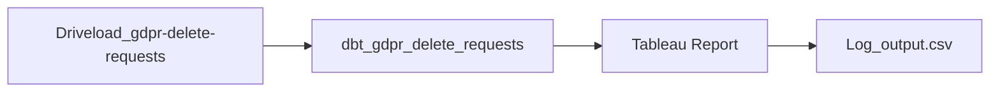

### GDPRプロセスのサポート

このプロセスの技術的な背景はこちらに記載されています: [Runbook](https://gitlab.com/gitlab-data/runbooks/-/blob/main/gdpr_deletions/gdpr_deletions.md)

プロセスの簡単な概要:

#### Driveload_gdpr-delete-requests

標準的なDriveloadプロセスで、この[フォルダー](https://drive.google.com/drive/folders/1mAvevVqr52leN6efsXY2wex5lDGL218-)でファイルを探します。

#### dbt_gdpr_delete_requests

修正されたDBT DAGです。注意すべき2つの重要な点があります:

1. 実行操作マクロ: gdpr_bulk_delete
   - このマクロはDriveloadプロセスで提供されたすべてのデータを読み込み、1レコードずつループして、Driveloadファイルで提供された内容に応じてgdpr_deleteまたはgdpr_delete_gitlab_dotcom[マクロ](/handbook/enterprise-data/platform/dbt-guide/#snapshots-and-gdpr)を実行します。
   - さらに、各行を処理した後、このプロセスはRAW.Driveloadテーブルのソースレコードを**削除**します。このプロセスはメールアドレスのすべてのデータを削除するように設計されているため、ソースレコードを長期間保存することができません。
2. DAGパラメーター: --log-path gdpr_run_logs --log-format json
   - これにより、このデータを抽出するために文字列を操作する必要がないように、ログ出力のより良いフォーマットが提供されます。
   - また、このjsonデータを他のタイプのDBTログとは別に解析してアップロードするための別の解析パスを`orchestration/upload_dbt_file_to_snowflake.py`で作成しました。
   - 最後に、これらのログが一般的なログと混在せず、最新の実行のみに関連するログのみを含む一貫したフォーマットを持つように--pathパラメーターが作成されました（このパスは実行間で持続しません）

##### トラブルシューティング

サポートエンジニアは[Runbook](https://gitlab.com/gitlab-data/runbooks/-/blob/main/gdpr_deletions/gdpr_deletions.md)に記載されている正しいCSV入力を提供する責任があります。

**エラー処理**: 技術的なエラーが発生した場合（例: 間違ったCSVデリミター）、データプラットフォームチームはトリアージプロセス中にこれを特定し、削除が正しく処理されるように対応します。チームメンバーによる入力エラーの場合、データプラットフォームチームは将来の同様のミスを防ぐためにその個人に連絡します。

**検索プロセス**: 削除リクエストを担当したサポートエンジニアを特定するには、[このプロジェクト](https://gitlab.com/gitlab-com/gdpr-request/-/issues/)で該当のメールアドレスを検索してください。

#### Tableauレポート

ワークブック、詳細はこちら:

- ここで特に注目すべき点は、データソースにカスタムSQLクエリが添付されており、バッチから不要なレコードの大部分をフィルタリングしようとしていることです。
  - フィルターはいくつかのフィールドを除外し、100件以上のログレコードがある実行のみを返します。このプロセスがDriveload入力なしで実行される場合は50〜70行が作成され、入力があった場合は250行以上になるため、必要のないレコードに対するクリーンな除外が可能です。
- Runbookでは、データを抽出するためにTableauダウンローダーを使用することが詳述されていますが、これが問題になる場合で、Snowflakeアクセスがある場合は、Snowflakeを通じて非常に簡単にデータを抽出できます。
