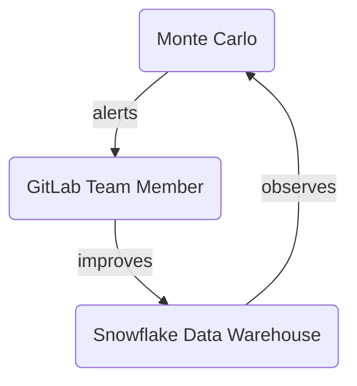

## 何のために、なぜ使うのか

[Monte Carlo](https://www.montecarlodata.com/) (MC) は私たちの[データ可観測性 (Data Observability)](https://www.montecarlodata.com/blog-what-is-data-observability/) ツールであり、**より良い結果をより効率的に提供する**のに役立ちます。

データチームではデータのステータスを観察するための既定として Monte Carlo を使用します。テスト（Monte Carlo ではモニターと呼ばれます）の作成はすべて Monte Carlo の UI から行い、[通知戦略](/handbook/enterprise-data/platform/monte-carlo/#notification-strategy) に従って通知が行われます。近い将来のイテレーションでは [Monitors as Code](https://docs.getmontecarlo.com/docs/monitors-as-code) を実装し、これらのテストもバージョン管理対象にする計画です。現状、既存のテストには引き続き dbt を使用しており、これらを Monte Carlo へ移行するロードマップは現時点ではありません。

## Monte Carlo の運用方法

MC プラットフォーム関連のアラートには [#data-pipelines](https://gitlab.slack.com/archives/C0384JBNVDJ) Slack チャンネルを使用しています。
近い将来、Monte Carlo の通知戦略を完全に実装した上で、モデル関連のアラートには [#data-analytics](https://gitlab.slack.com/archives/CBZD1BA5S) Slack チャンネルを使用する予定です。
この作業は F23Q3 のエピックとして計画されています: [Onboard Analytics Engineers to the Monte Carlo Tool](https://gitlab.com/groups/gitlab-data/-/epics/615)

Monte Carlo は [日次データトリアージ](/handbook/enterprise-data/how-we-work/triage/) の中核であり、[TD Trusted Data Dashboards](/handbook/enterprise-data/platform/dbt-guide/#trusted-data-operations-dashboard) に取って代わる存在となります。

GitLab における Monte Carlo 展開の全体作業は、エピック [Rollout Data Observability Tool with 100% coverage of Tier 1 Tables to improve Trusted Data, Data Quality, and Data Team member efficiency](https://gitlab.com/groups/gitlab-data/-/epics/567) で管理されており、作業ブレークダウンが行われ、Monte Carlo を本番環境で稼働させるまでに必要なステップを反映した Issue が作成されています。

## ログイン

Monte Carlo へのログインは Okta 経由で行います。https://getmontecarlo.com/signin へアクセスしてください。
ログイン後、以下の画面が表示されます。メールアドレスを入力して "Sign in with SSO" をクリックすると、Okta のログイン画面にリダイレクトされます。
ユーザー名／パスワードではなく SSO 経由でログインする必要がある点にご注意ください。

すべての技術的なセットアップに関する Runbook は [Monte Carlo Runbook](https://gitlab.com/gitlab-com/business-technology/team-member-enablement/runbooks/-/wikis/IT-Runbooks/App-Setup/Monte-Carlo:-How-It's-Built) にあります。

要点として、`okta-montecarlo-users` という Okta グループがあり、データチームが維持管理しており、このグループに Monte Carlo アプリが割り当てられています。
デフォルトで Okta 経由で Monte Carlo にアクセスできるようにするためには、ユーザーが `okta-montecarlo-users` グループに所属している必要があります。
そのためには AR を提出して（類似 AR の例: [Example AR 1](https://gitlab.com/gitlab-com/team-member-epics/access-requests/-/issues/22860), [Example AR 2](https://gitlab.com/gitlab-com/team-member-epics/access-requests/-/issues/22878)）、Rigerta Demiri (@rigerta) にアサインするか、#data チャンネルで AR にリンクを貼って ping してください。

## UI のナビゲート

ログインすると、監視されているオブジェクトの詳細と、すでに設定済みの複数のカスタムモニターを含む Monte Carlo モニターのダッシュボードが表示されます。

新しいモニターを作成したり、既存のモニターの詳細（定義やスケジュール、関連する異常など）を確認したりできます。
あるいは、上部メニューバーの Incidents メニュー項目をクリックしてすべてのインシデントを一覧表示することも、Catalog ビューで特定のモデルを検索することも、Pipelines でデータがソースから本番モデルへどう流れるかの詳細なリネージュ情報を確認することもできます。

ユーザーに割り当てられたロール（デフォルトでは SSO 経由でログインするすべてのユーザーには Viewer ロールが割り当てられます）によっては、Settings を表示して既存のユーザーや統合（Slack 統合、Snowflake 統合、dbt 統合など）を確認できる場合があります。

ロールを更新する必要がある場合は、データプラットフォームチームの誰かに連絡すれば、既存のロールを変更してもらえます。

UI のナビゲートに関する詳しい情報は、[Monte Carlo 公式ドキュメント](https://docs.getmontecarlo.com/docs/how-to-navigate-the-monte-carlo-ui) を参照してください。

## 新規モニターの追加

Monte Carlo はアクセスできるすべてのオブジェクトに対して、デフォルトでボリューム、フレッシュネス、スキーマ変更のモニターを実行します。
ただし、これらのチェックはツールがデータから学習した更新パターンに基づいているため、特定のスケジュールで実行する独自カスタムチェックが必要な場合は、そのためのカスタムモニターを追加することをお勧めします。

モニターに関する Monte Carlo 公式ドキュメントは [Monitors Overview guide](https://docs.getmontecarlo.com/docs/monitors-overview) にあります。

私たちは Monte Carlo Snowflake 統合を 1 つ用意しており、これには 2 つの異なる Snowflake 接続があります。
1 つ目の接続は `snowflake` という名前で、`XS` Snowflake ウェアハウスである `DATA_OBS_WH_1` 上で動作します。
2 つ目の接続は `snowflake large` という名前で、`L` Snowflake ウェアハウスである `DATA_OBS_WH_L` 上で動作します。

新しいカスタムモニターを追加するときは、最も適した接続を慎重に選んでください。
カスタム SQL クエリが妥当な時間で実行され、タイムアウトしないようにするために本当に必要な場合のみ、Large ウェアハウス上での実行を選択してください。

## 既存モニターのファインチューニング

既存のモニターを変更したい場合、モニターの種類に応じて、スケジュール、考慮するタイムスタンプフィールド、アラート条件などのさまざまな部分を変更できます。

## Slack アラートへの対応

現在、さまざまな Slack チャンネルで通知を受け取ったときに、`Fixed`、`Expected`、`Investigating`、`No action needed`、`False positive`（`No status` は Monte Carlo のデフォルトステータス）のいずれかを選んでステータスを割り当てることで、Slack からインシデントをトリアージできます。
調査を開始して何か見つかった場合に、同じ通知スレッドで Slack にコメントを書くと、そのコメントは自動的に Monte Carlo のインシデントに追加されます。

私たちの目標は、Slack でアラートを受け取ったときに GitLab 上に自動的にトリアージ Issue を開き、通常と同様に [データトリアージ手順](/handbook/enterprise-data/how-we-work/triage/) に従えるよう、Monte Carlo を GitLab と統合できるようにすることです。

アラートへの対応方法に関する動画を含む詳細な情報は、Monte Carlo 公式ドキュメント [how to respond to an alert](https://docs.getmontecarlo.com/docs/explore-monte-carlo-incidents) にあります。

### インシデントのステータス

各 Monte Carlo インシデントには常にステータスがあります。どのステータスをいつ使うかについては、以下のリストを参照してください:

| Monte Carlo ステータス | コンテキスト | 完了済みまたは予定の対応 | アップタイム計算への影響 |
|---------------------|-----------------------------------------------------------------------------------------------------------------------------------------------|----------------------------------------------------------------------------------------|----------------------------|
| Fixed               | インシデントは既にアクティブではない。 | インシデントの解決に積極的に取り組んだ、または自動的に正常化された。 | あり |
| Expected            | Monte Carlo が **正しく** フラグを立てたインシデント。バッチ更新や進行中のスキーマ変更など、起こることが分かっていたもの。 | なし | あり |
| Investigating       | インシデントに積極的に取り組み中 | 根本原因の調査と必要に応じた解決 | あり |
| No action needed    | Monte Carlo が **正しく** フラグを立てたインシデントだが、破壊的変更ではない | なし | なし |
| False positive      | Monte Carlo が **誤って** フラグを立てたインシデント | なし | なし |
| No Status           | Monte Carlo のデフォルトステータス | 調査を開始してステータスを更新 | あり |
| Acknowledged        | Monte Carlo が正しくフラグを立てたインシデントで、データに影響を与えているが、自動的に正常化するか、すでに正常化したため対応は不要。 | なし | あり |

### 異常検知モデルへのフィードバックの提供

Monte Carlo の異常検知モデルに影響を与える方法は 2 つだけあり、[Monte Carlo ドキュメントの Training data セクション](https://docs.getmontecarlo.com/docs/tuning-thresholds#training-data) に記載されています:

1. Mark as normal: 異常はモデルを訓練するデータセットから自動的に除外されます。これはインシデントそのもののステータスではなく、Monte Carlo のアラートグラフ上にカーソルを合わせるとアクセスできる特定の機能です
2. Select training data: モニターのチャートと対話することで、ユーザーはモデルの訓練データから期間を除外できます。除外ウィンドウを使用して、ウェアハウス、データベース、スキーマ、テーブル全体で無視すべき期間を定義することもできます。これは 1 回限りでも、繰り返される休日に設定することもできます。

Monte Carlo でアラートを "normal" としてマークすると、アラートをトリガーした異常データポイントが異常検知モデルの訓練セットに再投入されます。これにより閾値が広がり、同様の異常が将来アラートをトリガーしなくなります。
このアクションの主な結果は次のとおりです:

- 閾値の調整: システムの検出閾値が自動的に広がり、normal として識別したパターンに対応できるようになり、同様のイベントに対するアラートノイズを削減します。
- モデルの再訓練: そのデータポイントが "normal" パターンの一部として含まれた状態で異常検知モデルが再訓練され、今後の異常検知に影響します。
- アラートノイズの削減: 以前は異常としてフラグが立てられていたが、実際には期待される動作であった同様のパターンに対するアラートが少なくなります。

### アラートを Normal としてマークすべきタイミング

次のような場合にアラートを normal としてマークしてください:

- 予期されるビジネス変更: 検出は統計的観点からは妥当な異常だったが、パイプラインの変更や計画されたメンテナンスのような期待される結果だった場合。例えば、ボリューム異常アラートをトリガーするデータの意図的な削除など。
- 問題ではないもの: 同様の異常が将来発生してもアラートを受け取りたくない場合（実際のデータ問題ではなく、通常のビジネスパターンを表しているため）。
- 繰り返されるパターン: システムには異常に見えるが、実際には定期的なビジネスサイクル（月次処理ジョブによるボリュームのスパイクなど）であるパターン。

重要な点として、アラートのステータス（"Expected"、"No action needed"、"False positive"）は、閾値を生成するモデルにはフィードバックを提供しないことに注意してください。アラートステータスに基づいて閾値が変化したり調整されたりすることはありません。モデルへのフィードバックは "Mark as normal" プロセスを通じて管理されます。
アラートを normal としてマークした後、新しい広がった閾値がシステムに反映されるまで数時間かかることがあります。
関連する複数のアラートについては、異常チャートの右上にある `Tune model` ドロップダウンの "Mark all as normal" オプション（[ドキュメントへのリンク](https://docs.getmontecarlo.com/docs/tuning-thresholds#training-data)）を使うと、各イベントを個別にクリックする手間を省けます。

## スキーマ／権限管理

Monte Carlo は監視する各データベース（`raw`、`prep`、`prod`）に対して 1 回だけ実行する権限スクリプトが必要です。監視対象データベースに新しいスキーマが追加されたときは必ず、このスクリプトを再実行する必要があります。完全なセットアップ詳細は [公式ドキュメント](https://docs.getmontecarlo.com/docs/snowflake) にあります。データ可観測性ユーザーの認証情報は社内データボールトに保存されています。

> **注:** これは標準の権限処理手順の例外です。可観測性権限は Permifrost ではまだサポートされていないエッジケースであり、これを追跡するオープンな [機能リクエスト](https://gitlab.com/gitlab-data/permifrost/-/issues/120) があります。

### スキーマの追加

スキーマが存在するデータベースの権限スクリプトを `$database_to_monitor` に正しい値を設定して再実行します。完全なスクリプトは [公式ドキュメント](https://docs.getmontecarlo.com/docs/snowflake) を参照してください。

### スキーマの削除

**Settings → Ingestion → Monte Carlo Snowflake Warehouse Integration** に移動し、スキーマを検索してチェックを外します。

## 監視戦略

デフォルトでは、Monte Carlo で `RAW`、`PREP`、`PROD` データベース内のすべてのテーブルを監視します。特別な理由がない場合や、契約で指定された制限に達していない場合に限ります。監視から除外するテーブルやスキーマは以下に文書化されています。

### サンドボックススキーマの除外

サンドボックス環境は一般にテスト目的で作成されます。通常、トリアージ用 Slack チャンネルにアラートが届いても、何かアクションを取ることはありません。このため、それらからアラートを受け取らないように、`sandbox` を含むスキーマの監視を除外しています。これは Monte Carlo の除外ルールで設定されています。

## 通知戦略 {#notification-strategy}

すべてのインシデントは Monte Carlo インシデントポータルに報告されます。トリアージ目的で最も重要なもの（対応が必要なもの）は Slack にルーティングされます。次のマトリックスは、データ領域ごとにどのタイプのモニターがどのチャンネルにルーティングされるかを示しています:

| データベース | データスコープ                                          | Volume               | Freshness      |  Schema changes                                   | Custom monitors|
|-----------|------------------------------------------------------|----------------------|----------------------|-------------------------------------|----------------------|
| RAW       | TIER1                                                | #data-pipelines      | #data-pipelines      | #analytics-pipelines (1 日 1 回) | #data-pipelines      |
|           | TIER2                                                | -                    | #data-pipelines      | #analytics-pipelines (1 日 1 回) | #data-pipelines      |
|           | TIER3                                                | -                    | #data-pipelines      | #analytics-pipelines (1 日 1 回) | #data-pipelines      |
| PREP      | n/a                                                  | -                    | -                    | -                                   | -                    |
| PROD      | COMMON `*` | #analytics-pipelines | #analytics-pipelines | -                                       | #analytics-pipelines                                       |
|           | WORKSPACE  `**`                                      | -                    | -                    | -                                   | -                    |
|           | WORKSPACE-DATA-SCIENCE     | #data-science-pipelines | #data-science-pipelines                     | -                                   | #data-science-pipelines |
|           | LEGACY `***`                                         | -                    | -                    | -                                   | -                    |

`*` COMMON は COMMON_RESTRICTED の同等物でもあります。`COMMON_PREP` と `COMMON_MAPPING` は除きます
`**` WORKSPACE-DATA-SCIENCE は通知戦略に含めている唯一の workspace スキーマです
`***` `LEGACY` スキーマのうち、MR [!7049](https://gitlab.com/gitlab-data/analytics/-/merge_requests/7049) に従って、これら 2 つのモデル (`snowplow_structured_events_400` と `snowplow_structured_events_all`) のみを一時的に含めています

この通知戦略は、Monte Carlo から Slack へ送信されるあらゆるアラートの基盤となっています。ただし、[Notifications 2.0](https://docs.getmontecarlo.com/docs/notifications-v2) の時点で、Monte Carlo は *Audiences* を導入しました。
これは、上記の通知戦略が現在 Audiences に移行されたことを意味し、次の Audiences を用意して、以下のとおり Slack チャンネルにアラートを送信しています:

| Audience                          | Slack チャンネル                                        |
|-----------------------------------|------------------------------------------------------|
| Analytics Engineers               |      #analytics-pipelines                            |
| Analytics Instrumentation         |      #g_analyze_analytics_instrumentation            |
| Data Engineers                    |      #data-pipelines                                 |
| Data Science                      |      #data-science-pipelines                         |
| Sales Analytics                   |      #sales-analytics-pipelines                      |

## ドメイン

Monte Carlo 環境では [ドメイン](https://vimeo.com/646676972) を使用できます。現在、ドメインは個別のチームメンバーごとに別環境を作成するために使用でき、ドメインはプロジェクトとデータセットでモニターとインシデントを自動的にフィルタリングします。利用可能なドメイン数には限りがあります。

| ドメイン | 説明 | データスコープ |
| ------ | ----------- | ---------- |
| Data Platform Team | データプラットフォームチーム用のドメイン - スコープは Snowflake の raw データレイヤー | Snowflake `raw` レイヤー |

### ドメインの使用

Monte Carlo UI の右上にドロップダウンボックスがあり、特定のドメインまたはすべてのドメインを選択できます。

## BI 統合

GitLab で Monte Carlo を最初に展開したとき、当時使用していた BI ツールである Sisense をデフォルトとしました。
しかし最近、Tableau への移行を開始したため、Monte Carlo インスタンスに Tableau 統合を追加しました。

これにより、raw モデルから Tableau Views、Tableau Live Data Sources、Tableau Extract Data Sources などの Tableau オブジェクトへのテーブルおよびフィールドのリネージュを確認できるようになりました。

Sisense 統合と Tableau 統合は Monte Carlo 上で共存しており、関連するすべての Sisense チャートおよび Tableau オブジェクトをリネージュチャート上で確認できます。

## 内部 Monte Carlo ハンドブックページ

追加の内部情報は [社内 GitLab ハンドブック](https://internal.gitlab.com/handbook/enterprise-data/platform/monte-carlo) で参照できます。
