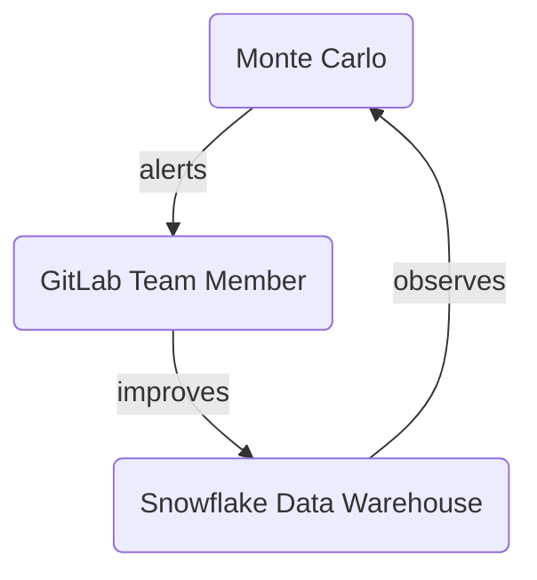

## 概要と目的

[Monte Carlo](https://www.montecarlodata.com/)（MC）は私たちの[データオブザーバビリティ](https://www.montecarlodata.com/blog-what-is-data-observability/)ツールで、**より効率的に優れた結果を提供**するのに役立ちます。

データの状態を観察するためのデータチームのデフォルトはMonte Carloを使用することです。テスト（Monte Carloではモニターと呼ばれる）の作成はMonte CarloのUIを使用して行われ、[通知戦略](/handbook/enterprise-data/platform/monte-carlo/#notification-strategy)に従って報告されます。近い将来の別のイテレーションで[Monitors as Code](https://docs.getmontecarlo.com/docs/monitors-as-code)を実装し、これらのテストもバージョン管理される予定です。現在もdbtが既存のテストに使用されており、これらをMonte Carloに移行するロードマップはありません。

## Monte Carloの運用方法

MC プラットフォーム関連のアラートには[#data-pipelines](https://gitlab.slack.com/archives/C0384JBNVDJ) Slackチャンネルを使用しています。
Monte Carloの完全な通知戦略を実装したらすぐに、モデル関連のアラートには[#data-analytics](https://gitlab.slack.com/archives/CBZD1BA5S) Slackチャンネルを使用する予定です。
この作業はF23Q3向けのこのエピックで計画されています: [Analytics EngineersをMonte Carloツールにオンボード](https://gitlab.com/groups/gitlab-data/-/epics/615)

Monte Carloは[日次データトリアージ](/handbook/enterprise-data/how-we-work/triage/)の不可欠な部分であり、[TDトラステッドデータダッシュボード](/handbook/enterprise-data/platform/dbt-guide/#trusted-data-operations-dashboard)を置き換えます。

GitLabでのMonte Carloロールアウトをカバーする作業の全体は、エピック[100%のTier 1テーブルカバレッジでのデータオブザーバビリティツールのロールアウトによるトラステッドデータ、データ品質、データチームメンバーの効率向上](https://gitlab.com/groups/gitlab-data/-/epics/567)にまとめられています。

## ログイン

Monte Carloへのログインはokta経由で行います。https://getmontecarlo.com/signin にアクセスしてください。
ログイン時に以下の画面が表示され、メールを入力して「Sign in with SSO」をクリックすると、Oktaログインにリダイレクトされます。
SSOでログインし、ユーザー名/パスワードではなくSSOを使用してください。

技術的にすべてがどのように設定されているかのRunbookは[Monte Carlo Runbook](https://gitlab.com/gitlab-com/business-technology/team-member-enablement/runbooks/-/wikis/IT-Runbooks/App-Setup/Monte-Carlo:-How-It's-Built)で確認できます。

要点としては、データチームが管理しMonte Carloアプリが割り当てられた`okta-montecarlo-users`というOktaグループがあります。
デフォルトでOktaを通じてMonte Carloにアクセスできるようにするには、ユーザーが`okta-montecarlo-users`グループの一部である必要があります。
そのためには、ARを提出し（類似のAR: [Example AR 1](https://gitlab.com/gitlab-com/team-member-epics/access-requests/-/issues/22860)、[Example AR 2](https://gitlab.com/gitlab-com/team-member-epics/access-requests/-/issues/22878)）、Rigerta Demiri（@rigerta）に割り当てるか、ARにリンクした#dataチャンネルにpingを送ってください。

## UIのナビゲーション

ログインすると、監視されているオブジェクトの詳細とすでにセットアップされたいくつかのカスタムモニターが表示されたMonte Carloモニターダッシュボードを確認できます。

新しいモニターを作成したり、定義・スケジュール・関連する異常などの既存のモニターの詳細を表示したりできます。
また、上部メニューバーの「Incidents」メニュー項目をクリックしてすべてのインシデントをリスト表示したり、「Catalog」ビューをクエリして特定のモデルを検索したり、「Pipelines」でデータがソースから本番モデルにどのように流れるかの詳細なリネージ情報を確認したりすることもできます。

ユーザーに割り当てられたロール（デフォルトでSSO経由でログインするすべてのユーザーにViewerロールが割り当てられます）によっては、Settingsを確認して既存のユーザーと統合（Slack統合、Snowflake統合、dbt統合など）を確認できる場合があります。

ロールの更新が必要な場合は、データプラットフォームチームの誰にでも連絡すれば既存のロールを変更できます。

UIのナビゲーションの詳細については、[公式Monte Carloドキュメント](https://docs.getmontecarlo.com/docs/how-to-navigate-the-monte-carlo-ui)を参照してください。

## 新しいモニターの追加

Monte Carloは、アクセスできるすべてのオブジェクトにデフォルトでボリューム、鮮度、スキーマ変更モニターを実行します。
ただし、これらのチェックはツールがデータから学習する更新パターンに基づいており、特定のスケジュールで実行される特定のカスタムチェックが必要な場合は、そのためのカスタムモニターを追加するとよいでしょう。

モニターに関する公式Monte Carloドキュメントは[モニター概要ガイド](https://docs.getmontecarlo.com/docs/monitors-overview)で確認できます。

1つのMonte Carlo Snowflake統合があり、Snowflakeへの2つの別々の接続があります。
最初の接続は`snowflake`と呼ばれ、`XS`サイズのSnowflakeウェアハウスである`DATA_OBS_WH_1`で動作します。
2番目の接続は`snowflake large`と呼ばれ、`L`サイズのSnowflakeウェアハウスである`DATA_OBS_WH_L`で動作します。

新しいカスタムモニターを追加する際に、最も意味のある接続を慎重に選択してください。
カスタムSQLクエリが合理的な時間内に実行されてタイムアウトを防ぐために本当に必要な場合にのみ、大きなウェアハウスでモニターを実行することを選択してください。

## 既存のモニターの調整

既存のモニターを修正したい場合は、モニターのタイプに応じて、スケジュール、考慮されるタイムスタンプフィールド、アラート条件などの異なる部分を修正できます。

## Slackアラートへの対応

現在、異なるSlackチャンネルで通知を受け取っている場合、`Fixed`、`Expected`、`Investigating`、`No action needed`、`False positive`（`No status`はMonte Carloのデフォルトステータス）から選択してステータスを割り当てることで、Slack経由でIssueをトリアージできます。
調査して結果が出たら、同じ通知スレッドにSlackでコメントを書くと、そのコメントはMonte Carlo上のインシデントに自動的に追加されます。

私たちの目標は、Monte CarloをGitLabと統合して、Slackでアラートを受け取るたびにGitLabで自動的にトリアージIssueが開かれ、[データトリアージ手順](/handbook/enterprise-data/how-we-work/triage/)と同じ手順に従えるようにすることです。

Slackでアラートに応答する方法については、公式Monte Carloドキュメントにビデオセクションを含む詳細情報が[こちら](https://docs.getmontecarlo.com/docs/explore-monte-carlo-incidents)にあります。

### インシデントステータス

各Monte Carloインシデントには常にステータスがあります。どのステータスをいつ使用するかは以下のリストを参照してください:

| Monte Carloステータス   | コンテキスト                                                                                                                                       | 実施済みまたは予定のアクション                                                                 | 稼働時間計算への影響 |
|---------------------|-----------------------------------------------------------------------------------------------------------------------------------------------|----------------------------------------------------------------------------------------|----------------------------|
| Fixed               | インシデントはアクティブではなくなりました。                                                                                                               | インシデントの解決に積極的に取り組んだか、インシデントが自動的に正常化されました。 | Yes                        |
| Expected            | インシデントはMonte Carloによって**正しく**フラグされました。これはバッチ更新や進行中だったスキーマ変更など、予期していたことです。 | なし                                                                                   | Yes                        |
| Investigating       | インシデントに積極的に取り組んでいます                                                                                                              | 根本原因の調査と必要に応じた解決                                                         | Yes                        |
| No action needed    | インシデントはMonte Carloによって**正しく**フラグされましたが、破壊的な変更ではありません                                                               | なし                                                                                   | No                         |
| False positive      | インシデントはMonte Carloによって**誤って**フラグされました                                                                                                | なし                                                                                   | No                         |
| No Status           | Monte Carloのデフォルトステータス                                                                                                                  | 調査を開始してステータスを更新する                                                  | Yes                        |
| Acknowledged        | インシデントはMonte Carloによって正しくフラグされており、データに影響を与えていますが、正常化するか正常化したためアクションは必要ありません。       | なし                                                                                   | Yes                        |

### 異常検出モデルへのフィードバックの提供

Monte Carloの異常検出モデルに影響を与える唯一の2つの方法は、[Monte Carloドキュメントのトレーニングデータセクション](https://docs.getmontecarlo.com/docs/tuning-thresholds#training-data)に記載されています:

1. 正常としてマークする: 異常はモデルをトレーニングするデータセットから自動的に除外されます。これはインシデントのステータスそのものではなく、Monte Carloのアラートグラフをホバーすることでアクセスできる特定の機能です
2. トレーニングデータを選択する: モニターのグラフと対話することで、ユーザーはモデルのトレーニングからデータの期間を除外できます。

Monte Carloでアラートを「正常」としてマークすると、アラートをトリガーした異常なデータポイントが異常検出モデルのトレーニングセットに再導入されます。これにより閾値が広がり、同様の異常が将来アラートをトリガーしなくなります。
このアクションの主な結果は:

- 閾値の調整: システムの検出閾値は、正常と識別したパターンに合わせて自動的に広がり、同様のイベントのアラートノイズが減少します。
- モデルの再トレーニング: 異常検出モデルはこのデータポイントが「正常な」パターンの一部として含まれた状態で再トレーニングされ、将来の異常検出に影響します。
- アラートノイズの削減: 以前は異常としてフラグされていたが実際には予期された動作を表す同様のパターンに対するアラートが減少します。

### アラートを正常としてマークするタイミング

アラートを正常としてマークすべき場合:

- ビジネスの予期された変化: 統計的な観点からは有効な異常でしたが、パイプライン変更や計画されたメンテナンスなど予期された何かの結果でした。
- 非Issue: 同様の異常に対してこれ以上アラートを受けたくない場合、なぜならそれらは実際のデータIssueではなく通常のビジネスパターンを表すためです。
- 繰り返しパターン: システムには異常に見えるが実際には定期的なビジネスサイクルであるパターン（ボリュームスパイクを引き起こす月次処理ジョブなど）。

アラートステータス（「Expected」、「No action needed」、「False positive」）は閾値を生成するモデルへのフィードバックを提供しないことに注意することが重要です。提供されたアラートステータスに基づいて閾値は変更または調整されません。

## DWH権限に関する注意

Monte CarloをSnowflakeと統合するために、監視する必要があるデータベースごとに[公式ドキュメント](https://docs.getmontecarlo.com/docs/snowflake)で指定された権限スクリプトを実行する必要がありました。

これはPermifrostを使用する通常の権限処理手順の例外です。オブザーバビリティ権限はPermifrostのエッジケースであり、ツールではまだサポートされていないためです。

## 監視戦略

デフォルトでは、特定の理由がない限り、または契約で指定された制限に達しない限り、Monte Carloで`RAW`、`PREP`、`PROD`データベースのすべてのテーブルを監視します。

### サンドボックススキーマの除外

サンドボックス環境は通常テストの目的で作成されます。トリアージSlackチャンネルでアラートが来ても通常はアクションを取りません。そのため、`sandbox`を含むスキーマの監視を除外してアラートを受け取らないようにしています。

## 通知戦略

すべてのインシデントはMonte Carloインシデントポータルで報告されます。トリアージ目的のために最も重要なものはSlackにルーティングされます。

| データベース | データスコープ                                               | ボリューム               | 鮮度      |  スキーマ変更                                   | カスタムモニター|
|-----------|------------------------------------------------------|----------------------|----------------------|-------------------------------------|----------------------|
| RAW       | TIER1                                                | #data-pipelines      | #data-pipelines      | #analytics-pipelines（1日1回） | #data-pipelines      |
|           | TIER2                                                | -                    | #data-pipelines      | #analytics-pipelines（1日1回） | #data-pipelines      |
|           | TIER3                                                | -                    | #data-pipelines      | #analytics-pipelines（1日1回） | #data-pipelines      |
| PREP      | n/a                                                  | -                    | -                    | -                                   | -                    |
| PROD      | COMMON `*` | #analytics-pipelines | #analytics-pipelines | -                                       | #analytics-pipelines                                       |
|           | WORKSPACE  `**`                                      | -                    | -                    | -                                   | -                    |
|           | WORKSPACE-DATA-SCIENCE     | #data-science-pipelines | #data-science-pipelines                     | -                                   | #data-science-pipelines |
|           | LEGACY `***`                                         | -                    | -                    | -                                   | -                    |

`*` COMMONはCOMMON_RESTRICTED同等品でもあります。`COMMON_PREP`と`COMMON_MAPPING`を除外します
`**` WORKSPACE-DATA-SCIENCEは通知戦略に含める唯一のワークスペーススキーマです
`***` `LEGACY`スキーマのこれら2つのモデル（`snowplow_structured_events_400`と`snowplow_structured_events_all`）のみが、MR [!7049](https://gitlab.com/gitlab-data/analytics/-/merge_requests/7049)に従って一時的に含まれています

この通知戦略はMonte CarloからSlackへのアラート送信の基準です。ただし、[Notifications 2.0](https://docs.getmontecarlo.com/docs/notifications-v2)以降、Monte Carloは*Audiences*を導入しています。

| Audience                          | Slackチャンネル                                        |
|-----------------------------------|------------------------------------------------------|
| Analytics Engineers               |      #analytics-pipelines                            |
| Analytics Instrumentation         |      #g_analyze_analytics_instrumentation            |
| Data Engineers                    |      #data-pipelines                                 |
| Data Science                      |      #data-science-pipelines                         |
| Sales Analytics                   |      #sales-analytics-pipelines                      |

## ドメイン

Monte Carlo環境で[ドメイン](https://vimeo.com/646676972)を使用できます。現在ドメインは別々のチームメンバー向けに別々の環境を作成するために使用できます。

| ドメイン | 説明 | データスコープ |
| ------ | ----------- | ---------- |
| Data Platform Team | データプラットフォームチームのドメイン - Snowflakeの生データレイヤーのスコープ | Snowflakeの`raw`レイヤー |

### ドメインの使用

Monte Carlo UIの右上隅に、特定のドメインまたはすべてのドメインを選択できるドロップダウンボックスがあります。

## BI統合

GitLabにMonte Carloを最初にデプロイしたとき、当時使用していたSisenseをデフォルトのBIツールとしました。
しかし、最近Tableauへの移行を開始したため、Monte CarloインスタンスにTableau統合を追加しました。

生モデルからTableauビュー、TableauライブデータソースまたはTableauエクストラクトデータソースなどのTableauオブジェクトへのテーブルとフィールドのリネージを確認できるようになりました。

Sisense統合とTableau統合はMonte Carlo上で共存しており、関連するすべてのSisenseチャートとTableauオブジェクトをリネージチャートで確認できます。

## Monte Carloの内部ハンドブックページ

追加の内部情報は[内部GitLabハンドブック](https://internal.gitlab.com/handbook/enterprise-data/platform/monte-carlo)で確認できます。
