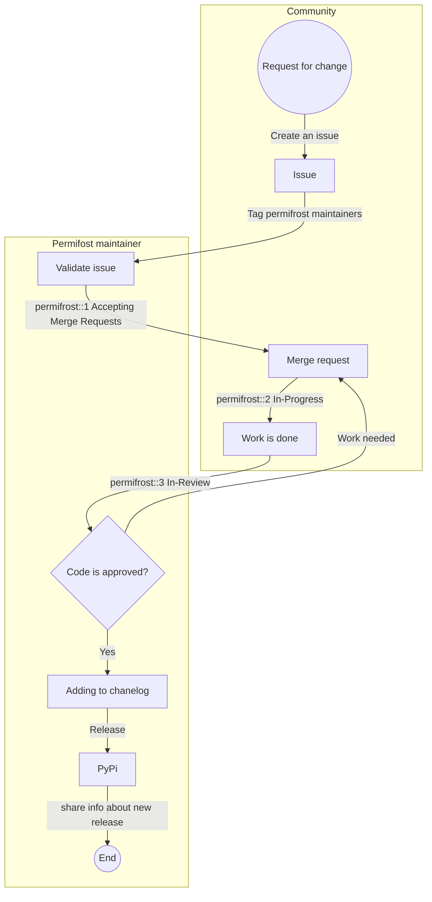

## クイックリンク

[Permifrost プロジェクト](https://gitlab.com/gitlab-data/permifrost/)

[PyPI](https://pypi.org/project/permifrost/)

## Permifrost


Permifrost は Snowflake データウェアハウスの権限を管理する Python ツールです。ツールの使用に関する主なドキュメントは、プロジェクトと PyPI で参照できます。

### 注意事項

#### :white_check_mark: Permifrost が行うこと・できること

* Snowflake のみをサポート
* Permifrost はロールと権限のみを管理します
* 設定ファイルに存在しないオブジェクトはエラーになりません
* 完全なオープンソースパッケージであり、誰でも貢献できます

#### :x: Permifrost が行わないこと・できないこと

* オブジェクトの作成や削除は Permifrost では管理しません
  * つまり、`roles.yml` ファイルからロール全体を削除しても、Snowflake からは**削除されません**

## コントリビュート

### 開発

以下の手順に従って、仮想環境を作成・準備します。

```bash
## 仮想環境を作成する
python -m venv ~/.venv/permifrost

## 仮想環境を有効化する
source ~/.venv/permifrost/bin/activate

## 依存関係をインストールする
pip install -r requirements.txt

## 開発用依存関係を pip3 でインストールする
pip install -e '.[dev]'
```

変更をコミットしたら、マージリクエストを提出してデフォルトテンプレートを更新してください。

### コミュニケーション

* 追加の質問、貢献、アイデアがあれば、Permifrost プロジェクトで[**新しい Issue**](https://gitlab.com/gitlab-data/permifrost/-/issues/new) を作成し、必要に応じて `@gitlab-data/permifrost_maintainers` _（プロジェクトのメンテナー）_ にタグ付けしてください
* 告知や質問には、Slack チャンネル [#tools-permifrost](https://getdbt.slack.com/archives/C01LWQJMMGS) も有効です。

### リリースプロセス

リリースプロセスはテンプレート [Permifrost のリリースプロセス](https://gitlab.com/gitlab-data/permifrost/-/blob/master/RELEASE.md) に記述されており、[Permifrost のリリース](https://gitlab.com/gitlab-data/permifrost/-/blob/master/.gitlab/issue_templates/Releasing%20update.md) テンプレートを使用します。実例は [リリース `0.15.1`](https://gitlab.com/gitlab-data/permifrost/-/issues/175) をテンプレートとして参照してください。

私たちは年に少なくとも2回、Permifrost の新バージョンをリリースすることを目標としています。それまでの間は、[リリース履歴](https://pypi.org/project/permifrost/#history) を確認してください。

#### バージョニング

Permifrost はバージョン番号スキームとして [セマンティックバージョニング 2.0.0](https://semver.org/) を使用しています。

#### ワークフロー

Permifrost はタグを使用してアーティファクトを作成します。新しいタグをリポジトリにプッシュすると、Docker イメージと `PyPI` パッケージとして公開されます。詳細は [リリースガイドライン](https://gitlab.com/gitlab-data/permifrost/-/blob/master/.gitlab/issue_templates/Releasing%20update.md) を参照してください。

以下は Permifrost のコントリビューションと開発のワークフロー全体です。


