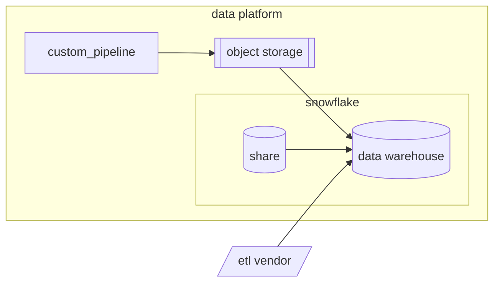

データプラットフォームには、非常に多様なソースからのデータが含まれています。このような動的かつ膨大な統合をサポートするために、私たちは高度なツールと最高水準のデータエンジニアリングスタンダードを持つデータ抽出戦略を採用しています。
特定の**データパイプライン**に関する詳細情報は、[内部 GitLab ハンドブックのパイプラインページ](https://internal.gitlab.com/handbook/enterprise-data/platform/pipelines) で参照できます。

## データ抽出ソリューション

理想的には、すべてのデータ抽出パイプラインは次の3つのカテゴリのいずれかに該当するべきです。

1. [Snowflake Share](https://docs.snowflake.com/en/user-guide/data-sharing-intro)
1. ETL ベンダー（Fivetran）
1. カスタムパイプライン

これらのソリューションはそれぞれ異なる強みと弱みを持ち、すべてのケースに適合するソリューションはありません。ソリューション選定では、さまざまな要因を考慮します。

| 要因 | Snowflake Share | ETL ベンダー | カスタム |
| --------------- |---------------- | ---------- | -------|
| 導入の容易さ | ✅ | ✅ | ❔ |
| 柔軟性 | ❌ | ❌ | ✅ |
| プライベート | ✅ | ❌ | ✅ |
| セキュリティ | ✅ | ✅ | ✅ |
| メンテナンス性 | ❔ | ❌ | ✅ |
| コスト効率 | ❔ | ❔ | ❔ |
| 民主化 | ❌ | ❔ | ✅ |
| データ検証 | ❌ | ❔ | ✅ |

カスタムパイプラインの主なデメリットは実装に時間がかかることです。そのため、開発者の効率性やコードのメンテナンス性の改善から得られる利点は非常に大きくなります。それでも、多くの場合、新しいパイプラインは重要度が不明確なまま実装されます。エンタープライズアプリケーションはしばしば変更・置き換えられるため、最善のカスタムパイプラインフレームワークを実装できたとしても、ベンダーを使用することが合理的なケースも多くあります。つまり、多くの場合、カスタムパイプラインを書く価値がないこともあります。

### Snowflake Share の基準

Snowflake Share の主な制限はその利用可能性です。データソースに Snowflake Share が利用可能で**、かつビジネスパートナーの要件を満たしている**場合は、予算内であれば良いソリューションと言えます。

データの現在および将来の要件を評価することが不可欠です。Snowflake Share の使いやすさと簡便さは柔軟性のなさと表裏一体であるため、要件が Share で利用可能な範囲を超えてしまうと選択肢がなくなります。また、ダウンストリームのモデルがすでに実装されている場合、パイプラインの移行が必要となり、初期実装よりもコストがかかる可能性があります。

### ETL ベンダーの基準

Fivetran などの ETL ベンダーは Snowflake Share よりも柔軟性がありますが、契約コストが追加されます。前述のとおり、特に新しいデータソースの重要度が不明確な場合に、迅速に進める必要がある際には優れた選択肢になります。

柔軟性とメンテナンス性の欠如は依然として重要な考慮点です。ベンダーのインターフェイス内で高複雑度のパイプラインを管理することに苦労しており、変更への承認やテストを適用できないことによる変更管理の困難も経験しています。オブジェクトや属性の複雑性が比較的高い場合は、カスタムパイプラインを検討する価値があるかもしれません。また、ETL ベンダーは[更新スケジュールが制限されている](https://gitlab.com/gitlab-data/analytics/-/issues/21649#note_2262432625)ことが多いという点も考慮すべきです。

レコード数もベンダー利用の重要な考慮点です。通常、使用量に基づいて価格が設定されているためです。契約への影響は、このソリューションの必須評価ステップです。高コストの場合もカスタムパイプラインが正当化される場合があります。

一部のデータソースはサードパーティのアクセスを許可するには機密性が高すぎます。そのような場合は、パイプラインをデータプラットフォーム内に留める必要があります。

プラットフォームの効率性のために、重複する機能を持つベンダーをこの領域に置くことは望んでいません。つまり、最大1つのベンダーを希望しています。ベンダーは異なるコネクタセットを提供することが多いですが、別のベンダーの製品にコネクタが利用可能なことは、そのベンダーを追加する十分な理由にはなりません。データプラットフォームへの新ベンダー追加のビジネスケースは、現在の既存ベンダーの置き換えを含む必要があります。
現在、データプラットフォームには複数のベンダー（Fivetran、Stitch、Meltano）があります。これを1つのベンダーに統合する予定です（未定）。

### カスタムパイプラインの基準

カスタムデータパイプラインは、柔軟性、プライバシー、セキュリティ、メンテナンス性において最大の機会を提供するという意味で、最善の選択肢と考えられます。ただし、前述のとおり、そのようなソリューションが常に必要というわけではありません。

---

## パイプラインソースの評価とソリューション選定

データ抽出のためのパイプラインを実装する際に考慮する事項（これに限りません）は以下のとおりです。

- [**データ分類**](/handbook/security/policies_and_standards/data-classification-standard/)
  - 顧客データ（レッドデータ）は、列挙・承認された[サードパーティサブプロセッサー](https://about.gitlab.com/privacy/subprocessors/#third-party-sub-processors)のみを通じて処理できます
- **スキーマの複雑性**
  - オブジェクトと属性の数が多いパイプラインを ETL ベンダーの UI で管理することは、煩雑でリスクが高くなります
- **データ量**
- [**ビジネスクリティカリティ**](/handbook/enterprise-data/platform/#tier-definition)
- レイテンシ要件
- 統合オプション（データベース、API、ファイルストア等）

これらの中には特定のソリューションを必要とするものもあります。例えば、GCS のようなファイルストアのデータは常にカスタムパイプラインでソリューション化されます。それが最も簡単で最低コストのソリューションだからです。ただし多くの場合、一貫したパスはありません。例えば、アクセスに多くの選択肢がある場合もあります。

[新しいデータソース Issue テンプレート](https://gitlab.com/gitlab-data/analytics/-/blob/master/.gitlab/issue_templates/%5BNew%20Request%5D%20New%20Data%20Source.md?ref_type=heads) で新しいデータソースをソリューション化する際に、これらの要因を評価します<!-- このMRがマージされる前に更新予定 -->。そこで概説されている調査・検証プロセスは私たちの成功に不可欠であり、実装をスケジュールするためには完了が必須です。
<!-- このプロセスがタイムリーに完了することをどのように確保するかについての詳細が必要 -->

---

## カスタムパイプライン

カスタムパイプラインから生じる可能性のある重大な弱点は、注意しないとデータプラットフォームに矛盾、冗長性、複雑性を書き込んでしまうことです。この点を踏まえ、カスタムパイプラインが以下の仕様に準拠することを期待します。

### 使いやすさ

カスタムパイプラインは、プラットフォームチームが開発・メンテナンスしやすいだけでなく、**誰でも貢献できる**ように使いやすくする必要があります。Postgres Pipeline（PGP）と同様に、`yaml` 設定は共通の人間が読める言語に設定を抽象化する好ましい方法です。さらに、カスタムパイプラインはここに最大の可能性があります。ベンダーパイプラインや Snowflake Share の操作には特別な権限（ライセンスを含む）が必要な場合が多いためです。しかし、プロジェクトコードを使えば、パイプラインの開発に参加したいすべての人がパイプラインの設定を利用できるようにすることができます。

これに不可欠なのが**ドキュメント**であり、最低でも私たちの[データパイプラインドキュメントテンプレート](https://internal.gitlab.com/handbook/enterprise-data/platform/pipelines/template/)に準拠する必要があります。さらに、一貫したテストとデプロイプロセスがないことで貢献が不透明になることが多いため、カスタムパイプラインは環境管理と開発プロセスで一貫したパターンを使用する必要があります。<!-- 野望 - airflow_utils.gitlab_pod_env_vars でこれを定義してここにリンクする -->
ブランチ名は、開発環境とテスト環境で本番データの汚染を排除し、開発プロセスを標準化するために、データストレージターゲットの名前にプログラム的に前置されます。
パイプラインには、最低限 pytest でテストを含め、すべてのパイプラインで明示的なテストとレビューのための CI ジョブを設定する必要があります。
pytest テストのベストプラクティスの詳細は [**Python ガイド**](/handbook/enterprise-data/platform/python-guide/#unit-testing-with-pytest) を参照してください。
pytest でテストする場合と同様に、ログには Python ロギングを使用します。一貫性という利点に加え、例外処理やログレベルなどの機能がデバッグに役立ちます。

### セキュリティ

構築するものはすべてセキュアでなければなりません。利用可能な最善のセキュリティプラクティスとリソースを実装します。これには以下が含まれますが、これに限りません。

- - 開発は[データプラットフォームの包括的なセキュリティ姿勢](https://internal.gitlab.com/handbook/enterprise-data/platform/data-platform-security/comprehensive-security-posture-for-the-data-platform/)に従います。
- 各パイプラインは、セキュアなボールトに保存された、ソースで付与された独自のアクセス権を持ちます。
- 各パイプラインは、セキュアなボールトに保存された、ターゲットで付与された独自のアクセス権を持ちます。
- Snowflake 認証は[キーペア](https://docs.snowflake.com/en/user-guide/key-pair-auth)を通じて行われます
- シークレットは常に [CI で Mask・非表示](https://docs.gitlab.com/ci/variables/#hide-a-cicd-variable)にされます
- サービスアカウントユーザーは[そのようにタイプ付けされ](https://docs.snowflake.com/en/user-guide/admin-user-management#types-of-users)、[ネットワークポリシー](https://docs.snowflake.com/en/user-guide/network-policies)によって制限されます
- [SAFE フレームワーク](/handbook/legal/safe-framework/)と[データ分類標準](/handbook/security/policies_and_standards/data-classification-standard/)への特別な注意を払い、[Snowflake オブジェクトタギング](https://docs.snowflake.com/en/user-guide/object-tagging/introduction)によって管理された承認済み関係者のみがアクセスできます。

### パフォーマンス

抽出パイプラインはパフォーマンスを発揮する必要があります。以下の基準で定義します。

パフォーマンスの高いパイプライン:

1. 最適化されたクエリを使用する
1. 適切にデータを処理する
1. 自己修復する

#### 最適化されたクエリ/リクエスト

実行するクエリや API リクエストもパフォーマンスが高い必要があります。可能な限り、接続をプールし、インデックス（主キーやタイムスタンプなど）を使用し、フィールド/列を最小化します（`SELECT *` 文を避ける）。利用可能な場合は、データ転送を圧縮し、データストアやファイルストア間で効率的なシリアル化フォーマット（Parquet など）を使用します。

#### 適切なデータ処理

より高速（低レイテンシ）なパイプラインの方が優れていると思われがちですが、多くの場合、パイプラインのレイテンシが低くなるほど、オーバーヘッドの処理コストが増加します。多くの場合、日次バッチがビジネスニーズとパイプラインの効率（有用な出力/総入力）の両方にとって十分です。
日付と時刻にインデックス付けされた増分ロードの場合、バッチサイズが更新頻度の要因になることに注意することが重要です。データ量、利用可能なメモリと接続リソース、ビジネスパートナーのニーズなど、追加の要因も考慮すべきです。最も適切な更新頻度とバッチサイズを決定することは、試行錯誤の問題であることが多く、多くの場合は API クォータや制限などの接続リソースによって決まります。

バッチ処理がビジネスケースにとって高レイテンシすぎる場合や、メモリの効率的な使用にとって高レイテンシすぎる場合があります（一部のデータはバッチが大量のメモリを必要とするほど大量です）。Snowplow などのストリーミングパイプラインは多くの場合コストがかかるため、ビジネスケースの価値がそのコストを上回る必要があります。高データ量に対処するもう1つの方法は、並列処理および非同期処理です。

データ抽出パイプラインは、私たちが EL**T** データプラットフォームとして運用しており、すべての変換はダウンストリームの [dbt](/handbook/enterprise-data/platform/dbt-guide/) によって処理されるため、できるだけ少ないデータ変換を行う必要があります。これは、ソースから抽出するデータがソースと一致することを意味し、ベンダー、Snowflake Share、カスタムパイプラインのいずれを使用する場合でも、新しいパイプラインの作成または実装時と、実装後のコードベースの正式テストによるプログラム的な検証の両方でこのパリティを確保します。

#### 自己修復

失敗したパイプラインの実行を修正するために必要なのがリトライだけという場合もあります。パイプラインは Airflow 設定内で容易に自動化できるよう冪等に書かれるべきです。接続エラーの場合は、指数バックオフが推奨されます。また、`check_replica_snapshot` で行っているように、単一の障害がカスケード障害につながる可能性がある場合はサーキットブレーカーを使用する必要があります。カスタムパイプラインを完成させる際には、最も失敗しやすい部分と、障害を解決するために必要な手順を考慮してください。それをパイプラインに書き込めるのであれば、そうしてください。多くの場合、改善できる箇所を学ぶには時間がかかります。これは私たちが[イテレーション値](/handbook/values/#iteration)を強く適用するケースです。

Postgres Pipeline でそうしたように、後続のイテレーションで行うことが多いですが、バックフィルも自動的に処理されるべきです。特にトップ階層のビジネスクリティカルなパイプラインではそうです。パイプラインの最初のイテレーションには、使いやすいバックフィルプロセスのドキュメントを含める必要があります。これらはパイプライン自体と同じオーケストレーターを通じて処理する必要があります。例えば、パイプラインが airflow 経由で実行される場合、バックフィルは airflow タスク内で簡単に実行できる必要があります。

## ロードマップ

このページは規範的であり、一般的な記述でもあることを願っています。以下は、レガシーパイプラインをこの戦略に合わせるための計画です。

1. FY26-Q3: 最初の冗長ソリューションを廃止
2. FY26-Q4/FY27Q1: ETL ベンダーソリューションを決定し、完全移行
3. FY27Q2: 開発環境とステージング環境の標準化
4. FY27H2: 貢献を容易にするための既存クリティカルパイプラインの簡素化
5. 未定: 頻繁なエラーや停止が発生するパイプラインに自己修復を実装
