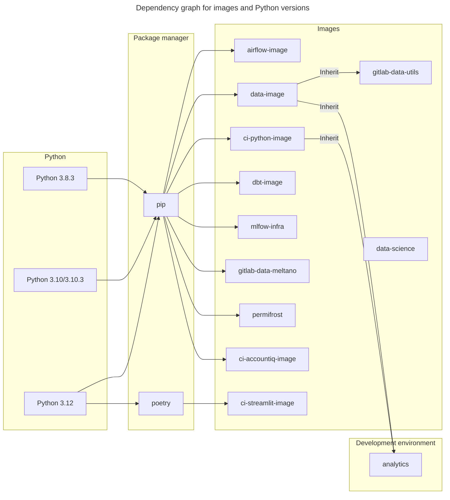

このページの主な目的は、データプラットフォームで使用しているインベントリの詳細をすべて管理することです。主に Python ライブラリと以下のツールについて考えています。
動機は、誰が、なぜ、いつ、何をアップグレードするかに関する詳細と基準を含む整然としたインベントリリストを維持することです。また、Python ライブラリの最新バージョンに関するすべての詳細を収集するコマンドラインアプリケーションについての、アップグレードに関する詳細な条件を公開する予定です。インベントリリストには以下が含まれます:

- 🐍 使用中の `Python` バージョン
- 🛠 使用中のツール（`dbt`、`airflow`、`permifrost`、`meltano`）
- 📚 使用中の Python ライブラリ_（パッケージ）_（例: `pandas`、`requests`、`matplotlib`）

すべてのツールやパッケージに DRI を設定することを目指しています。DRI の責任は、そのツールやパッケージを健全な状態に保つよう助言し、アップグレードを主導することです。

## アップグレードの一般的な動機

ツールのアップグレード戦略は各ツールに固有であるため、アップグレードをいつ行うか、どのような状況で行うかは DRI 次第です。

アップグレードの動機:

1. 脆弱性の低減
1. バグとクラッシュの修正
1. 更新された他のテクノロジーとの互換性確保
1. 使用する予定の新機能の導入
1. 適切なサポートの確保
1. 将来のアップグレードの容易化（バージョンを大幅に遅らせないため）
1. マーケットプレイスの関連性
1. サポート終了

### サポート終了のチェックアップ

**最低限**、サポート終了ポリシーを遵守します。サポートが終了したものは通常、重大なセキュリティ上のバグ修正も受け取れなくなるため、セキュリティリスクになります。
Python バージョンを更新する主なベンチマークは `end-of-life`（サポート終了）パラメーターです。バージョンがサポートされなくなった場合は、アップグレードの候補とすべきです。

## バージョンアップグレードの開始/スケジュール

DRI はツールやパッケージのドメインの専門家であり、新しいバージョンとリリースを監視します。アップグレードが適用可能な場合は、アップグレードを推薦・開始します。この推薦には以下が含まれます:

1. アップグレードの動機
1. 影響と依存関係
1. アップグレードの重要性（タイムライン）

上記は Issue に文書化され、毎週の Data Platform チームミーティングで議論されます。

### 計画

アップグレードは、Data Planning ドラムビートに従い、四半期ごとに OKR（P2）としてスケジュールされます。必要に応じて（セキュリティ脆弱性の場合など）、四半期中に P1 としてスケジュールできます。これにより、すでにスケジュールされていた P2-OKR の作業が妥協されることになります。

## Python イメージ/コンテナインベントリリスト

🐍`Python` を使用しているイメージがいくつかあります。以下の理由から、複数のバージョン（`>=3.7`）が使用されています:

- 異なるプロジェクトに対してユースケースが様々
- 一部のライブラリは特定の 🐍`Python` バージョン_（依存関係による）_を必要とする
- 複数のチームがイメージを使用しており、特定のバージョン実装に要件がある

> **表 1:** 使用中のイメージのリスト

| イメージ | 使用中のバージョン | イメージバージョン | DRI | ユーザー |
|--------------------------------------------------------------------------------------------------------------------|----------------|-------------------------------------|-----------|-----------------------|
| [analytics](https://gitlab.com/gitlab-data/analytics/-/blob/master) | `3.10` | `N\A` | `TBA` | `Data Platform` |
| [airflow-image](https://gitlab.com/gitlab-data/airflow-image/-/blob/main/src/Dockerfile?ref_type=heads) | `3.10.3` | `python:3.10.3` | `TBA` | `Data Platform` |
| [ci-python-image](https://gitlab.com/gitlab-data/ci-python-image/-/blob/main/src/Dockerfile) | `3.8.3` | `python:3.8.3-slim-buster` | `TBA` | `Data Platform` |
| [data-image](https://gitlab.com/gitlab-data/data-image/-/blob/master/data_image/Dockerfile?ref_type=heads) | `3.10.3` | `python:3.10.3` | `TBA` | `Data Platform` |
| [dbt-image](https://gitlab.com/gitlab-data/dbt-image/-/blob/main/src/Dockerfile) | `3.10.3` | `python:3.10.3` | `TBA` | `Data Platform` |
| [gitlab-data-meltano](https://gitlab.com/gitlab-data/gitlab-data-meltano/-/blob/main/Dockerfile?ref_type=heads) | `3.8` | `meltano/meltano:v2.16.1-python3.8` | `TBA` | `Data Platform` |
| [mlfow-infra](https://gitlab.com/gitlab-data/mlflow-infra/-/blob/main/mlflow_image/Dockerfile?ref_type=heads) | `3.8` | `python:3.8` | `TBA` | `Data Scientists` |
| [ci-streamlit-image](https://gitlab.com/gitlab-data/ci-streamlit-image/-/blob/main/src/Dockerfile?ref_type=heads) | `3.12` | `python:3.12-slim` | `@rbacovic` | `Data Platform` |
| [ci-accountiq-image](https://gitlab.com/gitlab-data/ci-accountiq-image/-/blob/main/src/Dockerfile?ref_type=heads) | `3.12` | `python:3.12-slim` | `@rbacovic` | `Data Platform` |

<details><summary>依存関係グラフ（クリックして展開）</summary>



</details>

### Python バージョンの更新アプローチ

このセクションは、特定のイメージで 🐍`Python` バージョンをアップグレードする方法とタイミングについてのガイドラインです。リストされた項目のほとんどは推奨事項とベストメソッドであるため、**いつ** Python バージョンをアップグレードするかに統一された条件はありません。この理由は、使用しているイメージの多様なユースケースです。

セキュリティの脆弱性もアップグレードの重要なベンチマークです。潜在的な Python 脆弱性を確認するためのソース:

- [cvedetails: Python: セキュリティ脆弱性](https://www.cvedetails.com/vulnerability-list/vendor_id-10210/product_id-18230/Python-Python.html)
- [readthedocs: Python セキュリティ脆弱性](https://python-security.readthedocs.io/vulnerabilities.html)

既知および確認された Python 脆弱性がある場合は、できるだけ早く Python バージョンのアップグレードプロセスを開始する必要があります。

一般的に、以下のテキストでは一連のアドバイスを公開しており、🐍`Python` バージョンをアップグレード**しない**特定の理由がある場合は、説明を公開することが良いでしょう。

🐍`Python` バージョンの維持・アップグレードと、特定のバージョンがいつ廃止されるかを確認するには、[Python サポートタイムライン](https://devguide.python.org/versions/)または代替として [endoflife.date](https://endoflife.date/python) を確認してください。使用しているイメージのインベントリリストは以下の表にリストされています。
Python バージョンのアップグレードは、イメージへの影響が大きい場合があるため、ケースバイケースで決定されます。特定のバージョンの `end-of-life`（サポート終了）を考慮することは良い選択です。

`end-of-life` ポリシーの例:
アップグレードポリシーに関しては、**最低限**サポート終了ポリシーを遵守すべきと考えています。
サポートが終了したものは通常、重大なセキュリティ上のバグ修正も受け取れなくなるため、セキュリティリスクになります。

> 1. [Python ライフサイクル](https://devguide.python.org/versions/)では、現在使用している以下の Python バージョンがサポート終了または終了間近です:
>    1. `3.7` はすでにサポート終了
>    1. `3.8` は 2024 年末にサポート終了

## ツールインベントリリスト

> **表 2:** GitLab Data チームが使用しているツールのリスト

| ツール名 | 使用中のバージョン | バージョンサポートタイムライン | アップグレード方法 | DRI | ユーザー | アップグレードポリシー |
|------------------------------------------------------------------------|----------------|------------------------------------------------------------------------------------------------------------------------|----------------------------------------------------------------------------------------------------------------------------------------------------------------------------------------------------------------------------------------------|------------|---------------------------------------------------------------------|----------------------------------------------------------------------------------------------|
| [dbt](/handbook/enterprise-data/platform/dbt-guide/) | `1.9.2` | [リンク](https://docs.getdbt.com/docs/dbt-versions/core#latest-releases) | - [dbt のアップグレードのベストプラクティス](https://docs.getdbt.com/docs/dbt-versions/core#best-practices-for-upgrading)<br>- [dbt バージョンのアップグレード](https://gitlab.com/gitlab-data/runbooks/-/blob/main/infrastructure/upgrading_dbt_version.md) | `TBA` | - `Data Platform`<br>- `Analytics Engineers`<br>- `Data Scientists` | 2バージョン以上遅れない（ベータリリースを除く）、最小サポートレベルは `critical` |
| [airflow](/handbook/enterprise-data/platform/infrastructure/#airflow) | `2.10.5` | [リンク](https://airflow.apache.org/docs/apache-airflow/stable/installation/supported-versions.html#version-life-cycle) | [Airflow のアップグレード計画](https://gitlab.com/gitlab-data/analytics/-/work_items/26008) | `TBA` | `Data Platform` | 現在のバージョンリリースから 1 年以上経過 |
| [permifrost](/handbook/enterprise-data/platform/permifrost/) | `0.15.4` | [リンク](https://gitlab.com/gitlab-data/permifrost) | [permifrost バージョンのアップグレード](https://gitlab.com/gitlab-data/permifrost/-/blob/master/RELEASE.md?ref_type=heads) | @rbacovic | `Data Platform` | 2バージョン以上遅れない（ベータリリースを除く） |
| [meltano](/handbook/enterprise-data/platform/Meltano-Gitlab/) | `2.16.1` | [リンク](https://github.com/meltano/meltano/releases) | [Meltano バージョンのアップグレード](https://gitlab.com/gitlab-data/gitlab-data-meltano/-/merge_requests/34) | `TBA` | `Data Platform` | 現在のバージョンリリースから 1 年以上経過 |

### dbt パッケージインベントリ

| パッケージ名 | 使用中のバージョン | DRI | ユーザー |
|---------------------------------------------------------------------------------------------|----------------|-------|----------------------------------------|
| [snowflake_spend](https://gitlab.com/gitlab-data/snowflake_spend) | `1.1` | `N\A` |-Data Engineers<br>-Analytics Engineers |
| [data-tests](https://gitlab.com/gitlab-data/data-tests) | `N\A` | `N\A` |-Data Engineers<br>-Analytics Engineers |
| [dbt-labs/audit_helper](https://github.com/dbt-labs/dbt-audit-helper) | `0.9.0` | `N\A` |-Data Engineers<br>-Analytics Engineers |
| [dbt-labs/dbt_utils](https://github.com/dbt-labs/dbt-utils) | `1.1.1` | `N\A` |-Data Engineers<br>-Analytics Engineers |
| [dbt-labs/snowplow](https://github.com/dbt-labs/snowplow/tree/0.15.1/) | `0.15.1` | `N\A` |-Data Engineers<br>-Analytics Engineers |
| [dbt-labs/dbt_external_tables](https://hub.getdbt.com/dbt-labs/dbt_external_tables/latest/) | `0.8.7` | `N\A` |-Data Engineers<br>-Analytics Engineers |
| [brooklyn-data/dbt_artifacts](https://github.com/brooklyn-data/dbt_artifacts) | `2.8.0` | `N\A` |-Data Engineers<br>-Analytics Engineers |

### ツールバージョンの更新アプローチ

`end-of-life` ポリシーの例:
アップグレードポリシーに関しては、**最低限**サポート終了ポリシーを遵守すべきと考えています。
サポートが終了したものは通常、重大なセキュリティ上のバグ修正も受け取れなくなるため、セキュリティリスクになります。

> 1. [airflow ライフサイクル](https://airflow.apache.org/docs/apache-airflow/stable/installation/supported-versions.html) では、`1.10.15` のサポート終了は `2021年6月17日` でした。今後は、このサポート終了ルールに従ってより早くアップグレードするよう努める必要があります
> 1. dbt [最新リリース](https://docs.getdbt.com/docs/dbt-versions/core#latest-releases)
>    1. `v1.2` と `v1.3` はすでにサポート終了で、2023 年末には完全に廃止予定
>    1. dbt はアップグレードのための[ベストプラクティス](https://docs.getdbt.com/docs/dbt-versions/core#best-practices-for-upgrading)を説明しており、そのうちの1つは少なくとも新しい `パッチバージョン`（_「バグフィックス」_ または _「セキュリティ」_ リリース）にアップグレードすることです

## ライブラリインベントリリスト

ライブラリインベントリリストは部分的に自動化されたプロセスです。ライブラリのアップグレードに必要なすべての情報を収集するコマンドラインアプリケーションがあります。ライブラリに関するすべての情報を収集することに加えて、アップグレードプロセスに役立つ 2 つのレポートを生成します:

1. **各イメージのインベントリリストを取得** - 実装しているライブラリが古くなっていないか、最新バージョンからどれだけ遅れているかを確認するためのユーティリティ。
2. **イメージ間の重複バージョンを確認** - イメージ間でバージョンが同期していない場合があるかどうか確認します。ライブラリのバージョンが同期していない場合、特定の理由がある可能性があります。一般的に、イメージ間でユニークなバージョンを維持することが有益です_（可能であれば、かつ支障がなければ）_。

このプログラムを実行するには、`/package_inventory` [リポジトリ](https://gitlab.com/gitlab-data/package_inventory/-/tree/master/README.md) をチェックアウトして、以下のコードを実行してください:

- プログラムを実行する

```bash
# run file
python3 gitnventory.py [--dry-run] [--logging [print/logging]] [--report_folder DEFINE_FOLDER] [--log_file DEFINE_LOG_FILE] [--help]
```

プログラムの実行方法の詳細は、[**ソースコード**](https://gitlab.com/gitlab-data/package_inventory/-/tree/master/README.md)を参照してください。

**注意:** ライブラリの最新バージョンのプライマリソースとして [PyPi](pypi.org) と [GitLab Data](https://gitlab.com/groups/gitlab-data) グループを使用していることに注意してください。

> **表 3:** Python ライブラリの DRI

| ツール名 | DRI |
|------------------|-----------|
| Python ライブラリ | @rbacovic |

### ライブラリの更新アプローチ

アップグレード候補リスト作成の提案:

> **表 4:** Python、ツール、ライブラリバージョンのアップグレード基準の例

| 基準 | 例 | 実装リスク<br>（1.0 低, 5.0 高） |
|--------------------------------------------------------------------------------------|-----------------------------------------------------------------------------|----------------------------------------------------|
| 現在のバージョンが古くなってサポートされなくなった（`end-of-life` ポリシー） | [Python 2.7](https://docs.python.org/release/2.7/) | `4.0` ⭐⭐⭐⭐☆ |
| 現在のバージョンに脆弱性がある | [記事](https://unit42.paloaltonetworks.com/malicious-packages-in-pypi/) | `N\A` |
| メジャーバージョンがリリース | 現在のバージョン: `2.1.0`<br>最新バージョン `3.0.0` | `3.0` ⭐⭐⭐☆☆ |
| マイナーバージョンがリリース | 現在のバージョン: `2.1.0`<br>最新バージョン `2.2.0` | `1.0` ⭐☆☆☆ |
| パッチバージョンがリリース | 現在のバージョン: `2.1.0`<br>最新バージョン `2.1.8` | `1.0` ⭐☆☆☆☆ |

ライブラリの更新時期を決定することは難しい場合があるため、いくつかの考慮事項が役立ちます。アップグレードを検討する（`end-of-life` 基準に加えて）:

- 特定のバージョンに必要な新機能 - 必要/使いたい重要な機能がある場合は、アップグレードに進みます
- パッケージに深刻な脆弱性がある場合のみアップグレード - これは常にレッドフラグであり、すぐにアップグレードを開始する必要があります
- x メジャー/マイナーバージョン以上遅れている場合にアップグレード - アップグレードに進む十分な理由であると思われますが、影響を真剣に考慮する必要があります。例えば、新しいメジャーバージョンへのジャンプが、場合によっては Python の新バージョンを必要とします。リスクが適切に評価されていれば、アップグレードに進む必要があります

#### 依存関係のチェックアップ

アップグレードの理由は、依存しているツール/パッケージにある場合があります。例えば、`dbt` をアップグレードする予定があり、場合によっては 🐍 `Python` のアップグレードも必要になることがあります _（`dbt-image` の場合）_。それが Python のアップグレードの理由になることがあります。他のツール _（この例では `dbt`）_ が必要とするからです。

## アップグレードのヒントとコツ

✅ **やること**:

- プラットフォームに影響を与える可能性のある[既知の Issue](https://www.cisa.gov/known-exploited-vulnerabilities-catalog)がある場合は特別なアップグレードを行う
- 🐍 `Python` パッケージをメジャーバージョン変更にアップグレードする際は、イメージで使用されている Python バージョンとの互換性を確認してください（衝突が生じる可能性があります）
- インストール/アップグレードしたい 🐍 `Python` パッケージが安全で悪意のあるコードが含まれていないかを確認する
- 他のパッケージとの後方互換性を常に確認する _（プロジェクトの CI パイプラインがイメージビルド中に役立ちます）_。

🛑 **やらないこと**:

- ソフトウェアの `pre-release` バージョンにアップグレードしない。常に[安定版リリース](https://en.wikipedia.org/wiki/Software_release_life_cycle#Stable_release)バージョンを使用する
- `non-trusted` ソースを使用しない。インストールのソースとして [PyPi](pypi.org) または [GitLab Data](https://gitlab.com/groups/gitlab-data) グループのパッケージを優先する

### アップグレードのロギング

> **表 5:** アップグレードに関する活動のログ

| 四半期<br>_（どの四半期にアップグレード計画を行うか）_ | アップグレード確認の Issue<br>_（アップグレード計画に使用する Issue へのリンク）_ | アップグレード実行<br>_（どの四半期にアップグレードを実行するか）_ | 計画されたアップグレードの Epic<br>_（アップグレード実行に使用する Epic へのリンク）_ | アップグレードの種類<br>[`Python`\|`Tool`\|`Libraries`]<br>（アップグレード予定のオブジェクトの種類） | DRI<br>_（アップグレード計画に必要なことを確認する個人）_ |
|--------------------------------------------------------|----------------------------------------------------------------------------------------------------|-------------------------------------------------------------------|----------------------------------------------------------------------------------------------------|---------------------------------------------------------------------------------------------------|------------------------------------------------------------------------------------|
| `FY24Q4` | [#19248](https://gitlab.com/gitlab-data/analytics/-/issues/19248#package-version-inventory) | `FY25Q1` | | | @rbacovic |
| `FY25Q1` | [#20233](https://gitlab.com/gitlab-data/analytics/-/issues/20233) | `FY25Q2` | | | @rbacovic |
| `FY25Q2` | [#21082](https://gitlab.com/gitlab-data/analytics/-/issues/21082) | `FY25Q3` | | | @rbacovic |
| `FY27Q1` | [#26436](https://gitlab.com/gitlab-data/analytics/-/work_items/26436) | | | | @rbacovic |
