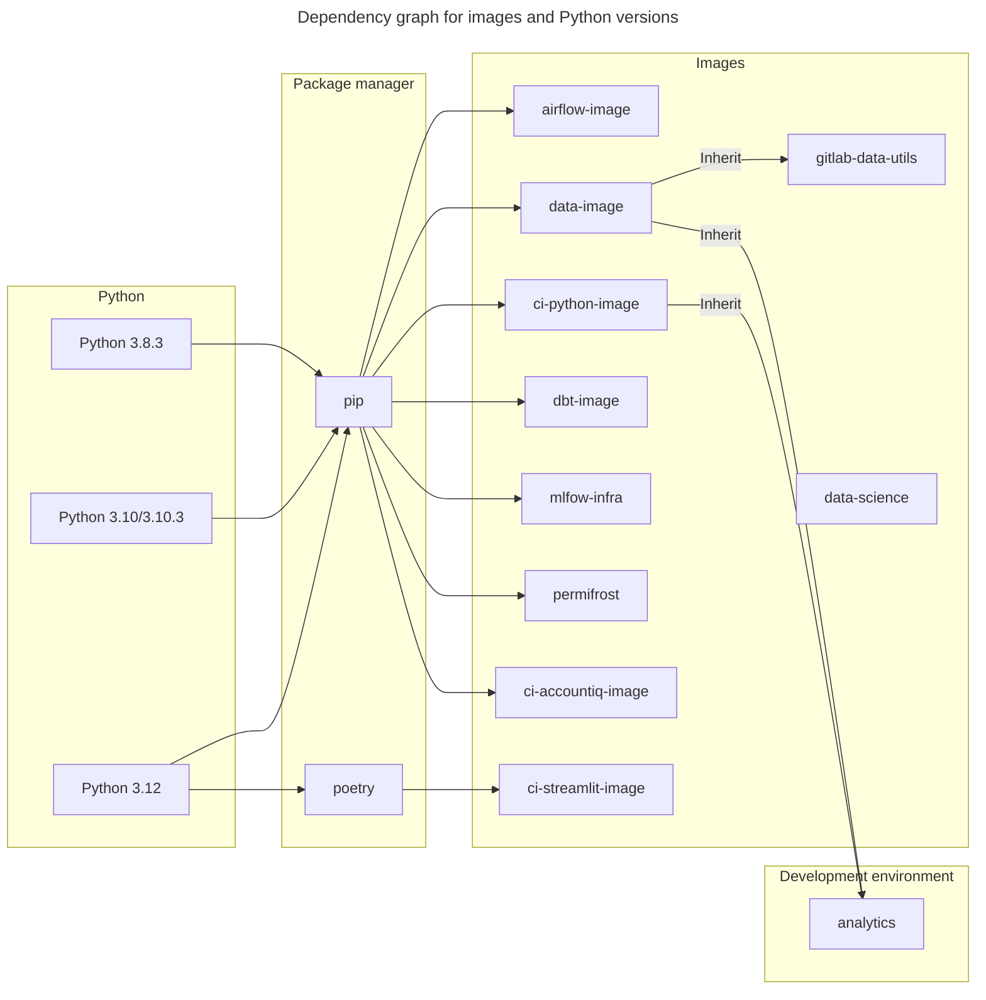

このページの主な目的は、Data Platform で使用しているインベントリについて、主に Python ライブラリと以下のツールを念頭に置きながら、すべての詳細を保持することです。
目的は、誰が、なぜ、いつ、何をアップグレードするのかという詳細と基準を含む、整理されたインベントリ一覧を維持することです。また、Python ライブラリの最近のバージョンと最新バージョンに関する詳細を収集するための、アップグレードとコマンドラインアプリケーションに関する詳細な条件を公開する予定です。インベントリ一覧には以下が含まれます。

- 🐍 使用中の `Python` バージョン
- 🛠 使用しているツール（`dbt`、`airflow`、`permifrost`）
- 📚 使用している Python ライブラリ _（パッケージ）_（例: `pandas`、`requests`、`matplotlib`）

私たちは、すべてのツールまたはパッケージに DRI を置くことを目指しています。DRI の責任は、そのツールまたはパッケージを健全な状態に保つため、アップグレードについて助言すること、またはアップグレードを開始することです。

## アップグレードの一般的な動機

ツールのアップグレード戦略は各ツールに固有であるため、いつ、どのような状況でアップグレードするかは DRI に委ねられています。

アップグレードの動機:

1. 脆弱性を減らす
1. バグやクラッシュを修正する
1. 他の更新済みテクノロジーとの互換性を確保する
1. 使用する予定の新機能が導入された
1. 適切なサポートを確保する
1. 将来のアップグレードを容易にする（バージョンが古くなりすぎないようにする）
1. Marketplace での関連性
1. End of life

### End of life の確認

**最低限**、私たちは end of life ポリシーに従います。これは、非推奨になったものは通常、重大なセキュリティ修正を含むバグ修正を受けられなくなり、私たちにとってセキュリティリスクになるためです。
Python バージョンを更新する主な基準は `end-of-life` パラメーターです。そのバージョンがすでにサポートされていない場合は、アップグレードの候補にするべきです。

## バージョンアップグレードの開始 / スケジュール

DRI は、自分のツールまたはパッケージの領域における専門家であり、新しいバージョンやリリースを監視します。アップグレードが適用可能な場合、その助言を行い、アップグレードを開始します。この助言には以下が含まれます。

1. アップグレードの動機
1. 影響と依存関係
1. アップグレードの重要度（タイムライン）

上記は Issue に記録され、週次の Data Platform Team ミーティングで議論されます。

### 計画

アップグレードは、Data Planning のドラムビートに従い、四半期ごとに OKR（P2）としてスケジュールされます。必要な場合（例: セキュリティ脆弱性がある場合）は、四半期中に P1 としてスケジュールできます。その結果、すでにスケジュールされていた P2-OKR 作業を妥協することになります。

## Python イメージ / コンテナのインベントリ一覧

私たちは複数の 🐍`Python` イメージを使用しています。さまざまなバージョン（`>=3.7`）が使用されている理由は以下のとおりです。

- プロジェクトごとにユースケースが異なる
- 一部のライブラリは特定の 🐍`Python` バージョンを必要とする _（依存関係のため）_
- 複数のチームがイメージを使用しており、特定バージョンの実装に要件がある

> **表 1:** 使用しているイメージ一覧

| イメージ                                                                                                           | 使用中のバージョン | イメージバージョン                  | DRI       | ユーザー              |
|--------------------------------------------------------------------------------------------------------------------|--------------------|-------------------------------------|-----------|-----------------------|
| [analytics](https://gitlab.com/gitlab-data/analytics/-/blob/master)                                                | `3.10`             | `N\A`                               | `TBA`     | `Data Platform`       |
| [airflow-image](https://gitlab.com/gitlab-data/airflow-image/-/blob/main/src/Dockerfile?ref_type=heads)            | `3.10.3`           | `python:3.10.3`                     | `TBA`     | `Data Platform`       |
| [ci-python-image](https://gitlab.com/gitlab-data/ci-python-image/-/blob/main/src/Dockerfile)                       | `3.8.3`            | `python:3.8.3-slim-buster`          | `TBA`     | `Data Platform`       |
| [data-image](https://gitlab.com/gitlab-data/data-image/-/blob/master/data_image/Dockerfile?ref_type=heads)         | `3.10.3`           | `python:3.10.3`                     | `TBA`     | `Data Platform`       |
| [dbt-image](https://gitlab.com/gitlab-data/dbt-image/-/blob/main/src/Dockerfile)                                   | `3.10.3`           | `python:3.10.3`                     | `TBA`     | `Data Platform`       |
| [mlfow-infra](https://gitlab.com/gitlab-data/mlflow-infra/-/blob/main/mlflow_image/Dockerfile?ref_type=heads)      | `3.8`              | `python:3.8`                        | `TBA`     | `Data Scientists`     |
| [ci-streamlit-image](https://gitlab.com/gitlab-data/ci-streamlit-image/-/blob/main/src/Dockerfile?ref_type=heads)  | `3.12`             | `python:3.12-slim`                  | `@rbacovic`     | `Data Platform`     |
| [ci-accountiq-image](https://gitlab.com/gitlab-data/ci-accountiq-image/-/blob/main/src/Dockerfile?ref_type=heads)  | `3.12`             | `python:3.12-slim`                  | `@rbacovic`     | `Data Platform`     |

<details><summary>依存関係グラフ（クリックして展開）</summary>



</details>

### Python バージョン更新へのアプローチ

このセクションは、特定のイメージ内の 🐍`Python` バージョンをどのように、いつアップグレードするかのガイドラインです。Python バージョンを**いつ**アップグレードするかについて統一された条件はなく、列挙されている項目のほとんどは推奨事項とベストメソッドです。この記述の主な理由は、私たちが使用しているイメージのユースケースが多様であるためです。

追加アップグレードのもう 1 つの重要な基準は、セキュリティ脆弱性です。潜在的な Python 脆弱性を確認するソースは以下のとおりです。

- [cvedetails: Python: Security Vulnerabilities](https://www.cvedetails.com/vulnerability-list/vendor_id-10210/product_id-18230/Python-Python.html)
- [readthedocs: Python Security Vulnerabilities](https://python-security.readthedocs.io/vulnerabilities.html)

既知で確認済みの Python 脆弱性がある場合は、できるだけ早く Python バージョンのアップグレードプロセスを開始するべきです。

一般的に、以下のテキストでは一連の助言を公開しており、🐍`Python` バージョンをアップグレード**しない**特定の理由がある場合は、その説明を公開するとよいでしょう。

🐍`Python` バージョンの維持とアップグレード、および特定バージョンがいつ廃止されるかの確認については、[Python supported timeline](https://devguide.python.org/versions/)を確認するか、代替として [endoflife.date](https://endoflife.date/python)を確認できます。使用しているイメージのインベントリ一覧は以下の表に記載されています。
Python バージョンのアップグレードは、イメージへの影響が大きい可能性があるため、ケースバイケースで判断します。特定バージョンの `end-of-life` を考慮することは良い選択肢です。

`end-of-life` ポリシーの例:
アップグレードポリシーについては、**最低限**、end of life ポリシーに従うべきだと考えています。
これは、非推奨になったものは通常、重大なセキュリティ修正を含むバグ修正を受けられなくなり、私たちにとってセキュリティリスクになるためです。

> 1. [Python life cycle](https://devguide.python.org/versions/)によると、現在使用している以下の Python バージョンは end-of-life であるか、それに近い状態です。
>    1. `3.7` はすでに end of life
>    1. `3.8` は 2024 年末に end of life

## ツールのインベントリ一覧

> **表 2:** GitLab Data team が使用しているツール一覧

| ツール名                                                               | 使用中のバージョン | サポート対象バージョンのタイムライン                                                                         | アップグレード方法                                                                                                                                                                                                                           | DRI        | ユーザー                                                            | アップグレードポリシー                                                                       |
|------------------------------------------------------------------------|--------------------|--------------------------------------------------------------------------------------------------------------|----------------------------------------------------------------------------------------------------------------------------------------------------------------------------------------------------------------------------------------------|------------|---------------------------------------------------------------------|----------------------------------------------------------------------------------------------|
| [dbt](/handbook/enterprise-data/platform/dbt-guide/)                   | `1.9.2`            | [link](https://docs.getdbt.com/docs/dbt-versions/core#latest-releases)                                       | - [dbt best practices for upgrading](https://docs.getdbt.com/docs/dbt-versions/core#best-practices-for-upgrading)<br>- [Upgrading dbt version](https://gitlab.com/gitlab-data/runbooks/-/blob/main/infrastructure/upgrading_dbt_version.md)  | `TBA`      | - `Data Platform`<br>- `Analytics Engineers`<br>- `Data Scientists` | 2 バージョンより遅れない（ベータリリースを除く）かつ最小サポートレベルは `critical`        |
| [airflow](/handbook/enterprise-data/platform/infrastructure/#airflow)  | `2.10.5`           | [link](https://airflow.apache.org/docs/apache-airflow/stable/installation/supported-versions.html#version-life-cycle)  | [Upgrade Plan for Airflow](https://gitlab.com/gitlab-data/analytics/-/work_items/26008)                                                                                                                                                      | `TBA`      | `Data Platform`                                                     | 現在のバージョンがリリースから 1 年超                                                        |
| [permifrost](/handbook/enterprise-data/platform/permifrost/)           | `0.15.4`           | [link](https://gitlab.com/gitlab-data/permifrost)                                                            | [Upgrading permifrost version](https://gitlab.com/gitlab-data/permifrost/-/blob/master/RELEASE.md?ref_type=heads)                                                                                                                            | @rbacovic  | `Data Platform`                                                     | 2 バージョンより遅れない（ベータリリースを除く）                                            |

### dbt パッケージのインベントリ

| パッケージ名                                                                                | 使用中のバージョン |  DRI  | ユーザー                               |
|---------------------------------------------------------------------------------------------|--------------------|-------|----------------------------------------|
| [snowflake_spend](https://gitlab.com/gitlab-data/snowflake_spend)                           | `1.1`              | `N\A` |-Data Engineers<br>-Analytics Engineers |
| [data-tests](https://gitlab.com/gitlab-data/data-tests)                                     | `N\A`              | `N\A` |-Data Engineers<br>-Analytics Engineers |
| [dbt-labs/audit_helper](https://github.com/dbt-labs/dbt-audit-helper)                       | `0.9.0`            | `N\A` |-Data Engineers<br>-Analytics Engineers |
| [dbt-labs/dbt_utils](https://github.com/dbt-labs/dbt-utils)                                 | `1.1.1`            | `N\A` |-Data Engineers<br>-Analytics Engineers |
| [dbt-labs/snowplow](https://github.com/dbt-labs/snowplow/tree/0.15.1/)                      | `0.15.1`           | `N\A` |-Data Engineers<br>-Analytics Engineers |
| [dbt-labs/dbt_external_tables](https://hub.getdbt.com/dbt-labs/dbt_external_tables/latest/) | `0.8.7`            | `N\A` |-Data Engineers<br>-Analytics Engineers |
| [brooklyn-data/dbt_artifacts](https://github.com/brooklyn-data/dbt_artifacts)               | `2.8.0`            | `N\A` |-Data Engineers<br>-Analytics Engineers |

### ツールバージョン更新へのアプローチ

`end-of-life` ポリシーの例:
アップグレードポリシーについては、**最低限**、end of life ポリシーに従うべきだと考えています。
これは、非推奨になったものは通常、重大なセキュリティ修正を含むバグ修正を受けられなくなり、私たちにとってセキュリティリスクになるためです。

> 1. [airflow life cycle](https://airflow.apache.org/docs/apache-airflow/stable/installation/supported-versions.html)によると、`1.10.15` の end of life は `June 17, 2021` でした。そのため今後は、この end of life ルールに従う場合、より早い段階でアップグレードするようにします。
> 1. dbt [latest releases](https://docs.getdbt.com/docs/dbt-versions/core#latest-releases)
>    1. `v1.2` と `v1.3` はすでに end of life であり、2023 年末に完全に非推奨になります。
>    1. dbt はアップグレードの[ベストプラクティス](https://docs.getdbt.com/docs/dbt-versions/core#best-practices-for-upgrading)を説明しており、その 1 つは少なくとも新しい `patch versions`、つまり _"bugfix"_ または _"security"_ リリースへアップグレードすることです。

## ライブラリのインベントリ一覧

ライブラリのインベントリ一覧は、ライブラリのアップグレードに必要なすべての情報を収集するコマンドラインアプリケーションを用いた、やや自動化されたプロセスです。ライブラリに関するすべての情報を収集するだけでなく、このアプリケーションはアップグレードプロセスに役立つ 2 つのレポートを生成します。

1. **各イメージのインベントリ一覧を取得** - 実装しているライブラリが古いかどうか、最新バージョンからどの程度離れているかを確認するため。
2. **イメージ間で重複しているバージョンを確認** - 複数のイメージで使用されているバージョンがあり、そのバージョンが同期していないかを確認するため。ライブラリのバージョンが同期していない場合、ミスマッチしている具体的な理由がある可能性があります。一般的には、_（可能であり、阻害要因でない場合）_ イメージ間で一意のバージョンを維持すると便利です。

このプログラムを実行するには、`/package_inventory` [repo](https://gitlab.com/gitlab-data/package_inventory/-/tree/master/README.md)をチェックアウトし、以下のコードを実行してください。

- プログラムを実行

```bash
# run file
python3 gitnventory.py [--dry-run] [--logging [print/logging]] [--report_folder DEFINE_FOLDER] [--log_file DEFINE_LOG_FILE] [--help]
```

プログラムがどのように実行されているかの詳細は、[**source code**](https://gitlab.com/gitlab-data/package_inventory/-/tree/master/README.md)を参照してください。

**注:** 私たちは、ライブラリの最新バージョンの主な情報源として [PyPi](pypi.org) と [GitLab Data](https://gitlab.com/groups/gitlab-data) グループに依存していることを念頭に置いてください。

> **表 3:** Python ライブラリの DRI

| ツール名         | DRI       |
|------------------|-----------|
| Python libraries | @rbacovic |

### ライブラリ更新へのアプローチ

アップグレード基準の候補リストを作成するための提案:

> **表 4:** Python、ツール、ライブラリのバージョンアップグレード基準の例

| 基準                                                                                 | 例                                                                          | 実装リスク<br>（1.0 低、5.0 高） |
|--------------------------------------------------------------------------------------|-----------------------------------------------------------------------------|----------------------------------|
| 現在のバージョンが古く、すでにサポートされていない（`end-of-life` ポリシー）         | [Python 2.7](https://docs.python.org/release/2.7/)                                                          | `4.0` ⭐⭐⭐⭐☆                      |
| 現在のバージョンに脆弱性がある                                                     | [Article](https://unit42.paloaltonetworks.com/malicious-packages-in-pypi/)  | `N\A`                            |
| メジャーバージョンがリリースされた                                                   | 現在のバージョン: `2.1.0`<br>最新バージョン `3.0.0`                          | `3.0` ⭐⭐⭐☆☆                      |
| マイナーバージョンがリリースされた                                                   | 現在のバージョン: `2.1.0`<br>最新バージョン `2.2.0`                          | `1.0` ⭐☆☆☆                       |
| パッチバージョンがリリースされた                                                     | 現在のバージョン: `2.1.0`<br>最新バージョン `2.1.8`                          | `1.0` ⭐☆☆☆☆                      |

ライブラリの更新は、いつ、なぜアップグレードするかを判断するのが難しい場合がありますが、いくつかの検討事項が役立ちます。`end-of-life` 基準に加えて、以下の場合はアップグレードを検討するべきです。

- 特定バージョンの新機能が必要 - 必要または使用したい重要な機能がある場合は、アップグレードに進むべきです。
- パッケージに重大な脆弱性がある場合のみアップグレード - これは常に重大な警告であり、直ちにアップグレードを開始するべきです。
- x メジャー / マイナーバージョンより遅れている場合にアップグレード - 影響を慎重に検討したうえで、アップグレードへ進む十分な理由になる可能性があります。たとえば、新しいメジャーバージョンへ移行する場合、ケースによっては新しい Python バージョンが必要になります。リスクが適切に評価されている場合は、進めるべきです。

#### 依存関係の確認

アップグレードの理由は、依存ツール / パッケージである場合があります。たとえば、`dbt` をアップグレードする予定があり、それに伴って 🐍 `Python` のアップグレードも必要になることがあります _（`dbt-image` イメージの場合）_。他のツール _（この例では `dbt`）_ に必要とされるため、Python をアップグレードする理由になり得ます。

## アップグレードのヒントとコツ

✅ **やること**:

- プラットフォームに影響を与える可能性のある[既知の Issue](https://www.cisa.gov/known-exploited-vulnerabilities-catalog)がある場合は、臨時のアップグレードを行う
- 🐍 `Python` パッケージをメジャーバージョン変更へアップグレードする場合、イメージ内で有効な Python バージョンとの互換性を確認する。衝突が発生する可能性があります。
- インストール / アップグレードしたい 🐍 `Python` パッケージが安全であり、悪意のあるコードを含んでいないか確認する
- 他のパッケージとの後方互換性を常に確認する _（プロジェクト内の pipeline が、イメージビルド中にここを支援します）_。

🛑 **やらないこと**:

- ソフトウェアの `pre-release` バージョンにはアップグレードせず、常に[stable release](https://en.wikipedia.org/wiki/Software_release_life_cycle#Stable_release) バージョンを使用する
- `non-trusted` ソースを使用しない。インストール元としては [PyPi](pypi.org) または [GitLab Data](https://gitlab.com/groups/gitlab-data) グループのパッケージを推奨します。

### アップグレードログ

> **表 5:** アップグレードに関する活動ログ

| 四半期<br>_（どの四半期にアップグレード計画を行うか）_ | アップグレード確認用 Issue<br>_（アップグレード計画に使用する予定の Issue へのリンクを入れる）_ | アップグレード実行<br>_（どの四半期にアップグレード実行を行うか）_ | 計画済みアップグレード用 Epic<br>_（アップグレード実行に使用する予定のエピックへのリンクを入れる）_ | アップグレード種別<br>[`Python`\|`Tool`\|`Libraries`]<br>（アップグレード予定の対象種別） | DRI<br>_（アップグレード計画に必要な内容を確認する担当者）_ |
|--------------------------------------------------------|----------------------------------------------------------------------------------------------------|-------------------------------------------------------------------|----------------------------------------------------------------------------------------------------|---------------------------------------------------------------------------------------------------|------------------------------------------------------------------------------------|
| `FY24Q4`                                               | [#19248](https://gitlab.com/gitlab-data/analytics/-/issues/19248#package-version-inventory)        | `FY25Q1`                                                          |                                                                                                    |                                                                                                   | @rbacovic                                                                          |
| `FY25Q1`                                               | [#20233](https://gitlab.com/gitlab-data/analytics/-/issues/20233)                                  | `FY25Q2`                                                          |                                                                                                    |                                                                                                   | @rbacovic                                                                          |
| `FY25Q2`                                               | [#21082](https://gitlab.com/gitlab-data/analytics/-/issues/21082)                                  | `FY25Q3`                                                          |                                                                                                    |                                                                                                   | @rbacovic                                                                          |
| `FY27Q1`                                               | [#26436](https://gitlab.com/gitlab-data/analytics/-/work_items/26436)                              |                                                                   |                                                                                                    |                                                                                                   | @rbacovic                                                                          |
