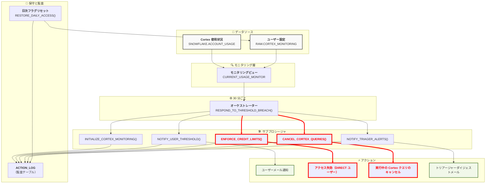
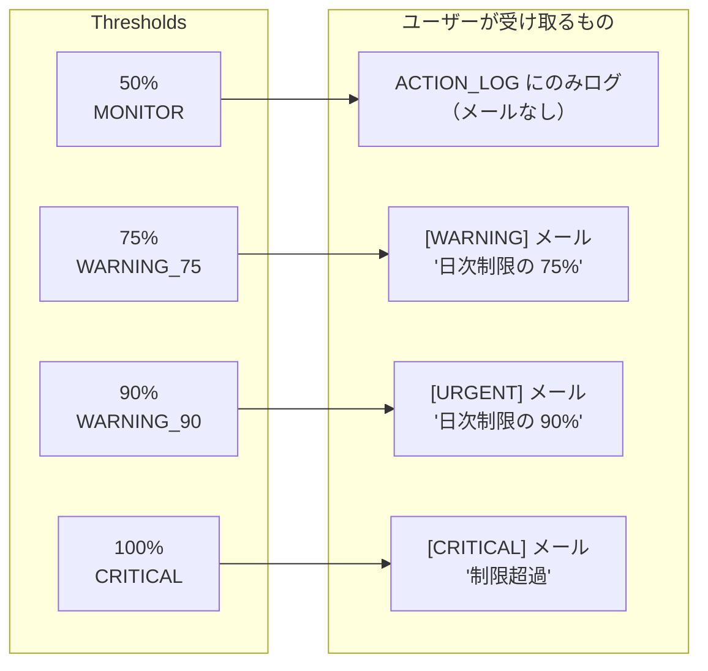
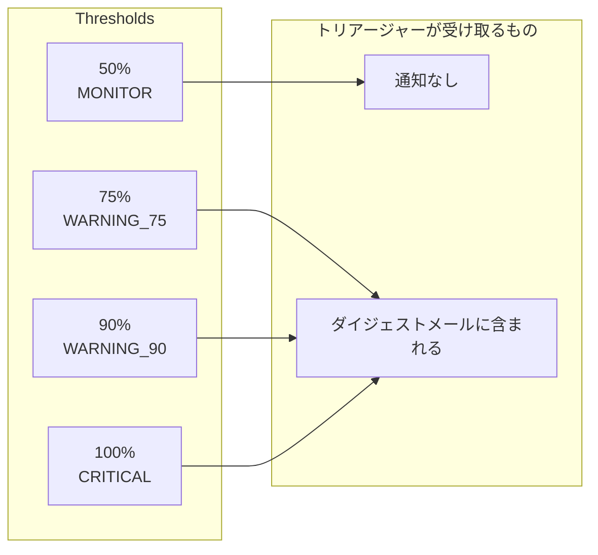

## 目次

1. [概要](#overview)
2. [Cortex AI アクセスの取得方法](#how-to-get-cortex-ai-access)
3. [アーキテクチャ](#architecture)
4. [データベースオブジェクト](#database-objects)
5. [アクセス分類](#access-classification)
6. [通知ロジック](#notification-logic)
7. [ストアドプロシージャ](#stored-procedures)
8. [スケジュールタスク](#scheduled-tasks)
9. [セットアップと設定](#setup-and-configuration)
10. ランブックとトラブルシューティングガイド

---

## 概要

Cortex AI クレジットモニタリングシステムは、すべてのユーザーにわたる Snowflake Cortex AI クレジット消費を追跡・制御します。Cortex AI へのアクセスは **`CORTEX_FUNCTIONS`** アカウントロールを通じて付与されます — 下記の[Cortex AI アクセスの取得方法](#how-to-get-cortex-ai-access)を参照してください。

このシステムが提供するもの：

- `CORTEX_AISQL_USAGE_HISTORY`、`CORTEX_AGENT_USAGE_HISTORY`、`CORTEX_ANALYST_USAGE_HISTORY`、`CORTEX_CODE_CLI_USAGE_HISTORY` を通じたリアルタイム使用状況モニタリング
- 再帰的なロール階層トラバーサル（最大 10 レベル）による自動ユーザー検出
- 以下の動作を持つ階層型モニタリングとアラート：
  - **50%（MONITOR）**: `ACTION_LOG` へのログのみ — メール送信なし
  - **75%（WARNING_75）**: ユーザーへのメール通知 + トリアージャーダイジェストに含まれる
  - **90%（WARNING_90）**: ユーザーへの緊急メール + トリアージャーダイジェストに含まれる
  - **100%（CRITICAL）**: ユーザーへのクリティカルメール + トリアージャーダイジェストに含まれる + **アクセス失効**（DIRECT ユーザー）または**手動レビューのフラグ立て**（INHERITED ユーザー）
- 日次制限の 100% を超えた DIRECT ユーザーのアクセス自動失効（`CORTEX_FUNCTIONS` ロールを失効）
- INHERITED ユーザーのエスカレーションワークフロー（自動失効不可 — 手動介入のためトリアージャーに通知）
- 真夜中 UTC のフラグ日次リセット（失効ユーザーのアクセス復元は Permifrost 経由）
- 保守性と柔軟性のための分離されたアーキテクチャ
- CRITICAL ユーザーの実行中 Cortex クエリの自動キャンセル（`SYSTEM$CANCEL_QUERY` 経由）（施行後の残留コストを防ぐ）

⚠️ Tableau と BI ツール: AI Functions を直接呼び出さないこと

Snowflake Cortex AI functions は、Tableau やその他の BI ツールから直接呼び出してはなりません。そうすると、クエリが実行されるたびに AI functions が再実行され、予測不能なコストと一貫性のない結果を引き起こします。詳細については[こちら](/handbook/enterprise-data/platform/snowflake/snowflake-ai-function/snowflake-ai-function/#purpose)を参照してください。

## プロセスの概要

私たちのモニタリングシステムは Snowflake Cortex 関数のトークンとクレジット使用量を監視し、制限に近づいているチームメンバーに通知し、制限を超えた場合は 1 日のアクセスを一時的に自動失効させます（3:00 AM UTC に復元）。これにより過度の使用とコストを防ぎます。

### 主な機能

| 機能 | 説明 |
|---------|-------------|
| **自動ユーザー検出** | 再帰的なロール階層 MERGE がすべての Cortex ユーザーを追加 |
| **ユーザー分類** | DIRECT と INHERITED アクセスの追跡 |
| **しきい値アラート** | MONITOR（50%）、WARNING_75、WARNING_90、CRITICAL |
| **自動失効** | DIRECT ユーザーの権限自動削除 |
| **エスカレーション** | INHERITED ユーザーの手動介入アラート |
| **トリアージャーダイジェスト** | すべてのアラートを 1 通のメールに統合 |
| **日次リセット** | 真夜中のフラグリセット（アクセス復元は Permifrost 経由） |
| **監査ログ** | ACTION_LOG への完全なアクション履歴 |

---

## Cortex AI アクセスの取得方法

Snowflake における Cortex AI アクセスは **`CORTEX_FUNCTIONS`** アカウントロールで制御されます。これは GitLab で Cortex AI アクセスを得るための唯一サポートされている方法です — 個々の Cortex データベースロールを直接リクエストしないでください。

### アクセスのリクエスト

1. [`snowflake-permissions`](https://gitlab.com/gitlab-data/snowflake-permissions) リポジトリで**マージリクエストを開く**
2. **`roles.yml` を編集**して、ユーザーレベルのロールに `CORTEX_FUNCTIONS` を追加する。例：

    ```yaml
    your_username:
      member_of:
        - CORTEX_FUNCTIONS
    ```

3. **MR をレビュー・マージしてもらう** — Permifrost が自動的にグラントを適用します

### `CORTEX_FUNCTIONS` が付与するもの

`CORTEX_FUNCTIONS` ロールは、6 つすべての Snowflake Cortex データベースロールをバンドルします：

| データベースロール | 有効化される機能 |
|---|---|
| `SNOWFLAKE.CORTEX_USER` | コア AI SQL 関数 — `COMPLETE`、`SENTIMENT`、`SUMMARIZE`、`TRANSLATE` など |
| `SNOWFLAKE.CORTEX_AGENT_USER` | Cortex Agents と Cortex Code（CoCo） |
| `SNOWFLAKE.CORTEX_ANALYST_USER` | Cortex Analyst（自然言語から SQL へ） |
| `SNOWFLAKE.CORTEX_EMBED_USER` | テキストと画像の埋め込み関数 |
| `SNOWFLAKE.CORTEX_REST_API_USER` | Cortex サービスへの REST API アクセス |
| `SNOWFLAKE.COPILOT_USER` | Snowflake Copilot（デフォルトで PUBLIC に付与） |

### モニタリングと制限

`CORTEX_FUNCTIONS` を取得すると、モニタリングシステムがアクセスを自動検出し、日次クレジット使用量の追跡を開始します：

- **デフォルトの日次制限**: ユーザーあたり 50 クレジット（データチームによる調整可能）
- **通知**: 日次制限の 75%、90%、100% でメール警告
- **施行**: 100% を超えると、`CORTEX_FUNCTIONS` ロールが自動失効。次回の Permifrost 実行時にアクセスが復元されます
- **制限増加**: 日次制限の引き上げはデータチームに連絡してください

### すでにアクセスを持っているユーザー

`ENGINEER`、`TRANSFORMER`、`SYSADMIN`、`ACCOUNTADMIN` などのロールを持つユーザーは、`SNOWFLAKE_DB` ロール経由で（モニタリングシステムで INHERITED に分類される形で）すでに Cortex アクセスを継承しています。これらのユーザーは `CORTEX_FUNCTIONS` を別途リクエストする必要はありませんが、制限を超えてもアクセスを自動失効させることができません。

---

## アーキテクチャ

### 高レベルシステムフロー



### プロシージャアーキテクチャとフロー

```mermaid
flowchart TD
    classDef orchestrator fill:#f8f9fa,stroke:#333,stroke-width:2px,font-size:16px;
    classDef critical stroke:#d32f2f,stroke-width:4px,fill:#ffebee,color:#b71c1c,font-weight:bold;
    classDef step fill:#ffffff,stroke:#455a64,stroke-width:1.5px;
    classDef note fill:#fffde7,stroke:#fbc02d,stroke-dasharray: 5 5;

    subgraph Main["⚙️ 実行フロー"]
        direction TB
        ORCH["<b>RESPOND_TO_THRESHOLD_BREACH</b><br/>(triager_email, default_daily_limit)"]:::orchestrator
        O_DESC["メインエントリポイント<br/>サブプロシージャを順番に呼び出す<br/>結合されたサマリを返す"]:::note
    end

    subgraph Step0["ステップ 0: ユーザー同期"]
        direction TB
        S0_PROC["<b>INITIALIZE_CORTEX_MONITORING(limit)</b>"]:::step
        S0_DESC["• テーブルが存在しない場合は作成<br/>• 再帰的ロール階層 MERGE<br/>• 新しい Cortex ユーザーを同期"]:::note
    end

    subgraph Step1["ステップ 1: ユーザー通知"]
        direction TB
        S1_PROC["<b>NOTIFY_USER_THRESHOLD()</b>"]:::step
        S1_DESC["• MONITOR（50%）: ログのみ<br/>• WARNING_75: 警告メール<br/>• WARNING_90: 緊急メール<br/>• CRITICAL: ステータスメール"]:::note
    end

    subgraph Step2["ステップ 2: アクセス制御"]
        direction TB
        S2_PROC["<b>ENFORCE_CREDIT_LIMITS()</b>"]:::critical
        S2_DESC["<b>クリティカルアクション:</b><br/>• DIRECT ユーザー: アクセス失効<br/>• INHERITED ユーザー: フラグのみ"]:::note
    end

    subgraph Step3["ステップ 3: クエリキャンセル"]
        direction TB
        S3_PROC["<b>CANCEL_CORTEX_QUERIES()</b>"]:::critical
        S3_DESC["<b>クリティカルアクション:</b><br/>• 実行中の Cortex クエリを検索<br/>• それぞれを SYSTEM$CANCEL_QUERY<br/>• キャンセルをログに記録"]:::note
    end

    subgraph Step4["ステップ 4: トリアージャーダイジェスト"]
        direction TB
        S4_PROC["<b>NOTIFY_TRIAGER_ALERTS(email)</b>"]:::step
        S4_DESC["• WARNING_75 以上のユーザー<br/>• 単一ダイジェストメール<br/>• 受信者: トリアージャーのみ"]:::note
    end

    ORCH --- O_DESC
    O_DESC --> S0_PROC

    S0_PROC --- S0_DESC
    S0_DESC --> S1_PROC
    
    S1_PROC --- S1_DESC
    S1_DESC --> S2_PROC
    
    S2_PROC ==> S2_DESC
    S2_DESC ==> S3_PROC

    S3_PROC ==> S3_DESC
    S3_DESC ==> S4_PROC
    
    S4_PROC --- S4_DESC

    linkStyle 6,7,8,9 stroke:#d32f2f,stroke-width:4px;
```



### 設計の利点

| 利点 | 説明 |
|---------|-------------|
| **単一責任** | 各プロシージャは 1 つのことをうまくこなす |
| **独立したテスト** | ユーザーにスパムせずにトリアージャーアラートをテスト可能 |
| **柔軟なスケジューリング** | プロシージャを異なる頻度で実行できる |
| **トリアージャーダイジェスト** | すべてのアラートを 1 通のメールにまとめる（ノイズを削減） |
| **デバッグが容易** | どのプロシージャが失敗したか正確にわかる |
| **段階的なロールアウト** | 他に影響せず 1 つを変更可能 |

---

## データベースオブジェクト

### スキーマ

```sql
CREATE SCHEMA IF NOT EXISTS RAW.CORTEX_MONITORING;
```

| スキーマ | 説明 |
|--------|-------------|
| **メール統合** | `AI_FUNCTION_USAGE_INT` |
| **スキーマの場所** | `RAW.CORTEX_MONITORING` |

#### メール通知統合

```sql
CREATE OR REPLACE NOTIFICATION INTEGRATION AI_FUNCTION_USAGE_INT
    TYPE = EMAIL
    ENABLED = TRUE
    COMMENT = 'EMAIL INTEGRATION for snowflake cortex function';
```

### テーブル

#### USER_THRESHOLDS

ユーザー設定とトラッキングフラグを格納します。再帰的なロール階層トラバーサルを通じて `INITIALIZE_CORTEX_MONITORING` によって自動追加されます。

```sql
CREATE TABLE IF NOT EXISTS RAW.CORTEX_MONITORING.USER_THRESHOLDS (
    USER_NAME VARCHAR(255) NOT NULL PRIMARY KEY,
    USER_TYPE VARCHAR(50),                        -- HUMAN or SERVICE
    ACCESS_TYPE VARCHAR(20),                      -- 'INHERITED' or 'DIRECT'
    ACCESS_SOURCE VARCHAR(500),                   -- Comma-separated role names, e.g., "ENGINEER, SYSADMIN"
    DAILY_HARD_LIMIT NUMBER(10,4) DEFAULT 50,     -- Credit limit per day
    NOTIFICATION_EMAIL VARCHAR(255),              -- User's email for alerts
    IS_ACTIVE BOOLEAN DEFAULT TRUE,               -- Enable/disable monitoring
    CAN_AUTO_REVOKE BOOLEAN DEFAULT TRUE,         -- FALSE for INHERITED users
    ACTION_TAKEN BOOLEAN DEFAULT FALSE,           -- TRUE if revoked today
    WARNING_SENT_TODAY BOOLEAN DEFAULT FALSE,      -- TRUE if warned today
    LAST_WARNING_TIMESTAMP TIMESTAMP_NTZ,
    LAST_ACTION_TIMESTAMP TIMESTAMP_NTZ,
    NOTES VARCHAR(1000),
    CREATED_AT TIMESTAMP_NTZ DEFAULT CURRENT_TIMESTAMP(),
    UPDATED_AT TIMESTAMP_NTZ DEFAULT CURRENT_TIMESTAMP()
);
```

| カラム | 説明 |
|--------|-------------|
| `user_name` | Snowflake ユーザー名（主キー） |
| `user_type` | HUMAN または SERVICE |
| `access_type` | INHERITED または DIRECT |
| `access_source` | Cortex アクセスを付与するソースロールのコンマ区切りリスト（例: `"ENGINEER, SYSADMIN"`） |
| `daily_hard_limit` | 1 日あたりの最大クレジット（デフォルト: 50） |
| `notification_email` | アラート送信用メールアドレス |
| `is_active` | このユーザーをモニタリングするかどうか |
| `can_auto_revoke` | システムがアクセスを失効できるかどうか |
| `action_taken` | フラグ: 本日失効/エスカレーション済み |
| `warning_sent_today` | フラグ: 本日通知送信済み |

#### ACTION_LOG

すべてのモニタリングアクションの監査証跡。

```sql
CREATE TABLE IF NOT EXISTS RAW.CORTEX_MONITORING.ACTION_LOG (
    LOG_ID NUMBER AUTOINCREMENT PRIMARY KEY,
    USER_NAME VARCHAR(255),
    ACCESS_TYPE VARCHAR(20),
    ACTION_TYPE VARCHAR(50),
    CREDITS_USED NUMBER(10,6),
    LIMIT_VALUE NUMBER(10,6),
    PERCENTAGE_USED NUMBER(10,2),
    NOTIFICATION_SENT_TO VARCHAR(500),
    ACTION_DETAILS VARCHAR(16777216),
    CREATED_AT TIMESTAMP_NTZ DEFAULT CURRENT_TIMESTAMP()
);
```

| ACTION_TYPE の値 | 説明 |
|--------------------|-------------|
| `INITIALIZATION` | ユーザー同期/テーブル作成の実行 |
| `USER_NOTIFY_MONITOR` | 50% しきい値到達 — ACTION_LOG にのみログ、メール送信なし |
| `USER_NOTIFY_WARNING_75` | 75% 警告をユーザーに送信 |
| `USER_NOTIFY_WARNING_90` | 90% 緊急警告をユーザーに送信 |
| `USER_NOTIFY_CRITICAL` | クリティカル通知をユーザーに送信 |
| `ACCESS_REVOKED` | アクセス失効（DIRECT ユーザー） |
| `FLAGGED_INHERITED` | 手動レビューのフラグ立て（INHERITED ユーザー） |
| `TRIAGER_DIGEST_SENT` | ダイジェストメールをトリアージャーに送信 |
| `ACCESS_RESTORED` | 真夜中にアクセス復元 |
| `DAILY_RESTORE_COMPLETE` | 日次復元プロシージャ完了 |
| `ORCHESTRATOR_RUN` | オーケストレータープロシージャ実行サマリ |

### ビュー

#### CURRENT_USAGE_MONITOR

すべての Cortex AI サービスにわたるユーザークレジット消費の包括的なリアルタイムビュー。SQL Functions、Cortex Code/Agents、Cortex Analyst、Cortex Code CLI の 4 つのソースからの使用状況を集計します。各ユーザーがどのサービスからクレジットを消費したかを識別する `credit_sources` カラムを含みます。

```sql
CREATE OR REPLACE VIEW RAW.CORTEX_MONITORING.CURRENT_USAGE_MONITOR
COMMENT = 'Real-time view of user Cortex AI credit consumption across all services'
AS
    WITH
    cortex_sql_usage AS (
        SELECT
            u.NAME AS user_name,
            COUNT(*) AS request_count,
            COALESCE(SUM(cai.TOKEN_CREDITS), 0) AS credits_used,
            COALESCE(SUM(cai.TOKENS), 0) AS tokens_used,
            'CORTEX_SQL' AS source
        FROM SNOWFLAKE.ACCOUNT_USAGE.CORTEX_AISQL_USAGE_HISTORY cai
        INNER JOIN SNOWFLAKE.ACCOUNT_USAGE.USERS u
            ON cai.USER_ID = u.USER_ID
        WHERE DATE(cai.USAGE_TIME) = CURRENT_DATE()
        GROUP BY u.NAME
    ),
    cortex_agent_usage AS (
        SELECT
            USER_NAME AS user_name,
            COUNT(*) AS request_count,
            COALESCE(SUM(TOKEN_CREDITS), 0) AS credits_used,
            COALESCE(SUM(TOKENS), 0) AS tokens_used,
            'CORTEX_AGENT' AS source
        FROM SNOWFLAKE.ACCOUNT_USAGE.CORTEX_AGENT_USAGE_HISTORY
        WHERE DATE(START_TIME) = CURRENT_DATE()
        GROUP BY USER_NAME
    ),
    cortex_analyst_usage AS (
        SELECT
            u.NAME AS user_name,
            SUM(ca.REQUEST_COUNT) AS request_count,
            COALESCE(SUM(ca.CREDITS), 0) AS credits_used,
            0 AS tokens_used,
            'CORTEX_ANALYST' AS source
        FROM SNOWFLAKE.ACCOUNT_USAGE.CORTEX_ANALYST_USAGE_HISTORY ca
        INNER JOIN SNOWFLAKE.ACCOUNT_USAGE.USERS u
            ON UPPER(ca.USERNAME) = UPPER(u.LOGIN_NAME)
        WHERE DATE(ca.START_TIME) = CURRENT_DATE()
        GROUP BY u.NAME
    ),
    cortex_cli_usage AS (
        SELECT
            u.NAME AS user_name,
            COUNT(*) AS request_count,
            COALESCE(SUM(cc.TOKEN_CREDITS), 0) AS credits_used,
            COALESCE(SUM(cc.TOKENS), 0) AS tokens_used,
            'CORTEX_CLI' AS source
        FROM SNOWFLAKE.ACCOUNT_USAGE.CORTEX_CODE_CLI_USAGE_HISTORY cc
        INNER JOIN SNOWFLAKE.ACCOUNT_USAGE.USERS u
            ON cc.USER_ID = u.USER_ID
        WHERE DATE(cc.USAGE_TIME) = CURRENT_DATE()
        GROUP BY u.NAME
    ),
    all_cortex_usage AS (
        SELECT user_name, request_count, credits_used, tokens_used, source FROM cortex_sql_usage
        UNION ALL
        SELECT user_name, request_count, credits_used, tokens_used, source FROM cortex_agent_usage
        UNION ALL
        SELECT user_name, request_count, credits_used, tokens_used, source FROM cortex_analyst_usage
        UNION ALL
        SELECT user_name, request_count, credits_used, tokens_used, source FROM cortex_cli_usage
    ),
    combined_usage AS (
        SELECT
            user_name,
            SUM(request_count) AS request_count,
            SUM(credits_used) AS credits_used_today,
            SUM(tokens_used) AS tokens_used_today,
            LISTAGG(DISTINCT source, ', ') WITHIN GROUP (ORDER BY source) AS credit_sources
        FROM all_cortex_usage
        GROUP BY user_name
    )
    SELECT
        ut.user_name,
        ut.user_type,
        ut.access_type,
        ut.access_source,
        ut.daily_hard_limit,
        ut.notification_email,
        ut.can_auto_revoke,
        ut.is_active,
        ut.warning_sent_today,
        ut.action_taken,
        COALESCE(cu.request_count, 0) AS request_count,
        COALESCE(cu.credits_used_today, 0) AS credits_used_today,
        COALESCE(cu.tokens_used_today, 0) AS tokens_used_today,
        ut.daily_hard_limit - COALESCE(cu.credits_used_today, 0) AS credits_remaining,
        ROUND((COALESCE(cu.credits_used_today, 0) / NULLIF(ut.daily_hard_limit, 0)) * 100, 2) AS percentage_used,
        CASE
            WHEN COALESCE(cu.credits_used_today, 0) >= ut.daily_hard_limit THEN 'CRITICAL'
            WHEN COALESCE(cu.credits_used_today, 0) >= ut.daily_hard_limit * 0.90 THEN 'WARNING_90'
            WHEN COALESCE(cu.credits_used_today, 0) >= ut.daily_hard_limit * 0.75 THEN 'WARNING_75'
            WHEN COALESCE(cu.credits_used_today, 0) >= ut.daily_hard_limit * 0.50 THEN 'MONITOR'
            ELSE 'SAFE'
        END AS status,
        COALESCE(cu.credit_sources, 'NONE') AS credit_sources,
        ut.notes
    FROM RAW.CORTEX_MONITORING.USER_THRESHOLDS ut
    LEFT JOIN combined_usage cu ON ut.user_name = cu.user_name
    WHERE ut.is_active = TRUE;
```

**データソース:**

| ソース CTE | Account Usage ビュー | 結合キー | クレジットカラム | 備考 |
|---|---|---|---|---|
| `cortex_sql_usage` | `CORTEX_AISQL_USAGE_HISTORY` | `USER_ID` | `TOKEN_CREDITS` | AI_COMPLETE、EMBED_TEXT など |
| `cortex_agent_usage` | `CORTEX_AGENT_USAGE_HISTORY` | `USER_NAME`（直接） | `TOKEN_CREDITS` | Cortex Code（CoCo）、Agents |
| `cortex_analyst_usage` | `CORTEX_ANALYST_USAGE_HISTORY` | `USERNAME` → `LOGIN_NAME` | `CREDITS` | Cortex Analyst |
| `cortex_cli_usage` | `CORTEX_CODE_CLI_USAGE_HISTORY` | `USER_ID` | `TOKEN_CREDITS` | CLI データの将来的な対応 |

**新しいカラム:** `credit_sources` — ユーザーの日次クレジットに貢献した Cortex サービスのコンマ区切りリスト（例: `CORTEX_AGENT, CORTEX_SQL`）。

---

## アクセス分類

### 3 層 SNOWFLAKE データベースロールアーキテクチャ

`SNOWFLAKE` データベースへのアクセスは、`snowflake-infrastructure` リポジトリの `infra/roles_grants.tf` で Terraform が管理する 3 つの目的別アカウントロールに分解されます：

| ロール | 目的 | グラント | 対象者 |
|------|---------|--------|-----------------|
| **`CORTEX_FUNCTIONS`** | Cortex AI アクセス | 6 つの Cortex データベースロール | Cortex AI を積極的に使用するユーザー |
| **`SNOWFLAKE_USAGE_VIEWER`** | モニタリングと使用状況ビュー | SNOWFLAKE DB の USAGE + 5 つのモニタリングデータベースロール | すべてのデータチームアナリスト |
| **`SNOWFLAKE_DB`** | SNOWFLAKE データベースの完全アクセス | 30 以上のデータベースロール、400 以上の関数 | エンジニア、トランスフォーマー、サービスアカウント |

これにより、`SNOWFLAKE_DB` がすべてのデータチームロールに広く付与され、全員が 521 以上の権限に完全アクセスできていた以前のモデルが置き換えられます。現在：

- **アナリスト** は `CORTEX_FUNCTIONS`（Cortex を使用する場合）+ `SNOWFLAKE_USAGE_VIEWER`（ACCOUNT_USAGE ビュー用）を受け取ります
- **エンジニア/トランスフォーマー/サービスアカウント** は完全アクセスのため `SNOWFLAKE_DB` を維持します
- **レポーター** は `SNOWFLAKE_DB` を維持し + `SNOWFLAKE_USAGE_VIEWER` を受け取ります

### CORTEX_FUNCTIONS ロール（AI アクセス）

GitLab で Cortex AI アクセスを付与する正規の方法は **`CORTEX_FUNCTIONS`** アカウントロール経由です。

このロールは **6 つすべての** Cortex データベースロールを単一のグラントに統合します：

```hcl
locals {
  cortex_database_roles = [
    "CORTEX_USER",
    "CORTEX_AGENT_USER",
    "CORTEX_ANALYST_USER",
    "CORTEX_EMBED_USER",
    "CORTEX_REST_API_USER",
    "COPILOT_USER",
  ]
}

# Grant ALL Cortex Database Roles to CORTEX_FUNCTIONS
resource "snowflake_grant_database_role" "cortex_to_cortex_functions" {
  provider = snowflake.securityadmin
  for_each = toset(local.cortex_database_roles)

  database_role_name = "SNOWFLAKE.${each.value}"
  parent_role_name   = snowflake_account_role.roles["CORTEX_FUNCTIONS"].name
}
```

**ユーザーに Cortex アクセスを付与するには**、`snowflake-permissions` リポジトリの `roles.yml` 経由でそのロールに `CORTEX_FUNCTIONS` を割り当ててください。個々の Cortex データベースロールを直接付与しないでください。

| データベースロール | 目的 |
|---|---|
| `SNOWFLAKE.CORTEX_USER` | コア AI SQL 関数（COMPLETE、SENTIMENT、SUMMARIZE など） |
| `SNOWFLAKE.CORTEX_AGENT_USER` | Cortex Agents と Cortex Code（CoCo） |
| `SNOWFLAKE.CORTEX_ANALYST_USER` | Cortex Analyst（自然言語から SQL へ） |
| `SNOWFLAKE.CORTEX_EMBED_USER` | テキストと画像の埋め込み関数 |
| `SNOWFLAKE.CORTEX_REST_API_USER` | Cortex サービスへの REST API アクセス |
| `SNOWFLAKE.COPILOT_USER` | Snowflake Copilot（デフォルトで PUBLIC に付与 — ノイズを減らすためモニタリングから除外） |

### SNOWFLAKE_USAGE_VIEWER ロール（モニタリングアクセス）

完全な `SNOWFLAKE_DB` 権限を付与せずに `SNOWFLAKE.ACCOUNT_USAGE` ビューとモニタリングメタデータへのアクセスを提供します。`infra/roles_grants.tf` で Terraform が管理します。

```hcl
locals {
  usage_viewer_database_roles = [
    "USAGE_VIEWER",
    "MONITORING_VIEWER",
    "OBJECT_VIEWER",
    "CORE_VIEWER",
    "ALERT_VIEWER",
  ]
}

# Note: SNOWFLAKE is an imported database — individual privileges (e.g. USAGE)
# cannot be granted directly. The database roles below provide necessary access.

resource "snowflake_grant_database_role" "usage_viewer_roles" {
  provider = snowflake.securityadmin
  for_each = toset(local.usage_viewer_database_roles)

  database_role_name = "SNOWFLAKE.${each.value}"
  parent_role_name   = snowflake_account_role.roles["SNOWFLAKE_USAGE_VIEWER"].name
}
```

`roles.yml` 経由ですべてのデータチームグループロールに **`SNOWFLAKE_USAGE_VIEWER`** を付与します。アナリストは `analyst_core` 経由で継承します。`product_manager`、`reporter`、`reporter_sensitive` は直接受け取ります。

| データベースロール | 目的 |
|---|---|
| `SNOWFLAKE.USAGE_VIEWER` | ACCOUNT_USAGE スキーマビュー（クエリ履歴、ストレージなど） |
| `SNOWFLAKE.MONITORING_VIEWER` | リソースモニター、ウェアハウスメータリング |
| `SNOWFLAKE.OBJECT_VIEWER` | オブジェクトメタデータとカタログビュー |
| `SNOWFLAKE.CORE_VIEWER` | コアアカウントメタデータ |
| `SNOWFLAKE.ALERT_VIEWER` | アラート設定と履歴 |

---

### DIRECT アクセス

- ユーザーの個人ロールに `CORTEX_FUNCTIONS` アカウントロールが直接付与されている（`SNOWFLAKE.ACCOUNT_USAGE.GRANTS_TO_ROLES` で検出）
- `access_source` が `'CORTEX_FUNCTIONS'` に設定される
- **自動失効可能** — 制限超過時に `CORTEX_FUNCTIONS` アカウントロールがユーザーの個人ロールから失効: `REVOKE ROLE CORTEX_FUNCTIONS FROM ROLE <username>`
- 失効したアクセスは手動または Permifrost の再実行で復元する必要があります

### INHERITED アクセス

- ユーザーが `SNOWFLAKE_DB`（すべての Cortex データベースロールを含む）を持つロール経由でロール階層を通じて Cortex アクセスを継承します。`inherited_roles` リストには: `ATLAN_USER`、`ATLAN_DEV_ROLE`、`ENGINEER`、`REPORTER`、`REPORTER_SENSITIVE`、`TRANSFORMER`、`ELASTIC`、`SYSADMIN`、`ACCOUNTADMIN` が含まれます
- `access_source` にはアクセスが継承される先祖ロールのコンマ区切りリストが含まれます（例: `"ENGINEER, SYSADMIN"`）
- **自動失効不可**（親ロールから失効すると、そのロールのすべてのユーザーに影響する）

    ```text
    INHERITED アクセスとは、ユーザーのロールが SNOWFLAKE_DB や他の親ロール経由で
    ロール階層を通じて Cortex アクセスを継承していることを意味します。
    先祖ロールから失効させると、そのロールの ALL ユーザーに影響します。
    これらは手動レビューのためにのみ FLAG します。
    ```

- 手動エスカレーションと介入が必要です

### ユーザー検出の仕組み

`INITIALIZE_CORTEX_MONITORING` プロシージャは 2 つのパスで Cortex ユーザーを検出します：

1. **DIRECT**: `SNOWFLAKE.ACCOUNT_USAGE.GRANTS_TO_ROLES` をクエリして `CORTEX_FUNCTIONS` が付与されているロールを検索（Permifrost はユーザーに直接ではなくユーザーレベルのロールに `CORTEX_FUNCTIONS` を付与）。次に `GRANTS_TO_USERS` と結合して実際のユーザーを検索します。
2. **INHERITED**: `SNOWFLAKE_DB` を持つことが知られているロールのハードコードされたリストを、ロール階層（最大 10 レベル）を通じて辿り（`GRANTS_TO_ROLES` 経由）、Cortex アクセスを一時的に継承するすべてのユーザーを検索します。

---

## 通知ロジック

### しきい値サマリ

| ステータス | しきい値 | ユーザーへの通知 | トリアージャーへの通知 | アクセスアクション |
|--------|-----------|---------------|------------------|---------------|
| **SAFE** | < 50% | なし | なし | なし |
| **MONITOR** | 50-74% | なし（ACTION_LOG にのみログ） | なし | なし |
| **WARNING_75** | 75-89% | あり（警告メール） | あり（ダイジェスト） | なし |
| **WARNING_90** | 90-99% | あり（緊急メール） | あり（ダイジェスト） | なし |
| **CRITICAL** | >= 100% | あり（クリティカルメール） | あり（ダイジェスト） | 失効（DIRECT）/フラグ（INHERITED） |

### しきい値のコスト影響

Cortex AI クレジットはすべて同じ価格ではありません — コストはどのサービスタイプが消費するかによって異なります。レートは `SNOWFLAKE.ORGANIZATION_USAGE.RATE_SHEET_DAILY` に毎日公開され、次のようにクエリできます：

```sql
SELECT SERVICE_TYPE, EFFECTIVE_RATE, CURRENCY, DATE
FROM SNOWFLAKE.ORGANIZATION_USAGE.RATE_SHEET_DAILY
WHERE SERVICE_TYPE IN ('AI_INFERENCE', 'AI_SERVICES')
QUALIFY ROW_NUMBER() OVER (PARTITION BY SERVICE_TYPE ORDER BY DATE DESC) = 1;
```

#### サービスタイプ別クレジットレート

| サービスタイプ | 相対クレジットレート | 対象 | 関数例 |
|---|---|---|---|
| **AI_INFERENCE** | 1x（基本レート）| 単一目的のステートレスな AI SQL 関数呼び出し。各呼び出し = 1 回の推論。 | `COMPLETE()`、`EXTRACT()`、`SENTIMENT()`、`SUMMARIZE()`、`TRANSLATE()`、`EMBED_TEXT()`、`AI_CLASSIFY()`、`AI_FILTER()` |
| **AI_SERVICES** | 約 10x | リクエストごとに複数の LLM 呼び出し（計画、ツール使用、検証、リトライ）を行う高レベルのオーケストレートされたサービス。 | Cortex Analyst（テキストから SQL へ）、Cortex Agent、Cortex Code（CoCo）、Cortex Search |

**約 10 倍のレート差**は作業量の違いを反映しています：AI Inference 呼び出しは単一の LLM 呼び出しですが、AI Services リクエストは内部的に複数の LLM 呼び出しをオーケストレートします。正確なレートについては、上記の SQL を使用して `RATE_SHEET_DAILY` をクエリしてください。

#### クレジットの計算方法

クレジットは基本的に**トークン消費**に基づいています。すべての Cortex AI 呼び出しはトークン（入力 + 出力）を処理し、チャージされるクレジット数は 2 つの要因に依存します：

1. **消費されたトークン** — より長いプロンプトとレスポンスはより多くのトークンを使用します
2. **モデルサイズ** — より大きなモデルはトークンあたりのクレジットコストが高くなります

```text
クレジット = トークン × トークンあたりのクレジット（モデルによって異なる）
```

例えば、同じプロンプトでもモデルによってクレジットコストは大きく異なります：

| モデル | サイズ | トークンあたりの相対クレジットコスト |
|---|---|---|
| `llama3.1-8b` | 80 億パラメータ | 低 |
| `llama3.1-70b` | 700 億パラメータ | 中 |
| `llama3.1-405b` | 4,050 億パラメータ | 高 |
| `claude-3.5-sonnet` | 大 | 高 |

#### ユーザーごとのクレジットしきい値（デフォルト 50 クレジットの日次制限）

| しきい値 | 使用クレジット |
|---|---|
| **MONITOR（50%）** | 25 |
| **WARNING_75（75%）** | 37.5 |
| **WARNING_90（90%）** | 45 |
| **CRITICAL（100%）** | 50 |

#### シナリオ例

| シナリオ | 使用クレジット | 到達したしきい値 |
|---|---|---|
| アナリストが `llama3.1-70b` で大規模データセットに 20 回 `COMPLETE()` を実行 | 約 10 クレジット | SAFE（20%） |
| 開発者が 1 日中 Cortex Code（CoCo）でコーディング | 約 30 クレジット | MONITOR（60%） |
| 混合使用: 5 クレジットの `SENTIMENT()` + 20 クレジットの Cortex Agent | 約 25 クレジット | MONITOR（50%） |

モニタリングシステムは**クレジット**のみを追跡します。各サービスタイプのクレジットあたりの現在のレートを調べるには、`SNOWFLAKE.ORGANIZATION_USAGE.RATE_SHEET_DAILY` をクエリしてください。

### ユーザー通知フロー



### トリアージャー通知フロー



### 主要な設計上の決定

1. **50% はログのみ** - 監査目的で ACTION_LOG に追跡されますが、メールノイズなし
2. **メール通知は 75% から開始** - 制限到達前にユーザーに実行可能な警告を提供
3. **トリアージャーは 75% 以上のみ閲覧** - ノイズを削減し、実行可能なアラートに集中
4. **単一ダイジェストメール** - トリアージャーの受信トレイへの洪水を防ぐ
5. **通知と施行の分離** - 独立してテスト可能
6. **メールフォールバック** - `notification_email` がないユーザーは無視されるのではなく `analytics-api@gitlab.com` でアラートを受け取る

### ステータス別メールコンテンツ

| ステータス | 件名 | 主なコンテンツ |
|--------|---------|-------------|
| **MONITOR** | _（メールなし）_ | ACTION_LOG にのみログ |
| **WARNING_75** | [WARNING] Cortex AI Credit Usage at 75% | 使用状況の詳細、最初のメール通知 |
| **WARNING_90** | [URGENT] Cortex AI Credit Usage at 90% | "URGENT" プレフィックス、結果の警告 |
| **CRITICAL** | [CRITICAL] Cortex AI Credit Limit Exceeded | "即座の対応が必要"、失効/エスカレーション通知 |

### トリアージャーダイジェストの形式

トリアージャーはすべてのユーザーを深刻度別にグループ化した単一の統合メールを受け取ります：

```text
Subject: Cortex Credit Alert Digest - 1 CRITICAL, 1 WARNING_90, 1 WARNING_75

=== CORTEX AI CREDIT MONITORING DIGEST ===
Generated: 2026-03-12T22:00:00.000Z


--- CRITICAL (>= 100%) (1 users) ---

JDOE [MANUAL REVIEW NEEDED]
  Credits: 68.50/50 (137%)
  Access: INHERITED via DATA_MANAGER, ENGINEER
  Email: jdoe@gitlab.com

--- WARNING_90 (>= 90%) (1 users) ---

JDOE_2 [AUTO-REVOKE ELIGIBLE]
  Credits: 47.50/50 (95%)
  Access: DIRECT via ENGINEER
  Email: jdoe2@gitlab.com

--- WARNING_75 (>= 75%) (1 users) ---

JDOE_3 [AUTO-REVOKE ELIGIBLE]
  Credits: 39.00/50 (78%)
  Access: DIRECT via ENGINEER
  Email: jdoe3@gitlab.com


=== END DIGEST ===
This is an automated message from the Cortex AI Monitoring System.
```

---

## ストアドプロシージャ

### プロシージャサマリ

| プロシージャ | 目的 | 呼び出し元 | 頻度 |
|-----------|---------|-----------|-----------|
| `INITIALIZE_CORTEX_MONITORING` | テーブル作成、ロール階層経由のユーザー同期 | オーケストレーター | 30 分ごと（ステップ 0） |
| `RESPOND_TO_THRESHOLD_BREACH` | オーケストレーター - すべてのサブプロシージャを呼び出す | タスク | 30 分ごと |
| `NOTIFY_USER_THRESHOLD` | ユーザーへのメール通知 | オーケストレーター | 30 分ごと |
| `ENFORCE_CREDIT_LIMITS` | DIRECT の失効 / INHERITED のフラグ | オーケストレーター | 30 分ごと |
| `CANCEL_CORTEX_QUERIES` | CRITICAL ユーザーの実行中 Cortex クエリのキャンセル | オーケストレーター | 30 分ごと |
| `NOTIFY_TRIAGER_ALERTS` | トリアージャーダイジェストメール | オーケストレーター | 30 分ごと |
| `RESTORE_DAILY_ACCESS` | アクセス復元、フラグリセット | タスク | 真夜中 UTC |

### 0. INITIALIZE_CORTEX_MONITORING（ユーザー同期）

**目的**: モニタリングテーブルを作成（存在しない場合）し、再帰的なロール階層トラバーサルを通じてすべての Cortex ユーザーで USER_THRESHOLDS を更新します。

**シグネチャ**:

```sql
CALL RAW.CORTEX_MONITORING.INITIALIZE_CORTEX_MONITORING(10);
```

**パラメータ**:

| パラメータ | 型 | デフォルト | 説明 |
|-----------|------|---------|-------------|
| `DEFAULT_DAILY_LIMIT` | FLOAT | 50 | 新しいユーザーのデフォルトクレジット制限 |

**戻り値**: 複数行のサマリ文字列。

**ロジック**:

- ステップ 1: `CREATE TABLE IF NOT EXISTS USER_THRESHOLDS`
- ステップ 2: `CREATE TABLE IF NOT EXISTS ACTION_LOG`
- ステップ 3: 2 つの検出パスを使用して USER_THRESHOLDS に MERGE:
  - **DIRECT ユーザー**: `GRANTS_TO_ROLES` をクエリして `CORTEX_FUNCTIONS` が付与されているロールを検索（Permifrost はユーザーに直接ではなくユーザーレベルのロールに付与）。`GRANTS_TO_USERS` と結合して実際のユーザーを解決。`access_source = 'CORTEX_FUNCTIONS'`、`can_auto_revoke = TRUE` を設定
  - **INHERITED ユーザー**: ハードコードされた `inherited_roles` リスト（`SNOWFLAKE_DB` を持つロール: ATLAN_USER、ATLAN_DEV_ROLE、ENGINEER、REPORTER、REPORTER_SENSITIVE、TRANSFORMER、ELASTIC、SYSADMIN、ACCOUNTADMIN）を `GRANTS_TO_ROLES` ロール階層（最大 10 レベル）を通じて辿ります。DIRECT に分類されていないユーザーは `can_auto_revoke = FALSE` で INHERITED にマークされます
  - INHERITED の `access_source` = `LISTAGG(DISTINCT source_role, ', ')`（例: `"ENGINEER, SYSADMIN"`）
- ステップ 4: 初期化を ACTION_LOG にログ
- 最終: 合計/DIRECT/INHERITED/HUMAN/SERVICE カウントを含むサマリを返す

**出力例**:

```text
Step 1: USER_THRESHOLDS table created/verified
Step 2: ACTION_LOG table created/verified
Step 3: USER_THRESHOLDS populated - 42 inserted, 0 updated
Step 4: Initialization logged to ACTION_LOG
=== INIT COMPLETE ===
Total: 42 (DIRECT: 35, INHERITED: 7)
Types: HUMAN: 38, SERVICE: 4
Auto-revoke: 35
```
