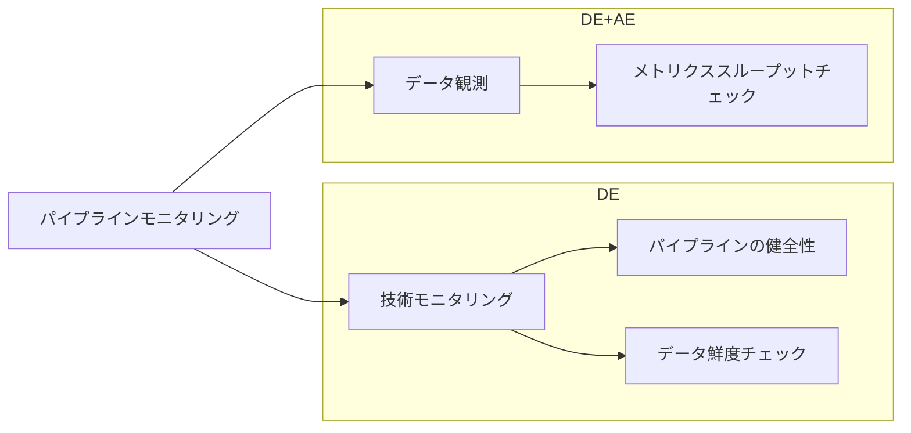
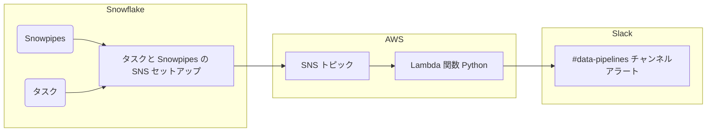

## 概要

Snowpipe はデータ読み込み中にエラーが発生した場合、すなわち Snowpipe 経由またはSnowflake タスクの失敗時に、クラウドメッセージングサービスにエラー通知をプッシュできます。この通知には、Snowpipe の場合は各ファイルで発生したエラーの説明が含まれ、そのファイルのデータを詳細に分析できます。タスクのエラー通知は、タスクが SQL コードを実行したときに発生したエラーを説明する通知を送信します。この通知にはタスク実行中に発生したエラーの説明が含まれます。

現在、クロスクラウドサポートはプッシュ通知では利用できません。Snowflake アカウントがホストされているクラウドプラットフォームが提供するメッセージングサービス用にエラー通知サポートを設定してください。

私たちの Snowflake は AWS にホストされているため、プッシュ通知のセットアップは AWS で行われています。

Snowpipe と Snowflake タスクの両方において、SNS インテグレーションは同じです。
[enabling-error-notifications](https://docs.snowflake.com/en/user-guide/data-load-snowpipe-errors-sns#enabling-error-notifications) で Snowflake が同じ手順を定義しています。

### Snowflake SnowPipe とタスクのトリアージ

繰り返し発生する状況が通知されました：

- 時折データのドロップが見られ、しばらく後に通知されます — 欠落または不完全なデータに関するプッシュ警告の仕組みを実装しました。通常、ビジネス側から報告を受けてから対応するリアクティブなアプローチを使用していましたが、これは好ましい方法ではありません。現在は、エラー発生時にすぐにアラートが来るよりプロアクティブな方法を採用しています。
- 監視するパイプライン（`version_db`、`Snowplow`、`PTO`）は `Snowflake tasks` または `Snowpipe` の仕組みで動作しています。
- `Snowflake` 内のパイプラインの形状とステータスに焦点を当て、明らかにするための包括的なアプローチを使用しました

#### ワークフロー



#### 技術モニタリング

SnowPipe および/または Snowflake タスクにエラーがある場合に Slack 経由で通知を受け取ることを確認する必要があります。エラーが発生し、根本原因がアップストリームであることが判明した場合は、ソース所有者との協力で解決する必要があります。`Data Platform` はパイプラインの健全性について責任を持ちます。



以下はセットアップに使用した名前とコマンドの詳細です。

### **ステップ 1: 指示に従って AWS に `gitlab-snowflake-notification` という名前の SNS トピックを作成する**

このためにはユーザーに SNS トピックへの完全なアクセス権が必要です
同じ SNS トピックがすべての Snowflake タスクと Snowpipe のプッシュ通知に使用できます
ステップ 4 で必要になるため、トピックの ARN 値を控えてください。

### **ステップ 2: AWS での IAM ポリシー作成について IT に協力を依頼する**

SNS トピックへの発行権限を付与する AWS Identity and Access Management（IAM）ポリシーを作成します。

### **ステップ 3: AWS での AWS IAM ロール作成について IT に協力を依頼する**

SNS トピックの権限を割り当てる AWS IAM ロールを作成します
ロールサマリページにある Role ARN 値を記録します。

### **ステップ 4: Snowflake での通知インテグレーションの作成**

通知インテグレーションを作成するには [ACCOUNTADMIN](https://docs.snowflake.com/en/user-guide/security-access-control-considerations#using-the-accountadmin-role) 権限が必要です。

```sql
CREATE OR REPLACE NOTIFICATION INTEGRATION gitlab_data_notification_int
  ENABLED = true
  TYPE = QUEUE
  NOTIFICATION_PROVIDER = AWS_SNS
  DIRECTION = OUTBOUND
  AWS_SNS_TOPIC_ARN = '<topic_arn>'
  AWS_SNS_ROLE_ARN = '<iam_role_arn>';
```

### **ステップ 5: Snowflake に SNS トピックへのアクセスを付与する**

Snowflake で以下のクエリを実行します：

```sql
  DESC NOTIFICATION INTEGRATION gitlab_data_notification_int;
```

**SF_AWS_IAM_USER_ARN** と **SF_AWS_EXTERNAL_ID** を控え、以下を設定して IAM ロールの Trust Relationship を変更します

```json
 {
  "Version": "2012-10-17",
  "Statement": [
    {
      "Sid": "",
      "Effect": "Allow",
      "Principal": {
        "AWS": "<sf_aws_iam_user_arn>"
      },
      "Action": "sts:AssumeRole",
      "Condition": {
        "StringEquals": {
          "sts:ExternalId": "<sf_aws_external_id>"
        }
      }
    }
  ]
}
```

これにはポリシーを更新するために IT の協力が必要です。

### **ステップ 6: ローダーロールにインテグレーションの使用権限を付与する**

`ACCOUNTADMIN` ロールで Snowflake の以下を実行します。

```sql
 GRANT USAGE on  INTEGRATION gitlab_data_notification_int to role loader;
```

**注意:** `いずれかのステップを変更するとインテグレーションが壊れるため、ステップ 1 から 6 まですべてやり直す必要があります。このセットアップを変更してはなりません。`

### **ステップ 7: Slack 通知を送信する Lambda 関数を作成する**

このためにユーザーは AWS で `Create lambda function` と `ListRoles` 権限が必要です。これらの 2 つの権限のいずれかが欠けている場合は、[**AR issue**](https://gitlab.com/gitlab-com/team-member-epics/access-requests/-/issues/new) を作成してください。

Lambda 関数を作成するには以下を選択します：

1. `Author from scratch`
1. Lambda 関数に一意の名前を付ける
1. いずれかの `Python` バージョンを選択する（`>=3.10` はすべて問題ありません）
1. アーキテクチャは `Default`
1. `Change default execution role` を選択し、`Use an existing role` を選択して `Gitlab-lambda-snowflake` を選択する
1. `Create function` ボタンをクリックする

詳細は以下の画像に示されています。


関数が作成されたら、`Slack` 通知を送信する基本的な Python コードを設定できます。私たちの `gitlab_snowflake_notification` Lambda コードの例を示します：

``` python
import urllib3
import json
import os

http = urllib3.PoolManager()

def lambda_handler(event, context):
    url = os.environ["slack_webhook_url"]
    data = event["Records"][0]
    timestamp = data["Sns"]["Timestamp"]
    timestamp = timestamp.replace("T", " ").replace("Z", "")
    task_details= json.loads(data["Sns"]["Message"])
    if 'taskName' in task_details:
        failure_type_name= task_details['taskName']
        error_meesage=task_details['messages'][0]["errorMessage"]
        title="Snowflake Task Failure Alert"
    if 'pipeName' in task_details:
        failure_type_name= task_details['pipeName']
        error_meesage=task_details['messages'][0]["firstError"]
        title="Snowpipe Failure Alert"

    error_message_markdown=f"```{error_meesage}```"

    log_link='https://gitlab.com/gitlab-data/runbooks/-/blob/main/triage_issues/snowflake_pipeline_failure_triage.md'
    log_link_markdown = f"<{log_link}|Runbook>"

    message = {
            "channel": "#data-pipelines",
            "username": "SNOWFLAKE_TASK_PIPE",
            "icon_emoji": "snowflake",
            "attachments": [{
                          "fallback":"Snowflake Task Failure Alert",
                          "color":"#FF0000",
                          "fields": [
                                    {
                                        "title":title,
                                        "value":failure_type_name
                                    },
                                    {
                                        "title":"Timestamp",
                                        "value":timestamp
                                    },
                                    {
                                        "title":"Error Message",
                                        "value":error_message_markdown
                                    },
                                    {
                                        "title":"Steps to view error message in snowflake",
                                        "value":log_link_markdown
                                    }
                                    ]
                        }]
    }

    encoded_msg = json.dumps(message).encode("utf-8")
    resp = http.request("POST", url, body=encoded_msg)

    print(
        {
            #"message": event['Records'],
            "status_code": resp.status,
            "response": resp.data
        }
    )
```

**実装時の考慮事項**:

- 良い慣行として、`AWS` Lambda 関数で使用する予定の環境変数を暗号化することをお勧めします。[環境変数のセキュリティ保護](https://docs.aws.amazon.com/lambda/latest/dg/configuration-envvars.html#configuration-envvars-encryption)に関する包括的なガイドラインがあります。

上記の関数は Snowflake タスクと Snowpipe の失敗に関するすべてのイベント通知情報を `Slack` に送信し、次のように表示されます：


### **ステップ 7: ステップ 1 で作成した SNS トピックをトリガーとして Lambda 関数に追加する**

これにより Lambda 関数がトリガーされ、Slack 通知が送信されます

### **ステップ 8: 失敗時に通知を送信するよう Snowflake Snowpipe と Snowflake タスクを変更する**

この例では、1 つの Snowflake タスクに対して実施しました

```sql
ALTER TASK RAW.PROMETHEUS.PROMETHEUS_LOAD_TASK suspend;
ALTER TASK RAW.PROMETHEUS.PROMETHEUS_LOAD_TASK SET ERROR_INTEGRATION = gitlab_data_notification_int;
ALTER TASK RAW.PROMETHEUS.PROMETHEUS_LOAD_TASK resume;
```

インテグレーションを適用するためにはタスクを一時停止する必要があります。

上記を定義すると、失敗時に `Slack` チャンネルに通知が送信されます。

AWS アカウントのすべての必要な権限はすべての Data Platform チームメンバーに付与されています。また、Loader ロールには Snowflake インテグレーションを使用する権限が付与されています。

**注意:** Snowpipe のエラー通知は、`ON_ERROR` コピーオプションが `SKIP_FILE` *（デフォルト値）* に設定されている場合にのみ機能します。`ON_ERROR` コピーオプションが `CONTINUE` に設定されている場合、Snowpipe はエラー通知を送信しません。

Snowpipe 経由で送信された通知の履歴をクエリするには `NOTIFICATION_HISTORY` テーブル関数を使用できます。詳細については [NOTIFICATION_HISTORY](https://docs.snowflake.com/en/sql-reference/functions/notification_history) ドキュメントを参照してください。

## エラーのトリアージ

`Slack` でアラートを受け取ったら、[ランブックページ](https://gitlab.com/gitlab-data/runbooks/-/blob/main/triage_issues/snowflake_pipeline_failure_triage.md) に移動して Issue を分析してください。
