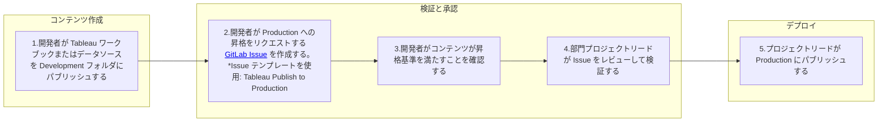

## クイックリンク

- [開発者向けヒントとコツ](/handbook/enterprise-data/platform/tableau/tableau-developer-guide/tips-and-tricks-for-developers/)
- [Tableau スタイルガイド](/handbook/enterprise-data/platform/tableau/tableau-developer-guide/tableau-style-guide/)

## Tableau のデータソースの種類

Tableau で使用できるデータソースにはいくつかの種類があり、どのオプションを選択するかによってダッシュボードのパフォーマンスとエンドユーザーエクスペリエンスに影響する場合があります。用語を定義しましょう：

- **エクストラクト vs. ライブ:** エクストラクトデータソースには、Tableau 内に存在するデータセットのエクストラクトがあります。ライブデータソースは、フィルターを変更したり新しいダッシュボードタブに移動するたびに、基礎となるデータソース（Snowflake、Google Sheets）に問い合わせます。エクストラクトはほぼ常により高速に動作します。

- **ローカル、埋め込み、パブリッシュ済み:** このヒントの文脈では、「ローカル」と「埋め込み」データソースは同じものです。これらはデータソースがワークブックの「内部」または「と一緒に」存在する接続です。このデータソースを表示または編集する唯一の方法はワークブックを開くことです。この接続タイプは一度に 1 つのワークブックにのみ接続/存在できます。

- **パブリッシュ済み:** パブリッシュ済みデータソースはワークブックとは別にパブリッシュされます。つまり Tableau Cloud では、データソースのリンクと、別々にワークブックのリンクに移動できます。パブリッシュ済みデータソースはワークブックから独立して存在するため、1 つのパブリッシュ済みデータソースを任意の数のワークブックに接続できます。

ワークブックのデータソースは、ローカル + ライブ、ローカル + エクストラクト、パブリッシュ済み + ライブ、またはパブリッシュ済み + エクストラクトのいずれかになります。

### 接続タイプに関するヒント

パブリッシュ済みデータソースを使用する Tableau Desktop でのワークブック開発が、低速で使いにくい体験になる場合があります。何らかの理由で、パブリッシュ済みデータソースの接続が遅く動作することがあります。パブリッシュ済みデータソースを使用しながらこの問題を回避するには、ローカルコピーで作業できます。

[このビデオ](https://www.youtube.com/watch?v=KcxtXmzS4mk)はそのプロセスを説明しています。古いビデオなのでユーザーインターフェースは少し古くなっていますが、ローカルコピーを作成するプロセスは同じです。

書面による手順は次のとおりです：Desktop でワークブックを開き、任意のワークシートに移動します。次にデータソースを右クリックして「ローカルコピーを作成」を選択します。次に元のパブリッシュ済みデータソースを右クリックし、ドロップダウンから「データソースを置換」を選択します。ポップアップで、元のデータソース（パブリッシュ済み）を新しいもの（ローカルコピー）に置き換えます。

その後、通常どおり開発を続けられます。完了したら、データソースを Tableau Cloud にパブリッシュし直すと、ローカルコピーがパブリッシュ済みデータソース接続に戻ります。最後に、ワークブックをパブリッシュします。

他の人が既存のデータソースに上書きパブリッシュしないように注意してください。他の人のワークブックの動作を妨げる変更につながる可能性があります。

#### パブリッシュ済みデータソースのフィールドを編集する

パブリッシュ済みデータソースに接続されているワークブック（Tableau Cloud または Desktop）で開発している場合、パブリッシュ済みデータソースに変更を加えることはできません。つまり：

1. 計算フィールドを編集したい場合、それはできません。計算フィールドのコピーを作成する必要があります。
1. 「[参照を置換](https://www.thedataschool.co.uk/gregg-rimmer/tableaus-replace-references-feature/)」機能を使用すると、フィールドがワークシート上に単独で存在するインスタンスのみが置換されます。そのフィールドが別の計算フィールド内に含まれているインスタンスは置換されません（ポイント 1 参照 — パブリッシュ済みデータソースの計算フィールドを編集することはできません）。
1. ワークブック内のパラメーターを変更すると、Tableau はパラメーターの複製コピーを作成し、パブリッシュ済みバージョンのパラメーターをコピーに置き換えます。ステークホルダーから「このダッシュボードが壊れている！ドロップダウンが機能しない！」と言われた場合、「壊れた」パラメーターが 2 つ存在している可能性があります。
1. 既存の計算フィールドにテーブル計算を追加することはできません。計算フィールドのコピーを作成してから、コピーでテーブル計算を使用する必要があります。

上記のいずれかを行う必要がある場合は可能です。2 つのオプションがあります — 上記のセクションの手順に従ってデータソースのローカルコピーを作成し、調整を行い、データソースを再パブリッシュできます。

または、Tableau Cloud のパブリッシュ済みデータソースに移動し、「編集」モードで開き、変更を加えてデータソースを再パブリッシュできます。

## データソースのアプローチ

一般的に、Tableau でデータソースを作成するための推奨アプローチは、dbt/Snowflake でのすべての結合を作成して最終的なマートおよび/または rpt テーブルを具体化し、BI レイヤーでの追加の結合、リレーション、計算なしに Tableau がダッシュボードのために直接消費できるようにすることです。

Tableau の実装中、fct および dim テーブルを Tableau に持ち込み、そこで結合とリレーションを作成するアプローチを試みました。しかし、以下の理由から可能な限り dbt/Snowflake でデータ構造を作成することを好みます：

- ビジネスロジックをエンタープライズデータウェアハウスのルールとして保持し、Tableau データソース全体でカスタム SQL での矛盾するビジネスロジックの適用を避けるために、最終的なマート/rpt テーブルをそのまま消費のためにパブリッシュします。
- このアプローチは、dbt/git インテグレーションを通じてすべての結合とレポーティングロジックをバージョン管理します。
- このアプローチにより、最終データソースを SQL を使用してクエリ可能にします。これにより、アナリストがダッシュボードの結果と最終データセットをアップストリームテーブルと比較しやすくなり、ダッシュボードが予期しない結果を表示している場合にアナリストがロジックのトラブルシューティングを行いやすくなります。
- これにより、同じデータセットを Tableau ダッシュボードとアドホッククエリ、ワンオフエクスポート/分析、または必要に応じて別のダウンストリームツール（Jupyter notebook など）に引き込むことに容易に使用できます。

同じ理由で、計算フィールドを作成するアプローチは、可能な限り Tableau ではなく dbt/Snowflake で作成することです。注目すべき例外は比率メトリクスの場合です（例えば、粗利益率はフィルターが適用されたときに動的に重み付けできるように Tableau で計算されます。ただし、分子と分母の両方は dbt/Snowflake で定義し、Tableau では単純な除算のみを行うべきです）。

このアプローチはデータソースのユースケースの大部分に対応することを目的としており、Tableau 開発者は Tableau での結合とリレーションの作成ではなく、まずこのアプローチを試みることを推奨します。このアプローチがサポートしないインスタンスを見つけた場合は、代替アプローチがより優れているシナリオを共有するためにこのハンドブックのガイダンスを更新する MR を提出してください。

## ワークブックの接続タイプ

ワークブックまたはデータソースをパブリッシュする際、いくつかの認証オプションがあります。デフォルトオプションを使用すると作業をパブリッシュできますが、間もなく次のことが起こります：

1. OAuth トークンが期限切れになり、ワークブックにアクセスできないというエラーメッセージがユーザーから届く
1. エクストラクトをスケジュールすると、エクストラクトが失敗したというメールが届く

ユーザーがワークブック内のデータに常にアクセスできるようにするには、デフォルト以外の認証オプションを選択します。

<details markdown=1>

<summary><b> Desktop の場合 </b></summary>

**Desktop からデータソースをパブリッシュする**

Desktop から Cloud/Online にデータソースをパブリッシュして Tableau パブリッシュ済みデータソースにする場合、次のウィンドウが表示されます：


「認証」の「編集」ボタンを選択します。次のポップアップが表示されます。埋め込む <rolename> を選択します。


**ローカル接続でワークブックをパブリッシュする**

ローカル接続を持つワークブックとは、データソースがワークブックの内部に存在し、Tableau Online で検索できる別々にパブリッシュされた Tableau データソースではないものです。ローカル接続を持つワークブックをパブリッシュしようとすると、次のウィンドウが表示されます：


「データソース」の「編集」を選択し、「認証」を見つけます。<rolename> を埋め込むことを選択します。


</details>

<details markdown=1>

<summary><b> Cloud/Online の場合 </b></summary>

**Cloud/Online でパブリッシュする**

Cloud/Tableau Online/ウェブブラウザ（すべて同じ）でデータソースを編集している場合、資格情報が埋め込まれていることを確認するために「名前を付けてパブリッシュ」を見つけます：


次のウィンドウで、「資格情報を埋め込む」のチェックボックスをオンにしてください。


</details>

### パブリッシュ済みダッシュボードのエラーを回避するためのロール名埋め込みワークフロー

これは、ロール名がパブリッシュ済みダッシュボードに適切に埋め込まれていることを確認するプロセスです。これには 2 つの重要なステップがあり、この順序でそれらに従うことで次の 2 つのエラーを回避できます：

1. ユーザーがパブリッシュ済みダッシュボードにアクセスしようとすると、Snowflake へのログインを要求するエラーウィンドウが表示される。
1. 別のアナリストがデータソースの構成方法やカスタム SQL の構成方法を確認するために、Cloud でデータソースを素早く確認しようとする。

ロール名を埋め込む最初の機会は、データソースへの接続を最初に確立したときです。次のようになります：


他の人がデータソースにアクセスできるようにしたい場合は、空白のままにする必要があります。このステップでロール名を入力する理由はなく、後のステップで行うため、適切なワークフローはこのステップで空白のままにすることです。

ここから、データソースを設定し、希望どおりに開発します。準備ができたら、ワークブック/データソースをパブリッシュします。ここで、ワークブックをパブリッシュする際のロール名の埋め込みについては、[このセクションの冒頭](/tableau-developer-guide/#connection-types-in-workbooks)のステップに従います。

このステップでロール名を埋め込み忘れた場合、ユーザーはダッシュボードへのアクセスを許可する代わりに、Snowflake へのサインインを求められるか、エラーが送信されます。

### Snowflake アクセスのない他のユーザーがワークブックを編集できる接続タイプの作成

パブリッシュ済み接続、またはワークブック内のローカルエクストラクト接続を使用すると、Snowflake アクセスを持たない他のユーザーがワークブックを編集できるようになります。ワークブックがローカルライブ接続を使用してパブリッシュされた場合、ワークブックを編集したいエクスプローラーは自分の資格情報を使用して Snowflake にサインインする必要があります。これは、ローカルライブ接続を持つワークブックを編集しようとした場合にエディターが表示される画面です。

Snowflake アクセスなしのエクスプローラーがワークブックに小さな編集を行えるようにしたいというニッチなユースケースでは、パブリッシュ済みライブ接続のみを使用するか、データを抽出してください。

 

## 一般的な接続エラーとその解決方法

Tableau へのアクセス時にエラー画面が表示されていますか？この一覧にある問題を確認し、解決方法を確認してください。

### 1. 問題：認証

**エラー**:
> `"このデータソースに有効な資格情報を提供したことを確認してください。Tableau は OAuth 更新トークンが期限切れになっていることを検出しました。新しい資格情報で再認証してください。サポートが必要な場合は Tableau 管理者に問い合わせてください" および "このシートは Snowflake データベース上のデータを使用しています。そのサーバーにサインインする必要があります".`

このエラーメッセージは診断が難しい場合があります。なぜなら、多数の原因の結果である可能性があるからです。残念ながら、このメッセージが表示されている場合にどの考えられる原因が理由かを診断する簡単な方法はありません。

  | 原因 | 解決策/予防策 |
  |---------------------------|----------------------|
  | 開発者がローカルライブ接続を使用した | [これらのステップに従ってください。](/handbook/enterprise-data/platform/tableau/tableau-developer-guide/#creating-connection-types-that-allow-others-without-snowflake-access-to-edit-the-workbook) |
  | ワークブック/データソースへの変更を最後にパブリッシュした人がパブリッシュ時に資格情報を埋め込むのを忘れた | [パブリッシュ時にこれらのステップに従ってください。](/handbook/enterprise-data/platform/tableau/tableau-developer-guide/#workflow-for-embedding-your-rolename-to-avoid-errors-in-published-dashboards) |
  | 資格情報が本当に期限切れになっている（数週間前にパブリッシュされた） | データソースの所有者がこれらの[ステップ](/handbook/enterprise-data/platform/tableau/#snowflake-oauth-data-source-connection-expiration-period)に従って資格情報を更新するよう依頼してください。 |

### 2. 問題：データアクセス不足

**エラー**:
> `ダッシュボードを表示するためにサインインしようとすると、"invalid consent request"（無効な同意リクエスト）というエラーメッセージが表示される。`


これは通常、表示しようとしているものへのアクセス権がないために発生します。これは次のものである可能性があります：

- ビューが基づいているデータベースまたはテーブル。
- 開発者がワークブックに埋め込んだ資格情報。[こちらを参照してください。](/handbook/enterprise-data/platform/tableau/tableau-developer-guide/#workflow-for-embedding-your-rolename-to-avoid-errors-in-published-dashboards)

**解決策:** データソース/ワークブックを最後にパブリッシュした人が上記のリンクにある資格情報を正しく埋め込むためのステップに従った場合、アクセスの問題である可能性が高いです。最もシンプルな解決策は、開発者が接続をパブリッシュ済みおよびエクストラクトデータソースとしてパブリッシュすることです。

アクセスが必要で、エクストラクト接続の使用が適切でない場合は、開発者がアクセス権を持っていない「ラージ」ウェアハウスを使用したか、ワークブックで制限されたアクセスを持つ非標準テーブルが使用されているかどうかを確認できます。

### 3. 問題：データの列が欠けている

**エラー**:
> `"予期しないエラーが発生しました。このエラーが続く場合は Tableau Server 管理者に連絡してください" および "TableauException: エラー: データソース 'sqlproyx._______' のフィールド '[name]' はデータベースに存在しません。変更されたか削除されました。ビューをリセットしますか？".`

これは、接続が存在しない/壊れた列を探していることを示しています。Snowflake でドロップまたは変更され、その変更が Tableau で障害を引き起こしている可能性があります。

**解決策:** ワークブックの所有者に連絡して支援を求めてください。このようなエラーを解決する最も簡単な方法は、データソースまたはワークブックのローカルコピーを Tableau Desktop にダウンロードし、そこでフィールドを削除または置換することです。

## ハンドブックへの埋め込み

[GitLab Tableau](https://10az.online.tableau.com/#/site/gitlab)（内部サイトのみ）のチャートとダッシュボードは、ドキュメントページでチームとビジュアルコンテンツを共有するために GitLab ハンドブックに埋め込むことができます。

**重要:** 埋め込みコンテンツを表示するには、ユーザーに Tableau ライセンスが必要です。適切なライセンスを持たないユーザーにはダッシュボードが読み込まれません。

Tableau チャートの埋め込みの詳細な手順については、[ハンドブック埋め込みデモ](/handbook/enterprise-data/platform/tableau/embed-demo/)ページを参照してください。

### デザインの考慮事項

- **ダッシュボードよりもビューを使用する** — ビューはダッシュボードよりも確実に埋め込まれます
- **静的表示用にデザインする** — 埋め込まれた各ビューはユーザー入力なしで機能するようにしてください
- **フィルターとパラメーターのプリセット** — 埋め込み中に設定できますが、閲覧者は変更できません
- **可視性を確保する** — 埋め込み形式ではビューを非表示にできません

#### データソースの設定

**1,000 万行未満のエクストラクトの場合:**

- ロール資格情報を埋め込んだエクストラクトを使用する
- これにより一貫したアクセスが確保され、認証の期限切れエラーが防止されます

**大規模データセット（1,000 万行超）の場合:**

- データチームに連絡してサービスアカウント資格情報を取得する
- エクストラクトを作成する代わりに、これらの資格情報を使用する

#### パブリッシュの要件

埋め込み用のワークブックをパブリッシュする際：

1. **データソースに資格情報を埋め込む** — これはビューが正しく機能するために不可欠です
2. **資格情報の保持を確認する** — パブリッシュ済みワークブックに変更を加える際、正しい資格情報が保持されていることを確認してください
3. **「パスワードを埋め込む」オプションを確認する** — このチェックボックスは更新中にオフになる場合があります


> **注意:** 認証の問題を防ぐために、ワークブックを再パブリッシュする際に「パスワードを埋め込む」オプションが選択されたままであることを常に確認してください。

## Tableau ワークブックのパブリッシュ

### ワークブックの命名規則

Tableau Cloud サイトに初めてワークブックをパブリッシュする際は、意図した/公式のタイトルでワークブックに名前を付けてください。これにより、結果の URL にそのタイトルのみが含まれます（これにより、ワークブックが本番スペースにパブリッシュされたときに同じ URL を保持できます）：


[Development](https://10az.online.tableau.com/#/site/gitlab/projects/300844) プロジェクトへのパブリッシュ：

Development プロジェクトにパブリッシュされたすべてのワークブックには *Draft* タグとそれぞれの部門タグが添付され、開発モードにあること、およびピアレビューを受けてユースケースの唯一の信頼できる情報源（SSOT）となることを意図したワークブックではないことを示します。BI チームは Tableau Cloud で利用可能なタグ機能を活用して、部門やパブリッシュステータスでワークブックをより効果的に整理します。例えば、以下のワークブックには *Draft* と *Data Team* タグが割り当てられています：


ワークブックにタグを追加するには、そのワークブックの右側にある省略記号（...）シンボルをクリックし、*タグ...*（Tag...）をクリックします：


タグウィンドウで、ワークブックの *Draft* と部門タグを追加します：


## Tableau Cloud へのパブリッシュ

パブリッシュには 2 つの環境があります：Development と Production。

- **Development** はダッシュボードとデータソースのテストと反復を目的としています。この環境はコンテンツが確定される前の実験と改善を可能にします。
- **Production** は組織全体での広範な配布と信頼できる使用のために準備された**確定済み、検証済みのコンテンツ**をデプロイするための環境です。必要なすべてのレビューに合格し、品質基準を満たすコンテンツのみが Production に昇格されるべきです。コンテンツを Production にパブリッシュするには、以下のワークフロー図に従ってください。[Tableau Issue](https://gitlab.com/gitlab-data/tableau/-/issues/new) を作成し、テンプレート `Tableau Publish to Production` を使用することで、ワークブックまたはデータソースの Production への昇格をリクエストできます。このプロセスにより、データの整合性と正確性を守るための必要なすべてのステップが実施されることを確保します。

### Production へのパブリッシュ手順



## タグ

タグを適用することで、ワークブックに関する詳細情報を提供でき、ビジネス機能/部門ごとに容易に識別し、まだ開発中のドラフトコンテンツと区別できます。タグでワークブックをフィルタリングするには、プロジェクトの右上隅にある検索ボックスをクリックしてください。**コンテンツタイプ**から**ワークブック**を選択します：


ワークブックセクションに入ったら、**タグ**ドロップダウンをクリックしてタグでコンテンツをフィルタリングします：


## ワークブックとデータソースの説明

Tableau でワークブックまたはデータソースに説明を追加すると、コンテキストを提供し、ユーザーがコンテンツの目的を素早く把握できるようにすることで、明瞭さと使いやすさが向上します。説明は簡潔にし、理想的には 1〜2 文にし、コンテンツの意図するユースケースを明確に概説してください。

説明の追加方法：

1. ワークブックまたはデータソースに移動します
1. ワークブックまたはデータソース名の横にある 3 点（...）をクリックし、「詳細を編集」を選択します。
1. 「詳細を編集」ページで「説明」フィールドを見つけます。ワークブックまたはデータソースに関連付ける説明を入力します。
1. 説明を追加したら、「保存」をクリックして変更を適用します。


## パフォーマンスインジケーター

ハンドブックにパフォーマンスインジケーターを埋め込むためのコードは、通常、実際のインジケーターが表示されているページには見つかりません。代わりに、次のようなものが表示される場合があります：

```Performance Indicator Shortcode
{{/% performance-indicators "developer_relations_department" /%}}
```

パフォーマンスインジケーターを更新するには、表示されているパフォーマンスインジケーターに関連付けられた yml ファイルを見つけて、そこから更新する必要があります。yml ファイルを見つけるには、ショートコードに表示されるファイル名を確認します。上記の例では、`"` 内にあるタイトルである `developer_relations_department` を探すことになります。

このファイルを見つけるには、「パブリック向け GitLab マーケティングウェブサイトのリポジトリ（ドキュメントとハンドブックの改善を含む）」である GitLab-com リポジトリに移動します。[リポジトリ](https://gitlab.com/gitlab-com/www-gitlab-com)から「ファイルを探す」を見つけて、探しているファイル名を貼り付けます。この例では、`developer_relations_department` を貼り付けます。

これにより、探している yml ファイルが表示されます。ここから、以下の手順に従ってファイルを変更し、探している Tableau ビュー（ダッシュボードまたはシート）を含めることができます。ビューを埋め込む際は[埋め込み手順](/handbook/enterprise-data/platform/tableau/tableau-developer-guide/#embedding-in-the-handbook)に従ってください。

リマインダー: *ビューを埋め込む場合（ログインが必要）、ページの上部の URL ではなく、ビューの右上にある「共有」ボタンから URL をコピーしてください。Tableau チャートの埋め込みは GitLab 内部ハンドブックのみが対象です。*

### YML

ハンドブックリポジトリの `data/performance_indicators.yml` ファイルは、パフォーマンスインジケーターコンテンツを含むハンドブックページを自動的に生成するシステムの基盤となっています。構造はチャートのリストを取ることができ、各チャートはフィルターとパラメーターのリストを取ることができます。次の例は、データファイルに必要な情報を追加する方法を示しています：

```yml
- name: MR Rate
  description: MR Rate is a monthly evaluation of how MRs on average an Development engineer performs.
  tableau_data:
    charts:
      - url: https://10az.online.tableau.com/t/gitlab/views/OKR4_7EngKPITest/PastDueSecurityIssues
        height: 300px
        toolbar: hidden
        hide_tabs: true
        filters:
          - field: Subtype Label
            value: bug::vulnerability
        parameters:
          - name: Severity Select
            value: S2
  is_key: true
```

明確にするために、このコードブロックの正確な構文は JSON データとして読み取れるように非常に重要です。既存のハンドブック yml ファイルを更新している場合、チャートが現在 Sisense チャートである以外はすべてが入力されているかもしれません。Sisense チャートを置き換えるには、Sisense チャートを指すコード行を置き換えます。ファイル内のその他はそのまま残せます。

高さ、フィルター、パラメーターの指定なしにチャートを埋め込むだけの場合は、以下を使用します：

```yml
  tableau_data:
    charts:
      - url:
```

平易な英語で言うと：

```yml
(tab)tableau_data:
(tab)(tab)charts:
(tab)(tab)(tab)-(space)url:
```

タブは 2 スペースであることに注意してください。

## 行レベルセキュリティ

Tableau 内で行レベルセキュリティを使用するには、開発者が `prod.entitlement` にある権限テーブルを使用する必要があります。権限テーブルは Tableau データモデリングインターフェースを使用して適切なソーステーブルと結合されます。これにより、テーブルをクエリ時に適切にフィルタリングでき、エクストラクトが行レベルセキュリティを適切に実装できるようになります。権限テーブルを対応するソーステーブルと結合したら、行が現在のユーザーに正しくフィルタリングされていることを確認するためにデータソースフィルターを追加する必要があります。

### 例

使用しているテーブルの正しい権限テーブルを見つけます。権限テーブルは、結合したいテーブルと同様の名前になっているはずです。


ソーステーブルと権限テーブルの間で、リレーションシップではなく直接の内部結合を実行します。


権限テーブルの `USERNAME()` 関数と `tableau_user` フィールドを使用してデータソースフィルターを作成します。このステップにより、現在のユーザーに見える行のみが取得されるようになります。


### 地理ベースの行レベルセキュリティ

Tableau での GEO データに基づく RLS の実装は、ユーザーが割り当てられた GEO に関連するデータのみにアクセスできることを確保します。これは、SFDC ユーザーロールを Tableau と統合する [ent_sfdc_geo_pubsec_segment](https://dbt.gitlabdata.com/#!/model/model.gitlab_snowflake.ent_sfdc_geo_pubsec_segment) テーブルを通じて実現されます。

この GEO ベースの権限テーブルは、SFDC ユーザーロールと Tableau の SAFE アクセスグループからの情報を組み合わせることで、特定の GEO へのユーザーアクセスを管理するように設計されています。テーブルのロジックは次の基準に基づいてアクセスを決定します：

- **割り当て済み GEO を持つユーザー:** Salesforce ユーザーに割り当てられた GEO がある場合、その特定の地域へのアクセスが付与されます。

- **SAFE および SFDC ロールユーザー:** Tableau SAFE アクセスグループと特定の Salesforce ロールの両方に属するユーザーはグローバルアクセスを得ます（例：エグゼクティブ）。

- **非 Pubsec ロール:** 特定のロールは「AMER-PUBSEC」GEO を除いたグローバルアクセスが付与されます（例：エグゼクティブ — グローバル Minus Pubsec）。

- **非 SFDC SAFE ユーザー:** 対応する Salesforce ロールを持たない Tableau SAFE ユーザーは、Tableau の権限に基づいてアクセスが付与されます。

このアプローチにより、各ユーザーの GEO データへのアクセスが組織上の役割と権限に合致することを確保します。

### ロールを更新するためのアクセスリクエスト（AR）の提出

GEO アクセス権限を変更するために Salesforce ロールまたは Tableau アクセスグループの変更が必要な場合は、GitLab の標準アクセスリクエストプロセスに従ってください：

- AR を提出する: 必要な詳細を指定し、取得または変更したいロールまたはアクセスレベルを明記して、標準の [AR Issue テンプレート](https://gitlab.com/gitlab-com/team-member-epics/access-requests)に記入します。

- 承認ワークフロー: リクエストは、関連するマネージャーおよびシステム管理者によるレビューを含む標準の承認プロセスを経ます。

- ロールの割り当て: 承認後、Sales Systems チームまたは Tableau 管理者が Salesforce および/または Tableau の変更を実装します。

- 権限の更新: `ent_sfdc_geo` テーブルはこれらの変更を自動的に反映し、データアクセス権限を更新します。

## エクストラクトのパブリッシュガイドライン

1. **データソースのライブ vs. エクストラクト** — エクストラクトは主にパフォーマンス最適化ツールであり、デフォルトの選択肢であるべきではありません。デフォルトでライブ接続を使用し、次の状況でのみエクストラクトを検討してください：

   - **ダッシュボードのパフォーマンス** — パフォーマンスオプティマイザーを適用してもビジュアライゼーションが 1 分以上かかる場合。

   - **高トラフィックデータソース** — データウェアハウスのコストを削減するために、多数のユーザーライブクエリの代わりにスケジュールされたエクストラクト更新を使用します。

1. **エクストラクトサイズ** — Tableau Cloud には 1 TB のストレージがあります。エクストラクトは 5 GB を超えてはなりません。これは最大約 5,000 万行のデータに対応します。

1. **エクストラクトのスケジューリング** — エクストラクト更新を UTC 18:00〜05:00 の間にスケジュールします。理想的には、更新を平日に限定してください。

1. **エクストラクトの最適化** — エクストラクトのサイズを縮小し、更新パフォーマンスを向上させるために次の戦略を検討してください：

   - **データの集計** — エクストラクトを作成する前に、より高いレベルでデータを集計してサイズを削減しパフォーマンスを向上させます。

   - **データのフィルタリング** — フィルターを適用して、関連するデータのみをエクストラクトに含めます。これにより、サイズを削減し更新時間を短縮できます。

   - **増分更新の使用** — 大規模なデータセットでは、完全更新の代わりに増分更新を設定します。これにより新規または変更されたデータのみが更新され、より効率的です。増分および マージ/更新更新を実装するために Tableau Prep の使用を検討してください。

1. **エクストラクト更新の一時停止** — Tableau Cloud は 30 日間未使用のままのデータソースのエクストラクト更新を自動的に一時停止します。

## ローカル接続のタイムアウトを改善する

Tableau Desktop が再接続を求める回数を減らすために、開発者はローカルの Snowflake ドライバーを設定してセッションを維持できます。
これを行うには、開発者が `odbc.ini` ファイルを編集して `CLIENT_SESSION_KEEP_ALIVE` フラグを `True` に設定する必要があります。ファイルの通常の場所は [Snowflake ドキュメント](https://docs.snowflake.com/en/developer-guide/odbc/odbc-mac#step-2-configure-the-odbc-driver) で確認できます。


## Tableau Desktop でのデータソースの置換

手順は次のとおりです：

1. Tableau Desktop でワークブックを編集します（これには特定のツールが必要です）。
1. ワークブックに新しいデータソースを追加して切り替えます。
1. 置換するデータソースを使用するシートに移動します。
1. 置換するデータソースを右クリックして `データソースを置換...` を選択します。
1. ダイアログボックスで、置換するデータソースが「現在」として選択されていることを確認し、「置換後」の新しいデータソースを選択して OK をクリックします。
1. 新しいデータソースに切り替えたすべてのフィールドが正しく動作しており、エラーが表示されていないことを確認します。一部のフィールドの横に `!` が表示され、置換が必要な場合があります。手動フィールドエイリアスも再適用が必要な場合があります。
1. 置換するデータソースを右クリックして「閉じる」を選択します（不必要な雑然とさを減らすため）。
1. ワークブックをパブリッシュします。

## マージ前の MR データベースから Tableau でテーブルをテストする

Snowflake のレポートテーブル（DBT で作成されたもの）を使用して Tableau で作業している場合、ある時点でテーブルを更新する必要が生じます。変更を正式にマージするリクエストプロセスを経てデータが利用可能になるのを待つ前に、Tableau でこれらの変更をテストすることが最善策です。

Data Team が Tableau での MR データベースのテストから学んだ主要な教訓を以下に共有します。

### ワークフロー

1. MR の作成者が MR データベースを共有します。
2. テストしたいワークブックまたはデータソースの開発コピーを開きます。
   1. ***開発コピーを使用していることを確認し、パブリッシュ済みデータソースで作業しないでください！*** これは重要です。なぜなら、MR がマージされると、MR db に接続しているデータソースは — たとえ PROD を再接続させるためだけにデータソースを更新しようとしても — アクセスできなくなるからです。したがって、この問題を避けるために元のデータソースに手を触れないままにすることが重要です。
3. データ接続ペインを開きます。
4. 左側の接続ウィンドウ/ドロップダウンで MR データベースを見つけます。
5. PROD テーブルを MR データベーステーブルに置き換えます。
6. 変更をテストします。
7. 変更を保存せずに閉じるか、変更を元に戻してダッシュボードを元の状態とデータソースに戻します。
8. 変更に満足したら MR をマージします — MR データベースは消えます。

### 接続の確立

データソースのローカル開発コピーを作成したら、通常データソースを編集するデータソース接続ペインを開きます。


左側は新しい接続を追加する場所で、中央はワークブックを構成するテーブルが視覚化される場所です。

探しているマージリクエストに添付された MR データベースにクエリするアクセス権が付与されている場合、「**データベース**」のドロップダウンにそれがオプションとして表示されます。


この MR データベースで希望するテーブルを検索します。通常どおりデータソースを作成します — テスト版の既存テーブルを置き換えるか、モデルに新しいテーブルを持ち込んで結合またはリレーションを作成します。

これで、MR がビルドするテーブルを Tableau ワークブック内で直接テストして、変更がすべて望ましい効果をもたらすことを確認できます。

### 変更の保存

MR がマージされると、使用している MR データベースが消えるため、テストしているこれらの変更を保存することはできません。

ロジックと追加/変更される列の合計のみをテストし、保存できない時間のかかるダッシュボード変更は行わないことをお勧めします。

開発データソースを指している開発コピーを保存しようとすると、そのデータソースにアクセスできなくなります。

### エラーの回避

繰り返しますが: マージリクエストがマージされると、その MR データベースに接続しようとしている Tableau データソースはアクセスできなくなります。Cloud、Desktop、複製バージョン、またはその他の方法でもデータソースを開いて編集することはできなくなります。

このため、データソースの開発コピーのみで作業し、パブリッシュ済み/本番バージョンのデータソースでは作業しないことをお勧めします。

*（以下に示すように）MR データベースを「検索」しているが、ワークブック内のテーブルにこの接続を使用していない場合でも、エラーが発生します。*


以下は、ドロップされたデータベースへの残留接続がデータソースに残っている場合に発生するエラーです。これに対する回避策はありません。データソースを同一のデータソースに置き換えるか、同一バージョンがない場合は再構築してから、ほとんどのフィールドに「参照を置換」する必要があります。


### テストに関する最終メモ

MR データベースのテストは、変更が本番にマージされる前にテストして時間を節約する便利な方法です。これが最も機能するユースケースは：

- 合計数に影響するビジネスロジックの変更
- ビューに影響するフィールドへのクイックな変更

MR が通過した後に更新されたテーブルで使用するために変更を保存できないため、多くのダッシュボード/計算フィールドの変更が必要な変更を広範にテストすることは効率的ではありません。

MR データベースをテストする前に、ワークブック/データソースのローカル開発コピーを開くことを確認してください。

## リレーションシップとは何か（Tableau）

リレーションシップは Tableau の機能で、結合タイプを定義せずに複数のテーブルのデータを分析のために組み合わせることができます。従来の結合と比較して、マルチテーブルデータソースをより柔軟でパフォーマントな方法で作業できます。Tableau のリレーションシップに関するいくつかの重要なポイントを紹介します：

1. **動的で柔軟:** リレーションシップはビジュアライゼーションで使用される特定のフィールドとフィルターに適応し、パフォーマンスを向上させるためにクエリを最適化します。

2. **データの粒度を維持する:** 結合とは異なり、リレーションシップは各関連テーブルのネイティブな詳細レベルを保持し、データの重複と集計の問題を軽減します。

3. **異なる詳細レベルの複数テーブル:** ファンアウトや不正確な集計を心配することなく、異なる粒度のテーブルを簡単に関連付けられます。

4. **ヌードル図:** リレーションシップはデータモデル内のテーブルを接続する「ヌードル」として視覚的に表現され、テーブルの関連を理解しやすくします。

5. **コンテキスト認識:** Tableau は現在のビジュアライゼーションに必要なテーブルとフィールドのみをクエリし、パフォーマンスを向上させ不必要なデータ取得を削減します。

6. **設定が簡単:** テーブルをキャンバスにドラッグ＆ドロップし、テーブル間の共通フィールドに基づいてリレーションシップを定義するだけです。

7. **結合との互換性:** 単一の論理テーブル内で従来の結合を引き続き使用できるため、必要に応じてハイブリッドアプローチが可能です。

8. **パフォーマンスの最適化:** リレーションシップは、大規模なデータセットに特に当てはまる複雑な結合シナリオと比較して、より優れたクエリパフォーマンスをもたらすことが多いです。

9. **シンプルなデータモデリング:** リレーションシップにより、結合タイプとその影響についての広範な知識なしに、複雑なデータモデルを作成・維持しやすくなります。

10. **データ精度の向上:** 各テーブルのネイティブな詳細レベルを維持することで、リレーションシップは設計が不十分な結合で発生しうる偶発的なデータ損失や重複を防止します。

Tableau でマルチテーブルデータソースを操作する際は、テーブルの組み合わせに対するより精密な制御が必要な特定のシナリオのために結合を予約しながら、リレーションシップをテーブルの結合のデフォルトアプローチとして使用することを検討してください。

リレーションシップが実際にどのように機能するかを示すシンプルな例（例が生成した SQL クエリを含む）を見たい場合は、詳細な解説が[こちら](https://anniesanalytics.com/what-are-relationships-in-tableau-really)にあります。

## Snowflake と Tableau の設定 — ロール名の埋め込み

接続に資格情報を適切に埋め込むため（[こちら](/handbook/enterprise-data/platform/tableau/tableau-developer-guide/#workflow-for-embedding-your-rolename-to-avoid-errors-in-published-dashboards)で説明）、2 つの前提条件が必要です：

1. Snowflake でデフォルトのロールを設定していること。まだ設定していない場合は、[こちらの手順](/handbook/enterprise-data/platform/#logging-in-and-using-the-correct-role)に従ってデフォルトロールを設定できます。

1. Tableau 設定にロール名を埋め込んでいること。これを行うには、Tableau ホームページに移動して右上隅を確認します。プロフィールドロップダウン（通常はイニシャルが入った丸）をクリックし、「アカウント設定」をクリックします。「データソースの保存済み資格情報」セクションで、Snowflake が見つかるまでスクロールし、そこにデフォルトロールを追加します。
