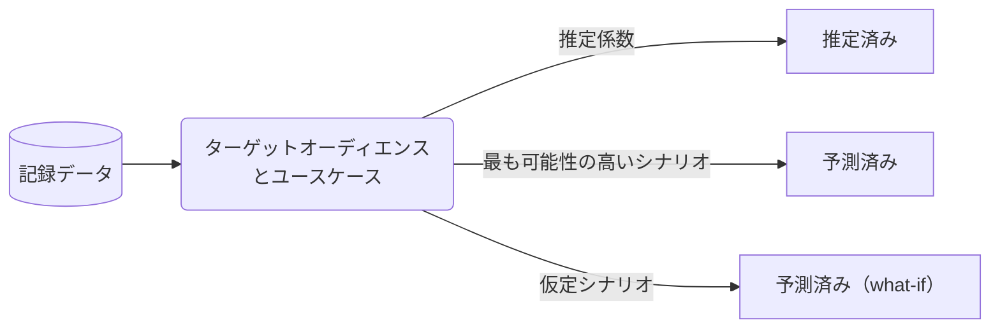

---

## 全体的な見た目とフィール

Tableau の強力なビジュアライゼーション機能により、ダッシュボードの見た目やフィールをカスタマイズするためのオプションと柔軟性がより多く提供されています。GitLab のブランディングに忠実な一貫したフロントエンドデザインを作成するために、以下で提供されているヒントとコツ、およびリソースに従うことをお勧めします：

**[GitLab ブランディングリソース](https://design.gitlab.com/brand/overview/)**

GitLab の詳細なブランディングガイドラインは、仕事においてブランドイメージを維持するための企業固有の画像や色の活用に関する手順を提供しています。ロゴ画像の使用方法については、以下のリンクを参照してください：

- [コアロゴ](https://design.gitlab.com/brand-logo/core-logo/)
- [ロゴマーク](https://design.gitlab.com/brand-logo/logomark/)
- [ブランデッドロックアップ](https://design.gitlab.com/brand-logo/branded-lockups/)

企業ブランディングリソースサイトには、[データビジュアライゼーション](https://design.gitlab.com/data-visualization/overview/)に関する優れたガイダンスも提供されています。例えば、カラーパレットは hex コードを使用してチャートに正確な色付けを作成するのに役立ちます：

- [色](https://design.gitlab.com/data-visualization/color/)
- [チャート](https://design.gitlab.com/data-visualization/charts/)

また、Tableau ダッシュボードにブランド要素を追加する際に使用できるファイルについては、Tableau デザインフォルダ（TBD）を参照してください。[例えば](https://drive.google.com/file/d/1N-6fCA8WTOmNLv3D2hr_zA4fhl4zBS8p/view?usp=sharing)、GitLab のカラースキームを使用したフィルターセクションの上のダッシュボードの左上隅にロゴを追加できます。

**Tableau ヘルプ**

Tableau でカスタムカラーパレットを作成するには、Preferences.tps ファイルをコード（以下の「標準カラーパレット」セクション参照）で更新して意図したカラースキームを反映させることができます。

ワークブック内のテキストと色のカスタマイズに関する Tableau からの詳細な手順については、以下のサイトを参照してください：

- [カスタムパレットの作成](https://help.tableau.com/current/pro/desktop/en-us/formatting_create_custom_colors.htm)
- [テキストのフォーマット](https://help.tableau.com/current/pro/desktop/en-us/formatting_fonts_beta.htm)
- [カスタムフォントの使用](https://help.tableau.com/current/pro/desktop/en-us/formatting_create_custom_fonts.htm)

### 正しいチャートの選択

#### 円グラフ

円グラフの使用を避けて、代わりに棒グラフを使用してください。人間の目は円グラフのスライスのサイズの違いを簡単に把握するのに適していません。この問題は 2 つ以上のスライスが追加されるたびに増幅されます。円グラフを使用しなければならない場合は、2 つの次元の値のみを表現する必要があるユースケースにのみ使用してください（ただし、そこでも棒グラフが好ましい場合があります）。

円グラフの限界についての詳細な説明については、Stephen Few の優れた[記事](https://www.perceptualedge.com/articles/visual_business_intelligence/save_the_pies_for_dessert.pdf)をお読みください。

## 色、ラベル、データ値

### 標準カラーパレット


GitLab のブランド承認済みの色は[こちら](https://design.gitlab.com/data-visualization/color/)で確認できます。カスタムカラーパレットは、次の手順で Tableau Desktop に作成できます：

1. ノートパソコンのドキュメントフォルダで `My Tableau Repository` に移動し、**Preferences.tps** ファイルを探します。
2. TextEdit や Visual Studio Code などの好みのテキストエディタでファイルを開きます。
3. パレットの希望する色を Preferences ファイルに次のように入力します：

    <details>
    <summary>パレット例: **Preferences.tps** ファイル</summary>

    ```xml
    <?xml version='1.0'?>
    <workbook>
    <preferences>

    <color-palette name="GitLab Brand Design" type="regular" >
    <color>#FFFFFF</color>
    <color>#171321</color>
    <color>#FCA326</color>
    <color>#FC6D26</color>
    <color>#E24329</color>
    <color>#A989F5</color>
    <color>#7759C2</color>
    <color>#CEB3EF</color>
    <color>#5943B6</color>
    <color>#2F2A6B</color>
    <color>#232150</color>
    <color>#FDF1DD</color>
    <color>#FFB9C9</color>
    <color>#C5F4EC</color>
    <color>#6FDAC9</color>
    <color>#10B1B1</color>
    <color>#D1D0D3</color>
    <color>#A2A1A6</color>
    <color>#74717A</color>
    <color>#45424D</color>
    <color>#2B2838</color>
    </color-palette>

    <color-palette name="GitLab Palette 1" type="regular">
    <color>#2078D0</color>
    <color>#2D9ED8</color>
    <color>#FCA326</color>
    <color>#FFCC02</color>
    <color>#1DA855</color>
    <color>#A989F5</color>
    <color>#6B4FBB</color>
    <color>#FC6D26</color>
    <color>#B7D5F4</color>
    <color>#E24329</color>
    <color>#7759C2</color>
    <color>#6FDAC9</color>
    <color>#ff9d73</color>
    <color>#AEA5D6</color>
    <color>#5829CB</color>
    <color>#54448A</color>
    <color>#F9980D</color>
    <color>#FF675F</color>
    <color>#CEB3EF</color>
    <color>#E38701</color>
    <color>#FB722D</color>
    <color>#4CEACC</color>
    <color>#FFD1BF</color>
    <color>#FFB9C9</color>
    <color>#D0C5E2</color>
    <color>#D1D0D3</color>
    <color>#BFBFBF</color>
    <color>#A2A1A6</color>
    <color>#74717A</color>
    <color>#45424D</color>
    </color-palette>

    <color-palette name="GitLab Palette 1 Darker" type="regular">
    <color>#075FB6</color>
    <color>#1485BF</color>
    <color>#E4890C</color>
    <color>#E6B200</color>
    <color>#048F3C</color>
    <color>#9070DC</color>
    <color>#5236A1</color>
    <color>#E3540E</color>
    <color>#E6B8A6</color>
    <color>#C82911</color>
    <color>#5F40A9</color>
    <color>#55C2B0</color>
    <color>#E68359</color>
    <color>#958CBD</color>
    <color>#E6A0B0</color>
    <color>#3A2B71</color>
    <color>#E07F00</color>
    <color>#E64D46</color>
    <color>#B59BD6</color>
    <color>#CB6F00</color>
    <color>#E25914</color>
    <color>#33D1B2</color>
    <color>#9EBCDB</color>
    <color>#3F0FB2</color>
    <color>#B7ACC9</color>
    <color>#B8B7BA</color>
    <color>#A6A6A6</color>
    <color>#89888C</color>
    <color>#5A5862</color>
    <color>#2B2934</color>
    </color-palette>

    <color-palette name="GitLab Oranges Purples Greys" type="regular">
    <color>#e24329</color>
    <color>#FCA326</color>
    <color>#fc6d26</color>
    <color>#7759c2</color>
    <color>#b693f0</color>
    <color>#54448A</color>
    <color>#B3B1B6</color>
    <color>#171321</color>
    <color>#45404B</color>
    </color-palette>

    <color-palette name="Transparent" type="regular">
    <color>#FFFFFF00</color>
    </color-palette>

    </preferences>
    </workbook>
    ```

    </details>

4. **Preferences.tps** ファイルを保存して閉じます
5. Tableau を再起動すると、リストの一番下にパレットが表示されます

詳細については、[Tableau のカラーパレット](https://help.tableau.com/current/pro/desktop/en-us/formatting_create_custom_colors.htm)を参照してください。

### 丸め

丸めるか丸めないか？対象者を把握してください。ターゲットオーディエンスと分析のユースケースに適した数値を提示してください。

- エグゼクティブレベルのチャートは通常、複数桁の精度を必要とせず、十、百、または千の単位への丸めで十分です。
- チャートによっては、合計が 100% になるためにパーセンテージに 1 桁または 2 桁の有効数字が必要な場合があります。
- 一般的に、通貨を除いて、数値は完全な形式で表示されるべきです。

### 通貨

- すべての通貨は USD で提示されます。
- $10,000 以上では、各 `000` は k に置き換えられます。例：$10,000 の代わりに $10k。
- $1,000,000 以上では、各 `000,000` は m に置き換えられます。例：$10,000,000 の代わりに $10m。

10 億以上の任意の数値については、[billion の定義](https://pages.ucsd.edu/~dkjordan/cgi-bin/moreabout.pl?tyimuh=bignum)における国際的な違いに注意してください。

### 日付と時刻

会計日付は DIM_DATE ディメンションテーブルから抽出されるべきです。

日付形式は [GitLab Writing Style Guidelines](/handbook/communication/#writing-style-guidelines) に従う必要があります：

- 日付は yyyy-mm-dd
- 時刻は UTC を使用して 24 時間制で表示
- 会計四半期は Qn、例：Q1
- 会計年度は FYyy、例：FY21。2021 はカレンダーイヤーを示す。
- 会計年度と四半期は FYyy-Qn、例：FY21-Q2

### 記録データと計算データ

データは特定のターゲットオーディエンスとユースケースのために提示またはレポーティング用に準備されます。**記録データ**はすべての**計算データ**の基礎となります。



- **記録データ** — 検証可能なソースと観測可能なイベントから生まれる「事実」データ。検証を支援するために、記録データには通常、データ作成者/ソースの名前、データキャプチャの日時、イベントが発生した場所などの監査メタデータが含まれます。
- **推定データ** — 記録データに推定係数を加えた計算データ。推定係数は通常、意味があり関連性のある期間の過去データのトレンドに基づいています。[推定](https://en.wikipedia.org/wiki/Estimation)はすべての業界とドメインで広く使用されています。
- **予測データ（Forecasted）** — 過去の記録データに「最も可能性の高い」将来のシナリオに基づく評価を加えた計算データ。[予測（Forecasting）](https://en.wikipedia.org/wiki/Forecasting)は財務計画で一般的に使用されます。
- **予測データ（Predicted）** — 過去の記録データに「仮定」の将来シナリオに基づく評価を加えた計算データ。

#### 表示

記録データは特別なラベルを必要としませんが、計算データは必要です。計算データは*常に*次のようにするべきです：

- チャートのタイトルや凡例などに明確にラベルを付ける（例：「Seats」の代わりに「推定シート数（Estimated Seats）」を使用）
- チャートの要素で明確に識別できるようにする（例：同じチャートで計算タイプを混在させる場合は異なる線のスタイルを使用）
