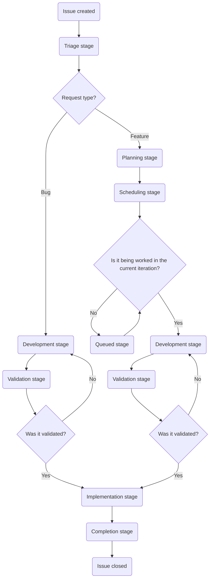

## 目的

Customer Support Systems の目的は、次の方法により GitLab が優れた顧客体験を提供できるようにすることです:

- 生産性を最適化し、顧客の問題を効率的に解決できるよう、Customer Support チームに知識、ツール、データを提供する。
- 問題が発生する前に防止できるよう、顧客およびより広い GitLab にデータ、知識、インサイトを提供する。
- 社内および社外の顧客の両方に優れた体験を提供する。

## チーム紹介

| 名前 | 役割 |
|------|------|
| [Namo Tiwari](https://gitlab.com/namotiwari) | VP - Business Systems |
| [Jason Colyer](https://gitlab.com/jcolyer) | Fullstack Engineer, Customer Support Systems |
| [Dylan Tragjasi](https://gitlab.com/dtragjasi) | Senior Customer Support Systems Specialist |
| [Sarah Cole](https://gitlab.com/Secole) | Customer Support Systems Specialist |

## 依頼する

私たちは支援のためにここにいます。必要な内容に応じて、最適な連絡方法を示すクイックガイドです:

🙋 **新しい依頼または変更をリクエストする**

> **Issue を作成する前の注意**: 各リクエストタイプには、提出を許可された特定のロールがあります。遅延を避けるため、まず適切な人に連絡してください。適切なロール以外から作成された Issue はクローズされ、いずれにせよ適切な人へ案内されます。

- **Global Support チームからのリクエスト**は、[SIG チーム](https://gitlab.com/support-innovation-group)のメンバーが[このテンプレート](https://gitlab.com/gitlab-com/gl-security/corp/cust-support-ops/issue-tracker/-/issues/new?issuable_template=Feature)を使用して作成します
- **US Government Support チームからのリクエスト**は、US Government Support のマネージャー／ディレクターが[このテンプレート](https://gitlab.com/gitlab-com/gl-security/corp/cust-support-ops/issue-tracker/-/issues/new?issuable_template=Feature)を使用して作成します
- **Knowledge Base の更新（任意の Zendesk インスタンス）**は、Support Senior Technical Program Manager が[このテンプレート](https://gitlab.com/gitlab-com/gl-security/corp/cust-support-ops/issue-tracker/-/issues/new?issuable_template=Feature)を使用して作成します
- **その他すべて**は、リクエスト元チームのマネージャー／ディレクターが[このテンプレート](https://gitlab.com/gitlab-com/gl-security/corp/cust-support-ops/issue-tracker/-/issues/new?issuable_template=Feature)を使用して作成します

🐛 **バグを見つけましたか？**

[このテンプレート](https://gitlab.com/gitlab-com/gl-security/corp/cust-support-ops/issue-tracker/-/issues/new?issuable_template=Bug)を使用して Issue を作成してください。報告に時間を割いていただき、ありがとうございます。

💬 **その他の場合**

Slack の [#customer_support_systems](https://gitlab.enterprise.slack.com/archives/C018ZGZAMPD) で直接お気軽にご連絡ください。いつでも喜んでお話しします。

## Issue フローチャート

