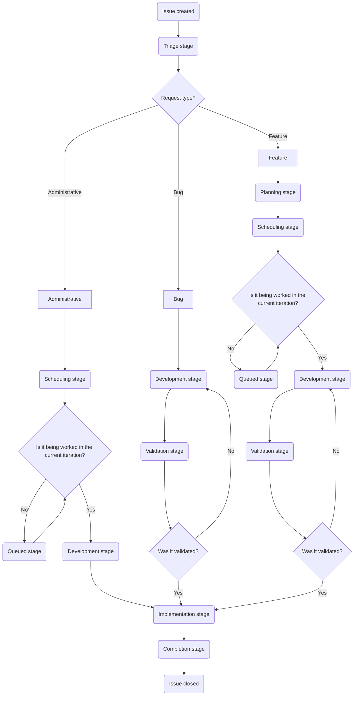

このページでは、Customer Support Systems チームで Issue を扱う際のワークフローを説明します。トリアージ、計画、開発、検証、実装を含め、Issue が作成されてから完了するまでに進むステージを取り上げます。

このワークフローを理解すると、各ステージで何が期待されるか、誰が責任を持つか、Issue を先へ進めるためにどのようなアクションが必要かを、チームメンバーが把握できます。

{}

Incident は私たちが扱う Issue の一種ですが、独自の特別なフローで運用されます。詳しくは [Incident のドキュメント](/handbook/eta/css/incidents/)を参照してください。

{}

## Issue フローチャート

Issue の標準的な進行は次のようになります。



## どの Issue を誰が起票できるか

- `Feature` Issue は、リクエスト元または対象となるチームによって異なります。
  - Global Support チームからのリクエストは、[SIG チーム](https://gitlab.com/support-innovation-group)のメンバーが起票する必要があります。
  - US Government Support チームからのリクエストは、US Government Support のマネージャーが Issue を起票する必要があります。
  - Knowledge Base に関するリクエスト（すべてのインスタンス対象）は、Support Senior Technical Program Manager が Issue を起票する必要があります。
  - その他のリクエストは、リクエストを行うチームのマネージャーが起票する必要があります。
- `Bug` Issue は誰でも起票できます。
- `Administrative` Issue は Customer Support Systems チームのみが起票します。
- `Incident` Issue は Customer Support Systems チームのみが起票します。

## ステージ

Issue で行う作業は、Issue がどのステージにあるかに大きく依存します。Issue がステージ間を移動するにつれて、担当者は頻繁に変わることに注意してください。

使用するステージのクイックリファレンスは次のとおりです。

| ステージ | リクエストタイプ | 主担当 DRI | SLA 目標 |
|-------|--------------|-------------|------------|
| トリアージ | すべて | Dylan | 1 〜 2 日 |
| 計画 | Bug、機能 | Jason | 5 日 |
| スケジューリング | 機能、Administrative | Dylan と Jason | 毎週 |
| 開発 | すべて | 状況による | 1 〜 3 週間 |
| 検証 | Bug、機能 | 状況による | 3 〜 5 日 |
| 実装 | すべて | 状況による | 3 日 |
| 完了 | すべて | 状況による | クローズまで 2 日 |

### トリアージ

{}

- 主担当 DRI: Dylan
- 副担当 DRI: Alyssa
- SLA 目標: 1 〜 2 営業日
- このステージを使用するリクエストタイプ:
  - Administrative
  - Bug
  - 機能
- 目的
  - リクエストの技術以外の妥当性・実現可能性を判断する。
  - 続行前にさらに情報が必要かを判断する。
  - 必要な承認が存在することを確認する。
  - 顧客タイプ、影響を受けるシステム、優先度、ロードマップとの整合性のラベルを追加する。
- 主なアクティビティ
  - リクエスト者から必要な情報を収集する。
  - ロードマップとの整合性と複雑さに基づいて承認を検証する。
  - 続行できる場合は計画ステージへ移動し、できない場合はクローズする。
  - 元のリクエストに十分な詳細が提供されていない場合は、Blocked ステージへ移動する。

{}

このステージで、DRI は次を行います。

- リクエストから必要な情報を収集します（必要な場合）。
- Issue を進められるかを判断します。
- Issue が有効かどうかを判断します（正しい人が提出したか、実現可能かなど）。

その後、DRI は次を行う必要があります。

- Issue に[優先度ラベル](/handbook/eta/css/gitlab/labels#priority-labels)が付いていることを確認します。
- Issue に[顧客ラベル](/handbook/eta/css/gitlab/labels#customer-labels)が付いていることを確認します。
- Issue がロードマップ項目に関連付けられている場合、[ロードマップラベル](/handbook/eta/css/gitlab/labels#roadmap-labels)が付いていることを確認します。

これらを整えた後、DRI はリクエストタイプに応じて Issue を次のステージへ移動します。

- Administrative Issue は[スケジューリングステージ](#scheduling)へ移動します。
- Bug または機能 Issue は[計画ステージ](#planning)へ移動します。

これは次のように [quickactions](https://docs.gitlab.com/user/project/quick_actions/)を使って、1 つのコメントで実行できます。

```plaintext
/label ~"Customer::Support"
/label ~"Priority::3"
/label ~"RequestType::Feature"
/label ~"roadmap_item"
/label ~"Stage::Planning"
```

また、次の[グループコメントテンプレート](https://gitlab.com/groups/gitlab-com/gl-security/corp/cust-support-ops/-/comment_templates)を使用して、作業を支援する quickactions コメントを生成できます。

- [Triage -> Planning](https://gitlab.com/groups/gitlab-com/gl-security/corp/cust-support-ops/-/comment_templates/1000652)
- [Triage -> Scheduling](https://gitlab.com/groups/gitlab-com/gl-security/corp/cust-support-ops/-/comment_templates/1001112)
- [Triage -> Development](https://gitlab.com/groups/gitlab-com/gl-security/corp/cust-support-ops/-/comment_templates/1001111)

#### 誤った人物が起票したリクエストをクローズする

Issue の起票を許可されていない人物が Issue を起票した場合（[どの Issue を誰が起票できるか](#who-can-file-what-issues)を参照）、Issue をクローズし、リクエスト者に次へ進むために必要なアクションを案内する必要があります。

これを支援するため、該当する状況に適した[グループコメントテンプレート](https://gitlab.com/groups/gitlab-com/gl-security/corp/cust-support-ops/-/comment_templates)を使用します。

- [Not approved -> Talk to SIG team](https://gitlab.com/groups/gitlab-com/gl-security/corp/cust-support-ops/-/comment_templates/2001174)
- [Not approved -> Talk to manager](https://gitlab.com/groups/gitlab-com/gl-security/corp/cust-support-ops/-/comment_templates/2001175)
- [Not approved -> Talk to Senior Technical Program Manager](https://gitlab.com/groups/gitlab-com/gl-security/corp/cust-support-ops/-/comment_templates/2001176)

これらを使用すると、Issue の関係者に誰と話す必要があるかを案内でき、Issue も適切にクローズできます。

#### トリアージ中の Issue をクローズする

DRI が Issue を続行できないと判断した場合、DRI は次のアクションを行います。

- 続行しない理由をコメントします。
- Issue の `status` を `Won't do` に設定します。
- Issue をクローズします。

これは次のように [quickactions](https://docs.gitlab.com/user/project/quick_actions/)を使って、1 つのコメントで実行できます。

```plaintext
Greetings,

After review of this issue, we have determined we will not be able to proceed on this issue.

This is due to <insert reasons here>.

Due to this, we will be closing this out. Should the above mentioned reasons be resolved, please create a **new** issue.

/status "Won't do" 
```

### 計画

{}

- 主担当 DRI: Jason
- 副担当 DRI: Sarah
- SLA 目標: 5 営業日
- このステージを使用するリクエストタイプ:
  - Bug
  - 機能
- 目的
  - 技術的な妥当性・実現可能性を判断する。
  - さらに情報が必要かを判断する。
  - 実装のゲームプランを作成する。
  - 作業量のおおよその見積もりを判断する。
- 主なアクティビティ
  - 詳細なゲームプランを作成する。
  - リクエスト者と協力してブロッカーを解消する。
  - Issue のウェイトスコアを判断する。
  - 完了時にスケジューリングステージへ移動する。

{}

このステージで、DRI は次を行います。

- Issue のゲームプランを作成し、コメントとして Issue に投稿します。
- リクエストの技術的な実現可能性を判断します。
- 必要な作業タイムラインのおおよその見積もりを判断します（検証時間を除く）。
- [RICE スコア](#rice-score)を判断します。

その後、DRI は次を行う必要があります。

- Issue にウェイト値を追加します（[RICE スコア](#rice-score)を使用します）。
- Issue にイテレーションとマイルストーンを追加します（Bug Issue のみ）。

これらを整えた後、DRI はリクエストタイプに応じて Issue を次のステージへ移動します。

- Bug Issue は[開発ステージ](#development)へ移動します。
- 機能 Issue は[スケジューリングステージ](#scheduling)へ移動します。

また、次の[グループコメントテンプレート](https://gitlab.com/groups/gitlab-com/gl-security/corp/cust-support-ops/-/comment_templates)を使用して、作業を支援する quickactions コメントを生成できます。

- [Planning -> Development](https://gitlab.com/groups/gitlab-com/gl-security/corp/cust-support-ops/-/comment_templates/1000755)
- [Planning -> Scheduling](https://gitlab.com/groups/gitlab-com/gl-security/corp/cust-support-ops/-/comment_templates/1000754)

#### RICE スコア

Customer Support Systems は、機能 Issue に対して [RICE Framework](/handbook/product/product-processes/#using-the-rice-framework)を修正したバージョンを使用しています。

修正したバージョンで使用できる値の内訳は次のとおりです。

| カテゴリ | 値 | スコア |
|----------|-------|:-----:|
| リーチ | 顧客に影響する | 10 |
| | すべてのエージェントに影響する | 7 |
| | 1 つの地域のエージェントに影響する | 4 |
| | 少数のエージェントグループに影響する | 2 |
| | 実質的な影響が最小限またはない | 1 |
| 影響度 | GitLab の収益に直接影響する | 3 |
| | Support ワークフローに大きく影響する | 2 |
| | Support ワークフローにわずかに影響する | 1 |
| | 実質的な影響が最小限またはない | 0.5 |
| 確信度 | パーセンテージ | 状況による |
| 工数 | 数値 | 状況による |

上記の値からスコアを取り、次の式で RICE スコアを計算します。

(Reach × Impact × Confidence) / Effort

[この計算ツール](https://docs.google.com/spreadsheets/d/1SVIRUJ9UmmMSXl0-WZSBP2KueTzGxJfBH4zir61WTFY/edit?gid=0#gid=0)（GitLab Google アカウントへのアクセスが必要）を使用すると、RICE スコアをすばやく生成できます。

#### 計画中の Issue をクローズする

DRI が Issue を続行できないと判断した場合、DRI は次のアクションを行います。

- 続行しない理由をコメントします。
- Issue の `status` を `Won't do` に設定します。
- Issue をクローズします。

これは次のように [quickactions](https://docs.gitlab.com/user/project/quick_actions/)を使って、1 つのコメントで実行できます。

```plaintext
Greetings,

After review of this issue, we have determined we will not be able to proceed on this issue.

This is due to <insert reasons here>.

Due to this, we will be closing this out. Should the above mentioned reasons be resolved, please create a **new** issue.

/status "Won't do" 
```

### スケジューリング

{}

- 主担当 DRI: Dylan と Jason
- SLA 目標: 毎週のサイクルで対応（1 週間以内）
- このステージを使用するリクエストタイプ:
  - 機能
- 目的
  - 帯域の妥当性・実現可能性を判断する。
  - イテレーションとマイルストーンを割り当てる。
  - 開発 DRI を割り当てる。
- 主なアクティビティ
  - 開発タイムラインについて話し合う（毎週のサイクル）。
  - Issue にイテレーションとマイルストーンを追加する。
  - 現在のイテレーションの場合: 開発ステージへ移動する。
  - 将来のイテレーションの場合: Queued ステージへ移動する。

{}

ここで DRI は、変更の開発タイムラインについて話し合います。これは毎週のサイクルで行います。

決定したら、DRI は Issue で次を行います。

- Issue にイテレーションを設定します。
- Issue にマイルストーンを設定します。
- 今後 Issue を進める DRI を設定します。

その後、DRI は作業開始のタイムラインに応じて Issue を次のステージへ移動します。

- 作業開始のタイムラインが**現在の**イテレーションの場合、Issue は[開発ステージ](#development)へ移動します。
- 作業開始のタイムラインが将来のイテレーションの場合、Issue は[Queued ステージ](#queued)へ移動します。

また、次の[グループコメントテンプレート](https://gitlab.com/groups/gitlab-com/gl-security/corp/cust-support-ops/-/comment_templates)を使用して、作業を支援する quickactions コメントを生成できます。

- [Scheduling -> Development](https://gitlab.com/groups/gitlab-com/gl-security/corp/cust-support-ops/-/comment_templates/1000757)
- [Scheduling -> Queued](https://gitlab.com/groups/gitlab-com/gl-security/corp/cust-support-ops/-/comment_templates/1000756)

### Queued

{}

- 主担当 DRI: Dylan と Jason
- SLA 目標: 該当なし
- このステージを使用するリクエストタイプ:
  - 機能
- 目的
  - リクエストの準備ができているが、割り当てられたイテレーションの開始を待っていることを示す。
- 主なアクティビティ
  - イテレーションのスケジュールを監視する。
  - イテレーション開始時: 開発 DRI を割り当て、開発ステージへ移動する。

{}

Issue はイテレーションが始まるまでここに置かれます。イテレーションが始まったら、DRI は Issue を[開発ステージ](#development)へ移動します。

また、次の[グループコメントテンプレート](https://gitlab.com/groups/gitlab-com/gl-security/corp/cust-support-ops/-/comment_templates)を使用して、作業を支援する quickactions コメントを生成できます。

- [Queued -> Development](https://gitlab.com/groups/gitlab-com/gl-security/corp/cust-support-ops/-/comment_templates/1000758)

### 開発

{}

- 主担当 DRI: 状況による
- SLA 目標: ゲームプランのタイムラインに基づく（通常 1 〜 3 週間）
- このステージを使用するリクエストタイプ:
  - Administrative
  - Bug
  - 機能
- 目的
  - ステージング／サンドボックスに変更を実装する。
  - テストを実施する。
  - 検証のための環境を準備する。
- 主なアクティビティ
  - 適切な環境に変更を実装する。
  - 実装をテストする。
  - 検証を得るために検証ステージへ移動する。
    - 検証が不要な場合は、代わりに実装ステージへ移動する。

{}

このステージで DRI は、テストと検証を可能にするために必要なセットアップを行います（通常はサンドボックス内）。DRI はセットアップの変更を行う際、何を実施したかを示すコメントを追加します。使用が必須の定型形式はありませんが、一般的な推奨例は次のとおりです。

```plaintext
## Development notes

- Zendesk Global Sandbox
  - Triggers
    - Modified [Example trigger](LINK_TO_TRIGGER)
  - Ticket forms
    - Renamed form [Example form](LINK_TO_FORM) to `Modified Example form`
  - Webhooks
    - Created [New webhook](LINK_TO_WEBHOOK)

```

必要なセットアップをすべて完了したら、実行する必要があるテストスイートを含むタスク項目を Issue 上に作成する必要があります。実施する必要があるテストごとに、子タスク項目を作成します。

各子タスク項目では、次のようにします。

- 件名／タイトルはテスト対象の名前にします（例として、SLA ポリシー `Priority Support - FRT` をテストする場合、件名／タイトルは `Priority Support - FRT` にします）。
- 本文／説明には次の 3 つのセクションを含めます。
  - `Prerequisites`: テストを実施するための前提条件。
  - `Steps`: テストを行う正確な手順。
  - `Expected Result`: テストで期待される結果の詳細。

<details>
<summary>「Support Readiness SLA」を使用するテスト項目の例</summary>

```plaintext

## Prerequisites

- A test ticket must exist that is open
- A test ticket must use the `Support Ops` form

## Steps

1. Login to [Zendesk Global's Sandbox](https://gitlab1707170878.zendesk.com/) using the end-user `will@example.com` (login details can be found [here](https://docs.google.com/spreadsheets/d/1g6lJ3AUS4EYqoBYzAdExp4v1dkzOb3GWKaMIoZikjts/edit?usp=sharing))
2. Create a new ticket using the [Support Ops form](https://gitlab1707170878.zendesk.com/hc/en-us/requests/new?ticket_form_id=12510630404508) with the following information
   - Subject: `Test from issue xxx`
   - Description: `Testing`
   - What type of product are you using: `GitLab.com`
   - Email associated with your subscription: `will@example.com`
   - Subscription number: `A-S123456789`
3. Note the ticket ID to help locate it later
4. Logout of [Zendesk Global's Sandbox](https://gitlab1707170878.zendesk.com/)
5. Login to [Zendesk Global's Sandbox](https://gitlab1707170878.zendesk.com/) as an agent account. If you do not have your own agent account, you can use `agent@example.com` (login details can be found [here](https://docs.google.com/spreadsheets/d/1g6lJ3AUS4EYqoBYzAdExp4v1dkzOb3GWKaMIoZikjts/edit?usp=sharing))
6. Locate the previously created ticket in Zendesk
7. Check the events of the ticket to confirm the SLA policy is set to `Support Readiness SLA`

## Expected Result

The ticket is using the SLA policy `Support Readiness SLA`
```

</details>

テストスイート用の子タスク項目をすべて生成したら、親 Issue にそれを要約するコメントを追加します。次のような内容にします。

```plaintext
## QA Test Plan

The following child test issues were created for this MR:

- LINK_TO_CHILD_TASK_ITEM
- LINK_TO_CHILD_TASK_ITEM
- LINK_TO_CHILD_TASK_ITEM
- LINK_TO_CHILD_TASK_ITEM
- LINK_TO_CHILD_TASK_ITEM
```

{}

私たちは `CustSuppOps Zendesk Test Suite Generator` という名前の GitLab Duo エージェントを開発しました。このエージェントは、作業中のマージリクエスト（およびリンクされた Issue）を使用して、テストスイートを生成します。

使用方法:

1. マージリクエストを作成します（説明に親 Issue へのリンクが含まれていることを確認します）。
1. ページ右上（プロフィールアイコンの下）にある `Add new chat` をクリックします。
1. エージェント `CustSuppOps Zendesk Test Suite Generator` を見つけてクリックします。
1. チャットでエージェントにテストスイートの生成を依頼します。

エージェントの実行中には、次を行います。

- 実施していること、確認していること、使用しているロジックを説明します。
- 子タスク項目の内容について承認を求めます。
- 親 Issue に要約コメントを追加するための承認を求めます。
- 実行したすべてのアクションを要約します。

`CustSuppOps Zendesk Test Suite Generator` を作業中のプロジェクトで実行できるかどうかを判断するには、該当する項目のハンドブックページを参照してください。

{}

完全なテストスイートを生成した後は、テストを実施する必要があります（または SIG チームにテスト実施の支援を依頼します）。

テストの実施中は、テストの結果と状態で子タスク項目を更新します。テストが失敗した場合は、気付いた内容と必要な変更があるかを注記またはコメントとして追加します。テストが完了した後（成功でも失敗でも）、子タスク項目をクローズします。他の人がすばやく状態を読み取れるよう、子タスク項目の件名／タイトルを `:white_check_mark:` または `:x:` で編集し、最終ステータスを示すと役立ちます。

{}

テストが失敗した場合、修正がマージリクエストにプッシュされた後、以前に実行したテストを含め、まったく新しいテストスイートを実行する必要があります。これにより、テストスイートの完了後に変更を行う必要が生じても、すべてが正常に動作することを確実にします。

{}

すべてのテストと開発が完了したら、Issue を次のステージに移動する必要があります。使用する正確なステージは、作業中の Issue のタイプによって異なります。

- Administrative Issue は[実装ステージ](#implementation)へ移動します。
  - 手動で行う場合は、新しいステージへ移動する際にラベル `Validation::Skipped` を必ず追加します。
- Bug および機能 Issue は[検証ステージ](#validation)へ移動します。

また、次の[グループコメントテンプレート](https://gitlab.com/groups/gitlab-com/gl-security/corp/cust-support-ops/-/comment_templates)を使用して、新しいステージへの移動を支援する quickactions コメントを生成できます。

- [Development -> Validation](https://gitlab.com/groups/gitlab-com/gl-security/corp/cust-support-ops/-/comment_templates/1000759)
- [Development -> Implementation](https://gitlab.com/groups/gitlab-com/gl-security/corp/cust-support-ops/-/comment_templates/1000761)

### 検証

{}

- 主担当 DRI: 状況による
- SLA 目標: 状況による（リクエスト者の可用性と変更の複雑さに依存し、通常は 3 〜 5 営業日）
- このステージを使用するリクエストタイプ:
  - Bug
  - 機能
- 目的
  - リクエスト者による検証を得る。
- 主なアクティビティ
  - リクエスト者から検証を得る（必要な場合）。
  - 検証を受け取ったら実装ステージへ移動する。

{}

ここで、DRI は Issue のリクエスト者に、セットアップされた内容が期待と一致することを検証するよう依頼します。

リクエスト者が変更を検証するために必要となるすべての情報を必ず含め、検証を依頼するコメントを作成してください。

[Request validation](https://gitlab.com/groups/gitlab-com/gl-security/corp/cust-support-ops/-/comment_templates/1001113)の[グループコメントテンプレート](https://gitlab.com/groups/gitlab-com/gl-security/corp/cust-support-ops/-/comment_templates)を使用して、これを支援する quickactions コメントを生成できます。

この時点で、Issue は検証者からの検証ステータスを示すコメントを待ちます。返答に応じて、実施するアクションが変わります。

- リクエスト者が変更を検証した場合:
  - ラベル `Validation::Received` を追加します。
  - Issue を[実装ステージ](#implementation)へ移動します。
- リクエスト者が変更を却下した場合:
  - ラベル `Validation::Rejected` を追加します。
  - Issue を[開発ステージ](#development)へ移動します。

また、次の[グループコメントテンプレート](https://gitlab.com/groups/gitlab-com/gl-security/corp/cust-support-ops/-/comment_templates)を使用して、新しいステージへの移動を支援する quickactions コメントを生成できます。

- [Validation received](https://gitlab.com/groups/gitlab-com/gl-security/corp/cust-support-ops/-/comment_templates/1001114)
- [Validation rejected](https://gitlab.com/groups/gitlab-com/gl-security/corp/cust-support-ops/-/comment_templates/1001115)

### 実装

{}

- 主担当 DRI: 状況による
- SLA 目標: 状況による（実装する変更に依存し、通常は 3 〜 5 営業日）
- このステージを使用するリクエストタイプ:
  - Administrative
  - Bug
  - 機能
- 目的
  - 技術的な設計図を作成する。
  - 本番環境に変更を実装する／変更をマージする。
  - デプロイ日を確認する。
- 主なアクティビティ
  - MR リンクと変更の詳細を含む包括的な技術設計図を作成する。
  - MR またはその他の適切な方法で実装する。
  - すべてのタスクが完了したら（デプロイ項目では MR がマージされたら）、完了ステージへ移動する。

{}

ここでは技術設計図を作成し、変更を実装します（MR をマージするか、システムで直接変更を行います）。

技術設計図には、変更したすべての内容を詳細に記載します。設計図を見る人は、あなたが行ったことを完全に再現できる必要があります。これは、作成したすべての MR にリンクし、MR 外で行った変更を詳述することなどを意味します。

すべての実装タスクが完了したら（デプロイを使用する項目では、MR をマージすれば十分です）、Issue を[完了ステージ](#completed)に変更します。

### 完了

{}

- 主担当 DRI: 状況による
- SLA 目標: Issue をクローズするまで 2 営業日
- このステージを使用するリクエストタイプ:
  - Administrative
  - Bug
  - 機能
- 目的
  - すべての作業が完了したことを示す。
- 主なアクティビティ
  - すべての本番変更が完了しているか、デプロイ待ちであることを確認する。
  - Issue をクローズする。

{}

DRI は、すべての作業が完了したこと（デプロイサイクルの一部である場合は、本番稼働する日付）を示すコメントを追加してから、Issue をクローズします。

Issue をクローズするときは、Issue の `status` を `Complete` に設定してください。

これは次のように [quickactions](https://docs.gitlab.com/user/project/quick_actions/)を使って、1 つのコメントで実行できます。

```plaintext
The work on this issue has been completed at this time.

As components of the changes are tied to scheduled deployments, it will be fully live 2026-02-01.

/label ~"Stage::Completed"
/status "Complete" 
```

また、次の[グループコメントテンプレート](https://gitlab.com/groups/gitlab-com/gl-security/corp/cust-support-ops/-/comment_templates)を使用して、作業を支援する quickactions コメントを生成できます。

- [Close out a completed issue](https://gitlab.com/groups/gitlab-com/gl-security/corp/cust-support-ops/-/comment_templates/1001116)

### Blocked

{}

- 主担当 DRI: Dylan と Jason
- SLA 目標: 該当なし
- 目的
  - Issue がブロックされていることを示す。
  - ブロックしている理由と前のステージを記録する。
  - ブロックの状態を監視する。
- 主なアクティビティ
  - ブロック状態を毎週監視する。
  - ブロック解除時: 前のステージに戻す。

{}

これは、何らかの事情により Issue のすべての進行が妨げられたときに使用する特別なステージです。これは、承認の不足、ツールの調達待ちなどに関連している可能性があります。

DRI は、更新が必要か、または「ブロック解除」できるかを判断するため、これらの Issue を毎週（計画のサイクル中に）レビューします。

- ブロック解除のすべての基準を満たしている場合、DRI は Issue を元のステージに戻します。
- 前回の更新から 1 週間が経過しても Issue をまだブロック解除できない場合、DRI はエスカレーションプロトコルに従います。
  - ブロック解除されないまま 1 週間: ブロックしている当事者に更新を Ping します。
  - ブロック解除されないまま 2 週間: 前回更新を Ping した人物のリーダーシップに更新を Ping します。
  - ブロック解除されないまま 3 週間: 前回更新を Ping した人物のリーダーシップに更新を Ping します。
  - ブロック解除されないまま 4 週間:
    - 4 週間更新がなくブロックされていることを示すコメントを追加します。
    - Issue をクローズします。

エスカレーションプロトコルの例:

- 例 1: リクエスト者が Support Engineer の場合
  - 更新なしの第 1 週では、リクエスト者に Ping します。
  - 更新なしの第 2 週では、Support Manager に Ping します。
  - 更新なしの第 3 週では、Support Director に Ping します。
  - 更新なしの第 4 週では、Issue をクローズします。
- 例 2: リクエスト者が Support Manager の場合
  - 更新なしの第 1 週では、リクエスト者に Ping します。
  - 更新なしの第 2 週では、Support Director に Ping します。
  - 更新なしの第 3 週では、VP of Support に Ping します。
  - 更新なしの第 4 週では、Issue をクローズします。
- 例 3: リクエスト者が Support Director の場合
  - 更新なしの第 1 週では、リクエスト者に Ping します。
  - 更新なしの第 2 週では、VP of Support に Ping します。
  - 更新なしの第 3 週では、CTO に Ping します。
  - 更新なしの第 4 週では、Issue をクローズします。

**注記:** これらのエスカレーションパスは標準的な組織階層を前提としています。ブロックしている当事者の具体的なレポートラインに基づき、必要に応じて調整してください。

#### Issue を Blocked ステージへ移動する

Issue を Blocked ステージへ移動するには、次を行います。

- Issue を Blocked へ移動していることを示します。
- Issue が現在置かれているステージを記録します（元に戻せるようにするためです）。
- Issue のブロックを解除するために必要な基準を記録します。
- 基準を満たしたときに実行すべきアクションを示します。

また、次の[グループコメントテンプレート](https://gitlab.com/groups/gitlab-com/gl-security/corp/cust-support-ops/-/comment_templates)を使用して、作業を支援する quickactions コメントを生成できます。

- [Move issue to blocked stage](https://gitlab.com/groups/gitlab-com/gl-security/corp/cust-support-ops/-/comment_templates/1001117)

### Backlogged

{}

- 主担当 DRI: Dylan と Jason
- SLA 目標: 該当なし
- 目的
  - Issue が不明な日付まで延期されていることを示す。
  - 通常は、優先度が低く CustSuppOps 向けのタスクに限定される。
- 主なアクティビティ
  - 再開の準備ができたら: 最も適切なステージに戻す。

{}

これは、Issue がバックログに置かれている場合に使用する特別なステージです。通常、作業する意向はあるものの、遠い将来（次の 10 イテレーションより先）または不明な将来の日付に対応することを意味します。

DRI は、スケジュールできるかを判断するため、これらの Issue を毎週（計画のサイクル中に）レビューします。

- スケジュールできる場合は、[スケジューリングステージ](#scheduling)へ移動します。
- スケジュールできない場合は、Backlogged ステージに留まります。

## トラブルシューティング

### Issue が Issue ボードに表示されない

これは、Issue 自体にボードに必要なラベル（ステージラベル、顧客ラベルなど）がないことを示します。

Issue を適切にトリアージできるよう、ラベル `Stage::Triage` を追加して Dylan に割り当てます。

### 必要な情報がない

ワークフローの途中で必要な情報が不足していることに気付いた場合:

1. 情報を依頼するコメントを追加します。
2. 遅延が 1 週間を超える場合は、Blocked ステージへの移動を検討します。
3. リクエスト者と関連するステークホルダーにタグを付けます。
