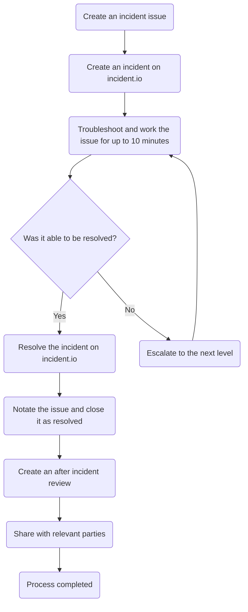
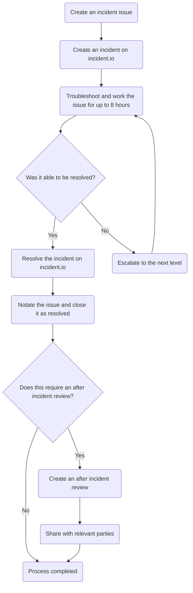

このガイドでは、Customer Support Systems がインシデント（10 分以内に解決できず、構造化された対応手順が必要な問題）を処理する方法を説明します。

このドキュメントでは、インシデントの重大度の判定方法、エスカレーションのタイミングと方法、目標解決時間、インシデント後レビューの要件を含む、インシデント対応フレームワークを扱います。このプロセスは重大度に応じて 6 〜 8 段階で構成され、検知から解決までインシデントを一貫して管理します。

## インシデントについて

### インシデントとは

Customer Support Systems チームでは、インシデントとは迅速に（10 分以内に）解決できないイベント、問題、またはエラーを指します。これはバグ、システム変更、ユーザーからの報告などによって発生する場合があります。

## エスカレーションレベル

状況によっては、インシデントを十分に迅速に解決できず、エスカレーションが必要になります。現在のエスカレーションレベルは次のとおりです。

| レベル | アクション |
|:-----:|--------|
| 1 | 支援を依頼する投稿をチームチャンネルに行う |
| 2 | Customer Support Systems Specialist のオンコールを呼び出す |
| 3 | Customer Support Systems の Fullstack Engineer オンコールを呼び出す |
| 4 | Customer Support Systems のリーダーシップに呼び出しを行う |

インシデントへの対応を開始する時点では、技術的には「レベル 0」から開始します（必要に応じてそこからレベルを上げます）。

上位レベルにエスカレーションする際、対象者が不在であることが判明した場合は、次に高いレベルへ移行してください。

{}

Customer Support Systems チームまたは Customer Support Systems チームの特定の担当者をページングする方法については、次を参照してください。

- [Customer Support Systems のページング](/handbook/eta/css/pagerduty/oncall/#paging-customer-support-systems)
- [特定の担当者をページングする](/handbook/eta/css/pagerduty/oncall/#paging-a-specific-person)

{}

## 重大度

インシデントの重大度は、最も高い[重要度レベル](/handbook/eta/css/criticalities/)と最も高い影響レベルによって決まります。これらを使用して、以下の表から重大度レベルを判定できます。

|   | 顧客に影響 | ワークフローを停止 | ワークフローが低下 | 不便を生じさせる |
|---|:-----------------:|:----------------:|:------------------:|:-------------:|
| ミッションクリティカル | 1 | 1 | 2 | 2 |
| ビジネスクリティカル | 1 | 2 | 2 | 3 |
| 業務運用 | 2 | 2 | 3 | 4 |
| 管理 | 3 | 3 | 4 | 4 |

## 解決時間

インシデントの解決に設定する時間は、その重大度によって異なります。この時間は各エスカレーション間の時間も決定します。

| 重大度レベル | 目標解決時間 | エスカレーションのタイミング |
|----------------|------------------------|------------------|
| 重大度 1 | 1 〜 2 時間 | 解決せずに 10 分経過 |
| 重大度 2 | 2 〜 4 時間 | 解決せずに 30 分経過 |
| 重大度 3 | 24 〜 48 時間 | 解決せずに 8 時間経過 |
| 重大度 4 | 48 〜 72 時間 | 解決せずに 24 時間経過 |

## インシデントを処理する

インシデントの処理は 6 〜 8 段階に分けられます。各重大度レベルでのフローを簡略化したものを以下に示します。

ミッションクリティカル項目のフローチャート

ビジネスクリティカル項目のフローチャート

業務運用項目のフローチャート

管理項目のフローチャート

### ステージ 1 - 重大度を判定する

インシデントが発生して対応を開始したら、まず最も高い重大度レベルを判定する必要があります。これは、影響を受けるすべてのシステムと項目を確認し、それぞれの[重要度レベル](/handbook/eta/css/criticalities/)と影響レベルを確認して、最も高い[重大度値](#severity)を使用して行います。下位レベルに含まれる項目の範囲や数量にかかわらず、常に最も高い重大度レベルを使用します。

念のため、レベルの階層は次のとおりです。

Severity 1 > Severity 2 > Severity 3 > Severity 4

最も高い重大度レベルが分かったら、[ステージ 2](#stage-2---create-an-issue)に進みます。

### ステージ 2 - Issue を作成する

すべてのインシデントについて、[インシデント Issue テンプレート](https://gitlab.com/gitlab-com/gl-security/corp/cust-support-ops/issue-tracker/-/issues?issuable_template=Incident)を使用して Issue を作成する必要があります。最初に入力する情報は「完全」である必要はありません。多くの場合、簡略化したタイトル（例: 「Zendesk Triggers が破損」）と、エラーまたは問題そのものになります。

Issue を作成したら、[ステージ 3](#stage-3---create-an-incident-in-incidentio)に進みます。

### ステージ 3 - incident.io でインシデントを作成する

Issue を作成した後、incident.io を通じてインシデントを公開する必要があります（ステータスページに表示されるようにするためです）。これを行うには、次の手順を実行します。

1. [ステータスページ](https://app.incident.io/gitlab/status-pages)に移動します
1. インシデントを作成するステータスページをクリックします
1. 右上の `Publish incident` をクリックします
1. 意味のある `Name` を入力します
1. インシデントの `Status` を設定します
   - Investigating: インシデントを報告する
     - 通常、開始点として使用します
   - Identified: 問題が特定され、修正が行われています
   - Monitoring: 修正が実装され、状況を監視しています
   - Resolved: すべて正常です
1. インシデントに意味のある `Message` を設定します
   - ここにはインシデント Issue へのリンクを含めてください
1. `Affected components` の影響レベルを設定します（必要な値はインシデントの影響によって異なります）
   - No impact: このコンポーネントにインシデントの影響はありません
   - Degraded performance: コンポーネントは動作していますが、標準より低いパフォーマンスレベルです
   - Partial outage: コンポーネントの重要な部分が動作していません
   - Full outage: コンポーネントが完全に停止しています
1. `Review incident` をクリックします
1. すべての情報が正確であることを確認します
1. `Publish incident` をクリックします

作成したら、[ステージ 4](#stage-4---troubleshoot-the-incident)に進みます。

### ステージ 4 - インシデントをトラブルシューティングする

ここまで完了したら、問題の解決に取り組みます。その際は、Issue に十分なコメントを残してください。

対応中は、incident.io のインシデントに定期的な更新を提供することを忘れないでください。一般的には、単にまだ調査中であることを示すだけの場合でも、毎時更新されるようにしてください。

状況によっては、インシデントを十分に迅速に解決できず、エスカレーションが必要になります。エスカレーションレベル間の時間は、インシデントの重大度レベルによって異なります（[解決時間](#resolution-times)を参照）。

そのため、現在の状態によって次に進むステージが決まります。

- 妥当な時間で解決に至る見込みがある場合は、解決するまでインシデントへの対応を継続します。インシデントの原因を解決したら、[ステージ 6](#stage-6---resolve-the-incident-in-incidentio)に進みます
- 次のレベルにエスカレーションする必要がある場合は、[ステージ 5](#stage-5---escalate-the-incident)に進みます

### ステージ 5 - インシデントをエスカレーションする

このステージでは、インシデントをエスカレーションします。エスカレーション先を決定するには、[エスカレーションレベル](#escalation-levels)を参照してください。

Issue に、エスカレーションしていること（およびエスカレーション先のレベル）を示すコメントを必ず追加してください。

インシデントを次のレベルにエスカレーションし、対象者が確認した時点で、インシデントの DRI はエスカレーション先の対象者に変わります。

その後、エスカレーション先の対象者は[ステージ 4](#stage-4---troubleshoot-the-incident)に戻ります。

### ステージ 6 - incident.io でインシデントを解決する

インシデント自体が解決したら、incident.io で解決する必要があります。これを行うには、次の手順を実行します。

1. Incident.io にログインします（Okta 経由）
1. [ステータスページ](https://app.incident.io/gitlab/status-pages)に移動します
1. インシデントが存在するステータスページをクリックします
1. 対象のインシデントをクリックします
1. 右上のステータスバー（現在のステータスを示しています）をクリックします
1. 新しい `Status` を選択します（`Resolved` にする必要があります）
1. 意味のあるメッセージを入力します
1. `Review update` をクリックします
1. すべての情報が正確であることを確認します
1. `Publish update` をクリックします

完了したら、[ステージ 7](#stage-7---resolve-the-issue)に進みます。

### ステージ 7 - Issue を解決する

ここでは、先に作成した Issue を解決する必要があります。インシデントの根本原因を修正するために行ったことを詳しく記載するコメントを必ず追加してください。

コメントを追加した後、Issue をクローズします。

次の基準のいずれかを満たす場合は、[ステージ 8](#stage-8---after-incident-review)に進みます。

- 最も高い重大度レベルが Severity 1 だった
- 最も高い重大度レベルが Severity 2 だった
- レベル 3 以上へのエスカレーションが必要だった

### ステージ 8 - インシデント後レビュー

このためには、[Customer Support Systems After Incident Reviews Google ドキュメント](https://docs.google.com/document/d/1aUEHYWa-RWpiUUM34yWGMxIYgFnL6qaCCXu954H5Zqo/edit?tab=t.72mh0ffa6o0f)（内部限定）を使用します。

`Template` タブを複製してから、完全に記入します。必要な内容の例として、以前のドキュメントを使用できます。

すべてを記入したら、[#customer_support_systems チャンネル](https://gitlab.enterprise.slack.com/archives/C018ZGZAMPD)に Slack 投稿を行い、Customer Support Systems のリーダーシップを @ メンションして CC してください。
