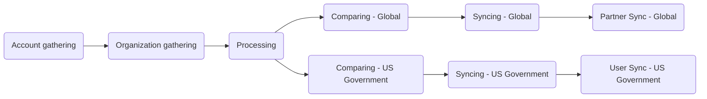

このガイドでは、Salesforce（信頼できる唯一の情報源）から Zendesk へ顧客組織とユーザーデータを同期する、自動化された毎時処理である Zendesk-Salesforce Sync を説明します。この同期により、正確な Support entitlement、適切な SLA の適用、Zendesk 内の最新の顧客メタデータが確保されます。

同期は GitLab CI/CD パイプラインを通じて 9 つの順次ステージで実行されます。このドキュメントでは同期の仕組みを説明し、管理者向けのトラブルシューティングガイダンスを提供します。

管理者は[管理者タスク](#administrator-tasks)セクションをレビューしてください。

{}

- デプロイタイプ: `Ad-hoc`
- プロジェクトリポジトリ:
  - [Salesforce Accounts](https://gitlab.com/gitlab-support-readiness/zd-sfdc-sync/salesforce-accounts)
  - [Zendesk Orgs](https://gitlab.com/gitlab-support-readiness/zd-sfdc-sync/zendesk-orgs)
  - [Processor](https://gitlab.com/gitlab-support-readiness/zd-sfdc-sync/processor)
  - [Global Org Compare](https://gitlab.com/gitlab-support-readiness/zd-sfdc-sync/global-org-compare)
  - [Zendesk Global Org Sync](https://gitlab.com/gitlab-support-readiness/zd-sfdc-sync/zendesk-global-org-sync)
  - [Partner Sync](https://gitlab.com/gitlab-support-readiness/zd-sfdc-sync/partner-sync)
  - [US Government Org Compare](https://gitlab.com/gitlab-support-readiness/zd-sfdc-sync/us-gov-org-compare)
  - [Zendesk US Government Org sync](https://gitlab.com/gitlab-support-readiness/zd-sfdc-sync/zendesk-us-government-org-sync)
  - [Zendesk US Government User Sync](https://gitlab.com/gitlab-support-readiness/zd-sfdc-sync/zendesk-us-gov-user-sync)
- 管理対象コンテンツリポジトリ:
  - [Zendesk Global Organization Entitlement Overrides](https://gitlab.com/gitlab-com/support/zendesk-global/organization-entitlement-overrides)

{}

## Zendesk-Salesforce Sync を理解する

### Zendesk-Salesforce Sync とは

Zendesk-Salesforce Sync は、Salesforce から Zendesk へ顧客データを同期する、相互接続された 9 つの GitLab CI/CD プロジェクトの集合です。同期では次を扱います。

- **顧客組織**: Zendesk Global と US Government の両方のアカウントメタデータ、Support entitlement、サブスクリプション階層、ARR。
- **パートナー組織**: パートナーアカウント用の個別の同期プロセス（Zendesk Global のみ）。
- **ユーザーの関連付け**: Salesforce の連絡先に基づくユーザーから組織への自動リンク（Zendesk US Government のみ）。

同期は毎時実行され、収集、処理、比較、同期という順次ステージでデータを処理します。

### Zendesk-Salesforce Sync の仕組み

Zendesk-Salesforce Sync は、すべての Zendesk 本番インスタンスを Salesforce と同期させるために「ステージ」で実行される複雑な一連のプロジェクトです。ステージは次のとおりです。



#### アカウントの収集

<sup>ソースプロジェクト: [Salesforce Accounts](https://gitlab.com/gitlab-support-readiness/zd-sfdc-sync/salesforce-accounts)</sup>

これは Zendesk-Salesforce Sync のプロセス全体を開始するステージです。ソースプロジェクトのスケジュール済みパイプラインが、毎時 UTC の開始時（`0 * * * *`）に実行されます。これは `bin/gather` スクリプトを使用し、次を行います。

- 次の SOQL クエリを使用して Salesforce アカウントのリストを取得します。
  <details>

  <summary>クリックして展開</summary>

  ```sql
  SELECT
    Account_ID_18__c,
    Name,
    CARR_This_Account__c,
    Type,
    Ultimate_Parent_Sales_Segment_Employees__c,
    Account_Owner_Calc__c,
    Technical_Account_Manager_Name__c,
    Restricted_Account__c,
    Solutions_Architect_Lookup__r.Name,
    Account_Demographics_Geo__c,
    Account_Demographics_Region__c,
    Latest_Sold_To_Contact__r.Email,
    Latest_Sold_To_Contact__r.Name,
    Partner_Track__c,
    Partners_Partner_Type__c,
    Support_Hold__c,
    Account_Risk_Level__c,
    Support_Instance__c,
    (
      SELECT
        Id,
        Name,
        Subscription_ID_18__c,
        Zuora__Status__c,
        Zuora__SubscriptionStartDate__c,
        Zuora__SubscriptionEndDate__c,
        Sold_To_Email__c
      FROM Zuora__Subscriptions__r
      WHERE
        Zuora__Status__c != 'Cancelled' AND
        Zuora__SubscriptionEndDate__c >= #{end_date}
    ),
    (
      SELECT
        Id,
        Name,
        Zuora__SubscriptionRatePlanChargeName__c,
        Zuora__Subscription__c,
        Zuora__EffectiveStartDate__c,
        Zuora__EffectiveEndDate__c,
        Zuora__Quantity__c
      FROM Zuora__R00N40000001lGjTEAU__r
      WHERE
        Subscription_Status__c != 'Cancelled' AND
        Zuora__EffectiveEndDate__c >= #{end_date}
    )
  FROM Account
  WHERE
    Type IN ('Customer', 'Former Customer')
  ```

  </details>

- 見つかったすべての Salesforce アカウントをアカウントオブジェクトに再マッピングします。
  - `sales_segment` 属性は `Ultimate_Parent_Sales_Segment_Employees__c` 値から導出されます。
    - 値がある場合はすべて小文字に設定します。値がない場合は `unknown` に設定します。
  - `region` 属性は `Account_Demographics_Geo__c` と `Account_Demographics_Region__c` の値から導出されます。
    - `Account_Demographics_Geo__c` の値が `AMER`、`APJ`、または `EMEA` の場合は、その値を使用します。
    - これらの値でない場合、`Account_Demographics_Region__c` の値が `AMER`、`APJ`、または `EMEA` であればその値を使用します。
    - これらの値でもない場合は、`nil` に設定します。
  - `restricted` 属性は `Restricted_Account__c` 値から導出されます。
    - `Restricted_Account__c` の値が `Restricted Party` なら `true` に設定し、それ以外は `false` に設定します。
  - `escalated` 属性は `Account_Risk_Level__c` 値から導出されます。
    - `Account_Risk_Level__c` の値が `At Risk - Escalated` なら `true` に設定し、それ以外は `false` に設定します。
  - `exception` 属性は `Support_Instance__c` 値から導出されます。
    - `Support_Instance__c` の値が `federal-support` なら `true` に設定し、それ以外は `false` に設定します。
  - `subs` 属性は `Zuora__Subscriptions__r` 値から導出されます。
  - `charges` 属性は `Zuora__R00N40000001lGjTEAU__r` 値から導出されます。
- 再マッピングされた Salesforce アカウントを含むアーティファクトファイル（`data/salesforce_accounts.json`）を作成します。

実行が完了すると、生成されたアーティファクトファイルは次のステージである[組織の収集](#organization-gathering)に渡されます。

#### 組織の収集

<sup>ソースプロジェクト: [Zendesk Orgs](https://gitlab.com/gitlab-support-readiness/zd-sfdc-sync/zendesk-orgs)</sup>

このステージは[アカウントの収集](#account-gathering)の完了時にトリガーされます。

これは次の 2 つのスクリプトを使用します。

- `bin/gather_global`
- `bin/gather_us_government`

正確な属性はスクリプトごとに異なりますが、両スクリプトの一般的な動作は同じです。

- [List organizations](https://developer.zendesk.com/api-reference/ticketing/organizations/organizations/#list-organizations) API エンドポイントを使用して、インスタンスのすべての Zendesk 組織を収集します。
- 見つかったすべての組織をアカウントオブジェクトにマッピングします。
- 再マッピングされた組織を含むアーティファクトファイルを作成します。
  - `bin/gather_global` の場合は `data/zendesk_global.json`。
  - `bin/gather_us_government` の場合は `data/zendesk_usgov.json`。

実行が完了すると、生成されたアーティファクトファイルと[アカウントの収集](#account-gathering)で生成されたファイルは、次のステージである[処理](#processing)に渡されます。

#### 処理

<sup>ソースプロジェクト: [Processor](https://gitlab.com/gitlab-support-readiness/zd-sfdc-sync/processor)</sup>

このステージは[組織の収集](#organization-gathering)の完了時にトリガーされます。同期自体に必要なすべての変換を行うため、ステージの中で最も複雑です。

これは `bin/processor` スクリプトを使用し、次を行います。

- 必要なデータを読み込みます。
  - 管理対象コンテンツプロジェクトである [Zendesk Global Organization Entitlement Overrides](https://gitlab.com/gitlab-com/support/zendesk-global/organization-entitlement-overrides)から override ファイルを取得します。
  - `data/plans.yml` ファイルを読み取ります。
  - アーティファクトファイルからデータを読み取ります。
- 分析および操作するデータ量が非常に多いため、検索構造を生成します。

  | 名前 | 説明 | オブジェクトタイプ |
  |------|-------------|-------------|
  | global_orgs_by_id | salesforce_id キーを使用して Hash に変換されたすべての Global 組織 | Hash |
  | usgov_orgs_by_id | salesforce_id キーを使用して Hash に変換されたすべての US Government 組織 | Hash |
  | partners_by_sfdc_id | すべてのパートナー組織の salesforce_id | Array |
  | overrides_by_id | salesforce_id キーを使用して Hash に変換されたすべての override | Hash |
  | plan_lookup | 対応するサブスクリプションタイプに結び付いたすべての製品チャージ名 | Hash |
  | all_valid_plans | すべての種類のアカウントに結び付いたすべての製品チャージ名 | Array |
  | usgov_plan_names_for_exceptions | 例外がある US Government アカウントに結び付いたすべての製品チャージ名 | Array |
  | usgov_plan_names | 例外がない US Government アカウントに結び付いたすべての製品チャージ名 | Array |
  | today | 今日の日付 | Date |
  | expired_end_date | 15 日前 | Date |
  | three_years_out | 3 年と 1 日前 | Date |

- 各アカウントの Global オブジェクトを判断します。
  - Zendesk 組織の属性に一致する Hash を作成します。
  - 対応する Salesforce アカウントからすべてのサブスクリプションを分析します。
    - アカウントの US Government 例外設定に応じて、Global オブジェクトに適用されるサブスクリプションのみを最初に選択します。
    - 次に、アカウントのサブスクリプションに結び付いた製品チャージ名に基づいて、オブジェクトのサブスクリプション値を判断するため、それぞれを反復処理します。
  - すべての製品チャージの有効終了日の最大値に基づいて `expiration_date` 値を設定します。
  - アカウントに記載された override があるかを確認し、それに従ってオブジェクトを変更します。
  - オブジェクトの support_level を最高レベルの Support に設定します。
    - Ultimate > Gold > Premium > Silver > Consumption Only > Custom > Community > Expired
  - オブジェクトの `support_level` が expired と表示されていない限り、オブジェクトの `type` を `customer` に設定します。
  - オブジェクトの `support_level` が expired と表示されている場合、オブジェクトの `aar` を 0 に設定します。
  - オブジェクトの `sub_ss_enterprise` が true の場合、`sub_ss_ase` 値を true に設定します。
  - オブジェクトの `expiration_date` と検索オブジェクト `three_years_out` の値の関係を確認して、アカウントを同期に含めるか判断します（前者が小さい場合、含めません）。
- 各アカウントの US Government オブジェクトを判断します。
  - Zendesk 組織の属性に一致する Hash を作成します。
  - 対応する Salesforce アカウントからすべてのサブスクリプションを分析します。
    - アカウントの US Government 例外設定に応じて、US Government オブジェクトに適用されるサブスクリプションのみを最初に選択します。
    - 次に、アカウントのサブスクリプションに結び付いた製品チャージ名に基づいて、オブジェクトのサブスクリプション値を判断するため、それぞれを反復処理します。
  - すべての製品チャージの有効終了日の最大値に基づいて `expiration_date` 値を設定します。
  - アカウントに記載された override があるかを確認し、それに従ってオブジェクトを変更します。
  - オブジェクトの support_level を最高レベルの Support に設定します。
    - Ultimate > Gold > Premium > Silver > Consumption Only > Custom > Community > Expired
  - オブジェクトの `support_level` が expired と表示されていない限り、オブジェクトの `type` を `customer` に設定します。
  - オブジェクトの `support_level` が expired と表示されている場合、オブジェクトの `arr` を 0 に設定します。
  - オブジェクトの `usgov_fedramp` が true の場合、オブジェクトの `sub_gitlab_dedicated` と `sub_usgov_24x7` を true に設定します。
  - オブジェクトの対応するスケジュール（12x5 と 24x7）を設定します。
  - オブジェクトの `expiration_date` と検索オブジェクト `three_years_out` の値の関係を確認して、アカウントを同期に含めるか判断します（前者が小さい場合、含めません）。
- 各種オブジェクトからアーティファクトファイルを作成します。
  - Global オブジェクト用の `data/global_accounts.json`。
  - US Government オブジェクト用の `data/usgov_accounts.json`。

実行が完了すると、2 つの別個のステージがトリガーされます。

- [Comparing - Global](#comparing---global)。[組織の収集](#organization-gathering)からのアーティファクトファイルと `data/global_accounts.json` を渡します。
- [Comparing - US Government](#comparing---us-government)。[組織の収集](#organization-gathering)からのアーティファクトファイルと `data/usgov_accounts.json` を渡します。

#### Comparing - Global

<sup>ソースプロジェクト: [Global Org Compare](https://gitlab.com/gitlab-support-readiness/zd-sfdc-sync/global-org-compare)</sup>

このステージは[処理](#processing)の完了時にトリガーされます。

これは `bin/compare` スクリプトを使用し、次を行います。

- アーティファクトファイルからデータを読み取ります。
- `salesforce_id` を統一フィールド（Zendesk 組織と組織オブジェクトを関連付けるフィールド）として使用し、すべてのデータを比較にかけて 3 つの配列を生成します。
  - `zendesk_only_objects`: 一致する組織オブジェクトがない Zendesk 組織。
  - `ssot_only_objects`: 一致する Zendesk 組織がない組織オブジェクト。
  - `different_objects`: 一致する Zendesk 組織があるものの、2 つに含まれるデータが等しくない組織オブジェクト。
- 次に 3 つのアーティファクトを生成します。
  - `data/global_updates.json`: `different_objects` 内の項目を含みます。
  - `data/global_creates.json`: `support_level` が `expired` のものを除いた `ssot_only_objects` 内の項目を含みます。
  - `data/global_not_in_sync.json`: `zendesk_only_objects` 内の項目から次を除いたものを含みます。
    - `type` が `alliance_partner`、`open_partner`、または `select_partner` のもの。
    - `protected_ids` 関数で定義された配列に `salesforce_id` を含むもの。

実行が完了すると、生成されたアーティファクトファイルは次のステージである[Syncing - Global](#syncing---global)に渡されます。

#### Comparing - US Government

<sup>ソースプロジェクト: [US Government Org Compare](https://gitlab.com/gitlab-support-readiness/zd-sfdc-sync/us-gov-org-compare)</sup>

このステージは[処理](#processing)の完了時にトリガーされます。

これは `bin/compare` スクリプトを使用し、次を行います。

- アーティファクトファイルからデータを読み取ります。
- `salesforce_id` を統一フィールド（Zendesk 組織と組織オブジェクトを関連付けるフィールド）として使用し、すべてのデータを比較にかけて 3 つの配列を生成します。
  - `zendesk_only_objects`: 一致する組織オブジェクトがない Zendesk 組織。
  - `ssot_only_objects`: 一致する Zendesk 組織がない組織オブジェクト。
  - `different_objects`: 一致する Zendesk 組織があるものの、2 つに含まれるデータが等しくない組織オブジェクト。
- 次に 3 つのアーティファクトを生成します。
  - `data/usgov_updates.json`: `different_objects` 内の項目を含みます。
  - `data/usgov_creates.json`: `support_level` が `expired` のものを除いた `ssot_only_objects` 内の項目を含みます。
  - `data/usgov_not_in_sync.json`: `zendesk_only_objects` 内の項目から次を除いたものを含みます。
    - `protected_ids` 関数で定義された配列に `salesforce_id` を含むもの。

実行が完了すると、生成されたアーティファクトファイルは次のステージである[Syncing - US Government](#syncing---us-government)に渡されます。

#### Syncing - Global

<sup>ソースプロジェクト: [Zendesk Global Org Sync](https://gitlab.com/gitlab-support-readiness/zd-sfdc-sync/zendesk-global-org-sync)</sup>

このステージは[Comparing - Global](#comparing---global)の完了時にトリガーされます。

これは `bin/sync` スクリプトを使用し、次を行います。

- アーティファクトファイルからデータを読み取ります。
- `data/global_creates.json` アーティファクトファイルのオブジェクトリストを反復処理し、次を行います。
  - Zendesk の [Create Organization](https://developer.zendesk.com/api-reference/ticketing/organizations/organizations/#create-organization) API エンドポイントを使用して組織を作成します。
  - `sold_tos` 属性から新しく作成した組織にユーザーを関連付けます。
    - 関連付け可能なユーザーがいない場合は、Customer Support Systems チームに通知する投稿を [#customer_support_systems Slack チャンネル](https://gitlab.enterprise.slack.com/archives/C018ZGZAMPD)に作成します。
- `data/global_updates.json` アーティファクトファイルのオブジェクトをバッチに分割し（API の制限により最大 100）、次を行います。
  - Zendesk の [Update Many Organizations](https://developer.zendesk.com/api-reference/ticketing/organizations/organizations/#update-many-organizations) API エンドポイントを使用して更新ジョブを作成します（以前に判断した内容と一致するよう更新します）。
- `data/global_not_in_sync.json` アーティファクトファイルのオブジェクトをバッチに分割し（API の制限により最大 100）、次を行います。
  - Zendesk の [Update Many Organizations](https://developer.zendesk.com/api-reference/ticketing/organizations/organizations/#update-many-organizations) API エンドポイントを使用して更新ジョブを作成します（削除対象としてマークするよう更新します）。

実行が完了すると、次のステージである[Partner Sync - Global](#partner-sync---global)がトリガーされます。

#### Syncing - US Government

<sup>ソースプロジェクト: [Zendesk US Government Org sync](https://gitlab.com/gitlab-support-readiness/zd-sfdc-sync/zendesk-us-government-org-sync)</sup>

このステージは[Comparing - US Government](#comparing---us-government)の完了時にトリガーされます。

これは `bin/sync` スクリプトを使用し、次を行います。

- アーティファクトファイルからデータを読み取ります。
- `data/usgov_creates.json` アーティファクトファイルのオブジェクトリストを反復処理し、次を行います。
  - Zendesk の [Create Organization](https://developer.zendesk.com/api-reference/ticketing/organizations/organizations/#create-organization) API エンドポイントを使用して組織を作成します。
- `data/usgov_updates.json` アーティファクトファイルのオブジェクトをバッチに分割し（API の制限により最大 100）、次を行います。
  - Zendesk の [Update Many Organizations](https://developer.zendesk.com/api-reference/ticketing/organizations/organizations/#update-many-organizations) API エンドポイントを使用して更新ジョブを作成します（以前に判断した内容と一致するよう更新します）。
- `data/usgov_not_in_sync.json` アーティファクトファイルのオブジェクトをバッチに分割し（API の制限により最大 100）、次を行います。
  - Zendesk の [Update Many Organizations](https://developer.zendesk.com/api-reference/ticketing/organizations/organizations/#update-many-organizations) API エンドポイントを使用して更新ジョブを作成します（削除対象としてマークするよう更新します）。

実行が完了すると、次のステージである[User Sync - US Government](#user-sync---us-government)がトリガーされます。

#### Partner Sync - Global

<sup>ソースプロジェクト: [Partner Sync](https://gitlab.com/gitlab-support-readiness/zd-sfdc-sync/partner-sync)</sup>

このステージは[Syncing - Global](#syncing---global)の完了時にトリガーされます。Zendesk Global の観点から見た Zendesk-Salesforce Sync の最終ステージとして機能します。

このステージは複数スクリプトのプロセスです。

1. `bin/salesforce`。次を行います。
   - 次の SOQL クエリを使用して Salesforce アカウントのリストを取得します。
     <details>

     <summary>クリックして展開</summary>

     ```sql
     SELECT
       Account_ID_18__c,
       Name,
       Account_Owner_Calc__c,
       Technical_Account_Manager_Name__c,
       Restricted_Account__c,
       Solutions_Architect_Lookup__r.Name,
       Partner_Track__c,
       Support_Hold__c,
       Account_Risk_Level__c,
       Type,
       Partners_Partner_Status__c
     FROM Account
     WHERE
       Account_ID_18__c = 'REDACTED' OR
       (
         Type = 'Partner' AND
         Partners_Partner_Status__c IN ('Authorized') AND
         Partner_Track__c IN ('Open', 'Select')
       )
     ```

     </details>

   - 見つかったすべての Salesforce アカウントをアカウントオブジェクトに再マッピングします。
     - `account_type` 属性は `Partner_Track__c` および `Account_ID_18__c` 値から導出されます。
       - `Account_ID_18__c` が特定の Salesforce アカウントの値なら、`alliance_partner` に設定します。
       - `Partner_Track__c` が `Open` なら、`open_partner` に設定します。
       - `Partner_Track__c` が `Select` なら、`select_partner` に設定します。
       - 以前に一致した基準がない場合は、`nil` に設定します。
     - `restricted_account` 属性は `Restricted_Account__c` 値から導出されます。
       - `Restricted_Account__c` の値が `Restricted Party` なら `true` に設定し、それ以外は `false` に設定します。
     - `org_in_escalated_state` 属性は `Account_Risk_Level__c` 値から導出されます。
       - `Account_Risk_Level__c` の値が `At Risk - Escalated` なら `true` に設定し、それ以外は `false` に設定します。
   - 再マッピングされた Salesforce アカウントを含むアーティファクトファイル（`data/salesforce_accounts.json`）を作成します。
1. `bin/zendesk`。次を行います。
   - [List organizations](https://developer.zendesk.com/api-reference/ticketing/organizations/organizations/#list-organizations) API エンドポイントを使用して、インスタンスのすべての Zendesk 組織を収集します。
   - パートナータイプ以外の組織を除外します（`account_type` が `alliance_partner`、`open_partner`、または `select_partner` のいずれかです）。
   - 残りのすべての組織を組織オブジェクトにマッピングします。
   - 再マッピングされた組織を含むアーティファクトファイル（`data/zendesk_orgs.json`）を作成します。
1. `bin/compare`。次を行います。
   - アーティファクトファイルからデータを読み取ります。
   - `salesforce_id` を統一フィールド（Zendesk 組織と組織オブジェクトを関連付けるフィールド）として使用し、すべてのデータを比較にかけて 3 つの配列を生成します。
     - `zendesk_only_objects`: 一致する組織オブジェクトがない Zendesk 組織。
     - `ssot_only_objects`: 一致する Zendesk 組織がない組織オブジェクト。
     - `different_objects`: 一致する Zendesk 組織があるものの、2 つに含まれるデータが等しくない組織オブジェクト。
   - 次に 3 つのアーティファクトを生成します。
     - `data/updates.json`: `different_objects` 内の項目を含みます。
     - `data/creates.json`: `ssot_only_objects` 内の項目を含みます。
     - `data/not_in_sync.json`: `zendesk_only_objects` 内の項目を含みます。
1. `bin/sync`。次を行います。
   - アーティファクトファイルからデータを読み取ります。
   - `data/creates.json` アーティファクトファイルのオブジェクトリストを反復処理し、次を行います。
     - Zendesk の [Create Organization](https://developer.zendesk.com/api-reference/ticketing/organizations/organizations/#create-organization) API エンドポイントを使用して組織を作成します。
   - `data/updates.json` アーティファクトファイルのオブジェクトをバッチに分割し（API の制限により最大 100）、次を行います。
     - Zendesk の [Update Many Organizations](https://developer.zendesk.com/api-reference/ticketing/organizations/organizations/#update-many-organizations) API エンドポイントを使用して更新ジョブを作成します（以前に判断した内容と一致するよう更新します）。
   - `data/not_in_sync.json` アーティファクトファイルのオブジェクトをバッチに分割し（API の制限により最大 100）、次を行います。
     - Zendesk の [Update Many Organizations](https://developer.zendesk.com/api-reference/ticketing/organizations/organizations/#update-many-organizations) API エンドポイントを使用して更新ジョブを作成します（削除対象としてマークするよう更新します）。

#### User Sync - US Government

<sup>ソースプロジェクト: [Zendesk US Government User Sync](https://gitlab.com/gitlab-support-readiness/zd-sfdc-sync/zendesk-us-gov-user-sync)</sup>

このステージは[Syncing - US Government](#syncing---us-government)の完了時にトリガーされます。Zendesk US Government の観点から見た Zendesk-Salesforce Sync の最終ステージとして機能します。

このステージは複数スクリプトのプロセスです。

1. `bin/zendesk_orgs_gather`。次を行います。
   - [List organizations](https://developer.zendesk.com/api-reference/ticketing/organizations/organizations/#list-organizations) API エンドポイントを使用して、インスタンスのすべての Zendesk 組織を収集します。
   - すべての組織を組織オブジェクトにマッピングします。
   - 再マッピングされた組織を含むアーティファクトファイル（`data/zendesk_orgs.json`）を作成します。
1. `bin/zendesk_users_gather`。次を行います。
   - [List Users](https://developer.zendesk.com/api-reference/ticketing/users/users/#list-users) API エンドポイントを使用して、インスタンスのすべての Zendesk ユーザーを収集します。
   - 保護されたすべてのユーザー（メールドメインが `gitlab.com` または管理下にあるエンドユーザーのメールアドレスのユーザー）を除外します。
   - すべてのユーザーをユーザーオブジェクトにマッピングします。
   - 再マッピングされたユーザーを含むアーティファクトファイル（`data/zendesk_users.json`）を作成します。
1. `bin/salesforce`。次を行います。
   - アーティファクトファイル `data/zendesk_orgs.json` を読み取り、`salesforce_id` 値だけを含む 500 個ずつのチャンクにリストを分割します（SOQL の制限によるものです）。
   - 次の SOQL クエリを使用して Salesforce 連絡先のリストを取得します。
     <details>

     <summary>クリックして展開</summary>

     ```sql
     SELECT
       Name,
       Email,
       Account.Account_ID_18__c
     FROM Contact
     WHERE
       Inactive_Contact__c = false AND
       Role__c INCLUDES ('Gitlab Admin') AND
       Name != '' AND
       Email != '' AND
       Account.Account_ID_18__c IN (#{chunk.map { |i| "'#{i}'" }.join(',')})
     ```

     </details>

     - `chunk` 部分は、各チャンクに含まれる `salesforce_id` 値のリストです。
   - 見つかったすべての Salesforce 連絡先を連絡先に再マッピングします。
     - `organization_id` 属性は、一致する Zendesk 組織の `salesforce_id` 値の `id` 値から導出されます。
   - 無効な連絡先をすべて削除します。
     - `email` 値がないもの。
     - 重複するもの（`email` 値で一致）。
   - 再マッピングされた Salesforce 連絡先を含むアーティファクトファイル（`data/salesforce_contacts.json`）を作成します。
1. `bin/compare`。次を行います。
   - アーティファクトファイルからデータを読み取ります。
   - `email` を統一フィールド（Zendesk ユーザーとユーザーオブジェクトを関連付けるフィールド）として使用し、すべてのデータを比較にかけて 3 つの配列を生成します。
     - `zendesk_only_objects`: 一致する組織オブジェクトがない Zendesk 組織。
     - `ssot_only_objects`: 一致する Zendesk 組織がない組織オブジェクト。
     - `different_objects`: 一致する Zendesk 組織があるものの、2 つに含まれるデータが等しくない組織オブジェクト。
   - 次に 3 つのアーティファクトを生成します。
     - `data/updates.json`: `different_objects` 内の項目を含みます。
     - `data/creates.json`: `ssot_only_objects` 内の項目を含みます。
     - `data/not_in_sync.json`: `zendesk_only_objects` 内の項目を含みます。
1. `bin/sync`。次を行います。
   - アーティファクトファイルからデータを読み取ります。
   - `data/creates.json` アーティファクトファイルのオブジェクトリストを反復処理し、次を行います。
     - Zendesk の [Create User](https://developer.zendesk.com/api-reference/ticketing/users/users/#create-user) API エンドポイントを使用してユーザーを作成します。
   - `data/updates.json` アーティファクトファイルのオブジェクトをバッチに分割し（API の制限により最大 100）、次を行います。
     - Zendesk の [Update Many Users](https://developer.zendesk.com/api-reference/ticketing/users/users/#update-many-users) API エンドポイントを使用して更新ジョブを作成します（以前に判断した内容と一致するよう更新します）。
   - `data/not_in_sync.json` アーティファクトファイルのオブジェクトをバッチに分割し（API の制限により最大 100）、次を行います。
     - Zendesk の [Update Many Users](https://developer.zendesk.com/api-reference/ticketing/users/users/#update-many-users) API エンドポイントを使用して更新ジョブを作成します（削除対象としてマークするよう更新します）。

## 管理者タスク

{}

- このアクションには、Zendesk-Salesforce Sync プロジェクトに対する `Developer` レベルのアクセスが必要です。

{}

### Zendesk-Salesforce Sync を変更する

{}

- これは、対応するリクエスト Issue（機能リクエスト、Administrative、Bug など）が存在する場合にのみ実行します。存在しない場合は、先に作成し、作業する前に標準プロセスを通過させてください。

{}

Zendesk-Salesforce Sync を変更するには、対応するプロジェクトリポジトリで MR を作成する必要があります（どのリポジトリかは行う変更によります）。正確な変更内容はリクエスト自体によって異なります。

同僚が MR をレビューして承認した後、MR をマージできます。これは `Ad-hoc` デプロイタイプのため、変更は次回のスケジュール済み実行で使用されます。

#### どこでどの変更を行うかのクイックリファレンス

- SKU の変更: 詳しくは [SKU Mapping のドキュメント](/handbook/eta/css/salesforce/skus)を参照してください。
- entitlement 計算の変更: [Processor](https://gitlab.com/gitlab-support-readiness/zd-sfdc-sync/processor)プロジェクトで変更します。
- パイプラインスケジュールの変更: [Salesforce Accounts](https://gitlab.com/gitlab-support-readiness/zd-sfdc-sync/salesforce-accounts)プロジェクトで変更します。
- オブジェクト属性の変更: _すべての_ プロジェクトで変更する可能性があります。

## 一般的な問題とトラブルシューティング

### Runner エラー

Runner が完全に失敗する、タイムアウトするなどが含まれます。発生した場合に取れる対応は 2 つあります。

- 同期を最初から再開する。
- 次の同期実行を待つ。

実行の早い段階（毎時の開始から最初の 5 〜 10 分以内）で問題が発生した場合は、再開しても問題ありません。それより後の場合は、次の同期実行を待つ必要があります。

これが繰り返し発生する場合は、Fullstack Engineer に通知するため Issue を起票してください。

### 長時間実行されるジョブ

プロセス全体が 45 分を超えることはありません。長時間実行されるジョブに関するアラートが出た場合は、次のいずれかを行うのが最適です。

- 古いパイプラインをキャンセルする。
- 新しいパイプラインをキャンセルする。

実行を継続した一方がこれを処理でき（キャッシュを使用していないため）、自動的に修正されるはずです。

これが繰り返し発生する場合は、Fullstack Engineer に通知するため Issue を起票してください。

### データの不一致

これは、計算上の問題または期待値上の問題のいずれかであるため、解決が複雑になる場合があります。実際にデータの不一致（すなわち計算上の問題）があるのか、単に期待値上の問題なのかを判断するには、ソース（Salesforce、Zendesk）のデータを慎重にレビューする必要があります。

- 計算上の問題の場合は、Fullstack Engineer に通知するため Bug レポートを起票してください。
- 期待値上の問題の場合は、差異とその値になる理由を説明します。
  - その会話の結果、計算を変更したい場合は、報告者に機能リクエスト Issue を起票してもらってください。

### スクリプトエラー

これに使用する各スクリプトは、可能な限り多くの詳細を提供するようにコーディングされています。スクリプトエラーが発生したとき、まず実際のスクリプトエラーなのか、単にネットワークの問題（スクリプトエラーを引き起こしている）なのかを結論付ける必要があります。

確認する最も簡単な方法は、過去の同期実行とその次の実行を確認することです。本当のスクリプトエラーは毎回繰り返されます。毎回発生していない場合は、ネットワークの問題です。

- ネットワークの問題の場合は、[Runner エラー](#runner-errors)を参照してください。
- 本当のスクリプトエラーの場合は、Fullstack Engineer に通知するため Issue を起票してください。
