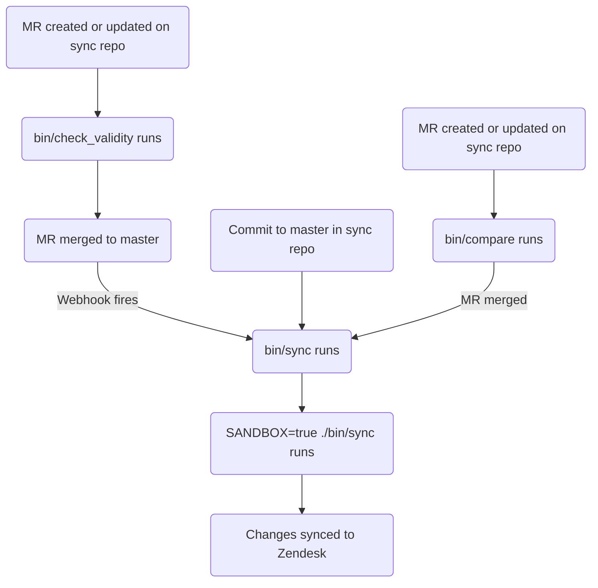

このガイドでは、GitLab における Zendesk 記事の作成、編集、管理方法について説明します。記事の管理に関する情報を探しているサポートエージェントは、[Global Knowledge Base](/handbook/support/knowledge-base/)を参照してください。管理者は[管理者タスク](#administrator-tasks)セクションを確認してください。

{}

- デプロイタイプ: `Ad-hoc`
- 同期リポジトリ
  - [Zendesk Global](https://gitlab.com/gitlab-support-readiness/zendesk-global/articles)
  - [Zendesk US Government](https://gitlab.com/gitlab-support-readiness/zendesk-us-government/articles)
- 管理対象コンテンツリポジトリ: [記事](https://gitlab.com/gitlab-com/support/articles)

{}

## 記事を理解する

### 記事とは

記事は、情報を含む Zendesk ナレッジセンター内のナレッジベース項目です。内容は大きく異なりますが、一般的にはトラブルシューティング情報、詳細なセットアップガイドなどです。

現在、主に Customer Support チームが作成および管理しています。

ナレッジセンターでは、3 層構造を使用します。

- **カテゴリー**（最上位レベル） - 主なトピック領域を整理します。詳細は[カテゴリーのページ](/handbook/eta/css/zendesk/knowledge-center/categories)を参照してください。
- **セクション**（中間レベル） - カテゴリーを関連するグループに細分化します。詳細は[セクションのページ](/handbook/eta/css/zendesk/knowledge-center/sections)を参照してください。
- **記事**（コンテンツレベル） - 個別のヘルプ記事です。このページで説明します。

### 配置とは

配置は、ナレッジセンター内で記事を表示するセクションを決定します。記事には複数の配置を設定でき、異なるセクションに同時に表示できます。

**重要:** 配置ごとに Zendesk 内に記事の複製が作成されます。記事は同じコンテンツを共有しますが、異なるセクションにある別々のオブジェクトとして存在します。1 つの配置を変更すると、その記事のすべての配置に影響します。

### 記事の管理方法

Zendesk では UI を介して記事を管理する完全な方法が提供されていますが、私たちはよりバージョン管理された方法論を採用しています。これにより、定められたレビューのプロセス、必要に応じたロールバックの実行などが可能になります。

このため、同期リポジトリと管理対象コンテンツリポジトリを使用します。

### 同期リポジトリの仕組み

同期リポジトリのワークフローは、次のプロセスに従います。

#### 管理対象コンテンツリポジトリ内

管理対象コンテンツリポジトリでマージリクエストを作成または更新すると、`bin/check_validity` スクリプトが CI/CD 経由で実行されます。このスクリプトでは、次を行います。

- 拡張子 `.md` で終わるすべてのファイルに対して、次を実行します。
  - ファイル名が `README.md` の場合、イテレーションをスキップします。
  - ファイルを front matter ファイルとしてオブジェクトに解析します。
    - front matter ファイルとして解析できない場合は、ファイル名とエラー文字列を変数に格納し、次のイテレーションに進みます。
  - オブジェクトにメタデータがあるかを確認します。
    - メタデータが含まれていない場合は、ファイル名とエラー文字列を変数に格納し、次のイテレーションに進みます。
  - 必須属性ごとに確認を行います（問題がある場合は、ファイル名とエラー文字列を変数に格納します）。
    - `title`
      - String であることを確認します。
    - `previous_title`
      - String であることを確認します。
    - `category`
      - String であることを確認します。
      - 許可されたカテゴリーであることを確認します。
        - カテゴリーの一覧は、[現在使用中のカテゴリー](/handbook/eta/css/zendesk/knowledge-center/categories#current-categories-in-use)を参照してください。
    - `section`
      - String であることを確認します。
      - 許可されたセクションであることを確認します。
        - セクションの一覧は、[現在使用中のセクション](/handbook/eta/css/zendesk/knowledge-center/sections#current-sections-in-use)を参照してください。
    - `author`
      - String であることを確認します。
    - `tags`
      - Array であることを確認します。
    - `labels`
      - Array であることを確認します。
    - `instances`
      - Array であることを確認します。
      - 許可されたインスタンスであることを確認します。
        - `Global`
        - `Global Sandbox`
        - `US Government`
        - `US Government Sandbox`
      - 少なくとも 1 つのインスタンスがリストされていることを確認します。
    - `public`
      - Boolean であることを確認します。
    - `convert_markdown`
      - Boolean であることを確認します。
  - タイトルを `titles` 変数に格納します（後で確認するためです）。
- `titles` 変数の内容を確認し、使用中の重複タイトルがないかを確認します。
  - 見つかった場合は、重複のリストを変数に格納します。
- `errors` 変数内の問題を確認します（前述のすべての確認で問題の格納に使用します）。
  - `errors` に値がある場合は、それらを出力して終了コード 1 で終了します。

マージリクエストがマージされる場合など、デフォルトブランチにコミットされると、2 つの [GitLab webhook](https://docs.gitlab.com/user/project/integrations/webhooks/) が実行され、同期リポジトリの CI/CD パイプラインがトリガーされます。

#### 同期リポジトリ内

{}

- 同期リポジトリのすべての CI/CD ジョブは、Support Team YAML files プロジェクトと管理対象コンテンツプロジェクトをクローンすることから始まります。
- 管理対象コンテンツリポジトリでマージリクエストを作成または更新すると、`bin/check_validity` スクリプトが CI/CD 経由で実行されます。これにより、マージを許可する前に記事のメタデータを検証し、同期リポジトリでより円滑な同期プロセスを実現します。検証内容の詳細は、[管理対象コンテンツリポジトリ内](#in-the-managed-content-repo)を参照してください。

{}

同期リポジトリでマージリクエストを作成または更新すると、`./bin/compare` スクリプトが実行されます（本番環境と Sandbox 環境の両方で実行されます）。このスクリプトでは、次を行います。

- すべての Zendesk 記事（およびその翻訳）のリストを取得します。
- すべての Zendesk カテゴリーのリストを取得します。
- すべての Zendesk セクションのリストを取得します。
- すべての Zendesk ブランドのリストを取得します。
- すべての Zendesk コンテンツタグのリストを取得します。
- すべての Zendesk 記事ラベルのリストを取得します。
- すべての Zendesk 権限グループのリストを取得します。
- 管理対象コンテンツリポジトリの拡張子 `.md` で終わるすべてのファイルに対して、次を実行します。
  - ファイル名が `README.md` の場合、イテレーションをスキップします。
  - ファイル名のパスに `/Templates/` が含まれる場合、イテレーションをスキップします。
  - ファイルを front matter ファイルとしてオブジェクトに解析します。
  - ファイルを分析して、次を決定します。
    - 使用する対応するコンテンツタグ
      - 存在しない場合は、作成オブジェクトを格納します。
    - タイトル更新が行われているかどうか
      - 管理対象コンテンツファイルの `title` 値と一致する `title` 属性を持つ既存の Zendesk 記事を検索します。
      - Zendesk 記事が存在しない場合は、管理対象コンテンツファイルの `previous_title` 値と一致する `title` 属性を持つ Zendesk 記事が存在するか再確認します。
        - 存在する場合は、タイトル更新が行われていることを格納します（後で見つける方法を把握するためです）。
    - 作成が必要かどうかを判断するため、記事ラベルをループします。
  - 後の比較で使用するリポジトリ記事オブジェクトを作成します。
- すべてのリポジトリ記事オブジェクトに対して、次を実行します。
  - 一致する Zendesk 記事を見つけます。
    - 存在しない場合は、作成オブジェクトを格納します。
  - リポジトリ記事オブジェクトのメタデータ値を Zendesk 記事のメタデータ値と比較します。
    - 差分が見つかった場合は、記事更新オブジェクトを格納します。
  - リポジトリ記事オブジェクトの翻訳を Zendesk 記事の翻訳と比較します。
    - 差分が見つかった場合は、翻訳更新オブジェクトを格納します。
- 次について報告します。
  - 必要なコンテンツタグの作成
  - 必要な記事ラベルの作成
  - 必要な記事の作成
  - 必要な記事の更新
  - 必要な翻訳の更新

{}

Sandbox 環境で `bin/sync` スクリプトをトリガーするため、マージリクエストの CI/CD パイプラインで手動ジョブを実行できます（これは任意ですが、検証目的で役立ちます）。

{}

管理対象コンテンツリポジトリからの [GitLab webhook](https://docs.gitlab.com/user/project/integrations/webhooks/) 経由で CI/CD パイプラインがトリガーされるか、マージリクエストがマージされる場合などデフォルトブランチにコミットされると、`bin/sync` スクリプトが実行されます。このスクリプトでは、次を行います。

- `bin/compare` スクリプトと同じタスクを実行します。
  - コンテンツタグを作成する必要性を格納する代わりに、[Zendesk API](https://developer.zendesk.com/api-reference/help_center/help-center-api/content_tags/#create-content-tag) 経由で作成します。
  - 実行の最後にレポートを出力しません。
- [Zendesk API](https://developer.zendesk.com/api-reference/help_center/help-center-api/article_labels/#create-label) を使用して、必要なラベルを作成します。
- [Zendesk API](https://developer.zendesk.com/api-reference/help_center/help-center-api/articles/#create-article) を使用して、必要な記事を作成します。
- [Zendesk API](https://developer.zendesk.com/api-reference/help_center/help-center-api/articles/#update-article) を使用して、必要なすべての記事のメタデータ値を更新します。
- [Zendesk API](https://developer.zendesk.com/api-reference/help_center/help-center-api/translations/#update-translation) を使用して、必要なすべての記事の翻訳を更新します。

### 記事の削除をリクエストする

記事の削除をリクエストするには、最初に記事の管理対象コンテンツファイルを変更する必要があります（記事が再作成されるのを防ぐためです）。

- 特定の Zendesk インスタンスから記事を削除する場合は、記事の管理対象コンテンツファイルを変更して、`instances` 属性から対応する Zendesk インスタンスを削除します。
- すべての Zendesk インスタンスから記事を削除する場合は、記事の管理対象コンテンツファイルを削除します。

その後、[機能リクエスト Issue](https://gitlab.com/gitlab-com/eta/css/issue-tracker/-/issues/new?description_template=Feature)を作成してください（Customer Support Systems チームによる手動対応が必要になるためです）。

### 記事から配置を削除するようリクエストする

記事から配置を削除するようリクエストするには、[機能リクエスト Issue](https://gitlab.com/gitlab-com/eta/css/issue-tracker/-/issues/new?description_template=Feature)を作成してください（Customer Support Systems チームによる手動対応が必要になるためです）。

## 管理者タスク

{}

- このセクション内のすべての項目には、Zendesk の `Administrator` レベルのアクセス権が必要です。

{}

### 記事を新しい場所へ移動する

{}

- これはドキュメント作成のみを目的としています。記事を新しいセクションへ移動する必要がある場合は、管理対象コンテンツファイルを通じて行う必要があります。

{}

記事を別の場所に移動するには、次のとおりです。

1. セクションを含むカテゴリーにアクセスします。
1. 記事が現在置かれているセクションの名前をクリックします。
1. 対象の記事を見つけ、記事の右にある縦に並んだ 3 つの点をクリックします。
1. `Move to` をクリックします。
1. 記事を移動する場所を選択します。
1. `Move` をクリックします。

### 記事から配置を削除する

{}

- これは恒久的な操作です。元に戻すことはできません。注意してください。
- これは、対応するリクエスト Issue（機能リクエスト）が存在する場合にのみ実行してください。存在しない場合は、まず作成し（作業する前に標準プロセスを通過させてください）。

{}

非常にまれに、記事から配置を削除するようリクエストされることがあります。次のように行います。

1. [ナレッジセンターにアクセスします](../knowledge-center/#accessing-the-knowledge-center)
1. 対象の記事を見つけてタイトルをクリックします（エディターを開くため）。
1. エディターの右側にある `Placements` パネルで、削除する配置を見つけます。
1. 縦に並んだ 3 つの点をクリックします。
1. `Delete` をクリックします。
1. 削除を確認するため、`Delete placement` をクリックします。

## 一般的な問題とトラブルシューティング

これは、必要に応じて項目が追加される生きたセクションです。

### マージ後に記事の変更が表示されない

同期の完全な実行には通常 5-10 分必要です。その後、ブラウザーで Zendesk をハードリフレッシュしてから、変更を確認してください。
