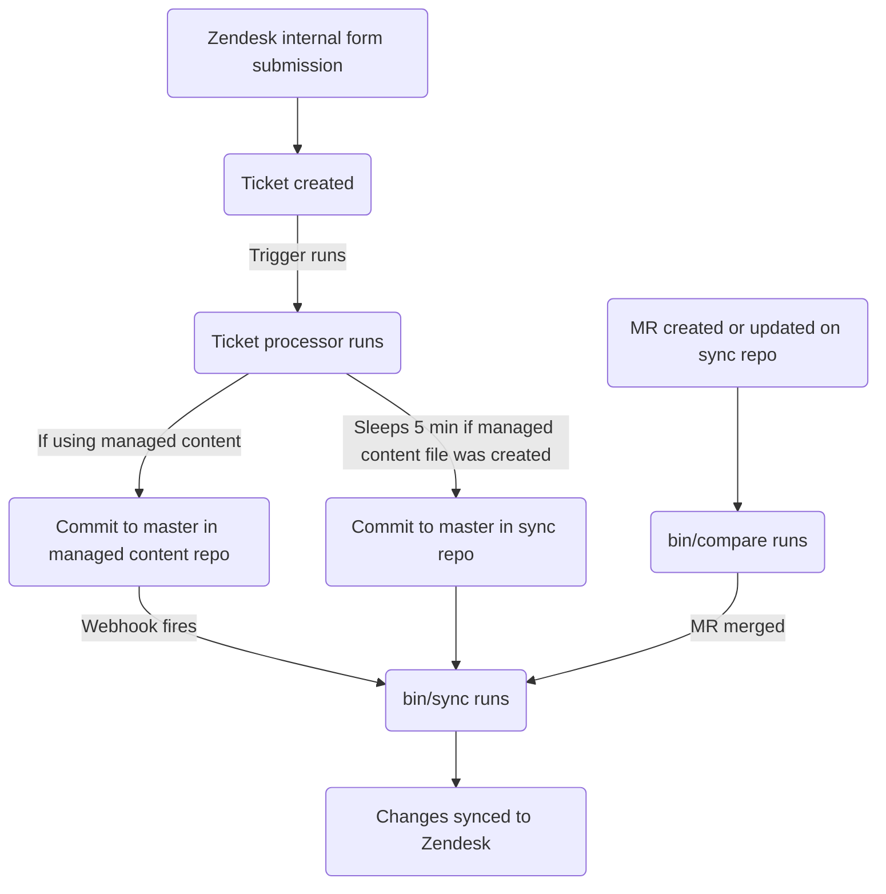

このガイドでは、GitLab で Zendesk マクロを作成、編集、管理する方法について説明します。単純なマクロを作成したいサポートエージェントは、[管理者以外としてマクロを作成する](#creating-a-macro-as-a-non-admin)を参照してください。管理者は、[管理者のタスク](#administrator-tasks)セクションを確認してください。

{}

- デプロイメントタイプ: `Ad-hoc`
- 同期リポジトリ
  - [Zendesk Global](https://gitlab.com/gitlab-support-readiness/zendesk-global/macros)
  - [Zendesk US Government](https://gitlab.com/gitlab-support-readiness/zendesk-us-government/macros)
- 管理対象コンテンツリポジトリ
  - [Zendesk Global](https://gitlab.com/gitlab-com/support/zendesk-global/macros)
  - [Zendesk US Government](https://gitlab.com/gitlab-com/support/zendesk-us-government/macros)

{}

## マクロを理解する

### マクロとは

[Zendesk](https://support.zendesk.com/hc/en-us/articles/4408844187034-Creating-macros-for-repetitive-ticket-responses-and-actions)によると:

> マクロとは、エージェントがチケットを作成または更新する際に手動で適用できる、あらかじめ用意された応答またはアクションです。マクロには、チケットのプロパティを更新できるアクションが含まれます。
>
> トリガーや自動化とは異なり、マクロには条件ではなくアクションのみが含まれます。マクロを適用すべきかどうかを判断するためにチケットを自動評価するものがないため、条件は使用しません。エージェントがチケットを評価し、必要に応じて手動でマクロを適用します。

### マクロの分類

Zendesk のマクロには分類がありますが、UI では明確に示されません。代わりに、分類はマクロ自体の名前に基づいて決まります。基本的に、単語の各グループがマクロのドロップダウンセレクター内の一種の「フォルダー」になります。Zendesk が現在使用している区切り文字はコロン 2 つ（`::`）です。

### 単純なマクロと高度なマクロ

単純なマクロとは、次の項目のみを変更するマクロです。

- チケットの割り当て（または割り当て解除）
- チケットへのタグの追加
- チケットへのパブリックまたはプライベートコメントの追加
- チケットのステータスの変更

マクロが上記以外の操作を行う場合、現時点では「高度な」マクロと見なされます。

### Zendesk でマクロを使用する

マクロをチケットに適用する方法は 2 つあります。

- スラッシュコマンド経由
- マクロ選択ドロップダウン経由

詳細については、[Zendesk のドキュメント](https://support.zendesk.com/hc/en-us/articles/4408887656602-Using-macros-to-update-tickets)を参照してください。

### マクロの管理方法

Zendesk では UI を通じたマクロ管理を完全に行えますが、私たちはよりバージョン管理された方法を採用しています。これにより、定められたレビュー手順、必要に応じたロールバックの実行機能などを得られます。

そのため、Zendesk 内部フォーム、同期リポジトリ、管理対象コンテンツリポジトリを利用します。

### 同期リポジトリの仕組み

同期リポジトリのワークフローは、次のプロセスに従います。



#### 人が読みやすい形式への置換

{}

- YAML ファイル経由でマクロを作成または編集する `administrators` にのみ適用されます。

{}

現在、同期リポジトリでは、さまざまな項目を人が読みやすい項目から「Zendesk」相当の項目へ置換できます。対象は次のとおりです。

| 人が読みやすい項目 | Zendesk フィールド項目 | アクションの場所 | 注記 |
|---------------------|--------------------|-----------------|-------|
| `'Brand: XXX'` | `brand_id` | `value` | `XXX` をブランドの `name` に置き換えます。 |
| `'Field: XXX'` | `custom_fields_xxx` | `field` | `XXX` をチケットフィールドの `title` に置き換えます。 |
| `'Group: XXX'` | `group_id` | `value` | `XXX` をグループの `name` に置き換えます。 |
| `'XXX'` | `role` | `value` | `XXX` をロールタイプの `name` または依頼者のメールアドレスに置き換えます。 |
| `'Form: XXX'` | `ticket_form_id` | `value` | `XXX` をチケットフォームの `name` に置き換えます。 |
| `'Schedule: XXX'` | `set_schedule` | `value` | `XXX` をスケジュールの `name` に置き換えます。 |
| `'Schedule: XXX'` | `schedule_id` | `value` | `XXX` をスケジュールの `name` に置き換えます。 |
| `'XXX'` | `organization_id` | `value` | `XXX` を組織の `salesforce_id` 属性に置き換えます。 |
| `'XXX'` | `assignee_id` | `value` | `XXX` をエージェントのメールアドレスに置き換えます。 |
| `'XXX'` | `satisfaction_reason_code` | `value` | `XXX` を満足理由の `name` に置き換えます。 |
| `'XXX'` | `via_id` | `value` | `XXX` を経由タイプの `name` に置き換えます。 |
| `'XXX'` | `requester_role` | `value` | `XXX` を依頼者ロールタイプの `name` に置き換えます。 |

たとえば、フィールド `Preferred Region for Support` の値を `AMER` に変更するマクロを作成する場合、次のようにして置換を使用します。

```yaml
- field: 'Field: Preferred Region for Support'
  value: 'AMER'
```

#### 同期リポジトリで MR を作成する場合

同期リポジトリで MR が作成されると、`bin/compare` スクリプトを介して比較アクションが実行され、次の処理を行います。

1. 管理対象コンテンツリポジトリのクローンを実行します。
1. Zendesk インスタンスからすべてのブランド、チケットフィールド、チケットフォーム、グループ、スケジュール、満足理由、マクロを取得します。
1. 同期リポジトリ内のすべての YAML ファイルを確認して、マクロオブジェクトを生成します。
   - また、同期リポジトリファイルに次の問題がないことを確認します。
     - タイトルが欠落している。
     - `active` 属性が `false` のファイルが `active` フォルダーにある。
     - `active` 属性が `true` のファイルが `inactive` フォルダーにある。
     - `title` 属性が重複して使用されている。
     - `contains_managed_content` 属性が `true` のファイルに一致する管理対象コンテンツファイルがある。
1. YAML ファイルからのすべてのマクロオブジェクトを、対応する Zendesk 項目と比較します（`title` および `previous_title` 属性の値を確認して判定します）。
   - 存在しない場合は、後で使用するために作成オブジェクトを変数に保存します。
   - 存在するが属性値が異なる場合は、後で使用するために更新オブジェクトを変数に保存します。
1. 比較レポートを出力します。

#### Zendesk への同期

同期リポジトリでは、次の 2 つのイベントのいずれかが発生した場合に同期タスクを実行します。

- 管理対象コンテンツリポジトリが[プロジェクト Webhook](https://docs.gitlab.com/user/project/integrations/webhooks/)を介してシグナルを送信する場合（管理対象コンテンツリポジトリの `master` ブランチでコミットが発生した場合に送信するよう設定されています）
- 同期リポジトリの `master` ブランチでコミットが発生した場合

いずれかのアクションが発生すると、同期は[比較アクション](#when-creating-mrs-in-the-sync-repo)を実行し、生成されたオブジェクトを使用して、必要な Zendesk エンドポイントに対するループにより必要な作成および更新を実行します。

- [作成](https://developer.zendesk.com/api-reference/ticketing/business-rules/macros/#create-macro)
- [更新](https://developer.zendesk.com/api-reference/ticketing/business-rules/macros/#update-macro)

#### 孤立した管理対象コンテンツファイルの報告

2 月、5 月、8 月、11 月の 1 日に、[スケジュール済みパイプライン](https://docs.gitlab.com/ci/pipelines/schedules/)により、同期リポジトリがサポートリーダーシップチーム向けにすべての孤立した管理対象コンテンツファイルを確認する Issue を作成します。

これは、同期リポジトリ内の `bin/find_orphaned_files` スクリプトにより行われ、次の処理を実行します。

1. 管理対象コンテンツリポジトリのクローンを実行します。
1. 管理対象コンテンツリポジトリの `active` および `inactive` フォルダー内のすべてのファイルを確認し、`state`（`active` または `inactive`）、`path`、`title` を判断します。
1. 同期リポジトリ自体の `active` および `inactive` フォルダー内のすべてのファイルを確認し、次の事項を判断します。
   - ファイルが管理対象コンテンツファイルを使用しているか。
   - 管理対象コンテンツファイルがあるか。
1. 同期リポジトリファイルがない管理対象コンテンツファイルを見つけた場合、Customer Support リーダーシップに報告する Issue を作成します。

## 管理者以外としてマクロを作成する

### 単純なマクロ

[単純なマクロ](#simple-vs-advanced-macros)を作成するには、インスタンス用の Zendesk 内部フォームを使用します。

- [Zendesk Global](https://gitlab-internal.zendesk.com/hc/en-us/requests/new?ticket_form_id=22784239213084&tf_22783439650716=custsuppops_ir_category_create_macro)
- [Zendesk US Government](https://gitlab-federal-internal.zendesk.com/hc/en-us/requests/new?ticket_form_id=41826926738708&tf_41825819758484=custsuppops_ir_category_create_macro)

フォームに入力してリクエストを送信すると、[チケットプロセッサー](/handbook/eta/css/zendesk/tickets/processor)が提供された情報を使用して、単純なマクロを作成します。

マクロに管理対象コンテンツファイルが必要で（つまり、マクロがコメントを作成し）、まだ存在しない場合は、管理対象コンテンツリポジトリ内にファイルが作成されます。

### 高度なマクロ

[高度なマクロ](#simple-vs-advanced-macros)を作成する場合は、まず [SIG チーム](https://gitlab.com/support-innovation-group)のメンバーに相談し、[このテンプレート](https://gitlab.com/gitlab-com/eta/css/issue-tracker/-/issues/new?issuable_template=Feature)を使用して Customer Support Systems チームに Issue を送信してもらってください（Customer Support Systems チームによる手動対応が必要になるためです）。

## 管理者以外としてマクロを編集する

### マクロ内で使用されるコメント文言を変更する

マクロ内のコメント文言を編集するには、管理対象コンテンツリポジトリ内の対応するファイルを変更します。`master` ブランチにマージされると、同期リポジトリを介して Zendesk インスタンスに同期されます。

### タイトル、制限、コメント以外の文言アクションなどを変更する

マクロ内のその他の項目を変更する場合は、まず [SIG チーム](https://gitlab.com/support-innovation-group)のメンバーに相談し、[このテンプレート](https://gitlab.com/gitlab-com/eta/css/issue-tracker/-/issues/new?issuable_template=Feature)を使用して Customer Support Systems チームに Issue を送信してもらってください（Customer Support Systems チームによる手動対応が必要になるためです）。

## 管理者以外としてマクロを無効化する

マクロの無効化を依頼するには、まず [SIG チーム](https://gitlab.com/support-innovation-group)のメンバーに相談し、[このテンプレート](https://gitlab.com/gitlab-com/eta/css/issue-tracker/-/issues/new?issuable_template=Feature)を使用して Customer Support Systems チームに Issue を送信してもらってください（Customer Support Systems チームによる手動対応が必要になるためです）。

## 管理者のタスク

{}

- このセクションのすべての項目には、Zendesk への `Administrator` レベルのアクセスが必要です。

{}

### マクロ使用状況の情報を確認する

マクロの使用状況を確認するには、次の手順を実行します。

1. Zendesk インスタンスの管理パネルに移動します。
1. `Workspaces > Agent tools > Macros` に移動します。
1. マクロリストの右端にあるアイコン（縦長の長方形が 3 つ並んだように見えます）をクリックします。
1. 表示する使用状況の列をクリックします。

### マクロを作成する

{}

- 対応するリクエスト Issue（Feature Request、Administrative、Bug など）が存在する場合にのみ実行してください。存在しない場合は、まず作成し（対応する前に標準プロセスを通過させます）。
- 管理対象コンテンツファイルを使用するマクロを作成する場合は、先にその管理対象コンテンツファイルを作成する必要があります。

{}

[単純なマクロ](#simple-vs-advanced-macros)を作成する場合は、[単純なマクロ](#simple-macros)を参照してください。

[高度なマクロ](#simple-vs-advanced-macros)を作成する場合は、同期リポジトリで MR を作成する必要があります。実際に行う変更は、リクエスト自体によって異なります。使用できる開始テンプレートは次のとおりです。

```yaml
---
title: 'Your::Title::Here'
previous_title: 'Your::Title::Here'
description: 'Your description here'
active: true
actions:
- field: 'the_action_to_perform'
  value: 'the_value_to_use'
restriction: null
contains_managed_content: false
```

ピアが MR をレビューして承認した後、MR をマージできます（変更は Zendesk インスタンスに同期されます）。

### マクロを編集する

{}

- 対応するリクエスト Issue（Feature Request、Administrative、Bug など）が存在する場合にのみ実行してください。存在しない場合は、まず作成し（対応する前に標準プロセスを通過させます）。
- マクロの `contains_managed_content` 属性を `false` から `true` に変更する場合は、先にその管理対象コンテンツファイルを作成する必要があります。
- マクロの `contains_managed_content` 属性を `true` から `false` に変更する場合は、対応する管理対象コンテンツファイルを削除するフォローアップ MR を作成してください。

{}

マクロのコメント文言のみを変更する場合は、[マクロ内で使用されるコメント文言を変更する](#changing-the-comment-wording-used-in-a-macro)を参照してください。

それ以外の場合は、同期リポジトリで MR を作成する必要があります。実際に行う変更は、リクエスト自体によって異なります。

ピアが MR をレビューして承認した後、MR をマージできます（変更は Zendesk インスタンスに同期されます）。

#### マクロのタイトルを変更する

マクロのタイトルを変更する必要がある場合は、現在の値を `previous_title` 属性にコピーしてから、`title` 属性を変更します。これにより、同期は更新対象のマクロを引き続き見つけられます。

### マクロを無効化する

{}

- 対応するリクエスト Issue（Feature Request、Administrative、Bug など）が存在する場合にのみ実行してください。存在しない場合は、まず作成し（対応する前に標準プロセスを通過させます）。
- マクロが管理対象コンテンツファイルを使用していた場合（つまり、YAML ファイル内の `contains_managed_content` 属性が以前は `true` に設定されていた場合）、管理対象コンテンツリポジトリ内の対応するファイルも `active` から `inactive` の場所に移動する必要がある可能性があります。

{}

マクロを無効化するには、同期リポジトリで MR を作成する必要があります。この MR では、対応するマクロの YAML ファイルに対して次の操作を行います。

1. ファイルを `active` から `inactive` のパスに移動します。
1. `active` 属性の値を `false` に変更します。
1. `actions` の値を次のように変更します。
   - Zendesk Global の場合:

     ```yaml
     - field: 'brand_id'
       value: 'GitLab Support'
     ```

   - Zendesk US Government の場合:

     ```yaml
     - field: 'brand_id'
       value: 'GitLab'
     ```

1. `contains_managed_content` 属性の値を `false` に変更します。

ピアが MR をレビューして承認した後、MR をマージできます（変更は Zendesk インスタンスに同期されます）。

### マクロを削除する

{}

- マクロは無効化されている場合にのみ削除できます。
- 対応するリクエスト Issue（Feature Request、Administrative、Bug など）が存在する場合にのみ実行してください。存在しない場合は、まず作成し（対応する前に標準プロセスを通過させます）。
- マクロを削除する場合は、同期リポジトリおよび管理対象コンテンツリポジトリからもファイルを削除する必要がある可能性があります。

{}

同期リポジトリでは削除が実行されないため、Zendesk 自体でこの操作を行う必要があります。

マクロを削除するには、次の手順を実行します。

1. Zendesk インスタンスの管理ダッシュボードに移動します。
   - [Zendesk Global (production)](https://gitlab.zendesk.com/admin/home)
   - [Zendesk Global (sandbox)](https://gitlab1707170878.zendesk.com/admin/home)
   - [Zendesk US Government (production)](https://gitlab-federal-support.zendesk.com/admin/home)
   - [Zendesk US Government (sandbox)](https://gitlabfederalsupport1585318082.zendesk.com/admin/home)
1. `Workspaces > Agent tools > Macros` に移動します。
   - [Zendesk Global](https://gitlab.zendesk.com/admin/workspaces/agent-workspace/macros)
   - [Zendesk Global (sandbox)](https://gitlab1707170878.zendesk.com/admin/workspaces/agent-workspace/macros)
   - [Zendesk US Government](https://gitlab-federal-support.zendesk.com/admin/workspaces/agent-workspace/macros)
   - [Zendesk US Government (sandbox)](https://gitlabfederalsupport1585318082.zendesk.com/admin/workspaces/agent-workspace/macros)
1. 削除するマクロを見つけて名前をクリックします。
1. `Actions` ボタンをクリックします。
1. `Delete` をクリックします。
1. 確認ボックスで `Delete macro` をクリックします。

## よくある問題とトラブルシューティング

### マージ後にマクロの変更が表示されない

同期が完全に実行されるまで通常 5 〜 10 分かかります。その後、ブラウザで Zendesk をハードリフレッシュしてから、変更を確認してください。
