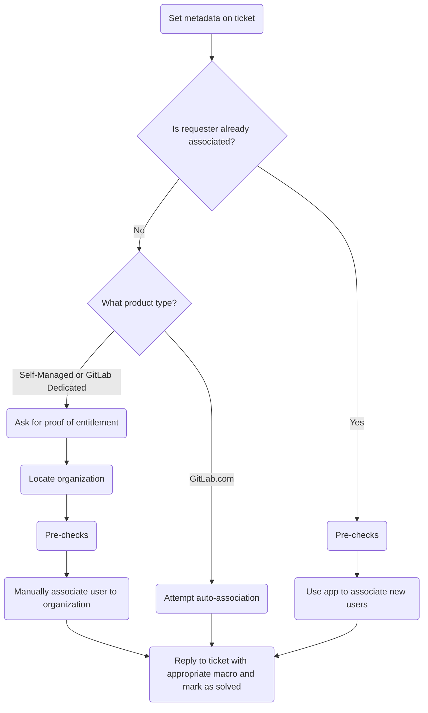

このガイドでは、GitLab で組織の関連付けを行う方法を説明します。

{}

- デプロイタイプ: `Ad-hoc`
- **注記**: このページは Zendesk Global にのみ適用されます。Zendesk US Government の組織の関連付けは、[Zendesk-Salesforce sync](/handbook/eta/css/zendesk-salesforce-sync/)を通じて行われるためです
- **注記**: ユーザー自身の関連付けが必要であると同時に、他のユーザーの関連付けを求められることがよくあります。まずリクエスターに集中してください（そうすると他のユーザーの追加が簡単になります）。

{}

## 組織の関連付けを理解する

### 組織の関連付けとは

組織の関連付けとは、Zendesk ユーザーを組織に結び付けるプロセスです。

## 関連付けのプロセス

非常に一般化したプロセスは次のようになります。



### ステップ 1: チケットにメタデータを設定する

続行する前に、チケットのメタデータが入力され、適切に設定されていることを確認する必要があります。通常のフォーム送信でほとんどのメタデータはカバーされます。そのため、特に注目すべきなのはチケットフィールド `Support Ops Problem Type` です（これを `Manage my organization's contacts` に設定する必要があります）。

入力後、チケットに更新を送信して保存されていることを確認します。

これを行ったら、[ステップ 2](#step-2-check-if-pre-authorized)に進みます

### ステップ 2: 事前承認済みか確認する

ユーザーがすでに組織に関連付けられている場合、そのユーザーは組織のサポート連絡先を管理するための事前承認を受けている可能性があります。そのため、このプロセスははるかに簡単です。

1. [事前チェック](#pre-checks)を実行します
1. 組織に追加するメールアドレスのリストを、カンマ区切りで収集します
   - 例: `alice@example.com, bob@example.com, charlie@example.com`
1. Support Ops Super App を開きます
1. `Associate User` をクリックします
1. メールアドレスのリストを入力ボックスに入力します
1. `Associate` ボタンをクリックします
1. アプリの出力で成功を確認します
1. 変更が完了したことを顧客に返信して確認します（チケットのステータスを `Solved` に設定してください）

まだ関連付けられていない場合は、[ステップ 3](#step-3-determine-product-type)に進みます

### ステップ 3: プロダクトタイプを判別する

ここからの手順はプロダクトタイプによって異なるため、プロダクトタイプを把握する必要があります。ユーザーがすでに必要な情報を提供している場合は、それを使用して次に実行する手順を判別します。

- プロダクトタイプが GitLab.com の場合は、[ステップ 4](#step-4-attempt-auto-association)に進みます
- プロダクトタイプが Self-Managed または GitLab Dedicated の場合は、[ステップ 5](#step-5-ask-for-entitlement-information)に進みます

情報を提供していない場合は、ユーザーに利用資格の証明を求める返信をチケットに送ります。

### ステップ 4: 自動関連付けを試行する

**注記**: アプリは[事前チェック](#pre-checks)を自動的に実行します。

GitLab.com サブスクリプションを購入した組織の場合、プロセスははるかに簡単です。

1. Support Ops Super App を開きます
1. `Attempt Association` をクリックします
1. `Attempt auto-association` ボタンをクリックします

これにより、ユーザーを自動関連付けできるかを確認するための各種チェックが実行されます。結果はアプリに表示されます。

関連付けられた場合は、変更が完了したことを顧客に返信して確認します（チケットのステータスを `Solved` に設定してください）。

関連付けに失敗した場合は、それがアプリの問題か、利用資格チェックに失敗したのかを判断します。

- アプリの問題については、[一般的な問題とトラブルシューティング](#common-issues-and-troubleshooting)を参照してください。
- 利用資格チェックに失敗した場合は、最上位の有料名前空間のオーナーではないことを示すマクロで返信を送信します。

### ステップ 5: 利用資格情報を求める

**注記**: 対象のユーザーは _会社_ のメールアドレスを使用している必要があります。Gmail、Yahoo などの一般的なメールアドレスを使用している場合は、続行できません。

次に、利用資格情報を求める必要があります。Self-Managed および GitLab Dedicated のユーザーについては、これはさまざまな方法で提供される可能性があります。

- リクエスターがサブスクリプションのライセンス ID を提供する
- リクエスターがサブスクリプションのクラウドアクティベーションコードを提供する
- リクエスターがサブスクリプションの生のライセンスファイルを提供する
- リクエスターがライセンス使用量エクスポート CSV ファイルを提供する

提供されるものによって、次の手順が決まります。

- ライセンス ID の場合は、[ステップ 6](#step-6-locate-the-license-from-an-id)に進みます
- クラウドアクティベーションコードの場合は、[ステップ 7](#step-7-locate-the-cloud-activation)に進みます
- 生のライセンスファイルの場合は、[ステップ 8](#step-8-locate-the-license-from-the-key)に進みます
- ライセンス使用量エクスポート CSV ファイルの場合は、ファイルを開いてライセンスキーの値を取得します。その後、[ステップ 8](#step-8-locate-the-license-from-the-key)に進みます

### ステップ 6: ID からライセンスを特定する

ID からライセンスを特定するには、次のようにします。

1. Okta 経由で [Customers portal 管理パネル](https://customers.gitlab.com/admin)にログインします
1. [Licenses ページ](https://customers.gitlab.com/admin/license)に移動します
1. URL の末尾に `/xxxx` を追加します（`xxxx` はライセンス ID に置き換えます）

現在表示しているライセンスの URL をメモします（後でメモに必要になります）。

**注記**: クラウドアクティベーションがトライアルであると表示されている場合（`Trial` の値が `Yes`）、有効なクラウドアクティベーションではありません（ユーザーは利用資格チェックに失敗しています）。この場合は、トライアルであり、有効な有料サブスクリプションではないことをユーザーに伝えます。

このページから `Zuora subscription name` の値を取得し、[ステップ 9](#step-9-locate-the-order)に進みます。

### ステップ 7: クラウドアクティベーションを特定する

クラウドアクティベーションを特定するには、次のようにします。

1. Okta 経由で [Customers portal 管理パネル](https://customers.gitlab.com/admin)にログインします
1. URL を `https://customers.gitlab.com/admin/cloud_activation?query=XXXX` に変更します（`XXXX` はクラウドアクティベーションコードに置き換えます）
1. 見つかったクラウドアクティベーションの表示ボタンをクリックします（円内の `i` のように見えます）

現在表示しているクラウドアクティベーションの URL をメモします（後でメモに必要になります）。

**注記**: クラウドアクティベーションがトライアルであると表示されている場合（`Trial` の値が `Yes`）、有効なクラウドアクティベーションではありません（ユーザーは利用資格チェックに失敗しています）。この場合は、トライアルであり、有効な有料サブスクリプションではないことをユーザーに伝えます。

このページから `Subscription name` の値を取得し、[ステップ 9](#step-9-locate-the-order)に進みます。

### ステップ 8: キーからライセンスを特定する

キーからライセンスを特定するには、次のようにします。

1. Okta 経由で [Customers portal 管理パネル](https://customers.gitlab.com/admin)にログインします
1. [Licenses ページ](https://customers.gitlab.com/admin/license)に移動します
1. `Validate License` をクリックします
1. キーをテキストエリアに貼り付けます
1. `Validate` ボタンをクリックします

このページからオブジェクトの `id` 属性の値をコピーし、[ステップ 6](#step-6-locate-the-license-from-an-id)に進みます。

### ステップ 9: 注文を特定する

注文を特定するには（サブスクリプション名から）、次のようにします。

1. Okta 経由で [Customers portal 管理パネル](https://customers.gitlab.com/admin)にログインします
1. [Orders ページ](https://customers.gitlab.com/admin/order)に移動します
1. ページ右上の `Add filter` をクリックします
1. `Subscription name` をクリックします
1. `Subscription name` ボタンの右側のドロップダウンを `Contains` に変更します
1. サブスクリプション名（前の手順でコピーしたもの）を入力ボックスに入力します
1. キーボードの `Enter` または `Return` を押します
1. 見つかった注文の表示ボタンをクリックします（円内の `i` のように見えます）

現在表示している注文の URL をメモします（後でメモに必要になります）。

このページで `Billing account` までスクロールし、リンクをクリックして、[ステップ 10](#step-10-get-billing-account-information)に進みます。

### ステップ 10: 請求アカウント情報を取得する

現在表示している請求アカウントの URL をメモします（後でメモに必要になります）。

次の値をコピーします。

- `Salesforce account`
- `Sold to`

この時点で、[ステップ 11](#step-11-locate-the-organization)に進むために必要な情報をすべて取得しています。

### ステップ 11: 組織を特定する

ここでは、`Salesforce account` の値を使用して組織を特定する必要があります。この値からの特定方法は、値の文字数によって異なります。

- 15 文字の値の場合は、`sfdc_short_id:xxx` で Zendesk 検索を実行します（`xxx` は値に置き換えます）
- 18 文字の値の場合は、`salesforce_id:xxx` で Zendesk 検索を実行します（`xxx` は値に置き換えます）

特定した組織の URL をメモします（後でメモに必要になります）。その後、[ステップ 12](#step-12-validate-information)に進みます。

**注記** 組織が見つからない場合は、[組織が見つからない](#no-organization-found)を参照してください。

### ステップ 12: 情報を検証する

ここでは、収集したすべての情報を確認し、ユーザーが利用資格チェックに合格しているかを判断する必要があります。確認すべき主な項目は次のとおりです。

- ライセンスまたはクラウドアクティベーションはトライアルでしたか？
  - ライセンスまたはクラウドアクティベーションがトライアルであった場合、利用資格チェックには合格していません。
- 請求アカウントの `Sold to` 値は、ユーザーがチケットを作成した際に提供した情報と一致していますか？
  - 一致しない場合、利用資格チェックには合格していません。

調査結果と収集したすべての情報をまとめた内部メモを追加します。次のようになります。

<details>
<summary>ライセンスを使用する場合</summary>

```plaintext
- License: LINK_TO_LICENSE
- Order: LINK_TO_ORDER
- Billing account: LINK_TO_BILLING_ACCOUNT
- Sold-to: SOLD_TO_EMAIL
- Salesforce ID: SALESFORCE_ACCOUNT_ID
- Organization: LINK_TO_ORGANIZATION
```

</details>
<details>
<summary>クラウドアクティベーションを使用する場合</summary>

```plaintext
- Cloud activation: LINK_TO_CLOUD_ACTIVATION
- Order: LINK_TO_ORDER
- Billing account: LINK_TO_BILLING_ACCOUNT
- Sold-to: SOLD_TO_EMAIL
- Salesforce ID: SALESFORCE_ACCOUNT_ID
- Organization: LINK_TO_ORGANIZATION
```

</details>

ここからの進め方は、ユーザーが利用資格チェックに合格したかどうかによって異なります。

- 利用資格チェックに失敗した場合は、内部コメントに検証に失敗した理由が含まれていることを確認し、メモを投稿して、ユーザーに応じた返信をします。
- 利用資格チェックに合格した場合は、内部メモを追加し、[ステップ 13](#step-13-manually-associate-the-user)に進みます。

### ステップ 13: ユーザーを手動で関連付ける

ここまで完了したら、ユーザーを関連付ける必要があります。これを行うには、次のようにします。

- 組織の名前をコピーします
- Zendesk でユーザーのページに移動します
- `Organization` 領域に値を貼り付けます
- 表示される候補から、組織に一致する名前をクリックします

これを行った後、変更が完了したことを顧客に返信して確認します（チケットのステータスを `Solved` に設定してください）

## 関連付けられたユーザーを削除する

関連付けられたユーザーが、他の関連付けられたユーザーの削除を求めた場合は、Zendesk で手動で実行する必要があります。これを行うには、次のようにします。

1. 削除する対象のユーザーに移動します
1. ユーザーの `Notes` 属性に次の内容を追加します。

   > LINK に従って関連付けを解除しました

   - `LINK` を、作業中のチケットリンクに置き換えます
1. `Organization` の下にある値をクリックします
1. ハイフン（`-` など）を入力します
1. 空白の値をクリックします（`-` のように表示されます）

これを行った後、変更が完了したことを顧客に返信して確認します（チケットのステータスを `Solved` に設定してください）

## 事前チェック

ユーザーを組織に関連付ける前に、常に次の項目を確認してください。

- ユーザーを組織に関連付けても、組織がサポート連絡先の上限である 30 件を超えない
- 組織のメモまたは詳細に、リクエストを続行すべきではないことを示す内容がない

これらのチェックのいずれかに失敗した場合は、続行できません。チェックに失敗した場合の対処については、[一般的な問題とトラブルシューティング](#common-issues-and-troubleshooting)を参照してください。

## 一般的な問題とトラブルシューティング

これは必要に応じて項目が追加される継続的なセクションです。

### 自動関連付けの試行アプリが組織を特定できない

Attempt Association アプリが正しい Salesforce アカウントまたは組織を特定できなかった場合は、手動で特定する必要があります。

これを行うには、次のようにします。

1. `GitLab Super App` に移動します
1. `User Lookup` をクリックします
1. `Search` ボタンをクリックします
1. `Group memberships` の下にある出力を確認します
1. オーナーである最上位の有料名前空間を特定してコピーします
1. `Support Ops Super App` に移動します
1. `Namespace Lookup` をクリックします
1. 入力フィールドに名前空間を貼り付けます
1. `Search` ボタンをクリックします
1. 出力を確認して、正しい Salesforce アカウントを特定します（`Salesforce info` の下）
1. `salesforce_id:xxx` で Zendesk 検索を実行します（`xxx` は値に置き換えます）
1. 見つかった組織を使用して、[ユーザーを手動で関連付ける](#step-13-manually-associate-the-user)を実行します

上記のいずれかが失敗した場合は、状況を示す内部メモを作成し、レビューのためにチケットを Customer Support Systems, Fullstack Engineer に割り当てます。

### 関連付けにより組織が 30 件の連絡先上限を超える

組織にさらにユーザーを追加すると 30 件の連絡先上限を超える場合は、問題を説明してユーザーに返信する必要があります。現在関連付けられているユーザーのリストを含め、ユーザーが確認できるようにしてください。

顧客から問題を修正するためにどの変更を行うべきか返信があったら、プロセスで通常行う手順に従って進めます。

### 組織のメモまたは詳細に続行しないよう記載されている

これはケースごとに異なります。不明な場合は、状況を示す内部メモを作成し、レビューのためにチケットを Customer Support Systems, Fullstack Engineer に割り当てます。

### 組織が見つからない

Salesforce アカウントは見つかったものの組織が見つからない場合、GitLab が使用する同期メカニズムのいずれかで問題が発生している可能性があります。

- Salesforce アカウントにサブスクリプションがない場合（またはサブスクリプションにプロダクト料金がない場合）、Zuora<>Salesforce sync で問題が発生している可能性があります。強制再同期で修正できる場合があります。これを行うには、次のようにします。
  1. Salesforce の Billing Account に移動します
  1. ページ右上の下向きの山形をクリックします（Edit および Clone ボタンの右側）
  1. Sync Data from ZBilling をクリックします
  1. 数分待ってから、Salesforce Account のサブスクリプションを再確認します
     - すべて修正されているように見える場合は、ZD<>SFDC sync が組織を作成するまで 1-2 時間待つ必要があります。待機中に、発生した内容についての内部メモを追加し、自分自身に割り当ててから、1-2 時間後にチケットを再確認します。
     - すべて修正されていないように見える場合は、以下の `For anything else` の箇条書きを使用します
- その他の場合は、状況を示す内部メモを作成し、レビューのためにチケットを Customer Support Systems, Fullstack Engineer に割り当てます
