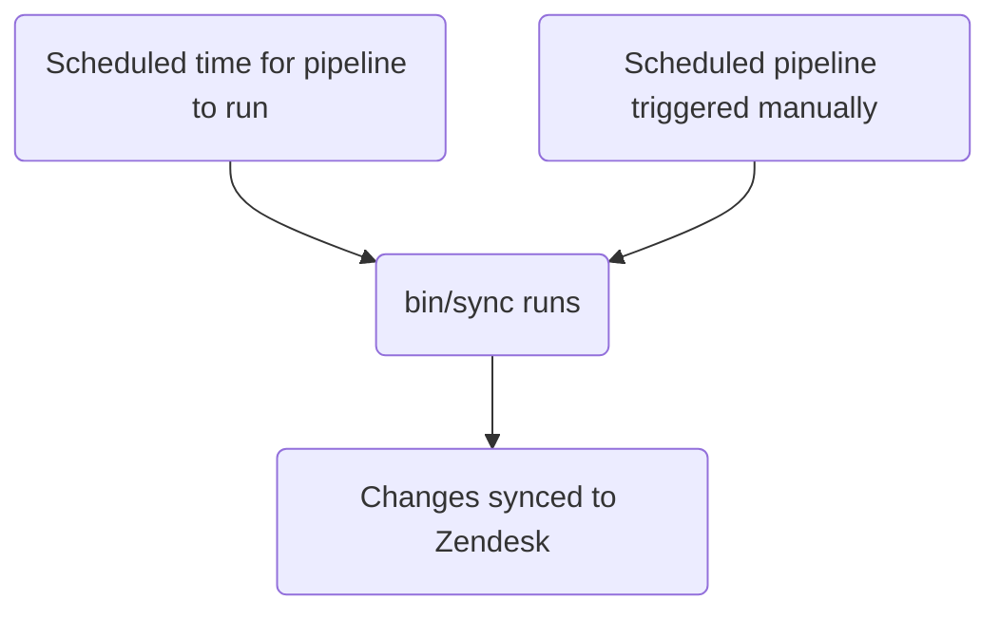

このガイドでは、GitLab における Zendesk チケットフィールドを作成、編集、管理する方法について説明します。管理者は[管理者タスク](#administrator-tasks)セクションを確認してください。

{}

- デプロイタイプ: `Standard`
- 同期リポジトリ
  - [Zendesk Global](https://gitlab.com/gitlab-support-readiness/zendesk-global/tickets/forms-and-fields)
  - [Zendesk US Government](https://gitlab.com/gitlab-support-readiness/zendesk-us-government/tickets/forms-and-fields)
- `CustSuppOps Zendesk Test Suite Generator` が有効

{}
{}

- これは、特に同じ同期リポジトリで実行されるため、[チケットフォーム](/handbook/eta/css/zendesk/tickets/forms)と**非常に**密接に関連しています
- これは、Zendesk Global の[動的コンテンツ](/handbook/eta/css/zendesk/dynamic-content/)と**非常に**密接に関連しています

{}

## チケットフィールドを理解する

### チケットフィールドとは

チケットフィールドは、チケットフォームを構成する個々のコンポーネントです。特定の情報を求めるようにカスタマイズでき、チケットのメタデータの生成に役立ちます。

[Zendesk](https://support.zendesk.com/hc/en-us/articles/4408886739098-About-ticket-fields)によると、チケットフィールドには次の 2 種類があります:

> - 標準チケットフィールド: エージェントがチケットで確認する定義済みのフィールドです。チケット共有など、追加の Zendesk Support 機能を有効化すると、追加の標準フィールドがチケットページに追加されます。一部（すべてではない）の標準フィールドは非アクティブ化および再アクティブ化できます。
標準チケットフィールドの[完全な一覧](https://support.zendesk.com/hc/en-us/articles/4408886739098-About-ticket-fields#topic_drw_ft1_3nb)を参照してください。
> - カスタムチケットフィールド: サポートをリクエストする人物から追加情報を収集するために、標準チケットフィールドに加えて作成されます。たとえば、プロダクト名またはモデル番号を選択するよう求めるカスタムフィールドを追加できます。
カスタムチケットフィールドタイプの[完全な一覧](https://support.zendesk.com/hc/en-us/articles/4408838961562)を参照してください。

### チケットフィールドの管理方法

Zendesk は UI を通じてチケットフィールドを完全に管理する方法を提供していますが、私たちはよりバージョン管理されたメソドロジーを採用しています。これにより、定められたレビュープロセス、必要に応じたロールバックの実行などが可能になります。

このため、同期リポジトリを使用しています。

### 同期リポジトリの仕組み

同期リポジトリのワークフローは次のプロセスに従います:



### チケットフィールドの種類

GitLab で最もよく使用する種類は次のとおりです:

| 名前 | API タイプ値 | 目的 | 使用例 |
|------|----------------|---------|------------------|
| チェックボックス | `checkbox` | 単一の true/false オプション | 「BPO Ticket」 |
| 日付 | `date` | 日付選択用 | 「期限日」 |
| 小数 | `decimal` | 小数を使用する数値用 | 「関連する ARR」 |
| ドロップダウン | `tagger` | 1 つの選択を許可するドロップダウン用 | 「プロダクトカテゴリ」 |
| 複数行 | `textarea` | 複数行が必要な自由形式フィールド用 | 「トラブルシューティングメモ」 |
| 複数選択 | `multiselect` | 複数選択を許可するドロップダウン用 | 「影響を受ける領域」 |
| 数値 | `integer` | 小数を使用しない数値用 | 「GitLab.com ユーザー ID」 |
| 正規表現 | `regexp` | Regex 検証が必要なテキスト形式フィールド用 | 「Salesforce アカウント ID」 |
| テキスト | `text` | 自由形式フィールド用 | 「GitLab Issue リンク」 |

完全な一覧については、[Zendesk のドキュメント](https://support.zendesk.com/hc/en-us/articles/4408838961562-About-custom-fields-and-custom-field-types)を参照してください

#### チケットフィールドオプションに関する注記

`Drop-down` および `Multi-select` フィールドタイプでは、フィールドにカスタムオプションが存在します。

カスタムオプションを持つチケットフィールドでは、区切り文字として `::` を使用し、オプションをまとめて「グループ化」または「スコープ化」できます。

たとえば、次のオプションがあるとします:

- Red
- Blue
- Mars
- Venus

関連する項目（Colors と Planets）をグループ化するには、次のようにします:

- `Colors::Red`
- `Colors::Blue`
- `Planets::Mars`
- `Planets::Venus`

これにより、最初に 2 つのオプション（`Colors` と `Planets`）を表示するドロップダウンが生成されます。いずれかのオプションをクリックすると、そのグループのオプションが表示され、選択できるようになります。

**グループ化前:**

- Red
- Blue
- Mars
- Venus

**グループ化後:**

- Colors ▼
  - Red
  - Blue
- Planets ▼
  - Mars
  - Venus

## 管理者以外としてチケットフィールドを作成する

チケットフィールドを作成するには、[機能リクエスト Issue](https://gitlab.com/gitlab-com/eta/css/issue-tracker/-/issues/new?description_template=Feature)を作成してください（Customer Support Systems チームによる手動介入が必要になるためです）。

## 管理者以外としてチケットフィールドを編集する

チケットフィールドを変更するには、[機能リクエスト Issue](https://gitlab.com/gitlab-com/eta/css/issue-tracker/-/issues/new?description_template=Feature)を作成してください（Customer Support Systems チームによる手動介入が必要になるためです）。

## 管理者以外としてチケットフィールドを非アクティブ化する

チケットフィールドの非アクティブ化をリクエストするには、[機能リクエスト Issue](https://gitlab.com/gitlab-com/eta/css/issue-tracker/-/issues/new?description_template=Feature)を作成してください（Customer Support Systems チームによる手動介入が必要になるためです）。

## 管理者タスク

{}

- このセクションのすべての項目には、Zendesk の `Administrator` レベルのアクセス権が必要です。

{}

### チケットフィールドを表示する

Zendesk でチケットフィールドを表示するには:

1. Zendesk インスタンスの管理パネルに移動します
   - [Zendesk Global（本番環境）](https://gitlab.zendesk.com/admin/home)
   - [Zendesk Global（サンドボックス）](https://gitlab1707170878.zendesk.com/admin/home)
   - [Zendesk US Government（本番環境）](https://gitlab-federal-support.zendesk.com/admin/home)
   - [Zendesk US Government（サンドボックス）](https://gitlabfederalsupport1585318082.zendesk.com/admin/home)
1. `Objects and rules > Tickets > Fields` に移動します
   - [Zendesk Global](https://gitlab.zendesk.com/admin/objects-rules/tickets/ticket-fields)
   - [Zendesk Global（サンドボックス）](https://gitlab1707170878.zendesk.com/admin/objects-rules/tickets/ticket-fields)
   - [Zendesk US Government](https://gitlab-federal-support.zendesk.com/admin/objects-rules/tickets/ticket-fields)
   - [Zendesk US Government（サンドボックス）](https://gitlabfederalsupport1585318082.zendesk.com/admin/objects-rules/tickets/ticket-fields)

注記: 非アクティブなユーザーフィールドを表示する場合は、`Filter` ボタンをクリックしてアクティブなフィルターを変更する必要がある場合があります

### チケットフィールドを作成する

{}

- これは、対応するリクエスト Issue（機能リクエスト、管理、バグなど）がある場合にのみ実行してください。存在しない場合は、まず作成し、作業を開始する前に標準プロセスを経る必要があります。

{}

チケットフィールドを作成するには、同期リポジトリで MR を作成する必要があります。正確な変更内容はリクエスト自体によって異なります。正確なコンテンツはチケットフィールドの種類によって異なる場合があります。

**注記:** 一般的なフィールドタイプのテンプレートを表示します。その他のタイプ（date、decimal、textarea、multiselect、regexp）では、`type` 属性を適宜変更し、タイプ固有の要件について[Zendesk フィールドのドキュメント](https://support.zendesk.com/hc/en-us/articles/4408838961562-About-custom-fields-and-custom-field-types)を参照してください。

**ヒント:** 下の各フィールドタイプをクリックすると、テンプレートが表示されます。

<details>
<summary>checkbox</summary>

```yaml
---
title: 'Your Title Here'
previous_title: 'Your Title Here'
title_in_portal: 'Title shown to customers'
raw_title_in_portal: 'Title shown to customers' # Dynamic content placeholder can be used here
description: 'Your description for end-users here'
raw_description: 'Your description for end-users here' # Dynamic content placeholder can be used here
agent_description: 'Your description for agents here'
active: true
type: 'checkbox'
position: 9999 # Standard position value for all custom fields
required: true # If true, agents must enter a value in the field to change the ticket status to solved
regexp_for_validation: null # Always null unless "regexp"
collapsed_for_agents: false # If true, the field is shown to agents by default. If false, the field is hidden alongside infrequently used fields. Classic interface only
visible_in_portal: true # Whether this field is visible to end users in Help Center
editable_in_portal: true # Whether this field is editable by end users in Help Center
required_in_portal: true # If true, end users must enter a value in the field to create the request
tag: 'tag_to_add_when_checked' # Added onto the user when the checkbox is checked
removable: true # Always true unless a system field
custom_field_options: null # Always null unless "dropdown" or "multiselect"
```

</details>
<details>
<summary>text</summary>

```yaml
---
title: 'Your Title Here'
previous_title: 'Your Title Here'
title_in_portal: 'Title shown to customers'
raw_title_in_portal: 'Title shown to customers' # Dynamic content placeholder can be used here
description: 'Your description for end-users here'
raw_description: 'Your description for end-users here' # Dynamic content placeholder can be used here
agent_description: 'Your description for agents here'
active: true
type: 'text'
position: 9999 # Standard position value for all custom fields
required: true # If true, agents must enter a value in the field to change the ticket status to solved
regexp_for_validation: null # Always null unless "regexp"
collapsed_for_agents: false # If true, the field is shown to agents by default. If false, the field is hidden alongside infrequently used fields. Classic interface only
visible_in_portal: true # Whether this field is visible to end users in Help Center
editable_in_portal: true # Whether this field is editable by end users in Help Center
required_in_portal: true # If true, end users must enter a value in the field to create the request
tag: null # Added onto the user when the checkbox is checked, use null when not a checkbox
removable: true # Always true unless a system field
custom_field_options: null # Always null unless "dropdown" or "multiselect"
```

</details>
<details>
<summary>integer</summary>

```yaml
---
title: 'Your Title Here'
previous_title: 'Your Title Here'
title_in_portal: 'Title shown to customers'
raw_title_in_portal: 'Title shown to customers' # Dynamic content placeholder can be used here
description: 'Your description for end-users here'
raw_description: 'Your description for end-users here' # Dynamic content placeholder can be used here
agent_description: 'Your description for agents here'
active: true
type: 'integer'
position: 9999 # Standard position value for all custom fields
required: true # If true, agents must enter a value in the field to change the ticket status to solved
regexp_for_validation: null # Always null unless "regexp"
collapsed_for_agents: false # If true, the field is shown to agents by default. If false, the field is hidden alongside infrequently used fields. Classic interface only
visible_in_portal: true # Whether this field is visible to end users in Help Center
editable_in_portal: true # Whether this field is editable by end users in Help Center
required_in_portal: true # If true, end users must enter a value in the field to create the request
tag: null # Added onto the user when the checkbox is checked, use null when not a checkbox
removable: true # Always true unless a system field
custom_field_options: null # Always null unless "dropdown" or "multiselect"
```

</details>
<details>
<summary>dropdown</summary>

```yaml
---
title: 'Your Title Here'
previous_title: 'Your Title Here'
title_in_portal: 'Title shown to customers'
raw_title_in_portal: 'Title shown to customers' # Dynamic content placeholder can be used here
description: 'Your description for end-users here'
raw_description: 'Your description for end-users here' # Dynamic content placeholder can be used here
agent_description: 'Your description for agents here'
active: true
type: 'tagger'
position: 9999 # Standard position value for all custom fields
required: true # If true, agents must enter a value in the field to change the ticket status to solved
regexp_for_validation: null # Always null unless "regexp"
collapsed_for_agents: false # If true, the field is shown to agents by default. If false, the field is hidden alongside infrequently used fields. Classic interface only
visible_in_portal: true # Whether this field is visible to end users in Help Center
editable_in_portal: true # Whether this field is editable by end users in Help Center
required_in_portal: true # If true, end users must enter a value in the field to create the request
tag: null # Added onto the user when the checkbox is checked, use null when not a checkbox
removable: true # Always true unless a system field
custom_field_options: # Always null unless "dropdown" or "multiselect"
- name: 'Name of option'
  raw_name: 'Name of option' # Dynamic content placeholder can be used here
  value: 'tag_option_uses'
  default: false # If the option should be pre-selected
- name: 'Name of option 2'
  raw_name: 'Name of option 2' # Dynamic content placeholder can be used here
  value: 'tag_option_uses_2'
  default: false # If the option should be pre-selected
```

</details>

ピアが MR をレビューして承認した後、MR をマージできます。次回のデプロイ時に Zendesk に同期されます。

#### チケットフォームに関する注記

{}

**鶏と卵の問題:** チケットフォーム MR がまだ存在しないフィールドを参照すると、検証は失敗します。この場合は、まず以下の手順を使用して Zendesk でフィールドを手動作成し、その後フォーム MR を進めてください。

{}

1. Zendesk インスタンスの管理パネルに移動します
   - [Zendesk Global（本番環境）](https://gitlab.zendesk.com/admin/home)
   - [Zendesk Global（サンドボックス）](https://gitlab1707170878.zendesk.com/admin/home)
   - [Zendesk US Government（本番環境）](https://gitlab-federal-support.zendesk.com/admin/home)
   - [Zendesk US Government（サンドボックス）](https://gitlabfederalsupport1585318082.zendesk.com/admin/home)
1. `Objects and rules > Tickets > Fields` に移動します
   - [Zendesk Global](https://gitlab.zendesk.com/admin/objects-rules/tickets/ticket-fields)
   - [Zendesk Global（サンドボックス）](https://gitlab1707170878.zendesk.com/admin/objects-rules/tickets/ticket-fields)
   - [Zendesk US Government](https://gitlab-federal-support.zendesk.com/admin/objects-rules/tickets/ticket-fields)
   - [Zendesk US Government（サンドボックス）](https://gitlabfederalsupport1585318082.zendesk.com/admin/objects-rules/tickets/ticket-fields)
1. 右上の `Add field` ボタンをクリックします
1. 作成するフィールドタイプを選択します
1. フィールド情報を入力します（タイプによって異なります）
1. 右下の `Save` ボタンをクリックします

### チケットフィールドを編集する

{}

- これは、対応するリクエスト Issue（機能リクエスト、管理、バグなど）がある場合にのみ実行してください。存在しない場合は、まず作成し、作業を開始する前に標準プロセスを経る必要があります。

{}

チケットフィールドを編集するには、同期リポジトリで MR を作成する必要があります。正確な変更内容はリクエスト自体によって異なります。

ピアが MR をレビューして承認した後、MR をマージできます。次回のデプロイ時に Zendesk に同期されます。

#### チケットフィールドのタイトルを変更する

チケットフィールドのタイトルを変更する必要がある場合は、現在の値を `previous_title` 属性にコピーしてから、`title` 属性を変更します。これにより、同期は更新対象のチケットフィールドを引き続き特定できます。

### チケットフィールドを非アクティブ化する

{}

- これは、対応するリクエスト Issue（機能リクエスト、管理、バグなど）がある場合にのみ実行してください。存在しない場合は、まず作成し、作業を開始する前に標準プロセスを経る必要があります。

{}

チケットフィールドを非アクティブ化するには、同期リポジトリで MR を作成する必要があります。この MR では、対応するアクションに対して次を実行してください:

1. ファイルを `active` フォルダーから `inactive` フォルダーに移動します
1. `active` 属性の値を `false` に変更します

ピアが MR をレビューして承認した後、MR をマージできます。次回のデプロイ時に Zendesk に同期されます。

### チケットフィールドを削除する

{}

- これは、対応するリクエスト Issue（機能リクエスト、管理、バグなど）がある場合にのみ実行してください。存在しない場合は、まず作成し、作業を開始する前に標準プロセスを経る必要があります。
- フォーム、トリガー、自動化などで使用されていないフィールドのみを削除できます

{}

同期リポジトリは削除を実行しないため、Zendesk 自体を使用してこれを行う必要があります。

チケットフィールドを削除するには:

1. Zendesk インスタンスの管理ダッシュボードに移動します
   - [Zendesk Global（本番環境）](https://gitlab.zendesk.com/admin/home)
   - [Zendesk Global（サンドボックス）](https://gitlab1707170878.zendesk.com/admin/home)
   - [Zendesk US Government（本番環境）](https://gitlab-federal-support.zendesk.com/admin/home)
   - [Zendesk US Government（サンドボックス）](https://gitlabfederalsupport1585318082.zendesk.com/admin/home)
1. `Objects and rules > Tickets > Fields` に移動します
   - [Zendesk Global](https://gitlab.zendesk.com/admin/objects-rules/tickets/ticket-fields)
   - [Zendesk Global（サンドボックス）](https://gitlab1707170878.zendesk.com/admin/objects-rules/tickets/ticket-fields)
   - [Zendesk US Government](https://gitlab-federal-support.zendesk.com/admin/objects-rules/tickets/ticket-fields)
   - [Zendesk US Government（サンドボックス）](https://gitlabfederalsupport1585318082.zendesk.com/admin/objects-rules/tickets/ticket-fields)
1. 削除するチケットフィールドを特定し、その名前をクリックします
   - `Filter` ボタンをクリックしてアクティブなフィルターを変更する必要がある場合があります
1. ページ右上の `Actions` をクリックします
1. `Delete` をクリックします
1. ポップアップで `Delete` をクリックして変更を送信します

### 例外デプロイを実行する

{}

- これはチケットフォームとチケットフィールドの両方に適用されます

{}

チケットフィールドの例外デプロイを実行するには、対象のチケットフィールド同期プロジェクトに移動し、スケジュール済みパイプラインページに移動して、同期項目の再生ボタンをクリックします。これにより、チケットフィールドの同期ジョブがトリガーされます。

## 一般的な問題とトラブルシューティング

### マージ後にチケットフィールドの変更が表示されない

チケットフィールドは `Standard` デプロイタイプに従うため、通常のデプロイサイクル中（または例外デプロイが実行された場合）にのみデプロイされます
