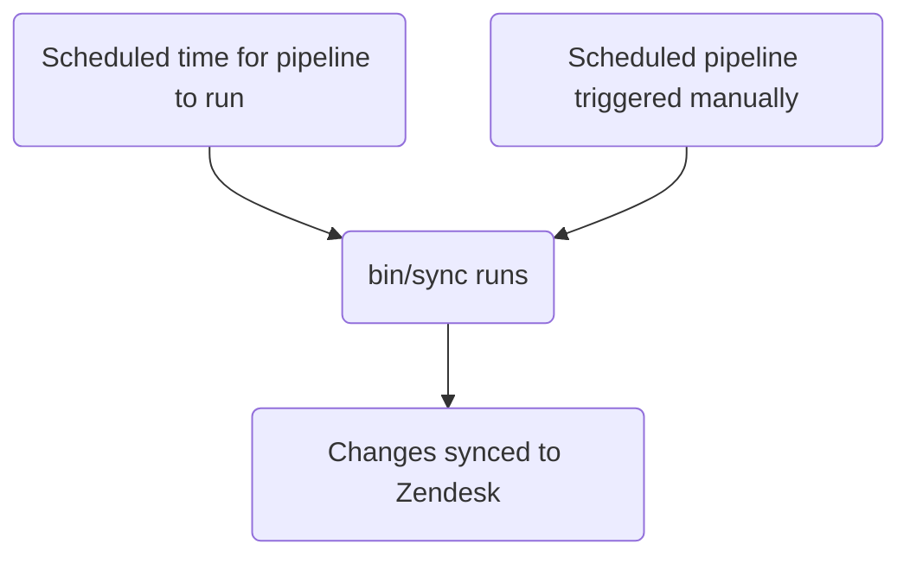

このガイドでは、GitLab における Zendesk チケットフォームを作成、編集、管理する方法について説明します。管理者は[管理者タスク](#administrator-tasks)セクションを確認してください。

{}

- デプロイタイプ: `Standard`
- 同期リポジトリ
  - [Zendesk Global](https://gitlab.com/gitlab-support-readiness/zendesk-global/tickets/forms-and-fields)
  - [Zendesk US Government](https://gitlab.com/gitlab-support-readiness/zendesk-us-government/tickets/forms-and-fields)
- `CustSuppOps Zendesk Test Suite Generator` が有効

{}
{}

- これは、特に同じ同期リポジトリで実行されるため、[チケットフィールド](/handbook/eta/css/zendesk/tickets/fields)と**非常に**密接に関連しています
- これは、Zendesk Global の[動的コンテンツ](/handbook/eta/css/zendesk/dynamic-content/)と**非常に**密接に関連しています

{}

## チケットフォームを理解する

### チケットフォームとは

チケットフォームは、ユーザーがチケットを作成するために使用するフォームです（Web UI を使用する場合）。フォーム上の回答は、チケットのメタデータに変換されます。

これらは次の 2 種類のいずれかです:

- パブリック: エージェントとエンドユーザーの両方が閲覧できます
- 内部: エージェントのみが閲覧できます

### チケットフォームの管理方法

Zendesk は UI を通じてチケットフォームを完全に管理する方法を提供していますが、私たちはよりバージョン管理されたメソドロジーを採用しています。これにより、定められたレビュープロセス、必要に応じたロールバックの実行などが可能になります。

このため、同期リポジトリを使用しています。

### 同期リポジトリの仕組み

同期リポジトリのワークフローは次のプロセスに従います:



### チケットフォームは条件ロジックを使用します

チケットフォームでは、条件を使用してフィールドを動的に表示または非表示にできます:

- `end_user_conditions`: エンドユーザーが選択内容に基づいて表示するフィールドを制御します
- `agent_conditions`: エージェントに表示するフィールドと必須になるタイミングを制御します

親フィールドが特定の値を持つ場合、子フィールドが表示されます（必要に応じて必須にできます）。例: 「プロダクトカテゴリが「GitLab.com」の場合、「GitLab.com ユーザー ID」フィールドを表示する」

チケットフォームで条件を使用する必要はありません。条件がない場合、フォームデータで詳述されたすべてのフィールドが表示されます。

これは、チケットフォームで_条件付き要件_を設定する方法でもあります。

UI では、エンドユーザー条件の形式は次のとおりです:

> TICKET_FIELD の値が VALUE の場合、LIST_OF_TICKET_FIELDS を表示する

`LIST_OF_TICKET_FIELDS` の各項目では、何らかの方法でチケットフィールド項目を必須にするオプションがあります。

2 種類のバックエンドは、要件定義の主な違いを除けば類似しています。

#### エンドユーザー条件

エンドユーザー条件のバックエンド値の形式は次のとおりです:

```yaml
- parent_field_id: 'Field title'
  value: 'tag_or_value_used_by_field'
  child_fields:
  - id: 'Field title 2'
    is_required: true
```

内訳は次のとおりです:

- `parent_field_id` は、値を確認する `field` です
- `value` は、確認する `field` の値です
- `child_fields` は表示するフィールドのリストで、各項目には次が含まれます:
  - `id` は表示するフィールドです
  - `is_required` は、新しく表示されたフィールドが送信時に必須かどうかを詳述します

#### エージェント条件

エージェント条件のバックエンド値の形式は、次の 2 つの形式のいずれかです:

```yaml
- parent_field_id: 'Field title'
  value: 'tag_or_value_used_by_field'
  child_fields:
  - id: 'Field title 2'
    is_required: true
    required_on_statuses:
      type: 'ALL_STATUSES'
```

```yaml
- parent_field_id: 'Field title'
  value: 'tag_or_value_used_by_field'
  child_fields:
  - id: 'Field title 2'
    is_required: true
    required_on_statuses:
      type: 'SOME_STATUSES'
      statuses:
      - 'pending'
      - 'hold'
      - 'solved'
```

内訳は次のとおりです:

- `parent_field_id` は、値を確認する `field` です
- `value` は、確認する `field` の値です
- `child_fields` は表示するフィールドのリストで、各項目には次が含まれます:
  - `id` は表示するフィールドです
  - `is_required` は、新しく表示されたフィールドが何らかの方法で必須かどうかを詳述します

違いを決めるのは、新しいフィールドが_必須_かどうか、および必須となる方法です:

- すべてのステータスで必須にする場合:

  ```yaml
  - id: 'Field title 2'
    is_required: true
    required_on_statuses:
      type: 'ALL_STATUSES'
  ```

- どのステータスでも必須にしない場合（つまり必須にしない場合）:

  ```yaml
  - id: 'Field title 2'
    is_required: true
    required_on_statuses:
      type: 'NO_STATUSES'
  ```

- 特定のステータスでのみ必須にする場合:

  ```yaml
  - id: 'Field title 2'
    is_required: true
    required_on_statuses:
      type: 'SOME_STATUSES'
      statuses:
      - 'list'
      - 'of'
      - 'statuses'
  ```

## 管理者以外としてチケットフォームを作成する

チケットフォームを作成するには、[機能リクエスト Issue](https://gitlab.com/gitlab-com/gl-security/corp/cust-support-ops/issue-tracker/-/issues/new?description_template=Feature)を作成してください（Customer Support Systems チームによる手動介入が必要になるためです）。

## 管理者以外としてチケットフォームを編集する

チケットフォームを変更するには、[機能リクエスト Issue](https://gitlab.com/gitlab-com/gl-security/corp/cust-support-ops/issue-tracker/-/issues/new?description_template=Feature)を作成してください（Customer Support Systems チームによる手動介入が必要になるためです）。

## 管理者以外としてチケットフォームを非アクティブ化する

チケットフォームの非アクティブ化をリクエストするには、[機能リクエスト Issue](https://gitlab.com/gitlab-com/gl-security/corp/cust-support-ops/issue-tracker/-/issues/new?description_template=Feature)を作成してください（Customer Support Systems チームによる手動介入が必要になるためです）。

## 人が読める形式の置換

{}

- YAML ファイルを通じてチケットフォームを作成または編集する `administrators` にのみ適用されます

{}

現在、同期リポジトリでは、人が読める形式（つまりチケットフィールドの `title` 属性）からチケットフィールドとブランドの置換を実行できます。

そのため、`Preferred Region for Support` という値を検出すると、そのタイトルを持つチケットフィールドを特定し、それが含まれていたチケットフォーム属性に必要なテキストに変換することを認識します。ブランドについても同様です（ただし、`name` 属性を使用します）。

## 現在のフォーム

### Zendesk Global の現在のフォーム

| 内部名 | パブリック名 | 可視性 | 利用資格が必要か? | 直接リンク |
|---------------|-------------|------------|:---------------------:|-------------|
| SaaS | Support for GitLab.com | Public | Y | [リンク](https://support.gitlab.com/hc/en-us/requests/new?ticket_form_id=334447) |
| 2FA Removal | 2FA Reset | Public | Y | [リンク](https://support.gitlab.com/hc/en-us/requests/new?ticket_form_id=18469327708956) |
| SaaS Account | GitLab.com user accounts and login issues | Public | N | [リンク](https://support.gitlab.com/hc/en-us/requests/new?ticket_form_id=360000803379) |
| Self-Managed | Support for a self-managed GitLab instance | Public | Y | [リンク](https://support.gitlab.com/hc/en-us/requests/new?ticket_form_id=426148) |
| GitLab Dedicated | Support for GitLab Dedicated instances | Public | Y | [リンク](https://support.gitlab.com/hc/en-us/requests/new?ticket_form_id=4414917877650) |
| L&R | Subscription, License or Customers Portal Problems | Public | N | [リンク](https://support.gitlab.com/hc/en-us/requests/new?ticket_form_id=360000071293) |
| Billing | Billing inquiries/refunds | Public | N | [リンク](https://support.gitlab.com/hc/en-us/requests/new?ticket_form_id=360000258393) |
| Alliance Partners | Support for alliance partners | Public | Y | [リンク](https://support.gitlab.com/hc/en-us/requests/new?ticket_form_id=360001172559) |
| Support Ops | Support portal related matters | Public | N | [リンク](https://support.gitlab.com/hc/en-us/requests/new?ticket_form_id=360001801419) |
| Emergencies | File an emergency request | Public | N | [リンク](https://support.gitlab.com/hc/en-us/requests/new?ticket_form_id=360001264259) |
| Support Internal Request | | Internal | N | |
| GitLab Incidents | | Internal | N | |
| Customer Support Internal Requests | Customer Support Internal Requests | Internal | N | [リンク](https://gitlab-internal.zendesk.com/hc/en-us/requests/new?ticket_form_id=22783651259548) |
| L&R Support Internal Requests | L&R Support Internal Requests | Internal | N | [リンク](https://gitlab-internal.zendesk.com/hc/en-us/requests/new?ticket_form_id=22783840298780) |
| CustSuppOps Support Internal Requests | CustSuppOps Support Internal Requests | Internal | N | [リンク](https://gitlab-internal.zendesk.com/hc/en-us/requests/new?ticket_form_id=22784239213084) |

### Zendesk US Government の現在のフォーム

| 内部名 | パブリック名 | 可視性 | 利用資格が必要か? | 直接リンク |
|---------------|-------------|------------|:---------------------:|-------------|
| Support | Technical Support Requests | Public | Y | [リンク](https://federal-support.gitlab.com/hc/en-us/requests/new?ticket_form_id=360000446511) |
| GitLab Dedicated | GitLab Dedicated Technical Support Requests | Public | Y | [リンク](https://federal-support.gitlab.com/hc/en-us/requests/new?ticket_form_id=26347526042004) |
| Upgrade Assistance | Upgrade Planning Assistance Request | Public | Y | [リンク](https://federal-support.gitlab.com/hc/en-us/requests/new?ticket_form_id=360001434131) |
| Support Ops | Support portal related matters | Public | Y | [リンク](https://federal-support.gitlab.com/hc/en-us/requests/new?ticket_form_id=360001421052) |
| L&R | License, Subscription, and Renewals Request | Public | Y | [リンク](https://federal-support.gitlab.com/hc/en-us/requests/new?ticket_form_id=360001421072) |
| Emergency | Emergency Support Request | Public | Y | [リンク](https://federal-support.gitlab.com/hc/en-us/requests/new?ticket_form_id=360001421112) |
| License Issue | | Internal | N | |
| L&R Support Internal Requests | L&R Support Internal Requests | Internal | N | [リンク](https://gitlab-federal-internal.zendesk.com/hc/en-us/requests/new?ticket_form_id=41826474429588) |
| CustSuppOps Support Internal Requests | CustSuppOps Support Internal Requests | Internal | N | [リンク](https://gitlab-federal-internal.zendesk.com/hc/en-us/requests/new?ticket_form_id=41826926738708) |

## 管理者タスク

{}

- このセクションのすべての項目には、Zendesk の `Administrator` レベルのアクセス権が必要です。

{}

### チケットフォームを表示する

Zendesk でチケットフォームを表示するには:

1. Zendesk インスタンスの管理パネルに移動します
   - [Zendesk Global（本番環境）](https://gitlab.zendesk.com/admin/home)
   - [Zendesk Global（サンドボックス）](https://gitlab1707170878.zendesk.com/admin/home)
   - [Zendesk US Government（本番環境）](https://gitlab-federal-support.zendesk.com/admin/home)
   - [Zendesk US Government（サンドボックス）](https://gitlabfederalsupport1585318082.zendesk.com/admin/home)
1. `Objects and rules > Tickets > forms` に移動します
   - [Zendesk Global](https://gitlab.zendesk.com/admin/objects-rules/tickets/ticket-forms)
   - [Zendesk Global（サンドボックス）](https://gitlab1707170878.zendesk.com/admin/objects-rules/tickets/ticket-forms)
   - [Zendesk US Government](https://gitlab-federal-support.zendesk.com/admin/objects-rules/tickets/ticket-forms)
   - [Zendesk US Government（サンドボックス）](https://gitlabfederalsupport1585318082.zendesk.com/admin/objects-rules/tickets/ticket-forms)

注記: 非アクティブなチケットフォームを表示する場合は、`Filter` ボタンをクリックしてアクティブなフィルターを変更する必要がある場合があります

### チケットフォームを作成する

{}

- これは、対応するリクエスト Issue（機能リクエスト、管理、バグなど）がある場合にのみ実行してください。存在しない場合は、まず作成し、作業を開始する前に標準プロセスを経る必要があります。

{}

チケットフォームを作成するには、同期リポジトリで MR を作成する必要があります。正確な変更内容はリクエスト自体によって異なります。使用できる開始テンプレートは次のとおりです:

```yaml
---
name: 'Your form name here'
previous_name: 'Your form name here'
display_name: 'Customer visible name'
raw_display_name: 'Customer visible name' # Dynamic content placeholder can be used here
active: true
position: 1 # Integer representing ticket form position
ticket_field_ids:
- 'Field title'
- 'Field title 2'
- 'Field title 3'
- 'Field title 4'
default: false # Is the form the default form for this account
in_all_brands: false # Is the form available for use in all brands on this account (should always be false)
restricted_brand_ids:
- 'Brand name'
end_user_conditions:
- parent_field_id: 'Field title'
  value: 'tag_or_value_used_by_field'
  child_fields:
  - id: 'Field title 2'
    is_required: true
  - id: 'Field title 3'
    is_required: false
agent_conditions:
- parent_field_id: 'Field title'
  value: 'tag_or_value_used_by_field'
  child_fields:
  - id: 'Field title 2'
    is_required: true
    required_on_statuses:
      type: 'ALL_STATUSES'
  - id: 'Field title 3'
    is_required: true
    required_on_statuses:
      type: 'NO_STATUSES'
  - id: 'Field title 4'
    is_required: true
    required_on_statuses:
      type: 'SOME_STATUSES'
      statuses:
      - 'pending'
      - 'hold'
      - 'solved'
```

チケットフォームはゼロから作成すると非常に複雑になる可能性があるため、迷った場合は同期リポジトリ内の既存のものを有効な例として使用してください。

ピアが MR をレビューして承認した後、MR をマージできます。次回のデプロイ時に Zendesk に同期されます。

### チケットフォームを編集する

{}

- これは、対応するリクエスト Issue（機能リクエスト、管理、バグなど）がある場合にのみ実行してください。存在しない場合は、まず作成し、作業を開始する前に標準プロセスを経る必要があります。

{}

チケットフォームを編集するには、同期リポジトリで MR を作成する必要があります。正確な変更内容はリクエスト自体によって異なります。

ピアが MR をレビューして承認した後、MR をマージできます。次回のデプロイ時に Zendesk に同期されます。

#### チケットフォームの名前を変更する

チケットフォームのタイトルを変更する必要がある場合は、現在の値を `previous_name` 属性にコピーしてから、`name` 属性を変更します。これにより、同期は更新対象のチケットフォームを引き続き特定できます。

### チケットフォームを非アクティブ化する

{}

- これは、対応するリクエスト Issue（機能リクエスト、管理、バグなど）がある場合にのみ実行してください。存在しない場合は、まず作成し、作業を開始する前に標準プロセスを経る必要があります。

{}

チケットフォームを非アクティブ化するには、同期リポジトリで MR を作成する必要があります。この MR では、対応するチケットフォームの YAML ファイルに対して次を実行してください:

1. ファイルを `active` パスから `inactive` パスに移動します
1. `active` 属性の値を `false` に変更します
1. `ticket_field_ids` の値を次のように変更します:

   ```yaml
   - 'Status'
   - 'Group'
   - 'Assignee'
   - 'Ticket status'
   - 'Subject'
   - 'Description'
   ```

1. `end_user_conditions` の値を空の配列（つまり `[]`）に変更します
1. `agent_conditions` の値を空の配列（つまり `[]`）に変更します

ピアが MR をレビューして承認した後、MR をマージできます。次回のデプロイ時に Zendesk に同期されます。

### チケットフォームを削除する

{}

- チケットフォームは、非アクティブ化されている場合にのみ削除できます。
- これは、対応するリクエスト Issue（機能リクエスト、管理、バグなど）がある場合にのみ実行してください。存在しない場合は、まず作成し、作業を開始する前に標準プロセスを経る必要があります。

{}

同期リポジトリは削除を実行しないため、Zendesk 自体を使用してこれを行う必要があります。

チケットフォームを削除するには:

1. Zendesk インスタンスの管理パネルに移動します
   - [Zendesk Global（本番環境）](https://gitlab.zendesk.com/admin/home)
   - [Zendesk Global（サンドボックス）](https://gitlab1707170878.zendesk.com/admin/home)
   - [Zendesk US Government（本番環境）](https://gitlab-federal-support.zendesk.com/admin/home)
   - [Zendesk US Government（サンドボックス）](https://gitlabfederalsupport1585318082.zendesk.com/admin/home)
1. `Objects and rules > Tickets > forms` に移動します
   - [Zendesk Global](https://gitlab.zendesk.com/admin/objects-rules/tickets/ticket-forms)
   - [Zendesk Global（サンドボックス）](https://gitlab1707170878.zendesk.com/admin/objects-rules/tickets/ticket-forms)
   - [Zendesk US Government](https://gitlab-federal-support.zendesk.com/admin/objects-rules/tickets/ticket-forms)
   - [Zendesk US Government（サンドボックス）](https://gitlabfederalsupport1585318082.zendesk.com/admin/objects-rules/tickets/ticket-forms)
1. フィルターを `Inactive` に変更します
1. 削除するチケットフォームを特定し、その名前をクリックします
1. 3 つの縦並びのドットをクリックします（チケットフォームデータの右上）
1. `Delete` をクリックします
1. `Delete` をクリックして変更を送信します

### 例外デプロイを実行する

{}

- これはチケットフォームとチケットフィールドの両方に適用されます

{}

チケットフォームの例外デプロイを実行するには、対象のチケットフォーム同期プロジェクトに移動し、スケジュール済みパイプラインページに移動して、同期項目の再生ボタンをクリックします。これにより、チケットフォームの同期ジョブがトリガーされます。

## 一般的な問題とトラブルシューティング

### マージ後にチケットフォームの変更が表示されない

チケットフォームは `Standard` デプロイタイプに従うため、通常のデプロイサイクル中（または例外デプロイが実行された場合）にのみデプロイされます
