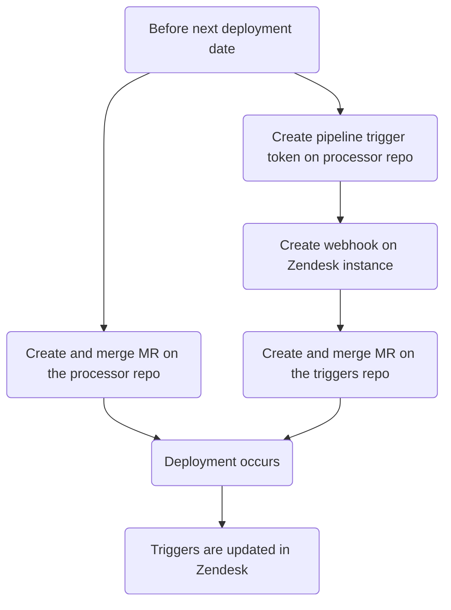
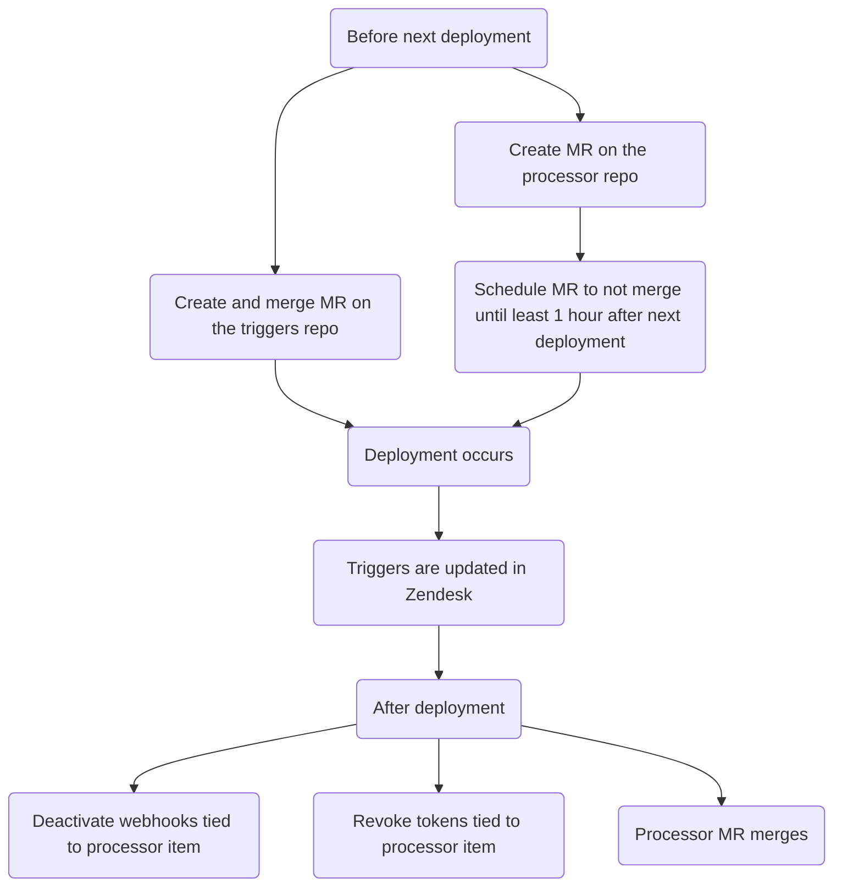

このガイドでは、特定のトリガーに基づいてチケットにカスタムアクションを実行する自動化システム、Zendesk チケットプロセッサーについて説明します。利用可能なプロセッサーの種類と、プロセッサー項目を作成、変更、削除する方法を記載します。

{}

- デプロイタイプ: `Ad-hoc`
- 同期リポジトリ
  - [Zendesk Global](https://gitlab.com/gitlab-support-readiness/zendesk-global/tickets/processor)
  - [Zendesk US Government](https://gitlab.com/gitlab-support-readiness/zendesk-us-government/tickets/processor)

{}

## チケットプロセッサーを理解する

### チケットプロセッサーとは

チケットプロセッサーは、gitlab.com に保存され、CI/CD パイプライントリガーによって起動するスクリプト群です。チケットに対してさまざまなカスタムアクションを実行できます。

### Zendesk Global のプロセッサー項目

#### 2FA の削除

[gitlab-com/support/support-team-meta#6663](https://gitlab.com/gitlab-com/support/support-team-meta/-/issues/6663)で導入

リクエスト自体を確認して、資格の状態を判定します。判定に応じてチケットにタグを追加します（対応する Zendesk トリガーが起動します）。

- リクエスト者の 2FA を削除するリクエストの場合:
  - ユーザーにこのリクエストのサポート利用資格がある場合、`2fa_challenge_questions` タグを追加します（ここで処理を終了します）
  - ユーザーにこのリクエストのサポート利用資格がない場合、`2fa_user_not_entitled` タグを追加します（ここで処理を終了します）
- 別のユーザーの 2FA を削除するリクエストの場合:
  - 次の基準を確認します
    - リクエスト者にこのリクエストのサポート利用資格があるか
    - リクエスト者のメールアドレスのドメインが対象者のメールアドレスのドメインと完全に一致するか
    - リクエスト者に gitlab.com アカウントがあるか
    - 対象者に gitlab.com アカウントがあるか
    - リクエスト者が最上位の有償名前空間で `Owner` か
    - 対象者が最上位の有償名前空間のメンバーか
  - すべての確認に合格した場合、`2fa_snippet_verification` タグを追加します（ここで処理を終了します）
  - いずれかの確認に失敗した場合、`2fa_owner_not_entitled` タグを追加します（ここで処理を終了します）

#### アカウントのブロック

[gitlab-com/support/support-ops/zendesk-global/trigger!264](https://gitlab.com/gitlab-com/support/support-ops/zendesk-global/triggers/-/merge_requests/264)で導入

gitlab.com ユーザーのアカウント状態を確認します。状態に応じて、異なるアクションを実行できます。

- ユーザーが存在しない場合:
  - アカウントが存在しないことを伝える公開返信をユーザーに送信します
  - `Ticket Stage` の値を `FRT` に設定します
  - チケットの状態を `Pending` に設定します
- ユーザーが禁止もブロックもされていない場合:
  - アカウントは実際にはブロックされていないことを伝える公開返信をユーザーに送信します
  - `Ticket Stage` の値を `FRT` に設定します
  - チケットの状態を `Pending` に設定します
- 制裁によりユーザーが禁止またはブロックされている場合:
  - 制裁によりブロックされたことを伝える公開返信をユーザーに送信します。解決のための次の手順も伝えます。
  - `Ticket Stage` の値を `FRT` に設定します
  - チケットの状態を `Solved` に設定します
- Professional Services の移行によりユーザーが禁止またはブロックされている場合:
  - リクエスト者の GitLab.com アカウントが、最上位の有償名前空間で `Owner` レベルのメンバーシップを持つか確認します。
  - 次のアクションは、前のアクションの確認結果に応じて決まります:
    - リクエスト者に GitLab.com アカウントがない、または最上位の有償名前空間の Owner ではない場合:
      - 処理を続行できないことを伝える公開返信をユーザーに送信します
      - `Ticket Stage` の値を `FRT` に設定します
      - チケットの状態を `Solved` に設定します
    - リクエスト者が最上位の有償名前空間の Owner の場合:
      - 影響を受けたユーザーのブロックを解除します
      - 影響を受けたユーザーのブロックを解除したことを伝える公開返信をユーザーに送信します
      - `Ticket Stage` の値を `FRT` に設定します
      - チケットの状態を `Solved` に設定します
- ユーザーが T&S により禁止またはブロックされている場合（下記の注記を参照）:
  - [T&S アカウント復帰プロジェクト](https://gitlab.com/gitlab-com/gl-security/security-operations/trust-and-safety/TS_Operations/account-reinstatements)内に Issue を作成します
  - 次に従う手順を SE に示す内部返信をチケットに作成します
- その他の禁止またはブロックの場合:
  - 次に従う手順を SE に示す内部返信をチケットに作成します

{}

T&S による禁止またはブロックは、ユーザーのカスタム属性を確認して定義します。次の基準のいずれかを満たす場合、T&S によるものとして分類します。

- カスタム属性に、`key` が `omamori_mitigation_plan` のオブジェクトが含まれている
- カスタム属性に、`key` が `omamori_mitigation_plan_executed_by` のオブジェクトが含まれている
- カスタム属性に、`key` が `auto_banned_by` で、`value` が次のいずれかであるオブジェクトが含まれている:
  - `banned_phone_number`
  - `banned_credit_card`
  - `abuse_reports`
  - `detumbled_email_address`
- カスタム属性に、`key` が `banned_by` で、`value` が `sec_trust` のオブジェクトが含まれている
- カスタム属性に、`key` が `blocked_by` で、`value` が `sec_trust` のオブジェクトが含まれている

{}

#### ASE の更新 {#ase-update}

[gitlab-com/gl-security/corp/cust-support-ops/issue-tracker#623](https://gitlab.com/gitlab-com/gl-security/corp/cust-support-ops/issue-tracker/-/issues/623)で導入

組織の Assigned Support Engineer（ASE）を追加または削除します（`bin/ase_update` スクリプトを使用）。

スクリプトの動作は次のとおりです。

- 組織が存在する場合:
  - ASE の追加または変更で、ユーザー ID が有効な場合:
    - 組織の `assigned_se` 属性をユーザーの ID に変更します
    - タスクが完了したことをチケットにコメントし、チケットを閉じます
  - ASE を削除する場合:
    - 組織の `assigned_se` 属性を空の値に変更します
    - タスクが完了したことをチケットにコメントし、チケットを閉じます
  - ASE を追加する場合に指定されたユーザー ID が無効であれば、その旨をリクエスト者にチケットでコメントし、チケットを閉じます
- 組織が存在しない場合は、その旨をリクエスト者にチケットでコメントし、チケットを閉じます

#### Collaboration ID {#collaboration-ids}

[gitlab-com/gl-security/corp/cust-support-ops/issue-tracker#623](https://gitlab.com/gitlab-com/gl-security/corp/cust-support-ops/issue-tracker/-/issues/623)で導入

組織のコラボレーションプロジェクト ID を追加または削除します（`bin/collab_ids` スクリプトを使用）。

スクリプトの動作は次のとおりです。

- 組織が存在する場合:
  - コラボレーションプロジェクトを追加または変更する場合:
    - 組織の `am_project_id` 属性をプロジェクトの ID に変更します
    - タスクが完了したことをチケットにコメントし、チケットを閉じます
  - コラボレーションプロジェクトを削除する場合:
    - 組織の `am_project_id` 属性を空の値に変更します
    - タスクが完了したことをチケットにコメントし、チケットを閉じます
- 組織が存在しない場合は、その旨をリクエスト者にチケットでコメントし、チケットを閉じます

#### マクロの作成 {#create-macro}

[gitlab-com/gl-security/corp/cust-support-ops/issue-tracker#705](https://gitlab.com/gitlab-com/gl-security/corp/cust-support-ops/issue-tracker/-/issues/705)で導入

Zendesk インスタンスに[シンプルなマクロ](../macros/#simple-vs-advanced-macros)を追加します（`bin/create_macro` スクリプトを使用）。

スクリプトの動作は次のとおりです。

- マクロがコメントを作成する場合、既存の管理対象コンテンツファイルがあるか確認します（ない場合は管理対象コンテンツファイルを作成します）
- マクロリポジトリに YAML ファイルを作成します（Zendesk 同期がトリガーされ、マクロが作成されます）
- タスクが完了したことを確認するコメントをチケットに作成し、チケットを閉じます。

#### 代理での作成

[gitlab-com/gl-security/corp/cust-support-ops/issue-tracker#706](https://gitlab.com/gitlab-com/gl-security/corp/cust-support-ops/issue-tracker/-/issues/706)で導入

顧客、見込み顧客などに代わってチケットを作成するリクエストを処理します（`bin/create_on_behalf` スクリプトを使用）。

スクリプトの動作は次のとおりです。

- リクエストの情報を読み取り、フォーム `Support Internal Request` を使用してユーザーに代わって新しいチケットを作成します
- 元の内部リクエストチケットからの添付ファイルが新しく作成したエンドユーザーチケットに添付されるよう、元の内部リクエストチケットを内部コメントとして新しく作成したエンドユーザーチケットにマージします

#### メール抑制

[gitlab-com/support/support-ops/zendesk-global/trigger!264](https://gitlab.com/gitlab-com/support/support-ops/zendesk-global/triggers/-/merge_requests/264)で導入

Mailgun 内にメール抑制が存在するか確認します。確認結果に応じて、異なるアクションを実行できます。

- 抑制が存在する場合...
  - Mailgun 内で見つかった抑制を削除します
  - 抑制が見つかり削除されたこと、その抑制のコード、エラー、タイムスタンプを含む内部返信をチケットに作成します
  - 抑制が見つかって削除されたこと、およびユーザーが取るべき次の手順を伝える公開返信をユーザーに送信します。
  - チケットの状態を `Solved` に設定します
- 抑制が存在しない場合...
  - 抑制が見つからなかったことと、ユーザーが取れる次の手順を伝える公開返信をユーザーに送信します。解決のための次の手順も伝えます。
  - `Ticket Stage` の値を `FRT` に設定します
  - チケットの状態を `Pending` に設定します

#### リンクタグ付け {#link-tagger}

Zendesk Global には[gitlab-com/support/support-ops/support-ops-project#998](https://gitlab.com/gitlab-com/support/support-ops/support-ops-project/-/issues/998)、Zendesk US Government には[gitlab-com/gl-security/corp/cust-support-ops/issue-tracker#841](https://gitlab.com/gitlab-com/gl-security/corp/cust-support-ops/issue-tracker/-/work_items/841)で導入

渡されたコメント（公開で、エージェントが作成したもの）に、チケットへタグ付けしたい各種項目が含まれているかを確認します。現在の項目の種類と、それに基づき追加されるタグは次のとおりです。

- gitlab.com の Issue リンクを含む
  - `gitlab_issue_link` タグを追加します
  - `CUSTOMPATH_issues_IID` タグを追加します（Global のみ）
    - `CUSTOMPATH` はプロジェクトのスラッグ、`IID` は Issue ID です
    - 例: プロジェクト jcolyer/most_amazing_project_ever の Issue 5 へのリンクは、`jcolyer_most_amazing_project_ever_issues_5` です
  - `issue~CUSTOMPATH_IID`
    - `CUSTOMPATH` はプロジェクトのスラッグ、`IID` は Issue ID です
    - 例: プロジェクト jcolyer/most_amazing_project_ever の Issue 5 へのリンクは、`issue~jcolyer_most_amazing_project_ever_issues_5` です
  - `issue_PROJECTID_IID`（Global のみ）
    - `PROJECTID` はプロジェクトの ID、`IID` は Issue ID です
    - 例: プロジェクト jcolyer/most_amazing_project_ever（プロジェクト ID 123）の Issue 5 へのリンクは、`issue_123_5` です
- gitlab.com のマージリクエストリンクを含む
  - `gitlab_merge_request_link` タグを追加します
  - `CUSTOM_PATH_merge_requests_IID` タグを追加します（Global のみ）
    - `CUSTOMPATH` はプロジェクトのスラッグ、`IID` はマージリクエスト ID です
    - 例: プロジェクト jcolyer/most_amazing_project_ever のマージリクエスト 27 へのリンクは、`jcolyer_most_amazing_project_ever_merge_requests_27` です
  - `mergerequest~CUSTOMPATH_IID`
    - `CUSTOMPATH` はプロジェクトのスラッグ、`IID` は Issue ID です
    - 例: プロジェクト jcolyer/most_amazing_project_ever のマージリクエスト 27 へのリンクは、`mergerequest~jcolyer_most_amazing_project_ever_27` です
  - `mergerequest_PROJECTID_IID`（Global のみ）
    - `PROJECTID` はプロジェクトの ID、`IID` はマージリクエスト ID です
    - 例: プロジェクト jcolyer/most_amazing_project_ever（プロジェクト ID 123）のマージリクエスト 27 へのリンクは、`mergerequest_123_27` です
- gitlab.com のエピックリンクを含む
  - `gitlab_epic_link` タグを追加します
  - `CUSTOMPATH_epic_IID` タグを追加します（Global のみ）
    - `CUSTOMPATH` はプロジェクトのスラッグ、`IID` はエピック ID です
    - 例: プロジェクト jcolyer/most_amazing_project_ever のエピック 10 へのリンクは、`jcolyer_most_amazing_project_ever_epic_10` です
  - `epic~CUSTOMPATH_IID`
    - `CUSTOMPATH` はプロジェクトのスラッグ、`IID` はエピック ID です
    - 例: プロジェクト jcolyer/most_amazing_project_ever のエピック 10 へのリンクは、`epic~jcolyer_most_amazing_project_ever_10` です
  - `epic_PROJECTID_IID`（Global のみ）
    - `PROJECTID` はプロジェクトの ID、`IID` はエピック ID です
    - 例: プロジェクト jcolyer/most_amazing_project_ever（プロジェクト ID 123）のエピック 10 へのリンクは、`epic_123_10` です
- docs.gitlab.com のリンクを含む
  - `docs_link` タグを追加します
- handbook.gitlab.com のリンクを含む
  - `hb_link` タグを追加します
- KB 記事のリンクを含む
  - `kb_link` タグを追加します
- エージェントが通話を提案したことを示すテキストを含む
  - `agent_offered_call` タグを追加します
  - 使用する検索語:
    - `calendly.com`
    - `gitlab.zoom.us`
    - `gitlabmtgs.webex.com`
    - `teams.microsoft.com`

#### 名前空間の利用可否

[gitlab-com/gl-security/corp/cust-support-ops/issue-tracker#578](https://gitlab.com/gitlab-com/gl-security/corp/cust-support-ops/issue-tracker/-/issues/578)で導入

名前空間が利用可能かを確認します（`bin/namespace_availability` スクリプトを使用）。本質的には、[ネームスクワッティング](#namesquatting)プロセスを、より簡易にし、顧客から見えないようにしたものです。

スクリプトの動作は次のとおりです。

- 名前空間が存在するか確認します
  - 存在しない場合は、その旨をチケットにコメントしてチケットを閉じ、処理を停止します
- 名前空間が有償プランを使用しているか確認します
  - 使用している場合は、名前空間を利用できないことをチケットにコメントしてチケットを閉じ、処理を停止します
- 名前空間の種類を確認します
  - `user` 名前空間の場合:
    - ユーザーが確認済みで、作成から 90 日未満か確認します
      - 該当する場合は、_利用可能な場合がある_ことをチケットにコメントしてチケットを閉じ、処理を停止します
    - 最終サインインが過去 2 年以内か確認します
      - 該当する場合は、名前空間を利用できないことをチケットにコメントしてチケットを閉じ、処理を停止します
    - その他すべての場合は、_利用可能な場合がある_ことをチケットにコメントしてチケットを閉じ、処理を停止します
  - `group` 名前空間の場合:
    - グループ配下に過去 2 年以内に更新されたプロジェクトがあるか確認します
      - 該当する場合は、_利用可能な場合がある_ことをチケットにコメントしてチケットを閉じ、処理を停止します
    - その他すべての場合は、_利用可能な場合がある_ことをチケットにコメントしてチケットを閉じ、処理を停止します

#### ネームスクワッティング {#namesquatting}

[gitlab-com/support/support-ops/zendesk-global/trigger!264](https://gitlab.com/gitlab-com/support/support-ops/zendesk-global/triggers/-/merge_requests/264)で導入

さまざまな基準に基づいて、指定された名前空間がリリースの対象となるか確認します。確認結果によって実行するアクションが決まります。

- リクエスト者が無料ユーザーの場合...
  - これらのリクエストは有償顧客のみが対象であることを伝える公開返信をユーザーに送信します。
  - `Ticket Stage` の値を `FRT` に設定します
- 名前空間が無効な場合...
  - 該当の名前空間が見つからなかったことを伝える公開返信をユーザーに送信します。
  - `Ticket Stage` の値を `FRT` に設定します
- 名前空間に資格がない場合...
  - 現時点で名前空間はリリースの対象ではないことを伝える公開返信をユーザーに送信します。
  - `Ticket Stage` の値を `FRT` に設定します
- 名前空間に資格がある_可能性がある_場合...
  - 名前空間は現在の所有者に連絡した後にのみリリースできることを伝える内部返信をチケットに作成します。見つかった所有者のメールアドレスを一覧にします。
  - `Ticket Stage` の値を `FRT` に設定します
- 名前空間に**資格がある**場合...
  - 名前空間は直ちにリリースの対象であることを伝える内部返信をチケットに作成します。
  - `Ticket Stage` の値を `FRT` に設定します

#### 組織メモ

[gitlab-com/support/support-ops/zendesk-global/trigger!264](https://gitlab.com/gitlab-com/support/support-ops/zendesk-global/triggers/-/merge_requests/264)で導入

チケットのリクエスト者がメンバーである組織から得た情報に基づき、チケットに内部メモを追加します。次の 3 種類の内部メモを作成する可能性があります。

- 次を含む可能性がある組織メモに基づくメモ:
  - 組織がエスカレーション状態にあることに関するメッセージ
  - パートナーのトラブルシューティング情報
  - 一般的な組織情報
  - 組織の下で最近起票された緊急チケット
  - 組織にコラボレーションプロジェクトがあるか
  - 組織がコンタクト管理プロジェクトを使用しているか
  - Customer Support Systems のメモ（Zendesk 内の組織自体の Notes/Details フィールドから取得）
  - [Zendesk Global Organizations プロジェクト](https://gitlab.com/gitlab-com/support/zendesk-global/organizations)から取得したサポートメモ
- 組織のサポート利用資格情報を詳述するメモ
  - 組織が期限切れ、または優先見込み顧客の場合のみ
- 組織が GitLab Dedicated であることに関するメモ

サポートメモファイルが存在しない場合は、この処理で組織用のファイルも作成します。

#### STAR

[gitlab-com/support/support-ops/support-ops-project#957](https://gitlab.com/gitlab-com/support/support-ops/support-ops-project/-/issues/957)で導入

チケットに `star_submitted` タグを追加します。

### Zendesk US Government のプロセッサー項目

次の項目は Zendesk Global と同じように動作します。

- [ASE の更新](#ase-update)
- [Collaboration ID](#collaboration-ids)
- [マクロの作成](#create-macro)
- [リンクタグ付け](#link-tagger)

#### 組織メモ

[gitlab-support-readiness/zendesk-us-government/triggers@c573f55c](https://gitlab.com/gitlab-support-readiness/zendesk-us-government/triggers/-/commit/c573f55c1f4bc241c49567e56f409e7d593692cd)で導入

チケットのリクエスト者がメンバーである組織から得た情報に基づき、チケットに内部メモを追加します。次の 3 種類の内部メモを作成する可能性があります。

- 次を含む可能性がある組織メモに基づくメモ:
  - 一般的な組織情報
  - 組織の下で最近起票された緊急チケット
  - 組織にコラボレーションプロジェクトがあるか
  - Customer Support Systems のメモ（Zendesk 内の組織自体の Notes/Details フィールドから取得）
- 組織のサポート利用資格と猶予期間の情報を詳述するメモ
  - 組織が期限切れの場合のみ
- 組織が GitLab Dedicated であることに関するメモ

## 管理者のタスク

### 新しいプロセッサー項目の作成

{}

- これは、対応するリクエスト Issue（Feature Request、Administrative、Bug など）がある場合にのみ実行してください。存在しない場合は、最初に作成し、通常のプロセスを完了させてから対応してください。

{}

チケットプロセッサーに項目を追加するには、複数の手順を実行する必要があります。

1. チケットプロセッサーリポジトリに MR を作成します。MR では次を行います:
   - 項目に関連付けられたスクリプトを作成する
   - `.gitlab-ci.yml` ファイルに項目のエントリを追加する
   - `README.md` ファイルに項目のエントリを追加する
   - `README.md` ファイルに表示されるファイルツリーを更新する
1. 項目のパイプライントリガートークンを作成する（Webhook で使用）
1. 項目に対応する Zendesk インスタンスで[Webhook を作成する](/handbook/eta/css/zendesk/webhooks/#creating-a-webhook)
1. 対応する Zendesk インスタンスのトリガーリポジトリに MR を作成します。MR では次を行います:
   - プロセッサー項目に関連付けられたトリガーを作成する

このため、全体のフローは次のようになります。

#### サンドボックスに関する考慮事項

Zendesk サンドボックスでテストする必要があるため、手順 4 に進む前に手順 1 〜 3 を完了させる必要があります。

### チケットプロセッサーの変更

{}

- これは、対応するリクエスト Issue（Feature Request、Administrative、Bug など）がある場合にのみ実行してください。存在しない場合は、最初に作成し、通常のプロセスを完了させてから対応してください。

{}

プロセッサー項目を編集するには、同期リポジトリで MR を作成する必要があります。正確にどの変更を行うかは、リクエスト自体によって決まります。

同僚が MR をレビューして承認した後、MR をマージできます。次回のデプロイ時に Zendesk へ同期されます。

### プロセッサー項目の削除

{}

- これは、対応するリクエスト Issue（Feature Request、Administrative、Bug など）がある場合にのみ実行してください。存在しない場合は、最初に作成し、通常のプロセスを完了させてから対応してください。

{}

チケットプロセッサーから項目を削除するには、複数の手順を実行する必要があります。

1. チケットプロセッサーリポジトリに MR を作成します。MR では次を行います:
   - 項目に関連付けられたスクリプトを削除する
   - `.gitlab-ci.yml` ファイルから項目のエントリを削除する
   - `README.md` ファイルから項目のエントリを削除する
   - `README.md` ファイルに表示されるファイルツリーを更新する
1. 対応する Zendesk インスタンスのトリガーリポジトリに MR を作成します。MR では次を行います:
   - プロセッサー項目に関連付けられたトリガーを無効化する
1. 項目に関連付けられた、対応する Zendesk インスタンスの[Webhook を無効化する](/handbook/eta/css/zendesk/webhooks/#deactivating-a-webhook)
1. 項目に関連付けられたパイプライントリガートークンを取り消す（Webhook で使用）

プロセッサーは `Ad-hoc` デプロイであるため、MR スケジューリングを使用する必要があります。このため、全体のフローは次のようになります。

## よくある問題とトラブルシューティング

これは必要に応じて項目を追加する、生きたセクションです。
