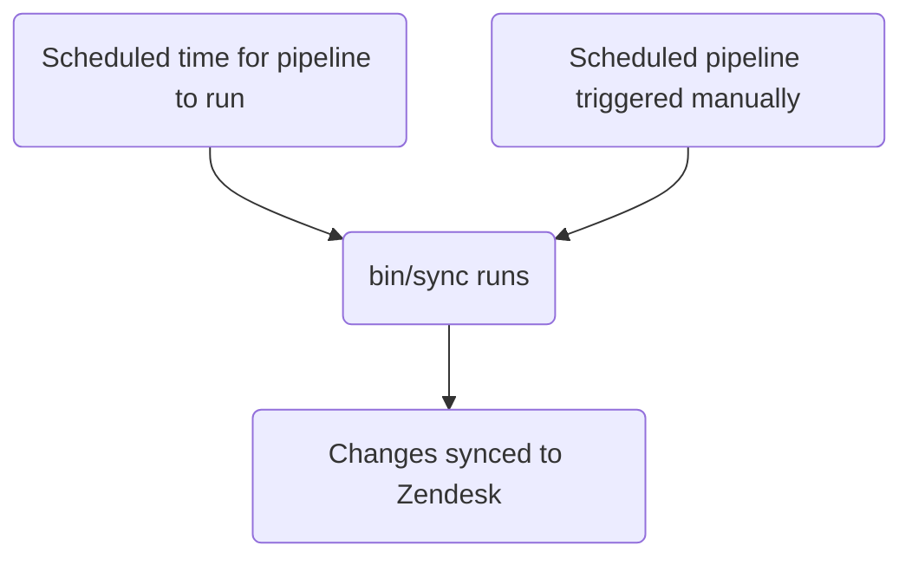

このガイドでは、GitLab における Zendesk トリガーの作成、編集、管理方法について説明します。管理者は[管理者タスク](#administrator-tasks)セクションを確認してください。

エージェントが手動で適用する[マクロ](../macros/)とは異なり、トリガーはチケットで更新が発生したときに実行されます。

{}

- デプロイタイプ: `Standard`
- 同期リポジトリ
  - [Zendesk Global](https://gitlab.com/gitlab-support-readiness/zendesk-global/triggers)
  - [Zendesk US Government](https://gitlab.com/gitlab-support-readiness/zendesk-us-government/triggers)
- 管理対象コンテンツリポジトリ
  - [Zendesk Global](https://gitlab.com/gitlab-com/support/zendesk-global/triggers)
  - [Zendesk US Government](https://gitlab.com/gitlab-com/support/zendesk-us-government/triggers)
- `CustSuppOps Zendesk Test Suite Generator` が有効

{}

## トリガーを理解する

### トリガーとは

[Zendesk](https://support.zendesk.com/hc/en-us/articles/4408822236058-About-triggers-and-how-they-work)によると:

> トリガーとは、チケットが作成または更新された直後に実行される、定義済みのビジネスルールです。たとえば、チケットがオープンされた際に顧客へ通知するためにトリガーを使用できます。別のトリガーを作成して、チケットが解決されたときに顧客へ通知することもできます。

### Zendesk でトリガーが実行されるタイミング

Zendesk のトリガーは、チケットで更新が発生するたびに実行されます。この場合、条件に基づいてチケットに適用されるトリガーの完全なリストがチケットで実行されます。

### トリガーは位置に基づいて実行されます

トリガーは、上から下へのフロー（つまり最小の位置から最大の位置へ）で実行されるため、位置が重要です。

たとえば、条件に基づいてトリガー 2、5、10 がチケットで実行される場合、実行順序はトリガー 2、次にトリガー 5、最後にトリガー 10 となります。ただし、トリガー 5 がトリガー 10 の一致を無効にするアクションを実行した場合、トリガー 10 は一致しなくなるため、トリガー 2 と 5 のみが実行されます。

### トリガーでは条件ロジックを使用します

トリガーでは条件ロジックを使用します:

- `all`: 配列内のすべての条件が true でなければなりません（AND ロジック）
- `any`: 配列内の少なくとも 1 つの条件が true でなければなりません（OR ロジック）
- 片方のセットだけ、または両方のセットを使用できます（ただし、少なくとも 1 つのセットを使用する必要があります）

### トリガーの管理方法

Zendesk は UI を介してトリガーを管理する完全な方法を提供していますが、私たちはよりバージョン管理された手法を採用しています。これにより、設定済みのレビュープロセス、必要に応じたロールバックの実行などが可能になります。

このため、同期リポジトリと管理対象コンテンツリポジトリを利用します。

### 同期リポジトリの仕組み

同期リポジトリのワークフローは次のプロセスに従います:



#### 人が読める形式への置換

{}

- YAML ファイルでトリガーを作成／編集する`administrators`にのみ適用されます

{}

現在、同期リポジトリは、さまざまな項目を人が読める形式から "Zendesk" の同等の項目に置換できます。これには次が含まれます:

| 人が読める項目 | Zendesk フィールド項目 | 条件／アクションの場所 | 注記 |
|---------------------|--------------------|-----------------|-------|
| `'Brand: XXX'` | `brand_id` | `value` | `XXX` をブランドの `name` に置き換えます |
| `'Field: XXX'` | `custom_fields_xxx` | `field` | `XXX` をチケットフィールドの `title` に置き換えます |
| `'Group: XXX'` | `group_id` | `value` | `XXX` をグループの `name` に置き換えます |
| `'XXX'` | `role` | `value` | `XXX` をロールタイプの `name` またはリクエスタのメールアドレスに置き換えます |
| `'Form: XXX'` | `ticket_form_id` | `value` | `XXX` をチケットフォームの `name` に置き換えます |
| `'Schedule: XXX'` | `set_schedule` | `value` | `XXX` をスケジュールの `name` に置き換えます |
| `'Schedule: XXX'` | `schedule_id` | `value` | `XXX` をスケジュールの `name` に置き換えます |
| `'XXX'` | `organization_id` | `value` | `XXX` を組織の `salesforce_id` 属性に置き換えます |
| `'XXX'` | `assignee_id` | `value` | `XXX` をエージェントのメールアドレスに置き換えます |
| `'XXX'` | `satisfaction_reason_code` | `value` | `XXX` を満足理由の `name` に置き換えます |
| `'XXX'` | `via_id` | `value` | `XXX` を経由タイプの `name` に置き換えます |
| `'XXX'` | `requester_role` | `value` | `XXX` をリクエスタのロールタイプの `name` に置き換えます |
| `'Target: XXX'` | `notification_target` | `value` | `XXX` をターゲットの `name` に置き換えます |
| `'Webhook: XXX'` | `notification_webhook` | `value` | `XXX` を Webhook の `name` に置き換えます |

たとえば、フィールド `Preferred Region for Support` の値を `AMER` に変更するトリガーを作成する場合、置換を使用するには次のようにします:

```yaml
- field: 'Field: Preferred Region for Support'
  value: 'AMER'
```

別の例として、チケットのフォームが `SaaS` フォームではないことを確認する条件が必要な場合は、次のようにします:

```yaml
- field: 'ticket_form_id'
  operator: 'is_not'
  value: 'Form: SaaS'
```

#### 同期リポジトリで MR を作成する場合

同期リポジトリで MR を作成すると、`bin/compare` スクリプトを介して比較操作が実行され、次の処理が行われます:

1. 管理対象コンテンツリポジトリをクローンします
1. Zendesk インスタンスからすべてのブランド、グループ、満足理由、スケジュール、ターゲット、チケットフィールド、チケットフォーム、トリガー、Webhook を取得します
1. 同期リポジトリ内のすべての YAML ファイルをレビューして、トリガーオブジェクトを生成します
   - また、同期リポジトリのファイルに次の問題がないことを確認します:
     - タイトルが欠けている
     - `active` 属性が `false` のファイルが `active` フォルダにない
     - `active` 属性が `true` のファイルが `inactive` フォルダにない
     - `title` 属性の重複使用がない
     - `contains_managed_content` 属性が `true` のすべてのファイルに対応する管理対象コンテンツファイルがある
     - `contains_managed_webhook` 属性が `true` のすべてのファイルに対応する管理対象コンテンツファイルがある
1. YAML ファイルのすべてのトリガーオブジェクトを、対応する Zendesk 項目と比較します（`title` 属性と `previous_title` 属性の値を確認して判定します）
   - 存在しない場合は、後で使用する作成オブジェクトを変数に保存します
   - 存在するものの属性値が異なる場合は、後で使用する更新オブジェクトを変数に保存します
1. 比較レポートを出力します

#### Zendesk への同期

スケジュールされたパイプラインがプロジェクトで実行されたとき（正しいタイミングまたは手動で実行された場合）、同期リポジトリは同期タスクを実行します。

どちらの操作が発生しても、同期では[比較操作](#when-creating-mrs-in-the-sync-repo)を実行し、生成されたオブジェクトを使用して、必要な Zendesk エンドポイントに対するループで必要な作成と更新を実行します:

- [作成](https://developer.zendesk.com/api-reference/ticketing/business-rules/triggers/#create-trigger)
- [更新](https://developer.zendesk.com/api-reference/ticketing/business-rules/triggers/#update-ticket-trigger)

#### 孤立した管理対象コンテンツファイルの報告

2 月、5 月、8 月、11 月の 1 日に、[スケジュールされたパイプライン](https://docs.gitlab.com/ci/pipelines/schedules/)により、同期リポジトリはサポートリーダーシップチームがすべての孤立した管理対象コンテンツファイルをレビューするための Issue を作成します。

これは同期リポジトリの `bin/find_orphaned_files` スクリプトを介して行われ、次の処理を実行します:

1. 管理対象コンテンツリポジトリをクローンします
1. 管理対象コンテンツリポジトリの `active` フォルダと `inactive` フォルダ内にあるすべてのファイルをレビューし、`state`（つまり `active` または `inactive`）、`path`、`title` を特定します
1. 同期リポジトリ自体の `active` フォルダと `inactive` フォルダ内にあるすべてのファイルをレビューし、次を特定します:
   - ファイルが管理対象コンテンツファイルを使用しているか
   - 管理対象コンテンツファイルがあるか
1. 同期リポジトリファイルのない管理対象コンテンツファイルを見つけた場合、Customer Support リーダーシップに報告する Issue を作成します

## 非管理者としてトリガーを作成する

トリガーを作成する場合は、[Feature Request Issue](https://gitlab.com/gitlab-com/gl-security/corp/cust-support-ops/issue-tracker/-/issues/new?description_template=Feature)を作成してください（Customer Support Systems チームによる手動対応が必要になるためです）。

## 非管理者としてトリガーを編集する

### トリガーで使用するコメントの文言を変更する

トリガーで使用するコメントの文言を編集するには、管理対象コンテンツリポジトリ内の対応するファイルを変更します。`master` ブランチにマージされた後、次のデプロイサイクルで取得され、Zendesk にデプロイされます。

### トリガーで使用するペイロードを変更する

管理対象 Webhook を使用しているトリガーのペイロードを編集するには、管理対象コンテンツリポジトリ内の対応するファイルを変更します。`master` ブランチにマージされた後、次のデプロイサイクルで取得され、Zendesk にデプロイされます。

### タイトル、コメント以外の文言アクションなどを変更する

トリガーのその他の項目を変更する場合は、[Feature Request Issue](https://gitlab.com/gitlab-com/gl-security/corp/cust-support-ops/issue-tracker/-/issues/new?description_template=Feature)を作成してください（Customer Support Systems チームによる手動対応が必要になるためです）。

## 非管理者としてトリガーを無効化する

トリガーの無効化をリクエストする場合は、[Feature Request Issue](https://gitlab.com/gitlab-com/gl-security/corp/cust-support-ops/issue-tracker/-/issues/new?description_template=Feature)を作成してください（Customer Support Systems チームによる手動対応が必要になるためです）。

## 管理者タスク

{}

- このセクションのすべての項目には、Zendesk への `Administrator` レベルのアクセスが必要です。

{}

### トリガーの使用状況情報を確認する

トリガーの使用状況情報を確認するには:

1. Zendesk インスタンスの管理ダッシュボードに移動します
   - [Zendesk Global（本番環境）](https://gitlab.zendesk.com/admin/home)
   - [Zendesk Global（サンドボックス）](https://gitlab1707170878.zendesk.com/admin/home)
   - [Zendesk US Government（本番環境）](https://gitlab-federal-support.zendesk.com/admin/home)
   - [Zendesk US Government（サンドボックス）](https://gitlabfederalsupport1585318082.zendesk.com/admin/home)
1. `Objects and rules > Business rules > Triggers` に移動します
   - [Zendesk Global](https://gitlab.zendesk.com/admin/objects-rules/rules/triggers)
   - [Zendesk Global（サンドボックス）](https://gitlab1707170878.zendesk.com/admin/objects-rules/rules/triggers)
   - [Zendesk US Government](https://gitlab-federal-support.zendesk.com/admin/objects-rules/rules/triggers)
   - [Zendesk US Government（サンドボックス）](https://gitlabfederalsupport1585318082.zendesk.com/admin/objects-rules/rules/triggers)
1. トリガー一覧の右端にあるアイコン（縦長の長方形が 3 つ並んだように見えます）をクリックします
1. 表示する使用状況列をクリックします

### トリガーを作成する

{}

- これは、対応するリクエスト Issue（Feature Request、Administrative、Bug など）がある場合にのみ実行してください。存在しない場合は、最初に作成し、作業する前に標準プロセスを通過させてください。
- 管理対象コンテンツファイルを使用するトリガーを作成する場合は、先にその管理対象コンテンツファイルを作成する必要があります。

{}

トリガーを作成するには、同期リポジトリで MR を作成する必要があります。正確にどの変更を行うかはリクエスト自体によって異なります。使用できる開始テンプレートは次のとおりです:

```yaml
---
title: 'Your::Title::Here'
previous_title: 'Your::Title::Here'
description: 'Your description here'
active: true
position: 1 # Integer representing trigger position
actions:
- field: 'the_action_to_perform'
  value: 'the_value_to_use'
conditions:
  all:
  - field: 'the_action_to_perform'
    operator: 'the_operator_to_use'
    value: 'the_value_to_use'
  any:
  - field: 'the_action_to_perform'
    operator: 'the_operator_to_use'
    value: 'the_value_to_use'
category_id: 'Name of category'
contains_managed_content: false
contains_managed_email: false
contains_managed_webhook: false
```

同僚が MR をレビューして承認した後、MR をマージできます。次のデプロイが発生すると、Zendesk に同期されます。

### トリガーを編集する

{}

- これは、対応するリクエスト Issue（Feature Request、Administrative、Bug など）がある場合にのみ実行してください。存在しない場合は、最初に作成し、作業する前に標準プロセスを通過させてください。
- トリガーの `contains_managed_content` 属性または `contains_managed_webhook` 属性を `false` から `true` に変更する場合は、先にその管理対象コンテンツファイルを作成する必要があります。
- トリガーの `contains_managed_content` 属性または `contains_managed_webhook` 属性を `true` から `false` に変更する場合は、対応する管理対象コンテンツファイルを削除するためのフォローアップ MR を作成してください。

{}

トリガーを編集するには、同期リポジトリで MR を作成する必要があります。正確にどの変更を行うかはリクエスト自体によって異なります。

同僚が MR をレビューして承認した後、MR をマージできます。次のデプロイが発生すると、Zendesk に同期されます。

#### トリガーのタイトルを変更する

トリガーのタイトルを変更する必要がある場合は、現在の値を `previous_title` 属性にコピーしてから、`title` 属性を変更します。これにより、同期で対象のトリガーを見つけて更新できます。

### トリガーを無効化する

{}

- これは、対応するリクエスト Issue（Feature Request、Administrative、Bug など）がある場合にのみ実行してください。存在しない場合は、最初に作成し、作業する前に標準プロセスを通過させてください。
- トリガーが管理対象コンテンツファイルを使用していた場合（つまり、YAML ファイルの `contains_managed_content` 属性または `contains_managed_webhook` 属性が以前に `true` に設定されていた場合）、管理対象コンテンツリポジトリ内の対応するファイルも `active` の場所から `inactive` の場所に移動する必要がある可能性があります。

{}

トリガーを無効化するには、同期リポジトリで MR を作成する必要があります。この MR では、対応するトリガーの YAML ファイルに対して次の操作を行います:

1. ファイルを `active` パスから `inactive` パスに移動します
1. `active` 属性の値を `false` に変更します
1. `actions` の値を次のように変更します:
   - Zendesk Global の場合:

     ```yaml
     - field: 'brand_id'
       value: 'GitLab Support'
     ```

   - Zendesk US Government の場合:

     ```yaml
     - field: 'brand_id'
       value: 'GitLab'
     ```

1. `conditions` の値を次のように変更します:
   - Zendesk Global の場合:

     ```yaml
     all:
       - field: 'brand_id'
         operator: 'is_not'
         value: 'GitLab Support'
       - field: 'brand_id'
         operator: 'is_not'
         value: 'GitLab - Internal'
     any: []
     ```

   - Zendesk US Government の場合:

     ```yaml
     all:
       - field: 'brand_id'
         operator: 'is_not'
         value: 'GitLab'
       - field: 'brand_id'
         operator: 'is_not'
         value: 'GitLab - Internal'
     any: []
     ```

1. `contains_managed_content` 属性の値を `false` に変更します
1. `contains_managed_webhook` 属性の値を `false` に変更します

同僚が MR をレビューして承認した後、MR をマージできます。次のデプロイが発生すると、Zendesk に同期されます。

### トリガーを削除する

{}

- トリガーは無効化されている場合にのみ削除できます。
- これは、対応するリクエスト Issue（Feature Request、Administrative、Bug など）がある場合にのみ実行してください。存在しない場合は、最初に作成し、作業する前に標準プロセスを通過させてください。
- トリガーを削除する場合は、同期リポジトリと管理対象コンテンツリポジトリからもファイルを削除する必要がある可能性があります。

{}

同期リポジトリは削除を実行しないため、Zendesk 自体で実行する必要があります。

トリガーを削除するには:

1. Zendesk インスタンスの管理ダッシュボードに移動します
   - [Zendesk Global（本番環境）](https://gitlab.zendesk.com/admin/home)
   - [Zendesk Global（サンドボックス）](https://gitlab1707170878.zendesk.com/admin/home)
   - [Zendesk US Government（本番環境）](https://gitlab-federal-support.zendesk.com/admin/home)
   - [Zendesk US Government（サンドボックス）](https://gitlabfederalsupport1585318082.zendesk.com/admin/home)
1. `Objects and rules > Business rules > Triggers` に移動します
   - [Zendesk Global](https://gitlab.zendesk.com/admin/objects-rules/rules/triggers)
   - [Zendesk Global（サンドボックス）](https://gitlab1707170878.zendesk.com/admin/objects-rules/rules/triggers)
   - [Zendesk US Government](https://gitlab-federal-support.zendesk.com/admin/objects-rules/rules/triggers)
   - [Zendesk US Government（サンドボックス）](https://gitlabfederalsupport1585318082.zendesk.com/admin/objects-rules/rules/triggers)
1. 削除するトリガーを見つけ、右側にある縦の 3 点をクリックします
   - 使用中のフィルターを変更する必要がある可能性があります
1. `Delete` をクリックします
1. 変更を送信するには `Delete trigger` をクリックします

### 例外デプロイを実行する

トリガーの例外デプロイを実行するには、対象のトリガー同期プロジェクトに移動し、スケジュールされたパイプラインのページで同期項目の再生ボタンをクリックします。これにより、トリガーの同期ジョブがトリガーされます。

## よくある問題とトラブルシューティング

### マージ後にトリガーの変更が表示されない

トリガーは `Standard` デプロイタイプに従うため、通常のデプロイサイクル中（または例外デプロイが実行された場合）にのみデプロイされます
