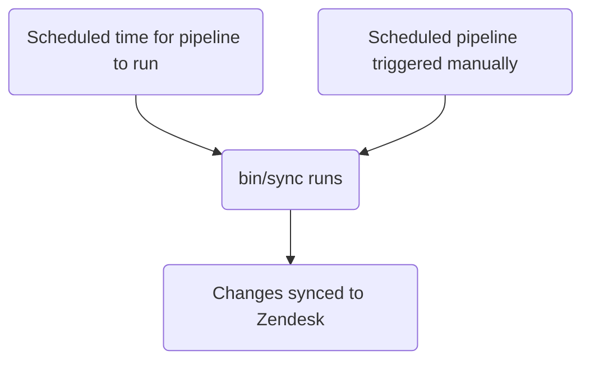

このガイドでは、GitLab で Zendesk ビューを作成、編集、管理する方法について説明します。既存のビューを変更したいサポートエージェントは、[ビューで使用するフィールド、グループ化、ソートの変更](#changing-the-fields-grouping-or-sorting-used-in-a-view)を参照してください。管理者は[管理者タスク](#administrator-tasks)セクションを確認してください。

{}

- デプロイタイプ: `Standard`
- 同期リポジトリ
  - [Zendesk Global](https://gitlab.com/gitlab-support-readiness/zendesk-global/views)
  - [Zendesk US Government](https://gitlab.com/gitlab-support-readiness/zendesk-us-government/views)
- 管理対象コンテンツリポジトリ
  - [Zendesk Global](https://gitlab.com/gitlab-com/support/zendesk-global/views)
  - [Zendesk US Government](https://gitlab.com/gitlab-com/support/zendesk-us-government/views)
- `CustSuppOps Zendesk Test Suite Generator` が有効

{}

## ビューについて

### ビューとは

[Zendesk](https://support.zendesk.com/hc/en-us/articles/4408888828570-Creating-views-to-build-customized-lists-of-tickets)によると:

> ビューは、特定の条件に基づいてチケットをリストにグループ化することで、チケットを整理する方法です。たとえば、自分に割り当てられた未解決チケットのビュー、新しくトリアージする必要があるチケットのビュー、応答待ちの保留チケットのビューを作成できます。ビューを使用すると、自分またはチームが注意を払う必要があるチケットを判断し、それに応じて計画を立てるのに役立ちます。

### ビューの種類

現在、Zendesk には 3 種類のビューがあります。

- デフォルト: Zendesk が作成した事前定義済みのビュー
- 共有: Zendesk Administrator（例: Customer Support Systems）が作成したビュー
- 個人用: 自分が作成し、自分のみが使用できるビュー

### ビューの制限事項

現在、Zendesk ビューにはいくつかの制限があります。

- ビューでは「定義」されていない条件を使用できません。つまり、選択可能なデータである必要があります（たとえば、テキストフィールドは機能しません）。
- ビューには[アーカイブ済みチケット](https://support.zendesk.com/hc/en-us/articles/4408887617050-About-ticket-archiving)（つまり、120 日後の Closed チケット）は含まれません。

### ビューはネストできる

ビューのタイトルで二重コロン（つまり `::`）を使用すると、ビュー同士をネストできます。

たとえば、次のビューがあるとします。

- Support Agents Tier 1 Normal tickets
- Support Agents Tier 1 Escalated tickets
- Support Agents Tier 2 Normal tickets
- Support Agents Tier 2 Escalated tickets
- Support Agents Tier 3 Normal tickets
- Support Agents Tier 3 Escalated tickets

これらを次のように名前変更できます。

- Support Agents::Tier 1::Normal tickets
- Support Agents::Tier 1::Escalated tickets
- Support Agents::Tier 2::Normal tickets
- Support Agents::Tier 2::Escalated tickets
- Support Agents::Tier 3::Normal tickets
- Support Agents::Tier 3::Escalated tickets

結果として、ビューは次のように表示されます。

- Support Agents
  - Tier 1
    - Normal tickets
    - Escalated tickets
  - Tier 2
    - Normal tickets
    - Escalated tickets
  - Tier 3
    - Normal tickets
    - Escalated tickets

上記の `Support Agents`、`Tier 1`、`Tier 2`、`Tier 3` は実際にはビューではなく（ネスト用に表示されるカテゴリです）。ファイル構造のように考えてください（カテゴリがフォルダーで、実際のビューがファイルです）。

### ビューでは条件ロジックを使用する

ビューでは条件ロジックを使用します。

- `all`: 配列内のすべての条件が真である必要があります（AND ロジック）
- `any`: 配列内の少なくとも 1 つの条件が真である必要があります（OR ロジック）
- 1 つのセットのみ、または両方のセットを使用できます（ただし、少なくとも 1 つのセットを使用する必要があります）

### ビューの管理方法

Zendesk では UI を通じてビューを完全に管理できますが、私たちはよりバージョン管理された手法を採用しています。これにより、設定されたレビュー手順、必要に応じたロールバックの実行などが可能になります。

そのため、同期リポジトリと管理対象コンテンツリポジトリを使用します。

### 同期リポジトリの仕組み

同期リポジトリのワークフローは、次のプロセスに従います。



#### 人間が読みやすい置換

{}

- YAML ファイル経由でビューを作成／編集する `administrators` にのみ適用されます

{}

現在、同期リポジトリは、人間が読みやすい項目から Zendesk の同等の項目へのさまざまな置換を実行できます。これには次が含まれます。

| 人間が読みやすい項目 | Zendesk フィールド項目 | 条件の場所 | 注記 |
|---------------------|--------------------|--------------------|-------|
| `'Brand: XXX'` | `brand_id` | `value` | `XXX` をブランドの `name` に置き換える |
| `'Field: XXX'` | `custom_fields_xxx` | `field` | `XXX` をチケットフィールドの `title` に置き換える |
| `'Group: XXX'` | `group_id` | `value` | `XXX` をグループの `name` に置き換える |
| `'XXX'` | `role` | `value` | `XXX` をロールタイプの `name` または依頼者のメールアドレスに置き換える |
| `'Form: XXX'` | `ticket_form_id` | `value` | `XXX` をチケットフォームの `name` に置き換える |
| `'Schedule: XXX'` | `set_schedule` | `value` | `XXX` をスケジュールの `name` に置き換える |
| `'Schedule: XXX'` | `schedule_id` | `value` | `XXX` をスケジュールの `name` に置き換える |
| `'XXX'` | `organization_id` | `value` | `XXX` を組織の `salesforce_id` 属性に置き換える |
| `'XXX'` | `assignee_id` | `value` | `XXX` をエージェントのメールアドレスに置き換える |
| `'XXX'` | `satisfaction_reason_code` | `value` | `XXX` を満足度理由の `name` に置き換える |
| `'XXX'` | `via_id` | `value` | `XXX` を経由タイプの `name` に置き換える |
| `'XXX'` | `requester_role` | `value` | `XXX` を依頼者ロールタイプの `name` に置き換える |
| `'Target: XXX'` | `notification_target` | `value` | `XXX` をターゲットの `name` に置き換える |
| `'Webhook: XXX'` | `notification_webhook` | `value` | `XXX` を Webhook の `name` に置き換える |

[制限オブジェクト](#view-restriction-objects)でも変換を実行できます（詳細はそのセクションを参照してください）。

たとえば、チケットのフォームが `SaaS` フォームではないかを確認する条件がある場合は、次のようにします。

```yaml
- field: 'ticket_form_id'
  operator: 'is_not'
  value: 'Form: SaaS'
```

#### 同期リポジトリで MR を作成する場合

同期リポジトリで MR を作成すると、比較アクション（`bin/compare` スクリプト経由）が実行され、次の処理を行います。

1. 管理対象コンテンツリポジトリのクローンを実行する
1. Zendesk インスタンスからすべてのブランド、グループ、満足度理由、スケジュール、ターゲット、チケットフィールド、チケットフォーム、ビュー、Webhook を取得する
1. 同期リポジトリ内のすべての YAML ファイルをレビューして、ビューオブジェクトを生成する
   - また、同期リポジトリファイルに次の問題がないことを確認します。
     - タイトルがない
     - 位置がない
     - `active` 属性が `false` のファイルが `active` フォルダーにある
     - `active` 属性が `true` のファイルが `inactive` フォルダーにある
     - `title` 属性が重複して使用されている
     - `contains_managed_content` 属性が `true` のファイルに、一致する管理対象コンテンツファイルがある
     - `contains_managed_webhook` 属性が `true` のファイルに、一致する管理対象コンテンツファイルがある
1. YAML ファイルのすべてのビューオブジェクトを、一致する Zendesk 項目と比較する（属性 `title` と `previous_title` の値を確認して判定する）
   - 存在しない場合は、後で使用するために create オブジェクトを変数に格納する
   - 存在しても属性値が異なる場合は、後で使用するために update オブジェクトを変数に格納する
1. 比較レポートを出力する

#### Zendesk への同期

同期リポジトリは、プロジェクトのスケジュール済みパイプラインが実行されたとき（正しいタイミングまたは手動実行時）に同期タスクを実行します。

いずれかのアクションが発生すると、同期は[比較アクション](#when-creating-mrs-in-the-sync-repo)を実行し、その後、必要な Zendesk エンドポイントを呼び出すループを通じて、生成されたオブジェクトを使用して必要な作成と更新を行います。

- [作成](https://developer.zendesk.com/api-reference/ticketing/business-rules/views/#create-view)
- [更新](https://developer.zendesk.com/api-reference/ticketing/business-rules/views/#update-view)

#### 孤立した管理対象コンテンツファイルの報告

2 月、5 月、8 月、11 月の 1 日に、[スケジュール済みパイプライン](https://docs.gitlab.com/ci/pipelines/schedules/)によって、同期リポジトリがサポートリーダーシップチーム向けにすべての孤立した管理対象コンテンツファイルをレビューする Issue を作成します。

これは、同期リポジトリ内の `bin/find_orphaned_files` スクリプトによって実行され、次の処理を行います。

1. 管理対象コンテンツリポジトリのクローンを実行する
1. 管理対象コンテンツリポジトリの `active` フォルダーと `inactive` フォルダーにあるすべてのファイルをレビューし、`state`（つまり `active` または `inactive`）、`path`、`title` を判定する
1. 同期リポジトリ自体の `active` フォルダーと `inactive` フォルダーにあるすべてのファイルをレビューして、次を判定する
   - 管理対象コンテンツファイルを使用しているか
   - 管理対象コンテンツファイルがあるか
1. 同期リポジトリファイルがない管理対象コンテンツファイルを見つけた場合、Customer Support leadership に報告する Issue を作成する

## 非管理者として個人用ビューを作成する

{}

- Zendesk の管理者である場合、個人用ではないビューを作成できるため、これを行う際は注意してください。

{}

Zendesk で個人用ビューを作成するには、次の手順に従います。

1. 新しいビューページを開く
   - [Zendesk Global (production)](https://gitlab.zendesk.com/admin/workspaces/agent-workspace/views/new)
   - [Zendesk Global (sandbox)](https://gitlab1707170878.zendesk.com/admin/workspaces/agent-workspace/views/new)
   - [Zendesk US Government (production)](https://gitlab-federal-support.zendesk.com/admin/workspaces/agent-workspace/views/new)
   - [Zendesk US Government (sandbox)](https://gitlabfederalsupport1585318082.zendesk.com/admin/workspaces/agent-workspace/views/new)
1. ビューの名前を入力する
1. ビューの説明を入力する（任意）
1. 管理者である場合は、`Who has access` セクションで `Only you` が選択されていることを確認する
1. ビューの条件（つまり使用するフィルター）を入力する
1. 表示するフィールドを入力する
1. グループ化情報を入力する
1. ソート情報を入力する
1. ページ右下の `Save` ボタンをクリックする

## 非管理者として個人用ではないビューを作成する

ビューを作成するには、[Feature Request Issue](https://gitlab.com/gitlab-com/eta/css/issue-tracker/-/issues/new?description_template=Feature)を作成してください（Customer Support Systems チームによる手動介入が必要になるためです）。

## 非管理者として個人用ビューを編集する

既存の個人用ビューを編集するには、次の手順に従います。

1. 対象のビューに移動する
1. ページ右上の `Actions` ボタンをクリックする
1. `Edit view` をクリックする
1. 必要な変更を行う
1. ページ右下の `Save` ボタンをクリックする

## 非管理者として個人用ではないビューを編集する

### ビューで使用するフィールド、グループ化、ソートの変更

ビューで使用するフィールド、グループ化、ソートを編集するには、管理対象コンテンツリポジトリ内の対応するファイルを変更します。`master` ブランチにマージされると、次のデプロイサイクルで取得され、Zendesk にデプロイされます。

### タイトル、位置などの変更

ビューでその他の変更を行うには、[Feature Request Issue](https://gitlab.com/gitlab-com/eta/css/issue-tracker/-/issues/new?description_template=Feature)を作成してください（Customer Support Systems チームによる手動介入が必要になるためです）。

## 非管理者としてビューを非アクティブ化する

ビューの非アクティブ化をリクエストするには、[Feature Request Issue](https://gitlab.com/gitlab-com/eta/css/issue-tracker/-/issues/new?description_template=Feature)を作成してください（Customer Support Systems チームによる手動介入が必要になるためです）。

## 管理者タスク

{}

- このセクションのすべての項目には Zendesk の `Administrator` レベルのアクセスが必要です。

{}

### ビュー制限オブジェクト

ビューは、特定のエージェント集合にのみ表示されるよう制限できます。これは制限オブジェクトを使用して行います。

同期リポジトリでは個人用ビューを管理しないため、このオブジェクトで目にするのは `null`（または空白）値かグループ制限のみです。

誰に対してもビューを制限しない場合、オブジェクトの値全体は `null`（または空白）です。

ビューの表示をグループに制限する場合、オブジェクトの形式は次のとおりです。

```yaml
restriction:
  type: Group
  id: 'Name of group 1'
  ids:
  - 'Name of group 1'
  - 'Name of group 2'
  - 'Name of group 3'
```

同期リポジトリでソートなどを処理するため、`ids` 配列の順序（または `id` 属性にどの正確な値が入っているか）は重要ではありません（`ids` に列挙されたグループのいずれか 1 つが `id` に存在する限り）。`id` 値に何を入れるべきか迷った場合は、アルファベット順で最初に来るものを使用してください。

たとえば、`Support Ops` グループだけがビューを表示できるよう制限するには、次を使用します。

```yaml
restriction:
  type: Group
  id: 'Support Ops'
  ids:
  - 'Support Ops'
```

別の例として、`Support AMER`、`Support APAC`、`Support EMEA` のグループだけがビューを表示できるよう制限するには、次を使用します。

```yaml
restriction:
  type: Group
  id: 'Support AMER'
  ids:
  - 'Support AMER'
  - 'Support APAC'
  - 'Support EMEA'
```

### ビュー一覧の表示

Zendesk でビューの一覧を表示するには、次の手順に従います。

1. Zendesk インスタンスの管理ダッシュボードに移動する
   - [Zendesk Global (production)](https://gitlab.zendesk.com/admin/home)
   - [Zendesk Global (sandbox)](https://gitlab1707170878.zendesk.com/admin/home)
   - [Zendesk US Government (production)](https://gitlab-federal-support.zendesk.com/admin/home)
   - [Zendesk US Government (sandbox)](https://gitlabfederalsupport1585318082.zendesk.com/admin/home)
1. `Workspaces > Agent tools > Views` に移動する
   - [Zendesk Global](https://gitlab.zendesk.com/admin/workspaces/agent-workspace/views)
   - [Zendesk Global (sandbox)](https://gitlab1707170878.zendesk.com/admin/workspaces/agent-workspace/views)
   - [Zendesk US Government](https://gitlab-federal-support.zendesk.com/admin/workspaces/agent-workspace/views)
   - [Zendesk US Government (sandbox)](https://gitlabfederalsupport1585318082.zendesk.com/admin/workspaces/agent-workspace/views)

特定のビューを見つけるには、使用中のフィルターを調整する必要がある場合があります（デフォルトでは `active` の `shared` ビューが表示されます）。

### ビューの作成

{}

- これは対応するリクエスト Issue（Feature Request、Administrative、Bug など）がある場合にのみ実施してください。存在しない場合は、まず Issue を作成し、標準プロセスを経てから作業してください。
- まず管理対象コンテンツファイルを作成する必要があります。存在しない場合、MR のパイプラインは失敗します。

{}

ビューを作成するには、同期リポジトリで MR を作成する必要があります。正確な変更内容はリクエスト自体によって異なります。開始テンプレートとして、次を使用できます。

```yaml
---
title: 'Your view title here'
previous_title: 'Your view title here'
description: 'Your description here'
active: true
position: 1 # Integer representing view position
conditions:
  all:
  - field: 'the_action_to_perform'
    operator: 'the_operator_to_use'
    value: 'the_value_to_use'
  any:
  - field: 'the_action_to_perform'
    operator: 'the_operator_to_use'
    value: 'the_value_to_use'
execution:
  columns: MANAGED_CONTENT # It is always this value as it pulls from the corresponding managed content file
  group_by: MANAGED_CONTENT # It is always this value as it pulls from the corresponding managed content file
  group_order: MANAGED_CONTENT # It is always this value as it pulls from the corresponding managed content file
  sort_by: MANAGED_CONTENT # It is always this value as it pulls from the corresponding managed content file
  sort_order: MANAGED_CONTENT # It is always this value as it pulls from the corresponding managed content file
restriction: # Leave blank to make it visible to all, add a restriction object if you need to fine tune visibility
```

同僚が MR をレビューして承認した後、MR をマージできます。次のデプロイが行われると、Zendesk に同期されます。

### ビューの編集

{}

- これは対応するリクエスト Issue（Feature Request、Administrative、Bug など）がある場合にのみ実施してください。存在しない場合は、まず Issue を作成し、標準プロセスを経てから作業してください。
- これは次の変更を行う場合にのみ適用されます（その他はすべて管理対象コンテンツリポジトリ経由で行います）。
  - タイトル
  - 説明
  - 位置
  - 条件
  - 制限

{}

ビューを編集するには、同期リポジトリで MR を作成する必要があります。正確な変更内容はリクエスト自体によって異なります。

同僚が MR をレビューして承認した後、MR をマージできます。次のデプロイが行われると、Zendesk に同期されます。

#### ビューのタイトルの変更

ビューのタイトルを変更する必要がある場合は、現在の値を `previous_title` 属性にコピーしてから、`title` 属性を変更します。これにより、同期は更新する対象のビューを引き続き見つけることができます。

### ビューの非アクティブ化

{}

- これは対応するリクエスト Issue（Feature Request、Administrative、Bug など）がある場合にのみ実施してください。存在しない場合は、まず Issue を作成し、標準プロセスを経てから作業してください。
- ビューで管理対象コンテンツファイルを使用しているため、管理対象コンテンツリポジトリでも対応するファイルを `active` の場所から `inactive` の場所へ移動する必要がある可能性があります。

{}

ビューを非アクティブ化するには、同期リポジトリで MR を作成する必要があります。この MR では、対応するビューの YAML ファイルに対して次の手順を実行します。

1. ファイルを `active` から `inactive` パスに移動する
1. `active` 属性の値を `false` に変更する
1. `conditions` の値を次のように変更する
   - Zendesk Global の場合:

     ```yaml
       all:
       - field: 'brand_id'
         operator: 'is_not'
         value: 'GitLab Support'
       - field: 'brand_id'
         operator: 'is_not'
         value: 'GitLab - Internal'
       - field: 'status'
         operator: 'less_than'
         value: 'closed'
     any: []
     ```

   - Zendesk US Government の場合:

     ```yaml
     all:
       - field: 'brand_id'
         operator: 'is_not'
         value: 'GitLab'
       - field: 'brand_id'
         operator: 'is_not'
         value: 'GitLab - Internal'
       - field: 'status'
         operator: 'less_than'
         value: 'closed'
     any: []
     ```

同僚が MR をレビューして承認した後、MR をマージできます。次のデプロイが行われると、Zendesk に同期されます。

### ビューの削除

{}

- 非アクティブ化されたビューのみを削除できます。
- これは対応するリクエスト Issue（Feature Request、Administrative、Bug など）がある場合にのみ実施してください。存在しない場合は、まず Issue を作成し、標準プロセスを経てから作業してください。
- ビューを削除する場合は、同期リポジトリと管理対象コンテンツリポジトリからもファイルを削除する必要がある可能性があります。

{}

ビューを削除するには、次の手順に従います。

1. [ビュー一覧](#viewing-a-list-of-views)に移動する
1. 削除するビューを見つけ、ビューの右側にある 3 つの点をクリックする
   - 特定のビューを見つけるには、使用中のフィルターを調整する必要がある場合があります（デフォルトでは `active` の `shared` ビューが表示されます）。
1. `Delete` をクリックする
1. 変更を送信するには `Delete view` をクリックする

### 例外デプロイの実行

ビューの例外デプロイを実行するには、対象のビュー同期プロジェクトに移動し、スケジュール済みパイプラインページに移動して、同期項目の再生ボタンをクリックします。これにより、ビューの同期ジョブがトリガーされます。

## 一般的な問題とトラブルシューティング

### マージ後にビューの変更が表示されない

ビューは `Standard` デプロイタイプに従うため、通常のデプロイサイクル中（または例外デプロイが実行された場合）にのみデプロイされます。
