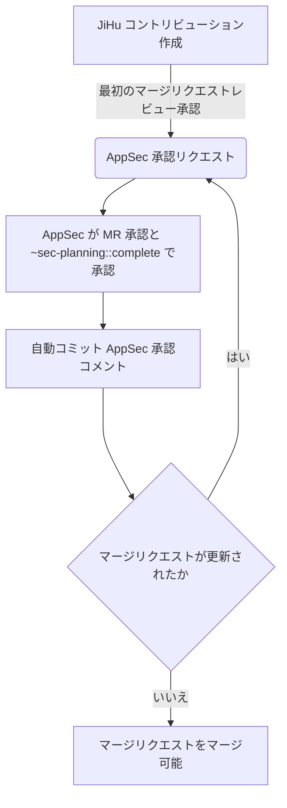

### JiHu コントリビューションのセキュリティレビュープロセス

JiHu コントリビューションを含むリリースを認定できるようにするため、AppSec チームのメンバーはすべての JiHu コントリビューションのセキュリティレビューを実施し、明示的に承認する必要があります。JiHu チームは[複数のリポジトリ](/handbook/finance/jihu-support/#projects)にコードをコントリビューションします。
これらのコントリビューションには `JiHu contribution` ラベルが[自動的にラベル付け](/handbook/finance/jihu-support/jihu-contribution-process/#jihu-contribution-identification)されます。

### JiHu コントリビューションのセキュリティレビューを実施できる担当者

AppSec または Federal AppSec チームのメンバーは誰でも JiHu コントリビューションのセキュリティレビューを実施できます。

### レビューをリクエストするタイミング

MR が最初の承認を受けた後、自動コメントによって AppSec チームへの通知が行われます。チームメンバーが手動で AppSec を @-メンションする必要はありません。

### JiHu コントリビューションのセキュリティレビューを実施する担当者の決定

AppSec チームが JiHu コントリビューションへの通知を受けた際、通常は最初に[トリアージ（メンションと Issue）ローテーション](/handbook/security/product-security/security-platforms-architecture/application-security/runbooks/triage-rotation/)担当の AppSec エンジニアが確認します。この担当者は：

1. [コードベースの関連部分](/handbook/product/categories/#devops-stages)のステーブルカウンターパートにピングし、レビューを依頼する
    - 変更が小さいまたは簡単にレビューできる場合、トリアージ担当の AppSec エンジニアが自らレビューを行い、可視性のためにステーブルカウンターパートを `@-メンション` することもできる
1. ステーブルカウンターパートが不在または未割り当ての場合、トリアージローテーション担当の AppSec エンジニアがレビューを実施できる
1. または、`#security_help` Slack チャンネルで MR へのリンクを投稿してレビュアーを募ることもできる

### JiHu コントリビューションのセキュリティレビューワークフロー

JiHu コントリビューションのセキュリティレビューを実施する際、レビュアーは：

1. マージリクエストのセキュリティレビューを実施する
    - レビューを完了するために必要なコメントをしたり説明を求めたりする
    - コードに新しい脆弱性が導入されていないことを確認する
1. マージリクエストが受け入れられる場合：
    - `/approve` クイックアクションを使用するコメントをする
    - 承認は[自動承認コメント](https://gitlab.com/gitlab-org/gitlab/-/merge_requests/84626#note_906357637)で確認される
    - 正しい AppSec ラベルを適用する：
     ``/label ~"AppSecWorkType::JihuMRreview" ~AppSecWeight::<update> ~"Application Security Team" ~AppSecWorkflow::complete"
       /milestone %<update>``
1. マージリクエストが現時点では受け入れられない場合、または新しい脆弱性を導入している場合、または AppSec チームがエンジニアからの回答を待っている場合：
    - `sec-planning::pending followup` ラベルを適用する
    - 可能であれば、作成者と協力してセキュアにする。受け入れられる状態になったら上記の手順を実施する
    - 本質的に受け入れられない場合、または広い議論が必要な場合は懸念を表明し、作成者および関連するプロダクトとエンジニアリングチームと協力して前進する

#### セキュリティ最終コミット承認

AppSec の承認は、マージリクエストにその後の変更が追加された際に取り消され、マージ前に AppSec による再レビューが必要となります。プロセスは以下のとおりです：

1. MR が更新（追加コミットまたはリベース）されると `~sec-planning::complete` が取り消され、元の AppSec 承認者に[再レビューと承認のリクエスト](https://gitlab.com/gitlab-org/gitlab/-/merge_requests/84626#note_906360435)が届く。
1. AppSec 承認バージョンと最新バージョン間の変更を確認するには[「バージョン比較」機能](https://docs.gitlab.com/ee/user/project/merge_requests/versions.html#selecting-a-version)を使用する。自動承認コメントには承認されたバージョンの SHA ハッシュが含まれている。
1. 再レビュー後に承認を取り消して再承認するには、[提案されたクイックアクション](https://gitlab.com/gitlab-org/gitlab/-/merge_requests/84626#note_906360435)を使用する。

`~sec-planning::complete` ラベルがマージリクエストにない場合、`verify-approvals` ジョブが失敗するため、`gitlab-org/gitlab` の `~JiHu contribution` MR のマージはブロックされます。
