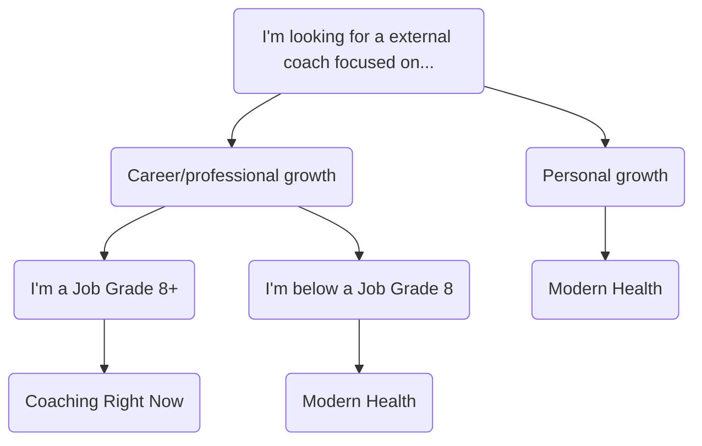

## GitLab におけるコーチング

GitLab では、以下のためにコーチングを使用します:

1. 自己反省、コミュニケーション、フィードバックの機会を提供する
1. [顧客に成果を届ける](/handbook/values/#results) ために必要なスキルをチームメンバーに身につけさせる
1. [ハイパフォーマンス](https://internal.gitlab.com/handbook/company/high-performing-teams/) を達成するための戦略を実践する場を作る

コーチングの会話は、コーチとコーチを受ける人が対等なパートナーである、流動的でダイナミックな共創の行為です。GitLab では、ピープルリーダーも個別の貢献者も同様に、[360レビュープロセス](/handbook/people-group/360-feedback/)、[フィードバック](/handbook/people-group/guidance-on-feedback/) の提供と受領、[キャリア開発](/handbook/leadership/1-1/#career-development-discussion-at-the-1-1) のステージ全体などでコーチングを使用します。

### なぜコーチが必要、または欲しいのか

コーチは最後の手段のリソースであり、パフォーマンス改善計画のチームメンバーだけのものだという誤解が一般的です。コーチングはシニアリーダーだけのものだという誤解もあります。

プロのコーチに会いたい、または会うことで利益を得られる理由の例を確認してください。このリストは網羅的ではありません。

1. ピープルマネージャーが自分のコーチングスキルとスタイルを開発して、チームに説明責任を構築する。
1. リーダーが四半期計画プロセスに透明性と効率性を加えたいが、どこから始めるべきかわからない。
1. 個別の貢献者が、自分の個人的なリーダーシップスタイルを定義し、キャリア成長の機会を計画したい。
1. チームメンバーが、オープンで正直なフィードバックを与えることに焦点を当てて、コミュニケーションスタイルを改善したい。
1. チームメンバーが緊急性と成果に基づいて自分の作業の優先順位を付けるシステムを構築するためのガイダンスが必要。

## コーチの選択

GitLab でコーチを見つける方法はさまざまあります:

| コーチングタイプ | 説明 |
| ----- | --------------- |
| プロフェッショナル | 外部コーチによるプロフェッショナルコーチングは、[Growth and Development Fund](/handbook/people-group/learning-and-development/growth-and-development/#types-of-growth-and-development-reimbursements) を使用してJob Grade 8以上のマネージャーおよび IC に提供されます。 |
| [Modern Health](/handbook/total-rewards/benefits/modern-health/) | Modern Health Employee Assistance Programを使用することで、すべてのチームメンバーにプロフェッショナルコーチングが提供されます。Modern Healthのコーチは、プロフェッショナル／キャリア、メンタルヘルス、ファイナンシャルコーチングを専門としています。 |
| マネージャーコーチング | あなたのマネージャーは、あなたを将来の目標に導くコーチになることができます。マネージャーがあなたをコーチング能力で引き受けることができることを確認してください。ただし、コーチングは1:1ディスカッション中にマネージャーと持つ相互作用のタイプでもあります。 |
| 代替プロフェッショナルコーチ | 何らかの理由で、Coaching Right NowまたはModern Healthを通じて提供されるコーチがあなたのニーズに合わない場合、Job Grade 8+のチームメンバーは代替の外部コーチを探し、承認を得ることができます。 |

## コーチがどのようにコーチするか

コーチは、チームメンバーが自分の強みと開発領域を認識しながら、注意を未来に集中するのを支援します。コーチは、コーチを受ける人が自分の可能性を引き出し、望ましい結果を特定し、目標を達成するのを助けます。

コーチの主要な属性は以下を含みます:

1. 学習や洞察を深めるためにパワフルな質問をする。
1. コーチを受ける人が自分の強みと未開拓の可能性を認識するのを助ける。
1. コーチを受ける人が自分の選択に従って行動に移るよう奨励する。
1. コーチを受ける人がコミットしたアクションに対して責任を負わせる。
1. コーチを受ける人に完全に集中する。
1. サポートを提供しながら深く聴く。

### 必須のコーチングスキル

効果的なコーチは、コーチングの会話を可能にする定義されたスキルセットを使用します。これらのスキルには以下が含まれます:

{}
パワフルでオープンエンドな質問をすること。コーチングとは、伝えるのではなく尋ねることから来ており、チームメンバーが自分の解決策を作り出せるようにします。コーチングは、個人から洞察を「引き出す」ように働きます。

**質問の構成方法**

- オープンエンドな質問をする。良い質問は「何」または「どのように」で始まります。アクションについての質問に移るときは、「誰」と「いつ」も役立ちます。
- 一度に1つの質問。会話の1つの要素に焦点を当てた1つの質問に注意を集中します。
- 質問を簡潔に保つ。
- コーチを受ける人のアジェンダに留まる。チームメンバーが「いるべき」と思う場所ではなく、チームメンバーがいる場所を反映する質問を選びます。
- 許可を求める。その人にチャレンジしたい場合、またはチームメンバーが他では持たない可能性のある提案や洞察を与えたい場合は、許可を求めます。

**質問 - 避けるべきこと**

- クローズドな質問は避ける - 考えを閉じ込める可能性があります。以下を使う質問は避けます: 「それは...あなたは...したことがある...ありますか？」
- なぜの質問 - これらはその人を防御的にさせ、コーチからの学びを閉じ込める可能性があります。
- 質問の形での誘導的質問、声明、または意見。これらはコーチを受ける人が行くべきと思う場所を指し示しますが、チームメンバーが自分の結論に至る場合のほうがアクションへのコミットメントが大きくなります。
- 古い質問 - セッションの始まりに考えたものの、もはや関連性がない可能性のある質問は避けます（質問する正しいタイミングを待っているなら、もはや聴いていない可能性があります）。

{}

{}
聴くことは、開放性と好奇心を可能にします。それはまた、あなたが完全に存在していることをコーチを受ける人に示します。素晴らしい質問をするためには、完全に聴く必要があります。

**コーチのように聴く**

- 身体的、精神的、感情的に存在する（画面を閉じ、コーチを受ける人に注意を完全に注ぐ）。
- 他のコーチを受ける人に焦点を当てる。
- 好奇心を持って、判断なしに聴く。
- コーチを受ける人があなたの質問を処理しているときの沈黙の時間を許す。
- ビデオチャットを通じてボディランゲージに注意を払う: カメラでアイコンタクトを取り、笑顔を見せ、頭を振るようなジェスチャーで存在を示し、ディスカッションに身を乗り出す。
- 焦点を提供し、コーチを受ける人のために明確にしようとする。
- 判断なしに、観察を提供し、聞いていることを示し、相手の洞察を深めるために鏡を上げる。
- 判断なしに、制限的な信念かもしれないものに立ち向かい、またはチャレンジして、コーチを受ける人のための新しい機会を開く。

**何を聴くか**

- 声のトーン
- 会話のペースとエネルギーのシフト
- バーチャルなボディランゲージ
- 言葉の選択
- 包括的なテーマや、コーチを受ける人が繰り返し戻ってくること
- 根底にある信念と仮定
- ブラインドスポット
- 個人的な価値観と最も重要なもの
- 一時停止と沈黙
{}

{}
信頼を築くために、コーチを受ける人の強みを特定することで励まし、熱意を示します。オープンで、個々のチームメンバーの強みに根ざしてください。気付いたことを振り返り、コーチを受ける人への影響を判断し、[フィードバック](/handbook/people-group/guidance-on-feedback/) が届いたことを確認します。

**いつ励ますか**

- コーチングの会話の始まりに、達成された進捗または達成した成果を認める。
- 会話中、コーチを受ける人が接続を作る、または新しい洞察を得るときに認める。
- ブレインストーミング中、誰かがコンフォートゾーンを超えて伸びたときに認める。
- アクションの計画中、誰かの変化へのコミットメントを認める。

**励ますことを実践する戦略**

- 認識する: コーチを受ける人に焦点を当てます - チームメンバーが人としてだれであり、人生で何をしてきたか、チームメンバーの内面の性格。コーチを受ける人にユニークだと感じさせ、チームメンバーを他から際立たせるものを認識します。
- 評価する: 行為の他者への前向きな影響と貢献に焦点を当てます。
- 賞賛する: 行為、人々が行うことに焦点を当てます - [成果](/handbook/values/#results)、[透明性](/handbook/values/#transparency)、[効率性](/handbook/values/#efficiency)、[インクルージョン](/handbook/company/culture/inclusion/)、パフォーマンス。
{}

{}
コーチを受ける人にコンフォートゾーンを押し広げ、バーを上げ、より大きな役割を担うようチャレンジします。コーチとしてのあなたの役割は、可能性のより大きな絵を保つことです。素晴らしいチャレンジは、誰かをコンフォートゾーンの限界を調べ、それを超えて動くようにジョルトします。

**いつチャレンジするか**

- コーチを受ける人がコンフォートゾーンに座っている、または安全策をとる時間が長すぎたとき。
- 速く動いてきた、そしてチャレンジで栄えるコーチを受ける人。
- コーチを受ける人の自信を高め、可能と認識するものの認識を高めるため。
{}

{}
判断なしに他の人に焦点を当てます。コーチを受ける人にあなたの完全な注意を与えます。バーチャルコーチングセッション中は他のプログラムを閉じます。何が機能していて何が機能していないかを特定することで、オープンで好奇心を持ちます。身体的、精神的、感情的に本当に存在してください。

**存在する方法の戦略**

- 頭を振るなどのジェスチャーで存在を示す。
- 自分の焦点、注意、エネルギーを逸らしている自分のプリオキュペーションをすべて空にする。
- オープン、好奇心、感謝のマインドセットに自分を根付かせる。
- コーチを受ける人、自分自身、コーチングプロセスについて感謝する何かを探す。
- コーチングの会話への自分の意図に根付く。
{}

### 異なる会話のための異なる帽子

コーチングは、[リーダー](_index.md) として使用するかもしれない会話のモードの1つに過ぎません。エンジニアリングプログラムを運営するチームリードかもしれません。[私たちの TMRG の1つ](/handbook/company/culture/inclusion/tmrg-tmag/) を管理しているかもしれません。[メンター](/handbook/people-group/learning-and-development/mentor/) または [オンボーディングバディ](/handbook/people-group/general-onboarding/onboarding-buddies/) かもしれません。あなたはまた、ほぼ確実に他の誰かの直属の部下でもあります。これらの役割を `異なる帽子` を被ることのように考えてください。

任意の日に複数の帽子を被ることができます:

1. **マネージャーの帽子** - 指示的になり、チームにタスクを割り当てる。
1. **教師の帽子** - 自分の知識と専門性を伝えて、誰かのスキルを成長させる。
1. **メンターの帽子** - 自分の経験からアドバイスとガイダンスを共有する。
1. **コーチの帽子** - 質問をして深く聴き、チームメンバーがソリューションに到達するのを支援する。

<figure class="video_container">
<iframe src="https://docs.google.com/presentation/d/e/2PACX-1vTadK6g9lEwLV8nP9GWPrgcF7sRHxycOuLwlZQm_h05D_FJpC3T9JzGUB7FmZY0UyW-ii4IfP0groBd/embed?start=true&loop=false&delayms=3000" frameborder="0" width="500" height="769" allowfullscreen="true" mozallowfullscreen="true" webkitallowfullscreen="true"></iframe>
</figure>

### 信頼とコーチング

信頼の構築は、コーチングとチームダイナミクスにおいて重要な要素です。信頼は機能的でまとまりのあるチームの中心にあります。[Patrick Lencioniによると](https://www.youtube.com/watch?v=GCxct4CR-To)、チーム全体で信頼を崩す可能性のあるチームの5つの機能不全があります:

1. **信頼の欠如:** チームメンバーはお互いに脆弱になるのを嫌がり、間違い、弱点、または助けの必要性を認めようとしません。
1. **対立への恐れ:** 信頼の欠如は、タスク、アクティビティ、プロジェクトに関するフィルターのない、情熱的な議論の流れを妨げます。これらの会話は、すべての声が聞かれ、すべての選択肢が考慮されていることを確認するために重要です。
1. **コミットメントの欠如:** 何らかの対立がなければ、チームメンバーが意思決定にコミットするのは難しく、曖昧さが支配する環境を醸成します。強いコミットメントを持つチームは、より多くの努力を投入する可能性が高くなります。
1. **説明責任の回避:** チームが明確な行動計画にコミットしない場合、最も集中して動機付けられた個人でさえ、生産性に反すると思われる行動や行動についてピアを呼び出すことに躊躇します。
1. **成果への注意不足:** 誰も責任を負わない場合、チームメンバーは自然に集合的な目標よりも自分のニーズを優先する傾向があります。たとえば、キャリア開発と認識。

<figure class="video_container">
<iframe src="https://docs.google.com/presentation/d/e/2PACX-1vQwmhv3MIUV4065TeQ4N1Lz4xhjROQRTaTW2XNa5qH4k-mq4GNLgRYhi2fr2hjZslZ7V8JBipbvuaBv/embed?start=true&loop=false&delayms=3000" frameborder="0" width="700" height="569" allowfullscreen="true" mozallowfullscreen="true" webkitallowfullscreen="true"></iframe>
</figure>

#### 信頼の方程式

**[The Trust Equation&trade;](https://trustedadvisor.com/why-trust-matters/understanding-trust/understanding-the-trust-equation#:~:text=The%20Trust%20Equation%20uses%20four,%2C%20Intimacy%20and%20Self%2DOrientation.&text=The%20Trust%20Quotient%20is%20a,trustworthiness%20against%20the%20four%20variables.)** は、チームとの信頼性を高めるための概念です。チームメンバーとの信頼が多いほど、コーチングの会話を持つことが容易になります。

信頼の方程式は、信頼性を測定するために4つの客観的変数を使用します:

| 客観的変数 | 測定 |
| ----- | ---------- |
| **信頼性:** | 私の言葉は信じられます。簡単に言えば、信頼性は「あなたが言うこと、そして他者にとってあなたがどれだけ信じられるか」を評価します。言い換えれば、他者にあなたのリードに従うよう頼むなら、信頼できなければなりません。 |
| **頼りがい:** | 私は言ったことを行います。頼りがいは「アクション、そしてあなたがどれほど頼りになるように見えるか」を測定します。あなたは頼りにできますか？人々はリーダーがチームメンバーのために結果を出すと知る必要があります。 |
| **親密さ:** | 私は他者に共感します。親密さは「人々があなたと情報を共有するときにどれほど安全か」を考慮します。機密情報を提示されたとき、それを守る必要があります。 |
| **自己志向:** | 私の焦点は私のチームにあり、個人的な利益ではありません。自己志向は、自分または他者への個人的な焦点です。自己集中が強すぎると、信頼性の度合いが下がります。 |

信頼の方程式は、分母（自己志向）に1つ、分子（信頼性、頼りがい、親密さ）に3つの変数があります。分子の要素の値を増やすと、信頼の値が増えます。分母（自己志向）を増やすと、信頼の値が減ります。

<figure class="video_container">
<iframe src="https://docs.google.com/presentation/d/e/2PACX-1vQ7oRKaXPc3-pqXJEU5SHdlBJlHw00HO4oOcfmH5z0Iq0ojz-lQ1HoudBSeUoHlQNQfUZf_4UoCyObR/embed?start=true&loop=false&delayms=3000" frameborder="0" width="960" height="569" allowfullscreen="true" mozallowfullscreen="true" webkitallowfullscreen="true"></iframe>
</figure>

#### 信頼の神経科学

神経科学の研究は、認識が [目標が達成された後](https://hbr.org/2017/01/the-neuroscience-of-trust) に発生する場合、信頼に最大の影響を与えることを示しています。信頼の神経科学は、チームメンバーが共感を高め、効率的に計画し、スレッドと恐怖の反応を減らすのに役立ちます。

<figure class="video_container">
<iframe src="https://docs.google.com/presentation/d/e/2PACX-1vSxZWO97gkIShmnZ-Ue7C9tbHVMT9BcuUx643pcGKrV29EQiXnpZ6yzTIZIuCUscwhTsT5ZoR6Gn-ZL/embed?start=true&loop=false&delayms=3000" frameborder="0" width="760" height="569" allowfullscreen="true" mozallowfullscreen="true" webkitallowfullscreen="true"></iframe>
</figure>

#### 信頼のリターン

[Accentureの研究](https://bankingblog.accenture.com/the-importance-of-building-trust-in-the-financial-services-workplace-explained-in-6-eye-opening-statistics) によると、低信頼の企業の人々と比較して、高信頼の企業の人々は以下を報告しています:

1. 仕事で106%多くのエネルギー
1. 76%多いエンゲージメント
1. 50%高い生産性
1. 仕事で60%多い満足、生活で29%多い満足
1. 自社の目的と70%多く一致
1. 74%少ないストレス
1. 40%少ないバーンアウト

#### 信頼構築に関する追加リソース

1. [How to build and rebuilt trust - Ted Talk](https://www.ted.com/talks/frances_frei_how_to_build_and_rebuild_trust?subtitle=en)
1. [New to the Team? Here's How to Build Trust (Remotely) - Harvard Business Review](https://hbr.org/2021/03/new-to-the-team-heres-how-to-build-trust-remotely)

### 意志とスキル

意志とスキルは、チームメンバーをその意志とスキルに基づいてコーチするために使用できるフレームワークです。意志は、チームメンバーの仕事に対する動機付けとエンゲージメントを反映します。スキルは、タスクを行う能力の反映です。いずれかのカテゴリで高または低のスコアをつけると、チームメンバーは4つの象限の1つに該当し、それぞれが異なる方法でコーチおよびマネージできます。

- [Persinio's Guide to Will and Skill Matrix](https://www.personio.com/hr-lexicon/skill-will-matrix-defined/)
- [AIHR's Guide to Will and Skill](https://www.aihr.com/blog/skill-will-matrix/)
- [WhatFix's Blog on Will and Skill](https://whatfix.com/blog/skill-will-matrix/)
- [MindTool's video on Will and Skill](https://www.youtube.com/watch?v=4DAk7fjai6c)
- [OMT Global's video on Will and Skill](https://www.youtube.com/watch?v=KkkGt15-qtc)

### 内なる修理屋を管理する

効果的にコーチするためには、内なる修理屋を管理することが重要です – 私たちの内なる修理屋は、必死に伝えたいと思っています！コーチの役割は、人々が新しい習慣を発展させ、新しい関与方法を探求し、最高の状態でいるために何をする必要があるかを理解するのを支援することです。このアプローチは、伝えるよりもコーチングを多く必要とします。指示を与えるよりもサポートすることを多く必要とします。

- [The Leader as Coach](https://hbr.org/2019/11/the-leader-as-coach)
- [Stop Fixing & Start Coaching](https://baird-group.com/stop-fixing-start-coaching/)
- [In Coaching: Is Asking The Right Questions More Important Than Having All The Answers?](https://www.fourstreamscoaching.com/in-coaching-is-asking-the-right-questions-more-important-than-having-all-the-answers/)

## GROWモデル

GROWモデルは、コーチを受ける人とコーチングの会話を持つための4ステップの方法です。コーチングセッション中に適用して、未来に焦点を当てたディスカッションを通じてコーチを受ける人を導けます。

**G - Goals（目標）:** 成功を駆動し、エネルギーと動機付けを高く保つためのインスピレーションのある目標を特定します。

**R - Reality（現実）:** 現在の状況と、未来の目標を達成するために現在存在する障害について話します。

**O - Options（選択肢）:** 前進するための選択肢を探ります。

**W - Way Forward（前進の道）:** コーチを受ける人の説明責任を設定するために、具体的なアクションとタイムフレームに合意します。

<figure class="video_container">
<iframe src="https://docs.google.com/presentation/d/e/2PACX-1vRyDezAdhbc9k5YOQmkUxCxkroz-yR6dpX1CoevIULZM10DcYLy_hBo3yQGlHPUgzPrAxZmNzR7Qjwj/embed?start=true&loop=false&delayms=3000" frameborder="0" width="760" height="569" allowfullscreen="true" mozallowfullscreen="true" webkitallowfullscreen="true"></iframe>
</figure>

## コーチを受ける人の属性

コーチがコアのコーチングスキルを使用するように、コーチを受ける人は以下を通じてコーチングの会話から最大限を得るために自分自身のスキルとアクティビティのセットにアクセスできます:

1. **存在する**: コーチが存在しているように、コーチを受ける人は会話に存在し、注意深く、可能性にオープンで、完全に従事する必要があります。
1. **反省する**: コーチを受ける人は、パワフルな質問を通じてコーチングの会話を通じて反省し、不思議に思い、熟考し、考えることに招待されます。
1. **視覚化する**: コーチを受ける人は、想像力の力を活用し、成功の可能性を高めるために、望ましい将来の結果の絵を心に描けます。
1. **学ぶ**: コーチングの会話は、新しい理解や認識に至ることで、新しい視点を発見することを通じて学ぶことを中心に展開します。
1. **変革する**: 変化はコーチングのコアの属性です。時々、コーチを受ける人が前進するための適切なアクションについての明確さが増したとき、変革は小さい場合があります。時々、コーチを受ける人が戻ることができない方法でマインドセットをシフトできるとき、変革はより深い場合があります。

## コーチングの会話

### アクションの計画

アクションフェーズの計画は、コーチを受ける人が自分の目標をサポートするアクションステップを持つ計画を作成できるようにすることに関するものです。

**アクションを計画する方法:**

- コーチを受ける人は、チームメンバーが自分のために設計するアクションにコミットし、責任を負います。
- コーチは、ブレインストーミング、調査、リクエスト、チャレンジ、またはバーを上げることがありますが、コーチを受ける人が最終的にアクションステップを設計する責任があります。
- コーチのコーチを受ける人のためのアクションは、コーチを受ける人のアジェンダに奉仕するものです。
- コーチは必ずしもコーチを受ける人が達成する結果に執着しません。
- アクションは、コーチを受ける人にとって重要なこと、チームメンバーが達成したい変化に根付いています。コーチは、アクションステップとコーチを受ける人の全体的な変化アジェンダのパフォーマンスについて、コーチを受ける人に責任を負わせるべきです。

コーチングの帽子を被りながらアクションを計画しているとき、評価したり判断したり、自分のアジェンダを推進したりすることはありません。コーチを受ける人は最終的にアクションステップを決定し、自分の前進の道にコミットするべきです。コーチとして、あなたは [GitLab の価値観](/handbook/values/) に沿って生きながら、好奇心を持ち、判断しないでいます。

#### アクション計画の質問例

- ....するために取れる3つの次のステップは何かもしれません？
- 何をしますか？いつしますか？どのように知ることができますか？
- ...についてもっと見つける必要／したいことは何ですか？
- どのようなサポートが必要ですか？誰から？
- 私のリクエストは、今週あなたが...することです。それでうまくいきますか？
- あなたに...することをチャレンジします。どう思いますか？
- どのように私にフォローアップしてほしいですか？

### コーチングの会話を終える

コーチングセッションが完了したら、以下を尋ねることで、会話の目標と結果をレビューすることが重要です:

- _____について話したかったのですが、この会話はどのようにあなたにとって有用でしたか？
- この会話から何を持ち帰りたいですか？

コーチは、このセッションが思い出させたことと、コーチを受ける人で本当に評価することについての声明で会話を終えたい場合もあります。コーチングはエンパワーメントに関するものです。チームメンバーが自分の自信と自己価値を増やし、バランスを取るのを支援しています:

- 私たちの会話から本当に評価したのは...
- 私があなたを称賛するのは...
- あなたが私に気付かせてくれた、学ばせてくれた、または思い出させてくれたのは...

### 追加のコーチングスキル

- 全体像の視点を提供する
- メタファーの使用
- ブレインストーミング
- 何が可能かの説得力のある絵を作成する
- チャンピオニング
- チャレンジング
- 根底にある制限的な信念、仮定、マインドセットを特定する
- [対立を管理するためのヒント](/handbook/leadership/managing-conflict/#8-tips-for-managing-conflict)

## チームメンバーリレーション

コーチングが成功しないとき、GitLab のTeam Member Relationsグループがあなたを支援できます。マネージャーが最初にすべきことは、状況をレビューしアクションプランで協力するために、整合されたTeam Member Relations Partnerに連絡を取ることです。
そのアクションには、口頭および文書化された追加のコーチングが含まれます。

チームメンバーの行動があまりにも極悪であり、パフォーマンスの問題以上のものになり、本当の行動上の懸念になることがあります。チームメンバーがそのような行動に従事した疑いがあると思うときは、チームメンバーをハイパフォーマーと見なすかどうかにかかわらず、TMR をすぐにループに入れるべきです。

- [LDR 102 Underperformance](https://www.youtube.com/watch?v=nRJHvzXwXBU&t=1s)
- [Managing Underperformance Handbook Interview](https://www.youtube.com/watch?v=-mLpytnQtlY)

## ライブラーニングセッション

マネージャーチャレンジパイロットの2週目に、[信頼の構築](/handbook/leadership/building-trust/) とコーチングをカバーするコースを開催しました。[スライドデック](https://docs.google.com/presentation/d/1PT8x7lUR0-X-M_H7n_tvYKsC1HRtKTiMy0BtmtPcO4Q/edit?usp=sharing) と [ミーティングアジェンダ](https://docs.google.com/document/d/1eHhOfgqllzAiGOf6gI98wegaxm5-8eLnZ8Qpq7KOLaY/edit?usp=sharing) はセッションに沿っています。

2つのセッションの最初のセッションの録画はこちらで見られます:



### コーチング入門



2020-12-03に50分のコーチング入門 [ライブラーニング](/handbook/people-group/learning-and-development/#learning-delivery-methods---definitions) セッションを開催しました。録画は、[スライドデック](https://docs.google.com/presentation/d/1jOAZQkIJq9iU7ho6a09AOANKJs7W7IwnbVYBIlX9kmk/edit?usp=sharing) と [アジェンダ](https://docs.google.com/document/d/1UIyIeyCcWCtNcOR2Wz5jvbSdKHI2OanLoM-WR7Gtknw/edit?usp=sharing) に沿っています。

## コーチングマネージャーコンピテンシー

オールリモート組織では、コーチングは、マネージャーがキャリアを進歩する際に開発し改善するための重要なスキルです。コーチングは、定期的なコーチングの会話を通じて、チームメンバーのキャリア開発を促進するのに役立ちます。コーチングは、励まし、サポート、共同問題解決、目標設定、[フィードバック](/handbook/people-group/guidance-on-feedback/) を通じて、チームメンバーが行動を変え、パフォーマンスを改善し、コミットメントを維持するのを助けます。

**マネージャーの [コーチングコンピテンシー](/handbook/people-group/competencies/) のスキルと行動:**

- 定期的なコーチングセッションを提供することで、チームメンバーの職務パフォーマンスの成長を促進する
- チームメンバーの長期的なキャリア目標を理解し、それを達成するためのメンターおよびガイドとして行動する
- チームメンバーと継続的に開発およびキャリア計画のダイアログを実施する
- 自分のリーダーシップスタイル、チームとチームの状況への影響について反省する
- 新しいコーチングアプローチとテクニックを求め、スキルを継続的に開発することの意味を例示する
- [パフォーマンス不足](/handbook/leadership/underperformance/) のケースに対処するための効果的な戦略を提供し、組織全体の他のリーダーにそれを浸透させる

### 追加のコーチングリソース

- [The Leader as Coach - Harvard Business Review Article](https://hbr.org/2019/11/the-leader-as-coach)
- [What Can Coaches Do for You? - Harvard Business Review Article](https://hbr.org/2009/01/what-can-coaches-do-for-you)
- [Four Tips for Coaching Remote Employees](https://insideoutdev.com/blog/4-Tips-for-Coaching-Remote-Employees)
- GROW、CLEAR、OSCARを含む [コーチングモデル](https://www.businessballs.com/coaching-and-mentoring/) の概要と比較
- GROWモデルの代替としての [CLEARコーチングモデル](https://www.youtube.com/watch?v=m2KVZzCMJd0) に関する10分の動画
