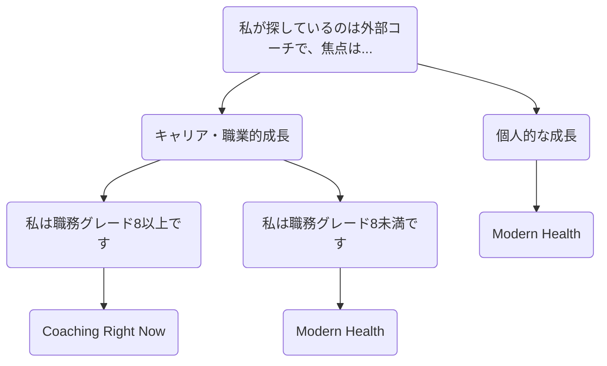

## GitLab におけるコーチング

GitLab では、コーチングを以下の目的で活用しています。

1. 自己省察、コミュニケーション、フィードバックの機会を提供する
1. チームメンバーが[顧客に成果をもたらす](/handbook/values/#results)ために必要なスキルを身につけられるよう支援する
1. [ハイパフォーマンス](https://internal.gitlab.com/handbook/company/high-performing-teams/)を達成するための戦略を実践するスペースを作る

コーチングの会話は流動的で動的な共同創造の行為であり、コーチとコーチーは対等なパートナーです。ピープルリーダーも個人貢献者も、[360度フィードバックプロセス](/handbook/people-group/360-feedback/)、[フィードバック](/handbook/people-group/guidance-on-feedback/)の提供と受け取り、[キャリア開発](/handbook/leadership/1-1/#career-development-discussion-at-the-1-1)の各段階など、様々な場面でコーチングを活用しています。

### コーチが必要または望ましい理由

コーチはパフォーマンス改善プランに入っているチームメンバーのための最後の手段、あるいはシニアリーダーだけのものという誤解があります。また、コーチングはシニアリーダーだけのためのものという誤解もあります。

コーチングを必要とする、またはコーチングから恩恵を受ける可能性がある理由の例を確認してください。このリストは完全ではありません。

1. ピープルマネージャーが自身のコーチングスキルとスタイルを開発し、チームのアカウンタビリティを構築している。
1. リーダーが四半期計画プロセスに透明性と効率性を加えたいが、どこから始めるべきかわからない。
1. 個人貢献者が自分のリーダーシップスタイルを定義し、キャリア成長の機会を計画したい。
1. チームメンバーがオープンで誠実なフィードバックの提供に焦点を当てたコミュニケーションスタイルを改善したい。
1. チームメンバーが緊急性と成果に基づいて仕事を優先順位付けするシステムを構築するためのガイダンスが必要。

## コーチの選び方

GitLab でコーチを見つけるにはさまざまな方法があります。

| コーチングタイプ | 説明 |
| ----- | --------------- |
| Coaching Right Now | 外部コーチによる専門的なコーチングは、[成長・開発ファンド](/handbook/people-group/learning-and-development/growth-and-development/#types-of-growth-and-development-reimbursements)を使用して、職務グレード8以上のマネージャーおよび個人貢献者向けに提供されています。GitLab の L&D チームによって審査されたコーチとチームメンバーをマッチングさせるための推奨ベンダーとして [Coaching Right Now](/handbook/people-group/learning-and-development/growth-and-development/#coaching-right-now) と提携しています。Coaching Right Now を使用したこのプログラムの詳細は[こちら](https://docs.google.com/document/d/188H3iuIY9JwE4kmAeoLobNz-e6j-rKie/edit?rtpof=true&sd=true)をご覧ください。|
| [Modern Health](/handbook/total-rewards/benefits/modern-health/) | Modern Health 従業員支援プログラムを使用することで、すべてのチームメンバーに専門的なコーチングが提供されます。Modern Health のコーチは、職業・キャリア、メンタルヘルス、財務コーチングを専門としています。|
| マネージャーコーチング | あなたのマネージャーは将来の目標に向けてあなたを導くコーチになれます。マネージャーがコーチとしての役割を担えることを確認してください。ただし、コーチングは 1on1 ディスカッションでマネージャーと行うインタラクションの一種でもあります。|
| 代替プロフェッショナルコーチ | 何らかの理由で Coaching Right Now や Modern Health を通じて提供されるコーチがニーズに合わない場合、職務グレード8以上のチームメンバーは代替外部コーチを求めて承認を得ることができます。|

## コーチはどのようにコーチングするか

コーチはチームメンバーが強みと成長分野を認識しながら、未来に注意を向けられるよう支援します。コーチはコーチーが自分の可能性を引き出し、望む成果を特定し、目標を達成するのを助けます。

コーチの主要な特性には次のものがあります。

1. 学習や洞察を深めるための強力な質問をする。
1. コーチーが自分の強みと未活用の可能性を認識できるよう支援する。
1. コーチーが自分の選択に基づいて行動するよう促す。
1. コーチーが約束した行動に対するアカウンタビリティを持つ。
1. コーチーに完全に集中する。
1. サポートを提供しながら深く聴く。

### コーチングの必須スキル {#essential-coaching-skills}

効果的なコーチはコーチング会話を可能にするための特定のスキルセットを使用します。これらのスキルには次のものが含まれます。

{}
強力でオープンエンドな質問をすることです。コーチングは教えることではなく、尋ねることから来ており、チームメンバーが自分の解決策を生み出せるよう支援します。コーチングは個人から洞察を「引き出す」ことを目的としています。

**質問の組み立て方**

- オープンエンドな質問をする。良い質問は「何」または「どのように」で始まります。行動に関する質問に移るとき、「誰が」と「いつ」も役立ちます。
- 一度に一つの質問。会話の一つの要素に焦点を当てた一つの質問に注意を向ける。
- 質問を簡潔にする。
- コーチーのアジェンダに沿う。自分がいるべきと思う場所ではなく、彼らがいる場所を反映する質問を選ぶ。
- 許可を求める。相手に挑戦したい場合、または相手がそうでなければ持っていないかもしれない提案や洞察を与えたい場合は、許可を求める。

**質問で避けること**

- クローズドな質問は避ける - 思考を閉じてしまう可能性があります。「それは...あなたは...あなたは持っていますか...そこにありますか？」などの質問を避ける。
- なぜという質問 - これはコーチーを防御的にさせ、コーチからの学習を妨げる可能性がある。
- 質問の形を取った誘導質問、発言、意見。これはコーチーを自分が行くべきと思う場所に向けるものですが、コーチーは自分の結論に達したときにより行動にコミットします。
- 古くなった質問 - セッションの開始時に考えたが、もはや関連性がなくなった質問をすることを避ける（もし質問するための適切なタイミングを待っていることに気づいたら、もう聴いていないサインかもしれません）。
{}

{}
聴くことはオープンさと好奇心を可能にします。また、コーチーに完全に存在していることを伝えます。優れた質問をするためには、完全に聴く必要があります。

**コーチのように聴く**

- 身体的、精神的、感情的に存在する（画面を閉じてコーチーに完全に注意を向ける）。
- 他のコーチーに集中する。
- 好奇心を持ち、判断なしに聴く。
- コーチーが質問を処理しているとき、沈黙のための時間を与える。
- ビデオチャットを通じてボディランゲージに注意を払う：カメラ目を合わせ、微笑み、頷くなどのジェスチャーをして存在を示し、議論に身を乗り出す。
- 焦点を提供し、コーチーのために明確にしようとする。
- 判断なしに、観察を提供し、聴いていることを示し、相手の洞察を深めるための鏡を掲げる。
- 判断なしに、コーチーに新たな機会を開くかもしれない制限的な信念に直面するか挑戦する。

**何を聴くか**

- 声のトーン
- 話すペースとエネルギーの変化
- バーチャルなボディランゲージ
- 言葉の選択
- 包括的なテーマまたはコーチーが繰り返し戻ってくること
- 根底にある信念と仮定
- 盲点
- 個人の価値観と何が最も重要か
- ポーズと沈黙
{}

{}
コーチーの強みを特定して信頼を構築し、情熱を示して励ます。オープンになり、個々のチームメンバーの強みを基盤にしましょう。気づいたことを振り返り、コーチーへの影響を判断して[フィードバック](/handbook/people-group/guidance-on-feedback/)が届いているかを確認します。

**いつ励ますか**

- コーチング会話の始まりに、達成した進捗や成果を認める。
- 会話中に、コーチーがつながりを作ったり新たな洞察を得たりしたとき認める。
- ブレインストーミング中に、誰かがコンフォートゾーンを超えて伸びたとき認める。
- 行動計画時に、変化へのコミットメントを認める。

**励ますための練習戦略**

- 承認する：コーチーに焦点を当てる - 人として誰であるか、生活の中で何を成し遂げたか、内なる性格。コーチーに独自性を感じさせ、際立たせているものを認識していることを伝える。
- 感謝する：他者への行為の肯定的な影響と貢献に焦点を当てる。
- 称賛する：行為に焦点を当てる - 人々が行うこと - [成果](/handbook/values/#results)、[透明性](/handbook/values/#transparency)、[効率](/handbook/values/#efficiency)、[インクルージョン](/handbook/company/culture/inclusion/)、パフォーマンス。
{}

{}
コーチーにコンフォートゾーンを超え、バーを上げ、より大きな役割を担うよう挑戦しましょう。コーチとしての役割は、何が可能かというより大きな絵を描くことです。優れた挑戦はコーチーにコンフォートゾーンの限界を検討し、それを超えるよう刺激します。

**いつ挑戦するか**

- コーチーがコンフォートゾーンにとどまっていたり、長すぎるほど安全策を取っていたとき。
- 速いペースで動き、挑戦を楽しむコーチー。
- コーチーの自己信頼を高め、何が可能かという認識を広げるために。
{}

{}
判断なしに相手に集中します。コーチーに完全な注意を向けましょう。バーチャルコーチングセッション中は他のプログラムを閉じてください。何が機能しているか、何が機能していないかを特定することで、オープンで好奇心旺盛になりましょう。身体的、精神的、感情的に本当に存在しましょう。

**存在するための戦略**

- 頷くなどのジェスチャーをして存在を示す。
- 自分の焦点、注意、エネルギーを分散させているすべての先入観から自分の心を空にする。
- オープンで好奇心旺盛で感謝的なマインドセットに自分を根付かせる。
- コーチー、自己、コーチングプロセスについて何か感謝できることを探す。
- コーチング会話への自分の意図に自分を根付かせる。
{}

### 異なる会話への異なる帽子

コーチングは[リーダー](_index.md)として使用するかもしれない会話の一つのモードに過ぎません。あなたはエンジニアリングプログラムを運営するチームリードかもしれません。[TMRG の一つを管理](/handbook/company/culture/inclusion/tmrg-tmag/)しているかもしれません。[メンターになる](/handbook/people-group/learning-and-development/mentor/)か[オンボーディングバディになる](/handbook/people-group/general-onboarding/onboarding-buddies/)かもしれません。また、あなた自身も他の誰かの直属部下です。これらの役割を「異なる帽子をかぶる」として考えてください。

一日の中で複数の帽子をかぶることがあります。

1. **マネージャーの帽子** - 指示的になり、チームにタスクを割り当てる。
1. **教師の帽子** - 知識と専門知識を伝えて他者のスキルを育てる。
1. **メンターの帽子** - 自分の経験からアドバイスと指針を共有する。
1. **コーチの帽子** - 質問をして深く聴き、チームメンバーが解決策に達するのを助ける。

<figure class="video_container">
<iframe src="https://docs.google.com/presentation/d/e/2PACX-1vTadK6g9lEwLV8nP9GWPrgcF7sRHxycOuLwlZQm_h05D_FJpC3T9JzGUB7FmZY0UyW-ii4IfP0groBd/embed?start=true&loop=false&delayms=3000" frameborder="0" width="500" height="769" allowfullscreen="true" mozallowfullscreen="true" webkitallowfullscreen="true"></iframe>
</figure>

### 信頼とコーチング

信頼の構築はコーチングとチームダイナミクスにおける重要な要素です。信頼は機能的で結束したチームの核心にあります。[Patrick Lencioni によると](https://www.youtube.com/watch?v=GCxct4CR-To)、チーム全体の信頼を崩す5つの機能不全があります。

1. **信頼の欠如：** チームメンバーは互いに脆弱になることを躊躇し、自分の間違い、弱点、または助けを必要としていることを認めようとしない。
1. **対立への恐れ：** 信頼の欠如により、タスク、活動、プロジェクトについての熱情的で率直な議論の流れが妨げられる。これらの会話はすべての声が聞かれ、すべての選択肢が検討されることを確かめるために不可欠です。
1. **コミットメントの欠如：** 何らかの対立がなければ、チームメンバーは決定にコミットすることが難しく、曖昧さが支配する環境を作り出す。強いコミットメントを持つチームはより多くの努力をする可能性が高い。
1. **アカウンタビリティの回避：** チームが明確な行動計画にコミットしないとき、最も集中力があり意欲的な個人でさえ、反生産的に見える行動や振る舞いに対して同僚に異議を唱えることを躊躇する。
1. **結果への不注意：** 誰もアカウンタブルでない場合、チームメンバーは自然にチームの集合的な目標よりも自分自身のニーズ（例：キャリア開発や認知）を優先する傾向があるかもしれない。

<figure class="video_container">
<iframe src="https://docs.google.com/presentation/d/e/2PACX-1vQwmhv3MIUV4065TeQ4N1Lz4xhjROQRTaTW2XNa5qH4k-mq4GNLgRYhi2fr2hjZslZ7V8JBipbvuaBv/embed?start=true&loop=false&delayms=3000" frameborder="0" width="700" height="569" allowfullscreen="true" mozallowfullscreen="true" webkitallowfullscreen="true"></iframe>
</figure>

#### 信頼の方程式 {#the-trust-equation}

**[信頼の方程式&trade;](https://trustedadvisor.com/why-trust-matters/understanding-trust/understanding-the-trust-equation#:~:text=The%20Trust%20Equation%20uses%20four,%2C%20Intimacy%20and%20Self%2DOrientation.&text=The%20Trust%20Quotient%20is%20a,trustworthiness%20against%20the%20four%20variables.)** はチームの信頼性を高めるための概念です。チームメンバーとの信頼が高ければ高いほど、コーチングの会話は容易になります。

信頼の方程式は信頼性を測定するための4つの客観的な変数を使用します。

| 客観的変数 | 測定 |
| ----- | ---------- |
| **信頼性：** | 私の言葉は信頼できます。簡単に言えば、信頼性は「あなたが言うこととあなたが他者にとってどれほど信頼できるか」を評価します。言い換えれば、他者にリードに従ってもらいたいなら信頼できることが必要です。|
| **信頼性：** | 私は言ったことをします。信頼性は「行動と、あなたがどれほど信頼できるように見えるか」を測定します。あなたは頼りにできますか？人々はリーダーが約束を果たすことを知る必要があります。|
| **親密さ：** | 私は他者に共感します。親密さは「人々があなたと情報を共有することがどれほど安全かを考慮します。」機密情報が提示されたときは、それを守る必要があります。|
| **自己志向：** | 私の焦点は個人的な利得ではなく、チームにあります。自己志向は自己または他者への個人的な焦点です。自己への焦点が強すぎると信頼性の程度が下がります。|

信頼の方程式には分母（自己志向）に一つの変数と分子（信頼性、信頼性、親密さ）に三つの変数があります。分子の要素の価値を増加させると信頼の価値が増加します。分母（自己志向）を増加させると信頼の価値が減少します。

<figure class="video_container">
<iframe src="https://docs.google.com/presentation/d/e/2PACX-1vQ7oRKaXPc3-pqXJEU5SHdlBJlHw00HO4oOcfmH5z0Iq0ojz-lQ1HoudBSeUoHlQNQfUZf_4UoCyObR/embed?start=true&loop=false&delayms=3000" frameborder="0" width="960" height="569" allowfullscreen="true" mozallowfullscreen="true" webkitallowfullscreen="true"></iframe>
</figure>

#### 信頼の神経科学

神経科学の研究では、認識は[目標が達成された後](https://hbr.org/2017/01/the-neuroscience-of-trust)に生じるとき、信頼に最大の効果があることを示しています。信頼の神経科学は、チームメンバーが共感を高め、効率的に計画し、脅威と恐怖の反応を減らすのに役立ちます。

<figure class="video_container">
<iframe src="https://docs.google.com/presentation/d/e/2PACX-1vSxZWO97gkIShmnZ-Ue7C9tbHVMT9BcuUx643pcGKrV29EQiXnpZ6yzTIZIuCUscwhTsT5ZoR6Gn-ZL/embed?start=true&loop=false&delayms=3000" frameborder="0" width="760" height="569" allowfullscreen="true" mozallowfullscreen="true" webkitallowfullscreen="true"></iframe>
</figure>

#### 信頼のリターン

[Accenture の研究](https://bankingblog.accenture.com/the-importance-of-building-trust-in-the-financial-services-workplace-explained-in-6-eye-opening-statistics)によると、低信頼の企業の人々と比較して、高信頼の企業の人々は以下を報告しています。

1. 仕事でのエネルギーが106%増
1. エンゲージメントが76%増
1. 生産性が50%増
1. 仕事の満足度が60%増、生活の満足度が29%増
1. 会社のビジョンとの一致度が70%増
1. ストレスが74%減
1. バーンアウトが40%減

#### 信頼構築に関する追加リソース

1. [信頼の構築と再構築 - TED Talk](https://www.ted.com/talks/frances_frei_how_to_build_and_rebuild_trust?subtitle=en)
1. [チームに新しく加わった？リモートで信頼を築く方法 - Harvard Business Review](https://hbr.org/2021/03/new-to-the-team-heres-how-to-build-trust-remotely)

### ウィルとスキル

ウィルとスキルは、チームメンバーのウィルとスキルに基づいてコーチングするために使用できるフレームワークです。ウィルはチームメンバーの仕事への動機付けとエンゲージメントを反映しています。スキルはタスクを実行する能力を反映しています。いずれかのカテゴリが高いまたは低いことで評価されると、チームメンバーは4つの象限の一つに分類され、それぞれ異なる方法でコーチングと管理ができます。

- [Persinio のウィルとスキルマトリックスガイド](https://www.personio.com/hr-lexicon/skill-will-matrix-defined/)
- [AIHR のウィルとスキルガイド](https://www.aihr.com/blog/skill-will-matrix/)
- [WhatFix のウィルとスキルブログ](https://whatfix.com/blog/skill-will-matrix/)
- [MindTool のウィルとスキル動画](https://www.youtube.com/watch?v=4DAk7fjai6c)
- [OMT Global のウィルとスキル動画](https://www.youtube.com/watch?v=KkkGt15-qtc)

### 内なるフィクサーを管理する {#managing-your-inner-fixer}

効果的にコーチングするためには、内なるフィクサーを管理することが重要です - 内なるフィクサーは必死に「伝えたい！」のです！コーチの役割は、チームメンバーが新しい習慣を開発し、新しい関与の方法を探求し、自分の最善を尽くすために何が必要かを見つけるのをサポートすることです。このアプローチは、教えることよりも多くのコーチングが必要です。指示を与えるよりも多くのサポートが必要です。

- [コーチとしてのリーダー](https://hbr.org/2019/11/the-leader-as-coach)
- [修正をやめてコーチングを始める](https://baird-group.com/stop-fixing-start-coaching/)
- [コーチングで：正しい質問をすることはすべての答えを持つことよりも重要ですか？](https://www.fourstreamscoaching.com/in-coaching-is-asking-the-right-questions-more-important-than-having-all-the-answers/)

## GROW モデル {#grow-model}

GROW モデルは、コーチーとコーチングの会話を行うための4ステップの方法です。コーチングセッション中に適用して、コーチーを未来志向の議論を通じて導くことができます。

**G - Goals（目標）：** 成功を促進し、エネルギーと動機を高める感動的な目標を特定します。

**R - Reality（現実）：** 現在の状況と将来の目標を達成するために現在存在する障壁について議論します。

**O - Options（選択肢）：** 前進するための選択肢を探ります。

**W - Way Forward（前進の道）：** コーチーへのアカウンタビリティを設定するための具体的なアクションと時間枠に合意します。

<figure class="video_container">
<iframe src="https://docs.google.com/presentation/d/e/2PACX-1vRyDezAdhbc9k5YOQmkUxCxkroz-yR6dpX1CoevIULZM10DcYLy_hBo3yQGlHPUgzPrAxZmNzR7Qjwj/embed?start=true&loop=false&delayms=3000" frameborder="0" width="760" height="569" allowfullscreen="true" mozallowfullscreen="true" webkitallowfullscreen="true"></iframe>
</figure>

## コーチーの特性

コーチがコアコーチングスキルを使用するとき、コーチーは以下を通じてコーチング会話を最大限に活用するための自分自身のスキルとアクティビティにアクセスできます。

1. **存在する**：コーチが存在しているように、コーチーも会話に存在し、注意を払い、可能性に対してオープンで、完全にエンゲージする必要があります。
1. **振り返る**：コーチーはコーチング会話を通じて強力な質問によって振り返り、考え、熟考し、思案するよう招かれます。
1. **視覚化する**：コーチーは自分の想像力の力を活用し、望む将来の成果の絵を心の中に描いて成功の可能性を高めることができます。
1. **学ぶ**：コーチング会話は、新しい理解や認識に至ることで新しい視点を発見することによる学びを中心に回っています。
1. **変容する**：変化はコーチングの核心的な特性です。時には、コーチーが前進するための適切な行動についての明確さが増したとき、変容は小さいかもしれません。時に変容はより深遠であることがあり、コーチーが後戻りできないような方法でマインドセットを変える場合があります。

## コーチング会話

### 行動計画

行動計画フェーズは、コーチーが目標をサポートする行動ステップを持つ計画を立てられるようにすることについてです。

**行動計画の方法：**

- コーチーは自分自身のために設計した行動にコミットし、アカウンタブルです。
- コーチはブレインストーミング、探究、要求、挑戦、またはバーを上げるかもしれませんが、最終的にはコーチーが行動ステップを設計する責任を持ちます。
- コーチーへのコーチのアクションはコーチーのアジェンダのためのものです。
- コーチはコーチーが達成する結果に必ずしも執着していなくてもよい。
- アクションはコーチーにとって重要なこと、達成したい変化に根付いています。コーチはコーチーの行動ステップと全体的な変化アジェンダに対するパフォーマンスについてアカウンタブルであるべきです。

コーチングの帽子をかぶりながら行動計画をするとき、あなたは評価したり、判断したり、自分のアジェンダを推し進めたりはしていません。コーチーは最終的に行動ステップを決定し、自分の前進の道にコミットすべきです。コーチとして、あなたは[GitLab のバリュー](/handbook/values/)を守りながら好奇心旺盛で非判断的です。

#### 行動計画の質問例

- ....するために取れる3つの次のステップは何でしょうか？
- 何をするつもりですか？それをいつするつもりですか？どのようにしてわかりますか？
- ...についてもっと知りたい、見つけたいことは何ですか？
- どのようなサポートが必要ですか？誰から？
- 私のリクエストは今週、あなたが...することです。それはうまくいきますか？
- 私はあなたに...するよう挑戦します。どう思いますか？
- どのような方法でフォローアップしてほしいですか？

### コーチング会話の終わり方

コーチングセッションが完了したとき、次のように質問して目標と成果を振り返ることが重要です。

- あなたは___について話したかった、この会話はあなたにとってどのように役立ちましたか？
- この会話から何を持ち帰りたいですか？

コーチはまた、このセッションが思い出させてくれたことと、コーチーに本当に感謝していることについてのいくつかの発言で会話を終わらせることもできます。コーチングはエンパワーすることについてです。チームメンバーが自己信頼と自己価値を高め、バランスを取るのを助けています。

- 私たちの会話から本当に感謝することは...
- 私があなたに感嘆することは...
- あなたが私に気づかせてくれたこと、学んだこと、または思い出させてくれたことは...

### 追加のコーチングスキル

- 大局的な視点の提供
- メタファーの使用
- ブレインストーミング
- 可能なことの魅力的な絵を作る
- チャンピオニング
- 挑戦すること
- 根底にある制限的な信念、仮定、マインドセットを特定する
- [対立管理のヒント](/handbook/leadership/managing-conflict/#8-tips-for-managing-conflict)

## チームメンバーリレーションズ

コーチングがうまくいかない場合、GitLab のチームメンバーリレーションズグループがサポートします。マネージャーが最初にすべきことは、アラインされたチームメンバーリレーションズパートナーに連絡して状況を確認し、行動計画で協力することです。
その行動には、口頭および文書化された追加コーチングが含まれます。

チームメンバーの行動がパフォーマンス Issue 以上に問題となり、真の行動上の懸念事項になるときがあります。チームメンバーがそのような行動に従事したと疑われる場合は、そのチームメンバーをハイパフォーマーと考えているかどうかに関わらず、チームメンバーリレーションズに即座に連絡してください。

- [LDR 102 パフォーマンス不足](https://www.youtube.com/watch?v=nRJHvzXwXBU&t=1s)
- [パフォーマンス不足の管理 ハンドブックインタビュー](https://www.youtube.com/watch?v=-mLpytnQtlY)

## ライブラーニングセッション

Manager Challenge Pilot の第2週に、[信頼の構築](/handbook/leadership/building-trust/)とコーチングをカバーするコースが開催されました。[スライドデッキ](https://docs.google.com/presentation/d/1PT8x7lUR0-X-M_H7n_tvYKsC1HRtKTiMy0BtmtPcO4Q/edit?usp=sharing)と[会議アジェンダ](https://docs.google.com/document/d/1eHhOfgqllzAiGOf6gI98wegaxm5-8eLnZ8Qpq7KOLaY/edit?usp=sharing)がセッションに沿っています。

2回のセッションのうち最初の録画はこちらです。



### コーチングへの入門



2020年12月3日に、50分間のコーチングへの入門[ライブラーニング](/handbook/people-group/learning-and-development/#learning-delivery-methods---definitions)セッションを開催しました。録画は[スライドデッキ](https://docs.google.com/presentation/d/1jOAZQkIJq9iU7ho6a09AOANKJs7W7IwnbVYBIlX9kmk/edit?usp=sharing)と[アジェンダ](https://docs.google.com/document/d/1UIyIeyCcWCtNcOR2Wz5jvbSdKHI2OanLoM-WR7Gtknw/edit?usp=sharing)に沿っています。

## コーチング マネージャーコンピテンシー

オールリモートの組織において、コーチングはマネージャーがキャリアを通じて開発・向上させるべき重要なスキルです。コーチングは、定期的なコーチング会話を通じてチームメンバーのキャリア開発を促進するのに役立ちます。コーチングはチームメンバーが行動を変え、パフォーマンスを改善し、励まし、サポート、協調的な問題解決、目標設定、[フィードバック](/handbook/people-group/guidance-on-feedback/)を通じてコミットメントを維持するのを助けます。

**マネージャーのための[コーチングコンピテンシー](/handbook/people-group/competencies/)のスキルと行動：**

- チームメンバーの職務パフォーマンスの成長を促進するために定期的なコーチングセッションを提供する
- チームメンバーの長期的なキャリア目標を理解し、それを達成するためのメンターとガイドとして行動する
- チームメンバーと継続的に開発とキャリア計画のダイアログを行う
- リーダーシップスタイルとチームおよびチームの状況への影響を振り返る
- 新しいコーチングアプローチと技術を求め、スキルを継続的に開発することの意味を体現する
- [パフォーマンス不足](/handbook/leadership/underperformance/)のケースに対処するための効果的な戦略を提供し、組織全体の他のリーダーにそれを浸透させる

### 追加のコーチングリソース

- [コーチとしてのリーダー - Harvard Business Review 記事](https://hbr.org/2019/11/the-leader-as-coach)
- [コーチはあなたのために何ができますか？ - Harvard Business Review 記事](https://hbr.org/2009/01/what-can-coaches-do-for-you)
- [リモート従業員をコーチングするための4つのヒント](https://insideoutdev.com/blog/4-Tips-for-Coaching-Remote-Employees)
- GROW、CLEAR、OSCAR を含む[コーチングモデル](https://www.businessballs.com/coaching-and-mentoring/)の概要と比較
- GROW モデルの代替として[CLEAR コーチングモデル](https://www.youtube.com/watch?v=m2KVZzCMJd0)に関する10分間の動画
