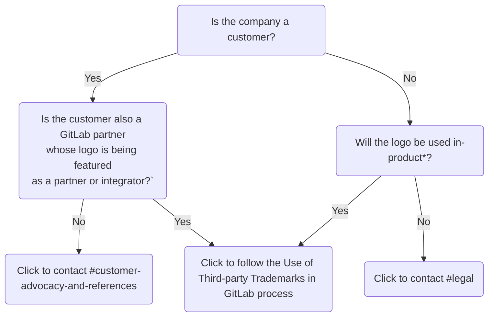

## 適用範囲

これらのガイドラインは、GitLab 製品における第三者商標の使用に適用されます。GitLab のウェブサイト、マーケティングや販売資料、またはその他の顧客向けや公開向け資料における第三者商標の使用は、これらのガイドラインの対象外です。公開向け資料における第三者商標の使用に関するガイダンスは、[外部資料における第三者 IP の使用に関するガイドライン](/handbook/legal/ip-public-materials-guidelines/)を参照してください。

GitLab 製品における第三者商標の使用に関する一部のリクエストは Customer Advocacy チームがレビューし、他のリクエストはこのプロセスに従い Legal がレビューします。これは、ロゴが GitLab の顧客/パートナーが所有するものかどうか、または製品内でロゴが使用されるかどうかによって異なります。下の図を参照してください:

`*` *製品内*とは、ロゴが GitLab.com とセルフマネージドの両方に表示されることを意味します。GitLab.com のみに表示される場合は、製品内ではありません。

## 商標とは何か？

登録商標は、*GitLab* のような文字のみの（「**ワードマーク**」）、または[GitLab Tanuki](/images/press/logo/png/gitlab-icon-rgb.png) のような画像（「**ロゴマーク**」）のいずれかです。ワードマークとロゴマークが組み合わさってロゴを形成することもあります。これらのガイドラインはワードマーク、ロゴマーク、ロゴに適用されますが、一部はロゴマークとロゴのみに適用されます。簡潔さのため、これらのガイドラインを通じて*ロゴ*への言及はロゴマークとロゴの両方を指します。

商標（ロゴ、会社名、製品名、サービス名を含む）は商標所有者の財産です。所有者の許可なしに第三者の商標を使用することは商標侵害を構成する可能性があり、GitLab が責任を負う可能性があります。GitLab 製品に第三者商標を追加する際には、これらのガイドラインに従って商標侵害のリスクを最小限に抑えてください。

## 第三者商標の公正使用

特定の限られた状況において、所有者の許可なしに商標を使用することが認められる場合があります。これは商標の*公正使用*と呼ばれることがあります。

第三者商標の使用が*公正使用*を構成するためには、以下の**すべての**基準を満たしている必要があります:

- 該当する会社、製品、またはサービスをその商標を使用せずに特定することができない。
- 会社、製品、またはサービスを特定するために必要な最小限の商標のみが使用されている。これは、ロゴを使用することは通常公正使用を構成しないことを意味します。例えば、ワードマーク *GitLab* を使用するだけで GitLab を特定できるため、[GitLab のロゴ](/images/press/logo/png/gitlab-logo-gray-rgb.png)を使用する必要はありません。
- 商標の使用が所有者によるスポンサーシップまたは承認を示唆していない。

## GitLab に第三者商標を追加するプロセス

新しい第三者商標を GitLab に追加する場合、または既に承認された第三者商標を新しい目的で GitLab に使用する場合は、以下の手順に従ってください。

1. **提案された使用が禁止事項と推奨事項に準拠しているかどうかを確認します。**
    - Legal は、これらのガイドラインに定められた[禁止事項と推奨事項](/handbook/legal/policies/product-third-party-trademarks-guidelines/#dos--donts-for-use-of-third-party-trademarks-in-gitlab)に準拠していない第三者商標の使用リクエストを承認しません。
1. **提案された商標と使用が既に承認されているかどうかを確認します。**
    - Legal は[第三者商標トラッカー](https://docs.google.com/spreadsheets/d/1fa4pzDgbtXSbjw1hex-jouoYu_NDwHpwQwJMbcBHmI4/edit?usp=sharing)を管理しており、GitLab での使用が承認された商標と使用法が記載されています。このトラッカーを検索して、追加を提案している商標と提案された使用が既に承認されているかどうかを確認してください。
        - 追加しようとしている商標が以前に承認されていても、提案された使用が承認されていない場合、またはトラッカーによれば商標と使用が以前にレビューされていない場合は、新しい承認が必要です。
        - 追加しようとしている商標と意図する使用が既に承認されている場合は、Legal の承認を再度求める必要はありません。不明な場合は、Slack の #legal に連絡してください。
        - 商標の公式アセットやガイドラインを入手する必要がある場合は、リクエストの方法を決定するために、ステップ5で作成した Issue で先に Legal に相談してください。
1. **提案された使用が*公正使用*を構成するか、または商標所有者の公開ガイドラインの下で許可されているかどうかを検討します。**
    - *公正使用*を構成する**ワードマーク**のプレーンテキストを GitLab に追加する場合、Legal の承認は不要です。[公正使用の基準](/handbook/legal/policies/product-third-party-trademarks-guidelines/#fair-use-of-third-party-trademarks)はこれらのガイドラインで上述されています。提案された使用が*公正使用*を構成するかどうか不明な場合は、続行する前に[新しい Legal Issue](https://gitlab.com/gitlab-com/legal-and-compliance/-/issues/new?issuable_template=general-legal-template) を作成して Legal と相談してください。
    - *公正使用*を構成しない目的で**ワードマーク**を追加する場合、または製品内で第三者ロゴを使用する場合は、商標所有者の公開商標ガイドラインを確認して、これが GitLab に意図どおりの商標使用を許可するライセンスを付与するかどうかを判断してください。
        - 商標ガイドラインが意図どおりの使用を許可している場合は、このプロセスの次のステップに進んでください。
        - 商標ガイドラインが意図どおりの使用を許可していない場合、またはガイドラインを見つけられない場合は、このプロセスの次のステップに進み、ステップ5で作成する Issue でこれを Legal に伝えてください。
1. **新しい商標の詳細と提案された使用をトラッカーに追加します。**
    - ステップ5で Legal に連絡する前に、[第三者商標トラッカー](https://docs.google.com/spreadsheets/d/1fa4pzDgbtXSbjw1hex-jouoYu_NDwHpwQwJMbcBHmI4/edit?usp=sharing)に新しい商標または提案された使用についてできるだけ多くの詳細を追加してください。
1. **新しい第三者商標承認 Issue を作成します。**
    - [第三者商標承認 Issue テンプレート](https://gitlab.com/gitlab-com/legal-and-compliance/-/issues/new?issuable_template=thirdparty-trademark-approval)を使用して、提案された商標または意図する使用について Legal からの承認を得るための新しい Issue を作成してください。
1. **商標を SVGs プロジェクトに追加します。**
    - Legal が商標の使用を承認したら、[SVGs プロジェクトの第三者ロゴリポジトリ](https://gitlab.com/gitlab-org/gitlab-svgs/-/tree/main/illustrations/third-party-logos)に新しい商標の `.svg` ファイルを追加するマージリクエストを作成してください。
1. **将来の製品内第三者商標使用リクエストについてこのプロセスの改訂を確認します**
    - 新しい第三者商標を GitLab に追加する場合、または既存の商標を新しい目的で使用する場合は毎回、最新のプロセスに従っていることを確認するためにこれらのガイドラインとプロセスを参照してください。

## GitLab における第三者商標使用の禁止事項と推奨事項

GitLab で第三者商標を使用する際:

禁止事項:

- GitLab の製品、サービス、または機能の名前の一部として商標を使用しないこと。製品・機能の命名に関するガイダンスについては、[製品原則](/handbook/product/product-principles/#give-products-and-features-descriptive-not-distinctive-names)を参照してください。
- 所有者によるスポンサーシップまたは承認を示唆する方法で商標を使用しないこと。
- ロゴの場合は、商標をいかなる方法でも変更しないこと。GitLab の CSS に合わせるために第三者ロゴのアイコンや色、相互作用を変更する必要がある場合は、Legal に相談してください。
- ロゴの場合は、商標を他のシンボル、文字、画像、またはデザインと組み合わせないこと。

推奨事項:

- 商標は参照目的のみで使用すること。すなわち、他の会社、製品、またはサービスを参照するためにのみ使用し、他の目的では使用しないこと。
- 以下の場合には、商標所有者の公開商標ガイドラインを確認して提案された使用が許可されているかどうかを確認すること:
  - 提案された商標と使用が Legal によって既に承認されていない場合、または
  - 提案された使用が*公正使用*を構成しない場合。
- ロゴの場合は、商標所有者が課す適用可能な商標またはブランドガイドライン、またはその他の使用条件に準拠すること。
- ロゴの場合は、所有者のブランドアセットリポジトリまたは所有者が認可した別のソースから画像ファイルを入手すること。結果が元のものと視覚的に同一である限り、ファイル形式を変更したり、別のファイル形式でロゴを再作成したりすることができます。
- ロゴの場合は、[gitlab-svgs](https://gitlab.com/gitlab-org/gitlab-svgs) プロジェクトの [illustrations/third-party-logos](https://gitlab.com/gitlab-org/gitlab-svgs/-/tree/main/illustrations/third-party-logos) ディレクトリに画像ファイルを保存すること。
