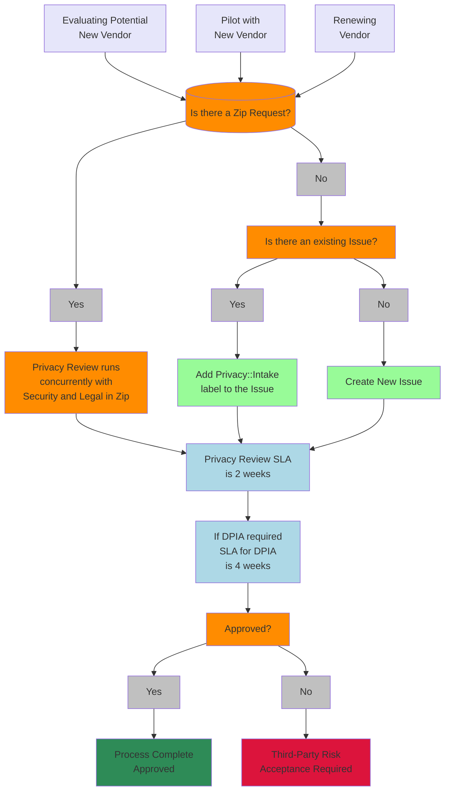

Privacy チームは Legal and Corporate Affairs チームの一部です。私たちは、GitLab の顧客、ユーザー、チームメンバー、およびその他の自然人に関連する個人データの保護に関して、一貫したビジネスプロセスを維持するためのサポートとガイダンスを提供しています。私たちは、GitLab のデータプライバシー慣行がクロスファンクショナルパートナーのニーズを満たし、常に変化するグローバルなデータプライバシーと保護の状況とバランスが取れるよう、クロスファンクショナルに協力し、advocateとして機能します。

## クイックリンク

- [データプライバシーとは何か](/handbook/legal/privacy/#what-data-privacy-means)
- [プライバシー用語](/handbook/legal/privacy/#privacy-terms)
- [ベンダープライバシーレビュープロセス](/handbook/legal/privacy/#privacy-review-process)
- [社内製品機能・リリースのプライバシーレビュー](/handbook/legal/privacy/#internal-privacy-review)
- [法執行機関のリクエストに関するガイドライン](/handbook/legal/privacy/law-enforcement-guidelines/)
- [顧客製品使用情報](/handbook/legal/privacy/customer-product-usage-information/) および [使用イベント FAQ](/handbook/legal/privacy/product-usage-events-faq/)

## プライバシーステートメントリンク

- [GitLab プライバシーステートメント](https://about.gitlab.com/privacy/)
- [GitLab Cookie ポリシー](https://about.gitlab.com/privacy/cookies/)
- [GitLab チームメンバープライバシー通知](/handbook/legal/privacy/employee-privacy-policy/)

## チームへのお問い合わせ

Slack チャンネル - #legal は、法的アドバイス、成果物、または機密情報の議論が不要な私たちのチームに関する質問に最適な場所です。

Privacy チームのアクションが必要な Issue には、`Privacy::Intake` ラベルを適用してください。これにより [Privacy Legal Issue Board](https://gitlab.com/groups/gitlab-com/-/boards/5278056) が更新され、チームが Issue を適切にトリアージできるようになります。また、以下のラベルも使用します:

- `Privacy::In Process` - Privacy チームが Issue に積極的に取り組んでいる場合
- `Privacy::Pending Requestor` - Privacy チームが、Issue を進める前にビジネスオーナーが満たす必要のある要件またはタスクがある場合
- `Privacy::Done` - Privacy チームが Issue の担当部分を完了した場合
- `Privacy::Attention` - 認識のみのため、アクション不要。

機密性の高い、プライベートな、または機密リクエストは legal_internal@gitlab.com にメールしてください。エンジニアリング、マーケティング、セールス、または調達リクエストについては、このアドレスにメールを送らないでください。これらは #legal に転送するか、[Legal and Compliance](https://gitlab.com/gitlab-com/legal-and-compliance) プロジェクトで Issue を作成してください。

## データプライバシーの意味

個人データについて何を行っているか、なぜ行っているかを人々に伝え、その人が許可するかどうかについて十分な情報に基づいた決定を下せるようにしてください。収集される個人データや使用方法について不気味な行動をとらず、最初に人々への通知と異議申し立ての機会を与えることなく（または必要な場合には事前の同意を得ることなく）個人データの使用方法を変更しないでください。人々がプライバシーの好みを伝えることを容易にし、時間の経過とともに変化しても、その好みを尊重してください。デフォルトでプライバシーに焦点を当てた設定がオンになっている製品またはサービスを構築し、消費者がいつ変更するかを決定できるようにしてください。透明性は中核的なバリューであり、すべてのチームメンバーは[プライバシーステートメント](https://about.gitlab.com/privacy/)と一致した個人データの適切な収集と使用に責任があります。

## プライバシー用語

プライバシー用語の定義

***匿名化*** 個人データを特定の個人に関連付けることができなくなるように、永続的かつ取消不能な方法で変更するプロセス。

***同意*** 個人の自由に与えられた、特定の、情報に基づいた、明確な意思表示。同意は、データ収集の前または時点で個人データの処理への同意を意味する未チェックのチェックボックスまたはその他の明確な声明によって取得されます。

***データ分類*** リスクに基づいてデータの種類を決定する方法。詳細については、[GitLab セキュリティデータ分類標準](/handbook/security/policies_and_standards/data-classification-standard/)を参照してください。

***データコントローラー*** 個人データの処理の目的と手段を単独でまたは他者と共同で決定する自然人または法人、機関、またはその他の事業体。例えば、GitLab は、見込み客とリードの個人データが私たちの裁量のみで管理されるマーケティングと販売の分野でデータコントローラーです。GitLab はまた、雇用目的およびその他の福利厚生管理のためにチームメンバーから収集されたすべての個人データについてもデータコントローラーとして機能します。

***データプロセッサー*** データコントローラーに代わって個人データを処理する自然人または法人、機関、またはその他の事業体。GitLab は、顧客のインスタンスまたはネームスペースに固有の個人データを管理する場合、データプロセッサーとして機能します。GitLab は、顧客がサービス提供に提出するデータの最終的な所有者であり、契約がデータの処理に関する GitLab への顧客の指示となるため、これらの状況でプロセッサーとして機能します。

***データ主体*** 特定されたまたは特定可能な自然人。
<!-- vale handbook.Repetition = NO -->
***データ主体の権利*** 個人に関して処理された個人データまたは情報に関して個人に付与される権利。データ主体の権利はデータ主体のプライバシーと保護にとって不可欠であるため、これらの権利の多くは GDPR、CCPA、LGDP などのグローバルなプライバシー法の下で成文化されています。事業者が同意または正当な利益などの特定の根拠に基づいて個人データを処理する場合、データ主体は基本的権利の一つを主張することができ、事業者は法律上の義務に従って対応しなければなりません。付与される権利は国、地域、州によって若干異なります。GitLab はすべてのユーザーとチームメンバーを同様に扱い、特定のデータ保護法のない国、地域、または州/省に住んでいる個人ユーザーまたはチームメンバーからのデータ主体リクエストにも対応します。以下のセクションを展開して、利用可能なデータ主体の権利についての詳細情報をご覧ください。

{}
**アクセス権** データコントローラーによって収集および使用された特定の個人データへのアクセスを求めるリクエスト。

**訂正権** 不正確または不完全な個人データの訂正を求めるリクエスト。

**削除権** データ主体に関連する個人データの消去を求めるリクエスト。削除リクエストは特定の条件を満たさなければならず、事業者は法的義務を果たすために処理される個人データ（請求の追求または防御において処理される可能性のあるデータを含む）を削除する必要はありません。

**ポータビリティ権** データ主体が自分のデータを別のデータコントローラーに移転したい場合のリクエスト。通常、個人が互換性のある電子ファイルシステムを共有するサービスプロバイダーを変更する場合に見られます。

**処理制限権** これはデータコントローラーに特定の状況下で個人データの処理を停止するよう求めるリクエストです。これには機密個人データの使用と開示を制限するリクエストも含まれる場合があります。

**異議申し立て権** すべてのデータ処理または同意や正当な利益に基づく個人データの特定の処理のオプトアウトリクエスト。一般的に、これはターゲット広告のための処理（プロファイリングや行動を横断したコンテキスト広告のための個人データの販売または共有を含む）からのオプトアウトリクエストです。

**完全自動化意思決定の対象にならない権利** これは、データ主体が重大な法的影響を及ぼす自動化処理（プロファイリングを含む）のみに基づく決定の対象にならないことを求めるリクエストです。例としては、特定の人種の人がクレジットカードを取得できなくなるアルゴリズムが挙げられます。

***DPIA*** データ保護影響評価は、特定されたプライバシーコンプライアンスリスク、および重大な損害の可能性をもたらすものを含む個人の権利と自由へのより高いリスクをレビューおよび文書化する方法です。DPIA の完了に関する GitLab のプロセスについては[こちら](/handbook/legal/privacy/dpia/)をご覧ください。

***個人データ*** 個別にまたは他のデータと組み合わせることで、直接的または間接的に識別可能な自然人（「データ主体」）を識別、関連付け、説明し、またはその合理的に関連付けられるまたはリンクされる可能性のあるすべてのデータ。機密個人データも参照してください。

***デフォルトでのプライバシー*** 製品開発段階で実装されるべき概念で、デフォルトでは処理される個人データが真に必要なものだけであることを確保するための適切な措置を使用します。実際には、ユーザーのプライバシー設定がデフォルト状態でプライバシーを優先することを意味します。

***プライバシーバイデザイン*** 基本的なプライバシー原則を組み込み、コントローラーとプロセッサーがデータ保護義務を果たせるように設計された製品を意図的に設計することに焦点を当てた概念。これには、仮名化や暗号化などの適切な技術的および組織的措置が含まれる場合があります。

***仮名化*** 個人データを、再識別情報を追加で使用しなければ特定の個人に帰属させることができなくなるように変更するプロセス。仮名化を成功させるためには、再識別情報は仮名化されたデータとは別に保管する必要があります。

***公開されている個人データ*** 連邦、州、または地方政府の記録から公開されている、またはデータ主体によって明示的に公開された個人データを指します。限られたデータプライバシー法の下では、広く配布されたメディアを通じてデータ主体によって公開された個人データも含まれる場合があります。

***機密個人データ*** 特に個人的で、人の核心的なアイデンティティと密接に結びついているデータ。このタイプのデータには一般的に、人種または民族的出自、政治的意見、宗教的または哲学的信念、労働組合員資格、遺伝子データ、生体データ、健康に関するデータ、性生活または性的指向に関するデータ、刑事犯罪、および市民権/移民状況が含まれます。一部の法域では、機密個人データには政府識別子と財務データが含まれます。
<!-- vale handbook.Repetition = YES -->

{}

## プライバシーレビュープロセス

個人データを取り扱うすべてのベンダーは、オンボーディング前にプライバシーレビューを受ける必要があります。これには、[調達プロセス](/handbook/finance/procurement/#privacy-review-4-14-days)に詳述されているプライバシーデューデリジェンスアンケートの完成と承認が含まれます。[データ分類標準](/handbook/security/policies_and_standards/data-classification-standard/)の下でレッドまたはオレンジのデータを取り扱うと分類される特定のベンダーは毎年レビューされます。さらに、新しい製品機能が設計されるとき、正式なプライバシーレビューが必要な場合があります。

このセクションでは、これらのレビューのプロセスを概説します。

## ベンダープライバシーレビュー

*第三者リスク受け入れについては、中程度/高度なリスクは VP 以上の承認が必要です*

## 社内プライバシーレビュー

社内製品機能・リリースのプライバシーレビュープロセス

新しい機能や既存の機能の変更が計画されるたびに、プロダクトマネージャーとエンジニアリングマネージャーは、計画された開発が個人データに関連する法的リスクをもたらすかどうかを評価してください。個人データが関係する場合は、[Legal Risk Checklist and Workflow](https://internal.gitlab.com/handbook/legal-and-corporate-affairs/legal-and-compliance/legal-risk-checklist/#product-and-feature-development---legal-risk-checklist)（*内部のみ*）を活用してください。

## プライバシートレーニング

GitLab チームメンバーは、世界中の一般的なプライバシー慣行をカバーする年次トレーニングの完了が義務付けられています。年次トレーニングの目標は、チームメンバーが個人データとは何か、そしてそれをどのように取り扱うかを理解し、GitLab が顧客が私たちに寄せる信頼を維持し、頻繁に変化する法的・規制上の義務に準拠し続けることを確保することです。
