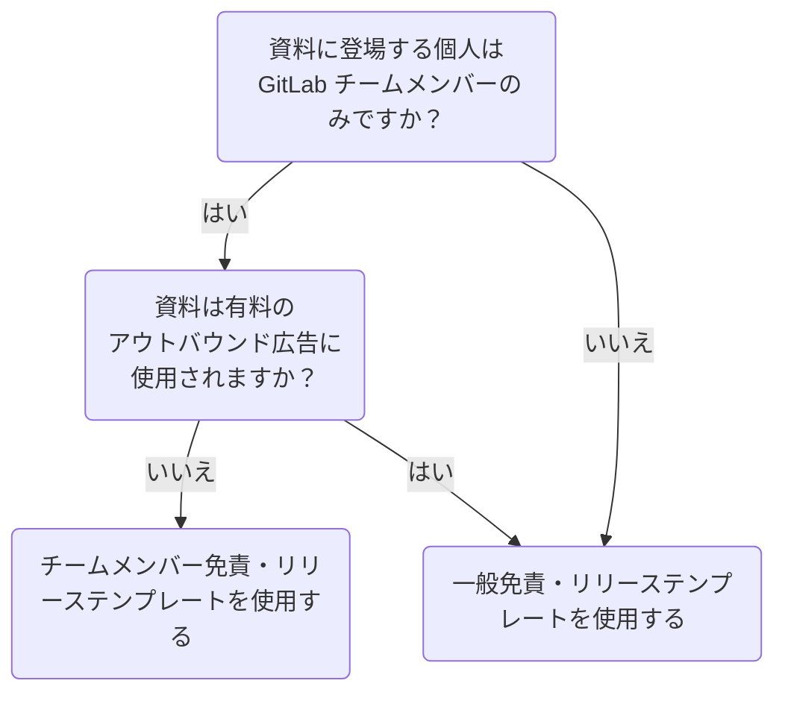

## パブリシティ免責・リリース契約は必要ですか？

以下の例外を条件として、リリースが必要な場合は以下のとおりです:

- チームメンバー、元チームメンバー、または非チームメンバーの氏名、画像、外見・容姿、声、または職業上の略歴情報（以下「**肖像**」）が[外部](/handbook/legal/materials-legal-review-process/#external-vs-internal-use)資料に使用され、その個人が特定可能である場合。
- GitLab が主催またはその代理での撮影・ビデオ撮影が、会議などの社内または社外イベントで行われる場合。

リリースが**不要**な場合は以下のとおりです:

- [チームのご紹介ページ](/handbook/company/team/)から取得した現在のチームメンバーの氏名、役職、写真を[外部](/handbook/legal/materials-legal-review-process/#external-vs-internal-use)資料で使用する場合。これは同ページから取得した元チームメンバーの写真の使用には適用されません。
- チームメンバーの公開GitLab プロフィール情報（氏名、GitLab ユーザー名、アバターを含む）を含む GitLab.com のスクリーンショットを使用する場合。
- チームメンバーの肖像を含む [AMA（なんでも聞いてください）](/handbook/communication/ask-me-anything/)を GitLab Unfiltered に[公開](/handbook/marketing/marketing-operations/youtube/#visibility)配信または公開する場合。

## リリーステンプレート

リリースが必要な場合、状況に応じて使用するリリーステンプレートが決まります:

- GitLab によるまたは GitLab の代理による撮影やビデオ撮影が行われるイベントを主催する場合は、[イベント撮影・ビデオ撮影肖像リリース](https://docs.google.com/document/d/11ihdyShiPngTZg9gtl2LvoU6Uixp2ohEE5mVQEv18NM/edit)を使用してください。
- その他のすべての状況については、以下のダイアグラムを参照して使用するリリーステンプレートを決定してください。

## チームメンバー免責・リリース

チームメンバーの場合、資料がアウトバウンド広告素材に使用**されない**場合は、チームメンバー免責・リリースを使用します。資料が有料アウトバウンド広告に使用される場合は、代わりに[一般免責・リリース](https://app.docusign.com/templates/details/0716de66-3f1e-4969-b305-4562b9af665d)を使用します。

各チームメンバーはチームメンバー免責・リリースに一度だけ署名すれば十分です。

チームメンバー一般パブリシティ免責・リリースを使用する DRI 向けの手順を展開する

1. [GitLab チームメンバー免責・リリーストラッカー](https://docs.google.com/spreadsheets/d/1fOENNDeCoAzXSdHIcD7GGJnwpUYL1qlqzwB1WbHrdlg/edit#gid=249560389)を検索して、資料に登場するチームメンバーとの間にすでにリリースが締結されているかどうかを確認します。すべてのチームメンバーとリリースが締結されている場合、必要なリリースはすでに締結されているため、追加のアクションは不要です。
1. リリースが締結されていない場合は、資料に登場するすべてのチームメンバーに[チームメンバー免責・リリースフォーム](https://docs.google.com/forms/d/1QACcbwfmEZzGSvBQ-UzPtQjsgduSxy5B5cV-C0DUmWs/edit)を送信します。
1. 資料に登場するチームメンバーがリリースを確認してフォームに記入します。
1. 資料に登場するすべてのチームメンバーがリリースに同意してフォームに記入したら、[トラッカー](https://docs.google.com/spreadsheets/d/1fOENNDeCoAzXSdHIcD7GGJnwpUYL1qlqzwB1WbHrdlg/edit#gid=249560389)でこれを確認します。

## 一般免責・リリース

チームメンバー以外の方全員に対しては、一般免責・リリーステンプレートを使用します。チームメンバーの場合、資料が有料アウトバウンド広告に使用**される**場合は、一般免責・リリーステンプレートを使用します。

一般免責・リリースを使用する DRI 向けの手順を展開する

1. DocuSign へのアクセス権がない場合は、[アクセスリクエスト](/handbook/security/corporate/end-user-services/access-requests/access-requests/)を開いて取得します。
1. DocuSign へのアクセス権を取得したら、[一般免責・リリーステンプレート](https://app.docusign.com/templates/details/0716de66-3f1e-4969-b305-4562b9af665d)にアクセスします。
1. `USE` をクリックします。
1. `Recipients` ページで:
   - `DRI` の下に、あなたの氏名と GitLab メールアドレスを入力します。
   - `Signatory` の下に、リリースへの署名が必要な資料に登場する個人の氏名とメールアドレスを入力します。
   - `Email Message` の下に、リリースの目的を説明し署名を依頼するメッセージを署名者に向けて入力します。
1. `NEXT` をクリックします。
1. 送信前に文書を確認したい場合は、右上隅の `Preview` ボタンをクリックします。
1. `SEND` をクリックします。
1. 署名者がリリースに署名すると、メールで通知されます。
1. 署名済みリリースを関連 Issue にアップロードします。Issue がない場合は、署名済みリリースのコピーを intellectualproperty@gitlab.com に送信します。
1. 資料に登場する各個人に対してこのプロセスを繰り返します。同じ資料のために10名以上の個人からリリースを取得する必要がある場合は、一括送信について [Slack の #legal](https://app.slack.com/client/T02592416/C78E74A6L) に連絡してください。

## イベント撮影・ビデオ撮影肖像リリース

イベントで写真やビデオを撮影する際は、参加者のネームバッジを撮影しないでください。またはそれらが映っている場合はぼかしてください。

GitLab によるまたは GitLab の代理による撮影やビデオ撮影が行われる社内外のイベントでは、まず黄色でハイライトされたフィールドに必要事項を記入したうえで、[イベント撮影・ビデオ撮影肖像リリース](https://docs.google.com/document/d/11ihdyShiPngTZg9gtl2LvoU6Uixp2ohEE5mVQEv18NM/edit)登録フォームの文言をイベント登録の利用規約の条項として含めてください。

また、[撮影・撮影通知ポスター](https://docs.google.com/document/d/11ihdyShiPngTZg9gtl2LvoU6Uixp2ohEE5mVQEv18NM/edit#bookmark=id.9bgkjm7gij8e)を、参加者に撮影・録画が行われていることを通知するため、イベントスペース全体、または GitLab ブースに適切に掲示してください。
