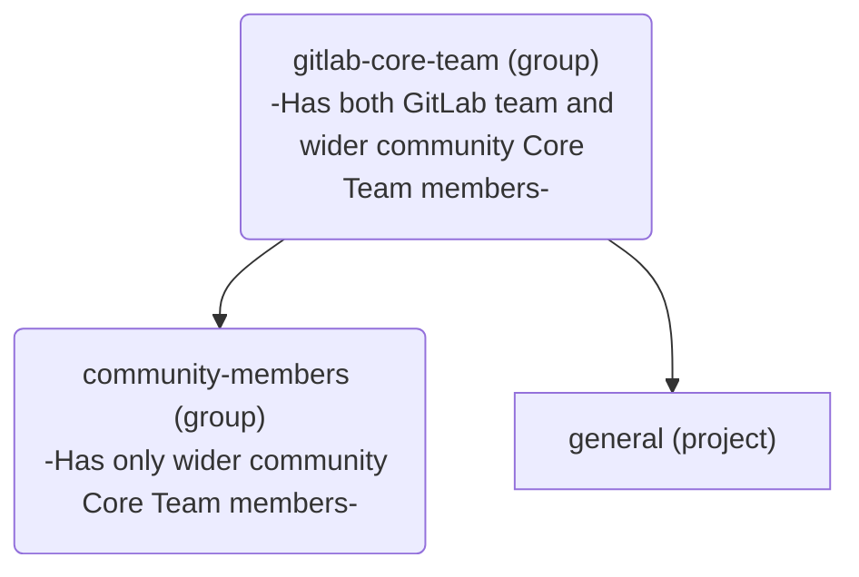

## コアチームメンバーになる

新しいメンバーは、以下の手順を通じていつでも[コアチーム](https://about.gitlab.com/community/core-team/)に追加できます。

1. コアチームメンバーまたは GitLab チームメンバーは、より広いコミュニティから新しいメンバーを、いつでも[コアチームグループ](https://gitlab.com/groups/gitlab-org/gitlab-core-team/-/issues)で機密 Issue を使用して指名できます。これは、起こり得るネガティブなフィードバックを可能な限り最小限の場に留めるためです。
2. 指名された人物は、4 週間以内に現在の全コアチームメンバーの 3 分の 2 (2/3) から賛成票を得て、指名を受諾した場合に、コアチームに追加されます。
3. 新しいメンバーが追加されたら、下記の[コアチームメンバーオリエンテーションセクション](/handbook/marketing/developer-relations/engineering/core-team/#core-team-member-orientation)に示された手順に従って、オンボーディングプロセスを開始します。

## 月次コアチームミーティング

時差やその他の予定のため、コアチームは毎月第 3 火曜日に非同期でミーティングを行います。ミーティングの進行・アジェンダ・メモは、[コアチーム Issue トラッカー](https://gitlab.com/gitlab-org/gitlab-core-team/general/-/issues)で入手できます。すべてのミーティング録画は、[コアチームミーティングのプレイリスト](https://www.youtube.com/playlist?list=PLFGfElNsQthZ12EUkq3N9QlThvkf3WGnZ)で入手できます。

## コアチームメンバーへの連絡

コアチームメンバーには、Issue やマージリクエストで `@gitlab-org/gitlab-core-team` を[メンション](https://docs.gitlab.com/ee/user/group/subgroups/index#mentioning-subgroups)することで連絡できます。

GitLab が主要な連絡手段ですが、コアチームには [#core](https://gitlab.slack.com/messages/core) Slack チャンネルでも連絡できます。

誰でも[コアチーム Issue トラッカー](https://gitlab.com/gitlab-org/gitlab-core-team/general/-/issues)で Issue を開くことができます。

## オフボーディングと円満な退任

コアチームでの活動が続けられなくなった、または興味を失った場合は、`#core` Slack チャンネルでアナウンスすべきです。退任すると、非アクティブな[コアチーム](https://about.gitlab.com/community/core-team/)メンバーになります。コアチームメンバーが退任したら、別のコアチームメンバーが [`offboarding` テンプレート](https://gitlab.com/gitlab-org/gitlab-core-team/general/-/issues/new?issuable_template=offboarding)を使って Issue を作成し、示された手順に従います。

## コアチームメンバーオリエンテーション

1. オリエンテーションプロセスを開始する前に、指名されたメンバーに興味があることを確認するためメールを送ります。
1. [Core Team Member Onboarding Issue Template](https://gitlab.com/gitlab-org/gitlab-core-team/general/-/issues/new?issuable_template=onboarding) を使って[コアチームプロジェクト](https://gitlab.com/gitlab-org/gitlab-core-team/general)に Issue を作成し、示された手順に従います。

   - コアチームメンバーには、アクセス権を付与する前に NDA に署名してもらう必要があります。

## コアチームグループ

すべてのコアチームメンバーは、GitLab.com 上の [`gitlab-org/gitlab-core-team`](https://gitlab.com/gitlab-org/gitlab-core-team/) グループに属しています。このグループは、特定のオートメーション目的のために独自の構造を持っています。

[`community-members`](https://gitlab.com/gitlab-org/gitlab-core-team/community-members) グループは、以下のために存在します。

- [トリアージを促進する](https://gitlab.com/gitlab-org/quality/triage-ops/-/merge_requests/65)、そして
- [コアチームメンバーが changelog でクレジットされるようにする](https://gitlab.com/gitlab-org/gitlab/-/merge_requests/69076)

## コアチームメンバーの特典

コアチームに参加することが意味する信頼・価値・評価の一環として、各メンバーには、コントリビューションを支援するためのいくつかの特典が付与されます。

### Slack アクセス

コアチームメンバーには、[コアチームメンバーオリエンテーション](#core-team-member-orientation)の一環として、[GitLab チームの Slack インスタンスへのアクセス](/handbook/tools-and-tips/slack/#channels-access)が付与されます。

コアがアクセスすべき/しているチャンネルの最新リストは、[Core Team and Slack](https://docs.google.com/spreadsheets/d/1kohQBbvk2JSl3DXrmF5TDsWVoAMi_yujFWzzAP6vq2M/edit#gid=0) の Google Sheets と、以下のリストで確認できます。

#### コアチームがアクセスできる Slack チャンネル

- backend
- backend_maintainers
- backend_pairs
- cfp
- community-programs
- competition
- core
- developer-advocacy
- developer-relations
- developer-relations-community-contributions
- developer-relations-eng-and-programs
- developer-relations-engineering
- developer-relations-hangout
- development
- docs
- docs-tooling
- e2e-run-master
- e2e-run-preprod
- e2e-run-production
- e2e-run-staging
- f_agent_for_kubernetes
- f_api_client-go
- f_graphql
- f_rubocop
- fosdem
- frontend
- frontend_maintainers
- frontend_pairs
- g_development_tooling
- g_development-analytics
- g_engineering_productivity
- g_gitaly
- g_monitor_platform_insights
- g_pajamas-design-system
- g_product-planning
- g_project-management
- g_runner
- g_sscs_pipeline-security
- gck
- gdk
- gdk-gitpod
- gdk-workspaces
- golang
- handbook
- internet-of-things
- is-this-known
- jetbrains-ide-users
- kubernetes
- lang-de
- lang-ja
- lang-ru
- linux
- master-broken
- mr-coaching
- mr-feedback
- opensource
- production
- review-apps-broken
- s_developer_experience
- terraform-provider
- test-platform
- triage
- triage-automations
- tw-team
- ux_coworking
- vim
- website

#### コアチームがアクセスできない Slack チャンネル

- release-post
- security
- questions
- connect-to-contribute
- all-caps
- random
- whats-happening-at-gitlab
- thanks
- diversity_inclusion_and_belonging
- company-fyi
- contribute2021
- ux

#### Slack チャンネルへのコアチームアクセスをリクエストする

1. リクエストする新しいチャンネルを指定して、[アクセスリクエスト](https://gitlab.com/gitlab-com/team-member-epics/access-requests/-/issues/new?issuable_template=Individual_Bulk_Access_Request)を送信してください。
1. その Issue を、次のステップを完了する[デベロッパーリレーションズエンジニアリング](/handbook/marketing/developer-relations/engineering/#team-members)のメンバーに割り当てます。
1. デベロッパーリレーションズエンジニアリングは次を行います。チャンネルのオーナーを特定し、自分のチャンネルにコアチームメンバーを入れることに同意するかどうかをコメントで残してもらうことで、リクエストをレビューするよう招待します。
1. レビューが成功したら、Issue が Slack 管理者に引き渡され/割り当てられ、コアチームメンバーをチャンネルに招待し、上記のリストが更新されます。

コアチームメンバーがアクセスできるすべてのチャンネルでは、チャンネルへの投稿時に [SAFE ガイドライン](/handbook/legal/safe-framework/)に従う必要があります。コアチームメンバーは NDA に署名していますが、GitLab チームメンバーとはみなされません。

### GitLab プロジェクトの Developer 権限

開発体験を向上させるため、コアチームメンバーには、GitLab（プロダクト）のプロジェクトの大部分が存在する [`gitlab-org` グループ](https://gitlab.com/gitlab-org)に対して [`Developer` 権限](https://docs.gitlab.com/ee/user/permissions#group-members-permissions)が付与されます。そのグループ配下のあらゆるプロジェクトについて、他の機能に加えて、これにより以下が可能になります。

- フォークではなくソースプロジェクト上でブランチを作成する
- マージリクエストを割り当てる
- Issue を割り当てる
- ラベルを管理・割り当てる

現時点では、コアチームメンバーは、GitLab という会社に関連するプロジェクトやプロセスに使用される [`gitlab-com` グループ](https://gitlab.com/gitlab-com)には追加されません。

[デベロッパーリレーションズエンジニアリング](/handbook/marketing/developer-relations/engineering/#team-members)は通常、新しいコアチームメンバーのオリエンテーション Issue の一環として、この権限を付与する対応を行います。

### チームページへの掲載

GitLab チームとの関わりや近さを強調し、自身のプロフィールの可視性を高めるため、コアチームメンバーは[自分自身を GitLab チームページに追加](/handbook/about/editing-handbook/#add-yourself-to-the-team-page)し、[デベロッパーリレーションズエンジニアリング](/handbook/marketing/developer-relations/engineering/#team-members)のいずれかのメンバーにレビューを依頼できます。

これにより、[コアチームページ](https://about.gitlab.com/community/core-team/)にもそのプロフィールが掲載されます。

### GitLab の最上位ティアライセンス

コントリビューションを可能にし、GitLab の機能に関する洞察を得るため、コアチームメンバーは[開発目的で無料の最上位ティアライセンスをリクエスト](/handbook/marketing/developer-relations/engineering/community-contributors-workflows#contributing-to-the-gitlab-enterprise-edition-ee)できます。

SaaS またはセルフマネージドインスタンスにおける GitLab の最上位ティアライセンスは、コアチームメンバーに 1 年間付与され、コアチームメンバーの任期中はさらに 1 年間更新できます。あるメンバーが退任を決めたものの、引き続き時々 GitLab にコントリビュートしたい場合でも、GitLab ライセンスの対象であり続けますが、更新期間は[他の GitLab コミュニティメンバーに与えられる標準の 3 ヶ月](/handbook/marketing/developer-relations/engineering/community-contributors-workflows#contributing-to-the-gitlab-enterprise-edition-ee)になります。

コアチームメンバーがリクエストできるシート数に特定の制限はありません。私たちはコアチームメンバーを信頼しており、開発目的で必要なユーザー数を自身の判断で見積もり、ライセンスを営利目的で使用しないことを期待しています。

### JetBrains ライセンス

GitLab へのコードコントリビューションを支援するため、コアチームメンバーは[開発目的で JetBrains ライセンスをリクエスト](/handbook/tools-and-tips/editors-and-ides/jetbrains-ides/)できます。

> 免責事項: 適用される貿易管理法により、以下の国々には払い戻しを提供できません: キューバ、イラン、北朝鮮、シリア、ウクライナ、ロシア、ベラルーシ。このリストは予告なく変更されることがあります。

#### プロセス

- `#core` チームの Slack チャンネルでリクエストを上げます。
- 承認されたら、該当するライセンスを購入します。
- `ap@gitlab.com` に、`nveenhof@gitlab.com` を cc して、以下を含めてメールします。
  - レシートのコピー。
  - 払い戻しのための国際銀行口座情報。
  - @nick_vh が承認の返信をするはずです。
  - AP が払い戻しプロセスを進めます。

### GitLab イベントへのスポンサードアクセス

対面またはバーチャルのイベントでのコントリビューションを支援するため、コアチームメンバーは、GitLab イベント（例: GitLab Contribute、GitLab Commit）へのスポンサードアクセス（参加費、宿泊、交通）の対象となります。

### パーソナライズされたグッズ

時折、GitLab チームは、スタイリッシュにコントリビュートできるよう、コアチームメンバー限定のパーソナライズされたグッズを提供することがあります。
