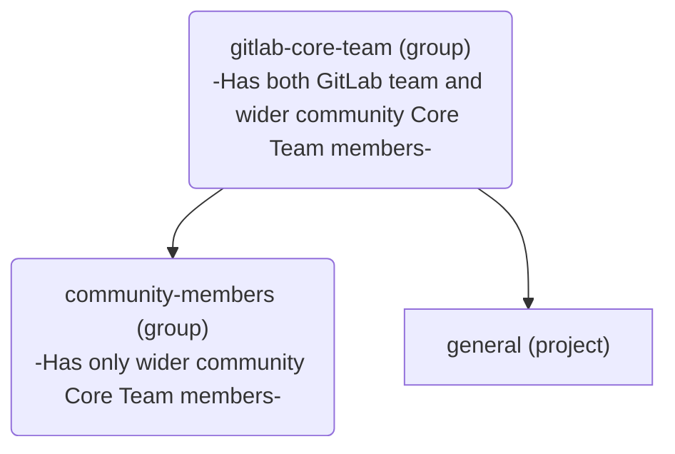

## Core Team member になる

新しい member は、以下の steps を通じていつでも [Core Team](https://about.gitlab.com/community/core-team/) に追加できます:

1. Core Team member または GitLab Team member は、wider community から新しい member をいつでも nominate できます。possible negative feedback を可能な限り小さな setting に limit するため、[Core Team group](https://gitlab.com/groups/gitlab-org/gitlab-core-team/-/issues) の confidential issue を使用します。
2. nominee は、4 週間以内にすべての current core team members の 3 分の 2（2/3）から positive votes を受け取り、nomination を accept した場合、Core Team に追加されます。
3. 新しい member が追加されたら、下の [Core Team member orientation section](/handbook/marketing/developer-relations/engineering/core-team/#core-team-member-orientation) に outline された steps に従って onboarding process を開始します。

## Monthly Core Team meetings

time differences と other commitments のため、Core Team は毎月第 3 火曜日に asynchronously に meeting します。
meeting の call logistics/agenda/notes は [Core Team issue tracker](https://gitlab.com/gitlab-org/gitlab-core-team/general/-/issues) で利用できます。
すべての meeting recordings は [Core Team meeting Playlist](https://www.youtube.com/playlist?list=PLFGfElNsQthZ12EUkq3N9QlThvkf3WGnZ) で利用できます。

## Core Team members への連絡

Core Team members には、issues または merge requests で `@gitlab-org/gitlab-core-team` を [mentioning](https://docs.gitlab.com/ee/user/group/subgroups/index#mentioning-subgroups) することで連絡できます。

GitLab が primary means of contact ですが、Core Team には [#core](https://gitlab.slack.com/messages/core) Slack channel でも連絡できます。

誰でも [Core Team issue tracker](https://gitlab.com/gitlab-org/gitlab-core-team/general/-/issues) に issue を open できます。

## Offboarding and stepping down gracefully

Core Team で serving することができなくなった、または興味がなくなった場合は、`#core` Slack channel で announcement してください。
step down すると inactive [Core Team](https://about.gitlab.com/community/core-team/) member になります。
Core Team member が step down すると、別の Core team member が [`offboarding` template](https://gitlab.com/gitlab-org/gitlab-core-team/general/-/issues/new?issuable_template=offboarding) を使って issue を作成し、outline された steps に従います。

## Core Team Member Orientation

1. orientation process を開始する前に、nominated member に email して興味があることを confirm します。
1. [Core Team Project](https://gitlab.com/gitlab-org/gitlab-core-team/general) で [Core Team Member Onboarding Issue Template](https://gitlab.com/gitlab-org/gitlab-core-team/general/-/issues/new?issuable_template=onboarding) を使って issue を作成し、outline された steps に従います。

   - Core team members は access を付与される前に NDA に sign しなければなりません。

## Core Team Group

すべての Core Team members は、GitLab.com 上の [`gitlab-org/gitlab-core-team`](https://gitlab.com/gitlab-org/gitlab-core-team/) group の一部です。この group は specific automation purposes のために特定の structure を持っています:

[`community-members`](https://gitlab.com/gitlab-org/gitlab-core-team/community-members) group は次のために存在します:

- [triaging を facilitate する](https://gitlab.com/gitlab-org/quality/triage-ops/-/merge_requests/65) こと、および;
- [Core Team members が changelog で credited されることを ensure する](https://gitlab.com/gitlab-org/gitlab/-/merge_requests/69076) こと

## Core Team member benefits

Core Team に加わることが意味する trust、value、recognition の一環として、各 member には contributions を support するいくつかの benefits が付与されます。

### Slack access

Core Team members は [Core Team Member Orientation](#core-team-member-orientation) の一環として、[GitLab team の Slack instance への access](/handbook/tools-and-tips/slack/#channels-access) を付与されます。

Core が access すべき / access している up-to-date channels の list は、[Core Team and Slack](https://docs.google.com/spreadsheets/d/1kohQBbvk2JSl3DXrmF5TDsWVoAMi_yujFWzzAP6vq2M/edit#gid=0) Google Sheets と以下の list にあります:

#### Core Team が access できる Slack channels

- backend
- backend_maintainers
- backend_pairs
- cfp
- community-programs
- competition
- core
- developer-advocacy
- developer-relations
- developer-relations-community-contributions
- developer-relations-eng-and-programs
- developer-relations-engineering
- developer-relations-hangout
- development
- docs
- docs-tooling
- e2e-run-master
- e2e-run-preprod
- e2e-run-production
- e2e-run-staging
- f_agent_for_kubernetes
- f_api_client-go
- f_graphql
- f_rubocop
- fosdem
- frontend
- frontend_maintainers
- frontend_pairs
- g_development_tooling
- g_development-analytics
- g_engineering_productivity
- g_gitaly
- g_monitor_platform_insights
- g_pajamas-design-system
- g_product-planning
- g_project-management
- g_runner
- g_sscs_pipeline-security
- gck
- gdk
- gdk-gitpod
- gdk-workspaces
- golang
- handbook
- internet-of-things
- is-this-known
- jetbrains-ide-users
- kubernetes
- lang-de
- lang-ja
- lang-ru
- linux
- master-broken
- mr-coaching
- mr-feedback
- opensource
- production
- review-apps-broken
- s_developer_experience
- terraform-provider
- test-platform
- triage
- triage-automations
- tw-team
- ux_coworking
- vim
- website

#### Core Team が access できない Slack channels

- release-post
- security
- questions
- connect-to-contribute
- all-caps
- random
- whats-happening-at-gitlab
- thanks
- diversity_inclusion_and_belonging
- company-fyi
- contribute2021
- ux

#### Core Team access to Slack channels を request する

1. requested new channel(s) を含む [access request](https://gitlab.com/gitlab-com/team-member-epics/access-requests/-/issues/new?issuable_template=Individual_Bulk_Access_Request) を submit してください。
1. issue を [Developer Relations Engineering](/handbook/marketing/developer-relations/engineering/#team-members) の member に assign してください。その member が next steps を完了します。
1. Developer Relations Engineering は channel(s) owner を identify し、Core Team members をその channel(s) に入れることに agree するか comment を残して request を review するよう invite します。
1. successful review の後、issue は Slack Admins に handed/assigned され、Core Team members を channels に invite し、上記 list が update されます。

Core Team members が access できるすべての channels は、channel に post するときに [SAFE guidelines](/handbook/legal/safe-framework/) に従うべきです。Core Team Members は NDA に sign していますが、GitLab team members とは見なされません。

### GitLab projects の Developer permissions

development experience を改善するため、Core Team members には GitLab（product）の projects の大多数が存在する [`gitlab-org` group](https://gitlab.com/gitlab-org) で [`Developer` permissions](https://docs.gitlab.com/ee/user/permissions#group-members-permissions) が付与されます。その group 配下の任意の project では、他の abilities とともに次が可能になります:

- forks ではなく source project 上に branches を作成する
- merge requests を assign する
- issues を assign する
- labels を manage and assign する

現時点では、Core Team members は GitLab company に関連する projects and processes に使われる [`gitlab-com` group](https://gitlab.com/gitlab-com) には追加されません。

[Developer Relations Engineering](/handbook/marketing/developer-relations/engineering/#team-members) は、new Core Team member の orientation issue の一環として、通常この permission を付与する action を取ります。

### Team page listing

GitLab team との affiliation and closeness を強調し、profile の visibility を高めるため、Core Team members は [GitLab team page に自分自身を追加](/handbook/about/editing-handbook/#add-yourself-to-the-team-page) し、[Developer Relations Engineering](/handbook/marketing/developer-relations/engineering/#team-members) の任意の member に review を依頼できます。

これにより、その profile は [Core Team page](https://about.gitlab.com/community/core-team/) にも掲載されます。

### GitLab top tier license

contributions を可能にし、GitLab capabilities への insight を得るため、Core Team members は [development purposes 向けの free top tier license を request](/handbook/marketing/developer-relations/engineering/community-contributors-workflows#contributing-to-the-gitlab-enterprise-edition-ee) できます。

SaaS または self-managed instances の GitLab top tier licenses は Core Team members に 1 年間付与され、Core Team member term 中にさらに 1 年 renew できます。member が step down しても GitLab に時折 contribute したい場合は、引き続き GitLab license の eligible ですが、renewal period は他の GitLab community members に与えられる [standard 3 months](/handbook/marketing/developer-relations/engineering/community-contributors-workflows#contributing-to-the-gitlab-enterprise-edition-ee) になります。

Core Team members が request できる seats の数に specific limit はありません。私たちは Core Team members が development purposes に必要な users 数を自分の judgment で estimate し、for-profit purposes に license を使わないことを trust します。

### JetBrains license

GitLab への code contributions を support するため、Core Team members は [development purposes 向け JetBrains license を request](/handbook/tools-and-tips/editors-and-ides/jetbrains-ides/) できます。

> Disclaimer: applicable trade control law により、Cuba、Iran、North Korea、Syria、Ukraine、Russia、Belarus には reimbursement を提供できません。この list は予告なく変更される場合があります。

#### Process

- `#core` team slack channel で request を raise する。
- approve されたら、relevant license を purchase する。
- `ap@gitlab.com` に email し、`nveenhof@gitlab.com` を cc に含める。次を含めます:
  - receipt の copy。
  - reimbursement のための international bank details。
  - @nick_vh は approval を reply するべきです。
  - AP が reimbursement process を進めます。

### GitLab events への sponsored access

in-person または virtual events での contribution を support するため、Core Team members は GitLab events（例: GitLab Contribute、GitLab Commit）への sponsored access（subscription、accommodation、travel）の eligible になります。

### Personalized merchandise

時折、GitLab team は Core Team members 限定の personalized merchandise を提供し、style をもって contribute できるようにする場合があります。
