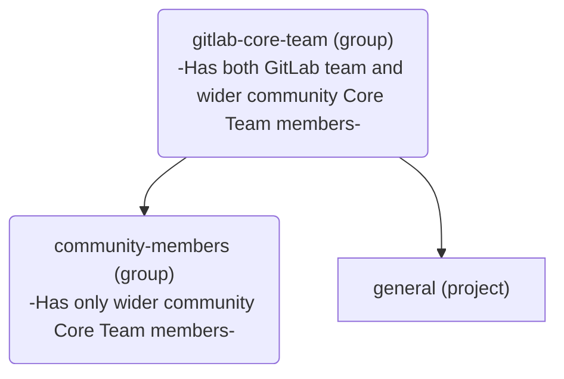

## Core Team メンバーになる

新しいメンバーは、以下のステップを通じていつでも [Core Team](https://about.gitlab.com/community/core-team/) に追加できます:

1. Core Team メンバーまたは GitLab チームメンバーは、より広いコミュニティから新しいメンバーをいつでも推薦できます。否定的なフィードバックの可能性をできるだけ小さな場に限定するため、[Core Team グループ](https://gitlab.com/groups/gitlab-org/gitlab-core-team/-/issues) の Confidential Issue を使用します。
2. 推薦された人は、4 週間以内に現在の Core Team メンバー全員の 3 分の 2（2/3）から賛成票を受け取り、推薦を受け入れた場合、Core Team に追加されます。
3. 新しいメンバーが追加されたら、下の [Core Team メンバーオリエンテーションセクション](/handbook/marketing/developer-relations/engineering/core-team/#core-team-member-orientation) に概説されたステップに従ってオンボーディングプロセスを開始します。

## 月次 Core Team ミーティング

時差やその他の都合があるため、Core Team は毎月第 3 火曜日に非同期でミーティングを行います。
ミーティングの通話ロジスティクス、アジェンダ、メモは [Core Team Issue トラッカー](https://gitlab.com/gitlab-org/gitlab-core-team/general/-/issues) で利用できます。
すべてのミーティング録画は [Core Team ミーティングプレイリスト](https://www.youtube.com/playlist?list=PLFGfElNsQthZ12EUkq3N9QlThvkf3WGnZ) で利用できます。

## Core Team メンバーへの連絡

Core Team メンバーには、Issue または Merge Request で `@gitlab-org/gitlab-core-team` を[メンション](https://docs.gitlab.com/ee/user/group/subgroups/index#mentioning-subgroups)することで連絡できます。

GitLab が主な連絡手段ですが、Core Team には [#core](https://gitlab.slack.com/messages/core) Slack チャンネルでも連絡できます。

誰でも [Core Team Issue トラッカー](https://gitlab.com/gitlab-org/gitlab-core-team/general/-/issues) で Issue を作成できます。

## オフボーディングと円滑な退任

Core Team で務め続けることができなくなった、または興味がなくなった場合は、`#core` Slack チャンネルで告知してください。
退任すると、非アクティブな [Core Team](https://about.gitlab.com/community/core-team/) メンバーになります。
Core Team メンバーが退任すると、別の Core Team メンバーが [`offboarding` テンプレート](https://gitlab.com/gitlab-org/gitlab-core-team/general/-/issues/new?issuable_template=offboarding) を使って Issue を作成し、概説されたステップに従います。

## Core Team メンバーオリエンテーション {#core-team-member-orientation}

1. オリエンテーションプロセスを開始する前に、推薦されたメンバーにメールを送り、関心があることを確認します。
1. [Core Team Project](https://gitlab.com/gitlab-org/gitlab-core-team/general) で [Core Team Member Onboarding Issue Template](https://gitlab.com/gitlab-org/gitlab-core-team/general/-/issues/new?issuable_template=onboarding) を使って Issue を作成し、概説されたステップに従います。

   - Core Team メンバーはアクセスを付与される前に NDA に署名しなければなりません。

## Core Team グループ

すべての Core Team メンバーは、GitLab.com 上の [`gitlab-org/gitlab-core-team`](https://gitlab.com/gitlab-org/gitlab-core-team/) グループの一部です。このグループは、特定の自動化目的のために固有の構造を持っています:

[`community-members`](https://gitlab.com/gitlab-org/gitlab-core-team/community-members) グループは次のために存在します:

- [トリアージを促進する](https://gitlab.com/gitlab-org/quality/triage-ops/-/merge_requests/65)こと、および;
- [Core Team メンバーが changelog にクレジットされるようにする](https://gitlab.com/gitlab-org/gitlab/-/merge_requests/69076)こと

## Core Team メンバーの特典

Core Team に加わることが意味する信頼、価値、認知の一環として、各メンバーには貢献を支援するいくつかの特典が付与されます。

### Slack アクセス

Core Team メンバーは [Core Team メンバーオリエンテーション](#core-team-member-orientation) の一環として、[GitLab チームの Slack インスタンスへのアクセス](/handbook/tools-and-tips/slack/#channels-access)を付与されます。

Core Team がアクセスすべき、またはアクセスしている最新のチャンネル一覧は、[Core Team and Slack](https://docs.google.com/spreadsheets/d/1kohQBbvk2JSl3DXrmF5TDsWVoAMi_yujFWzzAP6vq2M/edit#gid=0) Google Sheets と以下の一覧にあります:

#### Core Team がアクセスできる Slack チャンネル

- backend
- backend_maintainers
- backend_pairs
- cfp
- community-programs
- competition
- core
- developer-advocacy
- developer-relations
- developer-relations-community-contributions
- developer-relations-eng-and-programs
- developer-relations-engineering
- developer-relations-hangout
- development
- docs
- docs-tooling
- e2e-run-master
- e2e-run-preprod
- e2e-run-production
- e2e-run-staging
- f_agent_for_kubernetes
- f_api_client-go
- f_graphql
- f_rubocop
- fosdem
- frontend
- frontend_maintainers
- frontend_pairs
- g_development_tooling
- g_development-analytics
- g_engineering_productivity
- g_gitaly
- g_monitor_platform_insights
- g_pajamas-design-system
- g_product-planning
- g_project-management
- g_runner
- g_sscs_pipeline-security
- gck
- gdk
- gdk-gitpod
- gdk-workspaces
- golang
- handbook
- internet-of-things
- is-this-known
- jetbrains-ide-users
- kubernetes
- lang-de
- lang-ja
- lang-ru
- linux
- master-broken
- mr-coaching
- mr-feedback
- opensource
- production
- review-apps-broken
- s_developer_experience
- terraform-provider
- test-platform
- triage
- triage-automations
- tw-team
- ux_coworking
- vim
- website

#### Core Team がアクセスできない Slack チャンネル

- release-post
- security
- questions
- connect-to-contribute
- all-caps
- random
- whats-happening-at-gitlab
- thanks
- diversity_inclusion_and_belonging
- company-fyi
- contribute2021
- ux

#### Core Team の Slack チャンネルアクセスをリクエストする

1. リクエストする新しいチャンネルを含む[アクセスリクエスト](https://gitlab.com/gitlab-com/team-member-epics/access-requests/-/issues/new?issuable_template=Individual_Bulk_Access_Request)を送信してください。
1. Issue を [Developer Relations Engineering](/handbook/marketing/developer-relations/engineering/#team-members) のメンバーにアサインしてください。そのメンバーが次のステップを完了します。
1. Developer Relations Engineering はチャンネルオーナーを特定し、Core Team メンバーをそのチャンネルに参加させることに同意するかどうかコメントを残してリクエストをレビューするよう依頼します。
1. レビューが成功した後、Issue は Slack Admins に引き渡し／アサインされ、Core Team メンバーがチャンネルに招待され、上記の一覧が更新されます。

Core Team メンバーがアクセスできるすべてのチャンネルでは、チャンネルに投稿するときに [SAFE ガイドライン](/handbook/legal/safe-framework/)に従うべきです。Core Team メンバーは NDA に署名していますが、GitLab チームメンバーとは見なされません。

### GitLab プロジェクトの Developer 権限

開発体験を改善するため、Core Team メンバーには GitLab（製品）のプロジェクトの大多数が存在する [`gitlab-org` グループ](https://gitlab.com/gitlab-org)で [`Developer` 権限](https://docs.gitlab.com/ee/user/permissions#group-members-permissions)が付与されます。そのグループ配下の任意のプロジェクトでは、他の機能とともに次が可能になります:

- fork ではなくソースプロジェクト上にブランチを作成する
- Merge Request をアサインする
- Issue をアサインする
- ラベルを管理しアサインする

現時点では、Core Team メンバーは GitLab 社に関連するプロジェクトとプロセスに使われる [`gitlab-com` グループ](https://gitlab.com/gitlab-com)には追加されません。

[Developer Relations Engineering](/handbook/marketing/developer-relations/engineering/#team-members) は、新しい Core Team メンバーのオリエンテーション Issue の一環として、通常この権限を付与する作業を行います。

### チームページへの掲載

GitLab チームとの所属関係と近さを強調し、プロフィールの可視性を高めるため、Core Team メンバーは [GitLab チームページに自分自身を追加](/handbook/about/editing-handbook/#add-yourself-to-the-team-page)し、[Developer Relations Engineering](/handbook/marketing/developer-relations/engineering/#team-members) の任意のメンバーにレビューを依頼できます。

これにより、そのプロフィールは [Core Team ページ](https://about.gitlab.com/community/core-team/)にも掲載されます。

### GitLab 最上位ティアライセンス

貢献を可能にし、GitLab の機能への洞察を得るため、Core Team メンバーは[開発目的の無料最上位ティアライセンスをリクエスト](/handbook/marketing/developer-relations/engineering/community-contributors-workflows#contributing-to-the-gitlab-enterprise-edition-ee)できます。

SaaS またはセルフマネージドインスタンスの GitLab 最上位ティアライセンスは Core Team メンバーに 1 年間付与され、Core Team メンバーの任期中にさらに 1 年更新できます。メンバーが退任しても GitLab に時折貢献したい場合は、引き続き GitLab ライセンスの対象になりますが、更新期間は他の GitLab コミュニティメンバーに与えられる[標準の 3 か月](/handbook/marketing/developer-relations/engineering/community-contributors-workflows#contributing-to-the-gitlab-enterprise-edition-ee)になります。

Core Team メンバーがリクエストできるシート数に具体的な上限はありません。私たちは、Core Team メンバーが開発目的に必要なユーザー数を自身の判断で見積もり、営利目的でライセンスを使わないことを信頼しています。

### JetBrains ライセンス

GitLab へのコード貢献を支援するため、Core Team メンバーは[開発目的の JetBrains ライセンスをリクエスト](/handbook/tools-and-tips/editors-and-ides/jetbrains-ides/)できます。

> 免責事項: 適用される貿易管理法により、Cuba、Iran、North Korea、Syria、Ukraine、Russia、Belarus には払い戻しを提供できません。このリストは予告なく変更される場合があります。

#### プロセス

- `#core` チーム Slack チャンネルでリクエストを上げる。
- 承認されたら、該当するライセンスを購入する。
- `ap@gitlab.com` にメールし、`nveenhof@gitlab.com` を cc に含める。次を含めます:
  - 領収書のコピー。
  - 払い戻しのための国際銀行口座情報。
  - @nick_vh は承認を返信する必要があります。
  - AP が払い戻しプロセスを進めます。

### GitLab イベントへのスポンサー付きアクセス

対面またはバーチャルイベントでの貢献を支援するため、Core Team メンバーは GitLab イベント（例: GitLab Contribute、GitLab Commit）へのスポンサー付きアクセス（サブスクリプション、宿泊、移動）の対象になります。

### パーソナライズされたグッズ

時折、GitLab チームは Core Team メンバー限定のパーソナライズされたグッズを提供し、スタイルをもって貢献できるようにする場合があります。
