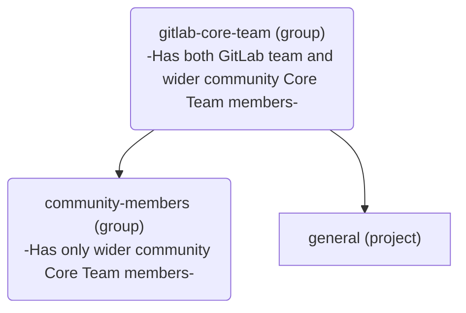

## コアチームメンバーになる

新しいメンバーは以下の手順を通じて、いつでも[コアチーム](https://about.gitlab.com/community/core-team/)に追加できます:

1. コアチームメンバーまたは GitLab チームメンバーは、より広いコミュニティから新しいメンバーを、いつでも[コアチームグループ](https://gitlab.com/groups/gitlab-org/gitlab-core-team/-/issues)で機密 Issue を使用して指名できます。これは、起こり得るネガティブなフィードバックを最小限の場に留めるためです。
2. 指名された人は、4 週間以内に現在のすべてのコアチームメンバーの 3 分の 2 (2/3) から賛成票を得て、指名を受諾した場合にコアチームに加わります。
3. 新しいメンバーが追加されたら、以下の[コアチームメンバーオリエンテーションのセクション](/handbook/marketing/developer-relations/engineering/core-team/#core-team-member-orientation)に記載されている手順に従ってオンボーディングプロセスを開始します。

## 月次コアチームミーティング

時差やその他のコミットメントのため、コアチームは毎月第 3 火曜日に非同期で開催されます。
ミーティングのロジスティクス/アジェンダ/ノートは、[コアチーム Issue トラッカー](https://gitlab.com/gitlab-org/gitlab-core-team/general/-/issues)で確認できます。
すべてのミーティング録画は、[コアチームミーティングプレイリスト](https://www.youtube.com/playlist?list=PLFGfElNsQthZ12EUkq3N9QlThvkf3WGnZ)で視聴できます。

## コアチームメンバーへの連絡

コアチームメンバーには、Issue やマージリクエストで `@gitlab-org/gitlab-core-team` を[メンション](https://docs.gitlab.com/ee/user/group/subgroups/index#mentioning-subgroups)することで連絡できます。

GitLab が主な連絡手段ですが、コアチームには [#core](https://gitlab.slack.com/messages/core) Slack チャンネルでも連絡できます。

誰でも[コアチーム Issue トラッカー](https://gitlab.com/gitlab-org/gitlab-core-team/general/-/issues)で Issue を作成できます。

## オフボーディングと円満な辞退

コアチームでの活動を続けることが難しくなった場合、または興味を失った場合は、`#core` Slack チャンネルでアナウンスする必要があります。
辞退すると、非アクティブな[コアチーム](https://about.gitlab.com/community/core-team/)メンバーになります。
コアチームメンバーが辞退したら、別のコアチームメンバーが [`offboarding` テンプレート](https://gitlab.com/gitlab-org/gitlab-core-team/general/-/issues/new?issuable_template=offboarding)を使用して Issue を作成し、記載されている手順に従います。

## コアチームメンバーオリエンテーション

1. 指名されたメンバーに、オリエンテーションプロセスを開始する前に興味があるかどうかを確認するメールを送ります。
1. [Core Team Member Onboarding Issue Template](https://gitlab.com/gitlab-org/gitlab-core-team/general/-/issues/new?issuable_template=onboarding) を使用して、[Core Team Project](https://gitlab.com/gitlab-org/gitlab-core-team/general) で Issue を作成し、記載されている手順に従います。

   - コアチームメンバーには、いかなるアクセスを付与する前に NDA への署名が必要です。

## コアチームグループ

すべてのコアチームメンバーは、GitLab.com の [`gitlab-org/gitlab-core-team`](https://gitlab.com/gitlab-org/gitlab-core-team/) グループに所属しています。このグループは、特定の自動化目的のために特別な構造を持っています:

[`community-members`](https://gitlab.com/gitlab-org/gitlab-core-team/community-members) グループは、以下の目的で存在します:

- [トリアージを促進する](https://gitlab.com/gitlab-org/quality/triage-ops/-/merge_requests/65) ため、および
- [コアチームメンバーが changelog にクレジットされることを保証する](https://gitlab.com/gitlab-org/gitlab/-/merge_requests/69076) ため

## コアチームメンバーの特典

コアチームに加わることが意味する信頼、価値、認識の一環として、各メンバーには貢献をサポートするためのさまざまな特典が付与されます。

### Slack アクセス

コアチームメンバーには、[コアチームメンバーオリエンテーション](#core-team-member-orientation)の一環として、[GitLab チームの Slack インスタンスへのアクセス](/handbook/tools-and-tips/slack/#channels-access)が付与されます。

コアチームがアクセスできる/すべき最新のチャンネルリストは、[Core Team and Slack](https://docs.google.com/spreadsheets/d/1kohQBbvk2JSl3DXrmF5TDsWVoAMi_yujFWzzAP6vq2M/edit#gid=0) Google Sheets と以下のリストで確認できます:

{}
- backend
- backend_maintainers
- backend_pairs
- cfp
- community-programs
- competition
- core
- developer-advocacy
- developer-relations
- developer-relations-community-contributions
- developer-relations-eng-and-programs
- developer-relations-engineering
- developer-relations-hangout
- development
- docs
- docs-tooling
- e2e-run-master
- e2e-run-preprod
- e2e-run-production
- e2e-run-staging
- f_agent_for_kubernetes
- f_api_client-go
- f_graphql
- f_rubocop
- fosdem
- frontend
- frontend_maintainers
- frontend_pairs
- g_development_tooling
- g_development-analytics
- g_engineering_productivity
- g_gitaly
- g_monitor_platform_insights
- g_pajamas-design-system
- g_product-planning
- g_project-management
- g_runner
- g_sscs_pipeline-security
- gck
- gdk
- gdk-gitpod
- gdk-workspaces
- golang
- handbook
- internet-of-things
- is-this-known
- jetbrains-ide-users
- kubernetes
- lang-de
- lang-ja
- lang-ru
- linux
- master-broken
- mr-coaching
- mr-feedback
- opensource
- production
- review-apps-broken
- s_developer_experience
- terraform-provider
- test-platform
- triage
- triage-automations
- tw-team
- ux_coworking
- vim
- website
{}

{}
- release-post
- security
- questions
- connect-to-contribute
- all-caps
- random
- whats-happening-at-gitlab
- thanks
- diversity_inclusion_and_belonging
- company-fyi
- contribute2021
- ux
{}

#### Slack チャンネルへのコアチームアクセスのリクエスト

1. リクエストする新しいチャンネルを記載した[アクセスリクエスト](https://gitlab.com/gitlab-com/team-member-epics/access-requests/-/issues/new?issuable_template=Individual_Bulk_Access_Request)を提出してください。
1. Issue を [Developer Relations Engineering](/handbook/marketing/developer-relations/engineering/#team-members) のメンバーにアサインします。彼らが次のステップを完了します。
1. Developer Relations Engineering は、チャンネルのオーナーを特定し、コアチームメンバーをチャンネルに迎え入れることに同意するかどうかをコメントで確認するようリクエストをレビューしてもらいます。
1. レビューが成功した後、Issue は Slack 管理者に引き継がれ/アサインされ、コアチームメンバーをチャンネルに招待し、上記のリストが更新されます。

コアチームメンバーがアクセスできるすべてのチャンネルでは、投稿時に [SAFE ガイドライン](/handbook/legal/safe-framework/)に従う必要があります。コアチームメンバーは NDA に署名しているにも関わらず、GitLab チームメンバーとは見なされません。

### GitLab プロジェクトの Developer 権限

開発体験を向上させるため、コアチームメンバーには、GitLab (製品) のプロジェクトの大半が存在する [`gitlab-org` グループ](https://gitlab.com/gitlab-org)で [`Developer` 権限](https://docs.gitlab.com/ee/user/permissions#group-members-permissions)が付与されます。このグループ配下のすべてのプロジェクトに対して、他の機能の中でも特に以下のことが可能になります:

- フォークではなくソースプロジェクトでブランチを作成する
- マージリクエストをアサインする
- Issue をアサインする
- ラベルを管理しアサインする

現時点では、コアチームメンバーは GitLab 社に関連するプロジェクトやプロセスに使用される [`gitlab-com` グループ](https://gitlab.com/gitlab-com)には追加されません。

[Developer Relations Engineering](/handbook/marketing/developer-relations/engineering/#team-members) は、新しいコアチームメンバーのオリエンテーション Issue の一環として、通常この権限を付与します。

### チームページへの掲載

GitLab チームへの所属と親密さを強調し、プロフィールの可視性を高めるため、コアチームメンバーは [GitLab チームページに自分を追加](/handbook/about/editing-handbook/#add-yourself-to-the-team-page)し、[Developer Relations Engineering](/handbook/marketing/developer-relations/engineering/#team-members) のメンバーにレビューを依頼できます。

これにより、彼らのプロフィールが[コアチームページ](https://about.gitlab.com/community/core-team/)にも掲載されます。

### GitLab トップティアライセンス

貢献を可能にし、GitLab の機能に関する洞察を得るため、コアチームメンバーは[開発目的で無料のトップティアライセンスをリクエスト](/handbook/marketing/developer-relations/engineering/community-contributors-workflows#contributing-to-the-gitlab-enterprise-edition-ee)できます。

SaaS またはセルフマネージドインスタンスにおける GitLab トップティアライセンスは、コアチームメンバーに 1 年間付与され、コアチームメンバーの任期中はもう 1 年間更新できます。メンバーが辞退することを決定したものの、引き続き GitLab に時々貢献したい場合でも、GitLab ライセンスの対象となりますが、更新期間は[他の GitLab コミュニティメンバーに与えられる標準の 3 か月](/handbook/marketing/developer-relations/engineering/community-contributors-workflows#contributing-to-the-gitlab-enterprise-edition-ee)になります。

コアチームメンバーがリクエストできるシート数に特定の制限はありません。コアチームメンバーが開発目的で必要なユーザー数を見積もる際に、自分自身の判断を使用すること、そしてライセンスを営利目的で使用しないことを信頼しています。

### JetBrains ライセンス

GitLab へのコード貢献をサポートするため、コアチームメンバーは[開発目的で JetBrains ライセンスをリクエスト](/handbook/tools-and-tips/editors-and-ides/jetbrains-ides/)できます。

> 免責事項: 適用される貿易管理法により、以下の国への払い戻しは行えません: キューバ、イラン、北朝鮮、シリア、ウクライナ、ロシア、ベラルーシ。このリストは予告なく変更される場合があります。

#### プロセス

- `#core` チームの slack チャンネルでリクエストを投稿します。
- 承認されたら、関連するライセンスを購入します。
- `ap@gitlab.com` に `nveenhof@gitlab.com` を CC して、以下を含めてメールします:
  - 領収書のコピー
  - 払い戻しのための国際銀行口座情報
  - @nick_vh が承認の返信をします
  - AP が払い戻しプロセスを進めます

### GitLab イベントへのスポンサーアクセス

対面または仮想イベントでの貢献をサポートするため、コアチームメンバーは GitLab イベント (例: GitLab Contribute、GitLab Commit) へのスポンサーアクセス (購読、宿泊、旅行) の対象となります。

### パーソナライズされたグッズ

GitLab チームは、コアチームメンバー専用のパーソナライズされたグッズを時折提供し、スタイリッシュに貢献できるようにすることがあります！
