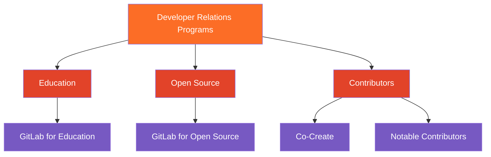

これらのオペレーショナルガイドラインは、Developer Relations Programs チームの運営、コラボレーション、業務遂行の方法を定義します。これらは、Education、Open Source、Contributors の各エコシステム向けに一貫した高品質のプログラムを提供することを可能にする構造的基盤と共有プロセスを提供します。私たちは、計画・コラボレーション・実行の管理に GitLab を使用することで、自社製品への深い理解を培っています。

## 構造

私たちの活動および関連リソースは、GitLab.org プロジェクト下の Developer Relations 配下にある [Strategy Program](https://gitlab.com/gitlab-org/developer-relations/strategy-programs) サブグループにあります。ここには私たちのプログラムやその他の運用活動が含まれています。

### チーム活動

特定のプログラムに紐づかない運用タスクは、[Developer Relations Programs team-task](https://gitlab.com/gitlab-org/developer-relations/strategy-programs/team-task) の Issue として記録します。この [Issue ボード](https://gitlab.com/gitlab-org/developer-relations/strategy-programs/team-task/-/boards) では、運用業務量をステータスごとに確認できます。

### プログラム活動

プログラムに関連する活動は、関連サブグループ（Contributors、Education、Open Source）配下の対応するプロジェクトに、エピックおよび Issue として記録されます。

**エピック** では、時間制限のある複雑な活動を記録し、OKR に貢献するアウトカムを把握できます。

**Issue** では、エピックやその他のプログラム業務を実行するために必要な個別タスクを記録できます。

たとえば Co-Create では、オンボーディングから初回コントリビューションまでの顧客ライフサイクルを追跡するエピックと、オンボーディングワークショップを追跡する Issue が作成されます。GitLab for Education では、ブログ記事のアイデア出しからソーシャルメディアでのプロモーションまでを追跡するエピックと、顧客とのコンテンツ執筆を行う Issue が作成されます。

## モニタリングとレポート

### GitLab ボード

* [OKR](https://gitlab.com/gitlab-com/gitlab-OKRs/-/issues/?sort=updated_desc&state=opened&label_name%5B%5D=Division%3A%3AMarketing&label_name%5B%5D=Department%3A%3ADevRel%20%26%20Strategy&first_page_size=20)

* [四半期ごとのエピック](https://gitlab.com/groups/gitlab-org/developer-relations/strategy-programs/-/epic_boards/2073660): 各四半期に期待されるアウトプットのビュー

* [ステータスごとの Issue](https://gitlab.com/groups/gitlab-org/developer-relations/strategy-programs/-/boards/9764050): チームが実行する個別タスクのパイプラインビュー

* [チームメンバーごとの Issue](https://gitlab.com/groups/gitlab-org/developer-relations/strategy-programs/-/boards/9764111): チームメンバーごとの作業量とバックログ（[現在のものを見るには status:In dev でフィルター](https://gitlab.com/groups/gitlab-org/developer-relations/strategy-programs/-/boards/9764111?status=In%20dev)）

* プログラム固有のボード: 対応するハンドブックのプログラムページを確認してください

### ダッシュボード

* [Tableau: Education and OSS](https://10az.online.tableau.com/#/site/gitlab/views/CommunityEDUAndOSSSubscriptionDashboard/CommunityEDUOSSSubscriptionAccountDashboard)

### 主要指標

**Total Members**

特定のプログラムに登録し、積極的に参加しているメンバー数。

* Education: 期限切れでない EDU プログラムライセンスを持つメンバー
* Co-Create: 初回ワークショップを完了し、特定の四半期に少なくとも 1 件のコントリビューションを行ったメンバー

**New References**

新しい "Reference"（参照） とは、マーケティングまたは営業目的で参照可能な資料を提供することに同意したプログラムメンバーアドボケイトです。

次の活動の 1 つ以上を含むことができます:

* マーケティング資料用の文書による証言や事例研究の引用
* 顧客の事例研究や成功事例（テキストまたはビデオ）
* 営業プロセス中の見込み顧客とのリファレンスコール
* ウェブサイト・プレゼンテーション・販促資料用のロゴ使用権
* ブログ記事や記事（執筆または共同執筆）
* イベント、ウェビナー、カンファレンスでの講演機会
* ライブ証言や録音インタビュー
* レビューサイトへの投稿（G2、Gartner Peer Insights など）
* プレスリリースやメディア引用

基準:

* メンバーは参照されることに明示的に同意する必要があります
* 参照は文書化される必要があります（署名済み合意書、メールでの確認など）
* 参照は定義された期間（例: 12 か月）内で使用可能である必要があります
* 参照を提供する個人は、自分の組織を代表して発言する適切な権限を持っている必要があります

## ステータス

ステータス

* `New` - 新たに提出された Issue の出発点
* `Refinement` - さらに情報が必要
* `Validation backlog` - 優先順位付けされていない、将来再検討する
* `Planning breakdown` - 仕掛中、計画段階
* `In dev` - 仕掛中、実行段階
* `Blocked` - 進捗がブロックされており、追加のサポートまたはエスカレーションが必要

Issue は次の理由でクローズされます:

* `Complete` - 活動が完了
* `Duplicate` - オープンな Issue へのリンクと共にクローズすべき
* `Won't do` - 今後対応しない項目

## ラベル

エピックには `FYXX::QX` のラベルが付与され、活動完了が期待される会計年度と四半期に対応します。

Issue とエピックには、`Strategy Programs::GitLab for Education` や `Strategy programs::Co-Create` などの特定のプログラムラベルが付与されます。特定のプログラムに該当しない場合は `Strategy Programs` ラベルを使用します。

OKR には、対応する `FYXX::QX` と共に `OKR` ラベルが付与されます。
